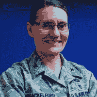
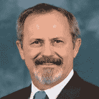

<!--yml
category: 未分类
date: 2024-05-27 14:24:48
-->

# DARPA Triage Challenge | Home

> 来源：[https://triagechallenge.darpa.mil/](https://triagechallenge.darpa.mil/)

## Challenge Info

### DARPA Triage Challenge

The DARPA Triage Challenge (DTC) will use a series of challenge events to spur development of novel physiological features for medical triage. The DARPA Triage Challenge aims to drive breakthrough innovations in identification of “signatures” of injury that will help medical responders perform scalable, timely, and accurate triage. Of particular interest are mass casualty incidents (MCIs), in both civilian and military settings, when medical resources are limited relative to the need.

#### Vision

1.  A primary stage of MCI triage supported by sensors on stand-off platforms, such as uncrewed aircraft vehicles (UAVs) or robots, and algorithms that analyze sensor data in real-time to identify casualties for urgent hands-on evaluation by medical personnel.
2.  A secondary stage, after the most urgent casualties have been treated, supported by non-invasive contact sensors placed on casualties and algorithms that analyze sensor data in real-time to predict need for life-saving.

## Insights

> Since the time of Napoleon, the principles of triage for war casualties have involved prioritizing casualties for treatment in accordance with the gravity of injury and urgency for medical care, regardless of rank or nationality. These principles have withstood the test of time, however there is potential that modern science can greatly improve the speed and accuracy of triage.
> 
> The nature and scale of a massive casualty event will affect the care that can be delivered and the time to care delivery. For very large scale events, only those treatments provided by casualties themselves or bystanders already on scene are likely to be delivered quickly enough to affect survival, and advances are needed to augment their capabilities. By contrast, in more limited events, time is of the essence to rapidly identify those casualties with critical but survivable injuries in order to delivery maximal lifesaving interventions as quickly as possible.
> 
> The military seeks to discover innovations to prolong the timeline of survival and to deliver novel capabilities at the point of injury during massive casualty events.
> 
> 
> 
> **Stacy Shackelford, Col, USAF, MC**
> Trauma Medical Director
> DHA Colorado Springs Market

> With this new challenge, DARPA will update the way we perform the triage of mass casualties on the battlefield or in the civilian setting. By deploying remote technologies, we can better ensure that we get the right patients to the right level of care in the right time. I look forward to learning if “triage signatures” can deliver on their promise.
> 
> 
> 
> **Jeremy Brown, MD**
> Director of the Office of Emergency Care Research
> NINDS/NIH

> We are not prepared for a catastrophic mass casualty event. Accurate triage is difficult in any setting, but particularly after a mass casualty incident that involves dozens, hundreds, or even thousands of patients. Humans alone struggle under the chaos and stress - research has found that in mass casualty settings recommended triage methods are often not used or inaccurately applied. DARPA’s work to bring technology to triage to improve the capacity and accuracy of triage in both the battlefield and civilian settings is critical to improve our Nation’s preparedness.
> 
> 
> 
> **Thomas D. Kirsch, MD, MPH, FACEP**
> Professor and Director
> National Center for Disaster Medicine and Public Health
> Uniformed Services University