<!--yml

类别：未分类

日期：2024-05-27 14:24:19

-->

# 将内容显示为图形：一种探索|这是重要的

> 来源：[https://thisisimportant.net/posts/content-as-a-graph/](https://thisisimportant.net/posts/content-as-a-graph/)

大多数网页内容都设计成以严格的层次结构、基于树或其他形式显示。如果不是呢？

## 将内容显示为图形意味着什么？

内容不必严格按层次结构显示，可以将内容放置在层次结构内的多个类别中，使用[多层次结构](https://www.nngroup.com/articles/polyhierarchy/)，或者将其显示为网络中的一系列互连节点——一个图。

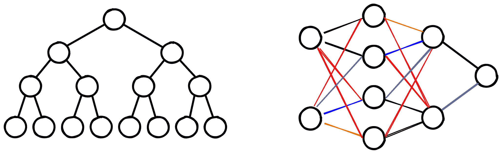

将内容显示为图形可以在技术内容中直观地传达思想、任务和主题之间的关系。层次结构也可以做到这一点，但并不总是与技术内容中思想和概念之间的实际关系相匹配。

图形可能提供了更灵活的呈现方式，但内容通常在网页上按层次结构显示。为什么呢？

## 为什么层次结构很常见

层次结构很常见，因为它们符合解释新概念或主题的典型方式——你首先概述一下，简要介绍几个重要的事物及其如何相互关联，然后逐步提供有关每个事物的更多信息。

例如，如果我想教你如何制作音乐，我不会从如何乐器工作以产生声音的深入解释开始。相反，我将从一个高层次的讨论开始，讨论音乐中涉及的组件：一首歌、一个乐器、音阶、调号、节奏，然后深入讨论如何使用这些组件写音乐等更复杂的主题。

+   如何制作音乐

    +   什么是一首歌

        +   什么是勾

        +   什么是一节

        +   什么是合唱

        +   什么是桥段

    +   什么是乐器？

        +   不同类型的乐器

            +   弦乐器

            +   管乐器

            +   铜管乐器

            +   打击乐器

        +   如何调音

    +   音乐的组成部分是什么

        +   音阶的类型

        +   旋律与和声

        +   节拍和拍子记号

        +   调号

    +   如何写音乐

        +   如何写一个勾

        +   如何写一节

        +   如何写合唱

        +   如何写一个桥段

    +   乐器是如何工作的

扫描项目列表并按照代表信息和知识的逻辑进展的层次结构是相当容易的。

层次结构还模仿了传统的信息显示方式——作为一本书，其中的章节代表了内容的层次结构。

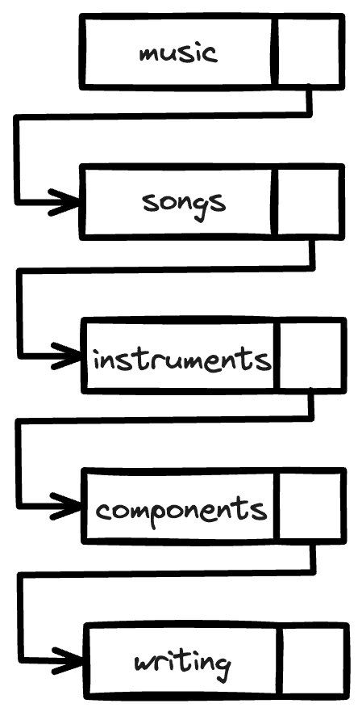

## 为什么要使用不同的东西呢？

层次结构是常见且熟悉的。那么为什么要使用不同的东西呢？

### 提供多个心智模型

通过为读者提供层次结构的内容，向读者提供了一种隐含的心智模型。通过对内容进行排序，意味着信息是根据其相对重要性和应该学习信息的顺序列出的。

就音乐示例而言，由于分层呈现，这意味着在学习乐器之前，应该先了解歌曲的组成部分，然后再了解音阶、调号或节奏。

如果将内容显示为图形，可以消除层次结构隐含的一些排序：

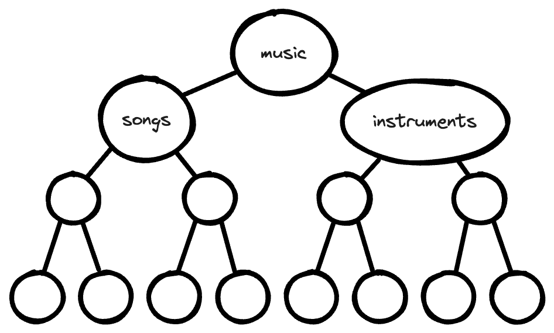

通过扩展层次结构，要么将内容放置在不止一个位置，要么消除层次结构中涉及的排序，您可以为读者提供多种心智模型，并因此提高可查找性。

来自Page Laubheimer对Nielsen Norman Group的一篇文章指出，将内容分类到不止一个位置有一些好处：

> 多层次的IA是一个结构，其中一个项存在于不止一个位置 —— 也就是说，它可以通过几个类别路径到达。…理想情况下，您希望创建准确描述您的内容和产品的类别，当您添加新主题或产品时，这些类别是可扩展的，并且符合您的用户的[心智模型](https://www.nngroup.com/articles/card-sorting-definition/)（这通常因人而异）。

这是一个关键点 —— 我们经常根据受众来编写文档，但熟悉程度和背景总是有所不同。

例如，因为我是用一种语言学习数据分析的，它使用统计转换命令进行聚合^(，我可能会在COUNT()和SUM()函数引用旁边查找SQL函数GROUP BY。)

如果内容可以显示为图形，描述跨类别和命令的不同关系，那么内容可以反映许多心智模型。内容可以变成图表。

### 写出更好的文档

技术撰写人员面临的一个持久挑战是专注于撰写以用户为中心的文档，而不是以功能为中心的文档。

当考虑到用户旅程的复杂性以及所有必要的分支和分叉时，线性层次结构的限制开始显现。

如果您不必考虑内容在导航或目录中的位置，而是考虑它与已经存在的其他内容的关系，编写文档可能会更容易。我们已经在做这件事，但必须始终创建考虑顺序的层次结构。

但有时顺序并不重要。有时顺序因受众而异。层次结构是不灵活的。

如果不受层次结构的限制，我们可以更加审慎地将文档放置在结构中，回答诸如：

+   你想为读者绘制什么样的关系？

+   读者在何时何地可能会遇到本主题描述的任务？

红帽的大卫·莱恩（David Ryan）尝试过这一点，在一条推文中指出：

> 在红帽（Red Hat）有几个人使用了一个绘图工具来展示内容关系，当我们试图摆脱“线性书籍”并尝试将内容与用户旅程匹配时，我们进行了实验。

对于音乐的例子，我们可以承认一些读者可能熟悉写歌词，但不熟悉调号或音阶的概念。其他读者可能熟悉歌曲，但不能轻松保持节奏，因此希望深入探讨该内容。

### 改善内容重用

如果不必绘制严格的层次结构，重用内容可能更容易。如果您的内容是口袋大小且特定于概念或任务，重新上下文化将像向图表添加另一个链接一样简单。

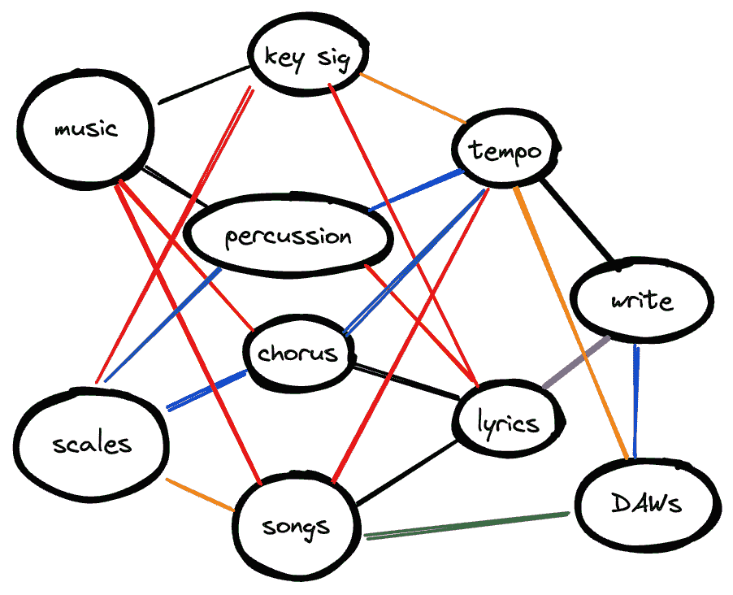

在层次结构中，要重用内容，通常必须将内容复制到另一个位置——通过单一来源或其他方式——使其在逻辑上相关。

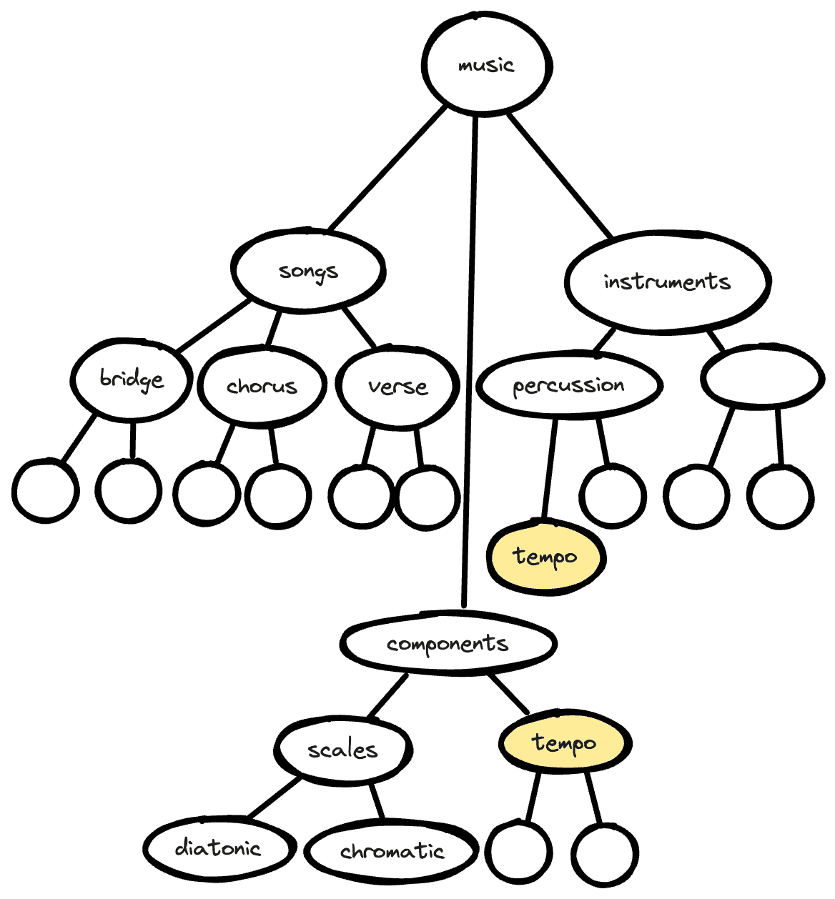

图的灵活性意味着您可以使用标签或链接来跨内容绘制连接，而不是将其复制到层次结构中的另一个位置。

### 改善机器可读性

不仅以图的形式*存储*内容，还以图的形式*编写*内容，对机器来说更易读——网站爬虫索引内容以用于搜索结果排名算法，并捕获数据集以训练机器学习模型。

大多数内容已经作为图形进行了爬取，机器人一次又一次地跟随链接，索引页面内容以及它们之间的链接，构建网络的图形表示。

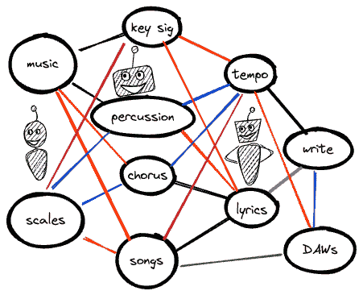

在考虑这些关系的基础上撰写可能有助于增强内容之间的连接，使这些连接对机器更易读，同时也向人类读者暴露它们。

根据您如何投资于知识图谱的质量，搜索效益可能会为您的文档站点创建一个竞争壁垒 —— 前提是内容存在以支持搜索项。

## 为什么我们不将内容显示为图形呢？

将内容显示为图形具有许多好处，但很少有网站这样做。为什么呢？

### 设计起来很困难

网站是基于页面的 —— 并且很难以一种连贯的方式向读者展示底层结构。

在页面顶部或侧边有导航菜单是一种极为熟悉的模式，以及“面包屑”来帮助人们保持在之前的位置。

网络上已经有一些内容图的例子，它们遵循一些不同的模式：

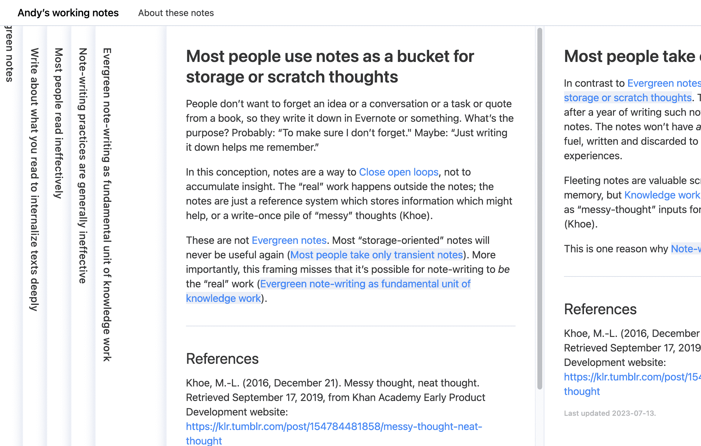

[安迪·马图舍克](https://notes.andymatuschak.org/Evergreen_notes)通过他的[长青笔记](https://notes.andymatuschak.org/Evergreen_notes)创建了一种图形形式的形式^(，该形式会在您与之交互的内容旁边打开链接，并在途中最小化。在长青笔记的情况下：)

> 没有索引或导航辅助：您需要跟随一个链接到某个起始点。

这是[Obsidian](https://obsidian.md/)实施的类似设计^（. Obsidian还使用图形和基于节点的架构来将计算机上的本地文本文件相互关联。它将图形可视化提升到了下一个水平，但我觉得这种规模的图形并不是非常易于发现，尽管它们是可探索的，因为它们太过压倒性。Obsidian最近还引入了[标签堆栈](https://twitter.com/obsdmd/status/1567580143379484673)，这是另一种将内容可视化的创新方法。）

另一个网站是[C2 wiki](https://wiki.c2.com/?ServletBasedWiki)，有人对我描述为“一个偶然形成的参考指南的讨论站点”。当您在其中导航时，它实际上会为您创建一个地图，打开的链接会漂浮在原始链接旁边。

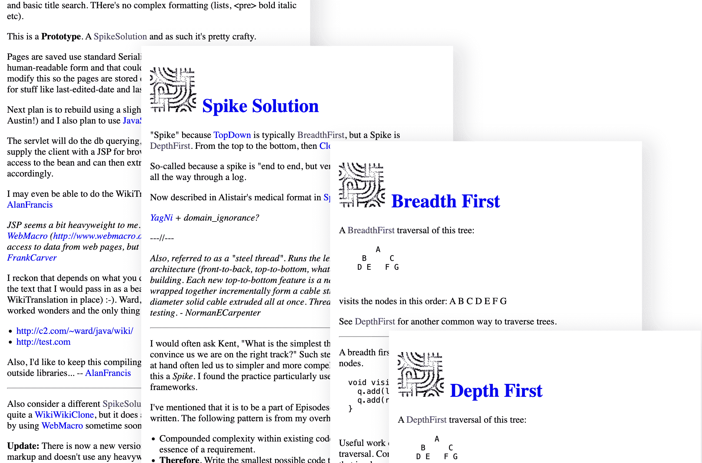

我喜欢这种设计作为跟踪特定内容路径的一种方式，使读者能够从内容中构建自己的工作流程，但在分享链接时会带来挑战。

在上面的截图中，我的路径结束在[DepthFirst](https://wiki.c2.com/?DepthFirst)页面，但如果你打开那个链接，你只会看到页面本身——没有导致我到达那里的旅程，也没有你可能想要探索的图中的节点——页面中只有一些链接。

这两个网站暴露了主要的设计挑战：

+   **在像这样的网站登陆页上显示什么内容**，或者入口点？大多数读者是通过搜索接触文档的，但仍有许多人直接浏览到网站本身——特别是潜在的客户或者查看公司网站的员工。

+   **当查看图中的离散页面（或节点）时，如何使图形可见**？如何使当前页面的上下文对读者可见？

登录页的选项可能是做一些类似于许多分层文档站点的事情——显示一个搜索栏和一些关键的“入口点”节点，并显示一些选择的分支或依赖节点。  

使图形可见可能是一个有趣的设计挑战，这取决于你选择做什么：

+   忽略图形，只显示节点，将链接作为导航到其他节点的唯一方式（并遵循现有的网络浏览模式，而不添加新的模式）。

+   在分享到特定页面的链接时保留特定的路径，并提供一个“历史”图形视图，类似于Andy's Notes的做法。

+   提供一个缩小视图的选项，可以最小化一个页面并查看附近的图形节点：

    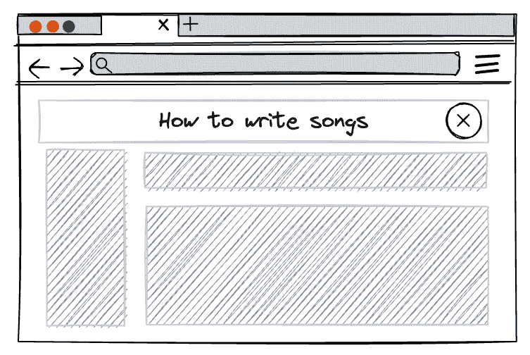

    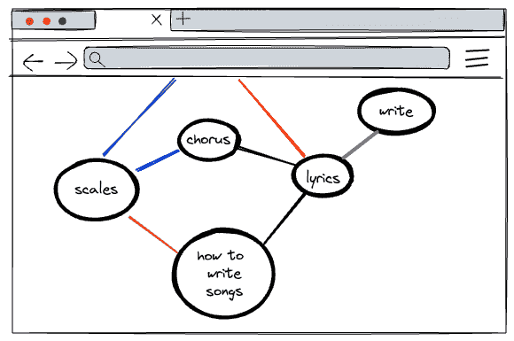

+   完全不同的东西！

### 这对读者来说很令人困惑。

分层内容是主流的网络格式，因此很熟悉。熟悉的设计和布局模式更容易导航，因为你不必学习如何使用网站，你可以使用已经学过的模式来导航——浏览导航栏、浏览目录，浏览页面上的标题或使用ctrl+f在文本中搜索关键词。

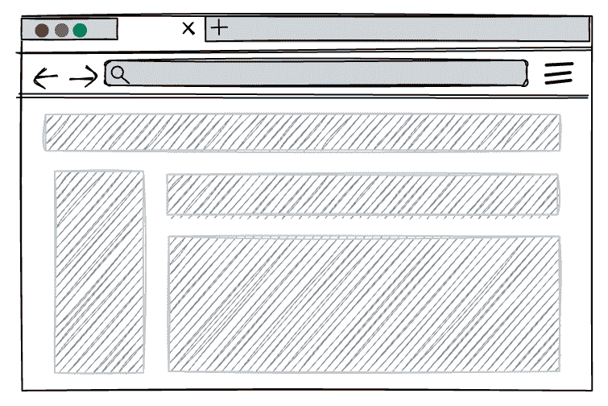

正如 Mark Baker 在 [Every Page is Page One](https://everypageispageone.com/) 中指出的那样，人们是信息搜索者。图的可读性和可能存在的大量内容可能不适合我们作为网页阅读者所演变出的首先浏览的习惯。

相反，如果将内容显示为图形，读者将面对一个陌生的模式，可能需要他们学习新的按钮和交互方式才能找到他们需要的内容。这对技术文档的读者是一个阻碍，因为他们的目标是回答一个特定的问题，完成一个特定的任务，或者了解某件事情 —— 而不是学习你的网站如何运作。

另外，将内容显示为图形缺乏明确的层次结构，这带来了另一个大问题：没有明确的起点。

正如 Kelley Gordon 在她为 Nielsen Norman Group 撰写的文章中指出的那样，[UX 中的视觉层次：定义](https://www.nngroup.com/articles/visual-hierarchy-ux-definition/)：

> 如果您在屏幕上找不到焦点，很可能布局缺乏明确的视觉层次。
> 
> 页面的视觉层次控制了系统向最终用户传递信息的方式 —— 它让用户知道在哪里集中注意力。

到达一个没有视觉层次，只有节点图的网页可能会让读者感到迷失方向。

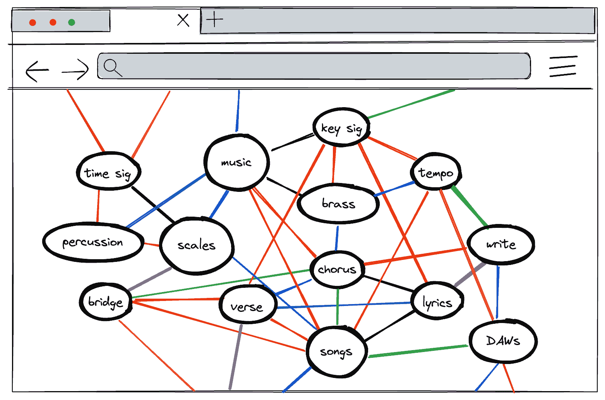

大多数读者会使用其他形式的探索，比如搜索，来找到他们想要的内容。

因为图形缺乏明确的视觉层次，可能会让人感到不知所措，所以 Evergreen Notes 或 C2 Wiki 的设计是有意义的，因为它们在你浏览页面时将图形展现为一次旅程。其他使用图形的网站通常在你浏览时不会使其可见。

一个例外是经典网站 [HyperPhysics Concepts](http://hyperphysics.phy-astr.gsu.edu/hbase/index.html)^(，它使用可点击链接的视觉图表示来帮助您浏览网站：)

[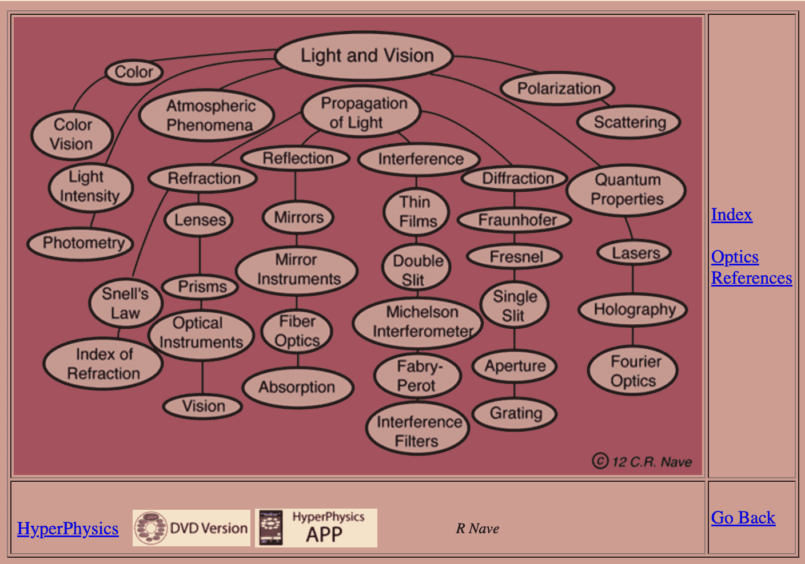](http://hyperphysics.phy-astr.gsu.edu/hbase/hph.html)

这个图是一个分层和有序的图，但比传统的目录少分层，并对读者可见。该图的每个节点都是可点击的，点击会打开一个新页面，包含内容，或者有时是一个新的图：

[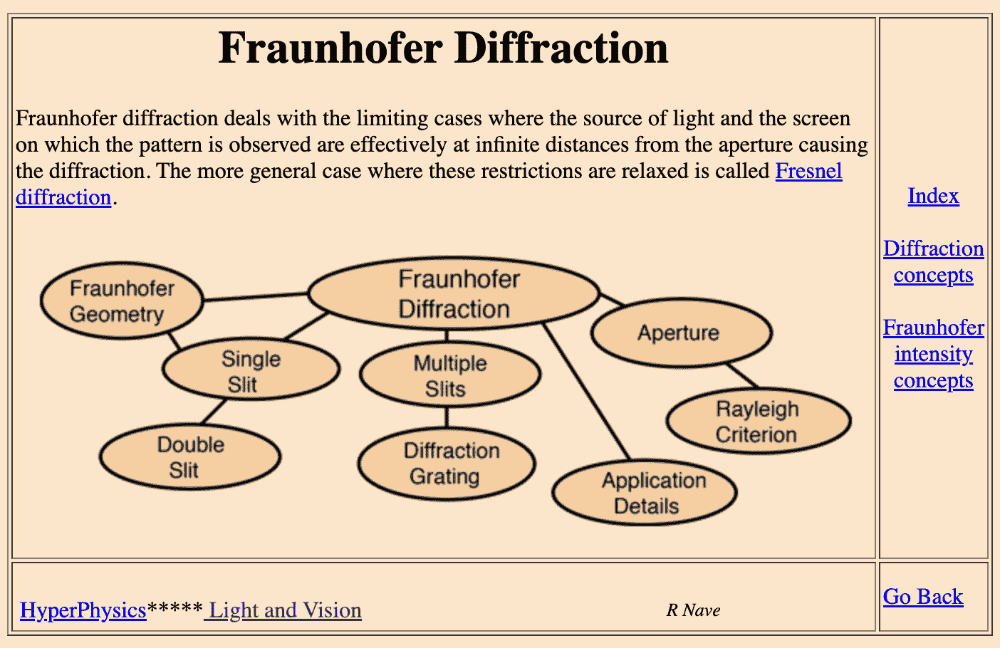](http://hyperphysics.phy-astr.gsu.edu/hbase/phyopt/fraunhofcon.html#c1)

Hyperphysics 网站使图形可见，但不会牺牲内容。该图可以被注释，并作为另一种形式来传达内容中描述的概念之间的关系。

另一个例外是[Every Noise at Once](https://everynoise.com/) 网站。[数据源可惜已经不再可用](https://www.furia.com/page.cgi?type=log#id472)，但网站本身显示的不是图形，而是一组流派，布局方式就好像有节点连接可见一样。

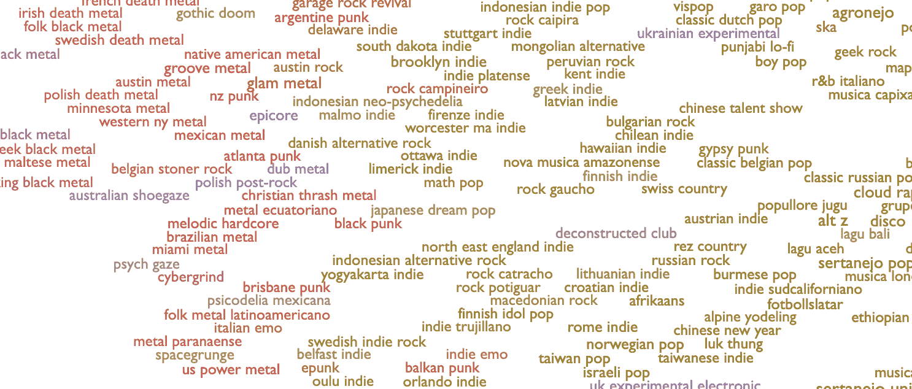

这是一个图的概念，但没有真正的连接。该网站本身将其称为散点图——因此存在模糊的关联，但没有真正的链接。如果您深入研究图表并选择一种流派，您将看到该流派中艺术家的类似散点图：

[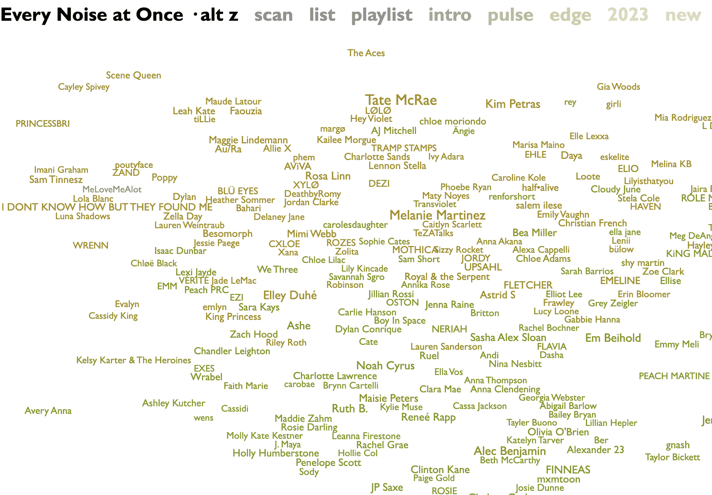](https://everynoise.com/engenremap-altz.html)

具有层次结构的网站还使用面包屑导航来显示您在整个站点地图中的位置。您纯粹以图形形式与之交互的内容将需要根据您所采取的内容路径构建动态面包屑导航，或者完全采取不同的方法，如依赖类别标签。

Every Noise at Once，以灵活的图形探索格式，保持了一个面包屑导航，有效地显示了您当前访问的节点周围的节点：

[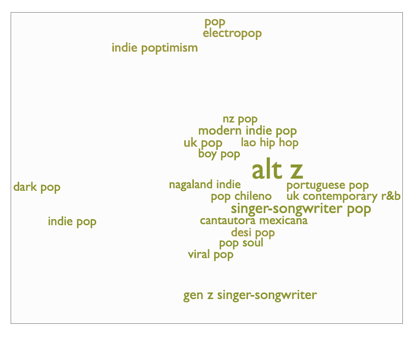](https://everynoise.com/engenremap-altz.html)

最终，在图形中将内容可见地显示的选择有很多，但其中大部分要么保留了一个层次结构，以帮助读者扫描和搜索信息，要么没有视觉层次结构，强迫读者进行探索、使用搜索，或在面对压倒性的选择时放弃。

### 它太灵活了

内容图谱并不是一个新概念。将内容显示为图形可能很少见，但将内容存储为图形是一种常见的做法——通常称为知识图谱。

正如 Sarah O’Keefe 在 Scriptorium 中讨论的那样，[知识图谱的成本](https://www.scriptorium.com/2023/01/the-cost-of-knowledge-graphs/)之一是对作者的挑战：

> 我们必须考虑各种内容或数据对象，了解它们在知识图谱层面上的关系，然后将它们整合成一个连贯的体验，无论是一个网页、一个文档还是完全不同的东西。

要考虑的事情很多。使用 DITA（达尔文信息分类架构）和基于 XML 的结构化创作解决方案的作者可能已经熟悉这些挑战，以及减少内容到其相关部分的块化方法，然后需要将其重新组合成一个连贯的体验在网页上。

我以前没有在 DITA 环境中工作过，而且我大部分的经验都是使用不使用数据库来存储内容的工具，更不用说使用图形数据库了。许多文档作为代码工具需要某种层次结构来动态生成目录（[Sphinx](https://www.sphinx-doc.org/en/master/) 是一个例子）或者为存储库的扁平文件结构提供一定程度的顺序。

当涉及到组织内容时，考虑到一个主题可能与读者相关的不同方式可能是自由的，但决定在哪里划线也可能是令人筋疲力尽的。

对于前面的音乐示例，关于“如何写歌曲”的页面或图形节点可以链接到：

+   如何写桥段

+   如何写副歌

+   如何写诗句

+   如何写旋律

+   如何写顶部曲线

+   如何写钩子

+   如何写歌词

+   如何写和声

+   如何使用数字音频工作站（DAW）

+   以及更多...

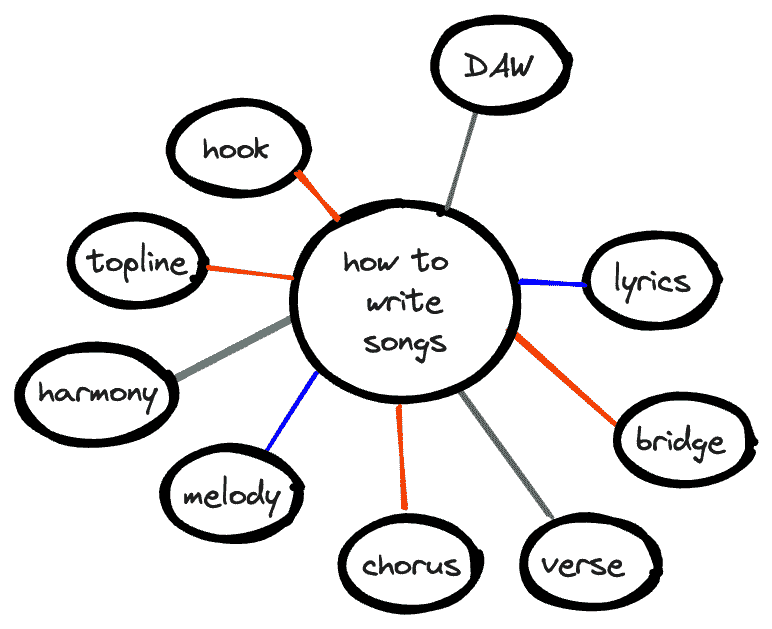

然而，图的灵活性可能会带来混乱。如果这个内容可以链接到其他内容，那应该链接到什么？哪些其他节点是相关的？一个图可能很快就会变成一片可能性的海洋，而不是关于相关性的有意选择。

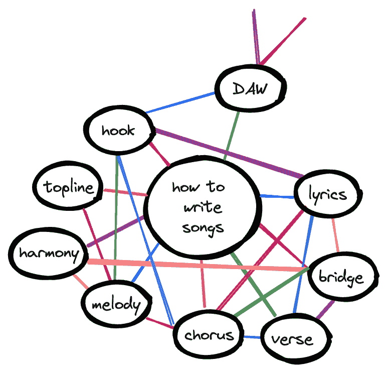

在某个时候，试图避免错过相关链接，或者尝试通过知识图谱使您的内容尽可能易于发现，将会削弱通过图形化**展示**内容所具有的明确心智模型和绘图潜力。

图形可以开始代表心智模型的*所有可能排列*，并停止代表任何有价值的东西。

但是，考虑您的内容可能与所有不同位置相关联的行为，可能存在的其他入口点，可能会导致更加深思熟虑的文档内容。您可以将其视为整个系统的一部分。通过将内容视为图的一部分，您可以更容易地将内容视为一个广阔表面的一部分，而不是一个特定顺序列表上的离散元素。

相比之下，因为层次结构是严格的，它强迫进行选择。如果这个内容必须存在于一个地方，那么*最相关*的地方在哪里？

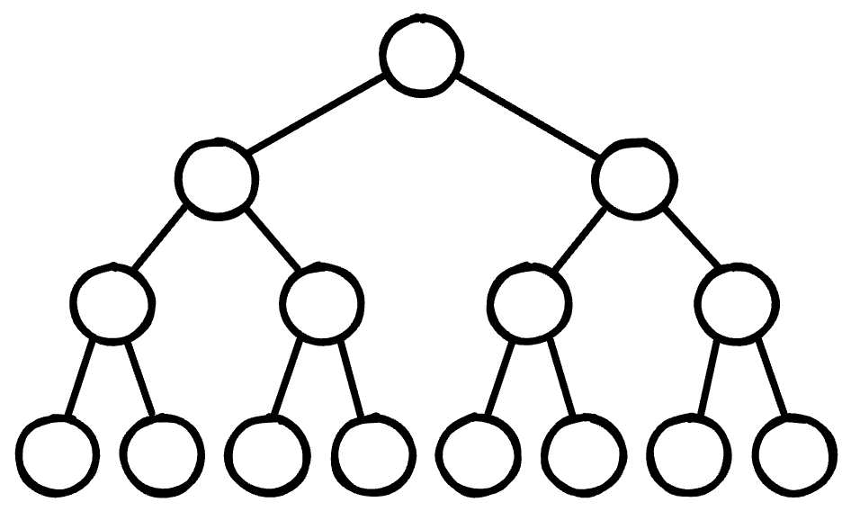

这一个选择可能令人生畏，尤其是在选择层次结构的顶部时。

在 Write the Docs Slack 社区的一次讨论中，[Wouter Veeken](https://wouter.tech/) 指出，层次结构的一个困难在于决定将什么放在其顶部，并询问是否有“决定哪个属性应该成为树顶级的通用方法？”

其中存在权衡。对于一些内容，选择层次结构中的位置是一个任意的选择。对于其他类型的内容，它使一个任务的相关顺序具体化了。

例如，如果您想写一首歌，您可以从旋律、和声或歌词开始。要写歌词，您可以从副歌、诗句或桥段开始。这些都没有顺序。但是如果你想创作一首歌，那么歌必须首先写好。在这种情况下，顺序很重要。

这是具有图结构的一个关键优势——一切都是一组关系，没有指定的“树顶”可供识别。你甚至可以选择以不同方式显示高度相关的主题，利用图结构本身提供的信息来确定哪些内容最有价值。

### 编写分块内容很难

这些都是构建内容结构时面临的挑战，但编写内容也存在挑战。

[Carrie Hane 在 Sarah O’Keefe 的 LinkedIn 上关于知识图谱的讨论中指出](https://www.linkedin.com/feed/update/urn:li:activity:7016392571283230720?commentUrn=urn%3Ali%3Acomment%3A%28activity%3A7016392571283230720%2C7016413582502371328%29&replyUrn=urn%3Ali%3Acomment%3A%28activity%3A7016392571283230720%2C7016417255366262785%29)：

> 采用结构化、解耦的内容仍然需要采用知识图谱。而这是一个巨大的飞跃。

我完全同意。C2 维基或 Hyperphysics 网站中的每一段内容都是独立的内容组件 —— 例如一个概念的定义。这种分块内容非常适合知识图谱。

针对层次结构编写的技术内容，或者带有暗示顺序的内容，往往会变得非常冗长和详细 —— 也许有一页描述关于某事你需要知道的一切。继续以音乐为例，你可能会得到这样一页：

+   如何写一首歌

    +   关于歌曲组件

    +   写歌词

        +   写一个段落

        +   写一个副歌

        +   写一个桥段

    +   写一个旋律

    +   写一个和声

    +   写一个贝斯线

    +   写一个打击乐轨道

那个页面充满了基于任务的内容，可以轻松地分成不同的图形节点，但它可能也包含了混合在内的定义内容，比如：

+   什么是钩子

+   什么是主旋律

+   什么是调号

+   什么是速度

这种定义性内容也会被分解成特定的片段。突然之间，你不再写一篇关于创作歌曲的全面主题，而是写了一小块内容，可能没有那么有趣、引人入胜或连贯，写起来或读起来。

### 稀疏内容和密集内容在图表中无法扩展

图表只有在有很多连接时才有用。只有几个节点的图表作为心理模型的图解不会传达太多信息：

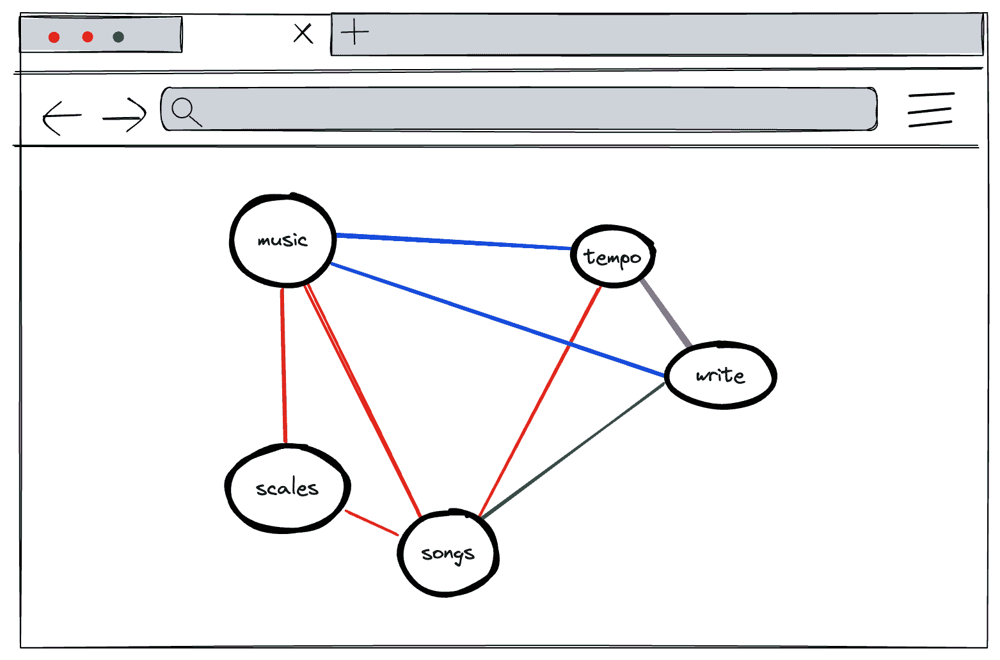

另一方面，太多的节点是不切实际的，也不会作为心理模型的图解传达太多信息：

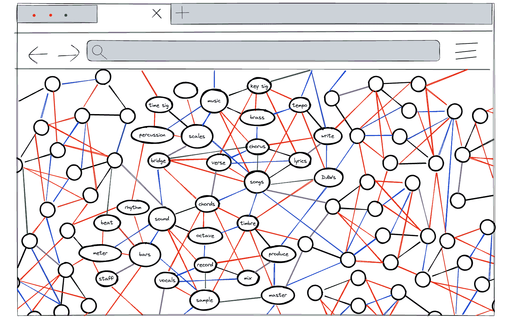

## 可见图表：展示内容的未来？

最终，可见的图表不太可能成为显示技术内容的标准做法。这是一个复杂的设计和渲染问题，虽然有可能新奇性会让某人在图表中点击一段时间，但有特定问题的人希望能够快速查找信息。

扫描的一个障碍是内容的数量。鉴于许多文档站点上的内容量，以及人们习惯于在数字设备中导航，大多数人[默认使用搜索作为导航的首选](https://theconvivialsociety.substack.com/p/a-world-ordered-only-by-search#details)。

如果每个人都在使用搜索导航，那么将内容显示为图形就没有太多意义。

相反，将知识图作为文档站点的背景结构实施，并清楚指导如何连接图的节点，有可能改善读者的搜索结果，并为作者提供灵活的分类。

知识图表可以让你兼顾两全。正如ProductX的Manav Modi在[如何使用知识图优化Airbnb的搜索和发现？🎯](https://productx.substack.com/i/92274998/why-is-a-graph-structure-scalable)中指出的那样：

> 图表也可以是分层的，高层概念分支到更具体的细节，使数据组织更加简洁。

作为概念上保留图表但不以视觉方式展示的替代方法是许多文档首页常见的基于磁贴的方法，带有排序和筛选选项：

在这些模型中，图表并不明显，但节点关系仍然存在通过标签或内容类型，并且可以在不使用目录的情况下进行探索。这种方法让你获得了一些将内容视觉显示为图形的好处，而不会遇到最困扰的挑战——读者不熟悉且具有挑战性的浏览体验。

无论您如何以视觉方式呈现内容，将内容放入信息架构中并对其进行结构化都是有价值的，并为读者和作者形成了一个心理模型。

将图形对读者可见是不现实的，但我仍然认为这很酷。
