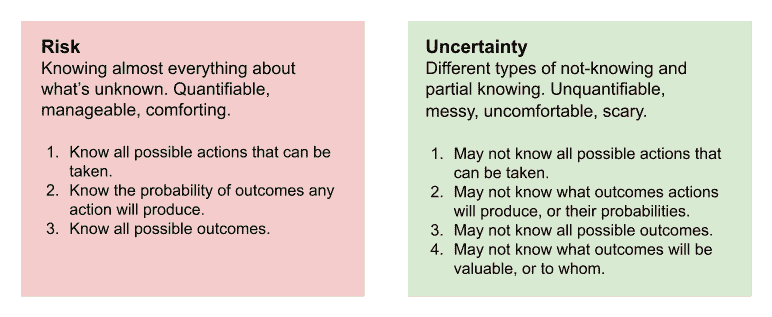
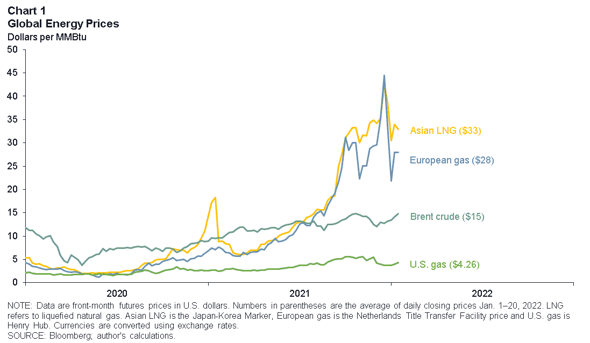
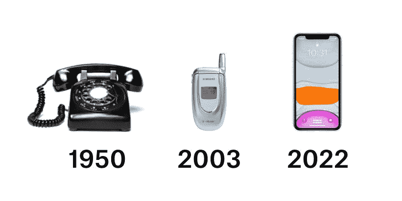
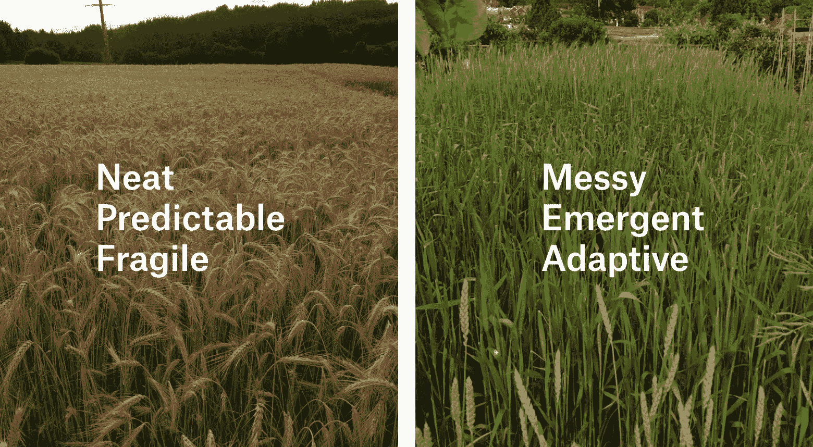
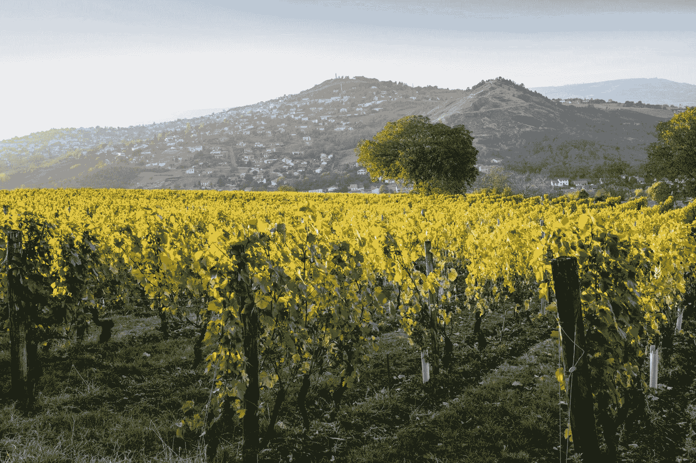
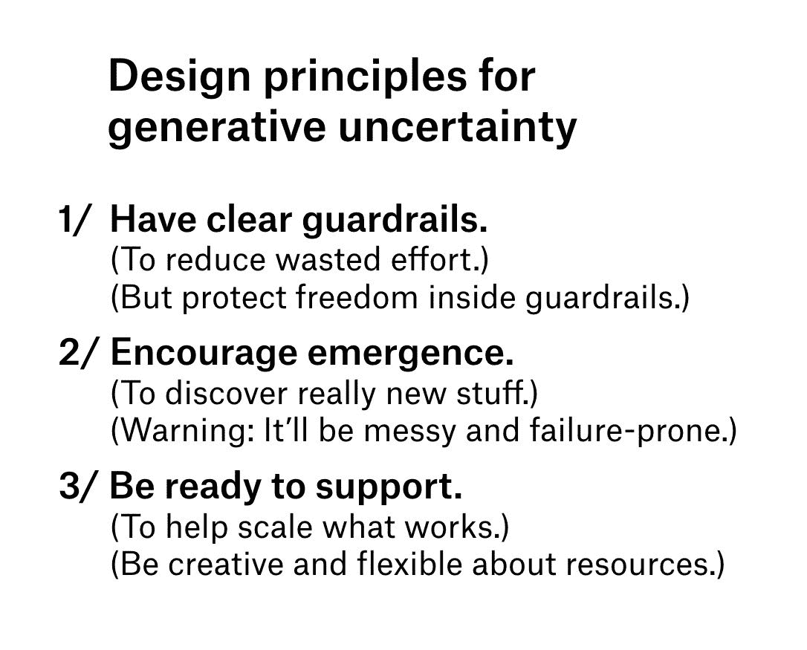
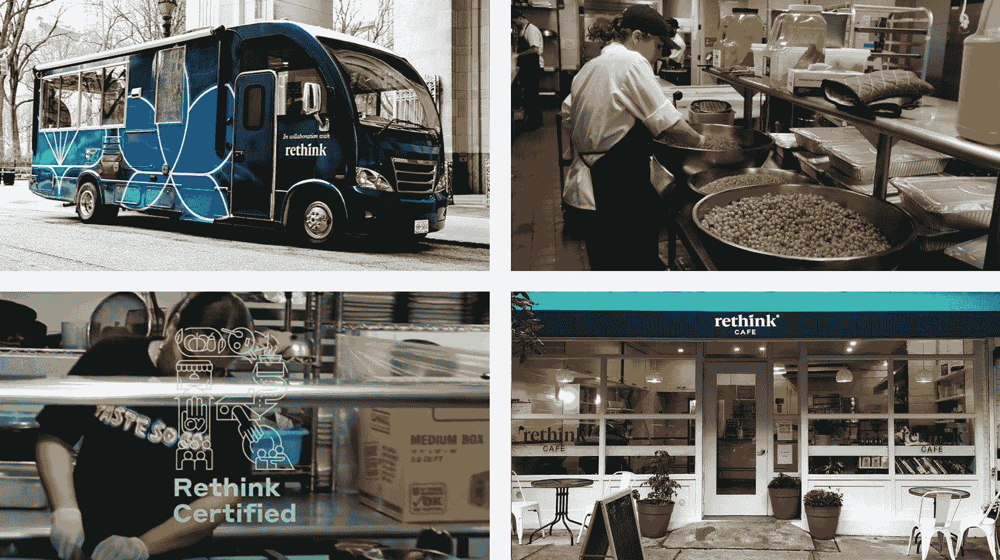
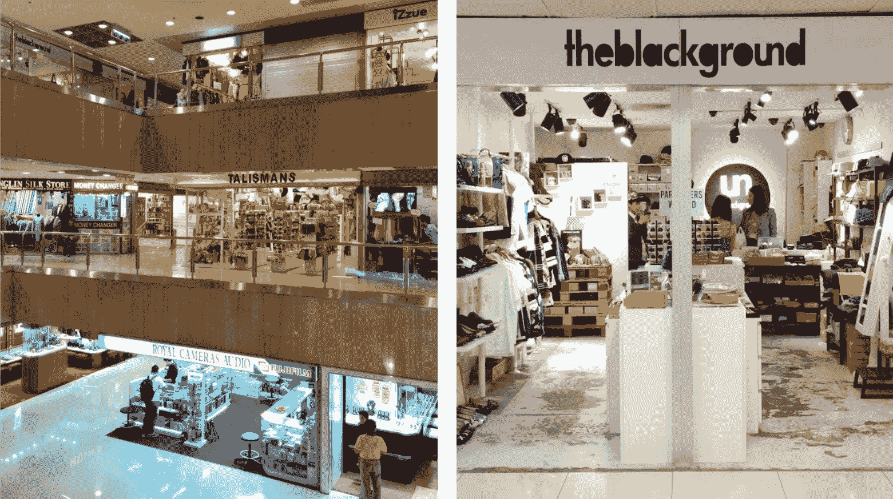
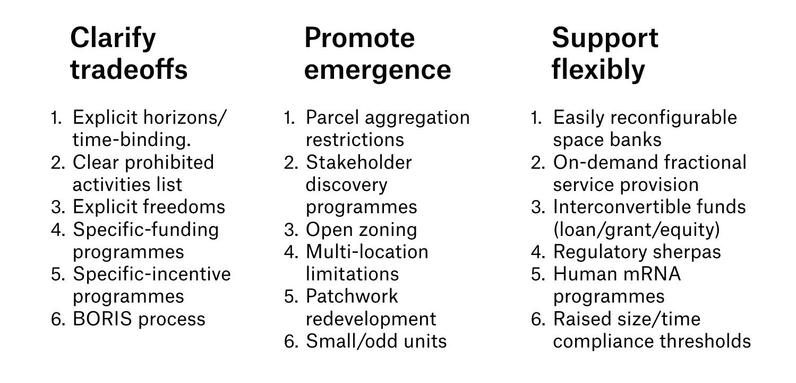

<!--yml

分类：未分类

日期：2024-05-28 17:36:49

-->

# 生成性不确定性 - Vaughn Tan

> 来源：[https://vaughntan.org/generative-uncertainty](https://vaughntan.org/generative-uncertainty)

# 生成性不确定性

14/6/2023 ☼ [不确定性](/tagged/not-knowing) ☼ [风险](/tagged/risk) ☼ [创新](/tagged/innovation) ☼ [不确定性](/tagged/uncertainty) ☼ [城市规划](/tagged/urban-planning) ☼ [小麦](/tagged/wheat) ☼ [农业](/tagged/farming)

这篇文章解释了为什么不确定性是创新工作不可避免的一部分，以及在不确定性背景下生成性的含义，设计生成性不确定性的三个原则以及如何具体实施它们。我还以一种格式实验录制了[这篇文章的音频版本（23 分钟）](https://uncertaintymindset.substack.com/p/generative-uncertainty)。

> 简而言之：每个人都讨厌不确定性，认为它只是要避免的坏东西。事实是，不确定性也有好的一面：它对于创新至关重要。要做创新工作，不确定性是一种特性，而不是一个错误。但并非所有的不确定性都是好的。只有生成性不确定性的开放心态才能为可持续的创新创造肥沃的土壤。通过实施三个设计原则可以创建生成性不确定性：1）明确的防护栏，2）鼓励出现，3）随时提供灵活的支持。

* * *

当我开始进行创新研究时，我的方法是花费大量时间与不断尝试新事物的团队和组织一起。我选择的那些团队都很不寻常。他们找到了如何设计自己以更具创新性的方法，但不是通过使用传统的管理学方法。这就是我花了多年时间观察和与高端餐饮的研发团队合作的方式。结果，他们有意想不到的有效组织方式，可以让自己擅长做好新事物。 （你可以在我的书[*The Uncertainty Mindset*](https://uncertaintymindset.org/)中了解更多关于这一切的内容。）

从与软件和其他公司的咨询中，我意识到设计创新性食品研发团队的原则也适用于其他行业的创新团队。当我开始研究创新生态系统（如建筑物、社区、城市和地区）时，清楚地看到这些见解和原则通常适用于创造新思想（或产品、商业模式等）可能出现的环境。

对我理解这一切的入口是承认我们很少（从未？）知道未来会发生什么。我们总是面临着不同类型的[不确定性](https://vaughntan.org/introducing-not-knowing)。虽然我们经常将它们称为“风险”，但事实上，风险只是这些不确定性之一。

## 风险并非不确定性

在风险情况下，你知道你可以采取的所有可能行动，你的行动会产生什么结果，以及所有可能的结果。

风险实际上是一个非常具体、高度理论化的情况，在这种情况下，你不知道会发生什么，但你几乎了解你不知道的一切。这种情况在现实生活中几乎不存在，除非你掷公平的骰子或抛掷公平的硬币。相信一个未知的情况是可以了解的，这是令人欣慰的。（想更深入地了解，请阅读这篇关于[更清晰地思考风险的文章](https://vaughntan.org/how-to-think-more-clearly-about-risk)。）

不确定性与风险根本不同。在不确定的情况下，你可能不知道所有可能的行动，也不知道你的行动会产生什么结果，也不知道所有可能的结果，甚至不知道结果对谁有价值。

不确定性无法量化，因此很难管理。这是令人不安甚至可怕的。大多数现实世界的情况 — 以及所有最重要的情况 — 都是不确定的，而不是有风险的。

风险绝对不等同于不确定性。

## 不确定性的两面

我们本能地和本能地理解不确定性是一件坏事。而且不确定性通常是一件非常糟糕的事情。

扎波罗热是欧洲最大的核电站，是一个不好的不确定性的很好的例子。它位于战区中心。目前俄罗斯控制着它，乌克兰想要夺回它 — 周围正在进行激烈的战斗，而且它可能也会受到[最近被决堤的大坝洪水的威胁](https://www.euronews.com/2023/06/10/ukraines-zaporizhzhia-nuclear-plant-shuts-down-last-reactor-in-face-of-flooding-threat)！至少，我们不知道所有可能的结果（其中之一是至少影响整个欧洲的核灾难）。这是一个不确定的情况，而不是一个有风险的情况，这是*不*好的。

不仅仅是像乌克兰战争和可能的核灾难这样的存在威胁的情况会产生不好的不确定性。[2022年的全球能源危机](https://www.iea.org/topics/global-energy-crisis)由于未预测到的燃料价格上涨使得经营业务变得困难，甚至维护政治稳定也很困难。

最近的全球能源价格。来自达拉斯联邦储备银行的图表。

人类系统并不是唯一面临不确定性的系统。自然系统和环境也是如此。[全球天气变得越来越不可预测和极端，](https://public.wmo.int/en/media/press-release/past-eight-years-confirmed-be-eight-warmest-record)导致从作物歉收到广泛的健康问题，再到河流航行或发电的关闭等一切问题。今年看起来是厄尔尼诺周期的开始，2023年似乎也会不可预测。

当然，每个人都经历了三年或更长时间与 Covid-19 的疯狂斗争，所以我们都经历了一个非常近期的 —— 实际上，正在进行中的 —— 糟糕不确定性的共同经历。因为不确定性往往是不好的，并且总是令人不适，很容易忘记不确定性也有好的一面。

## 不确定性的好处

手机的发展说明了创新（新的有用的东西）只能在不确定性下出现 —— 因此不确定性也有好的一面。

在1950年，电话是通过线缆连接到电话网络的手柄。那时，没有人确切知道是否可能拥有一个商业可行的、消费者级的无线电话网络，因为蜂窝网络的技术（和需求）尚未开发出来。

从1970年代开始，像摩托罗拉和NTT DoCoMo这样的公司开始尝试无线电话，然后是蜂窝网络。到2003年，手机变得足够便宜，即使是大学生（像我那时一样）也能拥有。那时，没有人确切知道具有强大个人计算机功能的手机是否可能，因为整套微型化和用户体验技术尚未开发出来。

从2000年代中期开始，公司（特别是我们都知道的苹果）开始尝试智能手机，尽管即使[消息灵通的人们相信这样的手机永远不会取得商业成功](https://www.fastcompany.com/3067030/the-iphone-turns-10-heres-what-skeptics-first-thought-about-it#:~:text=Skeptics%E2%80%94and%20there%20were%20plenty,was%20released%20the%20following%20June)。现在，到了2023年，具有几乎无法想象的功能的智能手机几乎无处不在，构成了商业和艺术创新巨大系统的平台。

不确定性为电话领域的创新创造了空间。

在1950年和2003年，人们对将会构建什么技术（可能的行动）、这些技术将会带来什么产品（可能的结果）以及这些产品是否有价值（可能的价值）存在不确定性。这些种类的不确定性创造了手机的可能性，然后是智能手机的出现。

创新工作中，你永远不会处于几乎了解你不知道的一切的情况下。创新中，你不知道自己要去哪里。你不知道你将如何到达那里。你甚至不知道成功是什么样子的。这些不同类型的不知道形式的不确定性是创新首先可能的原因。**创新工作在定义上是不确定的。** 抑制或回避不确定性是扼杀创新的一种方法，因为不确定性是创新工作的特征，而不是一个缺陷。

所以我们有好的和坏的不确定性。是什么使不确定性成为好的而不是坏的呢？

## 良好的不确定性是生成性的。

创新意味着做新的而且也是有用的事情。良好的不确定性为新事物创造了空间，并在它们能够展示出用处时支持它们的成长——这就是**生成性不确定性**。创造生成性不确定性需要对我们如何看待世界进行相当根本的改变。

我第一次开始具体思考这个问题是几年前和一群致力于[使用传统小麦种群进行再生农业的团体](https://www.heritagegraintrust.org/)一起工作时。

种植小麦的两种方法：传统的单一栽培（左）和人口小麦（右）。

种植小麦的传统方法是将其作为单一栽培（上图，左侧）。每个田地都种植了大量相同品种的小麦植株。单一栽培在特定于所种植小麦品种的一段狭窄环境条件下生长最佳。单一栽培小麦田地的面粉具有所种植小麦品种的性质。为了调整面粉的性质，你需要繁育/选择特定的小麦品种。

人口小麦是种植小麦的一种根本不同的方法。与仅种植一种小麦品种不同，你种植的是一个种群——一个由基因不同的小麦品种混合而成的种群（上图，右侧）。每种小麦品种在稍微不同的环境条件下生长最佳，并且在磨成面粉后具有不同的性质。人口小麦面粉具有其组成小麦品种的性质，按其相对比例混合而成。为了调整面粉的性质，你需要微调种群（例如，在小麦生长过程中剔除具有不良性质的小麦，或者移除混入的非小麦植物，如燕麦或黑麦）。这些微调改变了种群中不同小麦的比例，因此最终的面粉具有大致期望的性质。

如果遇到极端天气，单一种植小麦的田地可能会完全失败，无法收获。但种植人口小麦的田地更能够适应不可预测的天气。如果天气更热（或更湿润、更多云等），在这些条件下表现良好的小麦品种将蓬勃发展，即使其他品种表现不佳。整体而言，人口小麦田地更有可能生存下来，甚至茁壮成长。

作为一个群体，该领域适应并响应其不断增长的环境。当条件不理想时，小麦群体不会失败，而是可能通过改变成分和表达方式来适应。这种小麦种植方法是一种演化设计的形式，它通过愿意不确定最终收获中哪些小麦将参与其中来发挥作用 —— 它对成功的样子持开放态度。这使得它不可预测且看起来混乱，但不可预测性和混乱也是它能够适应生长地点和气候的原因之一。与整齐和可预测的单一文化方法相比，后者是脆弱的。

小麦生长的群体方法在其开放思维上与传统的单一文化方法有根本区别。开放思维是一个设计原则，在成功的初创企业、API、平台和生态系统中也可以看到它 —— 它创造了混乱、不可预测和不确定性，同时也是生成的。

## 想象力的陷阱

思维的封闭与需要确定性和希望消除或抑制不确定性密切相关。但有时很难识别封闭的思维。我将给你一个可能不符合直觉的例子：将其他成功结果视为成功的模型。

现在有一些知名的创新生态系统。硅谷就是其中之一。在过去的半个世纪里，那里进行了大量的硬件和软件创新，导致了许多大型成功公司的出现。很容易看到硅谷的成功，然后相信这才是创新生态系统应该看起来的样子，而大型高科技公司是唯一成功的结果。

对一些地区来说，这种成功模式可能奏效。塞尔维亚的诺维萨德拥有优秀的技术大学和高生活质量，并已成为欧洲科技初创企业活动的兴旺中心。但这种高科技创新对洛杉矶来说可能并不合适。

## 生成式不确定性本质上是开放思维

不是因为洛杉矶没有优秀的大学（事实上有） —— 而是因为它拥有其他很少城市拥有的资源：在娱乐和创意产业方面有着悠久历史的庞大专业网络。洛杉矶的创新，幸运的是，已朝着利用这一地方资源的方向发展，公司致力于娱乐、游戏、时尚和消费品的技术和产品。

新的有用的东西并不总是高科技的热门产品，但保持对**非时尚创新**的开放态度对于鼓励符合环境的创新至关重要，因此是可持续的。现在，许多服装生产都在成本非常低廉、技能相对较低的国家进行。葡萄牙的波尔图和布拉加市创建了一个高技能、高质量的服装和纺织品发展与制造生态系统，以利用市场上的差距、该地区长期的纺织业历史以及葡萄牙合理的成本结构。

创新可能会采取意想不到的形式。我曾经居住的奥弗涅曾经是法国最大的葡萄酒产区之一，以生产价格便宜、品质一般的葡萄酒而闻名。这里的土地和老葡萄藤相对便宜。大型葡萄酒公司并没有游说限制葡萄酒制造方式的规定（这在更负盛名的法国葡萄酒产区正在发生）。因此，这里形成了一个小型葡萄酒生产者的生态系统。他们在低干预农业、葡萄酒酿造和营销方面做了非常有趣的事情，使奥弗涅成为法国最令人兴奋的葡萄酒产区之一。

奥弗涅的葡萄园。照片来自cotesdauvergne.com。 

这些示例的共同特点是，成功的创新生态系统并不总是看起来像人们所理解的或当前热门的。对于在任何地方出现并且有用的新想法保持开放态度，并利用实际存在的条件是至关重要的。这就是生成式不确定性的本质。

但是你如何真正做到这一点呢？为创造生成式不确定性的政策、实践、计划是什么样子的？

## 创造生成式不确定性

让我们回顾一下。目标是创建一个环境，新产品和服务、未经测试的想法、新颖的商业模式在这里创业的门槛很低，可以很快测试，如果它们有用的话，还有资源可以快速成功和成长。

我认为实现这一目标的一个好方法是通过有意识地将生成式不确定性注入环境的设计中。这里有三个基本的设计原则：

1.  设定明确的导向。

1.  鼓励出现。

1.  准备提供灵活的支持。

创造生成式不确定性的三个设计原则

这些是可以在许多不同环境中实施的一般原则：一个团队、一家公司、一个多功能物业、一个社区、一个城镇、一个地区、一个国家。但在每种环境中，实施方式都会有所不同。

我将提供一些具体的例子来激发想象力，但这些只是这些原则的说明性例子。

### 通过明确阐述权衡来设定明确的导向：重新思考食品

Rethink/Eleven Madison Park食品服务合作；Rethink的厨房；Rethink认证计划；Rethink咖啡厅。

Rethink开发了新的方式 —— 方案、系统、培训和基础设施 —— 来减少食物浪费，同时增加需要的人的安全食物的获取。 这是一个试图有效和高效运行的非盈利机构，有点像营利性机构。（声明：我是董事会成员。）

早期，CEO和他的联合创始人邀请我加入整个组织（领导层和一线运营团队），通过[一个过程来确定和达成可接受/不可接受的权衡](https://vaughntan.org/unpacking-boris)，以便在追求提供安全餐食的同时减少食物浪费时，对Rethink进行指导。 这是一个困难的过程，因为它涉及协商和达成关于可以牺牲什么重要或有价值的事物来实现Rethink目标的内容 —— 这些困难的权衡实际上是目标设定的重要部分，传统的目标设定练习从未关注过。

达成这些可接受和不可接受的权衡为Rethink团队提供了明确的警戒线。 例如，Rethink团队不应该投资于试图复制其他食物浪费非盈利机构正在尝试的事物是清楚的。 但在这些警戒线内部，Rethink可以自由尝试各种方案。

有自由的明确警戒线是过去几年Rethink能够测试企业合作伙伴关系，将食物从废物流中转移的厨房，与工业食品加工商合作开发利用食物废弃物制成的产品，Rethink品牌/运营的食品服务地点，餐厅合作伙伴认证计划，与政府食品供应合同的合作 —— 等等的原因。（他们现在正在研究培训计划，以扩大Rethink已经开发的专业知识。）

> **澄清警戒线的行动/流程**通过明确不希望和不应该投资于的工作和结果，减少了浪费的努力和资源 —— 例如高污染公司，或者不雇用任何本地人才的公司。 这种努力可以集中在尝试符合警戒线内的新事物上，这就是为什么领导者在那里要积极保护自由和自治权的原因。

### 通过混乱的房地产鼓励新兴：远东广场

远东广场内混乱、糟糕、小占地面积的零售店的密布，建筑物内的一个低预算精选店实验。两者均来自2015年。

像许多亚洲城市一样，新加坡拥有充满活力且不断变化的零售文化。最活跃的时尚零售创新中心之一是远东广场，这是乌节路核心购物区一条边路上的混合用途物业。

远东广场建于上世纪80年代初，至今基本保持不变。多个零售层以一团几乎全为内部单元的错综布局呈现，没有街道正面或窗户。大多数单元都很小（几百平方英尺），许多是通过用石膏板或胶合板划分更大单元而创建的。该结构古老，显示出四十年使用痕迹，最近的装修未能掩盖。即使考虑到其中心位置，它也是低端地产。

即使在上世纪80年代我第一次去那里时，远东广场也感觉凌乱且低档。然而，这正是它鼓励新生事物并成为意外成功的孵化器的途径。大多数可租用空间都形状奇特、小巧而糟糕，无法吸引已经成功的具有成熟商业模式的企业。租金较低，空间更易获得，因此奇特且未经验证的新时尚和零售企业进入远东广场的门槛较低。许多企业失败了，为更多奇特且未经验证的企业腾出了空间。那些成功找到市场的商店扩大了规模。成功的商店可能在不同楼层有多个位置，或者通过逐步吞并邻居扩张，或者搬到更高端的地产。

糟糕、凌乱的地产不吸引已经成功的企业，但却可以创造条件，让未经验证的商业模式有机会出现并得到验证。这种地产动态也存在于东京原宿（也是时尚和零售的一个重要地点）和拉斯维加斯春山路（现在是美国最有趣的食品和饮料概念之一）。

> **鼓励新生事物**的结构/政策使尚未得到验证的商业模式（或产品、服务或思想）更便宜、更容易、更快地出现和得到验证 —— 这正是真正创新的地方。警告：新生事物总是凌乱且容易失败。

这是一个提醒，提醒着 CreateHere 计划的五年寿命即将结束。

CreateHere是一个在田纳西州查塔努加设计为在2012年结束的为期五年的项目。它的目标是通过创业和创新来振兴城市，但定义非常广泛：从吸引艺术家在城市生活和工作，到孵化或支持建立传统和非传统的小型企业和小项目。

CreateHere的创始人并没有以明确、僵化的想法开始它。相反，他们花时间实际询问那些已经在查塔努加或可能想要搬到那里的人。他们的意图是了解哪些资源是需要的，而这些资源不存在或很难获得。

最终，CreateHere为新想法和项目提供了许多不同类型的支持，或促使了这些支持的提供。一些例子包括向个人提供微型拨款/贷款（数千美元）、开设商业规划课程、成立一家商业服务公司，并向希望搬到该城市的人提供有条件的可宽恕抵押贷款。到项目结束时，CreateHere已经通过找出如何为它们提供启动或发展所需的特定资源和支持，帮助创立了一百多家当地企业和其他亲社会或非营利组织。

> **灵活的支持**系统为新想法提供了特定的资源，以便它们在证明其有用时能够生长。但是要使这些系统具有支持性，你必须对找出实际上重要的资源持开放态度并富有创造性 — 它们可能与你期望的不同。

## 原则 ≠ 实现

这些是体现这三个原则的几个具体示例程序或结构。这些原则本身可以在许多不同的环境中实现，但每次实现都会有所不同。

这三个生成不确定性设计原则的一些具体实现。

## 保持秘密的重要性

重要的利益相关者 —— 那些有钱或有政治影响力的人 —— 总是希望能确保有效的创新计划，这些计划既整洁又可预测。他们会对失败退避。他们渴望的是按时确定的确定性。但是一旦你试图把创新工作中的不确定性挤出去，创新的可能性就消失了。如何绕过这个问题？秘密地，通过避免被注意到并显得无害。

因此，永远不要试图立即进行大规模、引人注目的项目来注入生成性不确定性。这是迅速被关闭的确切方法。相反，从重新设计尽可能小的项目开始，并具有可管理的下行风险 —— 如果有帮助，称其为实验。（如果你有一个想法，但卡在如何使其成为一个微小且无害的实验，请给我留言。）像这样以小而安全的方式开始，使生成性不确定性不那么显眼和可怕，特别是当这些小的奇怪实验与更传统的项目并行运行时。

如果任何小的奇怪实验奏效，将其作为支持更多精力和资源的证据，最终，当它们得到足够验证时，将它们推到光明中并真正扩大规模。如果你玩得聪明，它们会变得太明显成功，甚至连那些需要确定性的人都不想要消灭它们。

## 用生成性不确定性寻找新的东西

我们犯了四个错误，阻碍了创新环境的形成：

1.  我们将风险与不确定性混淆。

1.  我们忽视了不确定性的生成、良好的一面。

1.  我们没有意识到生成性不确定性需要有意设计进系统中。

1.  我们希望相信有影响力的利益相关者可以克服他们对确定性的需求。（他们通常不能。）

生成性不确定性是创新工作的特征，而不是缺陷。没有生成性不确定性，就不可能有新的有用的东西。创造具有生成性不确定性的环境/项目/结构的最佳方式是以此为目标进行设计 —— 通过设定明确的限制条件、积极促进涌现，并投资于灵活的支持。然后，最初以隐秘的方式部署这些，以微小的方式，足够无害以至于在开始发挥作用足够大以至于可以扩大规模之前不引人注意。
