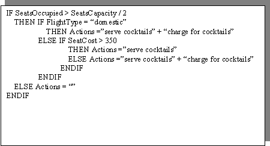
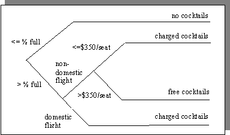
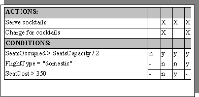
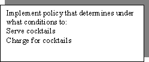
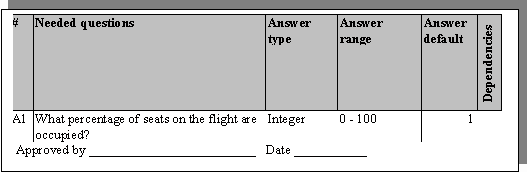
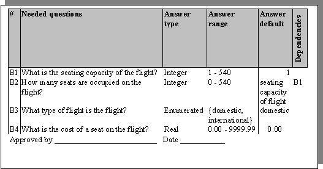
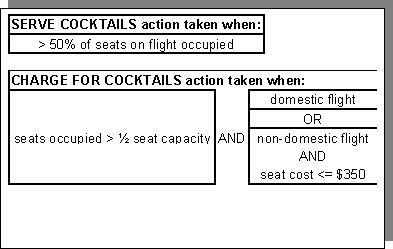
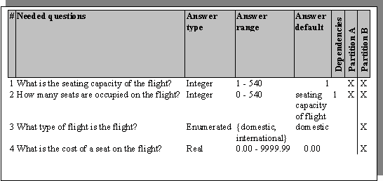
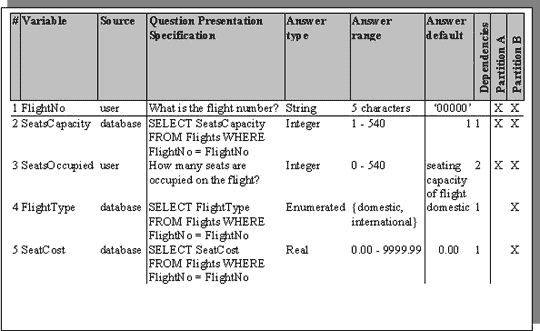

<!--yml

类别：未分类

日期：2024-05-27 14:24:34

-->

# 如何在软件开发中使用决策表进行需求分析

> 来源：[`www.methodsandtools.com/archive/archive.php?id=39`](https://www.methodsandtools.com/archive/archive.php?id=39)

**如何在软件开发中使用决策表方法分析复杂的条件行动需求**

D. Robert Baker

**背景：决策**

决策是关于“行动方案”的选择。行动方案可能包括许多个体行动。决策可以根据结构化程度从非结构化到结构化（Simon 1960）[1]进行划分。

**非结构化决策**

非结构化决策通常是在紧急情况下做出的一次性建议（Holsapple 和 Whinston 1996）[2]，即条件集合是独特的，并且没有固定的规则来根据条件采取行动。可能的行动方案不必是有限的。做出非结构化决策因此是启发式的。自动化这样的决策涉及使用决策支持系统，试图获取和组织尽可能多的相关信息，以供决策者使用。然后，决策者应用他认为适当的任何启发式来得出行动方案。

**结构化决策**

结构化决策是可预测的，即在特定条件下，要采取的行动方案是清晰和可定义的。选择是在预定义的、有限的行动集合中选择哪些行动。因此，做出结构化决策是算法性的。有三种常见的表达这些算法的方法。请注意，这三种方法都能处理多变量条件，而不仅仅是二进制条件。

图 1 - 简单策略的典型自然语言表达

用于包机航班的机上服务收费

**结构化英语**

结构化英语试图允许使用剥离了歧义的自然语言来表达特定条件下要采取的行动。这是通过以下方式实现的：

+   选择自然语言动词和名词的简单子集，并

+   定义构造以表达

+   序列

+   选择

+   和迭代

如果这种消除歧义的方法足够严格，得到的定义就会定义一种可执行的编程语言。这是 50 年代和 60 年代创建原始过程计算机语言编译器时采用的方法。这些定义是（并且仍然是）如此复杂，以至于程序员需要数月甚至数年的培训才能掌握定义的语法和语义。这几乎不可能将业务领域的知识和编程语言的技术熟练程度结合到一个人身上。

较不严格的非可执行结构化英文定义被称为*伪代码*，分析员将其用作创建中间规范的分析工具。此规范传递给程序员，他们将其转换为实际的符合编译器的代码。这一额外步骤导致了额外的费用，因为需要额外的专业人员，并且由于中间翻译涉及的不可避免的误解和错误。

在 70 年代和 80 年代，曾试图创建“自然计算机语言”（如 NATURAL、ENGLISH），其语法和语义限制较松。希望通过使编译器能够直接成功解释领域专家的“松散”自然语言来消除中间步骤。这些努力取得了有限的成功，并且今天很少见到。

图 2 是图 1 中政策的典型可执行结构化英文表达式

**决策树**

决策树是一种表示条件及其结果行动的图形工具。它由一个有向无环图（根树）组成，其中非终端边表示从根部顺序评估的一组条件。一个节点是一个决策点，其中评估一个条件。终端边（叶子）表示行动。

决策树是一种有利于人类可视化的复杂决策变量的表达工具。直接操作决策树的软件（Oblique Classifier 1、TreePlan）可用，但往往局限于高度技术化的科学专业，如天文学或 DNA 序列分析，并且需要高度的技术水平才能使用。

图 3 是图 1 中政策的典型决策树

**决策表**

决策表是一个二维矩阵，每个可能的动作有一行，每个相关条件有一行，每个条件状态的组合有一列。决策表可以非常简洁且严格地显示复杂条件及其产生的行动，同时保持对人类读者的可理解性。

第一组行表示可能采取的行动。在行动行中的“X”表示在下面列出的条件状态下将采取该行动。

在双变量决策表中，条件是二元的，将条件评估限制为“是”和“否”。这导致列数等于 2^(条件数)。随着条件数的增加，这可能很快导致大量的列。幸运的是，很少有每个条件组合导致不同行动的情况。

在图 4 中，说明了使用“-”或“不关心”符号。这意味着该行中的条件不会影响要采取的行动。查看第一列，我们发现只要第一个条件为假，无论最后两个条件的状态如何，都不会采取任何行动。每个“不关心”都减少了必要的列数，并增加了表格的可理解性。在这个例子中，2³ = 8 种可能的组合减少到 4 种。

创建决策表最常见的工具是电子表格软件，例如 Microsoft Excel。尽管这是相当复杂的软件，但它便宜，易于获得，并且拥有大量经过培训的用户。由于这种软件的普及性和复杂性，相当容易创建额外的软件，可以读取在电子表格中创建的决策表，理解其中包含的语义，并采取行动来实现表中表达的逻辑。

这样简单的软件最终允许在分析-综合过程中去除“第三个人”，允许分析师或者甚至是擅长逻辑的政策专家单独直接创建可执行代码来实现政策。

图 4 展示了图 1 中政策的典型二元决策表

**采取行动：用于描述政策的决策表方法**

鉴于我们有：

+   表达政策的一种方法

+   简洁，

+   全面的，

+   严谨的，以及

+   易于使用和理解，以及

+   直接从这个表达式到实现政策的可执行代码的机器翻译机制，

我们如何从混乱的现实政策世界到一个漂亮、整洁、明确的决策表，在电子表格中准备好用于机器翻译？

**步骤 1：确定政策范围**

没有预定义范围的项目容易受到各种危险的影响：

***   范围蔓延**

***   缺乏项目完成标准的定义**

往往很难定义项目范围的术语，这些术语是明确的，易于确定的，以满足所有方的需求。 使用决策表使这成为一项非常简单的任务。

政策项目的范围是通过确定和表达要实施的所有政策来确定的。在决策表术语中，政策实施是通过行动来表达的。项目本身包括确定和表达将采取这些行动的条件。

基于决策表的政策项目的范围是通过列举可能采取的所有行动来确定的。**这样的列举简单、明确，清楚地定义了项目的边界，无法争辩。**

图 5 展示了图 1 中表达的政策范围的典型声明

**步骤 2：确定政策权威**

我们的政策到底是什么？我们在哪里找到它们？它们是不是都以某个地方的大书点形式书写的？是否有一个人在某个办公室里知道它们所有并可以按需解释它们？很可能不是。

在大多数组织中，政策的总和由复杂的文档和主题专家网络所知悉和维护。很少能找到一个单一的来源。

另外，人员来了又走。专业知识得到并且失去。文档不断处于不稳定状态。新政策添加，旧政策淘汰。通常在相应文档的维护上存在滞后时间，经常在不同位置的文档在不同时间更新，有时甚至永远不会更新。

**必须为感兴趣的每个政策领域建立明确的权威。**这个权威可以是：

***政策声明**

***一位主题专家**

***一组主题专家**

政策越复杂、不确定和模糊，确定指定权威以解释，必要时更严格地定义它就越重要。必须有一个人说了算。

决策表中的模糊逻辑可以像任何其他实现一样轻松处理。这不应与“模糊政策”混淆，需要在任何实施之前由适当的权威澄清。

图 6 模糊逻辑注解

**第三步：划分政策**

政策通常应根据分析效率的利益进行划分。不同的分析员和主题专家组可以并行处理不同的划分工作。政策划分的基础包括：

+   **在第一步骤中确定的单独行动**这是划分的最简单基础，但可能会导致划分过多而效率低下。

+   **在第二步骤中确定的主题领域**这是政策划分的最自然基础。主题专家组自然会对其专业相关的政策领域具有管辖权。以这种方式划分允许分析师与一个群体一起处理一个更大的相关政策部分。

+   **组织分割**政策可以按照组织线条整齐地划分，也可以完全正交。如果自然政策领域与组织领域之间有很强的对应关系，则根据这些工作领域划分政策可能更有效。因此，可以避免部门间的政治问题，并将政策专家的访问局限在本地。

图 7 是图 5 政策范围的简单划分

**第四步：调查与行动和政策逻辑相关的条件**

有了明确的范围（要实施的行动列表）和明确解释政策的权威机构，下一步是从这些权威机构那里获取影响行动的条件以及确定行动的逻辑所使用的条件。

此规范采用何种形式？在此过程中要求主题专家为其管辖区域的行动制定完整的决策表，这将对他们提出不必要的复杂要求。此外，汇总各政策领域的临时结果以提高整个项目的效率是可取的。

在这个阶段，我们需要从我们的主题领域当局收集每个分区所需的两件事：

***确定采取何种行动的问题列表**

应向主题专家提出“您需要回答哪些问题才能决定采取何种行动？”的问题。答案的来源并不重要。这些问题的答案可能来自用户、内部表格、仪器，甚至远程数据库。我们真正寻找的是行动所依赖的数据。对于每个获取的问题（数据），我们需要以下元数据：

***可用于回答问题的类型**

***可用于回答问题的范围**

***将用于填充答案变量的默认答案，如果没有得到可接受的答案**

***提问顺序中的任何依赖关系**

此处显示了问题格式的价值。它清楚地表明了行动是基于特定信息的，并帮助他们隔离这些数据。

**图 8** 图 7 中分区 A 和分区 B 的注释问题列表。

注意：主题专家已选择默认值，以最大程度地减少在某些信息不可用时提供免费饮料的可能性！

注意：问题 B2 的默认值取决于问题 B1 的答案。这意味着问题的顺序依赖性。这种依赖关系必须跟踪以供将来参考。

注意：政策机构必须在继续之前签署这些分析报告。

**描述根据输入数据（对问题的答案）决定行动所使用的逻辑**此逻辑的形式是开放的。最佳的呈现方法是同时：

+   对主题专家来说最舒适，

+   明确且

+   便于分析员和主题专家理解。

政策逻辑可以以满足这些标准的任何形式呈现，包括图 1、2、3、4 或 9 中使用的形式。分析人员必须在此展示他在与专业领域专家沟通以引出、组织和展示这种逻辑方面的技巧和创造力。

分析人员必须确保：

+   所有问题都被分配了类型、范围和默认值。

+   所有问题的答案都用于到达行动的过程中，

+   没有行动依赖于未提出的问题的答案，以及

收集了这些信息后，分析员必须：

+   以表格形式组织它（见图 8），

+   填写任何剩余的空白，

+   表示并向专业领域专家解释其含义，以及

+   将关联的政策逻辑重新表达给专业领域专家进行验证（见图 9）。

然后这些权威必须要么签署此政策区域的正确和授权的表示，要么进行必要的更改以完成此签署。

图 9 还有另一种表达政策逻辑的方法

**步骤 5：整理跨分区的问题列表**

分析了每个政策区域的分区数据后，需要将这些数据整合到一个主集合中。

这包括：

+   **主问题集** 主问题集是所有单独问题集的并集。所有单独的问题列表必须汇总到一个包含所有小列表中的所有问题的大列表中。必须小心处理这些较小集合的交集。汇总的指南：

+   可能需要更改问题措辞、类型、范围或默认值，以使其在分区之间保持一致。

+   有些问题可能需要拆分或合并（参见图 10）。

+   两个或更多的列表中可能包含同义问题，即表达相同事物但使用不同术语、词语或表达的问题。

+   还要注意同音异义词，即出现在两个或多个列表中的问题，看起来是相同的，但实际上代表不同的数据。

+   还需要整合步骤 4 中注意到的问题依赖关系，以跟踪在实际决策评估过程中数据收集中的任何必要顺序。

+   最后，有必要显示每个问题最初使用该问题的分区。

这使得：

+   跟踪未来问题变化对政策区域的影响，以便进行维护，

+   如果需要，对政策区域进行重新划分，并

+   根据跨政策区域的使用情况对问题集中的问题进行优先排序，如果有必要限制或限制问题集，应该使用更复杂的优先级排名系统而不仅仅是标记一个“X”，例如 1' 最重要，2' 第二重要，等等。

图 10 合并的主问题集，用于图 8 的问题列表。合并了单个问题，添加了问题依赖项，并添加了问题所在的分区。

注意：Partition A 的第一个且唯一的问题被确定为与 Partition B 的前两个问题相同。第二个表达式被选择为更适合使用，即更粒度更细，并包含了第一个。

在这个过程中，保持原始问题的语义和意图至关重要，这些问题已获得各个学科领域权威的批准。如果在合并过程中进行了重大、可疑或令人困惑的更改，智慧的做法是重新获得学科领域权威的批准。

+   **问题依赖图** 分析人员可能会发现，为了可视化或呈现的目的，将所有较小问题列表中的合并问题依赖信息汇总到一个有向无环图中可能是有利的，如图 11 所示。再次强调，一个问题可能依赖于许多其他问题的答案，而许多问题可能依赖于一个问题的答案。最好不要有任何循环！

图 11 图 10 主问题集的问题依赖图

**步骤 6：创建数据字典**

创建用于决策评估软件的变量数据字典现在变得非常简单。

***   创建一个变量名以保存每个问题所询问的数据**选择一个:*   指示数据值意义的术语*   与政策领域现有的任何编码标准一致*   与决策表语言的编码标准一致***   为每个变量（问题）指定数据来源**使用代码指示此数据将来自何处。它可以从用户、各种数据库或其他来源中获取。***   根据问题依赖关系对问题排序**确保依赖其他问题的答案的问题在所依赖的问题之后提问。这些信息甚至可能确定是否提出问题。

图 12：图 10 主问题集的数据字典。

示例数据源分为用户输入和 SQL 数据库访问。

注意：为了减少用户输入并允许数据库访问其他数据片段，数据字典中添加了额外的行（问题）。

+   **调整问题以匹配数据源** 鉴于数据可能来自各种来源，问题本身现在成为一个问题展示规范，即从信息源中获取答案数据的实际问题是什么？一些例子：*   用户文本 - 如果数据通过文本输入从用户那里征询，问题展示规范表示将呈现给用户以征求答案数据的文本。*   可以在实际问题中添加一些说明性文本，以帮助用户充分理解问题。例如，不仅仅询问“航班上有多少座位被占用？”可能更可取的是进一步解释“航班上有多少座位被占用？这仅包括付费乘客，不包括赠送的、促销的、机组或跳座位。”*   还要注意，可能有多个规范，例如，在为多语言环境设计的系统中，每种语言都会有一个单独的问题展示规范，用于提问。*   音频 - 如果数据来自语音响应系统，则问题展示规范表示将播放给用户以征求数据的音频文件（或播放此类文件所需的代码）。在这里，同样可以创建多个规范以处理多语言环境。*   数据库 - 如果数据来自数据库，则问题展示规范表示发送给数据库管理系统（例如 SQL）以征求数据的查询。

**步骤 7：创建决策表**

实际创建可执行决策表高度依赖于读取、解释和执行它们的软件。要解释这个过程，就需要阐述那个执行软件的语法和语义。当然，这将随着软件的不同而变化，超出了本文的范围，本文限于整个过程的需求收集和分析阶段。

**结论：一种快速、简便、严谨且可重复的方法论**

决策表理论自计算机时代的曙光以来就已经存在。它具有利用人类感知和认知风格的特征，同时保持严密和简洁。在非科学环境中试图自动执行这些决策表的直接机器的严肃尝试受到了限制，原因是

+   范式强调其他模型

+   缺乏广泛可用、价格低廉且有大量培训用户群的电子表格软件

+   缺乏廉价高效的决策表执行软件

提出了一种结构化且可重复的分析方法。感兴趣的政策被定位、分割、澄清并拥有。收集、详细说明、格式化和批准将这些数据转换为可执行格式所需的所有信息（数据和逻辑）。

此时，假如有可靠的决策表执行软件，将这些数据输入可执行的决策表应该是一项简单的任务，不需要熟练的程序员干预，也不会带来额外步骤中固有的延迟和错误。

**参考文献**

[1] Simon, H.A. 1960\. *管理决策的新科学.* 纽约: 哈珀与罗

[2] Holsapple, C.W. 和 Whinston, A.B. 1996\. *决策支持系统：基于知识的方法.* 圣保罗, 明尼苏达州: 西方

[3] Siler, William, 博士 [wsiler@aol.com]. "构建模糊专家系统" [http://users.aol.com/wsiler/]

* * *

点击此处查看存档文章的完整列表

本文最初发表于 2004 年秋季《方法与工具》杂志**
