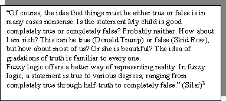

<!--yml
category: 未分类
date: 2024-05-27 14:24:34
-->

# How to Use Decision Tables for Requirements Analysis in Software Development

> 来源：[https://www.methodsandtools.com/archive/archive.php?id=39](https://www.methodsandtools.com/archive/archive.php?id=39)

**How to Use a Decision Table Methodology to Analyze Complex Conditional Actions Requirements in Software Development**

D. Robert Baker

**Background: Decisions**

A decision is a choice about a "course of action". A course of action may include many individual actions. A decision may be characterized on a continuum from unstructured to structured (Simon 1960) [1].

**Unstructured Decisions**

Unstructured decisions are generally one-time propositions taken in emergent situations (Holsapple and Whinston 1996) [2], i.e. the set of conditions are unique and there are no fixed rules for the course of action to take based on the conditions. The possible courses of action need not be finite. Making an unstructured decision is therefore heuristic. Automating such decisions involves the use of Decision Support Systems, which attempt to obtain and organize as much relevant information as possible for presentation to the decision maker. The decision maker then applies whatever heuristics he considers appropriate to come up with a course of action.

**Structured Decisions**

Structured decisions are predictable, i.e. given a particular set of conditions, the course of action to be taken is clear and definable. The choice is which actions to take among a predefined, finite collection of actions. Making a structured decision is therefore algorithmic. There are three common methods of expressing these algorithms. Note that all three of these methods are capable of dealing with multivariate, not merely binary conditions.

Figure 1 - A typical natural language expression of a simple policy
for charging for in-flight services on charter flights

**Structured English**

Structured English is an attempt to allow the use of natural language, stripped of ambiguity, to express actions to be taken under particular conditions. This is accomplished by:

*   choosing a simple subset of natural language verbs and nouns, and
*   defining constructs to express
*   sequence
*   selection
*   and iteration

If this stripping of ambiguity is sufficiently rigorous, the resulting definition defines an executable programming language. This was the approach taken in the creation of the original procedural computer language compilers in the 50s and 60s. These definitions were (and remain) so complex that programmers required months and even years of training to acquire competence in the syntax and semantics of the definition. This made it almost impossible to combine knowledge of the business domain and technical proficiency in the programming language in one individual.

Less rigorous non-executable Structured English definitions are known as *pseudocode* and are used as analytical tools by analysts to create an intermediate specification. This specification is passed to programmers who translate it into actual compiler-compliant code. This extra step results in added expense both because of extra specialist personnel and because of the inevitable miscommunications and errors involved in an intermediate translation.

Attempts were made in the 70s and 80s to create "natural computer languages" (e.g. NATURAL, ENGLISH) with much looser syntactic and semantic restrictions. The hope was to eliminate the intermediate step by empowering the compiler to successfully interpret the "sloppy" natural language of the domain expert directly. These efforts met with limited success and are rarely seen today.

Figure 2 a typical executable structured English expression of the policy in Figure 1

**Decision Trees**

A decision tree is a graphic tool that represents conditions and their resulting actions. It consists of a directed acyclic graph (rooted tree) in which the non-terminal edges represent a set of conditions evaluated sequentially from the root. A node is a decision point where a condition is evaluated. The terminal edges (leaves) represent actions.

Decision trees are a useful tool for expressing complex decision variables in a format conducive to human visualization. Software that directly manipulates decision trees is available (Oblique Classifier 1, TreePlan), but tends to be limited to highly technical scientific specialties like astronomy or DNA sequence analysis and requires a high degree of technical sophistication to use.

Figure 3\. a typical decision tree of the policy in Figure 1

**Decision Tables**

A decision table is a two-dimensional matrix with one row for each possible action and one row for each relevant condition and one column for each combination of condition states. A decision table can very concisely and rigorously show complex conditions and their resulting actions while remaining comprehensible to a human reader.

The first set of rows indicates the possible actions that may be taken. An "X" in an action row shows that the action will be taken under the condition states indicated in the column below.

In a bivariate decision table, conditions are binary, restricting condition evaluations to "yes" and "no". This results in a number of columns equal to 2 ^(number of conditions). This can quickly result in a huge number of columns as the number of conditions rise. Fortunately, it is unusual that every combination of conditions results in a different action.

In Figure 4, the use of the "-", or "don't care" notation is illustrated. This means that the condition in that row does not affect the action to be taken. Looking at the first column, we see that no action will be taken no matter the state of the last two conditions as long as the first condition is false. Each "don't care" reduces the number of columns necessary and increases the comprehensibility of the table. In this example the 2³ = 8 possible combinations are reduced to 4.

The most common tool for the creation of decision tables is spreadsheet software, such as Microsoft Excel. Although this is really quite sophisticated software, it is cheap, readily available, and has a large base of trained users. Because of the ubiquity and sophistication of this software, it is quite easy to create additional software that can read decision tables created in the spreadsheet, understand the semantics therein contained, and take action to implement the logic expressed in the table.

Such simple software finally allows the removal of the "3^(rd) man" in the analysis-synthesis process, allowing an analyst or even a logic-savvy policy expert alone to directly create executable code to implement policy.

Figure 4 a typical bivariate decision table of the policy in Figure 1

**Taking Action: Decision Table Methods for Describing Policy**

Given that we have:

*   a method of expressing policy that is
*   concise,
*   comprehensive,
*   rigorous, and
*   easy to use and understand, and
*   a mechanism for machine translation directly from this expression to executable code that implements the policy,

How do we get from the messy real world of policy to a nice, neat, unambiguous decision table in a spreadsheet ready for machine translation?

 **Step 1: Determine Policy Scope

A project without a predefined scope is subject to peril in the forms of:

***   Scope creep**

***   Lack of definition of project completion criteria**

It is often difficult to define terms for project scope that are unambiguous and easily determinable to meet the needs of all parties. The use of decision tables makes this a very straightforward task.

The scope of a policy project is determined by delineating all the policy that to be implemented. In decision table terms, policy implementation is expressed by actions. The project itself consists of determining and expressing the conditions under which these actions will be taken.

The scope of a decision table-based policy project is determined by enumerating all the actions that may possibly be taken. **Such an enumeration is simple, unambiguous and clearly defines the boundaries of the project beyond argument.**

Figure 5 a typical statement of scope for the policy expressed in Figure 1

**Step 2: Determine Policy Authority**

What *are* our policies, anyway? Where do we find them? Are they all written in point form in a big book somewhere? Is there one person in an office somewhere who knows them all and can explain them on demand? Probably not.

In most organizations, the sum total of policy is known and maintained by an intricate network of documentation and subject matter experts. It's rare to find a single source.

Additionally, personnel come and go. Expertise is gained and lost. Documentation is constantly in a state of flux. New policy is added and old policy is phased out. There is usually a lag time in the maintenance of the corresponding documentation, often with documentation in different locations being updated at different times, if ever.

**A definitive authority must be established for each area of policy of interest.** This authority may be:

***   A statement of policy**

***   A subject matter expert**

***   A group of subject matter experts**

The more complex, indefinite, and ambiguous the policy, the more important it is to have properly constituted authority designated to interpret, and if necessary, more rigorously define it. Someone must have the final word.

Fuzzy logic in policy can be dealt with in decision tables as easily as in any other implementation. This is not to be confused with "fuzzy policy", which needs to be clarified by the appropriate authority before any implementation is possible.

Figure 6 a note on fuzzy logic

**Step 3: Partition Policy**

Policy should generally be partitioned in the interests of analytical efficiency. Different groups of analysts and subject matter experts can pursue work in different partitions in parallel. Bases for policy partitioning include:

*   **The separate actions identified in Step 1**This is the simplest basis for partitioning but may result in too many partitions to be efficient.
*   **The subject matter areas identified in Step 2** This is the most natural basis for policy partitioning. A subject matter expert group will naturally have jurisdiction over areas of policy related by their expertise. Partitioning in this way allows the analyst to work with one group on a larger section of related policy as a unit.
*   **Organizational divisions** Policy may be neatly divided along organizational lines or it may be completely orthogonal. If there is a strong correspondence between natural policy areas and organizational areas, it may be more efficient to partition policy based on these work areas. Interdepartmental political issues can thus be avoided and access to policy experts localized.

Figure 7 a simple partitioning of the policy scope of Figure 5

**Step 4: Elicit Conditions Associated with Actions and Policy Logic**

With a firm scope (list of actions to be implemented) and the authorities to definitively interpret policy, the next step is to elicit from these authorities the conditions which affect the actions and the logic used to determine the actions given the conditions.

What form does this specification take? Asking subject matter experts at this point in the process to produce completed decision tables for the actions in their jurisdictions would be placing unnecessary expectations of sophistication upon them. In addition, it is desirable to collate interim results from all policy areas to gain efficiencies over the entire project.

At this stage, we need to gather two things for each of our partitions from our subject area authorities:

***   A list of questions to ask to determine what action to take**

Subject matter experts should be asked "What questions would you need answered in order to decide on a course of action?". The source of the answers is unimportant. The answers to these questions may come from users, internal tables, instruments, or even distant databases. We are really looking for the data on which actions depend. For each question (datum) elicited, we need the following metadata:

***   the type of answers that could be used to respond to the question**

***   the range of answers that could be used to respond to the question**

***   a default answer that will be used to populate the answer variable should an acceptable answer not be forthcoming**

***   any dependencies in the order of questions asked**

The question format shows its value here. It makes it clear to the subject matter experts that actions are based on specific pieces of information and helps them to isolate these data.

**Figure 8** annotated question list for Partition A and Partition B from Figure 7.

Note: subject matter experts have chosen default values to minimize the chances of serving free drinks should some information not be available!

Note: the default value for question B2 is dependent on the answer to question B1\. This implies an order dependency of questions. This dependency must be kept track of for future reference.

Note: policy authorities must sign off on these analyses before proceeding.

**A description of the logic used to decide on the actions based on the input data (answers given to the questions)** The form of this logic is open. The best method of presentation is that which is at the same time:

*   most comfortable to the subject matter expert,
*   unambiguous, and
*   comprehensible to both the analyst and the subject matter expert.

The policy logic may be delivered in any form that meets these criteria, including those used in Figures 1, 2, 3, 4, or 9\. The analyst must show his skill and creativity here in communicating with the subject matter experts to elicit, organize, and present this logic.

The analyst must ensure that:

*   all questions are assigned types, ranges, and default values.
*   the answers to all questions are used in the process of arriving at an action,
*   no action depends on answers to questions not present, and

Having gathered this information, the analyst must:

*   organize it in a tabular format (See Figure 8),
*   fill in any remaining blanks,
*   represent and explain its meaning to the subject matter experts, and
*   restate the associated policy logic to the subject matter experts for verification (See Figure 9).

These authorities then must either sign off this representation of the policy area as correct and authorized or make such changes as necessary to complete this signoff.

Figure 9 Still another method of expressing policy logic

**Step 5: Collate Question Lists across Partitions**

Having analyzed the data from each policy area as partitioned, it is necessary to collate this data into a master set.

This consists of:

*   **Master Question Set** The Master Question Set is the union of all the separate question sets. All the separate question lists must be collated into one large list containing all the questions from all the smaller lists. Care must be taken with the intersections of these smaller sets. Guidelines for collation:
*   Changes may be necessary to question wordings, types, ranges, or defaults to make them consistent across partitions.
*   Some questions may have to be split or merged (see Figure 10).
*   Two or more of these lists may contain synonymous questions i.e. questions that express the same thing, but use different terms, words, or expressions.
*   Beware also of homonyms i.e. questions on two or more lists that appear to be the same, but in fact represent different data.
*   It is also necessary to amalgamate the question dependencies noted in Step 4 to keep track of any necessary ordering in the datagathering during the actual decision evaluation process.
*   Lastly, it is necessary to show for each question the partitions that originally used that question.

This allows:

*   tracking of the effect of future question changes on policy partitions during maintenance,
*   repartitioning of the policy area if desired, and
*   prioritization of the questions within the question set based on usage across policy areas should it become necessary to limit or restrict the question set for any reason. If this is an issue, a more sophisticated priority ranking system than just marking an 'X' may be used, e.g. 1 ' most important, 2 ' 2^(nd) most important, etc.

Figure 10 merged Master Question Set for the question lists of Figure 8\. Individual questions are merged, question dependencies are added, and partitions where the questions are used are added.

Note: the first and only question of Partition A has been determined to be identical to the first two questions of Partition B. The second expression has been chosen as more appropriate for use i.e. more granular, and inclusive of the first.

It is of prime importance in this process to maintain the semantics and intent of the original questions as approved by the individual subject area authorities. If significant, dubious, or confusing changes have been made during the amalgamation, it is wise to reaffirm approvals from the subject matter authorities.

*   **Question Dependency Chart** The analyst may find it desirable for purposes of visualization or presentation to summarize the amalgamated question dependency information from all the smaller question lists in a directed acyclic graph as shown in Figure 11\. Again, a question may depend on the answers to many other questions and many questions may depend on the answer to one question. There better not be any loops!

Figure 11 Question Dependency Chart for the Master Question Set of Figure 10

**Step 6: Create the Data Dictionary**

Creation of a data dictionary of variables for use by the decision evaluation software is now a simple matter.

***   Create a variable name to hold the data solicited by each question**Choose a term that is:*   indicative of the meaning of the data value held*   consistent with any coding standards preexistent in the policy area*   consistent with the coding standards of the decision table language***   Indicate a data source for each variable (question)**Use a code to indicate where this data will come from. It could be solicited from a user, from any of a variety of databases, or from another source.***   Order the questions according to the question dependencies**Ensure that questions that depend on the answers to other questions are asked after the questions they depend on. This information may even determine if the question is asked at all.

Figure 12 Data Dictionary for the Master Question Set of Figure 10.
Example data sources are split between user input and SQL database access.

Note: An extra row (question) has been added to the Data Dictionary in order to reduce user input by allowing database access for the other pieces of data.

*   **Adjust the question to match the data source** Given that the data may come from any of a variety of sources, the question itself now becomes a question presentation specification i.e. What is actually asked of the information source to elicit the answer data? Some examples:*   user text ' If the data is solicited from a user via text entry, the question presentation specification represents the text that will be presented to the user to solicit the answer data.*   It may be useful to add some explanatory text to the actual question to help the user fully understand the question. For example, instead of merely asking "How many seats are occupied on the flight?", it may be more desirable to explain further "How many seats are occupied on the flight? This only includes paying passengers, not complimentary, promotional, crew or jump seats."*   Also note that it is possible to have multiple specifications e.g. in a system designed for a multilingual environment, there would be a separate question presentation specification for each language in which the question would be asked.*   audio - If the data is solicited from a voice response system, the question presentation specification represents the audio file (or code necessary to play such a file) that will be played to the user to solicit the data. Here again, multiple specifications could be created to deal with a multilingual environment.*   database - If the data is solicited from a database, the question presentation specification represents the query (e.g. SQL) sent to the DBMS to solicit the data.

**Step 7: Create the Decision Tables**

The actual creation of executable decision tables is highly dependent on the software that reads, interprets, and executes them. To explain this process, it would be necessary to expound the syntax and semantics of that executing software. This of course, would vary with that software and is beyond the scope of this paper, which is limited to the requirements gathering and analysis phase of the overall process.

**Conclusion: A Quick, Easy, Rigorous, and Repeatable Methodology**

Decision table theory has been available since the dawn of the computing era. It has features that take advantage of human styles of perception and cognition and yet maintain rigor and conciseness. Serious attempts to automate direct machine execution of these decision tables in a non-scientific environment have been limited by

*   paradigmatic emphasis being placed on other models
*   lack of widely available, inexpensive spreadsheet software with a large trained user base
*   lack of inexpensive and efficient decision table executing software

An analysis methodology has been presented which is structured and repeatable. Policy of interest is located, partitioned, clarified, and owned. All the information (data and logic) necessary to convert this data into an executable format is gathered, fleshed out, formatted, and approved.

At this point, given reliable decision table execution software, the entry of this data into executable decision tables should be a straightforward task not requiring the intervention of a skilled programmer with the subsequent delays and errors inherent in that extra step.

**References**

[1] Simon, H.A. 1960\. *The new science of management decision.* New York: Harper & Row

[2] Holsapple, C.W. and Whinston, A.B. 1996\. *Decision support systems: a knowledge-based approach.* St. Paul, MN: West

[3] Siler, William, Ph.D. [wsiler@aol.com]. "Building Fuzzy Expert Systems" [http://users.aol.com/wsiler/]

* * *

[Click here to view the complete list of archived articles](archive.php)

[This article was originally published in the Fall 2004 issue of Methods & Tools](../mt/download.php?fall04)**