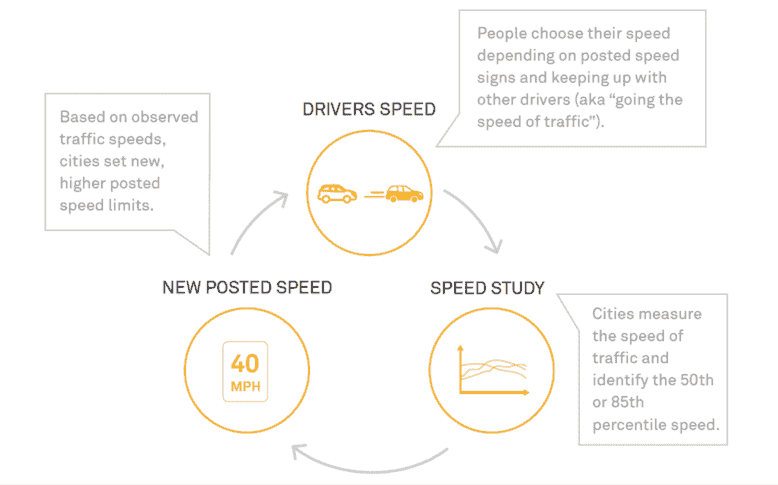

<!--yml

分类：未分类

日期：2024-05-27 14:24:19

-->

# 在为气候赢得一场胜利的同时，城市限速正在下降» 耶鲁气候连接

> 来源：[https://yaleclimateconnections.org/2023/12/in-a-win-for-the-climate-urban-speed-limits-are-dropping/](https://yaleclimateconnections.org/2023/12/in-a-win-for-the-climate-urban-speed-limits-are-dropping/)

自2015年以来，西雅图已经降低了其道路网络的大部分路段的限速，将居民街道限制在每小时20英里，大多数较大的城市走廊限制在每小时25英里。这些变化生效后，研究显示交通事故减少了约20%，而发生的事故导致的受伤情况也明显减少了。

美国各地的城市都在效仿西雅图的做法，从丹佛和明尼阿波利斯到华盛顿特区和霍博肯，限速都在下降。尽管这些变化的动机是减少交通事故造成的死亡和伤害，但人们越来越意识到它们也有益于气候。

“安全和环境目标是相辅相成的。它们不可避免地相互联系，”西雅图交通部门的首席安全官维努·内马尼说。

#### **高速限制成为气候友好交通的障碍**

交通是美国排放量最大的来源，并且乘用车是该行业的主要罪犯。电动汽车可以帮助减少这些排放，但它们并不是解决问题的灵丹妙药——许多专家认为达到气候目标还需要减少汽车使用。因此，政府帮助人们通过步行、骑自行车和乘坐公共交通来满足他们的需求至关重要（这通常需要步行到一个公共交通站点）。

但要实现这一目标，就需要使步行或骑自行车的人在街道上更安全，因为对道路安全的担忧是阻碍步行和骑自行车的常见障碍。不幸的是，这些担忧是有根据的。根据世界卫生组织的数据，全球每年有超过100万人死于交通事故。超过一半的死亡和伤害来自脆弱群体，如行人、骑自行车者和摩托车手。

在美国，[行人](https://www.ghsa.org/resources/news-releases/GHSA-Pedestrian-Spotlight23#:~:text=Pedestrian%20deaths%20have%20surged%2018,.%2C%20of%20research%20firm%20Westat.) 和 [骑行者](https://www.iihs.org/topics/fatality-statistics/detail/bicyclists#:~:text=Posted%20May%202023.-,Trends,their%20lowest%20point%20in%202010) 的死亡人数近年来呈上升趋势，背后是更广泛的道路系统失灵，每年[夺走数万人的生命](https://www.nhtsa.gov/press-releases/traffic-crash-death-estimates-2022)。

“我们在美国有着交通死亡危机，” 国家城市交通官员协会的高级传媒经理 Alex Engel 说道。“交通死亡人数非常之高，尤其与我们的同行相比。由于各种不同的原因，情况正在变得更糟。”

车辆速度在这些事故中起着重要作用，速度更快会导致更多和更严重的碰撞。更高的速度对汽车外的人尤其危险。根据 AAA 交通安全基金会的数据，被以每小时 23 英里行驶的车辆撞击的行人面临[10% 的死亡风险](https://aaafoundation.org/impact-speed-pedestrians-risk-severe-injury-death/)。而以每小时 46 英里的速度行驶时，这个风险增加到了 90%。

**全球推动更安全的街道**

Engel 表示，美国城市降低速度限制的运动代表了与过去刻意区别开来的一种迫切需要。

“多年来，我们在美国设置速度限制的方式实际上已经非常过时，它基本上是基于伪科学的，” 他说。

传统方法基本上允许驾驶员自行确定速度限制。在这种模式下——仍然在很多地方使用——交通官员在一定时期内测量特定道路上所有车辆行驶的速度，而没有交通拥堵，然后确定该组最快的 15% 车辆行驶的速度。然后，这个数字（四舍五入）就成为该道路的新的速度限制。然而，由于一些驾驶员超速行驶，这种方法导致速度限制随时间上升。

(图片来源：[国家城市交通官员协会](https://nacto.org/))

超越这一方法的努力受到国际先例的启发。[零死亡愿景](https://www.roadsafetysweden.com/about-the-conference/vision-zero---no-fatalities-or-serious-injuries-through-road-accidents/)是瑞典议会于1997年首次采纳的一项战略，其影响尤为深远。而传统的道路安全方法强调个人的责任来防止事故，零死亡愿景则专注于创造一个系统，在这个系统中，人为错误——完全消除不可能——更不可能造成严重伤害。一些[用于实现这一目标的措施](https://visionzeronetwork.org/wp-content/uploads/2018/11/Vision_Zero_Core_Elements.pdf)包括降低速度限制、重新设计街道（例如添加环岛）以及绘制事故地点地图，以便更强有力地干预热点区域。

影响全球交通速度辩论的另一个力量是总部位于英国的志愿组织[20’s Plenty for Us](https://www.20splenty.org/)。该组织于2007年由罗德·金（Rod King）创立，他是一位热衷于骑自行车的人，在访问德国自行车友好城市希尔登时体验了每小时20英里的限速带来的好处。该运动的口号的变体已被交通机构和倡导者采纳，例如“20就够了”已出现在[华盛顿特区的公交车上](https://twitter.com/DDOTDC/status/1456638944897126401)，在[盐湖城的庭院标牌](https://sweetstreetsslc.org/20-is-plenty)上。

欧洲和美国的决策者对“零死亡愿景”和“20英里足矣”理念持开放态度。据金（King）称，在英国，2800万人——几乎总人口的42%——现在居住在每小时20英里的社区。[伦敦](https://tfl.gov.uk/corporate/safety-and-security/road-safety/safe-speeds)降低了其速度限制，布鲁塞尔、巴黎和[其他欧洲首都](https://etsc.eu/amsterdam-follows-paris-brussels-and-madrid-with-default-30-km-h-limits/)也降低了限速。在国家层面，[西班牙](https://etsc.eu/spain-switches-most-urban-roads-to-30-km-h-amid-calls-for-action-in-several-eu-member-states/)和[威尔士](https://www.gov.wales/introducing-20mph-speed-limits-frequently-asked-questions)分别在许多道路上设定了30公里每小时（约19英里每小时）和20英里每小时的默认限速。

**设计安全的交通系统**

温·胡，是美国高速公路安全保险协会的高级交通研究工程师，她研究了西雅图和[波士顿](https://pubmed.ncbi.nlm.nih.gov/30636698/#:~:text=Results%3A%20The%20speed%20limit%20reduction,these%20reductions%20were%20statistically%20significant.)降低限速的效果。她说，来自其他国家的这些类似研究基本上证实了降低限速带来的实际好处。“基本上，所有这些研究都讲述着同样的故事：降低限速可以减少超速行驶并减轻事故严重程度。”

基于胡等人的研究，《[城市限速](https://nacto.org/safespeeds/)》，这是由全国城市交通官员协会于 2020 年发布的一份报告，得出结论：简单地改变限速标志的做法可以为市政府带来显著的投资回报。“西雅图、波士顿和多伦多等地的越来越多的证据表明，即使没有任何执法努力，司机也会对张贴的速度限制做出反应，”作者们写道。

当然，单靠降低限速并不能完全消除事故。胡警告说，尽管降低限速是有效的，但需要与[其他以安全为重点的干预措施](https://www.transportation.gov/NRSS/SafeSystem)相结合。“问题并不像你只是降低限速就能解决的那么简单，”她说。

许多美国人最熟悉的干预措施——警察执法——远非理想，《城市限速》指出。报告的作者写道，在执行交通法律时，警察不成比例地停止有色人种，而且警察主导的限速执法可能会对有色人种社区产生破坏性的意外后果。

相反，报告称，在街道上速度常见的地方减缓交通最有效的方法是改变街道本身的物理设计和运营方式；例如，增加减速带并减少停车信号灯的绿灯时长。速度摄像头也可以起到一定作用。

**西雅图重新设计其街道以保护骑行者和行人**

最近几年，西雅图成功地重新设计了许多街道以减缓交通，城市倡导团体[西雅图社区绿道](https://seattlegreenways.org/)的社区组织者克拉拉·坎托说道。然而，一些街道仍然鼓励超速行驶，并且该市[平均每年 28 起交通死亡事故](https://www.seattle.gov/transportation/projects-and-programs/safety-first/vision-zero#:~:text=While%20Seattle%20is%20one%20of,nearly%20180%20people%20seriously%20injured.) 中有很高的比例发生在这些走廊上。

“西雅图还有一些街道确实设计得像高速公路，感觉你应该像在高速公路上开车一样。这就是我们看到大多数重大车祸和死亡事件发生的地方，”她说。

尽管单靠降低速度限制并不能阻止所有的死亡事件，也不能一夜之间改变每个驾驶员的行为，但它在“长远的游戏”中扮演着至关重要的角色，正如Cantor所说。"现在，当西雅图交通部门(SDOT)在每条街道上进行任何一个小项目时，他们都会为比以前更低的速度限制进行设计。因此，随着时间的推移，这对很多街道产生了很大的影响。"

西雅图社区绿道仍在[推动城市采取更多措施](https://seattlegreenways.org/our-priorities/current-priorities/vision-zero/)来保护自行车骑行者、行人和公共交通乘客，但Cantor表示，即使对于愤世嫉俗的交通活动家来说，交通部门自从采纳了“零视觉”以来的进展令人印象深刻。她说，在市内骑自行车的经历“与2016年完全不同”，“现在好多了，感觉更安全了。”她还指出，公共交通系统也变得更加健壮，行人通行权也得到了改善。

这些变化使西雅图的人们更容易在没有汽车的情况下出行。"在过去的十年里，我们的人口增长了约20%，与此同时，我们的[街道]网络上的交通量基本保持不变，我们的公共交通乘客量增长了约30%," Venu Nemani说道。"我们基本上每天都在为西雅图市民提供更多出行选择，通过使用非汽车模式来出行。"

根据20英里每小时速度限制的20多个20英里/小时的变化对于广泛变革的初步阶段是一个常见的好处。这使得降低速度限制成为想要改善道路安全和减少排放的城市的关键第一步。

“车辆的速度影响您的[道路]过街。它影响您必须采取的措施来保护自行车骑行者。它影响您必须采取的措施来保护其他汽车驾驶员，” King说道。“因此，降低速度-降低道路网络中的动能-您会发现您有更多的选择。”
