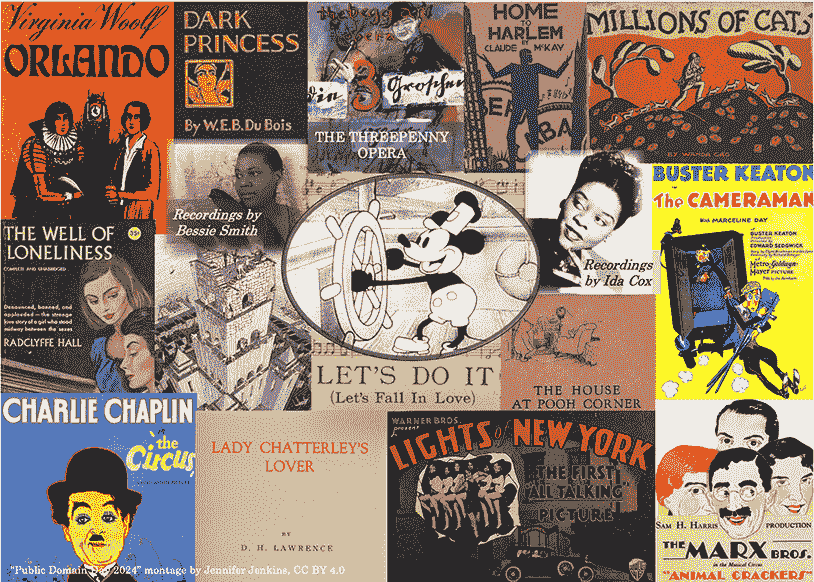
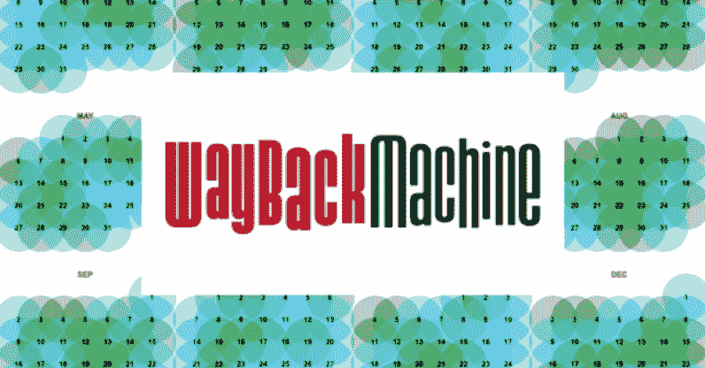

<!--yml

类别：未分类

日期：2024 年 05 月 27 日 17:09:38

-->

# [《多元主义》：2024 年的公共领域是一场盛宴（2023 年 12 月 20 日）— 来自科里·多克托罗的每日链接](https://pluralistic.net/2023/12/20/em-oh-you-ess-ee/)

> 来源：[`pluralistic.net/2023/12/20/em-oh-you-ess-ee/`](https://pluralistic.net/2023/12/20/em-oh-you-ess-ee/)

# 今天的链接

* * *

# 2024 年的公共领域是一场盛宴（[永久链接](https://pluralistic.net/2023/12/20/em-oh-you-ess-ee/#sexytimes)）

他们从你那里偷了一样东西。几十年来，他们一直在偷。他们偷的东西？你们整个文化。在人类历史上，每年都有在生活记忆中创作的作品进入公共领域。40 年前，这停止了。

首先是在 1976 年，然后又在 1998 年，国会回溯性地将版权的保护期延长了 20 年，适用于所有作品，包括作者不详且早已去世、其合适的继承人无法找到的作品。其中许多作者被永久地从历史中抹去，因为他们的作品的每一个已知副本都在它们能够通过复制、改编和再利用重新进入我们的文化之前就消失了（版权是“严格责任”，这意味着即使你支付了清理作品权利的费用给一个有充分理由相信自己控制这些权利的人，如果他们错了，你作为侵权者负责，而法定赔偿金额高达六位数）。

在我们创造的作品中，仍然在文化中流传 50、70 或 90 年后的作品只是我们作为一个物种创造的作品的微不足道的一部分。但这些作品——根据定义——对我们的文化非常重要。创作这些作品的人能够利用丰富的公共领域中的仍然流传的作品作为他们自己持久创作的输入。对公共领域的慢动作纵火意味着两代创作者被剥夺了历史上任何其他创作者都享有的公共领域。

面对 2019 年的临近，曾经为此而奋斗的版权反对者开始变得紧张，然后……兴高采烈。国会真的会听从几十年来一个失败实验的证据，并拒绝再次延长版权吗？

[`archive.org/details/MarybethPetersFormerUsRegisterOfCopyrightsOnTermsBeingTooLong`](https://archive.org/details/MarybethPetersFormerUsRegisterOfCopyrightsOnTermsBeingTooLong)

我曾和同志们就此展开过电子邮件辩论。项目古腾堡的远见卓识的创始人迈克尔·S·哈特*确定*不会发生这种事情（他没有活到看到这一切）。但是，奇迹般地，令人震

[`web.law.duke.edu/cspd/publicdomainday/2019/`](https://web.law.duke.edu/cspd/publicdomainday/2019/)

数十年来，来自杜克大学公共领域研究中心的詹妮弗·詹金斯每年都会为我们*没有*得到的公共领域作品发出悲叹。詹金斯辛苦地编目了公众将被剥夺的材料，尽管它们的创作者曾经非常乐意释放它们，因为他们相信版权将比实际情况短 40 年。

从 2019 年开始，这些悲叹变成了庆祝活动，是一代创作者发现自卡特政府以来首次发现一个活跃的公共领域的起跑枪。2019 年进入公共领域的 1923 年作品大多是好奇心，但随着每一年的到来，公共领域的新成员变得越来越有活力。

在 2023 年 1 月 1 日到达的公共领域运输是一个*banger*：我们得到了一些弗吉尼亚·伍尔夫，一些海明威，一些卡夫卡，一些福克纳，一些阿加莎·克里斯蒂和伊迪丝·华顿，以及普鲁斯特和赫塞：

[`pluralistic.net/2022/12/20/free-for-2023/#oy-canada`](https://pluralistic.net/2022/12/20/free-for-2023/#oy-canada)

去年，所有的福尔摩斯都进入了公共领域。我们还得到了“Ol' Man River”，“Puttin' On the Ritz”和“Mississippi Mud”。

我们 2023 年没有得到什么？音频录音。音乐现代化法案冻结了所有音频录音的版权，直到 2024 年—即 11 天之后。

那些旧的 78 转每分钟录音存在于奇怪的超位置。一方面，它们具有真正的文化价值，并给许多听众带来极大的快乐。另一方面，它们要么不产生收入（在停产录音的情况下），要么收入微乎其微。

互联网档案馆，一个公共图书馆，通过其 Great 78 项目保存了超过 40 万个这些录音。就像每个带有声音录音收藏的图书馆一样，档案馆向拥有图书馆卡的人提供对这些录音的访问权限：

[`great78.archive.org/`](https://great78.archive.org/)

但唱片业决定攻击这个图书馆及其创始人。在一项可能会关闭互联网档案馆并使其创始人破产的诉讼中，他们声称基于互联网的图书馆无法做到他们的实体对应物自始至终所做的事情：

[`blog.archive.org/2023/08/14/internet-archive-responds-to-recording-industry-lawsuit-targeting-obsolete-media/`](https://blog.archive.org/2023/08/14/internet-archive-responds-to-recording-industry-lawsuit-targeting-obsolete-media/)

大三唱片公司（环球、索尼和华纳）收购了所有竞争对手，最终导致三家公司拥有*70%*的所有受版权保护的声音录音，但他们并未认真对待自己购买并将永久支配的录音历史的责任。尽管他们攻击独立的保存我们文化的努力，但他们严重地未能在自己的平台上保存它：

[`www.nytimes.com/2019/06/11/magazine/universal-fire-master-recordings.html`](https://www.nytimes.com/2019/06/11/magazine/universal-fire-master-recordings.html)

1 月 1 日不会改变这一切：到了今年的公共领域日，唱片公司仍然拥有世界上绝大部分音乐，并且他们仍然漠不关心地保存着它，他们仍然试图消灭互联网档案馆和 Wayback Machine，他们仍然试图削弱布鲁斯特·卡尔。

但至少今年我们会再次在公共领域中得到一些音乐。实际上，今年的公共领域日正在成为比 2023 年更加盛大的一年：

[`web.law.duke.edu/cspd/publicdomainday/2024/`](https://web.law.duke.edu/cspd/publicdomainday/2024/)

今年进入公共领域的大部分作品来自 1928 年，比海斯守则早六年，这是一套由电影卡特尔监督的自我审查制度，它禁止了性、激进政治、同性恋和这个世界上一切好的东西的出现数代。1928 年是电影卡特尔的“大宪章”被通过的年份——一套自愿指南，被电影公司们完全无视：

[`en.wikipedia.org/wiki/Hays_Code#Pre-Code:_%22Don'ts%22_and_%22Be_Carefuls%22,_as_proposed_in_1927`](https://en.wikipedia.org/wiki/Hays_Code#Pre-Code:_%22Don'ts%22_and_%22Be_Carefuls%22,_as_proposed_in_1927)

20 世纪 20 年代晚期是*非常情色*的。1928 年的公共领域时光胶囊包括 DH 劳伦斯的*查特利夫人的情人*、科尔·波特的*让我们做吧*、弗吉尼亚·伍尔夫的*奥兰多*、卡恩和唐纳森的*举行性爱*，以及，最情色的，米尔恩的*维尼熊角落的房子*，首次出现了文学史上最伟大的永恒性骚扰者：提格尔。

在 2024 年得到这些性感的 1928 年的东西——当惊慌失措的偏执者们正在对流行文化中的性发动战争时——*相当*及时。这些虔诚的伪君子们一直表现得好像流行文化中的性，“孩子们可以看到的地方”，是五年前由头发染成紫色、使用新代词和鼻环的学术编辑发明的。给自由的妈妈们的地球通讯：自由文化中没有性的“好日子”已经在 20 亿年前结束了，当时有角质的真核生物发明了交配。

但是 1928 年并不是*全部*都是翩翩起舞的年轻女子与大学生在老爷车的后座上做爱。我们新解放的文化先驱们还抽出时间创作了马克思兄弟的*动物饼干*、布莱希特的*三分之一的歌剧*（包括*麦克刀*）、阿加莎·克里斯蒂的*蓝色列车的秘密*。

WEB 杜波伊斯的*黑暗的公主*将于 1 月 1 日归入公共领域。罗伯特·弗罗斯特的*西行的小溪*和巴斯特·基顿的*摄影师*也将于此时归入公共领域。我们将得到查理·卓别林的*马戏团*和莱尼的*笑面人*，这些作品被鲍勃·凯恩掠夺以创造小丑。你可以录制*儿子*、*我只能给你爱*或*我想被你爱*。

除了几天后进入公共领域的所有作品，还有两年来的首批录音：查尔斯顿舞曲，*Yes, We Have No Bananas*，以及萨奇莫与奥利弗国王克里奥尔爵士爵士乐队合唱的 *Dipper Mouth Blues* 和 *Froggie More*。

还值得注意的是：艾舍尔的作品开始进入公共领域。记录残缺，但是 *巴别塔* 将在 1 月 1 日属于你们（这特别令人满意，考虑到该遗产是一个著名的恶霸，曾经向我发出毫无根据的威胁）。

还有很多其他可能于 2024 年进入公共领域的视觉艺术，但由于注册记录组织得如此混乱，很难说。许多那些艺术作品可能并未注册或更新，已经属于公共领域。1924 年至 1963 年间出版的书籍中有 80%基于这一基础上已经属于公共领域！

[`www.crummy.com/2019/07/22/0`](https://www.crummy.com/2019/07/22/0)

在那些秘密公共领域的作品中？H·P·洛夫克拉夫特的 *克苏鲁的呼唤*，自*1956 年*以来一直处于公共领域（洛夫克拉夫特的遗产是另一个那些即将被淘汰的恶霸，多亏了重新唤醒的公共领域）。

当然，主要事件是米老鼠，他与他的前两部短篇卡通作品一起进入了公共领域：*Plane Crazy* 和 *Steamboat Willie*。尽管有很多关于商标将米老鼠挡在公共领域外的恐慌，但这是一个谎言。他是你们的（大部分）：

[`pluralistic.net/2023/12/15/mouse-liberation-front/#free-mickey`](https://pluralistic.net/2023/12/15/mouse-liberation-front/#free-mickey)

看到公共领域再次扩大真是令人欣喜，但请为那些版权囚禁超出作品本身的孤儿作品多想一下。今年有几部无声电影进入了公共领域——但其中一些电影已经不再完整存在，甚至完全消失了。它们在我们文化上的慢动作纵火袭击中被焚毁，这场纵火始于 40 多年前的垄断性娱乐产业。

今天，世界上最糟糕的人仍然掌控着那种文化，并且他们仍在毁坏它。大卫·扎斯拉夫，今年编剧罢工和演员罢工的可憎的恶棍，开创了永久删除受爱戴的电影和电视节目的方式，作为为 Discovery-Warner 这个臃肿的后合并巨头获取税收抵免的廉价手段：

[`insidethemagic.net/2023/04/warner-bros-under-fire-for-destroying-history-af1/`](https://insidethemagic.net/2023/04/warner-bros-under-fire-for-destroying-history-af1/)

系统的目的是它的功能。并不是七十年代和九十年代要求版权延长的媒体高管没有预见到这是一场大规模的文化灭绝事件。而是他们不在乎。David Zaslav 焚毁自己公司的保险库是他所在行业的一个跨代传统的一部分。那些媒体高管非常清楚他们在做什么。他们只是不在乎。

* * *

# 嘿，看这个（[永久链接](https://pluralistic.net/2023/12/20/em-oh-you-ess-ee/#linkdump)）

* * *

# 历史上的今天（[永久链接](https://pluralistic.net/2023/12/20/em-oh-you-ess-ee/#retro)）

#10 年前 堪萨斯大学可以因推文“与大学最佳利益相悖”而解雇教师 [`www.washingtonpost.com/news/monkey-cage/wp/2013/12/19/kansas-board-of-regents-restricts-free-speech-for-academics/`](https://www.washingtonpost.com/news/monkey-cage/wp/2013/12/19/kansas-board-of-regents-restricts-free-speech-for-academics/)

#10 年前 法官驳回了由英国间谍和中央情报局移交给卡扎菲进行酷刑的利比亚人，因为“这可能会让美国感到尴尬” [`www.theguardian.com/world/2013/dec/20/libyan-rendition-claim-uk-interests`](https://www.theguardian.com/world/2013/dec/20/libyan-rendition-claim-uk-interests)

#10 年前 国家安全局和英国政府通信总部针对非政府组织、慈善机构、欧盟首席和以色列国防部长进行深度监视 [`www.theguardian.com/uk-news/2013/dec/20/gchq-targeted-aid-agencies-german-government-eu-commissioner`](https://www.theguardian.com/uk-news/2013/dec/20/gchq-targeted-aid-agencies-german-government-eu-commissioner)

#10 年前 俄克拉荷马市警察以“恐怖主义欺骗”指控 Keystone XL 抗议者，因为他们的横幅上洒了一些闪光粉 [`www.vice.com/en/article/xd5dxa/two-environmentalists-were-charged-with-terrorism-hoax-for-too-much-glitter-on-their-banner`](https://www.vice.com/en/article/xd5dxa/two-environmentalists-were-charged-with-terrorism-hoax-for-too-much-glitter-on-their-banner)

#10 年前 三个男孩的母亲对清风多包装的有趣评论 [`www.amazon.com/review/RFWM0CFO0UMWY/?_encoding=UTF8&camp=1789&creative=390957&linkCode=ur2&tag=downandoutint-20#RFWM0CFO0UMWY`](https://www.amazon.com/review/RFWM0CFO0UMWY/?_encoding=UTF8&camp=1789&creative=390957&linkCode=ur2&tag=downandoutint-20#RFWM0CFO0UMWY)

#10 年前 通过倾听 CPU 的“线圈嗡嗡声”派生加密密钥 [`arstechnica.com/information-technology/2013/12/new-attack-steals-e-mail-decryption-keys-by-capturing-computer-sounds/`](https://arstechnica.com/information-technology/2013/12/new-attack-steals-e-mail-decryption-keys-by-capturing-computer-sounds/)

#10yrsago 有线电视行业首席游说者：数据限制从未是关于网络拥塞，而总是关于利润 [`www.dslreports.com/shownews/Cable-Industry-Finally-Admits-Caps-Not-About-Congestion-122791`](https://www.dslreports.com/shownews/Cable-Industry-Finally-Admits-Caps-Not-About-Congestion-122791)

#5yrsago 发烧友级的 MQA 格式真的没有 DRM，但这并不意味着它不在封闭技术的有毒彩虹之中 [`www.eff.org/deeplinks/2018/12/closed-proprietary-felonious-toxic-rainbow-locked-technology`](https://www.eff.org/deeplinks/2018/12/closed-proprietary-felonious-toxic-rainbow-locked-technology)

#5yrsago 最新的 Facebook 丑闻或许可以解释为何亚马逊错误地禁止书评者 [`gizmodo.com/amazon-and-facebook-reportedly-had-a-secret-data-sharin-1831192148`](https://gizmodo.com/amazon-and-facebook-reportedly-had-a-secret-data-sharin-1831192148)

#5yrsago 深入探讨让亏损的水力压裂行业声称盈利的有趣会计学 [`www.desmog.com/2018/12/18/fracking-finances-record-oil-production-fuzzy-math/`](https://www.desmog.com/2018/12/18/fracking-finances-record-oil-production-fuzzy-math/)

#5yrsago 对 Airbnb 进行监管会降低当地租金（以及房价） [`cepr.org/voxeu/columns/short-term-rentals-and-housing-market-quasi-experimental-evidence-airbnb-los-angeles`](https://cepr.org/voxeu/columns/short-term-rentals-and-housing-market-quasi-experimental-evidence-airbnb-los-angeles)

#5yrsago 亚马逊打击不良卖家的举措使得打击好卖家账户的不良卖家更容易 [`www.theverge.com/2018/12/19/18140799/amazon-marketplace-scams-seller-court-appeal-reinstatement`](https://www.theverge.com/2018/12/19/18140799/amazon-marketplace-scams-seller-court-appeal-reinstatement)

#5yrsago 并非所有的“屏幕时间”都是一样的 [`www.wired.com/story/year-in-review-tech-addiction-debate-all-wrong/`](https://www.wired.com/story/year-in-review-tech-addiction-debate-all-wrong/)

#5yrsago Facebook 2018 年丑闻大全 [`www.wired.com/story/facebook-scandals-2018/`](https://www.wired.com/story/facebook-scandals-2018/)

#5yrsago 盖特威克机场遭遇无人机恐慌，760 班航班改道，影响 110,000 名乘客 [`www.bbc.com/news/uk-england-sussex-46623754`](https://www.bbc.com/news/uk-england-sussex-46623754)

#1yrago 2023 年的公有领域是一部热门作品 [`pluralistic.net/2022/12/20/free-for-2023/#oy-canada`](https://pluralistic.net/2022/12/20/free-for-2023/#oy-canada)

* * *

今日头条来源：

正在撰写：

+   有关 DIY 胰岛素的《小兄弟》短篇故事 计划中

+   Picks and Shovels，一部马丁·亨奇黑色推理小说，讲述了个人电脑的英雄时代。即将由 TOR BOOKS 于 2025 年 1 月出版。

+   The Bezzle，一部马丁·亨奇黑色推理小说，讲述了监狱科技行业。即将由 TOR BOOKS 于 2024 年 2 月出版。

+   《警惕》，小弟弟远程监考的短篇小说。即将在[TOR.COM](https://tor.com)上发布。

+   《泄露》，关于管道抗议的小弟弟短篇小说。即将在[TOR.COM](https://tor.com)上发布。

最新播客：互联网的原罪 [`craphound.com/news/2023/12/17/the-internets-original-sin/`](https://craphound.com/news/2023/12/17/the-internets-original-sin/)

即将出场：

最近的出现：

最新图书：

+   《失落的理由》：一个关于气候紧急情况中希望的太阳朋克小说，Tor Books（美国），Head of Zeus（英国），2023 年 11 月 ([`lost-cause.org`](http://lost-cause.org))。在 Dark Delicacies 签名、个性化的副本：([`www.darkdel.com/store/p3007/Pre-Order_Signed_Copies%3A_The_Lost_Cause_HB.html#/`](https://www.darkdel.com/store/p3007/Pre-Order_Signed_Copies%3A_The_Lost_Cause_HB.html#/))。

+   《互联网的骗局》：一本关于互操作性和大科技的非虚构书籍（Verso）2023 年 9 月 ([`seizethemeansofcomputation.org`](http://seizethemeansofcomputation.org))。在 Book Soup 签名副本：[`www.booksoup.com/book/9781804291245`](https://www.booksoup.com/book/9781804291245)。

+   《红队之困》：“一部引人入胜的、强迫性的惊悚小说，会让你对世界的运作方式有更深的了解。” TOR Books [`redteamblues.com`](http://redteamblues.com)。美国 Dark Delicacies 签名版：[以及英国 Forbidden Planet 签名版：](https://www.darkdel.com/store/p2873/Wed%2C_Apr_26th_6pm%3A_Red_Team_Blues%3A_A_Martin_Hench_Novel_HB.html#/) [`forbiddenplanet.com/385004-red-team-blues-signed-edition-hardcover/`](https://forbiddenplanet.com/385004-red-team-blues-signed-edition-hardcover/)。

+   《瓶颈资本主义：如何击败大科技、驯服大内容并让艺术家得到报酬，与 Rebecca Giblin 合作》，关于如何为创意劳动市场摆脱陷阱的书籍，Beacon Press/Scribe 2022 [`chokepointcapitalism.com`](https://chokepointcapitalism.com)

+   《攻击面》：第三部小弟弟小说，一部成人独立科技惊悚小说。《华盛顿邮报》称其为“一部政治网络惊悚小说，对革命和抵抗的局限性充满活力、大胆而精明。” 在 Dark Delicacies 订购签名、个性化的副本：[`www.darkdel.com/store/p1840/Available_Now%3A_Attack_Surface.html`](https://www.darkdel.com/store/p1840/Available_Now%3A_Attack_Surface.html)。

+   《如何摧毁监视资本主义》：一本反垄断宣传册，分析监视资本主义的真正危害并提出解决方案。[`onezero.medium.com/how-to-destroy-surveillance-capitalism-8135e6744d59?sk=f6cd10e54e20a07d4c6d0f3ac011af6b`](https://onezero.medium.com/how-to-destroy-surveillance-capitalism-8135e6744d59?sk=f6cd10e54e20a07d4c6d0f3ac011af6b))（签名版：[`www.darkdel.com/store/p2024/Available_Now%3A__How_to_Destroy_Surveillance_Capitalism.html`](https://www.darkdel.com/store/p2024/Available_Now%3A__How_to_Destroy_Surveillance_Capitalism.html)）。

+   《小兄弟/故土》：重新发行的合集版，附有 Edward Snowden 的新介绍：[`us.macmillan.com/books/9781250774583`](https://us.macmillan.com/books/9781250774583)；在这里获取个性化/签名副本：[`www.darkdel.com/store/p1750/July%3A__Little_Brother_%26_Homeland.html`](https://www.darkdel.com/store/p1750/July%3A__Little_Brother_%26_Homeland.html)

+   “Poesy the Monster Slayer”：一本关于怪物、就寝、性别和踢屁股的图片书。在这里订购：[`us.macmillan.com/books/9781626723627`](https://us.macmillan.com/books/9781626723627)。在这里获得个性化、签名的副本：[`www.darkdel.com/store/p2682/Corey_Doctorow%3A_Poesy_the_Monster_Slayer_HB.html#/`](https://www.darkdel.com/store/p2682/Corey_Doctorow%3A_Poesy_the_Monster_Slayer_HB.html#/)

即将出版的图书：

+   《骗局》：《红队蓝调》的续集，讲述监狱技术和其他欺诈，Tor Books，2024 年 2 月

+   《锄头与铁镐》：《红队蓝调》的续集，讲述个人电脑的英勇时代，Tor Books，2025 年 2 月

+   《未经授权的面包》：根据我的中篇小说改编的图像小说，讲述难民、烤面包机和数字版权管理，FirstSecond，2025 年

* * *

此作品 - 不包括任何连载小说 - 采用知识共享署名 4.0 许可证。这意味着您可以按照您喜欢的任何方式使用它，包括商业用途，前提是您将其归属于我，Cory Doctorow，并包含到 [pluralistic.net](https://pluralistic.net)的链接。

[`creativecommons.org/licenses/by/4.0/`](https://creativecommons.org/licenses/by/4.0/)

引用和图片不包含在此许可证中；它们是根据版权限制或例外或基于单独的许可证而包含的。请谨慎行事。

* * *

# 如何获取 Pluralistic：

博客（无广告、追踪或数据收集）：

[Pluralistic.net](http://pluralistic.net)

通讯（无广告、追踪或数据收集）：

[`pluralistic.net/plura-list`](https://pluralistic.net/plura-list)

Mastodon（无广告、追踪或数据收集）：

[`mamot.fr/@pluralistic`](https://mamot.fr/@pluralistic)

Medium（无广告，付费壁垒）：

[`doctorow.medium.com/`](https://doctorow.medium.com/)

Twitter（大规模、无限制、第三方监视和广告）：

[`twitter.com/doctorow`](https://twitter.com/doctorow)

Tumblr（大规模、无限制、第三方监视和广告）：

[`mostlysignssomeportents.tumblr.com/tagged/pluralistic`](https://mostlysignssomeportents.tumblr.com/tagged/pluralistic)

“*当生活给你 SARS 时，你就制作沙士苦艾酒*” - Joey“手风琴小子”DeVilla

### 像这样：

像加载中...
