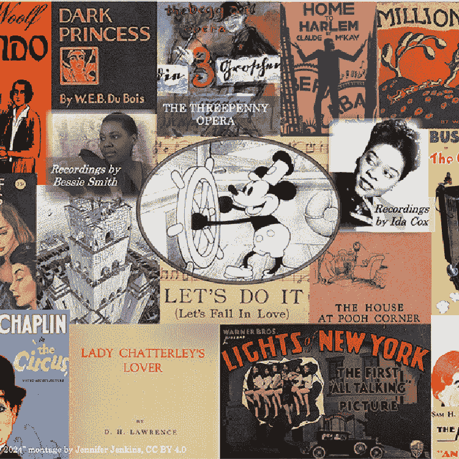
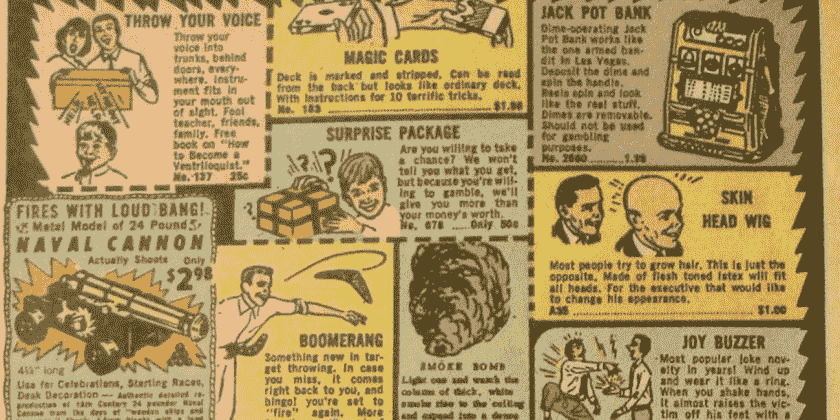

<!--yml
category: 未分类
date: 2024-05-27 17:09:38
-->

# Pluralistic: 2024’s public domain is a banger (20 Dec 2023) – Pluralistic: Daily links from Cory Doctorow

> 来源：[https://pluralistic.net/2023/12/20/em-oh-you-ess-ee/](https://pluralistic.net/2023/12/20/em-oh-you-ess-ee/)

# Today's links

* * *

# 2024's public domain is a banger ([permalink](https://pluralistic.net/2023/12/20/em-oh-you-ess-ee/#sexytimes))

They stole something from you. For decades, they stole it. That thing they stole? Your entire culture. For all of human history, works created in living memory entered the public domain every year. 40 years ago, that stopped.

First in 1976, and then again in 1998, Congress retroactively extended copyright's duration by 20 years, for all works, including works whose authors were unknown and long dead, whose proper successors could not be located. Many of these authors were permanently erased from history as every known copy of their works disappeared before they could be brought back into our culture through reproduction, adaptation and re-use (copyright is "strict liability," meaning that even if you pay to clear the rights to a work from someone who has good reason to believe they control those rights, if they're wrong, you are on the hook as an infringer, and the statutory damages run to six figures).

Works that are still in our cultural currents 50 or 70 or 90 years after their creation are an infinitesimal fraction of all the works we create as a species. But these works are – by definition – extraordinarily important to our culture. The creators who made these works were able to plunder a rich public domain of still-current works as inputs to their own enduring creations. The slow-motion arson attack on the public domain meant that two generations of creators were denied the public domain that every other creator in the history of the human race had enjoyed.

As 2019 drew nearer, the copyright resistance who had fought over this grew nervous, then…elated. Was Congress actually going to heed the evidence of a decades-long failed experiment and decline to extend copyright again?

[https://archive.org/details/MarybethPetersFormerUsRegisterOfCopyrightsOnTermsBeingTooLong](https://archive.org/details/MarybethPetersFormerUsRegisterOfCopyrightsOnTermsBeingTooLong)

I had pitched email debates with comrades over this. Michael S Hart, visionary founder of the Project Gutenberg, was *certain* it wouldn't happen (he didn't live to see it). But then, miraculously, astoundingly, 2019 rolled around and *we got new works in the public domain*!

[https://web.law.duke.edu/cspd/publicdomainday/2019/](https://web.law.duke.edu/cspd/publicdomainday/2019/)

For decades, Jennifer Jenkins from the Duke Center for the Study of the Public Domain published an annual lament for the public domain works we *weren't* getting that year. Jenkins painstakingly catalogued the materials that the public would be denied, though their creators had been only too happy to release them with the belief that the copyright would be 40 years shorter than it turned out.

Starting in 2019, those laments turned into celebrations, starter pistols for a generation of creators discovering a living public domain for the first time since the *Carter administration*. The 1923 works that entered the public domain in 2019 were mostly curiosities, but with each successive year, the public domain's new arrivals get ever more vibrant.

The public domain shipment that arrived on January 1, 2023 was a *banger*: we got some Virginia Woolf, some Hemingway, some Kafka, some Faulkner, some Agatha Christie and Edith Wharton, as well as Proust and Hesse:

[https://pluralistic.net/2022/12/20/free-for-2023/#oy-canada](https://pluralistic.net/2022/12/20/free-for-2023/#oy-canada)

All of Sherlock Holmes came home to the public domain last year. We also got "Ol' Man River," "Puttin' On the Ritz" and "Mississippi Mud."

What we didn't get 2023? Sound recordings. The Music Modernization Act froze all sound recordings in copyright until 2024 – that is, until 11 days hence.

Those old 78RPM recordings exist in an odd superposition. On the one hand, they have real cultural value and bring great joy to many listeners. On the other hand, they produce either zero (in the case of out-of-print recordings) or very little revenue for labels.

The Internet Archive, a public library, has preserved over 400,000 of these recordings through its Great 78 Project. Like every library with a sound recording collection, the Archive lends out access to these recordings to people with library cards:

[https://great78.archive.org/](https://great78.archive.org/)

But the record industry has decided to attack the library and its founder. In a lawsuit that could shut down the Internet Archive and bankrupt its founder, they claim that internet-based libraries can't do what their physical counterparts have done since literal time immemorial:

[https://blog.archive.org/2023/08/14/internet-archive-responds-to-recording-industry-lawsuit-targeting-obsolete-media/](https://blog.archive.org/2023/08/14/internet-archive-responds-to-recording-industry-lawsuit-targeting-obsolete-media/)

The Big Three labels (Universal, Sony and Warner) who bought out all their rivals until three companies ended up owning *70%* of all in-copyright sound recordings do not take seriously their responsibility to preserve the recording history they bought and now would exercise eternal dominance over. Even as they attack independent efforts to preserve our culture, they fail grotesquely to preserve it on their own:

[https://www.nytimes.com/2019/06/11/magazine/universal-fire-master-recordings.html](https://www.nytimes.com/2019/06/11/magazine/universal-fire-master-recordings.html)

January 1 won't change any of that: come this year's public domain day, the record labels will still own the vast majority of all the music in the world, and they'll still be indifferently preserving it, and they'll still be trying to kill the Internet Archive and the Wayback Machine, and they'll still be trying to eviscerate Brewster Kahle.

But at least we'll get some music in the public domain again this year. Indeed, this year's public domain is shaping up to be an even bigger banger than 2023:

[https://web.law.duke.edu/cspd/publicdomainday/2024/](https://web.law.duke.edu/cspd/publicdomainday/2024/)

The majority of works entering the public domain this year are from 1928, six years before the Hays Code – a regime of self-censorship overseen by the motion picture cartel that banned sex, radical politics, queerness, and everything else good in this world for generations – came into effect. 1928 was the year that the "Magna Charta" of the movie cartel was adopted – a set of voluntary guidelines that were roundly ignored by the studios:

[https://en.wikipedia.org/wiki/Hays_Code#Pre-Code:_%22Don'ts%22_and_%22Be_Carefuls%22,_as_proposed_in_1927](https://en.wikipedia.org/wiki/Hays_Code#Pre-Code:_%22Don'ts%22_and_%22Be_Carefuls%22,_as_proposed_in_1927)

The late 1920s were *super horny*. This year's public domain time-capsule from 1928 includes DH Lawrence's *Lady Chatterley's Lover*, Cole Porter's *Let's Do It*, Virginia Woolf's *Orlando*, Khan and Donaldson's *Makin' Whoopee*, and, horniest of all, Milne's *House at Pooh Corner*, featuring the first appearance of literature's greatest perennial sex-pest: Tigger.

Getting all this sexy stuff from 1928 in 2024 – when panicked bigots are waging war on sex in popular culture – is *quite* timely. These pietist prigs keep acting like sex in popular culture, "where the children can see it," was invented five years ago by Scholastic editors with purple hair, neopronouns and septum piercings. Earth to Moms For Liberty: the "good old days," free from sex in culture, ended 2 billion years ago when horny eukaryotes invented fucking.

But 1928 wasn't *all* flappers doing the horizontal Charleston with college men in the backs of jalopies. Our newly liberated cultural forebears found time to create the Marx Brothers' *Animal Crackers*, Brecht's *Threepenny Opera* (including *Mack the Knife*), and Agatha Christie's *The Mystery of the Blue Train*.

WEB Dubois's *Dark Princess* comes home to the public domain on Jan 1\. So do Robert Frost's *West-Running Brook* and Buster Keaton's *The Cameraman*. We're getting Charlie Chaplin's *The Circus* and Leni's *The Man Who Laughs*, which Bob Kane plundered to create The Joker. You can record *Sonny Boy*, *I Can't Give You Anything But Love* or *I Wanna Be Loved By You*.

In addition to all the compositions entering the public domain in a few days, there's the first shipment of recordings in two years: the Charleston, *Yes, We Have No Bananas*, and Satchmo singing with King Oliver’s Creole Jazz Band on *Dipper Mouth Blues* and *Froggie More*.

Also noteworthy: the works of MC Escher are starting to enter the public domain. The records are fragmentary, but *Tower Of Babel* is yours for the taking on Jan 1 (this is especially satisfying given that the estate is a noteworthy bully that has sent me baseless threats).

There's a lot of other visual art that may be entering the public domain in 2024, but because the registration records are so poorly organized, it's hard to tell. A lot of that art may not have been registered or renewed, and already be in the public domain. 80% of the books published between 1924 and 1963 are in the public domain on this basis!

[https://www.crummy.com/2019/07/22/0](https://www.crummy.com/2019/07/22/0)

Among those works that are Secretly Public Domain? HP Lovecraft's *Call of Cthulhu*, which has been public domain since *1956* (the Lovecraft estate is another one of those bullying monsters who will be put out of business soon, thanks to the reawakened public domain).

The main event, of course, is Mickey Mouse, who enters the public domain along with his first two short cartoon appearances: *Plane Crazy* and *Steamboat Willie*. Though there's been a lot of FUD about trademark keeping Mickey out of the public domain, it's a lie. He's all yours (mostly):

[https://pluralistic.net/2023/12/15/mouse-liberation-front/#free-mickey](https://pluralistic.net/2023/12/15/mouse-liberation-front/#free-mickey)

It's wonderful to see the public domain growing again, but spare a thought for the orphan works whose copyright caging outlasted the works themselves. This year saw several silent films entering the public domain – but some of those films no longer exist in their entirety, or at all. They were set afire in the slow-motion arson attack on our culture the monopolistic entertainment industry began 40+ years ago.

Today, the world's worst people remain in charge of that culture, and they're still destroying it. David Zaslav, the loathsome villain of this year's writers' strike and actors' strike, has pioneered the permanent erasure of beloved movies and TV shows as a cheap way of getting tax credits for the bloated post-merger behemoth of that is Discovery-Warner:

[https://insidethemagic.net/2023/04/warner-bros-under-fire-for-destroying-history-af1/](https://insidethemagic.net/2023/04/warner-bros-under-fire-for-destroying-history-af1/)

The purpose of a system is what it does. It's not that the media execs who demanded copyright extensions in the seventies and nineties failed to foresee that this was a mass cultural extinction event. It's that they didn't care. David Zaslav burning down his own company's vault is part of a multigenerational tradition in his industry. Those media execs know *exactly* what they're doing. They just don't care.

* * *

# Hey look at this ([permalink](https://pluralistic.net/2023/12/20/em-oh-you-ess-ee/#linkdump))

* * *

# This day in history ([permalink](https://pluralistic.net/2023/12/20/em-oh-you-ess-ee/#retro))

#10yrsago Kansas Universities can fire faculty for tweets that are “contrary to best interest of the University” [https://www.washingtonpost.com/news/monkey-cage/wp/2013/12/19/kansas-board-of-regents-restricts-free-speech-for-academics/](https://www.washingtonpost.com/news/monkey-cage/wp/2013/12/19/kansas-board-of-regents-restricts-free-speech-for-academics/)

#10yrsago Judge throws out Libyan rendered by UK spooks & CIA to Gaddafi for torture, because “it might embarrass America” [https://www.theguardian.com/world/2013/dec/20/libyan-rendition-claim-uk-interests](https://www.theguardian.com/world/2013/dec/20/libyan-rendition-claim-uk-interests)

#10yrsago NSA and GCHQ targeted NGOs, charities, EU chief, Israeli defense minister for deep surveillance [https://www.theguardian.com/uk-news/2013/dec/20/gchq-targeted-aid-agencies-german-government-eu-commissioner](https://www.theguardian.com/uk-news/2013/dec/20/gchq-targeted-aid-agencies-german-government-eu-commissioner)

#10yrsago Oklahoma City cops charge Keystone XL protesters with “terrorism hoax” because their banner shed some glitter [https://www.vice.com/en/article/xd5dxa/two-environmentalists-were-charged-with-terrorism-hoax-for-too-much-glitter-on-their-banner](https://www.vice.com/en/article/xd5dxa/two-environmentalists-were-charged-with-terrorism-hoax-for-too-much-glitter-on-their-banner)

#10yrsago Mother of three boys’ funny review for Kleenex multipacks [https://www.amazon.com/review/RFWM0CFO0UMWY/?_encoding=UTF8&camp=1789&creative=390957&linkCode=ur2&tag=downandoutint-20#RFWM0CFO0UMWY](https://www.amazon.com/review/RFWM0CFO0UMWY/?_encoding=UTF8&camp=1789&creative=390957&linkCode=ur2&tag=downandoutint-20#RFWM0CFO0UMWY)

#10yrsago Deriving cryptographic keys by listening to CPUs’ “coil whine” [https://arstechnica.com/information-technology/2013/12/new-attack-steals-e-mail-decryption-keys-by-capturing-computer-sounds/](https://arstechnica.com/information-technology/2013/12/new-attack-steals-e-mail-decryption-keys-by-capturing-computer-sounds/)

#10yrsago Chief cable lobbyist: data caps were never about network congestion, always about profit [https://www.dslreports.com/shownews/Cable-Industry-Finally-Admits-Caps-Not-About-Congestion-122791](https://www.dslreports.com/shownews/Cable-Industry-Finally-Admits-Caps-Not-About-Congestion-122791)

#5yrsago The audiophile MQA format really doesn’t have DRM, but that doesn’t mean it’s not on the toxic rainbow of locked tech [https://www.eff.org/deeplinks/2018/12/closed-proprietary-felonious-toxic-rainbow-locked-technology](https://www.eff.org/deeplinks/2018/12/closed-proprietary-felonious-toxic-rainbow-locked-technology)

#5yrsago The latest Facebook scandal might explain why Amazon wrongfully banned book-reviewers [https://gizmodo.com/amazon-and-facebook-reportedly-had-a-secret-data-sharin-1831192148](https://gizmodo.com/amazon-and-facebook-reportedly-had-a-secret-data-sharin-1831192148)

#5yrsago Inside the funny accounting that lets the money-losing fracking industry claim to be profitable [https://www.desmog.com/2018/12/18/fracking-finances-record-oil-production-fuzzy-math/](https://www.desmog.com/2018/12/18/fracking-finances-record-oil-production-fuzzy-math/)

#5yrsago Regulating Airbnb drives down local rents (as well as house prices) [https://cepr.org/voxeu/columns/short-term-rentals-and-housing-market-quasi-experimental-evidence-airbnb-los-angeles](https://cepr.org/voxeu/columns/short-term-rentals-and-housing-market-quasi-experimental-evidence-airbnb-los-angeles)

#5yrsago How Amazon’s crackdown on dirty sellers has made it easier for dirty sellers to kill good sellers’ accounts [https://www.theverge.com/2018/12/19/18140799/amazon-marketplace-scams-seller-court-appeal-reinstatement](https://www.theverge.com/2018/12/19/18140799/amazon-marketplace-scams-seller-court-appeal-reinstatement)

#5yrsago Not all “screen time” is created equal [https://www.wired.com/story/year-in-review-tech-addiction-debate-all-wrong/](https://www.wired.com/story/year-in-review-tech-addiction-debate-all-wrong/)

#5yrsago Master list of Facebook’s 2018 scandals [https://www.wired.com/story/facebook-scandals-2018/](https://www.wired.com/story/facebook-scandals-2018/)

#5yrsago 760 flights diverted from Gatwick airport after drone scare, affecting 110,000 passengers [https://www.bbc.com/news/uk-england-sussex-46623754](https://www.bbc.com/news/uk-england-sussex-46623754)

#1yrago 2023's public domain is a banger [https://pluralistic.net/2022/12/20/free-for-2023/#oy-canada](https://pluralistic.net/2022/12/20/free-for-2023/#oy-canada)

* * *

Today's top sources:

Currently writing:

*   A Little Brother short story about DIY insulin PLANNING
*   Picks and Shovels, a Martin Hench noir thriller about the heroic era of the PC. FORTHCOMING TOR BOOKS JAN 2025

*   The Bezzle, a Martin Hench noir thriller novel about the prison-tech industry. FORTHCOMING TOR BOOKS FEB 2024

*   Vigilant, Little Brother short story about remote invigilation. FORTHCOMING ON TOR.COM

*   Spill, a Little Brother short story about pipeline protests. FORTHCOMING ON TOR.COM

Latest podcast: The Internet’s Original Sin [https://craphound.com/news/2023/12/17/the-internets-original-sin/](https://craphound.com/news/2023/12/17/the-internets-original-sin/))

Upcoming appearances:

Recent appearances:

Latest books:

*   "The Lost Cause:" a solarpunk novel of hope in the climate emergency, Tor Books (US), Head of Zeus (UK), November 2023 ([http://lost-cause.org](http://lost-cause.org)). Signed, personalized copies at Dark Delicacies ([https://www.darkdel.com/store/p3007/Pre-Order_Signed_Copies%3A_The_Lost_Cause_HB.html#/](https://www.darkdel.com/store/p3007/Pre-Order_Signed_Copies%3A_The_Lost_Cause_HB.html#/))
*   "The Internet Con": A nonfiction book about interoperability and Big Tech (Verso) September 2023 ([http://seizethemeansofcomputation.org](http://seizethemeansofcomputation.org)). Signed copies at Book Soup ([https://www.booksoup.com/book/9781804291245](https://www.booksoup.com/book/9781804291245)).

*   "Red Team Blues": "A grabby, compulsive thriller that will leave you knowing more about how the world works than you did before." Tor Books [http://redteamblues.com](http://redteamblues.com). Signed copies at Dark Delicacies (US): [and Forbidden Planet (UK):](https://www.darkdel.com/store/p2873/Wed%2C_Apr_26th_6pm%3A_Red_Team_Blues%3A_A_Martin_Hench_Novel_HB.html#/) [https://forbiddenplanet.com/385004-red-team-blues-signed-edition-hardcover/](https://forbiddenplanet.com/385004-red-team-blues-signed-edition-hardcover/).

*   "Chokepoint Capitalism: How to Beat Big Tech, Tame Big Content, and Get Artists Paid, with Rebecca Giblin", on how to unrig the markets for creative labor, Beacon Press/Scribe 2022 [https://chokepointcapitalism.com](https://chokepointcapitalism.com)

*   "Attack Surface": The third Little Brother novel, a standalone technothriller for adults. The *Washington Post* called it "a political cyberthriller, vigorous, bold and savvy about the limits of revolution and resistance." Order signed, personalized copies from Dark Delicacies [https://www.darkdel.com/store/p1840/Available_Now%3A_Attack_Surface.html](https://www.darkdel.com/store/p1840/Available_Now%3A_Attack_Surface.html)

*   "How to Destroy Surveillance Capitalism": an anti-monopoly pamphlet analyzing the true harms of surveillance capitalism and proposing a solution. [https://onezero.medium.com/how-to-destroy-surveillance-capitalism-8135e6744d59?sk=f6cd10e54e20a07d4c6d0f3ac011af6b](https://onezero.medium.com/how-to-destroy-surveillance-capitalism-8135e6744d59?sk=f6cd10e54e20a07d4c6d0f3ac011af6b)) (signed copies: [https://www.darkdel.com/store/p2024/Available_Now%3A__How_to_Destroy_Surveillance_Capitalism.html](https://www.darkdel.com/store/p2024/Available_Now%3A__How_to_Destroy_Surveillance_Capitalism.html))

*   "Little Brother/Homeland": A reissue omnibus edition with a new introduction by Edward Snowden: [https://us.macmillan.com/books/9781250774583](https://us.macmillan.com/books/9781250774583); personalized/signed copies here: [https://www.darkdel.com/store/p1750/July%3A__Little_Brother_%26_Homeland.html](https://www.darkdel.com/store/p1750/July%3A__Little_Brother_%26_Homeland.html)

*   "Poesy the Monster Slayer" a picture book about monsters, bedtime, gender, and kicking ass. Order here: [https://us.macmillan.com/books/9781626723627](https://us.macmillan.com/books/9781626723627). Get a personalized, signed copy here: [https://www.darkdel.com/store/p2682/Corey_Doctorow%3A_Poesy_the_Monster_Slayer_HB.html#/](https://www.darkdel.com/store/p2682/Corey_Doctorow%3A_Poesy_the_Monster_Slayer_HB.html#/).

Upcoming books:

*   The Bezzle: a sequel to "Red Team Blues," about prison-tech and other grifts, Tor Books, February 2024
*   Picks and Shovels: a sequel to "Red Team Blues," about the heroic era of the PC, Tor Books, February 2025

*   Unauthorized Bread: a graphic novel adapted from my novella about refugees, toasters and DRM, FirstSecond, 2025

* * *

This work – excluding any serialized fiction – is licensed under a Creative Commons Attribution 4.0 license. That means you can use it any way you like, including commercially, provided that you attribute it to me, Cory Doctorow, and include a link to pluralistic.net.

[https://creativecommons.org/licenses/by/4.0/](https://creativecommons.org/licenses/by/4.0/)

Quotations and images are not included in this license; they are included either under a limitation or exception to copyright, or on the basis of a separate license. Please exercise caution.

* * *

# How to get Pluralistic:

Blog (no ads, tracking, or data-collection):

[Pluralistic.net](http://pluralistic.net)

Newsletter (no ads, tracking, or data-collection):

[https://pluralistic.net/plura-list](https://pluralistic.net/plura-list)

Mastodon (no ads, tracking, or data-collection):

[https://mamot.fr/@pluralistic](https://mamot.fr/@pluralistic)

Medium (no ads, paywalled):

[https://doctorow.medium.com/](https://doctorow.medium.com/)

Twitter (mass-scale, unrestricted, third-party surveillance and advertising):

[https://twitter.com/doctorow](https://twitter.com/doctorow)

Tumblr (mass-scale, unrestricted, third-party surveillance and advertising):

[https://mostlysignssomeportents.tumblr.com/tagged/pluralistic](https://mostlysignssomeportents.tumblr.com/tagged/pluralistic)

"*When life gives you SARS, you make sarsaparilla*" -Joey "Accordion Guy" DeVilla

### Like this:

Like Loading...