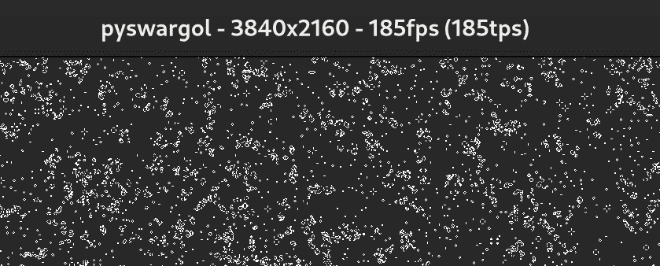

<!--yml

category: 未分类

日期：2024 年 5 月 27 日 14:32:31

-->

# 纯 Python 中的 SIMD | 博客

> 来源：[`www.da.vidbuchanan.co.uk/blog/python-swar.html`](https://www.da.vidbuchanan.co.uk/blog/python-swar.html)

# 纯 Python 中的 SIMD

*戴维·布坎南，2024 年 1 月 4 日*

首先，这篇文章是一种娱乐性的“因为我可以而编程的练习”。如果你只是想让你的 Python 代码跑得更快，也许这篇文章不适合你。也许 Python 也不是你想要的语言！

最后，我将解释我是如何在纯 Python 中实现[生命游戏](https://en.wikipedia.org/wiki/Conway%27s_Game_of_Life)（外加 pysdl2 用于图形输出）以 4K 分辨率以 180fps 运行的，这代表了比朴素实现快了~3800 倍。



如果你已经熟悉 SIMD 和矢量化，也许你想跳过下一节。

### SIMD 简要介绍

如果你想从现代 CPU 中获得最佳性能，你可能会使用[SIMD](https://en.wikipedia.org/wiki/Single_instruction,_multiple_data)指令 - 单一指令，多重数据。

例如，如果你有两个长度为 4 的数组，包含 32 位整数，大多数现代 CPU 将允许你将这两个数组的对应元素在一条机器指令中相加（假设你已经将数据加载到寄存器中）。希望这明显地说明了为什么这比遍历单个数组元素更高效。自从 2000 年引入[SSE2](https://en.wikipedia.org/wiki/SSE2)以来，英特尔 CPU 就拥有了这种*特定*的功能，但 SIMD 作为一个概念已经比它更早很多了，可以查看这里[历史](https://en.wikipedia.org/wiki/Single_instruction,_multiple_data#History)。

新一代 CPU 核心一直在扩展这些功能，这意味着 SIMD 指令对于最大化 CPU 吞吐量比以往任何时候都更加重要。

如果你在像 C 这样的语言中编程，优化编译器会识别可以使用 SIMD 指令加速的代码，并自动发出适当的机器代码。然而，编译器无法完美地优化所有内容，因此任何想要挤出最大性能的人可能最终会使用[内在操作](https://www.intel.com/content/www/us/en/docs/intrinsics-guide/index.html)来明确告诉编译器使用哪些指令。如果*还*不够，你可能会直接使用汇编语言编程。

表达 SIMD 程序的方式有很多种，但本文的范围不包括这些方式！

“矢量化”是将典型程序转变为一次性（例如，使用 SIMD）在整个数据数组（即矢量）上操作的过程。上述优化编译器所做的工作，或者人工编写的内在操作，都属于矢量化。

### CPython 的简要介绍

[CPython](https://github.com/python/cpython) 是 Python 语言的参考实现，主要用 C 编写，因此得名。还有其他实现存在，但是当人们说“Python”时，他们通常隐含地指的是 CPython。我尽量只在提到语言整体时说“Python”，而在谈论 CPython 的实现细节时说“CPython”（我们稍后会深入讨论）。

TL;DR 是 CPython 将您的代码编译成 [字节码](https://docs.python.org/3/glossary.html#term-bytecode) 格式，然后在运行时解释该字节码。我将把这个字节码解释器称为 ["VM"](https://docs.python.org/3/glossary.html#term-virtual-machine)。

### [Python 中的 SIMD](https://numpy.org/) 

Python 并不本身具有 SIMD 的概念。然而，存在诸如 [NumPy](https://numpy.org/) 等库，允许相对高效的向量化代码。NumPy 允许您定义向量，甚至是 n 维数组，并在单个 API 调用中对它们执行操作。

|  |
| --- |

```
import numpy as np

a = np.array([1, 2, 3, 4])
b = np.array([2, 4, 6, 8])

print(a + b)  # [ 3  6  9 12] 
```

|

没有 NumPy，上面的例子将需要对数组元素进行循环（或列表推导式，它基本上是相同的事情，或多或少）。

在内部，NumPy 是使用本机 C 扩展实现的，这些扩展进而使用 Intrinsics 表示 SIMD 操作。我不是 NumPy 实现细节的专家，但您可以查阅他们的 SIMD 代码[这里](https://github.com/numpy/numpy/tree/main/numpy/_core/src/common/simd)。请注意，该代码已经针对各种 CPU 架构进行了定制。

CPython 本身作为一个解释 Python 实现，速度很慢。但如果您可以将程序结构化，以便所有“真正的工作”都在像 NumPy 这样的库内完成，那么整体效率可能会令人惊讶。

NumPy 非常出色并且被广泛用于完成真正的工作。但是，NumPy 不是“纯” Python！

### *纯* Python 中的 SIMD

通过“纯”，我指的是仅使用构建在[Python 语言](https://docs.python.org/3/reference/)本身或[Python 标准库](https://docs.python.org/3/library/index.html)中的功能。

这是一个完全任意的自我施加的约束，但我认为在这个约束下工作是有趣的。它也是模糊有用的，因为在某些环境中无法使用 NumPy 等库。

之前，我说 Python 并不本身具有 SIMD 的概念。这并不完全正确；否则文章会在此结束。Python 支持对整数对进行按位操作：AND（`&`），OR（`|`），XOR（`^`）。如果您将这些操作视为布尔向量的操作，每个位表示一个布尔值，那么它就是 SIMD！

与许多其他编程语言不同，Python 整数具有无限精度。也就是说，它们可以准确表示包含任意多位数字的整数——至少，在您耗尽内存之前。这意味着我们可以使用单个 Python 运算符评估无限数量的概念上并行的布尔操作。

对布尔值进行 SIMD 处理听起来有些神秘，但这是一个我们可以立即投入使用的想法。密码学中的一个常见操作是将两个字节缓冲区进行异或运算。一个惯用的实现可能如下所示：

|  |
| --- |

```
def xor_bytes(a: bytes, b: bytes) -> bytes:
	assert(len(a) == len(b))
	return bytes(x ^ y for x, y in zip(a, b)) 
```

|

这个过程会取 a 和 b 中每个单独的字节（作为介于 0 和 255 之间的整数），对每个字节应用异或运算符，并从结果构造一个新的 `bytes` 对象。可以说，在这里我们已经使用了布尔 SIMD 概念；每个字节中的 8 位都在并行异或运算。但我们可以做得更好：

|  |
| --- |

```
def xor_bytes_simd(a: bytes, b: bytes) -> bytes:
	assert(len(a) == len(b))
	return (
		int.from_bytes(a, "little") ^ int.from_bytes(b, "little")
	).to_bytes(len(a), "little") 
```

|

这看起来有点荒谬，因为它确实如此。我们将每个 `bytes` 对象转换为一个任意精度整数，将这两个整数进行异或运算，然后将结果整数转换回 `bytes`。Python 的 `^` 运算符只执行一次，一次性处理所有数据（或者更明确地说，一次性进行一次 CPython VM 操作）。我将这种方法称为“伪 SIMD”。但是考虑到所有这些字节和整数之间的转换，它肯定会在整体上变慢吧？让我们进行基准测试。

这是我的结果。这个数字表示执行 100 万次迭代所需的时间。我在一台 M1 Pro MacBook 上测试了 CPython 3.11。[在你自己的机器上试试吧！](https://gist.github.com/DavidBuchanan314/51bb8f6219ea8bb7a603e0ad19725f6d)

```
naive, n=1 0.3557752799242735
simd,  n=1 0.21655898913741112
numpy, n=1 0.798536550020799

naive, n=16 0.8749550790525973
simd,  n=16 0.23561427788808942
numpy, n=16 0.7937424059491605

naive, n=128 4.5441425608005375
simd,  n=128 0.5077524171210825
numpy, n=128 0.8012108108960092

naive, n=1024 34.96425646613352
simd,  n=1024 2.811028849100694
numpy, n=1024 0.9388492209836841

```

即使对于 n=1 这种微不足道的情况，我们那种古怪的伪 SIMD 函数也能以大约三分之一的优势获胜！

随着缓冲区大小的增加，这种差异变得更加显著，对于 n=1024，伪 SIMD 函数快了 12 倍。

我还混入了一个 numpy 实现。这对 numpy 来说并不公平，因为将字节转换为 numpy 数组并从中转换似乎有相当大的固定开销。在更现实的 numpy 代码中，你最终会将数据保持在 numpy 格式中。因此，numpy 一直比较慢，直到 n=1024 时才快了 3 倍。显然，随着 <math xmlns="http://www.w3.org/1998/Math/MathML" display="inline"><mrow><mi>n</mi></mrow></math> 的增长，这些固定开销变得不那么重要。

但如果我们消除转换的开销，允许我们的函数以它们的“本地”格式输入和输出数据，而不是字节呢？对于伪 SIMD，这种格式是整数，对于 numpy，它是一个 `np.array` 对象。

```
simd,  n=1 0.03484031208790839
numpy, n=1 0.2326297229155898

simd,  n=16 0.042713511968031526
numpy, n=16 0.23679199093021452

simd,  n=128 0.046673570992425084
numpy, n=128 0.23861141502857208

simd,  n=1024 0.08742194902151823
numpy, n=1024 0.28949279501102865

simd,  n=32768 0.9535991169977933
numpy, n=32768 0.9617231499869376

simd,  n=131072 4.984845655970275
numpy, n=131072 4.609246583888307

```

对于小输入，伪 SIMD 有优势（可能是因为它不需要执行任何 [FFI](https://en.wikipedia.org/wiki/Foreign_function_interface)），但对于大缓冲区，numpy 会稍微领先。但仅仅一点点！我们的纯 Python XOR 函数（目前只是 XOR 运算符本身）是如何能够跟上 NumPy 的优化 SIMD 代码的呢？

### CPython 内部结构

让我们仔细看看。这里是 [内部循环](https://github.com/python/cpython/blob/v3.11.5/Objects/longobject.c#L5050-L5051) 的代码，用于在 CPython 3.11 中将两个任意精度整数进行异或运算。

|  |
| --- |

```
for  (i  =  0;  i  <  size_b;  ++i)
  z->ob_digit[i]  =  a->ob_digit[i]  ^  b->ob_digit[i]; 
```

|

这是一个简单的数组循环。 没有 SIMD 指令？ 嗯，并没有明确的指令，但是 C 编译器对它做了什么呢？ 让我们再*更近一步*地看看。

我加载了 libpython 到 Ghidra 中并四处查看了一下。 我系统上的库没有完整的符号，所以我搜索了导出符号`_PyLong_New`的交叉引用。 有 82 个匹配项，但极其奇怪的是，这是我点击的第一个函数。

在我的系统上，对应上述循环的（aarch64）汇编如下：

```
.      00299ec0 01 03 80 d2     mov        x1,#0x18
       00299ec4 00 00 80 d2     mov        x0,#0x0

  ,->LAB_00299ec8                                    XREF[1]:     00299ee4(j)  
  |    00299ec8 80 6a e1 3c     ldr        q0,[x20,x1]
  |    00299ecc 00 04 00 91     add        x0,x0,#0x1
  |    00299ed0 a1 6a e1 3c     ldr        q1,[x21,x1]
  |    00299ed4 00 1c 21 6e     eor        v0.16B,v0.16B,v1.16B
  |    00299ed8 e0 6a a1 3c     str        q0,[x23,x1]
  |    00299edc 21 40 00 91     add        x1,x1,#0x10
  |    00299ee0 5f 00 00 eb     cmp        x2,x0
   \_  00299ee4 21 ff ff 54     b.ne       LAB_00299ec8
       00299ee8 61 f6 7e 92     and        x1,x19,#-0x4
       00299eec 7f 06 40 f2     tst        x19,#0x3
       00299ef0 e0 02 00 54     b.eq       LAB_00299f4c

     LAB_00299ef4                                    XREF[1]:     0029a2a0(j)  
       00299ef4 20 f4 7e d3     lsl        x0,x1,#0x2
       00299ef8 22 04 00 91     add        x2,x1,#0x1
       00299efc 85 02 00 8b     add        x5,x20,x0
       00299f00 a4 02 00 8b     add        x4,x21,x0
       00299f04 e0 02 00 8b     add        x0,x23,x0
       00299f08 86 18 40 b9     ldr        w6,[x4, #0x18]
       00299f0c a3 18 40 b9     ldr        w3,[x5, #0x18]
       00299f10 63 00 06 4a     eor        w3,w3,w6
       00299f14 03 18 00 b9     str        w3,[x0, #0x18]
       00299f18 7f 02 02 eb     cmp        x19,x2
       00299f1c 8d 01 00 54     b.le       LAB_00299f4c
       00299f20 83 1c 40 b9     ldr        w3,[x4, #0x1c]
       00299f24 21 08 00 91     add        x1,x1,#0x2
       00299f28 a2 1c 40 b9     ldr        w2,[x5, #0x1c]
       00299f2c 42 00 03 4a     eor        w2,w2,w3
       00299f30 02 1c 00 b9     str        w2,[x0, #0x1c]
       00299f34 7f 02 01 eb     cmp        x19,x1
       00299f38 ad 00 00 54     b.le       LAB_00299f4c
       00299f3c 82 20 40 b9     ldr        w2,[x4, #0x20]
       00299f40 a1 20 40 b9     ldr        w1,[x5, #0x20]
       00299f44 21 00 02 4a     eor        w1,w1,w2
       00299f48 01 20 00 b9     str        w1,[x0, #0x20]
     LAB_00299f4c

```

如果你不是一个逆向工程师，甚至如果你是，你可能会想，“这里到底发生了什么？” 这是编译器[自动向量化](https://en.wikipedia.org/wiki/Automatic_vectorization)的一个相当典型的结果。 Ghidra 在将其转换为有意义的伪代码方面做得很糟糕，所以我将提供我自己的版本（注意，这不是一对一的映射，但它应该传达出一般的思路）。

|

```
 1
 2
 3
 4
 5
 6
 7
 8
 9
10
11
12
13
14
15
```

|

```
i = 0
words_left_to_xor = size_b
while words_left_to_xor > 3:
	# xor 4 words (16 bytes) concurrently using q0, q1 registers
	z[i:i+4] = a[i:i+4] ^ b[i:i+4]
	i += 4
	words_left_to_xor -= 4

# deal with remaining 32-bit words individually
if words_left_to_xor > 0:
	z[i] = a[i] ^ b[i]
if words_left_to_xor > 1:
	z[i+1] = a[i+1] ^ b[i+1]
if words_left_to_xor > 2:
	z[i+2] = a[i+2] ^ b[i+2] 
```

|

主循环使用`q0`和`q1`寄存器，根据[ARM 文档](https://developer.arm.com/documentation/dht0002/a/Introducing-NEON/NEON-architecture-overview/NEON-registers)，这些是 128 位宽的 NEON 寄存器。 就我所知，NEON 并没有特指什么，但这是 ARM 称呼其 SIMD 特性的方式（顺便说一句，他们的“下一代” SIMD 指令集被称为[SVE](https://developer.arm.com/documentation/102476/0100/Introducing-SVE)）。

在主循环之后，它会一次异或剩余的 32 位字。

这里的关键观察是我们的“伪 SIMD”实现在幕后使用了真正的 SIMD 指令！ 至少，在我的系统上是这样的； 这可能取决于您的平台、编译器、配置等。

如果我们将自己限制在按位运算符上，并且我们的数字足够大以至于解释器的开销很小（相对而言），我们可以在纯 Python 代码中获得真正的 SIMD 性能加速。 嗯，有点。 如果你在汇编中实现了一个特定的算法，你可以生成更紧密优化的 SIMD 程序，尽可能地将数据保留在寄存器中，避免不必要的内存加载和存储等。

这种方法的另一个重大限制是它涉及创建一个全新的整数来容纳结果。 这会浪费内存空间，给内存分配器/垃圾回收器带来压力，也许最重要的是，它会浪费内存带宽。 尽管你可以在 Python 中编写 `a ^= b` 来表示就地异或操作，但它仍然会在内部分配一个新对象来存储结果。

如果你想知道为什么 NumPy 的实现仍然稍微快一些，我认为答案在于 CPython 表示其整数的方式。`ob_digit`数组中的每个条目只表示整个数字的 30 位。我猜这使得在算术操作期间处理进位传播更简单。这意味着内存表示与最佳填充相比有大约 7%的额外开销。虽然我没有检查过 NumPy 的实现细节，但我想象它们会紧密地打包数组元素。

### 进行有用的工作

现在我们知道我们可以进行高效的按位 SIMD 操作，我们能否从中构建出一些有用的东西呢？

一个用例是位切片密码学。[这里是](https://github.com/DavidBuchanan314/python-bitsliced-aes)我纯 Python 实现的位切片 AES-128-ECB。它比我能找到的下一个最快的纯 Python AES 实现快 20 多倍，在理论上它也更安全，因为它没有任何数据相关的数组索引（但我仍然不会信任它作为一个安全的实现；使用一个[适当的密码库！](https://cryptography.io/en/latest/))

想要更详细地了解位切片，请查看[这篇文章](https://timtaubert.de/blog/2018/08/bitslicing-an-introduction/)。其核心思想是将整个算法表达为逻辑门电路，或者换句话说，一堆布尔表达式。你可以对任何计算都这样做，但 AES 特别适合。一旦你有了布尔表达式，你就可以使用位并行操作（即位级 SIMD 操作）来并行计算多个算法实例。由于 AES 是基于块的密码，你可以利用这个想法同时计算多个 AES 密码块。

### SWAR

我们可以使用 Python 整数进行的不仅仅是并行的按位操作。我们也可以用它们进行并行相加！

|

```
 1
 2
 3
 4
 5
 6
 7
 8
 9
10
11
12
13
14
15
```

|

```
a = 0x4567 # this represents four 4-bit unsigned integers, [4, 5, 6, 7]
b = 0x6789 # as does this: [6, 7, 8, 9]

print(hex(a + b))  # 0xacf0 => [0xa, 0xc, 0xf, 0x0] == [10, 12, 15, 0]

# oh no, that's the wrong answer... 6+8 should be 14, not 15.
# it's wrong because the result of 9+7 was 16 (0x10), causing carry propagation
# into the adjacent "lane".

# solution: padding and masking:
a = 0x04050607
b = 0x06070809
m = 0x0f0f0f0f

print(hex((a + b) & m)) # 0xa0c0e00 => [0xa, 0xc, 0xe, 0x0] == [10, 12, 14, 0] 
```

|

如此所示，我们可以将多个固定宽度的整数打包到一个 Python 整数中，并一次性将它们全部相加。然而，如果它们被紧密打包并且发生整数溢出，这会在通道之间引起不必要的进位传播。解决方法很简单：稍微分开它们一点。在这个例子中，我使用宽松的 4 位宽填充来使事情更明显，但原则上你只需要一个单独的填充位。最后，我们使用按位 AND 运算符来屏蔽任何溢出位。如果我们不这样做，溢出位可能会在多次相加过程中累积，并再次在通道之间引起溢出。在通道之间使用的填充位越多，您就可以在需要掩码之前存活更多链接的加法。

对于减法、乘以一个小常数以及位移/旋转，我们可以做类似的事情，只要在每种情况下都有足够的填充位来防止溢出。

这个概念的通用术语是 SWAR，代表着[寄存器内的 SIMD](https://en.wikipedia.org/wiki/SWAR)。但在这里，我们不是使用机器寄存器，而是使用任意长的 Python 整数。我将这种变体称为 SWAB：大整数内的 SIMD。

在 Python 中，SWAB 是一个有用的想法，因为它最大化了每个 VM 指令的工作量，减少了解释器的开销；CPU 得以花费大部分时间在实现整数操作的快速本机代码中。

### 做~~有用的工作~~有趣的事情

这就够理论了；现在是时候让生命游戏加速了。首先，让我描述一下我试图解决的“问题”。我假设您已经对生命游戏有了广泛的了解，但如果没有，请阅读[维基百科文章。](https://en.wikipedia.org/wiki/Conway%27s_Game_of_Life)

有一些非常聪明的算法可以让生命游戏加速，其中最著名的是[Hashlife](https://johnhw.github.io/hashlife/index.md.html)，它通过发现空间和时间中的重复模式来工作。然而，我最喜欢模拟的 GoL 模式是[“汤”](https://conwaylife.com/wiki/Soup)，即一个大的随机起始网格。这些混沌模式不适合 Hashlife 算法，因此我们需要回到基础。

当你在经典的 GoL 规则集中模拟汤时，它通常会在几千代之后消亡，产生一种相当无聊的振荡[“灰烬”](https://conwaylife.com/wiki/Soup#Ash)排列（这是 Hashlife 可以快速模拟的）。我更喜欢我的模拟在永恒的混沌中生存下去，而且经典规则集的一个变体几乎可以保证这一点，称为[DryLife](https://conwaylife.com/wiki/OCA:DryLife)。我喜欢 DryLife，因为它仍然表现出大多数熟悉的 GoL 行为（例如，滑翔机），而汤却永远存在，创造出一种令人愉悦的屏保式动画。

GoL 算法内部循环的“显而易见”的实现大致如下：

|

```
 1
 2
 3
 4
 5
 6
 7
 8
 9
10
11
12
13
14
15
```

|

```
for y in range(1, height + 1):
    for x in range(width):
        neighbor_count = sum(
            get_cell(state, (x + dx) % width, y + dy)
            for dx, dy in [
                (-1, -1), (0, -1), (1, -1),
                (-1,  0),          (1,  0),
                (-1,  1), (0,  1), (1,  1)
            ]
        )
        this_cell = get_cell(state, x, y)
        next_value = neighbor_count == 3 or (this_cell and neighbor_count == 2)
        if cfg.drylife: # another opportunity for dead cells to come alive
            next_value &#124;= (not this_cell) and neighbor_count == 7
        set_cell(next_state, x, y, next_value) 
```

|

它遍历网格中的每个单元格，计算其周围 8 个相邻单元格的数量，并应用规则以决定单元格是否在下一个迭代中存活。就大 O 记法而言，这是一个<math xmlns="http://www.w3.org/1998/Math/MathML" display="inline"><mrow><mi>O</mi><mo stretchy="false">(</mo><mi>n</mi><mo stretchy="false">)</mo></mrow></math>算法，其中<math xmlns="http://www.w3.org/1998/Math/MathML" display="inline"><mrow><mi>n</mi></mrow></math>是网格中单元格的数量（即宽度<math xmlns="http://www.w3.org/1998/Math/MathML" display="inline"><mrow><mi>×</mi></mrow></math>高度）。

尽管在上面的片段中没有明确说明，但细胞的状态是存储在一个大数组中的，通过`get_cell`和`set_cell`辅助函数访问。如果我们不使用数组，而是将整个状态存储在一个非常长的整数中，并使用 SWAB 算术一次处理整个事物，会怎样呢？这个过程最棘手的部分将是计算邻居的数量，这些邻居的总和最多可以达到 8（或者如果我们还计算初始细胞值的话，达到 9）。那是一个 4 位值，我们可以肯定它不会溢出为 5 位值，因此我们可以将每个细胞存储为 4 位宽的“SWAB lane”。不再拖延，这里是等效的内部循环代码：

|

```
 1
 2
 3
 4
 5
 6
 7
 8
 9
10
11
12
13
14
15
16
17
18
19
20
21
22
23
24
25
26
```

|

```
# count neighbors
summed = state
summed += (summed >> 4) + (summed << 4)
summed += (summed >> COLSHIFT) + (summed << COLSHIFT)

# check if there are exactly 3 neighbors
has_3_neighbors = summed ^ MASK_NOT_3 # at this point, a value of all 1s means it was initially 3
has_3_neighbors &= has_3_neighbors >> 2 # fold in half
has_3_neighbors &= has_3_neighbors >> 1 # fold in half again

# check if there are exactly 4 neighbors
has_4_neighbors = summed ^ MASK_NOT_4 # at this point, a value of all 1s means it was initially 4
has_4_neighbors &= has_4_neighbors >> 2  # fold in half
has_4_neighbors &= has_4_neighbors >> 1  # fold in half again

if cfg.drylife:
    # check if there are exactly 7 neighbors
    has_7_neighbors = summed ^ MASK_NOT_7 # at this point, a value of all 1s means it was initially 7
    has_7_neighbors &= has_7_neighbors >> 2  # fold in half
    has_7_neighbors &= has_7_neighbors >> 1  # fold in half again

    # variable name here is misleading...
    has_3_neighbors &#124;= (~state) & has_7_neighbors

# apply game-of-life rules
state = (has_3_neighbors &#124; (state & has_4_neighbors)) & MASK_CANVAS 
```

|

（我省略了一些细节，比如环绕处理；你可以在[这里](https://github.com/DavidBuchanan314/pyswargol/blob/main/swargol.py)看到完整的代码，以及那些神奇常量的定义）

除了不同的状态表示之外，这与前面的片段完全相同。对每个细胞的<math xmlns="http://www.w3.org/1998/Math/MathML" display="inline"><mrow><mi>O</mi><mo stretchy="false">(</mo><mi>n</mi><mo stretchy="false">)</mo></mrow></math>循环已完全消除！嗯，几乎是的。有<math xmlns="http://www.w3.org/1998/Math/MathML" display="inline"><mrow><mi>O</mi><mo stretchy="false">(</mo><mn>1</mn><mo stretchy="false">)</mo></mrow></math> CPython VM 操作，但仍然有<math xmlns="http://www.w3.org/1998/Math/MathML" display="inline"><mrow><mi>O</mi><mo stretchy="false">(</mo><mi>n</mi><mo stretchy="false">)</mo></mrow></math>的工作正在进行，隐藏在 CPython 的 bigint 算术例程的 SIMD 加速本机代码中。这是一个*巨大*的性能优势，我稍后会量化。但首先，我们如何将那个`state`整数转换为屏幕上的像素？

### Blitting

要在屏幕上显示像素，我们需要将数据转换为更标准的格式。第一步非常简单：Python 整数有一个`to_bytes`方法，将它们序列化为字节（就像我之前在本文中的 XOR 函数示例中使用的那样）。接下来该怎么处理这些字节就不那么明显了。

在只使用“纯”Python 的精神下，我想出了一个荒谬的方法：创建一个压缩的 gzip 流，当解压缩时，将奇怪的每像素 4 位缓冲区转换为更标准的每像素 8 位灰度缓冲区，并将其包含在必要的帧数据中，以成为 YUV4MPEG 视频流。Python 脚本的输出可以通过 gzip 解压缩器管道传输，随后是视频播放器。那段代码在[这里](https://gist.github.com/DavidBuchanan314/acae2aab38953759aacc114b417ed0b9)，可能值得一篇单独的文章，但我今天不打算深入探讨。

虽然这是一个很棒的技巧，但 gzip 不是特别高效的[位块传输器](https://en.wikipedia.org/wiki/Blitter)。在我 2021 年的 MacBook 上，我可以在全屏分辨率下获得约 24fps，但我真的希望至少能达到 60fps，而这种方法是不行的。

*理想*的方法可能是将 4bpp 数据作为纹理发送到 GPU，并编写一个能够将其解压到屏幕像素上的[片段着色器](https://www.khronos.org/opengl/wiki/Fragment_Shader)。我之所以没这样做，只是因为感觉很愚蠢。感觉很愚蠢是因为如果我们在做 GPU 编程，那么我们可能会直接在 GPU 上实现整个 GoL 算法。速度会快得多，但不符合我自己设定的完全任意的约束精神。

我在这里的妥协是使用 SDL2，通过 `pysdl2` 绑定。当然，这不是“纯 Python”，但*确实*非常标准和广泛可用。这感觉“正确”，因为我可以充分利用它而不完全背离初衷（就像完全在 GPU 上运行 GoL 会做的那样）。

SDL2 支持一种称为 `SDL_PIXELFORMAT_INDEX4LSB` 的像素格式，这是一种 4 位调色板模式。如果我们设置一个适当的调色板（分别指定“死”和“活”细胞的颜色），那么我们可以将我们的 4bpp 缓冲区传递给 SDL，它会知道如何将其转换为发送到 GPU 的正确格式（在这种情况下，`SDL_PIXELFORMAT_ARGB8888`）。这个过程并不是非常高效，因为转换仍然在 CPU 上进行，并且发送到 GPU 的数据量远远超过必要。尽管如此，它比 gzip 方法要快得多，达到了约 48fps。

### 并行化

我们仍然没有达到 60fps 的目标，为了达到这个目标，我添加了一些并行化。我在代码注释中总结了我的方法：

|

```
 1
 2
 3
 4
 5
 6
 7
 8
 9
10
11
12
13
14
15
16
17
18
19
20
21
22
23
24
25
26
27
28
29
30
31
32
33
34
35
36
37
38
39
```

|

```
"""

┌───────────┐             Graphics Process
│ ┌────┐    │    ┌───────────────────────────────┐
│ │  ┌─▼────┴─┐  │  ┌─────────┐  ┌────────────┐  │
│ │  │  Life  ├─────► Blitter ├──►            │  │
│ │  └─┬────▲─┘  │  └─────────┘  │            │  │
▼ │  ┌─▼────┴─┐  │  ┌─────────┐  │            │  │
│ ▲  │  Life  ├─────► Blitter ├──►            │  │
│ │  └─┬────▲─┘  │  └─────────┘  │    GUI     │  │
│ │  ┌─▼────┴─┐  │  ┌─────────┐  │  Renderer  │  │
│ │  │  Life  ├─────► Blitter ├──►            │  │
│ │  └─┬────▲─┘  │  └─────────┘  │            │  │
▼ │  ┌─▼────┴─┐  │  ┌─────────┐  │            │  │
│ ▲  │  Life  ├─────► Blitter ├──►            │  │
│ │  └─┬────▲─┘  │  └─────────┘  └────────────┘  │
│ └────┘    │    └───────────────────────────────┘
└───────────┘

"Life" threads implement the SWAR life algorithm, for a horizontal strip of
the overall canvas.

Blitter threads use SDL2 functions to unpack the SWAR buffers into RGBA8888
surfaces, which are passed to the main Renderer thread.

The renderer thread is responsible for uploading the surfaces to a GPU texture,
and making it show up on the screen. It's also responsible for dealing with SDL
events.

Each Life thread lives in its own process, to avoid the GIL. They
talk to each other (for overlap/wraparound), and to the Blitter threads (to
report their results), using Pipes.

Everything else happens in the main process, so the Blitters can talk to the
main thread using standard Queues - the hard work here is done inside SDL2,
which does not hold the GIL (meaning we can use multithreading, as opposed
to multiprocessing).

""" 
```

|

这已经足以超过 60fps 的目标，使用 8 个并行的生命进程，在我的全屏分辨率 3024x1890 下，达到了约 250fps。在 4K 分辨率（3840x2160）下，可以达到 180fps。

这里还有许多可以改进的地方，但 250fps 已经比我关心的要*快*得多了，所以我不会进一步优化。我认为 60fps 是最有趣的观看速度（可以通过打开垂直同步来实现）。

> **编辑：**在一些人在非苹果芯片系统上进行测试后，许多人很难达到 4K60fps。我没有做任何分析，但我猜测瓶颈可能是 CPU->GPU 带宽，或者可能只是内存带宽。也许将来我会重新审视这个问题，也许会实现我提到的缓冲区解包片段着色器的想法。

早些时候，我说从朴素实现升级到 SWAB 取得了“巨大”的性能提升，那么究竟有多大呢？如果我回到朴素的方法，我在 4K 分辨率下获得令人难以置信的 0.4fps（即使 *有* 8 倍并行），代表了大约 450 倍的性能差异。如果我更加刻薄，强制它在单个线程上运行，相对于完全优化的版本，差异是 3800 倍。该死！

作为提醒，这两种方法都是<math xmlns="http://www.w3.org/1998/Math/MathML" display="inline"><mrow><mi>O</mi><mo stretchy="false">(</mo><mi>n</mi><mo stretchy="false">)</mo></mrow></math>，但更快的版本可以在高效的本地代码中花更多时间。

如果我用 SIMD 内置函数（与 SWAR 或其他技巧结合）在 C 中重写整个东西，我预计我会得到 10 倍到 100 倍的速度提升，因为更有效地使用了 SIMD 寄存器和内存访问。GPU 实现可能会更快。这些加速效果会很好，但我认为有意思的是，我只是通过优化 Python 版本就能取得这么大的进展。

源代码可以在[这里](https://github.com/DavidBuchanan314/pyswargol)找到。
