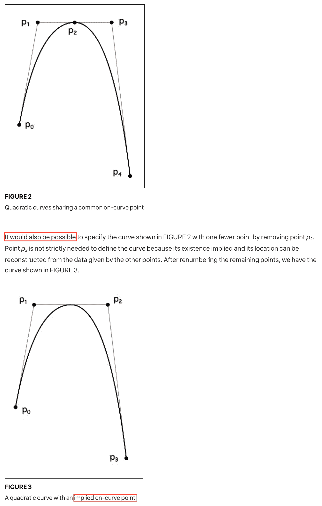

<!--yml

类别：未分类

日期：2024-05-27 14:24:45

-->

# 撰写一篇 TrueType 字体渲染器 | 菲利普·特南

> 来源：[`axleos.com/writing-a-truetype-font-renderer/`](https://axleos.com/writing-a-truetype-font-renderer/)

<content>文本是数字交互的**主**要介质，而文本渲染对于任何系统的整体质感和完成度都有着巨大影响。因此，我感到痛心的是，几年来 axle 一直依赖低分辨率的 8x8 位图字体。让我们来解决这个问题吧！

看一下组成这个句子的字符。注意曲线，负空间，大小和距离的使用。

如果你手边有放大镜，你甚至可以看到“白底黑字”文本如何使用许多灰色阴影使文本更加柔和。我来展示给你看：


字体渲染归结为告诉计算机哪些像素应该打开或关闭，哪些应该略微加深以产生效果，哪些应该让背景透过。

挑战在于以一种*高效*和*可调整大小*的方式向计算机描述这一过程。字体不应该占用太多存储空间，而且我们应该能够根据用户请求的任何大小缩放字体，同时保留字体设计的特性。也许最重要的是，在满足这些约束条件的同时，我们希望文本阅读起来愉悦。

## 极简主义文本渲染器

让我们现在摒弃所有这些要求，从渲染字符的最简单可行方法开始。我们如何将像素着色成文本呢？

首先，我们将为每个字符选择一个固定大小。我们将同意每个字符都是精确地 8 个像素宽和 8 个像素高。这给了我们每个字符 64 个像素的网格来处理。

我们可以使用一种简单的数据格式来描述我们的 8x8 网格中每个像素是应该打开（着色为字体颜色）还是关闭（保留背景颜色）。我们可以像这样绘制出我们的字符网格：

```
_ _ _ _ _ _ _ _ _ _ _ _ _ _ _ _ _ _ _ _ _ _ _ _ _ _ _ _ _ _ _ _ _ _ _ _ _ _ _ _ _ _ _ _ _ _ _ _ _ _ _ _ _ _ _ _ _ _ _ _ _ _ _ _
```

由于每行有 8 个像素，并且每个像素有两种状态，将每行存储在我们的网格中的一字节是很自然的。例如，我们可以使用以下表示来表示一个大写字母 `A`：

```
Byte 1: 0 0 1 1 0 0 0 0 Byte 2: 0 1 1 1 1 0 0 0 Byte 3: 1 1 0 0 1 1 0 0 Byte 4: 1 1 0 0 1 1 0 0 Byte 5: 1 1 1 1 1 1 0 0 Byte 6: 1 1 0 0 1 1 0 0 Byte 7: 1 1 0 0 1 1 0 0 Byte 8: 0 0 0 0 0 0 0 0
```

这等同于以下十六进制表示：

```
Byte 1: 0x0c Byte 2: 0x1e Byte 3: 0x33 Byte 4: 0x33 Byte 5: 0x3f Byte 6: 0x33 Byte 7: 0x33 Byte 8: 0x00
```

…并且使我们能够非常高效地存储 ASCII 的渲染映射：

```
uint8_t ascii_map[256][8] = [  // 64 previous entries... {0x0C, 0x1E, 0x33, 0x33, 0x3F, 0x33, 0x33, 0x00}, // U+0041 (A) {0x3F, 0x66, 0x66, 0x3E, 0x66, 0x66, 0x3F, 0x00}, // U+0042 (B) {0x3C, 0x66, 0x03, 0x03, 0x03, 0x66, 0x3C, 0x00}, // U+0043 (C) {0x1F, 0x36, 0x66, 0x66, 0x66, 0x36, 0x1F, 0x00}, // U+0044 (D) {0x7F, 0x46, 0x16, 0x1E, 0x16, 0x46, 0x7F, 0x00}, // U+0045 (E) {0x7F, 0x46, 0x16, 0x1E, 0x16, 0x06, 0x0F, 0x00}, // U+0046 (F) {0x3C, 0x66, 0x03, 0x03, 0x73, 0x66, 0x7C, 0x00}, // U+0047 (G) {0x33, 0x33, 0x33, 0x3F, 0x33, 0x33, 0x33, 0x00}, // U+0048 (H) // ... ];
```

这是相当整洁的编码！要渲染一个字符，我们可以直接使用其 ASCII 表示查找其渲染映射：

```
fn render(ch: char) {  let ch_render_map: [u8; 8] = ascii_bitmaps[ch as u8]; // Neat! for row in ch_render_map.iter() { for col in row.bits().iter() { if col == 1 { // This pixel belongs to the character } else { // This pixel should display the background } } } }
```

信不信由你，axle 近十年来一直在使用上述字体渲染技术。


尽管上面的字体只提供了 8px 的位图，但我们可以轻松将其缩放到任何我们喜欢的大小。然而，字体始终会显得锯齿状和低分辨率。


虽然 8x8 位图字体 *能用*，但它确实不太美观，并且相当有限：我们只能使用愿意编码到这个小小的 8x8 网格中的任何字体，并且我们无法使用在线和公共领域中提供的众多字体。此外，我们的 8x8 网格并没有提供描述曲线的好方法，而在某些字体中这是必不可少的（看看这个`a`！）。

最重要的是，编写一个新的字体渲染器听起来很有趣。

## TrueType

在我们文本渲染之旅的下一个飞跃中，我们转向 TrueType：用于编码和分发字体的事实上的标准。与我们的简单 8x8 位图不同，TrueType 字体以结构化二进制文件（`.ttf`）的形式分发。我们需要解析这些文件并将它们的数据渲染成像素。

在这个世界上，我喜欢的事情少之又少，比起一开始就存在的组织逐渐揭示的不透明二进制的结构更令我满意的事情几乎没有。分解二进制的底层和一般结构像我能想象到的任何事情一样令人满足。

[TrueType 规范](https://developer.apple.com/fonts/TrueType-Reference-Manual/)给出了问题领域的很好介绍（我强烈推荐`数字化字形`和尤其是`指导字体`中的概述），但它并没有在“从这里开始解析”方面提供太多指引。我将为你省去麻烦。

TTFs 的结构与 Mach-Os 有些相似。这真是一个令人惊喜的发现，因为我花了[很多时间解析 Mach-Os](https://github.com/datatheorem/strongarm/)！由于这两种文件格式都是在相同的时间左右发展起来的，所以我想它们可能有一些设计上的相似之处。

TTFs 和 Mach-Os 在很大程度上都是围绕一系列平面部分构造的，文件开头有一个目录表来描述每个部分。对于 TTFs，这些部分中的每一个都将包含我们在渲染字体过程中需要的一些元数据或其他信息。


在开始查看这些部分变得有意义之前，我们需要了解 TrueType 使用的描述字体的基本流程。规范做得很好，所以我会简要概括一下。

用于视觉表示特定字母的线条和曲线的集合被称为 *字形*。例如，字形`b`由一条竖线和一个半圆组成。

然而，没有更多的信息，我们的渲染器就不会知道 *哪个* 字形代表着每个字符。我们需要一些额外的元数据，以便从 *字符映射* 中的一个字符（如 ASCII 或 Unicode）转换为特定字体用于视觉表示该字符的 *字形*。TTF 的工作是描述如何绘制字体表示的所有字形，并描述字符映射与这些字形之间的对应关系。

TrueType 通过列出一系列点来描述如何绘制每个字形，这些点共同构成每个字形的*轮廓*。连接这些点成线，将这些线转化为曲线，并根据需要‘在线内着色’，这都是渲染器的工作。这里有更多的细微差别，但这就是基本情况。

  *不将渲染点连接成线*

一旦你连接了这些点，事情看起来就更加容易理解了。

在线内着色原来比你想象的要困难得多。

我第一次实现这个渲染器时没有绘制任何曲线，而是直接用直线连接了点。我的同事 Amos [实现了](https://github.com/codyd51/axle/pull/47) 渲染器沿着字体描述的曲线插值轮廓的能力，这确实改善了外观。谢谢，Amos！

*在 Amos 的插值曲线工作之前和之后*

## 纠缠的文本表格

TTF 中的每个部分都由一个 4 字符的 ASCII 名称标识。TTF 中的不同部分包含不同的重要元数据，例如：

+   `glyf`：字体中每个字形轮廓的一组点（最重要的！）

+   `hmtx`：间距信息，即绘制每个字形后移动光标的距离

+   `cmap`：Unicode 码点到字形索引的对应关系

每个部分都包含一堆描述其内容的结构化数据。在这里，我们的第一个迷你挑战出现了。TTF 是在 RAM 和核心周期都不便宜的时代设计的。因此，格式的设计者们确保它尽可能容易地完成渲染器的工作。为此，他们将两项责任转嫁给了字体文件本身：

+   渲染器可以遍历以检索信息的有效数据结构（例如，查找表，将字符代码映射到字形索引）

+   预先计算一些查找过程中使用的值（例如，用于二分查找字符映射的缩放参数）

这些优化在今天可能并不那么重要，但我们仍然需要与它们一起工作。第一个特别重要：TTF 被设计为*直接加载到内存*并由渲染器*就地*读取，而不是由渲染器填充自己的中间数据结构。~~然而，令人费解的是~~，TTF 将所有字段都存储为大端格式，所以我们肯定需要在我们的端口之前做一些工作，才能读取到任何合理的值。

为了能够以最少的样板和重复定义并从这些字体结构中读取，我设置了这样一个机制，即我可以用`BigEndianValue`包装任何字体结构字段。一旦我调用了`.into()`，一切都搞定了，我就可以继续我的日常工作了。提前一点点的结构定义，后续就能写出轻松简单的解析代码！

`rust_programs/ttf_renderer/src/parser.rs`

```
/// Here, we're modelling a structure that's defined by the TTF specification #[repr(C, packed)] #[derive(Debug, Copy, Clone)] struct OffsetSubtableRaw  {  /// Note each field is wrapped in BigEndianValue scalar_type: BigEndianValue<u32>, num_tables: BigEndianValue<u16>, search_range: BigEndianValue<u16>, entry_selector: BigEndianValue<u16>, range_shift: BigEndianValue<u16>, }   /// This marker trait indicates that this structure sits directly in TTF memory impl  TransmuteFontBufInPlace  for  OffsetSubtableRaw  {}   /// This is our 'high-level' parsed representation #[derive(Debug, Copy, Clone)] struct OffsetSubtable  {  scalar_type: u32, num_tables: u16, search_range: u16, entry_selector: u16, range_shift: u16, }   /// Convert the 'raw' TTF memory representation into our high-level representation with native byte order impl  FromFontBufInPlace<OffsetSubtableRaw>  for  OffsetSubtable  {  fn from_in_place_buf(raw: &OffsetSubtableRaw)  -> Self  { Self  { scalar_type: raw.scalar_type.into_value(), num_tables: raw.num_tables.into_value(), search_range: raw.search_range.into_value(), entry_selector: raw.entry_selector.into_value(), range_shift: raw.range_shift.into_value(), } } }
```

准备好了吗？

``pub  fn parse(&mut  self)  -> Font``

`rust_programs/ttf_renderer/src/parser.rs`

```
let  offset_table  =  OffsetSubtable::from_in_place_buf(self.read_with_cursor(&mut  cursor));
```

哦是的！我们可以直接从*TTF*内存中解析我们的高级、字节顺序校正的表示，甚至无需在调用站点*提及*原始*TTF*表示。我会把这看作是一种胜利。

## 解析器

手头有方便的 API，我们将在文件开头解析所有部分描述。

`head` 部分（或*TTF*更喜欢的*table*）存储了关于整个字体的一些重要元数据。我们知道*TTF*通过一系列连接的点描述字形轮廓。但如果我们看到一个像`(371, 205)`这样的点，没有进一步的信息，我们就无法理解它在视觉上的位置。`head` 表为我们提供了这样一个参考，通过描述所有点所在的`glyph_bounding_box`。

接下来，我们将想要[解析字符映射](https://github.com/codyd51/axle/blob/paging-demo/rust_programs/ttf_renderer/src/character_map.rs#L224)，以找出如何将编码字符对应到字形索引。每个字符映射还将以[极端混乱的格式](https://github.com/codyd51/axle/blob/paging-demo/rust_programs/ttf_renderer/src/character_map.rs#L340-L357)描述，解析器需要知道如何读取它。

现在来看一下令人兴奋的部分：解析字形！`maxp` 表将为我们提供有关字体包含多少字形的一些元数据，而字形数据本身存储在 `glyf` 中。

在我们可以解析每个`glyf`条目之前，我们需要知道每个条目的开始位置。`loca` 表将为我们提供这些偏移量。然而，在字体中并没有明确给出每个字形数据的*大小*。相反，每个字形数据的大小都隐含地由与*下一个*字形的起始偏移量的差异给出。

勇敢的字体解析器会很快注意到一些字形描述似乎没有大小。这是故意的：一些字形，比如对应于空格字符的字形，除了占用的负空间之外没有可见的表现。当渲染器尝试绘制这些零大小的字形之一时，我们将根据该字形的对应`htmx`大小来推进光标。

实际上，我们有三种不同类型的字形：

+   *多边形*字形

    +   这些字形是经典案例：一系列有序的边缘点和控制点，应该按照一系列曲线连接起来。

+   *空白*字形

    +   对于诸如对应于空格字符的字形等特殊情况。

+   *复合*字形

    +   由组合和缩放其他字形制成的字形。

第三类真的很有趣！`i` 和 `j` 的字形都共享一个相同的顶部点，没有必要在绘制指令中复制其描述。相反，我们可以简单地说 `i` 和 `j` 都由放置在画布上特定比例和位置的一对字形片段组成。


在处理复合字形时，存在各种反直觉的边界情况。例如，我们知道传统的多边形字形通过`hmtx`和`vmtx`表中的相应条目指定在绘制后光标应该向前移动多远。但是，对于复合字形，光标应该向前移动多远呢？有时候复合字形有自己的度量表条目，有时候复合字形标有一个特殊的标志，表明它应该从特定的子字形那里获取其光标前进度量。

`rust_programs/ttf_renderer/src/glyph.rs`

```
enum CompoundGlyphComponentFlag  {  HeaderValuesAreWords, HeaderValuesAreCoordinates, RoundCoordinatesToGrid, CustomScale, MoreComponentsFollow, HasDifferentScalesForXAndY, HasTwoByTwoTransformation, HasInstructions, UseMetricsFromThisComponent, ComponentsOverlap, }
```

复合字形并不总是直接包含多边形字形。相反，一个复合字形可以由其他复合字形的树组成，所有这些字形都被拉伸、缩放和重新定位到边界框上。

## 提示

TrueType 以其旨在在低分辨率渲染到有限像素网格时帮助保留字体本质的提示虚拟机而闻名。在该虚拟机下运行的程序的任务是将字形的控制点推到低分辨率位图上的特定布局中。

假设你正在尝试将字形的点缩小以适应一个小网格。如果渲染分辨率不能完全被字形的点间距整除，那么当你将每个字形点舍入到像素时，你将会得到缩放伪影。

字体可以嵌入一个小程序，当执行时，会微调字形的布局点，以更好地表示可用网格内的字形。

我们的渲染器将需要实现这个虚拟机，这总是一个有趣的尝试。

提示虚拟机建立在一个标准的（令人难以满足的）解释器循环之上，该循环根据字节流指示的操作修改虚拟机状态：

`rust_programs/ttf_renderer/src/hints.rs`

```
0x4b  =>  {  // Measure pixels per em in the projection vector's axis if  operations.should_print()  { println!( "MPPEM\tMeasure pixels per em in {:?}", graphics_state.projection_vector ); } if  operations.should_execute()  { let  val  =  match  graphics_state.projection_vector  { Axis::X  =>  graphics_state.font_size.width, Axis::Y  =>  graphics_state.font_size.height, }; graphics_state.push(val  as  u32); } } 0x50  =>  {  // Less than let  e2  =  graphics_state.pop(); let  e1  =  graphics_state.pop(); let  result  =  e1  <  e2; if  operations.should_print()  { println!("LT\tLess than? {e1} < {e2} = {result}"); } if  operations.should_execute()  { graphics_state.push(if  result  {  1  }  else  {  0  }); } }
```

在执行针对字体操作环境的函数时，会出现一系列有趣的小工程挑战。

`rust_programs/ttf_renderer/src/hints.rs`

```
pub(crate)  fn identify_functions(instructions: &[u8])  -> Vec<FunctionDefinition>  {  // We have a bootstrapping problem: Functions can't be run to // completion without the context (arguments, etc.) from the caller, but we need to // parse function boundaries before we can run callers since callers address functions via // identifiers that get created when the fpgm table is executed. // To resolve this circular dependency, we use a simple heuristic to identify function // definitions, rather than doing a full interpreter pass. // This has the downside that our heuristic can't tell the // difference between code and data. // If some data is pushed to the stack with the same value as the // function definition opcode, we may interpret it as a function definition. // // ... }
```

## TrueType 怪癖

### 神秘纪念品

提示虚拟机的目的是微调字形轮廓点，使它们在小像素网格上看起来更好。所有这些实际上组成字形轮廓的点都在‘字形区’中。

然而，虚拟机的设计者意识到，有时候拥有一个并不真正属于轮廓的点是有用的，而只是在进行距离计算时作为参考使用。这些点不属于字形区域，因此 TrueType 将它们放置在一个叫做……[暮光区](https://developer.apple.com/fonts/TrueType-Reference-Manual/RM05/Chap5.html#SZP0)的不同空间中。

TrueType 的设计者显然是超自然现象的粉丝。TrueType 通过嵌入偏移量来描述字体的加粗和斜体版本。一个字体变化可能需要修改字形轮廓的整个边界框，因此还有[‘幽灵点’](https://learn.microsoft.com/en-us/typography/opentype/spec/tt_instructing_glyphs#phantom-points)对应于可以拉伸和挤压的边界框的角。

### 隐含控制点

TrueType 规范向读者提出了一个建议，嘿！也许让渲染器推断缺失的控制点可能是可能的？



尽管观察的语气轻松，但实际上渲染器必须支持这一点。字体一直依赖于这一点！这是整个规范中唯一提到它的地方！每个人都需要检测并插入隐含的控制点，所有这一切都依靠一个介绍性图表。

### 提示：假设无事发生

正如我们所见，TrueType 对于在受限字体大小下操纵渲染过程有着复杂的支持。但就像任何良好的编程环境一样，它也提供了许多逃生通道。其中一个逃生通道是 `bloc` 表，它基本上表示“如果字体大小太小，则忽略字形曲线和提示程序，而只是渲染这些小位图。”

## 加固渲染器

还有一些工作要做，将这个字体渲染器整合到 axle 桌面上显示文本的所有堆栈中，但基础设施已经准备就绪。以下是上次我在整个桌面传播 TrueType 时的情况。

这个渲染器的源代码在[这里](https://github.com/codyd51/axle/tree/9d83c62eaad9dd0850bb7fe3641bd2821e5b84b0/rust_programs/ttf_renderer/src)。以下是在开发过程中生成的一些屏幕截图。
