<!--yml
category: 未分类
date: 2024-05-27 14:24:19
-->

# Displaying content as a graph: An exploration | This is important

> 来源：[https://thisisimportant.net/posts/content-as-a-graph/](https://thisisimportant.net/posts/content-as-a-graph/)

Most web content is designed to display with a strict hierarchy, tree-based or otherwise. What if it wasn’t?

## What does it mean to display content as a graph?

Instead of being displayed as a strict hierarchy, content could be placed in multiple categories within a hierarchy, using a [polyhierarchy](https://www.nngroup.com/articles/polyhierarchy/), or displayed as a series of interlinked nodes in a network—a graph.

Displaying content as a graph could visually communicate the relationships between ideas, tasks, and topics in technical content. A hierarchy also does this, but doesn’t always match the actual relationships between ideas and concepts in technical content.

A graph could offer a more flexible presentation, but content is usually displayed hierarchically on the web. Why is that?

## Why hierarchies are common

Hierarchies are common because they match the typical way of explaining a new concept or topic — you start out with an overview, briefly introducing several important things and how they fit together, and then provide additional information about each thing later on.

For example, if I want to teach you how music is made, I’m not going to start with an intense explanation of how an instrument works to create sound. Instead, I’ll start with a high level discussion about the components involved in music: a song, an instrument, scales, key signatures, tempo, and then move into more complex topics like how to write music using those components.

*   How to make music
    *   What is a song
        *   What is a hook
        *   What is a verse
        *   What is a chorus
        *   What is a bridge
    *   What is an instrument
        *   Different types of instruments
            *   String instruments
            *   Woodwind instruments
            *   Brass instruments
            *   Percussion instruments
        *   How to tune an instrument
    *   What are the components of music
        *   Types of scales
        *   Melody and harmony
        *   Tempo and time signatures
        *   Key signatures
    *   How to write music
        *   How to write a hook
        *   How to write a verse
        *   How to write a chorus
        *   How to write a bridge
    *   How an instrument works

It’s fairly easy to scan a list of items and follow the hierarchy that represents a logical progression of information and knowledge.

Hierarchies also mimic a traditional way of displaying information—as a book, with chapters that represent hierarchies of content.

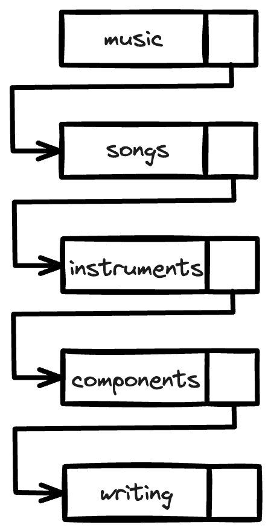

## Why use something different?

Hierarchies are common and familiar. So why use something different?

### Serve multiple mental models

Presenting content in a hierarchy provides an implicit mental model to the reader. By ordering content, there is an implication that the information is listed according to its relative importance and in the order which you should learn the information.

In the case of the music example, because of the hierarchy presentation, that means that you should learn the component parts of a song before learning about instruments, and before learning about scales, key signatures, or tempo.

If you display content as a graph, you can remove some ordering implied by a hierarchy:

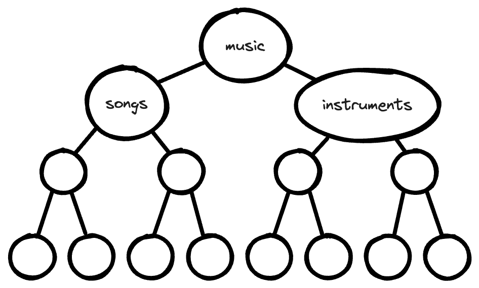

By expanding a hierarchy, either by placing content in more than one location, or by removing the ordering involved in a hierarchy, you can serve multiple mental models used by your readers and thereby improve findability.

An article from Page Laubheimer for Nielsen Norman Group^(, points out some benefits of categorizing content in more than one location:)

> A polyhierarchical IA is a structure where an item exists in more than one place ­— that is, it can be reached following several category paths. … Ideally, you want to create categories that accurately describe your content and products, are extensible when you add new topics or products, and match your users’ [mental models](https://www.nngroup.com/articles/card-sorting-definition/) (which often vary from one person to another).

And that is a crucial point — we often write documentation with an audience in mind, but there is always variation in familiarity and background.

For example, because I learned data analysis with a language that performs aggregation with the statistical transformation command ^(, I might look for the SQL function GROUP BY alongside the COUNT() and SUM() function reference.)

If content could be displayed as a graph, depicting different relationships across categories and commands, the content can reflect many mental models. The content could become the diagram.

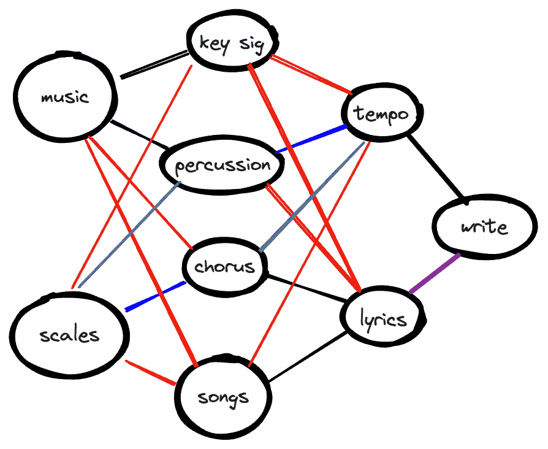

### Write better documentation

A persistent challenge for technical writers is to focus on writing user-centric documentation rather than feature-focused documentation.

When you consider content with the complexity of a user journey, with all the requisite branches and forks, the limitations of linear hierarchies begin to show.

It could be easier to write documentation if you didn’t have to consider where the content belonged in the navigation or the table of contents, but instead considered how it related to other pieces of content that already existed. We do that already, but must always create a hierarchy that considers order.

But sometimes order doesn’t matter. Sometimes order is different depending on the audience. Hierarchies are inflexible.

Without being constrained by a hierarchy, we could place documentation in a structure more mindfully, answering questions like:

*   What relationships do you want to draw for the reader?
*   When and where might the reader encounter the tasks described in this topic?

David Ryan at Red Hat has tried this, pointing out in a tweet that:

> A few of us used a graphing tool at Red Hat to show content relationships, as we experimented with moving away from “linear book” and tried to match content with the user journeys.

For the music example, we can acknowledge the fact that some readers might be familiar with writing lyrics, but not familiar with the concept of key signatures or scales. Other readers might be familiar with songs, but can’t keep tempo easily, so want to explore that content in more depth than others.

### Improve content reuse

If you don’t have to draw strict hierarchies, it could be easier to reuse content. If your content is pocket-sized and specific to a concept or task, recontextualizing it would be as simple as adding another link to the graph.

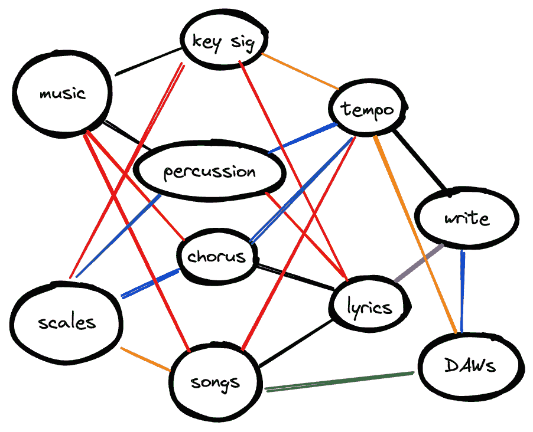

In a hierarchy, to reuse content you often have to duplicate the content to another location—through single sourcing or otherwise—to make it logically relevant.

The flexibility of a graph means that you can use labels or links to draw connections across content, rather than duplicating it to another location in a hierarchy.

### Improve machine legibility

Content that is not just *stored* as a graph but also *written* for a graph would be even more legible to machines—the website crawlers indexing content for use in search result ranking algorithms and capturing datasets to train machine learning models.

Most of that content is already crawled as a graph, with the robots following link after link, indexing the page contents as well as the links between them, building a graphical representation of the web.

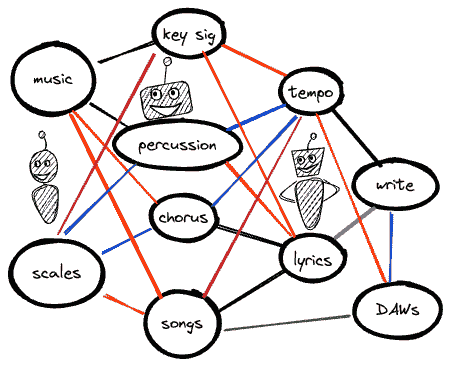

Writing with those relationships in mind could help amplify the connections across content, making those connections more legible to the machines while exposing them to the human readers as well.

Depending on how you invest in the quality of your knowledge graph, the search benefits could create a competitive moat for your documentation site—provided the content exists to support the search terms.

## Why don’t we display content as a graph?

There are a number of benefits to displaying content as a graph, but very few websites do so. Why is that?

### It’s difficult to design

Websites are based on pages — and it’s difficult to expose the underlying structure to readers in a coherent way.

Having a navigation menu at the top or the side of a page is an extremely familiar pattern, as well as “breadcrumbs” to help people maintain an idea of where they were before.

There are a few examples of content graphs on the web already, and they follow some different patterns:

Andy Matuschak has created a form of a graph with his [Evergreen Notes](https://notes.andymatuschak.org/Evergreen_notes) ^(, which open links next to the content that you’re interacting with, and minimize along the way. In the case of Evergreen Notes:)

> there’s no index or navigational aids: you’ll need to follow a link to some starting point.

It’s a similar design to what [Obsidian](https://obsidian.md/) implemented ^(. Obsidian also uses a graph and node-based architecture to relate local text files on your computer with one another. It takes the graph visualization to the next level, but I feel that graphs of this scale aren’t super discoverable, despite being explorable, because they’re so overwhelming. Obsidian also recently introduced [tab stacks](https://twitter.com/obsdmd/status/1567580143379484673), another innovative way of visualizing content all at once.)

Another site is the [C2 wiki](https://wiki.c2.com/?ServletBasedWiki), which was described to me as “a discussion site that happened to be shaped like a reference guide.” It essentially creates a map for you as you navigate through it, with the links you open floating next to the origin.

I love this design as a way of keeping track of a specific journey through the content, enabling the reader to build their own workflow out of the content, but it raises a challenge when it comes to sharing links.

In the screenshot above, my pathway ended on the [DepthFirst](https://wiki.c2.com/?DepthFirst) page, but if you open that link, you see only the page—none of the journey that led me there, and none of the nodes in the graph that you might want to explore alongside it are visible—only a few links in the page itself.

These two sites expose the main design challenges:

*   **What do you display on the landing page**, or entry point, into a site like this? Most readers encounter documentation from search, but many still browse to the site itself—especially prospective customers or employees looking at the company website.
*   **How do you make the graph visible** when viewing a discrete page (or node) in the graph? How do you make the context of the current page visible to the reader?

The landing page option might be to do something similar to many hierarchical documentation sites—display a search bar and some key “entry point” nodes with select branch or dependent nodes displayed.

Making the graph visible could be an interesting design challenge, depending on what you choose to do:

*   Ignore the graph and show only the node, leaving the links as the only way to navigate to other nodes (and follow existing web browsing patterns without adding new ones).

*   Preserve a specific journey when sharing a link to a specific page, and offer a “historical” graph view, similar to what Andy’s Notes does.

*   Provide a zoomed-out view option, where you could minimize a page and view the nearby graph nodes:

    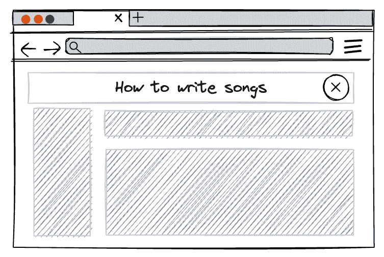

    

*   Something else entirely!

### It’s confusing for readers

Hierarchical content is a dominant web format, and as a result, it’s familiar. Familiar design and layout patterns are easier to navigate because you don’t have to learn anything about how to use the site, you can just navigate using the patterns you’ve already learned — scan the navigation bar, scan the table of contents, and skim the headers on the page or use ctrl+f to search for a keyword in the text.

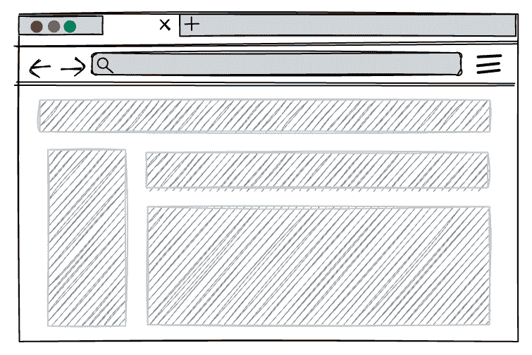

As Mark Baker points out in [Every Page is Page One](https://everypageispageone.com/), people are information foragers. The readability of a graph and the sheer amount of content that might exist in one might not lend itself well to the scanning-first habits that we’ve evolved as web readers.

Instead, if you display content as a graph, readers are confronted with an unfamiliar pattern that could require them to learn new buttons and interactions in order to find what they need. That’s a hindrance to readers of technical documentation, because their goal is to answer a specific question, complete a specific task, or learn about something — not learn how your website works.

In addition, displaying content as a graph lacks a clear hierarchy, which causes another big problem: there’s no clear starting point.

As Kelley Gordon points out in her article for Nielsen Norman Group, [Visual Hierarchy in UX: Definition](https://www.nngroup.com/articles/visual-hierarchy-ux-definition/):

> If you struggle to find focus on a screen, it’s likely that the layout is missing a clear visual hierarchy.
> 
> The page’s visual hierarchy controls the delivery of information from the system to the end user — it lets users know where to focus their attention.

Arriving at a webpage without visual hierarchy and only a graph with nodes can be disorienting for readers.

Most readers would then use another form of exploration, such as search, to find what they’re looking for.

Because a graph lacks a clear visual hierarchy and can be overwhelming, the designs of Evergreen Notes or the C2 Wiki make sense because they reveal the graph as a journey as you navigate the page. Other sites that use graphs don’t usually make them visible as you navigate.

One exception is the classic site [HyperPhysics Concepts](http://hyperphysics.phy-astr.gsu.edu/hbase/index.html)^(, which uses a visual graph representation with clickable links in order to help you navigate the site:)

This graph is a hierarchical and ordered graph, but less hierarchical than a traditional table of contents, and made visible to the reader. Each node of that graph is clickable, opening a new page with content, or sometimes a new graph:

The Hyperphysics site makes the graph visible but not at the expense of the content. The graph can be annotated and serve as another form to communicate the relationships between the concepts described in the content.

Another exception is the site [Every Noise at Once](https://everynoise.com/). The [data sources for it are sadly now defunct](https://www.furia.com/page.cgi?type=log#id472), but the site itself displays not a graph, but a collection of genres laid out as though there were node connections visible.

![Screenshot of genres on Every Noise at Once, all listed in the same size and in colors ranging from red to purple to light brown and a muddy light green. It’s a crowded page, but the genres are all legible. Some  clusters that I noticed are austin metal, polish death metal, minnesota metal, and western ny metal. Another cluster is ottawa indie, limerick indie, and math rock. A loose section that doesn’t seem very clustered has genres like deconstructed club, austrian indie, popullore jugu, alt z, lagu bali, and lagu aceh.](img/53c828b8a2caec61d2d84207d1032269.png)

It’s the idea of a graph, but with no true connections. The site itself refers to it as a scatter plot — so there are vague associations, but no true links. If you go deeper into the graph and select a genre, you see a similar scatter plot of the artists in that genre:

Sites with hierarchies also use breadcrumbs as a way to show you where you are in the overall site map. Content that you interact with purely in graph form would instead need to either construct dynamic breadcrumbs based on the path through the content that you took, or take a different approach entirely, like relying on category tags.

Every Noise at Once, with the flexible graph-like exploration format, maintains a breadcrumb that effectively shows the nodes surrounding the one that you’re currently visiting:

Ultimately, there are a variety of options for displaying content visibly in a graph, but most of them either retain a hierarchy to assist readers in scanning and foraging for information, or have no visual hierarchy and force the reader to explore, use search, or give up in the face of overwhelming options.

### It’s too flexible

Content graphs aren’t a new concept. Displaying content as a graph might be rarely done, but storing content as a graph is a common practice—usually referred to as a knowledge graph.

As Sarah O’Keefe discusses for Scriptorium, there is a [cost to knowledge graphs](https://www.scriptorium.com/2023/01/the-cost-of-knowledge-graphs/). One of those is the challenge to writers:

> We have to think about the various content or data objects, understand how they relate to each other at the knowledge graph level, and then bring them together into a coherent experience, whether a webpage, a document, or something else entirely.

That’s a lot to consider. Writers using DITA (Darwin Information Typing Architecture) and XML-based structured authoring solutions might already be familiar with these challenges, and the chunking approach to reduce content to its relevant bits which then need to be reconstituted into a coherent experience on a webpage.

I haven’t worked in a DITA environment before, and most of my experience is with tools that don’t use a database to store content, let alone a graph database. Many docs-as-code tools require a hierarchy of sorts to dynamically generate a table of contents ([Sphinx](https://www.sphinx-doc.org/en/master/) is one example) or to provide some sense of order to the flat file structure of a repository.

When it comes to organizing content, it could be freeing to consider all the different ways a topic could be relevant to a reader, but it could also end up exhausting, deciding where to draw the line.

For the music example from earlier, a page, or graph node, about “How to write songs” could be linked to:

*   How to write a bridge
*   How to write a chorus
*   How to write a verse
*   How to write a melody
*   How to write a topline
*   How to write a hook
*   how to write lyrics
*   how to write a harmony
*   how to use a digital audio workstation (DAW)
*   and more…

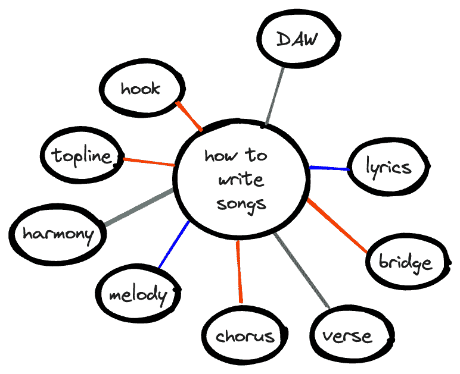

However, the flexibility of a graph could add chaos. If this content could be linked to other content, what should it be linked to? What other nodes are relevant? A graph could quickly turn into a sea of possibilities, rather than intentional choices about relevance.

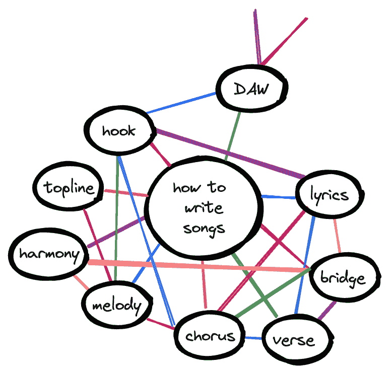

At a certain point, the attempt to avoid missing a relevant link, or to try to make your content as discoverable as possible through a knowledge graph, would dilute the explicit mental models and diagramming potential possible with a graphical **presentation** of content.

Instead of replicating *some* mental models, the graph could instead start to represent *all possible permutations* of a mental model, and stop representing anything of value at all.

But the act of considering all the different locations where your content might be relevant, what other entry points might exist, could result in more thoughtful documentation content. You can consider it as part of an entire system. By considering the content as part of a graph, you can more easily treat the content as part of an expansive surface, rather than a discrete element on a specifically ordered list.

By contrast, because a hierarchy is strict, it forces choice. If this content had to exist in one place, where is the *most relevant* place?

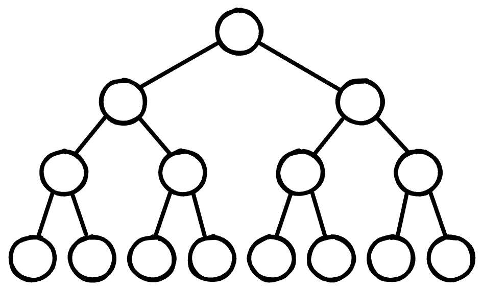

That one choice can be daunting, especially when choosing what the top of the hierarchy should be.

In a discussion in the Write the Docs Slack community, [Wouter Veeken](https://wouter.tech/) points out that one difficulty with hierarchies is deciding what to put at the top of it, asking if anyone has a “general method for deciding which attribute should be the top level of the tree?”

Therein lies the tradeoff. For some content, choosing a location in a hierarchy is an arbitrary choice. For other types of content, it reifies a relevant order to a task.

For example, if you want to write a song, you can start with a melody, a harmony, or lyrics. To write lyrics you can start with a chorus, or a verse, or a bridge. None of those have an order. But if you want to produce a song, a song must be written first. In that case, order matters.

This is a key advantage of having a graph structure—everything is a set of relationships, there is no designated “top” of the tree to identify. You could even choose to display highly-related topics differently than others, and use the information provided by the graph structure itself to determine what content is most valuable.

### It’s difficult to write chunked content

Those are the challenges with structuring the content, but there are also challenges with writing the content.

[Carrie Hane points out in a discussion about Knowledge Graphs on Sarah O’Keefe’s LinkedIn](https://www.linkedin.com/feed/update/urn:li:activity:7016392571283230720?commentUrn=urn%3Ali%3Acomment%3A%28activity%3A7016392571283230720%2C7016413582502371328%29&replyUrn=urn%3Ali%3Acomment%3A%28activity%3A7016392571283230720%2C7016417255366262785%29) that:

> adoption of structured, decoupled content is still needed to adopt knowledge graphs. And that is a huge leap.

I agree with that completely. Each piece of content in the C2 wiki or the Hyperphysics site was a discrete component of content — a definition of a concept, for example. That type of chunked content fits well within a knowledge graph.

Technical content written for a hierarchy, or with an implied order, can often end up quite long and detailed — perhaps with one page describing everything you need to know about something. To continue the music example, you might end up with a page like:

*   How to write a song
    *   About song components
    *   Write lyrics
        *   Write a verse
        *   Write a chorus
        *   Write a bridge
    *   Write a melody
    *   Write a harmony
    *   Write a bassline
    *   Write a percussion track

That page is full of task-based content that could be easily separated into different graph nodes, but it might also include definition content mixed in, like:

*   What is a hook
*   What is a topline
*   What is a key signature
*   What is tempo

That definitional content would also get broken out into specific chunks. All of a sudden, instead of writing an end-to-end topic all about songwriting, you’re writing tiny chunks of content that might not be as interesting, compelling, or cohesive to write or read.

### Sparse content and dense content don’t scale in a graph

Graphs are only useful if there are lots of connections. A graph with only a few nodes doesn’t communicate much as a diagram of a mental model:

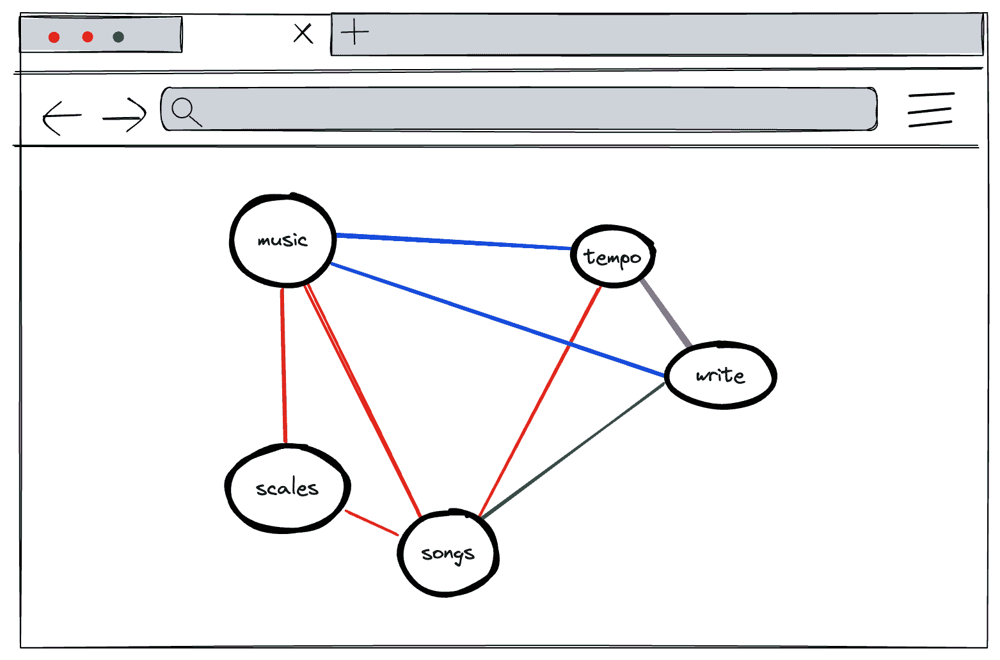

On the other hand, too many nodes is impractical and also doesn’t communicate much as a diagram of a mental model:

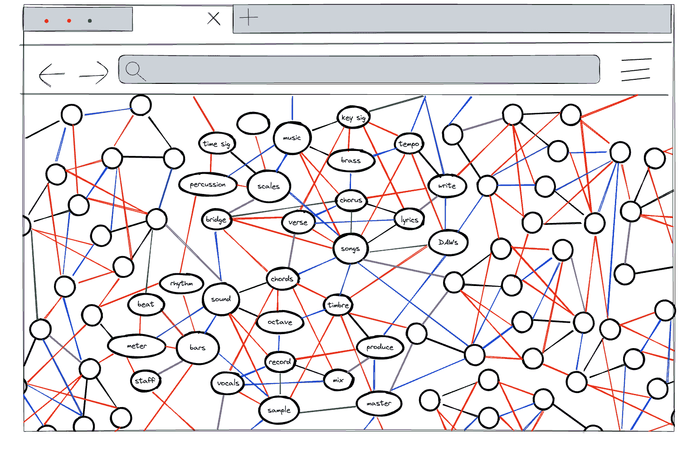

## Visible graphs: The future of displaying content?

Ultimately, it’s unlikely that visible graphs would become a standard practice for displaying technical content. It’s a complex design and rendering problem, and while there’s a chance that the novelty might get someone to click around in a graph for a bit, someone with a specific question in mind wants to be able to scan for information.

A hindrance to scanning is volume of content. Given the amount of content on many documentation sites, and that people are accustomed to navigating in digital devices, most people [default to using search as their first choice for navigation](https://theconvivialsociety.substack.com/p/a-world-ordered-only-by-search#details).

If everyone is using search to navigate, displaying content as a graph wouldn’t make much sense.

Instead, implementing a knowledge graph as the background structure for a documentation site, with clear guidance about how to connect the nodes of the graph, has the potential to improve search results for readers and allow flexible categorization for writers.

A knowledge graph lets you have the best of both worlds. As Manav Modi from ProductX points out in [How is Airbnb optimising Search and Discovery using Knowledge Graphs? 🎯](https://productx.substack.com/i/92274998/why-is-a-graph-structure-scalable):

> The graph can also be hierarchical, with high-level concepts branching down to more specific details, allowing for a streamlined data organization.

An alternative that can preserve the graph conceptually but not visually is the tile-based approach common on many documentation landing pages, with sort and filter options:

In these models, the graph isn’t made apparent, but the node relationships still exist through tags or content types and can be explored without using a table of contents. This approach lets you gain some benefits of visually displaying content as a graph without the most troubling challenges—an unfamiliar and challenging browsing experience for readers.

No matter how you visually present your content, the act of placing content within an information architecture and structuring it is valuable and reifies a mental model for the readers and the writers.

It’s impractical to make a graph visible to readers, but I still think it would be cool.