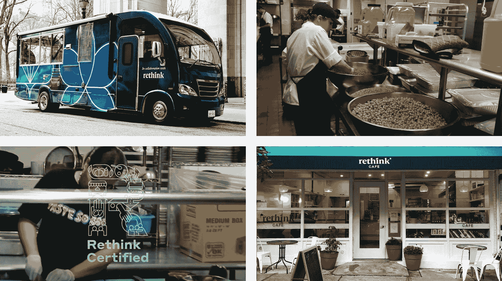

<!--yml
category: 未分类
date: 2024-05-28 17:36:49
-->

# Generative uncertainty - Vaughn Tan

> 来源：[https://vaughntan.org/generative-uncertainty](https://vaughntan.org/generative-uncertainty)

# Generative uncertainty

14/6/2023 ☼ [not-knowing](/tagged/not-knowing) ☼ [risk](/tagged/risk) ☼ [innovation](/tagged/innovation) ☼ [uncertainty](/tagged/uncertainty) ☼ [urban planning](/tagged/urban-planning) ☼ [wheat](/tagged/wheat) ☼ [farming](/tagged/farming)

This essay explains why uncertainty is an unavoidable part of innovation work, what generativity means in the context of uncertainty, what the three principles for designing generative uncertainty are, and how they may be concretely implemented. I’ve also recorded [an audio version (23 min) of this essay](https://uncertaintymindset.substack.com/p/generative-uncertainty) as a format experiment.

> tl;dr: Everyone hates on uncertainty and thinks of it as only something bad to be avoided. The reality is that uncertainty has a good side: it is essential for innovation. To do innovation work, uncertainty is a feature, not a bug. But not all uncertainty is good. Only the open-mindedness of generative uncertainty creates fertile ground for sustainable innovation to emerge.Generative uncertainty can be created by implementing three design principles: 1) having clear guardrails, 2) encouraging emergence, and 3) being ready to provide flexible support.

* * *

When I started out doing innovation research, my approach was to spend a lot of time with teams and organizations that did new things all the time. The ones I chose were unusual. They’d figured out how to design themselves to be more innovative, but not by using conventional management school methods. This is how I ended up spending many years observing and working with R&D teams in high-end cuisine. Turns out, they had unexpectedly effective ways to organise themselves to be good at doing new things well. (You can read more about all that in my book, [*The Uncertainty Mindset*](https://uncertaintymindset.org/).)

From consulting with software and other companies, I realized that the principles for designing innovative food R&D teams also apply to innovation teams in other industries. And when I started looking at innovation ecosystems (like buildings, neighbourhoods, cities, and regions), it became clear that these insights and principles apply generally to making environments in which new ideas (or products, or business models, or whatever) can emerge.

The entry point for me in understanding all this was admitting that we rarely (never?) know exactly what will happen in the future. We’re always faced with different types of [not-knowing](https://vaughntan.org/introducing-not-knowing). Though we often talk about them as “risk,” in truth risk is only one of these types of not-knowing.

## Risk is not uncertainty

In a risky situation, you know all the possible actions you can take, what outcomes your actions will produce, and all the possible outcomes.

Risk is actually a very specific, highly theoretical situation in which you don’t know exactly what will happen but you know almost everything about what you don’t know. This kind of situation barely ever exists in real life, except maybe when you’re tossing fair dice or flipping a fair coin. Believing that an unknown situation is knowable like this is comforting. (For a deeper dive on this, take a look at this article about [thinking more clearly about risk](https://vaughntan.org/how-to-think-more-clearly-about-risk).)

Uncertainty is fundamentally different from risk. In an uncertain situation, you may not know all the possible actions you can take, nor what outcomes your actions will produce, nor all the possible outcomes, nor even what outcomes will be valuable, and to whom.

Uncertainty is not quantifiable, so it is hard to manage. It’s uncomfortable, even terrifying. Most real-world situations — and all the most important ones — are uncertain not risky.

Risk is definitely not the same thing as uncertainty.

## Two sides of uncertainty

We instinctively and viscerally understand uncertainty as something bad. And uncertainty is often a very bad thing.

Zaporizhzhia is the biggest nuclear power plant in Europe and is a good example of bad uncertainty. It is in the middle of a war zone. Russia currently controls it and Ukraine wants it back — there is intense fighting going on around it and it may also be [threatened by flooding from a recently breached dam](https://www.euronews.com/2023/06/10/ukraines-zaporizhzhia-nuclear-plant-shuts-down-last-reactor-in-face-of-flooding-threat) (!). At the very least, we don’t know all the possible outcomes (one of which is a nuclear disaster at least affecting all of Europe). This is an uncertain situation, not a risky one, and it is *not* good.

It isn’t only existential threats like a war in Ukraine and possible nuclear disaster that create bad uncertainty. [2022’s global energy crisis](https://www.iea.org/topics/global-energy-crisis) from unpredicted fuel price increases made it hard to run businesses, and even to maintain political stability.

Recent global energy prices. Chart from the Dallas Fed.

And it isn’t only human systems that face bad uncertainty. Natural systems and the environment do too. [The weather globally is becoming increasingly unpredictable and extreme,](https://public.wmo.int/en/media/press-release/past-eight-years-confirmed-be-eight-warmest-record) causing everything from crop failures, to widespread health problems, to shutdowns of river navigation or power generation. With the onset of what looks like an El Niño cycle this year, it looks like 2023 will be unpredictable as well.

And of course everyone has lived through three years or more of dealing with the craziness of Covid-19, so we’ve all had a very recent — in fact, ongoing — shared experience of bad uncertainty. Because uncertainty is so often bad, and is always uncomfortable, it’s easy to forget that uncertainty also has a good side.

## The good side of uncertainty

The development of cellphones illustrates how innovation (new and useful things) can only emerge with uncertainty — and how uncertainty therefore has a good side.

In 1950, telephony was handsets connected by wires to a telephone network. At that time, no one knew for sure that it would be possible to have a commercially viable, consumer-grade wireless telephone network because the technology (and demand) for cellular networks hadn’t been developed yet.

Beginning in the 1970s, companies like Motorola and NTT DoCoMo began experimenting with wireless telephony and then with cellular networks. By 2003, cellphones had become cheap enough that even students in college (like me back then) had them. At that time, no one knew for sure that cellphones with the functionality of powerful personal computers would be possible because a whole host of miniaturisation and UX technologies hadn’t been developed yet.

Beginning in the mid-2000s, companies (notably Apple, as we all know) began experimenting with smartphones though even [well-informed people believed that such phones would never be commercially successful](https://www.fastcompany.com/3067030/the-iphone-turns-10-heres-what-skeptics-first-thought-about-it#:~:text=Skeptics%E2%80%94and%20there%20were%20plenty,was%20released%20the%20following%20June). Now, in 2023, smartphones with functionality that would have been almost unimaginable back then are nearly ubiquitous, forming the platforms for enormous systems of commercial and artistic innovation.

Uncertainty creates space for innovation in telephony.

In 1950 and in 2003, there was uncertainty about what technologies would be built (possible actions), what products those would enable (possible outcomes), and whether those products would be valuable (possible value). These kinds of uncertainty created the possibility for cellphones and then for smartphones to emerge.

With innovation work, you are never in a situation where you know almost everything about what you don’t know. With innovation, you don’t know where you’re going. You don’t know how you’re going to get there. You don’t even know what success looks like. Uncertainty in the form of these different types of not-knowing is what makes innovation possible in the first place. **Innovation work is definitionally uncertain.** Suppressing or avoiding uncertainty is a sure way to stifle innovation, because uncertainty is a feature of innovation work, not a bug.

So we have good and bad uncertainty. What is it that makes uncertainty good instead of bad?

## Good uncertainty is generative

Innovation means doing new things that are also useful. Good uncertainty creates space for new things and supports their growth when they can show usefulness — this is **generative uncertainty**. Creating generative uncertainty requires a pretty fundamental change to how we approach the world.

I first started thinking concretely about this when I did some work a few years ago with a group working on [regenerative agriculture using populations of heritage wheat](https://www.heritagegraintrust.org/).

Two ways of approaching farming wheat: Conventional monoculture (left) and population wheats (right).

The conventional approach to growing wheat is to grow it as monoculture (above, on the left). Each field is a huge number of wheat plants, all of which are the same variety. A monoculture grows best in a narrow band of environmental conditions specific to the variety of wheat planted. The flour from a monoculture wheat field has the properties of the variety of wheat planted. To adjust the flour’s properties, you breed/select the specific wheat variety.

A population wheat is a fundamental different approach to growing wheat. Instead of just one variety of wheat, you grow a population — a mix of genetically different varieties of wheat (above, on the right). Each variety of wheat grows best in a slightly different band of environmental conditions and has different properties when milled into a flour. Population wheat flour has the properties of its component varieties of wheats in their relative proportions. To adjust the flour’s properties, you nudge the population (e.g. by pulling out wheats with undesirable properties as they grow, or removing non-wheat plants that crept in, like oats or ryes). These nudges change the ratio of different wheats in the population, so the final flour has the approximately desired properties.

If there is extreme weather, a monoculture wheat field might fail entirely and be unharvestable. But a population wheat field is more able to adapt to unpredictable weather. If it is hotter (or wetter or cloudier or whatever), the varieties of wheat that do well in those conditions will flourish even as other varieties do less well. The population wheat field as a whole is more likely to survive, or even thrive.

As a population, the field adapts and responds to its growing environment. Instead of failing when conditions are suboptimal, a population wheat is likely to adapt by changing in composition and expression. This approach to wheat farming is a form of evolutionary design which works by being willing to not know for sure what wheats will be part of the final harvest — it’s open-minded about what success looks like. This makes it unpredictable and messy-looking, but the unpredictability and mess is also what makes it able to adapt to the place and climate in which it grows. Contrast that with the monoculture approach which is neat and predictable, which is also what makes it fragile.

The population approach to growing wheat is fundamentally different from conventional monoculture in its open-mindedness. Open-mindedness is a design principle that you also see in successful startups, APIs, platforms, and ecosystems — it creates mess, unpredictability, and uncertainty that is also generative.

## The imagination trap

Closed-mindedness is closely connected with needing certainty and wanting to eliminate or suppress uncertainty. But closed-mindedness is sometimes hard to recognise. I’ll give you an example that may be counterintuitive: Looking at other successful outcomes as a model for success.

There are now well-known innovation ecosystems. Silicon Valley is one of them. Over the last half-century, there has been enormous hardware and software innovation there, leading to many large and successful companies. It’s too easy to look at the success of Silicon Valley and believe that this is what an innovation ecosystem should look like, and that big high-tech companies are the only successful outcome.

For some regions, this model of success may work. Novi Sad in Serbia has great technical universities and quality of life and has become a vibrant center for European tech startup activity. But this kind of high-tech innovation wouldn’t have been so appropriate for Los Angeles.

## Generative uncertainty is essentially open-mindedness

It’s not because LA doesn’t have great universities (it does) — it’s because it has a resource which few other cities have: A long history in the entertainment and creative industry with an enormous network of expertise. LA innovation, fortunately, has gone in a direction that takes advantage of this local resource, with companies working on technology and products for entertainment, games, fashion, and consumer goods.

New and useful stuff isn’t always hot-shit high-tech, but staying open to **non-trendy innovation** is crucial for encouraging innovation that is appropriate to context and thus sustainable. Much clothing production is now done in very low-cost, relatively low-skill countries. The cities of Porto and Braga in Portugal have created an ecosystem for high-skill, high-quality clothing and textile development and manufacturing, to take advantage of the gap in the market, the region’s long history in the textile industry, and Portugal’s reasonable cost structure.

And innovation can take unexpected forms. The Auvergne, where I used to live, was once one of the largest winegrowing regions in France, known for producing inexpensive, not very good wine. Land and old vines here are relatively inexpensive. Big Wine isn’t lobbying for constraining how wines need to be made (as is happening in more prestigious French wine regions). So an ecosystem of small winemakers has evolved here. They’re doing very interesting things with low-intervention agriculture, winemaking, and marketing, making the Auvergne one of the most exciting places for wine in France.

A vineyard in the Auvergne. Photo from cotesdauvergne.com.

The common thread running through these examples is that successful innovation ecosystems don’t always look like what’s well-understood or hot-right-now. It’s vital to stay open to new ideas that emerge and are useful in any given place, and which take advantage of what’s actually there. This is the essence of generative uncertainty.

But how do you actually do this? What do policies, practices, programmes for creating generative uncertainty look like?

## Creating generative uncertainty

Let’s recap. The goal is to create an environment where new products and services, untested ideas, novel business models have low barriers to starting up, where they can be tested quickly, and where they have the resources to succeed and grow fast if they’re useful.

My view is that a good way to do this is by intentionally injecting generative uncertainty into the environment’s design. There are three basic design principles here:

1.  Have clear guardrails.
2.  Encourage emergence.
3.  Be ready to provide flexible support.

Three design principles for creating generative uncertainty

These are general principles that can be implemented in many different settings: a team, a company, a mixed-use property, a neighborhood, a town, a region, a country. But the implementations will look different in each setting.

I’ll give a few concrete examples to stimulate the imagination, but these are only illustrative of these principles.

### Clear guardrails through articulating tradeoffs: Rethink Food

A Rethink/Eleven Madison Park food service collaboration; Rethink’s commissary kitchen; the Rethink Certified program; a Rethink cafe.

Rethink develops new ways — programs, systems, training, and infrastructure — to reduce food waste while increasing access to safe food for those who need it. It’s a not-for-profit trying to run effectively and efficiently, something like a for-profit might. (Disclosure: I’m a board member.)

Early on, the CEO and his co-founder brought me in to take the whole organization (leadership and the on-the-ground operational team) through [a process of identifying and agreeing on acceptable/unacceptable tradeoffs](https://vaughntan.org/unpacking-boris) for Rethink when pursuing its goals of providing safe meals while reducing food waste. This was a difficult process because it involved negotiating and agreeing on what important or valuable things could be sacrificed to achieve Rethink’s goals — these difficult tradeoffs are the actually important part of goal-setting that conventional goal-setting exercises never pay attention to.

Agreeing on these acceptable and unacceptable tradeoffs provided clear guardrails for Rethink’s team. For instance, it was clear that Rethink’s team shouldn’t invest in trying to replicate what other food waste not-for-profits were trying to do. But inside those guardrails, Rethink was free to experiment with a wide range of programs.

Clear guardrails with freedom inside is how, in the last few years, Rethink has been able to test corporate partnerships that divert food from the waste stream, commissaries for processing food that would otherwise be thrown out, collaborations with industrial food processors to develop products made from food waste, Rethink branded/operated food service locations, certification programs for restaurant partners, working on government food provision contracts — among others. (They’re now looking into training programs to scale the know-how Rethink has developed.)

> Actions/processes that **clarify guardrails** reduce wasted effort and resources by making explicit the kinds of work and outcomes that are undesirable and not to be invested in — e.g. highly pollutive companies, or companies that don’t employ any local talent. This effort can be focused instead on trying out new things that fit inside the guardrails, which is why it’s important for leaders to vigorously protect freedom and autonomy there.

### Encouraging emergence through messy real estate: Far East Plaza

The warrens of messy, crummy, small-footprint retail shops inside Far East Plaza; a low-budget select shop experiment in the building. Both from 2015.

Like many cities in Asia, Singapore has a vibrant and continually changing retail culture. One of the most active centers for fashion retail innovation was Far East Plaza, a mixed-used property on a side road in the core Orchard Road shopping district.

Far East Plaza was constructed in the early 1980s and has remained essentially unchanged since. The multiple retail levels are laid out as a tangle of mostly internal units with no street frontage or windows. Most units are tiny (a few hundred square feet) and many are created by subdividing larger units with plasterboard or plywood. The structure is old and shows signs of wear from forty years of use that a recent cosmetic renovation fails to hide. It is down-market real estate even given its central location.

Even in the 1980s when I first went there, Far East Plaza felt messy and low-rent. And that, counterintuitively, is how it encouraged emergence and became an accidentally successful incubator. Most of the rentable spaces were too odd-shaped, small, and crummy to attract already-successful businesses with proven business models. Rents were lower and spaces were easier to get, so weird and untested new fashion and retail businesses had lower barriers to getting into Far East Plaza. Many failed, opening up room for more weird unproven businesses to take their places. Those which succeeded in finding a market expanded. Successful shops may have multiple locations on different floors, or have gradually expanded by eating up their neighbors), or moved to more premium real estate.

Crummy, messy real estate that is unattractive to already-successful businesses can create the conditions under which unproven business models have a chance to emerge and be tested. These real estate dynamics are at work in Harajuku in Tokyo (also a great place for cutting-edge fashion and retail) and on Spring Mountain Road in Las Vegas (which is now one of the most interesting places for food and beverage concepts in the United States).

> Structures/policies that **encourage emergence** make it cheaper, easier, and faster for not-yet-proven business models (or products, services, or ideas) to show up and be tested — this is where truly innovative stuff can come. Warning: emergence is always messy and failure-prone.

A reminder of the imminent end of CreateHere’s planned five-year lifespan.

CreateHere was a five-year program designed to end in 2012 in Chattanooga, Tennessee. Its goal was to revitalize the city using entrepreneurship and innovation, but very broadly defined: from attracting artists to live and work in the city, to incubating or supporting the establishment of both conventional and unconventional small businesses and minor projects.

The founders of CreateHere didn’t start it with a clear, rigid idea of what it would do. Instead, they spent time actually asking people who were already in Chattanooga or who might want to relocate there. The intention was to learn what resources were needed which didn’t already exist or were hard to get access to.

CreateHere ultimately provided or facilitated many different kinds of support for new ideas and projects. Some examples include providing micro-grants/loans to individuals (in the thousands of dollars), offering business planning courses, starting a business services company, and providing conditionally forgivable mortgages to people wanting to move to the city. By the end of the program, CreateHere had helped start over a hundred local businesses and other pro-social or not-for-profit organizations by figuring out how to give them the particular resources and support that they needed to start or grow.

> **Flexible support** systems provide the particular resources needed for new ideas to grow when they prove to be useful. But for these systems to be supportive, you have to be open-minded and creative about finding out what resources are actually important in context — they may look different from what you expect.

## Principles ≠ implementations

Those are a few concrete examples of programs or structures which embody these three principles. The principles themselves can be implemented in many different settings, but the implementations will look different each time.

Some concrete implementations of these three design principles for generative uncertainty.

## The importance of being sneaky

Important stakeholders — the people with money or political influence — will always want innovation programs that are sure to work, that are neat and predictable. They will recoil at the prospect of failure. What they hunger for is certainty on a schedule. But the moment you try to squeeze the uncertainty out of innovation work, the possibility of innovation goes away. How to get around this? Sneakily, by avoiding notice and appearing harmless.

So, never attempt a big, splashy program to inject generative uncertainty straight off the bat. This is a sure way to get shut down fast. Instead start by redesigning the program to be as small as possible, and to have manageable downside exposure — call it an experiment, if that helps. (If you have an idea and are stuck on making it a tiny and innocuous experiment, drop me a line.) Starting small and safe like that makes creating generative uncertainty less noticeable and scary, especially when these small weird experiments run alongside more conventional programs.

If any small weird experiments work, use that as evidence to put more effort and resource behind them — and eventually, when they’re validated enough, to bring them into the light and really scale them up. If you play your cards right, they’ll have become too obviously successful for even people who need certainty to want to kill them.

## Finding the new with generative uncertainty

We make four mistakes that get in the way of creating good environments for innovation:

1.  We conflate risk with uncertainty.
2.  We miss the generative, good side of uncertainty.
3.  We don’t recognise that generative uncertainty needs to be intentionally designed into systems.
4.  We want to believe that influential stakeholders can get over their need for certainty. (They usually can’t.)

Generative uncertainty is a feature of innovation work, not a bug. Nothing new and useful is possible without generative uncertainty. The best way to create environments/programs/structures with generative uncertainty is to design them with that in mind — by having clear guardrails, actively promoting emergence, and investing in flexible support. And then to deploy these sneakily at first, in small ways that are innocuous enough to escape notice until they begin to work enough to be scaled up.