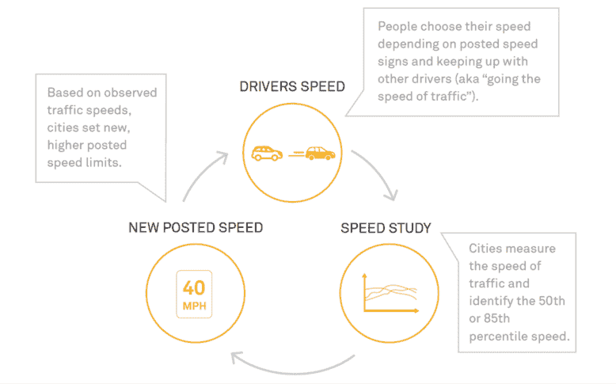

<!--yml
category: 未分类
date: 2024-05-27 14:24:19
-->

# In a win for the climate, urban speed limits are dropping » Yale Climate Connections

> 来源：[https://yaleclimateconnections.org/2023/12/in-a-win-for-the-climate-urban-speed-limits-are-dropping/](https://yaleclimateconnections.org/2023/12/in-a-win-for-the-climate-urban-speed-limits-are-dropping/)

Since 2015, Seattle has lowered speed limits across much of its road network, setting residential streets at 20 miles per hour and most larger urban corridors at 25 miles per hour. After these changes took effect, studies showed that car crashes fell by approximately 20%, while the crashes that did occur resulted in [significantly fewer injuries](https://www.iihs.org/topics/bibliography/ref/2279).

Cities across the U.S. are following Seattle’s lead, with speed limits dropping from Denver and Minneapolis to Washington, D.C., and Hoboken. Although these changes are motivated by the need to reduce deaths and injuries from car crashes, there’s a growing recognition that they also benefit the climate.

“Safety and environmental goals go together. They’re inevitably interlinked,” said Venu Nemani, the chief safety officer of the Seattle Department of Transportation.

#### **High speed limits are a barrier to climate-friendly transportatio**n

Transportation is the [largest source of emissions](https://www.epa.gov/greenvehicles/fast-facts-transportation-greenhouse-gas-emissions) in the United States, and passenger vehicles are the leading offenders within the sector. Electric vehicles can help reduce these emissions, but they’re [not a silver bullet](https://yaleclimateconnections.org/2023/06/evs-alone-cant-solve-climate-problems/) — many experts agree that meeting climate targets will also require car use to fall. As a result, it’s vital for governments to help people meet their needs by walking, cycling, and taking public transportation (which often requires traveling on foot to a transit stop).

But achieving this will require making streets safer for people moving around on foot or by bike, as concerns over road safety are a common barrier to [walking](https://www.ncbi.nlm.nih.gov/pmc/articles/PMC9552087/) and [cycling](https://www.medrxiv.org/content/10.1101/2022.04.22.22274159v1.full). Unfortunately, these concerns are justified. [According to the World Health Organization](https://www.who.int/health-topics/road-safety#tab=tab_1), more than 1 million people die on roads every year around the world. More than half of all deaths and injuries from crashes involve vulnerable groups such as pedestrians, cyclists, and motorcyclists.

In the United States, [pedestrian](https://www.ghsa.org/resources/news-releases/GHSA-Pedestrian-Spotlight23#:~:text=Pedestrian%20deaths%20have%20surged%2018,.%2C%20of%20research%20firm%20Westat.) and [cyclist](https://www.iihs.org/topics/fatality-statistics/detail/bicyclists#:~:text=Posted%20May%202023.-,Trends,their%20lowest%20point%20in%202010) fatalities have risen in recent years against the backdrop of a wider road system failure that [kills tens of thousands of people](https://www.nhtsa.gov/press-releases/traffic-crash-death-estimates-2022) annually.

“We have a traffic death crisis in the U.S.,” said Alex Engel, senior manager of communications at the [National Association of City Transportation Officials](https://nacto.org/). “Traffic deaths are unbelievably high, especially compared to our peers. They’re getting worse, for a variety of different reasons.”

Vehicle speed plays a major role in these incidents, with faster motion leading to more and deadlier crashes. Higher speeds are especially dangerous for people outside cars. According to the AAA Foundation for Traffic Safety, a pedestrian struck by a vehicle traveling at 23 miles per hour faces [a 10% risk of death](https://aaafoundation.org/impact-speed-pedestrians-risk-severe-injury-death/). At 46 miles per hour, this rises to 90%.

**A global push for safer streets**

The movement to lower speed limits in U.S. cities represents a much-needed break with the past, Engel said.

“The way we’ve set speed limits in the U.S. for decades has been really quite outdated, and it was based around essentially pseudoscience,” he said.

The traditional method essentially allows drivers themselves to determine speed limits. In this model — still used in much of the country — transportation officials measure the speed at which all cars on a particular road are moving during a given period with no traffic congestion, then determine the speed above which the fastest 15% of this group are traveling. This number (rounded) then becomes the new speed limit for the road. However, since some drivers travel above the posted limit, this approach causes speed limits to rise over time.

(Image credit: [National Association of City Transportation Officials](https://nacto.org/))

Efforts to move beyond this approach have been inspired by international precedents. [Vision Zero](https://www.roadsafetysweden.com/about-the-conference/vision-zero---no-fatalities-or-serious-injuries-through-road-accidents/), a strategy first adopted by Sweden’s parliament in 1997, has been particularly influential. Whereas traditional approaches to road safety emphasize individuals’ responsibility to prevent crashes, Vision Zero focuses on creating a system in which human error — which is impossible to completely eliminate — is less likely to cause serious harm. Some of the [measures used to achieve this](https://visionzeronetwork.org/wp-content/uploads/2018/11/Vision_Zero_Core_Elements.pdf) include reducing speed limits, redesigning streets (by adding roundabouts, for example), and mapping crashes to enable stronger interventions in hot spots.

Another force shaping the global debate over traffic speeds is [20’s Plenty for Us](https://www.20splenty.org/), a volunteer-driven organization based in the United Kingdom. The group was founded in 2007 by Rod King, an avid cyclist who experienced the benefits of 20-mile-per-hour speed limits while visiting the bike-friendly city of Hilden, Germany. Variations of the campaign’s name have been adopted as a slogan by transportation agencies and advocates, with “20 is plenty” appearing everywhere from [buses in Washington, D.C](https://twitter.com/DDOTDC/status/1456638944897126401). to yard signs in [Salt Lake City](https://sweetstreetsslc.org/20-is-plenty).

Policymakers across Europe and the U.S. have been receptive to Vision Zero and 20’s Plenty ideas. According to King, in the United Kingdom, 28 million people — nearly 42% of the total population — now live in a 20-mile-per-hour community. [London](https://tfl.gov.uk/corporate/safety-and-security/road-safety/safe-speeds) has lowered its speed limits, as have [Brussels](https://city30.brussels/), Paris, and [other European capitals](https://etsc.eu/amsterdam-follows-paris-brussels-and-madrid-with-default-30-km-h-limits/). At the national level, [Spain](https://etsc.eu/spain-switches-most-urban-roads-to-30-km-h-amid-calls-for-action-in-several-eu-member-states/) and [Wales](https://www.gov.wales/introducing-20mph-speed-limits-frequently-asked-questions) have set default limits of 30 kilometers per hour (around 19 miles per hour) and 20 miles per hour, respectively, on many roads.

**Designing a safe transportation system**

Wen Hu, a senior research transportation engineer at the Insurance Institute for Highway Safety, has examined the effects of lower speed limits in Seattle and [Boston](https://pubmed.ncbi.nlm.nih.gov/30636698/#:~:text=Results%3A%20The%20speed%20limit%20reduction,these%20reductions%20were%20statistically%20significant.). She said that these and similar studies from other countries have largely confirmed that lowering speed limits brings real benefits. “Basically, all this research tells the same story: Reducing speed limits can reduce speeding and reduce crash severity.”

Drawing on studies from Hu and others, “[City Limits](https://nacto.org/safespeeds/),” a 2020 report published by the National Association of City Transportation Officials, concluded that the relatively simple act of changing speed limit signs can lead to a significant return on investment for municipalities. “A growing body of evidence in places like Seattle, Boston, and Toronto shows that drivers respond to posted speed limits even without any enforcement efforts,” the authors wrote.

But lower speed limits alone can’t completely eliminate crashes, of course. Hu cautioned that while speed limit reductions are effective, they need to be combined with [other safety-focused interventions](https://www.transportation.gov/NRSS/SafeSystem). “It’s not as simple as you just reduce speed limits and that solves the problem,” she said.

The intervention most familiar to many Americans — police enforcement — is far less than ideal, according to “City Limits.” The report’s authors write that police disproportionately stop people of color when enforcing traffic laws and that police-led speed limit enforcement can have damaging unintended consequences in communities of color.

Instead, the report says, the most effective way to slow traffic on streets where speeding is common is to change the physical design and operation of the street itself; for example, by adding speed humps and reducing the length of green lights at stop signals. Speed cameras can also help.

**Seattle redesigns its streets to protect cyclists and pedestrians**

In recent years, Seattle has successfully redesigned a number of streets to slow traffic, said Clara Cantor, a community organizer with urban advocacy group [Seattle Neighborhood Greenways](https://seattlegreenways.org/). However, some streets still encourage speeding, and a high percentage of the city’s [28 average annual traffic deaths](https://www.seattle.gov/transportation/projects-and-programs/safety-first/vision-zero#:~:text=While%20Seattle%20is%20one%20of,nearly%20180%20people%20seriously%20injured.) occur on these corridors.

“There’s still some streets in Seattle that are really designed like highways and feel like you should be driving on it like a highway. And that’s where we’re seeing most of the major crashes where people are dying,” she said.

And though lower speed limits alone aren’t enough to prevent all deaths or change every driver’s behavior overnight, they play a crucial role in “the long game,” as Cantor put it. “Now, when SDOT (the Seattle Department of Transportation) is going in on every single one of those streets, any little tiny project that they’re doing, they’re designing for a lower speed limit than they would have been otherwise. And so over time that’s made a really big impact on a lot of streets.”

Seattle Neighborhood Greenways is still [pushing the city to do more](https://seattlegreenways.org/our-priorities/current-priorities/vision-zero/) to protect cyclists, pedestrians, and transit riders, but Cantor said that even for cynical transportation activists, the department of transportation’s progress since adopting Vision Zero is impressive. The experience of biking around the city “is completely, completely transformed from how it was in 2016,” she said. “It’s way, way, way, way, way better and feels safer.” The public transportation system has also become more robust, she noted, and pedestrian access has improved.

These changes have made it easier for people in Seattle to get around without cars. “Over the last decade, our population grew by about 20%, and during the same time our traffic volumes pretty much stayed the same on our [street] network, and our transit user ridership has grown by about 30%,” said Venu Nemani. “We are basically providing more and more options every day for people of the city of Seattle to make their trips by using non-auto modes.”

According to Rod King of 20’s Plenty for Us, setting the stage for wide-ranging changes like these is a common benefit of 20-mile-per-hour speed limits. This makes speed limit reductions a critical first step for cities wanting to improve road safety and reduce emissions.

“The speed of vehicles affects your [road] crossings. It affects what you have to do to protect cyclists. It affects what you have to do to protect other motorists,” King said. “So get the speed down — get the kinetic energy in a road network down — and you will find you have more options.”