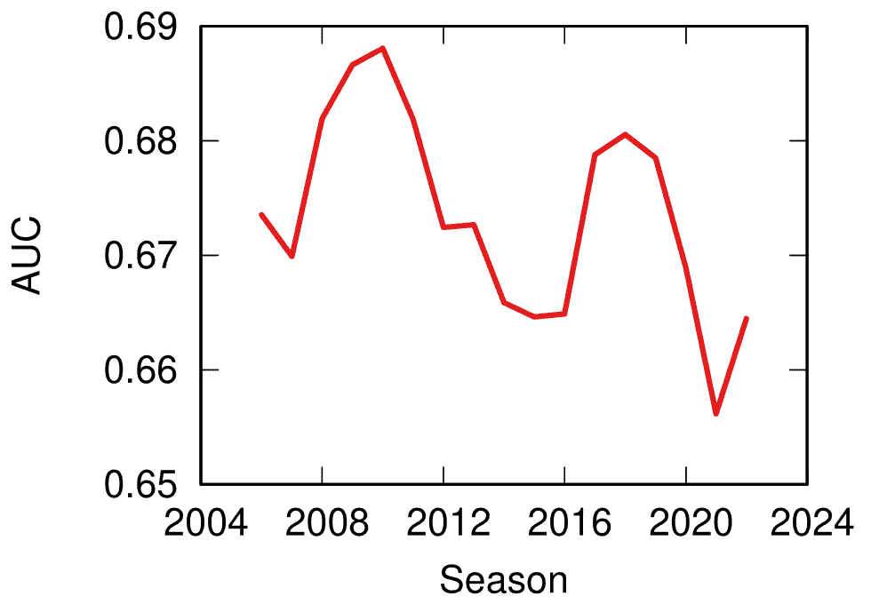
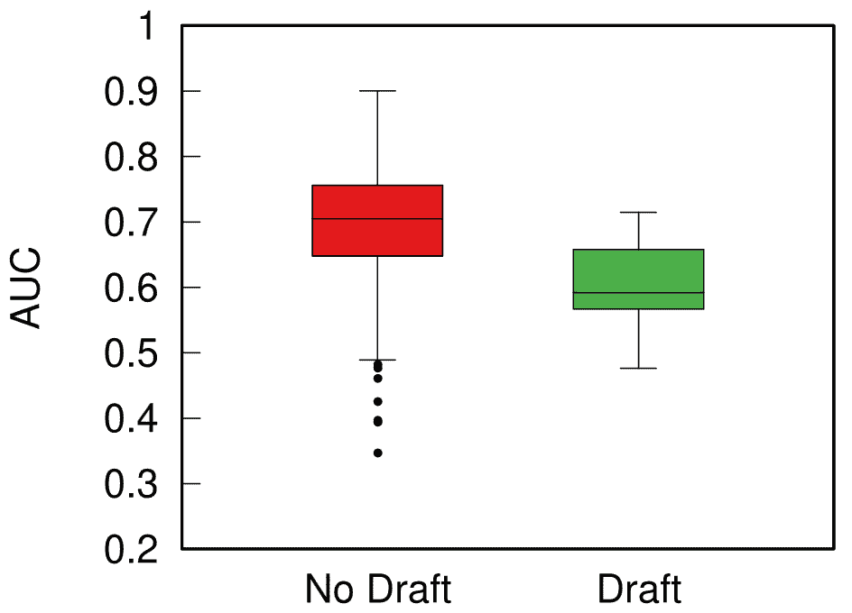

<!--yml

category: 未分类

date: 2024-05-27 14:29:28

-->

# | 可预测性、主场优势和团队运动公平性Michele Coscia

> 来源：[https://www.michelecoscia.com/?p=2311](https://www.michelecoscia.com/?p=2311)

有一篇[很棒的论文](https://royalsocietypublishing.org/doi/full/10.1098/rsos.210617)是由优秀的[Taha Yasseri](https://tahayasseri.com/)发表的，显示足球随着时间的推移变得更加可预测：从90年代初到现在，试图猜测谁会赢得比赛的模型的准确性已经提高了。我感到好奇，问自己：这只适用于足球吗，还是跨越不同的团队运动是一个普遍现象？这个问题的结果是这篇论文：“[哪种运动变得更可预测？团队运动中可预测性的跨学科分析](https://rdcu.be/dxgwD)，”它刚刚出现在EPJ数据科学上。

我的想法是，随着体育运动中越来越多的金钱和专业化，那些更富有的人将会随着时间变得更强大，并在一个赛季中占据主导地位，这将使他们更富有，因此更具优势，更富有，直到你得到尤文图斯，他们在意大利进行的119个足球联赛赛季中几乎有50%的赛季名列第一或第二。

我的第一步是收集有关9个学科（棒球、篮球、板球、足球、手球、曲棍球、橄榄球、足球和排球）中49个联赛中进行的30万场比赛的数据。我的第二步是毫不掩饰地从塔哈的论文中抄袭整个方法，因为嘿，为什么要创新当你可以只复制最好的呢？（此外，这样我就可以重现并确认他们的发现，至少这是我晚上入睡时给自己讲的故事）

预测性（y 轴，更高表示更可预测）随时间（x 轴）在所有学科中的变化。这里没有明显的趋势！

我得到的第一个答案是，塔哈是对的，但大多只是关于足球。除了排球（也许还有棒球），它是随时间变得更可预测的少数几个学科之一。其他学科则是一大堆非显著结果和实际预测性降低的混合。

可能影响这些结果的一个因素是主场优势。通常情况下，主场作战的球队赢球的几率稍高。有时甚至不仅仅是稍微高。在法国的精英橄榄球比赛中，主场优势大约为80%。举个例子，2014年的法国*冠军*图伦 *只在他们的13场客场比赛中赢了4场*，其中两场是对阵那个赛季降级的联赛倒数第二和倒数第一的球队。

一切都在[pilou pilou](https://www.youtube.com/watch?v=1bR7nPRBqQ0)中。你真的会去图伦告诉这家伙你期望赢吗？我想不会。

嗯，这实际上是几乎在各个学科中普遍发生了变化的事情：主场优势已经在全面收缩 —— 从 2011 年主场胜率平均为 64% 下降到了疫情后的 55%。主场优势在 Covid 期间确实减小了，但这一趋势几乎是在疫情之前的十年开始的。这个小家伙没能起到任何帮助的作用 —— 比赛在闭门进行改变了比赛的动态 —— ，但它只是加速了这一趋势，而不是创造了它。

关于我的原始假设呢？富者恒富效应是否背后决定了可预测性？这是可以验证的，因为大多数美国体育都是在社会主义制度下管理的：运动员有工会，上个赛季表现最差的球队可以选择下个赛季最好的新秀等等。在欧洲，运动员没有工会，如果你有足够的钱，你可以买下任何你想要的人。

以欧洲体育（红色）和美国体育（绿色）的可预测性分布绘制的箱线图。箱子越高，结果越可预测。

当我根据他们遵循的管理体系将联赛分开时，我可以清楚地看到，在欧洲资本主义体系下的联赛往往更具可预测性。所以下次当你和一个宣扬自由放任的无政府资本主义者交谈时，告诉他们，至少，在社会主义下，你不会因为事先知道谁会赢而在体育场感到无聊。
