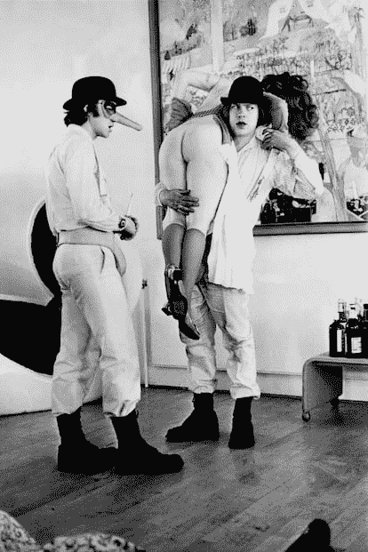
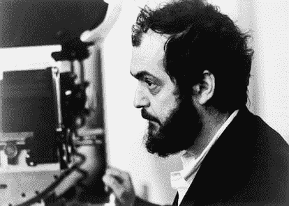
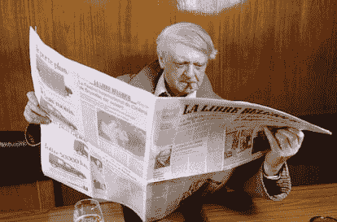
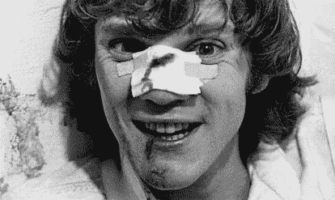

<!--yml

category: 未分类

date: 2024-05-27 14:30:48

-->

# ‘我不应该写‘发条橙’’：安东尼·布格斯如何拒绝自己的小说 | 文化 | EL PAÍS英文版

> 来源：[https://english.elpais.com/culture/2024-01-29/i-should-not-have-written-a-clockwork-orange-how-anthony-burgess-came-to-disown-his-own-novel.html](https://english.elpais.com/culture/2024-01-29/i-should-not-have-written-a-clockwork-orange-how-anthony-burgess-came-to-disown-his-own-novel.html)

英国作家安东尼·布格斯受到了他所感知到的青年中不文明的漂流的启发，写下了他最知名的小说*A Clockwork Orange*（1962年）。因此，十年后，当类似“警方追捕橙色机械强奸犯团伙”或“橙色机械战争中儿童丧生”之类的标题开始出现在报纸上时，他不禁感到事情出了大问题。

“小说的误解将会追随我至死。我不应该写这本书，因为有误解的危险，”他在1985年的*Flame into Being*中写道，这是一部关于D·H·劳伦斯的传记，他在书中将*娇妻*（1928年）引起的丑闻与围绕他的流行反乌托邦小说的争议进行了比较。“如果梵蒂冈有几名修女被强奸，我就会接到报纸的电话。他们把我变成了某种暴力专家，”他在一次电视采访中感叹道。然而，布格斯清楚地认识到，他的问题并不一定源自这本书，而是来自[斯坦利·库布里克](https://english.elpais.com/culture/2022-11-17/shelley-duvall-disappearance-and-return-of-an-icon-that-cinema-pushed-to-the-limit.html)1971年的电影改编。

2023年纪录片*橙色机械，暴力的机制*（英文名：A clockwork orange: the prophecy）由法国文化电视频道Arte的法国分部制作，深入探讨了作家与他被载入20世纪文学史的作品之间的冲突关系——不管他是否喜欢。这部中篇电影是基于*The Clockwork Condition*，这是布格斯在电影发布后立即撰写的手稿，在布格斯去世后被发现，作者在其中解释了他小说的主题，并为那些指责他美化犯罪的人辩护。“所有的艺术作品都是危险的。我小儿子看完迪士尼的*彼得·潘*后试图飞起来。我抓住他的腿，他正要从四楼窗户上飞起来，”他说道。他的这种解释，甚至是自我辩护的愿望，与他在接下来的十年里保持的顺从态度形成了对比，即20世纪80年代。

### *雨中曲*

电影和小说都讲述了亚历克斯的故事，一个热爱贝多芬的少年犯，他和他的三个*伙计*（朋友，根据他们用来交流的纳德萨特语言）一起系统地殴打和强奸，直到最终被逮捕。为了尽快出狱，他自愿接受了一种名为卢多维科技术的实验性治疗，这是一种行为条件反射疗法，可以消除他所有的暴力冲动。在没有道德选择的情况下，他成为了一个没有自由意志的人，被周围的每个人侮辱和羞辱。标题《发条橙》在作者的话中暗示“对一种充满汁液和甜味的有机体施加机械式道德的应用”。

“发条橙”中的暴力场景之一，主人公袭击一名女性。ullstein bild Dtl. (ullstein bild via Getty Images)

斯坦利·库布里克，将《发条橙》搬上大银幕并使其成为有史以来最具争议性的电影之一的导演。Bettmann（Bettmann档案）

当库布里克的电影中描绘了书中最严厉的页面，特别是[一起性侵犯](https://english.elpais.com/culture/2023-09-26/when-literature-and-documentaries-warn-about-incestuous-sexual-abuse.html)配合着《雨中曲》的画面—引起了一场突如其来的冲击，反应从对艺术社会责任的激烈辩论到显然基于该电影的暴力事件。库布里克本人，针对一系列谋杀案，被告们明确提到了他的作品，要求在英国撤回《发条橙》，直到他于1999年去世后，该片在英国才能再次上映。

与此同时，伯吉斯不知不觉地成为了它的代言人。这种合作带来的良好关系似乎会延续到一部库布里克想要制作的关于[拿破仑](https://english.elpais.com/culture/2023-11-24/napoleon-the-great-man-leaves-me-cold.html)的电影，但当这位电影制作人让作者和男主角马尔科姆·麦克道威尔单独面对媒体谈论《发条橙》及其争议时，这段关系开始恶化。伯吉斯甚至出席了几次以库布里克的名义领奖的仪式。公众的疲劳感以及与他从未能恢复的电影的明显关联。在1984年舞台改编剧本中，为了消除人们对他对前友谊的尊重的疑虑，伯吉斯引入了一个“像斯坦利·库布里克那样留着胡须”的角色，他用小号演奏《雨中曲》—然后被赶下舞台。

他对这一现象的厌倦和他对自己作品的疏远日益加深。在1986年美国重新出版该书的序言中，他直言不讳地对其艺术价值不屑一顾，将其公众关注的唯一原因归功于库布里克的电影：“我于1962年首次出版了中篇小说*A Clockwork Orange*，这应该已经足够久远，使它从世界文学记忆中被抹去。[...] 凭各种原因，我自己也会很高兴否认它，”他写道。然而，“它似乎有可能存活下来，而我更重视的其他作品却随之化为乌有。”他继续说：“坐在一个沉闷的房间里创作*Missa Solemis*或*The Anatomy of the Melancholy*不会成为头条新闻或新闻快报。不幸的是，我的这本小册子之所以吸引了许多人，是因为它像一箱臭鸡蛋一样散发着原罪的恶臭。”

### 第21章

无论是那篇序言还是最近发布的纪录片都将与电影的冲突焦点不是那么多地放在其对暴力的描绘上（“库布里克将暴力转化为闹剧。他使你陷入了思考是否应该笑的境地，”作家威尔·塞尔夫（Will Self）如此说道，他是其中一位受访者）而是放在了它省略了最后一部分——第21章，而在这一章中，亚历克斯实际上改邪归正。最后一部分的缺失是美国编辑的干预结果，他删除了这一章，认为前几页提出的结局更具有暗示性。库布里克也这样认为。在电影和书的美国版本中，卢多维科技术的影响被扭转，亚历克斯能够随心所欲地重新犯罪。然而，在伯吉斯的完整文本中，亚历克斯与他的一位前*伙伴*之一相遇，后者现已结婚并拥有自己的公寓，这使他反思了自己的生活，并选择放弃暴力，开始一个家庭。这种象征性的[成熟](https://english.elpais.com/elpais/2012/01/08/inenglish/1326003642_850210.html)恰逢其时，与当时的法定成年年龄（21岁）相符。

安东尼·伯吉斯，作者《发条橙》的照片，摄于1987年。米歇尔·塞博（Michel SETBOUN）（通过Getty Images Gamma-Rapho）

“安东尼·伯吉斯是一位成熟的人，许多信仰他保守，他的社会、宗教和政治价值观。以这种方式结束，他把中产阶级作为对抗专制国家的救世主，”解释马德里康普顿大学英语文学教师爱德华多·瓦尔斯·奥亚尔兹恩。 “自由意志的问题是这部小说阐述的哲学概念，他认为这是青年成长的空间。当他开始探索时，他注意到国家对这种自由意志的巨大影响。他在小说中对善恶的理解是政治的，而不是传统宗教意义上的形而上学或道德。专制国家渗透到个体、自我的心理。”

伯吉斯小说的触发事件发生在1942年，当时作家的第一任妻子在伦敦遭到三名美国逃兵残暴袭击和殴打。她失去了她正在期待的孩子，并由于持续的内部出血几年后去世。在《发条橙子》中可以轻易找到这一事件的反映：被亚历克斯和他的*droogs*强奸的女人的丈夫是一位作家，事实上正在完成一部名为《发条橙子》的手稿。纪录片解释了作家在从马来西亚和文莱的英国殖民地工作后返回英格兰后，由于青少年犯罪的上升而处于警戒状态的情况。所谓泰迪男孩的叛逆亚文化和由心理学家伯鲁斯·弗雷德里克·斯金纳出版的行为主义研究引发的担忧，在这本书中清晰地结晶出来，这本书在行为主义研究中找到了最终的成分。

### 肯尼迪、尼克松和沃霍尔

在库布里克之前，1965年，安迪·沃霍尔拍摄了自己的小说改编作品，并将其命名为*Vinyl*。沃霍尔的版本基本上只有一个框架，在一个小时内完成，吸取了伯吉斯依赖的同一想象：与摇滚音乐新兴人物如马龙·白兰度在《水门事件》（1954）和詹姆斯·迪恩在《无因的反叛》（1955）中的崛起相一致的反叛青少年美学。沃霍尔提出了一种与伯吉斯不同的颠覆性论述，其同性恋色彩的动机也使路多维科技术成为转化疗的参照。

在小说和库布里克的电影中，作者及其助手的角色被夸张地刻画为政府的反对者，被描绘为一群更关心将亚历克斯视为工具而不是帮助他的知识分子。对政治立场的不信任，在最终章节中再次得到了微妙的呈现。“我的书是肯尼迪式的，接受了道德进步的概念。真正想要的是[在去掉第21章的美国版本中]一本尼克松式的书，其中没有一丝乐观主义。让我们在页面上跳跃邪恶，一直到最后一行，嘲笑所有传统信仰[...]关于人们能够让自己变得更好的观念，”伯吉斯在1986年责备道。

马尔科姆·麦克道尔，《发条橙》主演。ullstein bild Dtl.（ullstein bild通过Getty Images提供）

“库布里克过去常说最好的改编来自糟糕或有缺陷的小说。也许安东尼·伯吉斯接受了那篇演讲，并开始将他的小说视为有缺陷的，”教师爱德华多·瓦尔斯认为，关于作者对该书流行的不满。“但在我看来，电影所做的改编并不重要。改编的问题在于它更加本质主义，虽然它不是派生的，而是独立存在的。我喜欢说它们是两个不同的杰作。”

作为20世纪英国反乌托邦的一个例子，与*美丽新世界*（1932年）和[*1984*（1949年）](https://english.elpais.com/culture/2022-11-26/1984-how-george-orwells-big-brother-was-born-during-the-spanish-civil-war.html)相关（不是白费伯吉斯是乔治·奥威尔的忠实爱好者），*发条橙*是作者作品中的一次实验，尽管在瓦尔斯的看法中，它并不一定是一部孤儿小说。“它偏离了他的主线，即对殖民地世界的思考或他在东南亚逗留期间的经历，但与定义善恶有关的问题是与他自己的作品相关的。”它也不是一个容易被拒绝的东西。“围绕这部电影的一切都不太合他的意。我认为这是一种主观反应。这是一部变成了流行文化现象的小说，无疑超越了作者本人。问问周围的人，看看有多少人能够说出安东尼·伯吉斯的另一本书的名字。”

*注册* [*我们的每周通讯*](https://plus.elpais.com/newsletters/lnp/1/333/?lang=en) *，获取更多来自EL PAÍS美国版的英语新闻报道*
