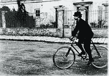
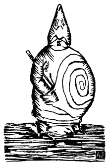

<!--yml

category: 未分类

日期：2024年05月29日 12:52:15

-->

# 巴塔物理学 - 维基百科

> 来源：[https://en.wikipedia.org/wiki/%27Pataphysics](https://en.wikipedia.org/wiki/%27Pataphysics)

与形而上学无关的哲学或伪哲学

1898年[Corbeil](/wiki/Corbeil-Essonnes "Corbeil-Essonnes")的贾里^([[1]](#cite_note-1))。

**巴塔物理学**（[法语](/wiki/French_language "法语")：*'pataphysique*）是法国作家[阿尔弗雷德·贾里](/wiki/Alfred_Jarry "阿尔弗雷德·贾里")（1873–1907）发明的一种 “[哲学](/wiki/Philosophy "哲学")” [科学](/wiki/Science "科学")，旨在成为科学的[模仿](/wiki/Parody "模仿")。^([[3]](#cite_note-3)) 很难简单地定义或界定，它被描述为“虚构解决方案的科学”。^([[4]](#cite_note-4))

## 介绍[[编辑](/w/index.php?title=%27Pataphysics&action=edit&section=1 "编辑：介绍")]

贾里以一种嘲弄科学的方式表达了巴塔物理学的概念，其中夹杂着恶搞和[庸医学](/wiki/Quackery "庸医学")的色彩，正如他在小说*[福斯特罗博士的冒险与见解，巴塔物理学家](/wiki/Exploits_and_Opinions_of_Dr._Faustroll,_Pataphysician "福斯特罗博士的冒险与见解，巴塔物理学家")*中所阐述的那样。在这里，贾里玩弄了对现实的传统概念和解释。另一种对该定义的解释将巴塔物理学解释为“诗歌或科学或爱情加强视野所瞥见的事物的虚拟或想象的本质可以被抓住并视为真实的想法”。贾里通过一系列声明和例子来定义巴塔物理学，包括它是“想象解决方案的科学，它将对象的特性象征性地归因于它们的虚拟性，以及它们的轮廓”。巴塔物理学的实践者是巴塔物理学家或巴塔物理学家。

## 定义[[编辑](/w/index.php?title=%27Pataphysics&action=edit&section=2 "编辑：定义")]

巴塔物理学的一个定义是，“这是一种哲学或科学的分支，它研究存在于超越[形而上学](/wiki/Metaphysics "形而上学")世界中的想象现象；它是想象解决方案的科学。”^([[7]](#cite_note-7)) 让·博德里亚将巴塔物理学定义为“我们世界的想象科学，过度的想象科学，过度、滑稽、突发的效应 - 尤其是空虚和无足轻重的过度”。^([[8]](#cite_note-8))

巴塔物理学有一百多种定义。以下是一些示例。

> '*巴塔物理学*是超越形而上学的科学，无论是在形而上学的限制内还是超越其之外，它延伸到超出形而上学的范围，如同后者超出物理学的范围一样。... *巴塔物理学*将成为首要的特殊科学，尽管普遍的看法认为唯一的科学就是一般的科学。 *巴塔物理学*将研究统治例外情况的规律，并解释这个宇宙作为这个宇宙的补充。'
> 
> *巴塔物理学*是耐心的；*巴塔物理学*是仁慈的；*巴塔物理学*不嫉妒，从不分心，从不自负，它既没有愿望，也不寻求自己，它心平气和，不思恶事；它不嘲笑不义：它对科学真理感到欣喜；它支持一切，相信一切，对一切都有信心，并支持一切。
> 
> *巴塔物理学*轻易地从一个表面定义的状态过渡到另一个状态。因此，它可以呈现为气体、液体或固体的形式。
> 
> '*巴塔物理学*，即"特殊的科学"，因此，它不是研究周期性事件的一般性重复（预期情况）的规则，而更多地是研究偶发事件的特殊发生（例外情况）的游戏。[...] 雅里（Jarry）以幽默的方式代表文学，而尼采（Nietzsche）则以严肃的方式代表哲学。两位思想家实际上试图构想一个"快乐的科学"，它的生活之乐在于真理的专制增加了我们对谎言的尊重，并且在理性的专制增加了我们对疯狂的尊重的地方，其活力蓬勃。

## 词源学[[编辑](/w/index.php?title=%27Pataphysics&action=edit&section=3 "Edit section: Etymology")]

*巴塔物理学*一词是一个缩略形式，源自希腊语τὰ ἐπὶ τὰ μεταφυσικά（*tà epì tà metaphusiká*），一个意为"超越[形而上学](/wiki/Metaphysics "Metaphysics")"的短语或表达，它本身是对[亚里士多德](/wiki/Aristotle "Aristotle")的*[形而上学](/wiki/Metaphysics_(Aristotle) "Metaphysics (Aristotle)")*标题的巧妙变体，而希腊语中的形式是"τὰ μετὰ τὰ φυσικά"（*tà metà tà phusiká*）。

雅里强制将撇号包含在拼写中，'pataphysique和'pataphysics，以避免一个简单的双关语。单词*pataphysician*或*pataphysicist*和形容词*pataphysical*不应包含撇号。只有在有意提到雅里的科学本身时，单词*'pataphysics*才应带有撇号。术语*pataphysics*是*metaphysics*的[同音词](/wiki/Paronym "Paronym")（在法语中被认为是一种双关语）。由于撇号并不影响*pataphysics*的含义或发音，这个术语的拼写是对读者的狡猾提示，暗示听众可能听到或意识到各种双关语。这些双关语包括*patte à physique*（“物理爪子”），由雅里学者[Keith Beaumont](/w/index.php?title=Keith_Beaumont&action=edit&redlink=1 "Keith Beaumont (page does not exist)")和[Roger Shattuck](/wiki/Roger_Shattuck "Roger Shattuck")解释为*pas ta physique*（“不是你的物理”）和*pâte à physique*（“物理面团”）。

## 历史[[编辑](/w/index.php?title=%27Pataphysics&action=edit&section=4 "Edit section: History")]

这个词首次出现在阿尔弗雷德·雅里的戏剧*Guignol*的文字中，于1893年4月28日出版的*[L'Écho de Paris littéraire illustré](/wiki/L%27%C3%89cho_de_Paris_litt%C3%A9raire_illustr%C3%A9 "L'Écho de Paris littéraire illustré")*，但有人认为这个词起源于雅里在[雷恩](/wiki/Rennes "Rennes")的*lycée*的同样恶作剧，这些恶作剧导致了雅里写*乌布国王*。雅里认为伊比克拉特和索福拉托斯是这门“科学”的奠基人。

### *Collège de 'Pataphysique*[[编辑](/w/index.php?title=%27Pataphysics&action=edit&section=5 "Edit section: The Collège de 'Pataphysique")]

成立于1948年的*Collège de 'Pataphysique*，位于法国[巴黎](/wiki/Paris "Paris")，是一个致力于学术和无用研究的社团。（“inutilious”一词与“useless”同义。）该学院的座右铭是[拉丁语](/wiki/Latin_language "Latin language")：*[Eadem mutata resurgo](/wiki/Eadem_mutata_resurgo "Eadem mutata resurgo")*（“我再次崛起，虽然已经改变”）。

学院的永久负责人是不可动摇的监护人，Faustroll博士，由Bosse-de-Nage（*Starosta*）协助，两者都是虚构的。

副监护人是学院层级中的“第一个和最高级的生命实体”。截至2018年，副监护人是来自伦敦'Pataphysics和Bookartbookshop的Tanya Peixoto^([[21]](#cite_note-21))。她于2014年当选，接替了Her Magnificence Lutembi（一只鳄鱼），后者继任于Opach、Baron Mollet和Doctor Sandomir。

[Jean-Christophe Averty](/wiki/Jean-Christophe_Averty "Jean-Christophe Averty") 在1990年被任命为[Satrap](/wiki/Satrap "Satrap")。

学院的出版物通常被称为[拉丁语](/wiki/Latin_language "拉丁语"): *Viridis Candela*（“绿蜡烛”），包括 *Cahiers*、*Dossiers*、*Subsidia Pataphysica* 和自2021年9月起的 *Spéculations*。^([[29]](#cite_note-29))^([[31]](#cite_note-31))

杰出的成员包括[马塞尔·杜尚](/wiki/Marcel_Duchamp "马塞尔·杜尚")、[若昂·米罗](/wiki/Joan_Mir%C3%B3 "若昂·米罗")、[尤金·约内斯科](/wiki/Eug%C3%A8ne_Ionesco "尤金·约内斯科"),^([[32]](#cite_note-The_Guardian_2005-32)) [诺埃尔·阿诺](/w/index.php?title=No%C3%ABl_Arnaud&action=edit&redlink=1 "诺埃尔·阿诺（页面不存在）") [[fr](https://fr.wikipedia.org/wiki/No%C3%ABl_Arnaud "法语：诺埃尔·阿诺")]，[让-克里斯托夫·阿韦尔蒂](/wiki/Jean-Christophe_Averty "让-克里斯托夫·阿韦尔蒂"), [勒内·道马尔](/wiki/Ren%C3%A9_Daumal "勒内·道马尔"), [吕克·艾蒂安](/wiki/Luc_%C3%89tienne "吕克·艾蒂安"), [弗朗索瓦·勒·利奥奈](/wiki/Fran%C3%A7ois_Le_Lionnais "弗朗索瓦·勒·利奥奈"), [让·勒斯库尔](/wiki/Jean_Lescure "让·勒斯库尔"), [雷蒙·昆诺](/wiki/Raymond_Queneau "雷蒙·昆诺"), [鲍里斯·维扬](/wiki/Boris_Vian "鲍里斯·维扬"), [雅克·卡尔曼](/wiki/Jacques_Carelman "雅克·卡尔曼"), [曼·雷](/wiki/Man_Ray "曼·雷"), [马克思·恩斯特](/wiki/Max_Ernst "马克思·恩斯特"), [朱利安·托尔马](/wiki/Julien_Torma "朱利安·托尔马"), [罗杰·沙特克](/wiki/Roger_Shattuck "罗杰·沙特克"), [格鲁乔、奇科和哈波·马克思](/wiki/Marx_Brothers "马克思兄弟"), [菲利普·德·谢里塞](/wiki/Philippe_de_Ch%C3%A9risey "菲利普·德·谢里塞"), [罗兰多·维拉松](/wiki/Rolando_Villaz%C3%B3n "罗兰多·维拉松"), [费尔南多·阿拉巴尔](/wiki/Fernando_Arrabal "费尔南多·阿拉巴尔") 和 [加文·布赖尔斯](/wiki/Gavin_Bryars "加文·布赖尔斯")。[Oulipo](/wiki/Oulipo "Oulipo") 最初是该学院的一个分委员会。^([[34]](#cite_note-34))

### [‘巴塔物理学院’的分支](/w/index.php?title=%27Pataphysics&action=edit&section=6 "编辑节：‘巴塔物理学院’的分支")

尽管法国一直是巴塔物理学的中心，但世界各地都有追随者。 1966年，胡安·埃斯特万·法西奥被委托绘制《巴塔物理学院》及其海外分院的地图。

学院于1975年至2000年间停止了公开活动，这被称为学院的“隐匿”。然而，在此期间，德国、瑞典、瑞士、加拿大、荷兰和许多其他国家表明‘巴塔物理学’的国际化是不可逆转的。

在20世纪50年代，[布宜诺斯艾利斯](/wiki/Buenos_Aires "布宜诺斯艾利斯")和[米兰](/wiki/Milan "米兰")分别是西半球和欧洲的第一批设立‘巴塔物理学院’的城市。 六十年代，[伦敦](/wiki/London "伦敦")、[爱丁堡](/wiki/Edinburgh "爱丁堡")、[布达佩斯](/wiki/Budapest "布达佩斯")和[列日](/wiki/Li%C3%A8ge "列日")等许多其他欧洲城市也纷纷设立了该学院。

#### 捷克斯洛伐克[[edit](/w/index.php?title=%27Pataphysics&action=edit&section=7 "Edit section: Czechoslovakia")

在[共产主义时代](/wiki/Communist_era "Communist era")期间，捷克斯洛伐克的一小群'pataphysicists创办了一份名为*PAKO*或*Pataphysical Collegium*的杂志。贾里的戏剧对该国地下哲学界产生了深远影响。

#### [伦敦'Pataphysics学院](/w/index.php?title=%27Pataphysics&action=edit&section=8 "Edit section: London Institute of 'Pataphysics")

伦敦'Pataphysics学院成立于2000年9月，旨在推广'Pataphysics在英语世界的应用。该学院拥有各种出版物，包括期刊，并设有六个部门：[[39]](#cite_note-39)调查潜意识图像局，多毛症和络腮胡委员会，教条和理论部，钾部，重建考古部，以及工作人员处。

该学院还设有一个'Pataphysical博物馆和档案馆，并于2002年组织了*[安东尼·汉考克绘画和雕塑](/wiki/The_Rebel_(1961_film)#Other_information_of_note "The Rebel (1961 film)")*展览。[[40]](#cite_note-40)

伦敦'Pataphysics学院的官方乐团是[伦敦浮潜队](/w/index.php?title=London_Snorkelling_Team&action=edit&redlink=1 "London Snorkelling Team (page does not exist)")。

彼得·布莱格瓦德自2011年以来一直担任伦敦'Pataphysics学院的院长。[[41]](#cite_note-41)

#### [Patamécanique博物馆](/w/index.php?title=%27Pataphysics&action=edit&section=9 "Edit section: Musée Patamécanique")的例子

[Patamécanique博物馆](/wiki/Mus%C3%A9e_Patam%C3%A9canique "Musée Patamécanique")是位于[罗德岛布里斯托](/wiki/Bristol,_Rhode_Island "Bristol, Rhode Island")的私人博物馆。[[42]](#cite_note-42)成立于2006年，仅向朋友、同事和偶尔的外部观察者开放预约。该博物馆被呈现为自动机剧场和奇观柜的混合体，包含代表Patamechanics领域的作品，这是一种主要受到'pataphysics启发的艺术实践和研究领域。

展品包括一群唱歌的动画花栗鼠，据博物馆称为世界上最大的自动[幻影转盘](/wiki/Phenakistoscope "Phenakistoscope")的时间机器，一台嗅觉时钟，一串唱歌的动画夜莺吊灯，一个不消化器（据称可以再生消化食物的装置），花生放大器，协调预言，耳线（一个24英寸高的全息耳朵，能演奏小提琴），以及一个用于捕捉大黄蜂梦境的机器。[[43]](#cite_note-43)

#### [Vilnius'Pataphysics研究所](/w/index.php?title=%27Pataphysics&action=edit&section=10 "Edit section: 'Pataphysics Institute in Vilnius")

2013年5月，在立陶宛的[Vilnius](/wiki/Vilnius "维尔纽斯")开设了一个“巴塔福研究所”。^([[44]](#cite_note-44))

## 概念[[edit](/w/index.php?title=%27Pataphysics&action=edit&section=11 "编辑部分：概念")]

[克利南](/wiki/Clinamen "Clinamen")

克利南（clinamen）是诗人[克里斯蒂安·波克](/wiki/Christian_B%C3%B6k "克里斯蒂安·波克")所称的原子不可预测的偏移，“... 是可能造成最大可能差异的最小可能异常”。例如，贾里的*merdre*，是[法语](/wiki/French_language "法语")的一个偏移：*merde*（“屎”）。

*格兰德吉多伊*在乌布（Ubu）的肚子上是“巴塔福”的一个象征。

[反论](/wiki/Antinomy "Antinomy")

反论是互相矛盾的。它代表着事物的二元性，回声或对称性，同时代表着善与恶。[Hugill](/wiki/Andrew_Hugill "安德鲁·休戈尔")提到了各种例子，包括加减号、浮士德-巨魔、哈尔德恩-阿布鲁、是但、哈哈和[悖论](/wiki/Paradox "悖论")。

[合相](/wiki/Syzygy_(astronomy) "合相（天文学）")

合相最初来自[天文学](/wiki/Astronomy "天文学")，指的是三个天体在一条直线上的排列。在巴塔福学的背景下，它是[双关语](/wiki/Pun "双关语")。它通常描述了一些事物的联合，一些意想不到的和令人惊讶的东西。[意外发现](/wiki/Serendipity "意外发现")是一个简单的偶然相遇，但合相有着更科学的目的。波克提到了贾里建议，向着中心的物体的下降可能不如向着边缘的真空的上升可取。

[绝对](/wiki/Absolute_(philosophy) "绝对（哲学）")

绝对是超越现实的概念。

[异常](/wiki/Anomaly_(physics) "异常（物理学）")

异常代表着例外。贾里说，“巴塔福学将研究统治例外情况的法则，并解释这个宇宙的补充部分。”波克称其为“...规则的被压制部分，以确保规则不起作用”的一部分。

[巴塔福](#Pataphor)

巴塔福是基于“巴塔福学”的一种异常延伸的[隐喻](/wiki/Metaphor "Metaphor")。贾里声称，“巴塔福学存在于‘超出形而上学与形而上学从常规现实扩展的距离一样远的地方’”，巴塔福试图创造一种语言表达，它存在于隐喻远离[非比喻性](/wiki/Non-figurative "非比喻性")语言的距离一样远的地方。^([[53]](#cite_note-53))

## 巴塔福日历[[edit](/w/index.php?title=%27Pataphysics&action=edit&section=12 "编辑部分：巴塔福日历")]

**哲学日历**^([[54]](#cite_note-54)) 是[格里高利历](/wiki/Gregorian_calendar "Gregorian calendar")的一个变体。1949年，*“哲学学院”*创立了这个日历^([[55]](#cite_note-55))。哲学时代（E.P.）始于雅瑞的生日，公元前1873年9月8日vulg。在将哲学日期转换为格里高利日期时，会添加“（vulg.）”作为*vulgata*（“普通”）的附录。

周日开始。每月的第1、8、15和22日是周日，每月的第13日是星期五（参见[星期五13日](/wiki/Friday_the_13th "Friday the 13th")）。每天都有一个特定的名称或[圣人](/wiki/Saint "Saint")。例如，27 Haha（公元前11月1日vulg.）被称为[法语](/wiki/French_language "French language")：*阿尔弗雷德·雅瑞的隐藏*，或者14 Sable（公元前12月14日vulg.）是[法语](/wiki/French_language "French language")的日子：*堂·吉诃德，世界冠军*。

该年共有13个月，每月29天。每月的第29天是虚构的，有两个例外：

+   29 吉杜伊尔（公元前7月13日vulg.）始终是实在的。

+   29 吉尔（公元前2月23日vulg.）在[闰年](/wiki/Leap_year "Leap year")中是实在的。

下表显示了哲学年中各月份的名称和顺序，以及它们对应的格里高利日期和由休吉尔（Hugill）的大致翻译或含义。

哲学年

| 月份 | 开始 | 结束 | 翻译 |
| --- | --- | --- | --- |
| Absolu | 9月8日 | 10月5日 | *绝对* |
| Haha | 10月6日 | 11月2日 | *哈哈* |
| As | 11月3日 | 11月30日 | *独木舟* |
| Sable | 12月1日 | 12月28日 | *沙*或*纹章黑* |
| Décervelage | 12月29日 | 1月25日 | *解脑* |
| Gueules | 1月26日 | 2月22日 | *纹章红*或*大口* |
| Pédale | 2月23/24日 | 3月22日 | *脚踏车踏板* |
| Clinamen | 3月23日 | 4月19日 | *转向* |
| Palotin | 4月20日 | 5月17日 | *乌布的走狗* |
| Merdre | 5月18日 | 6月14日 | *放屁* |
| Gidouille | 6月15日 | 7月13日 | *螺旋* |
| Tatane | 7月14日 | 8月10日 | *鞋子*或*磨损* |
| Phalle | 8月11日 | 9月7日 | *男根* |

例如：

+   1873年9月8日（vulg.）= 1 绝对1

+   2000年1月1日（vulg.）= 4 脱脑127

+   2012年11月10日（vulg.）（星期六）= 8 As 140（星期日）

## 受“哲学”影响的作品[[编辑](/w/index.php?title=%27Pataphysics&action=edit&section=13 "Edit section: Works influenced by 'Pataphysics")]

在20世纪60年代，“超现实”被用作各种[概念](/wiki/Conceptual_art "Conceptual art")艺术形式，特别是[波普艺术](/wiki/Pop_art "Pop art")和[流行文化](/wiki/Popular_culture "Popular culture")中的[概念](/wiki/Fine_art "Fine art")原则。 超现实传统的作品往往侧重于它们的创作过程，偶然或任意选择的元素经常是这些过程的关键。 来自艺术家[马塞尔·杜尚](/wiki/Marcel_Duchamp "Marcel Duchamp")和作曲家[约翰·凯奇](/wiki/John_Cage "John Cage")的选择作品表现了这一点。 大约在这个时候，[阿斯格·约恩](/wiki/Asger_Jorn "Asger Jorn")，一位超现实主义者，[局势主义国际](/wiki/Situationist_International "Situationist International")成员，将“超现实”称为一种新的宗教。^([[60]](#cite_note-60))

### 在文学方面[[编辑](/w/index.php?title=%27Pataphysics&action=edit&section=14 "Edit section: In literature")]

1948年，[雷蒙德·昆诺](/wiki/Raymond_Queneau "Raymond Queneau")、[让·热内](/wiki/Jean_Genet "Jean Genet")和[尤金·约内斯科](/wiki/Eug%C3%A8ne_Ionesco "Eugène Ionesco")成立了巴塔菲兹学院并出版了[OULIPO](/wiki/Oulipo "Oulipo")^([[a]](#cite_note-62))，这影响了以下作家：

### 在音乐方面[[编辑](/w/index.php?title=%27Pataphysics&action=edit&section=15 "Edit section: In music")]

+   在[披头士乐队](/wiki/The_Beatles "The Beatles")的专辑*[Abbey Road](/wiki/Abbey_Road "Abbey Road")*中的歌曲“[麦克斯韦尔的银锤](/wiki/Maxwell%27s_Silver_Hammer "Maxwell's Silver Hammer")”中提到了“超现实科学”作为琼的研究课程，她是麦克斯韦

+   Ron 'Pate's Debonairs的首张专辑，由[弗雷德·莱恩牧师](/wiki/Reverend_Fred_Lane "Reverend Fred Lane")（他在黑胶唱片上的首次亮相）演唱，名为*Raudelunas 'Pataphysical Revue*（1977年），是一场现场戏剧表演。 *[The Wire](/wiki/The_Wire_(magazine) "The Wire (magazine)")*杂志的一篇评论说：“没有其他唱片能像阿尔弗雷德·雅里的愿望那样‘使灵魂变得怪异’——或者甚至具有实现这一愿望或者创造力去尝试。”^([[71]](#cite_note-72)) 'Pate（请注意超现实主义的撇号）和莱恩是阿拉巴马州[塔斯卡卢萨](/wiki/Tuscaloosa,_Alabama "Tuscaloosa, Alabama")的Raudelunas艺术集体的核心成员。

+   教授[安德鲁·休吉尔](/wiki/Andrew_Hugill "Andrew Hugill")，来自[德蒙福特大学](/wiki/De_Montfort_University "De Montfort University")，是一位超现实音乐的实践者。他策划了[声音艺术网络](/wiki/Sonic_Arts_Network "Sonic Arts Network")的CD系列*Pataphysics*，^([[72]](#cite_note-73))，并于2007年，他自己的一些音乐由UHRecordings以*Pataphysical Piano; The sounds and silences of Andrew Hugill*为题发行。^([[73]](#cite_note-74))

+   英国[前卫摇滚](/wiki/Progressive_rock "前卫摇滚")乐队[Soft Machine](/wiki/Soft_Machine "Soft Machine")自称为“伪科学学院的官方管弦乐团”，并在他们1969年的专辑*[Volume Two](/wiki/Volume_Two_(The_Soft_Machine_album) "Volume Two (The Soft Machine album)")*中演奏了两首《伪科学介绍》第一部和第二部。

+   日本[迷幻摇滚](/wiki/Psychedelic_rock "迷幻摇滚")乐队[Acid Mothers Temple](/wiki/Acid_Mothers_Temple "Acid Mothers Temple")在其1999年的专辑*[Pataphisical Freak Out MU!!](/wiki/Pataphisical_Freak_Out_MU!! "Pataphisical Freak Out MU!!")*中涉及到这一主题。

+   [Autolux](/wiki/Autolux "Autolux")是一支总部位于洛杉矶的[噪音流行](/wiki/Noise_pop "噪音流行")乐队，在他们的第二张专辑*[Transit Transit](/wiki/Transit_Transit "Transit Transit")*中有一首名为《科幻解》的歌曲。

+   作曲家Gavin Bryars自1974年起成为*伪科学学院*的成员；他于2001年被任命为摄政，2015年在伪科学新年守夜E.P. 143（2015年9月7日vulg.）上被任命为超越性的州长。

+   [伪科学广播基金会](/wiki/KLVM_(FM)#Pataphysical_Broadcasting_Foundation,_1972 "KLVM (FM)")（成立于1972年，解散于2015年）创办了位于[加利福尼亚州圣克鲁斯](/wiki/Santa_Cruz,_California "Santa Cruz, California")的广播电台[KUSP](/wiki/KUSP "KUSP")，用于（当时）非常规的广播节目。

### 在视觉艺术[[编辑](/w/index.php?title=%27Pataphysics&action=edit&section=16 "编辑：在视觉艺术")]

+   1962年，美国艺术家[James E. Brewton](/wiki/James_E._Brewton "James E. Brewton")开发了一种他称之为涂鸦伪科学的抽象表现主义风格。Brewton与伪科学相关的作品的调查展览于2014年在费城举行。^([[74]](#cite_note-75))

+   美国艺术家[Thomas Chimes](/wiki/Thomas_Chimes "Thomas Chimes")对贾里的伪科学产生了兴趣，并将其视为终身的激情，激发了画家创作的许多灵感。

+   2000年，加拿大视觉艺术家、作家和学者[Mireille Perron](/wiki/Mireille_Perron "Mireille Perron")创建了*女性伪科学实验室*。*女性伪科学实验室*曾在[Nickle Arts Museum](/wiki/Nickle_Arts_Museum "Nickle Arts Museum")，^([[75]](#cite_note-76)) [The New Gallery](/wiki/The_New_Gallery "The New Gallery")^([*[citation needed](/wiki/Wikipedia:Citation_needed "Wikipedia:Citation needed")*])以及阿尔伯塔省的[卡尔加里](/wiki/Calgary "Calgary")的Stride Gallery展出。^([[76]](#cite_note-77))

+   2010年，美国艺术家Kevin Ferreira开始对现实结构的虚构解决方案进行视觉探索（伪科学=pata艺术）。此次努力所产生的展览《SpektrumMEK》已被收录到他的书籍*SpektrumMEK: A pataphysical gestation to the birth of Lil' t*中。

+   [虚构科学家联盟](/wiki/The_League_of_Imaginary_Scientists "The League of Imaginary Scientists") 是一家总部位于洛杉矶的艺术集体，专门从事基于巴塔物理学的互动实验。2011 年，他们在[洛杉矶当代艺术博物馆](/wiki/Museum_of_Contemporary_Art,_Los_Angeles "Museum of Contemporary Art, Los Angeles")展出了一系列项目。

+   [布赖恩·雷芬·史密斯](/wiki/Brian_Reffin_Smith "Brian Reffin Smith") 是一位驻柏林的英国艺术家，也是巴黎'巴塔物理学院的 Catachemistry 和 Speculative Metallurgy 的摄政，他经常展示受到巴塔物理学影响的艺术作品或基于此而创作的作品，并在巴塔物理学活动中进行表演。他是一群德国和捷克艺术家中的一员，他们于 2017 年在捷克共和国 Zlín 的 Patadata 展览。

### 在在线虚构中[[edit](/w/index.php?title=%27Pataphysics&action=edit&section=17 "编辑节：在在线虚构中"))

+   [SCP 基金会](/wiki/SCP_Foundation "SCP Foundation")有多篇文章涉及到巴塔物理学概念，如 SCP-2747（“如下，如上”），其中将巴塔物理现实描述为“层层次次的元虚构叙事”，并且所讨论的异常现象上升到叙事以摧毁它们。^([[77]](#cite_note-78)) “巴塔物理学”文章通常涉及[基金会的虚构性质](/wiki/Fourth_wall "第四面墙")。例如，SCP-3309（“我们消失时去了哪里”）描绘了基金会科学家试图操纵真实网站的文章删除功能以摧毁有问题的 SCP 对象的情形。^([[78]](#cite_note-79)) 又如在 SCP-5999 中，当 SCP 基金会发现自己是虚构的时，试图使用迷因杀伤剂，即 SCP-5999，SCP 被视为 SCP-001 的续篇，“数据库”，它以 ZK-001-Alpha 紧急遏制协议结束，试图损害或杀死作者，也就是巴塔物理实体，而 SCP-5999 就是旨在执行这一任务的迷因。^([[79]](#cite_note-80))^([[80]](#cite_note-81))

### 在建筑学中[[edit](/w/index.php?title=%27Pataphysics&action=edit&section=18 "编辑节：在建筑学中")]

## [巴塔佛](/w/index.php?title=%27Pataphysics&action=edit&section=19 "编辑节：巴塔佛")

*巴塔佛*（[西班牙语](/wiki/Spanish_language "西班牙语"): *patáfora*，[法语](/wiki/French_language "法语"): *pataphore*），是作家兼音乐家 [帕布罗·洛佩斯](/w/index.php?title=Pablo_Lopez_(writer)&action=edit&redlink=1 "Pablo Lopez (writer) (page does not exist)") 创造的一个词，用来形容基于阿尔弗雷德·贾里的“巴塔物理学”科学的非常延伸的比喻。^([[81]](#cite_note-82))^([[82]](#cite_note-Pataphor-83))

就像贾里声称“巴塔物理学存在于距离形而上学与常规现实的距离一样远”，巴塔福试图创造一个比喻语，其存在的距离与[隐喻](/wiki/Metaphor "Metaphor")与[非具象](/wiki/Non-figurative "Non-figurative")语言的距离一样远。而比喻将真实的对象或事件与一个看似无关的主题进行比较，以强调它们的相似之处，巴塔福则利用新创造的比喻相似性作为其基础的现实。巴塔福不仅仅是对原始想法的装饰，它寻求描述一个新的、独立的世界，在这个世界中，一个想法或方面已经拥有了自己的生命。^([[83]](#cite_note-84))^([[84]](#cite_note-85))

就像“巴塔物理学”本身一样，巴塔福本质上描述了与现实有两个程度的分离（而不仅仅是一度的分离，这是比喻和形而上学的世界）。巴塔福也可以说是一种批判性工具，描述了“基于假设的假设”的世界——如信仰体系或修辞学的失控。以下是一个例子：

> 非具象
> 
> 汤姆和爱丽丝在午餐排队时并肩站着。
> 
> 比喻
> 
> 汤姆和爱丽丝站在午餐排队时并肩站着，就像棋盘上的两个棋子一样定位。
> 
> 巴塔福
> 
> 汤姆走近爱丽丝一步，约定了星期五晚上的约会，将对手将军了。鲁迪因为输给玛格丽特太容易而愤怒，把棋盘扔在玫瑰色的被子上，怒气冲冲地下了楼。^([[85]](#cite_note-pataphorcom-86))

因此，巴塔福创造了一个世界，其中包括国际象棋棋盘存在的世界，以及生活在那个世界中的人物，完全抛弃了原始上下文。^([[85]](#cite_note-pataphorcom-86))

巴塔福已经受到商业解释的影响，^([[86]](#cite_note-87)) 在推测性计算机应用中使用，^([[87]](#cite_note-88)) 应用于高度富有想象力的问题解决方法^([[88]](#cite_note-89)) 甚至是国际政治上的应用。^([[89]](#cite_note-90)) [烈焰剧院](/wiki/The_Firesign_Theatre "The Firesign Theatre")是一个喜剧团体，他们的笑话经常依赖于巴塔福。有一个叫做巴塔福的乐队^([[90]](#cite_note-91)) 和一个名为“PataNoir”的[交互式小说](/wiki/Interactive_fiction "Interactive fiction")在交互式小说数据库中，它是基于巴塔福的。^([[91]](#cite_note-92))^([[92]](#cite_note-93)) 巴塔福被佛罗里达北部大学的写作项目^([[82]](#cite_note-Pataphor-83)) 使用，并出现在与 [玛丽亚·居里-斯克沃多夫斯卡大学](/wiki/Maria_Curie-Sk%C5%82odowska_University "Maria Curie-Skłodowska University") 有关的作品中。^([[93]](#cite_note-94))

例如Taras Strickstein在2010年NEXT艺术展 / [芝加哥艺术](/wiki/Art_Chicago "Art Chicago")中的“Pataphor”展览^([[94]](#cite_note-95))以及其他艺术作品^([[95]](#cite_note-96))和建筑作品^([[96]](#cite_note-97))都是以帕塔物为主题的。帕塔物也被用在文学批评中^([[97]](#cite_note-98))，并在*[美国艺术](/wiki/Art_in_America "Art in America")*中提及^([[98]](#cite_note-99))。

还有一本名为*Pataphor*的讽刺艺术书籍，是由荷兰艺术家 Hidde van Schie 所著。^([[99]](#cite_note-100))

在*文学的消失：布兰殊，阿甘本和无之作家*一书中^([[100]](#cite_note-101))，亚伦·希利尔写道：

> 虽然形而上学和隐喻与现实相距一定程度，但帕塔物和帕塔物理学往往超越两个程度。这允许一个想法拥有自己的生命，从刚性的表征束缚中解脱出来的可塑性。换句话说，隐喻在同一层面上运作。它们将看似无关的材料并列以揭示微妙的相似性。帕塔物打破了这种机制；他们使用隐喻相似性的外观作为建立完全新的参照和奇异表述的基础：新世界与旧世界并存，小说走上街头。正如卡夫卡试图在绝对脱离历史进程、文化“传达不可行性”的基础上锻造一种新的生存形式，正如布兰庫追求一种绝对拒绝已建立世界的“纯小说”一样，帕塔物理学家试图在一种脆弱的非真实性基础上开创一个新的世界。^([*[page needed](/wiki/Wikipedia:Citing_sources "Wikipedia:Citing sources")*])

## 另请参见[[编辑](/w/index.php?title=%27Pataphysics&action=edit&section=20 "Edit section: See also")]

1.  **[^](#cite_ref-62)** "1948年，一群作家，基本上是之后将自称OULIPO（包括雷蒙德·凯诺，让·珍妮，尤金·约内斯科等）的核心成员，成立了一个“帕塔物”学院，并出版了一本致力于荒诞主义写作的期刊。"^([[61]](#cite_note-61))

## 参考资料[[编辑](/w/index.php?title=%27Pataphysics&action=edit&section=22 "Edit section: References")]

1.  **[^](#cite_ref-1)** ["阿尔弗雷德·贾里－科尔贝伊"](https://maisons-ecrivains.fr/2008/12/15/alfred-jarry-corbeil/). *作家之家* (法语). 2008年12月15日. 检索于2024年2月16日。

1.  **[^](#cite_ref-3)** ["帕塔物理学"](https://www.merriam-webster.com/dictionary/pataphysics). *merriam-webster.com*。检索于2020年9月26日。

1.  **[^](#cite_ref-4)** 希尔，菲利普 G.（1995年）。*我们的戏剧遗产*。第6卷。费尔利·迪金森。第31页。[ISBN](/wiki/ISBN_(identifier) "ISBN (identifier)") [<bdi>0-8386-3421-4</bdi>](/wiki/Special:BookSources/0-8386-3421-4 "Special:BookSources/0-8386-3421-4")。

1.  **[^](#cite_ref-7)** ["巴塔物理学"](https://web.archive.org/web/20150927080334/http://dictionary.reference.com/browse/pataphysics?r=66)。*美国传统词典*。存档自[原始链接](http://dictionary.reference.com/browse/pataphysics?r=66)，日期为2015年9月27日 – 通过Dictionary.com。

1.  **[^](#cite_ref-8)** Baudrillard, Jean (2008)。*完美的犯罪*。Verso。第71页。[ISBN](/wiki/ISBN_(identifier) "ISBN (identifier)") [<bdi>978-1-84467-203-5</bdi>](/wiki/Special:BookSources/978-1-84467-203-5 "Special:BookSources/978-1-84467-203-5")。

1.  **[^](#cite_ref-10)** Épanorthose sur le Clinamen moral（报告）。巴塔物理学学院期刊。第21卷，22 Sable 83号。1955年12月29日。

1.  **[^](#cite_ref-11)** Patafluens（报告）。维阿达纳：维泰利亚诺巴塔物理学研究所（2002年出版）。2001年。

1.  **[^](#cite_ref-21)** ["尊敬的塔尼娅·佩桑托女士的第五位教师"](http://www.patakosmos.com/tanya-peixoto/)。*patakosmos.com*。[存档](https://web.archive.org/web/20170712130012/https://www.patakosmos.com/tanya-peixoto/)自原始网址，日期为2017年7月12日。检索日期为2018年5月7日。

1.  **[^](#cite_ref-29)** ["出版物列表"](https://web.archive.org/web/20120426110525/http://www.college-de-pataphysique.org/college/accueil_files/Patalogue_Avril_2010.pdf)（PDF）。*巴塔物理学学院*。存档自[原始链接](http://www.college-de-pataphysique.org/college/accueil_files/Patalogue_Avril_2010.pdf)（PDF），日期为2012年4月26日。

1.  **[^](#cite_ref-31)** ["期刊 - 巴塔物理学学院"](https://www.college-de-pataphysique.fr/revue/?lang=en)。*www.college-de-pataphysique.fr*。检索日期为2024年4月28日。

1.  **[^](#cite_ref-The_Guardian_2005_32-0)** ["巴塔物理学简介"](https://www.theguardian.com/culture/2005/dec/09/8)。*卫报*。2005年12月9日。检索日期为2021年10月8日。

1.  **[^](#cite_ref-34)** Motte, Warren (2007). *奥利波：潜在文学初探*。Dalkey Archive Press。第1页。[ISBN](/wiki/ISBN_(identifier) "ISBN (identifier)") [<bdi>978-1-56478-187-1</bdi>](/wiki/Special:BookSources/978-1-56478-187-1 "Special:BookSources/978-1-56478-187-1")。

1.  **[^](#cite_ref-39)** ["巴塔物理学研究所"](https://web.archive.org/web/20171224213659/https://www.atlaspress.co.uk/theLIP/)（主页）。英国伦敦。存档自[原始链接](https://www.atlaspress.co.uk/theLIP/)，日期为2017年12月24日。

1.  **[^](#cite_ref-40)** ["安东尼·汉考克绘画与雕塑"](https://web.archive.org/web/20171224213635/https://www.atlaspress.co.uk/theLIP/dora-hancock.html)。*atlaspress.co.uk*（展览）。存档自[原始链接](https://www.atlaspress.co.uk/theLIP/dora-hancock.html)，日期为2017年12月24日。

1.  **[^](#cite_ref-41)** Russell, Anna (2023年11月20日)。["《牛奶，这本书！》"](https://www.newyorker.com/magazine/2023/11/27/milk-the-book)。*纽约客*。[ISSN](/wiki/ISSN_(identifier) "ISSN (identifier)") [0028-792X](https://www.worldcat.org/issn/0028-792X)。检索日期为2024年2月11日。

1.  **[^](#cite_ref-42)** ["Patamécanique 博物馆"](https://web.archive.org/web/20141005190744/http://www.museepata.org/welcome.html) (首页). 存档自[原始文件](http://www.museepata.org/welcome.html)于2014年10月5日。

1.  **[^](#cite_ref-43)** ["展览"](https://web.archive.org/web/20141005184524/http://www.museepata.org/EXHIBITION.html). *Patamécanique 博物馆*. 存档自[原始文件](http://www.museepata.org/EXHIBITION.html)于2014年10月5日。

1.  **[^](#cite_ref-44)** ["维尔纽斯虚拟科学研究所的开幕"](http://rupert.lt/lt/the-opening-of-vilnius-institute-of-pataphysics/)。 *rupert.lt* (立陶宛语). 存档自[原始文件](https://web.archive.org/web/20171016070035/http://rupert.lt/lt/the-opening-of-vilnius-institute-of-pataphysics/)于2017年10月16日。检索于2017年6月12日 – 通过Rupert。

1.  **[^](#cite_ref-53)** ["保罗·阿维昂的虚拟隐喻"](https://web.archive.org/web/20070621012704/http://www.paulavion.com/pata.html)。 *paulavion.com*。存档自[原始文件](http://www.paulavion.com/pata.html)于2007年6月21日

1.  **[^](#cite_ref-54)** ["虚拟科学日历"](https://web.archive.org/web/20130301023115/http://www.college-de-pataphysique.org/college/accueil_files/calenpat.pdf) (PDF) (法语版) (电子版). 存档自[原始文件](http://www.college-de-pataphysique.org/college/accueil_files/calenpat.pdf) (PDF)于2013年3月1日。

1.  **[^](#cite_ref-55)** ["2010年4月目录"](https://web.archive.org/web/20120426110525/http://www.college-de-pataphysique.org/college/accueil_files/Patalogue_Avril_2010.pdf) (PDF). 目录 (报告). 'Pataphysique 学院. 1954年。参考编号 1230。存档自[原始文件](http://www.college-de-pataphysique.org/college/accueil_files/Patalogue_Avril_2010.pdf) (PDF)于2012年4月26日。

1.  **[^](#cite_ref-60)** ["阿斯格尔·约恩的《虚拟科学：正在形成中的宗教》"](http://www.cddc.vt.edu/sionline/si/pataphysics.html)。存档自[原始文件](https://web.archive.org/web/20130605180559/http://www.cddc.vt.edu/sionline/si/pataphysics.html)于2013年6月5日。

1.  **[^](#cite_ref-61)** ["虚拟科学"](https://www.oxfordreference.com/view/10.1093/oi/authority.20110803100309872). *牛津参考*。

1.  **[^](#cite_ref-63)** Sethi, Robbie Clipper (1993年夏季). "Boris Vian:《给黑猫的布鲁斯》". *短篇小说研究* (书评). **30** (3): 406。[ProQuest](/wiki/ProQuest_(identifier) "ProQuest (identifier)") [1297935463](https://search.proquest.com/docview/1297935463)。<q>他的评论家称他在这些故事中的方法为“ ’虚拟科学’ ”。</q>

1.  **[^](#cite_ref-64)** 实习生 (2014年8月8日)。["评论：Oulipo 概览"](http://bostonreview.net/books-ideas/james-sallis-review-oulipo-compendium)。 *波士顿评论*。检索于2020年11月9日。

1.  **[^](#cite_ref-65)** [维安，B.](/wiki/Boris_Vian "Boris Vian")（2014年）。Rolls，Alistair；West-Sooby，John；Fornasiero，Jean（编辑）。*如果我说：Boris Vian的诗歌和短篇小说*。第9页。[doi](/wiki/Doi_(identifier) "Doi (identifier)")：[10.20851/vian-if](https://doi.org/10.20851%2Fvian-if)。[hdl](/wiki/Hdl_(identifier) "Hdl (identifier)")：[2440/83660](https://hdl.handle.net/2440%2F83660)。[ISBN](/wiki/ISBN_(identifier) "ISBN (identifier)") [<bdi>978-1-922064-62-2</bdi>](/wiki/Special:BookSources/978-1-922064-62-2 "Special:BookSources/978-1-922064-62-2")。

1.  **[^](#cite_ref-66)** Gac，Roberto（2016年2月3日）。["René Daumal and the teaching of Gurdjieff: René Daumal, the perpetual incandescent, collective work at the Orion wood editions (2008)"](https://doi.org/10.7202%2F1043376ar)。*公共感知*。[doi](/wiki/Doi_(identifier) "Doi (identifier)")：[10.7202/1043376ar](https://doi.org/10.7202%2F1043376ar)。

1.  **[^](#cite_ref-67)** Youker，Timothy（2017年）。"Handspring Puppet Company"。*Documentary Vanguards in Modern Theatre*。第163–179页。[doi](/wiki/Doi_(identifier) "Doi (identifier)")：[10.4324/9781315113081-9](https://doi.org/10.4324%2F9781315113081-9)。[ISBN](/wiki/ISBN_(identifier) "ISBN (identifier)") [<bdi>978-1-315-11308-1</bdi>](/wiki/Special:BookSources/978-1-315-11308-1 "Special:BookSources/978-1-315-11308-1")。

1.  **[^](#cite_ref-68)** Clapp，Jeffrey（2021年8月8日）。"Jeff van der Meer，或者困在开放世界中的小说"。*批评：当代小说研究*。**62**（4）：414–427页。[doi](/wiki/Doi_(identifier) "Doi (identifier)")：[10.1080/00111619.2020.1816890](https://doi.org/10.1080%2F00111619.2020.1816890)。[S2CID](/wiki/S2CID_(identifier) "S2CID (identifier)") [224913909](https://api.semanticscholar.org/CorpusID:224913909)。

1.  **[^](#cite_ref-69)** Redhead，Steve（2008年）。*让·博德里亚尔读本*。哥伦比亚大学出版社。第6–7页。[ISBN](/wiki/ISBN_(identifier) "ISBN (identifier)") [<bdi>978-0-231-14613-5</bdi>](/wiki/Special:BookSources/978-0-231-14613-5 "Special:BookSources/978-0-231-14613-5")。

1.  **[^](#cite_ref-70)** 韩智阿（2016年10月28日）。["科学教育内容设计中巴塔福尔的概念与形式"](https://doi.org/10.14400%2Fjdc.2016.14.10.399)。*数字融合杂志*。**14**（10）：399–406页。[doi](/wiki/Doi_(identifier) "Doi (identifier)")：[10.14400/jdc.2016.14.10.399](https://doi.org/10.14400%2Fjdc.2016.14.10.399)。

1.  **[^](#cite_ref-71)** ["你所做的乌布"](https://www.theguardian.com/music/2008/apr/25/popandrock1)。流行音乐。*卫报*。2008年4月25日。检索于2022年3月8日。

1.  **[^](#cite_ref-72)** Baxter，Ed（1998年9月）。"100 Records that set the world on fire ... while no one was listening"。*The Wire*。第35–36页。

1.  **[^](#cite_ref-73)** ["音乐"](https://web.archive.org/web/20130726201022/http://andrewhugill.com/music.html)。*安德鲁·休吉尔*。存档于[原始网页](http://andrewhugill.com/music.html)。检索于2014年1月16日。

1.  **[^](#cite_ref-74)** ["Pataphysical Piano – The sounds and silences of Andrew Hugill by various artists"](https://web.archive.org/web/20150610224204/http://uhrecordings.co.uk/_shop/albums/UHR/pataphysical-piano.aspx). *UHRecordings.co.uk*. [存档](http://uhrecordings.co.uk/_shop/albums/UHR/pataphysical-piano.aspx)自2015年6月10日的原始网站。检索于2014年1月16日。

1.  **[^](#cite_ref-75)** ["James E. Brewton (1930–1967) – Programs – Slought"](https://slought.org/resources/james_brewton). *slought.org*. 2018年5月7日。[存档](https://web.archive.org/web/20180507100834/https://slought.org/resources/james_brewton)自2018年5月7日的原始网站。

1.  **[^](#cite_ref-76)** ["Nickle Galleries"](https://nickle.ucalgary.ca/). *nickle.ucalgary.ca*. [卡尔加里大学](/wiki/University_of_Calgary "卡尔加里大学"). [存档](https://web.archive.org/web/20171026193442/http://nickle.ucalgary.ca/)自2017年10月26日的原始网站。检索于2018年3月10日。

1.  **[^](#cite_ref-77)** ["Laboratory of Feminist Pataphysics Presents: Ateliert of the Near Future – Mireille Perron"](http://www.stride.ab.ca/laboratory-of-feminist-pataphysics-presents-ateliers-of-the-near-future-mireille-perron/). *Stride Gallery (stride.ab.ca)*. 2018年2月19日。[存档](https://web.archive.org/web/20180311140906/http://www.stride

1.  **[^](#cite_ref-78)** ["SCP-2747 - SCP Foundation"](https://scp-wiki.wikidot.com/scp-2747). *SCP基金会*. 检索于2024年1月26日。

1.  **[^](#cite_ref-79)** ["Where We Go When We Fade, Fade Away"](https://scp-wiki.wikidot.com/scp-3309). *[SCP基金会](/wiki/SCP_Foundation "SCP基金会")*. 2018年4月13日。SCP-3309。检索于2020年10月4日。

1.  **[^](#cite_ref-80)** ["SCP-5999 - SCP Foundation"](https://scp-wiki.wikidot.com/scp-5999). *SCP基金会*. 检索于2024年1月27日。

1.  **[^](#cite_ref-81)** ["S Andrew Swann's Proposal - SCP Foundation"](https://scp-wiki.wikidot.com/sandrewswann-s-proposal). *SCP基金会*. 检索于2024年1月27日。

1.  **[^](#cite_ref-82)** ["10 Supremely nerdy language tidbits"](http://listverse.com/2013/03/21/10-supremely-nerdy-language-tidbits/). *Listverse*. 2013年3月21日。[存档](https://web.archive.org/web/20150506212851/http://listverse.com/2013/03/21/10-supremely-nerdy-language-tidbits/)自2015年5月6日的原始网站。检索于2015年4月18日。

1.  ^ [^(***a***)](#cite_ref-Pataphor_83-0) [^(***b***)](#cite_ref-Pataphor_83-1) ["Pataphor"](http://www.unf.edu/groups/riverhouse/Parlor/Pataphor.html). *unf.edu*. [存档](https://web.archive.org/web/20161017024714/http://www.unf.edu/groups/riverhouse/Parlor/Pataphor.html)自2016年10月17日的原始网站。检索于2016年5月3日。

1.  **[^](#cite_ref-84)** ["El Clarín"](https://www.elclarin.cl/). *智利《埃尔克拉林报》*（西班牙语）。检索于2022年7月9日。

1.  **[^](#cite_ref-85)** Les Cahiers du Collège de 'Pataphysique（报告）。Collège de 'Pataphysique。2005年12月22日。

1.  ^ [^(***a***)](#cite_ref-pataphorcom_86-0) [^(***b***)](#cite_ref-pataphorcom_86-1) ["Pataphor / Pataphors: Official Site : closet 'pataphysics"](http://pataphor.com/cpat.html)。*Pataphor.com*。[存档](https://web.archive.org/web/20131206101215/http://pataphor.com/cpat.html)于2013年12月6日。于2014年1月16日检索。

1.  **[^](#cite_ref-87)** [""Coke ... it's the Real Thing" not a real thing"](https://web.archive.org/web/20140108111530/http://www.notarealthing.com/2010/04/coke-its-the-real-thing/)。*Notarealthing.com*。2012年1月31日。存档自[原始链接](http://www.notarealthing.com/2010/04/coke-its-the-real-thing/)于2014年1月8日。于2014年1月16日检索。

1.  **[^](#cite_ref-88)** ["Ill-Posed Philosophy"](http://www.illposed.com/philosophy/pataprogramming.html)。*Illposed.com*。2006年2月23日。[存档](https://web.archive.org/web/20131207183707/http://www.illposed.com/philosophy/pataprogramming.html)于2013年12月7日。于2014年1月16日检索。

1.  **[^](#cite_ref-89)** Findlay, John（2010年7月3日）。["Wingwams: Playing with pataphors"](http://wingwams.blogspot.com/2010/07/playing-with-pataphors.html)。*Wingwams.blogspot.com*。[存档](https://web.archive.org/web/20140221141452/http://wingwams.blogspot.com/2010/07/playing-with-pataphors.html)于2014年2月21日。于2014年1月16日检索。

1.  **[^](#cite_ref-90)** ["Patafísica y patáforas"](https://web.archive.org/web/20131126142044/http://www.elclarin.cl/index.php?option=com_content&task=view&id=5947&Itemid=1189)。*Elclarin.cl*。智利El Clarín。存档自[原始链接](http://www.elclarin.cl/index.php?option=com_content&task=view&id=5947&Itemid=1189)于2013年11月26日。于2014年1月16日检索。

1.  **[^](#cite_ref-91)** ["Pataphor"](http://pataphor.bandcamp.com/)。*Pataphor.bandcamp.com*。[存档](https://web.archive.org/web/20131127151959/http://pataphor.bandcamp.com/)于2013年11月27日。于2014年1月16日检索。

1.  **[^](#cite_ref-92)** ["PataNoir – Details"](http://ifdb.tads.org/viewgame?id=si9s1jktywxj5vdk)。*Ifdb.tads.org*。[存档](https://web.archive.org/web/20131127134907/http://ifdb.tads.org/viewgame?id=si9s1jktywxj5vdk)于2013年11月27日。于2014年1月16日检索。

1.  **[^](#cite_ref-93)** ["Parchment"](http://iplayif.com/?story=http%3A%2F%2Fifarchive.org%2Fif-archive%2Fgames%2Fglulx%2FPataNoir.gblorb)。*Iplayif.com*。[存档](https://web.archive.org/web/20120725085738/http://iplayif.com/?story=http%3A%2F%2Fifarchive.org%2Fif-archive%2Fgames%2Fglulx%2FPataNoir.gblorb)于2012年7月25日。于2014年1月16日检索。

1.  **[^](#cite_ref-94)** Kowalewski, Hubert (2014年)。 ["作为帕塔福尔的*昆虫的生活*"](https://web.archive.org/web/20160602184130/http://serwisy.umcs.lublin.pl/hubert.kowalewski/en/articles/life-of-insects-as-a-pataphor.html)。 *serwisy.umcs.lublin.pl*。帕塔物理符号学车间。[存档](http://serwisy.umcs.lublin.pl/hubert.kowalewski/en/articles/life-of-insects-as-a-pataphor.html)自2016年6月2日原网站。检索于2016年5月3日。

1.  **[^](#cite_ref-95)** ["塔拉·斯特里克斯坦的*帕塔福尔*在下一个艺术博览会/芝加哥艺术展2010"](http://www.chicagonow.com/art-talk-chicago/2010/05/tara-stricksteins-pataphor-at-next-art-fairart-chicago-2010/)。 艺术谈论芝加哥。 *ChicagoNow.com*。[存档](https://web.archive.org/web/20140109154250/http://www.chicagonow.com/art-talk-ch

1.  **[^](#cite_ref-96)** Crest, Russ (2014年4月3日). ["以色彩构建的网站构建者呈现：林维尔和麦肯齐的装置作品"](http://beautifuldecay.com/2014/04/03/website-builder-made-color-presents-installations-linville-mckenzie/)。 *美丽/腐朽*。 [存档](https://web.archive.org/web/20160603003005/http://beautifuldecay.com/2014/04/03/website-builder-made-color-presents-installations-linville-mckenzie/)自2016年6月3日原网站。检索于2016年5月3日。

1.  **[^](#cite_ref-97)** ["与迈克·尼斯比特的划动和变化"](http://archinect.com/features/article/141826948/art-architecture-swipes-and-changeups-with-mike-nesbit)。 艺术+建筑。 *archinect.com*。特色 - Archinect。[存档](https://web.archive.org/web/20160407113310/http://archinect.com/features/article/141826948/art-architecture-swipes-and-changeups-with-mike-nesbit)自2016年4月7日原网站。检索于2016年5月3日。

1.  **[^](#cite_ref-98)** ["对艾米·卡坦扎诺的*两百万中的星光*的合作评论"](http://queenmobs.com/2015/05/a-collaborative-review-of-amy-catanzanos-starlight-in-two-million/)。 *女王的茶屋*。2015年5月22日。 [存档](https://web.archive.org/web/20170720225646/http://queenmobs.com/2015/05/a-collaborative-review-of-amy-catanzanos-starlight-in-two-million/)自2017年7月20日原网站。检索于2016年5月3日。

1.  **[^](#cite_ref-99)** ["NEXT艺术博览会"](https://web.archive.org/web/20160603160444/http://www.artinamericamagazine.com/news-features/events/next-art-fair/)。 事件 - 美国艺术。 *artinamericamagazine.com*。[存档](http://www.artinamericamagazine.com/news-features/events/next-art-fair/)自2016年6月3日原网站。检索于2016年5月3日。

1.  **[^](#cite_ref-100)** ["希德·范·谢的*帕塔福尔*"](http://www.tentrotterdam.nl/en/event/pataphor_hidde_van_schie-2/)。 *TENT Rotterdam*。[存档](https://web.archive.org/web/20160602195858/http://www.tentrotterdam.nl/en/event/pataphor_hidde_van_schie-2/)自2016年6月2日原网站。检索于2016年5月3日。

1.  **[^](#cite_ref-101)** *The Disappearance of Literature: Blanchot, Agamben, and the Writers of the No* (再版). Bloomsbury Academic. 2015\. [ISBN](/wiki/ISBN_(identifier) "ISBN (identifier)") [<bdi>978-1-5013-0680-8</bdi>](/wiki/Special:BookSources/978-1-5013-0680-8 "Special:BookSources/978-1-5013-0680-8").

### 参考书目[[编辑](/w/index.php?title=%27Pataphysics&action=edit&section=23 "Edit section: Bibliography")]

+   *The Disappearance of Literature: Blanchot, Agamben, and the Writers of the No* (再版). Bloomsbury Academic. 2015\. [ISBN](/wiki/ISBN_(identifier) "ISBN (identifier)") [<bdi>978-1-5013-0680-8</bdi>](/wiki/Special:BookSources/978-1-5013-0680-8 "Special:BookSources/978-1-5013-0680-8").

+   Beaumont, Keith (1984). *Alfred Jarry: A Critical and Biographical Study*. 圣马丁出版社. [ISBN](/wiki/ISBN_(identifier) "ISBN (identifier)") [<bdi>0-312-01712-X</bdi>](/wiki/Special:BookSources/0-312-01712-X "Special:BookSources/0-312-01712-X").

+   Bök, Christian (2002). *‘Pataphysics: The Poetics of an Imaginary Science*. Northwestern University Press. [ISBN](/wiki/ISBN_(identifier) "ISBN (identifier)") [<bdi>978-0-8101-1877-5</bdi>](/wiki/Special:BookSources/978-0-8101-1877-5 "Special:BookSources/978-0-8101-1877-5").

+   Brotchie, Alistair, 编. (1995). *A True History of the College of 'Pataphysics*. Atlas Press. [ISBN](/wiki/ISBN_(identifier) "ISBN (identifier)") [<bdi>0-947757-78-3</bdi>](/wiki/Special:BookSources/0-947757-78-3 "Special:BookSources/0-947757-78-3").

+   Brotchie, Alistair; Chapman, Stanley; Foulc, Thieri; Jackson, Kevin, 编. (2003). *‘Pataphysics: definitions and citations*. 伦敦, 英国: Atlas Press. [ISBN](/wiki/ISBN_(identifier) "ISBN (identifier)") [<bdi>1-900565-08-0</bdi>](/wiki/Special:BookSources/1-900565-08-0 "Special:BookSources/1-900565-08-0").

+   Brotchie, Alistair (2011). *Alfred Jarry: A Pataphysical Life*. 麻省理工学院出版社. [ISBN](/wiki/ISBN_(identifier) "ISBN (identifier)") [<bdi>978-0-262-01619-3</bdi>](/wiki/Special:BookSources/978-0-262-01619-3 "Special:BookSources/978-0-262-01619-3").

+   Clements, Cal (2002). *Pataphysica*. iUnivers, Inc. [ISBN](/wiki/ISBN_(identifier) "ISBN (identifier)") [<bdi>0-595-23604-9</bdi>](/wiki/Special:BookSources/0-595-23604-9 "Special:BookSources/0-595-23604-9").

+   Hiebert, Ted (2018). *101 Words of Pataphysics*. Noxious Sector Press. [ISBN](/wiki/ISBN_(identifier) "ISBN (identifier)") [<bdi>978-0-9936058-5-7</bdi>](/wiki/Special:BookSources/978-0-9936058-5-7 "Special:BookSources/978-0-9936058-5-7").

+   Hillyer, Aaron. *The Disappearance of Literature: Blanchot, Agamben, and the Writers of the No*.

+   Hugill, Andrew (2012). *‘Pataphysics: A useless guide*. 麻省理工学院出版社. [ISBN](/wiki/ISBN_(identifier) "ISBN (identifier)") [<bdi>978-0-262-01779-4</bdi>](/wiki/Special:BookSources/978-0-262-01779-4 "Special:BookSources/978-0-262-01779-4").

+   Jarry, Alfred (1996). [*Exploits & Opinions of Doctor Faustroll, Pataphysician: A Neo-scientific Novel*](/wiki/Exploits_and_Opinions_of_Dr._Faustroll,_Pataphysician "Exploits and Opinions of Dr. Faustroll, Pataphysician"). Exact Change. [ISBN](/wiki/ISBN_(identifier) "ISBN (identifier)") [<bdi>978-1-878972-07-1</bdi>](/wiki/Special:BookSources/978-1-878972-07-1 "Special:BookSources/978-1-878972-07-1").

+   Jones, Andrew, 1995\. *Plunderphonics, Pataphysics & Pop Mechanics: An Introduction to Musique Actuelle*. SAF Publishing Ltd.

+   Jarry, Alfred (1980). *Gestes et opinions du Docteur Faustroll, pataphysicien* (in French). France: Gallimard. [ISBN](/wiki/ISBN_(identifier) "ISBN (identifier)") [<bdi>2-07-032198-3</bdi>](/wiki/Special:BookSources/2-07-032198-3 "Special:BookSources/2-07-032198-3").

+   Jarry, Alfred (2006). *Collected works II – Three early novels*. London: Atlas Press. [ISBN](/wiki/ISBN_(identifier) "ISBN (identifier)") [<bdi>1-900565-36-6</bdi>](/wiki/Special:BookSources/1-900565-36-6 "Special:BookSources/1-900565-36-6").

+   Shattuck, Roger (1980). *Roger Shattuck's Selected Works of Alfred Jarry*. Grove Press. [ISBN](/wiki/ISBN_(identifier) "ISBN (identifier)") [<bdi>0-8021-5167-1</bdi>](/wiki/Special:BookSources/0-8021-5167-1 "Special:BookSources/0-8021-5167-1").

+   Taylor, Michael R. (2007). *Thomas Chimes Adventures in 'Pataphysics*. Philadelphia Museum of Art. [ISBN](/wiki/ISBN_(identifier) "ISBN (identifier)") [<bdi>978-0-87633-253-5</bdi>](/wiki/Special:BookSources/978-0-87633-253-5 "Special:BookSources/978-0-87633-253-5").

+   Vian, Boris (2006). Stanley Chapman (ed.). *'Pataphysics? What's That?*. London: Atlas Press. [ISBN](/wiki/ISBN_(identifier) "ISBN (identifier)") [<bdi>1-900565-32-3</bdi>](/wiki/Special:BookSources/1-900565-32-3 "Special:BookSources/1-900565-32-3").

+   Morton, Donald. (2001) "Pataphysics of the Closet." *Transformation: Marxist Boundary Work in Theory, Economics, *Politics and Culture*: 1–69.

+   Powrie, Phil. (1989) "René Daumal and the 'pataphysics of liberation." *Neophilologus* 73.4: 532–540.

+   H. Bouché, [François Lachenal](/wiki/Fran%C3%A7ois_Lachenal "François Lachenal") (1959): *Was ist 'Pataphysik

+   Cal Clements: *Pataphysica*. iUniverse 2002 [ISBN](/wiki/ISBN_(identifier) "ISBN (identifier)") [0-595-23604-9](/wiki/Special:BookSources/0-595-23604-9 "Special:BookSources/0-595-23604-9")

+   Lennon, Nigey. (1984) "Alfred Jarry: The Man with the Axe." Airstreambooks.net [ISBN](/wiki/ISBN_(identifier) "ISBN (identifier)") [0-86719-382-4](/wiki/Special:BookSources/0-86719-382-4 "Special:BookSources/0-86719-382-4")

## 外部链接[[edit](/w/index.php?title=%27Pataphysics&action=edit&section=24 "Edit section: External links")]
