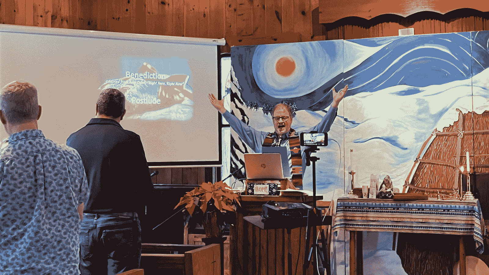
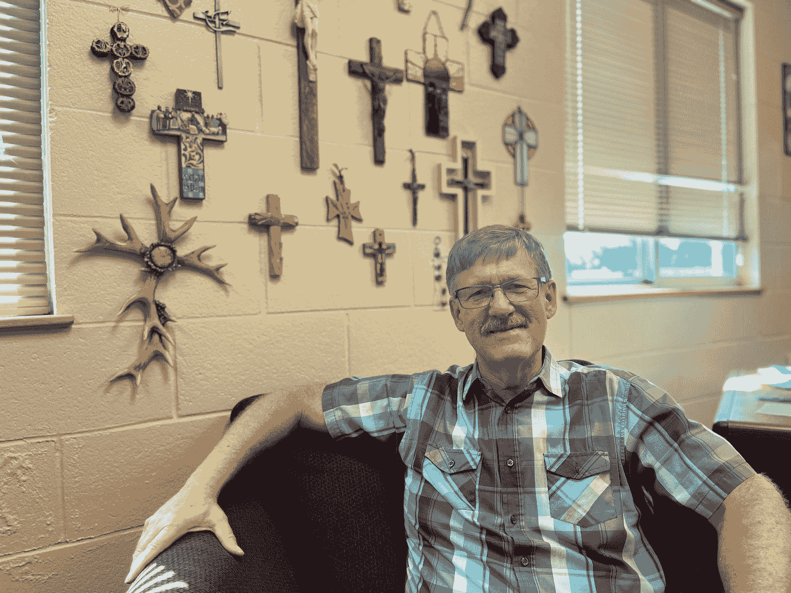

<!--yml
category: 未分类
date: 2024-05-27 14:31:15
-->

# Churches are plugging into solar power | Grist

> 来源：[https://grist.org/buildings/more-churches-plugging-solar-power/](https://grist.org/buildings/more-churches-plugging-solar-power/)

*This coverage is made possible through a partnership with Grist and Interlochen Public Radio in Northern Michigan.*

On a Sunday morning in Charlevoix, a small town surrounded by lakes in northern Michigan, people gathered in the Greensky Hill Indian United Methodist Church. The small, one-room log building is almost 200 years old and the hymns are sung in English and Anishinaabemowin.

It was December, so Pastor Johnathan Mays was leading an Advent service, one of his last, since he would soon retire. In between reflections on scripture, Mays touched on an important venture: The church was planning to install solar panels on its larger meeting hall, working with Michigan-based nonprofit [Solar Faithful](https://solarfaithful.org/) to do so.

Greensky Hill has a long history of environmental care and stewardship, grounded in Anishinaabe culture, with a majority Native congregation.

One of the ministry’s priorities is the “greening of Greensky Hill.”

Mays said that prompts them to ask “how we can use our space and our resources to address those issues for climate care, or creation care, or what some people call Earthkeeping.”

As Greensky Hill works to become more sustainable, it’s switching from propane to heat pumps to become more energy efficient. Mays said solar will allow them to use renewable energy and give that energy back to the grid. 

“The biggest issue was how can we get this huge building off of greenhouse gas creation?” he said, referring to the meeting hall, which was built in the 1990s. 

Across the country, houses of worship are pursuing solar systems.

As of 2021, about 2 percent of houses of worship in the United States have solar systems, according to [Lawrence Berkeley National Laboratory](https://emp.lbl.gov/publications/solar-pv-us-houses-worship-overview), which the University of California manages for the U.S. Department of Energy. That’s disproportionately high; houses of worship make up only 0.6 percent of all non-residential buildings.

Pastor Jonathan Mays talks to his congregation at Greensky Hill Indian United Methodist Church in Charlevoix, Michigan. The church is putting solar panels on its meeting hall next door. Grist / Izzy Ross

But these projects can be difficult to execute. Congregations can have tight budgets, older buildings, and more pressing priorities. And switching energy systems can mean a lot of bureaucratic paperwork for which they might not have the staff. 

And, because houses of worship generally don’t pay taxes, they’ve also had trouble capitalizing on renewable energy tax benefits.

One alternative has been for them to work with third parties that could benefit from the tax credits. For instance, an investor could buy and install solar panels on a church. The church would buy that power from the investor, but wouldn’t own the panels — an arrangement called a power purchase agreement.

Now, they have another option. The federal Inflation Reduction Act has made it possible for governments and tax-exempt entities, including houses of worship, to get tax credits for renewable projects. Called [direct pay](https://home.treasury.gov/news/press-releases/jy1533#:~:text=The%20Inflation%20Reduction%20Act%20allows,electric%20vehicles%20and%20charging%20stations), the program provides them with a [tax credit](https://www.whitehouse.gov/cleanenergy/directpay/) worth up to 30 percent of the installation cost. That can help cover some expenses, and advocates say it’s critical to getting more congregations to consider solar.

“I expect in the coming year, it’s really going to boom, the solar on houses of worship,” said Sarah Paulos, the programs director for Interfaith Power and Light. “It makes a lot of sense. If they can cut their utility bill way back, then they have more money to do what they’re there for, which is their mission.”

[Interfaith Power and Light](https://interfaithpowerandlight.org/about/) might sound like a local utility (or maybe a prayer group) but it’s actually a national network focused on climate action and religion, started in 1998 as a coalition of Episcopal churches that worked together to buy renewable energy. It has since expanded to other denominations and faiths.

Paulos has worked in this field for almost 20 years. She said when she started, there were a lot of climate deniers, especially in churches.

“In the beginning, people of faith were really, really being courageous and stepping out and talking about responding to climate change through renewable energy and energy efficiency as a moral call to care for creation,” she said.

While there’s [increasing](https://climatecommunication.yale.edu/visualizations-data/ycom-us/) acceptance that climate change is happening, religious Americans are still far from unified in their views.

A 2022 Pew Research Center [survey](https://www.pewresearch.org/religion/2022/11/17/how-religion-intersects-with-americans-views-on-the-environment/) found that most religious adults believed they should protect the Earth. But for a [variety of reasons](https://grist.org/culture/pew-poll-religion-and-climate-beliefs/), highly religious people tend to be less concerned about climate change than other adults in the U.S. 

One way to reach people and engage them in climate action is through tangible efforts like solar, said Leah Wiste, the executive director [of Michigan Interfaith Power and Light](https://www.miipl.org/).

“In the public conversation, I think we’ve kind of failed to see the leadership that people of faith and conscience are taking on these issues,” she said.

Local [involvement](https://grist.org/energy/how-to-sell-solar-in-coal-country/) is critical to getting more people to install solar, and non-residential buildings — such as schools or houses of worship — are part of that.

A [study](https://www.frontiersin.org/articles/10.3389/fsuep.2023.1203517/full) published last November in the journal Frontiers in Sustainable Energy Policy found that when non-residential buildings install solar, they can spur other installations in the area.

But raising awareness of solar doesn’t necessarily make it more equitable. 

The researchers say it’s unclear how effective houses of worship can be in encouraging more solar in their communities “without directly addressing low-income barriers to solar adoption,” like budget constraints and lower home ownership rates.

And houses of worship with solar are located disproportionately in “relatively wealthy, white and educated census tracts,” according to Berkeley Lab, mirroring the broader trend. 

Still, many people working at the intersection of religion and renewables say these projects are an opportunity for more people in those communities to learn about solar.

“Part of that can happen just through the simple physical act of putting a system on the roof,” said Galen Barbose, a scientist at Berkeley Lab. “But houses of worship are also in a unique position to be able to sponsor events, talk to their membership, and potentially really serve as emissaries for solar energy.” 

Rob Rafson has worked to put solar panels on churches for years. He’s the president of the solar energy company Chart House Energy. 

About a year ago, Chart House Energy teamed up with the [Climate Witness Project](https://www.crcna.org/climate-witness-project), Michigan Interfaith Power and Light, and climate activists in the Detroit area to launch Solar Faithful. 

Rafson wanted to make it easier for houses of worship to adopt solar.

“It’s been a very big challenge,” Rafson said. “Because churches — they’re nonprofits, they don’t have a budget, they don’t want to borrow money, and the size project … is too small for investors to invest in.”

Despite such challenges, congregations have managed to install panels. At the First Lutheran Church in Muskegon, a new solar array shines on the roof.

“They’re hard to see,” said Pastor Bill Uetricht. He’s walking around the church, craning his neck, trying to get a good view of the panels. “You can see that it’s on about half of that roof up there.”

Now that it has solar panels, the church needs to buy less power from utilities. That’s expected to lower the energy bill.

It’s an example of a power purchase agreement. By purchasing the solar-powered energy, First Lutheran will pay off the project cost of around $175,000 to an investor. Buying the power from their own array, they’re slowly paying back their investor. Once that’s done, the power that comes from the array is essentially free.

Pastor Bill Uetricht at First Lutheran Church in Muskegon, Michigan, said “it only makes senses” that his church would have solar panels. Grist / Izzy Ross

Uetricht said First Lutheran got involved with solar when a couple in the congregation gave the church two panels they didn’t know what to do with.

“I contacted a cousin of mine who works in alternative energy, and I said, ‘Hey, send me to someplace where I can do something with these two panels,’” Uetricht said.

They ended up working with Solar Faithful. 

Uetricht said installing solar panels is one way of fulfilling the church’s mission. He said that the world doesn’t belong to us, but that it is a gift — one that we haven’t been caring for.

“Old technologies have contributed to that lack of care,” he said. “So it only makes sense that we would be at the forefront of encouraging alternative energy sources.”

* * *