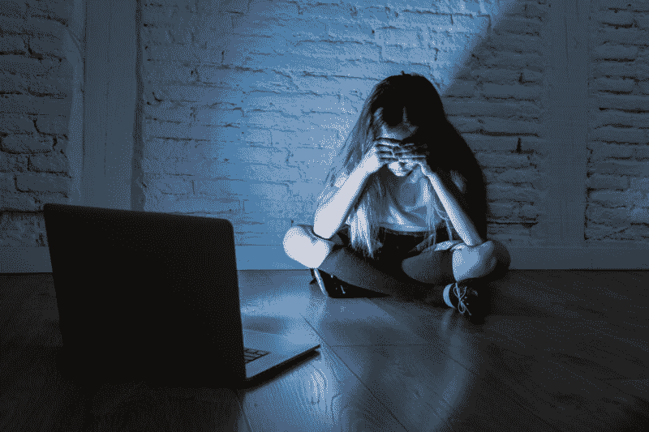

<!--yml
category: 未分类
date: 2024-05-27 14:30:53
-->

# Cops bogged down by flood of fake AI child sex images, report says | Ars Technica

> 来源：[https://arstechnica.com/tech-policy/2024/01/surge-of-fake-ai-child-sex-images-thwarts-investigations-into-real-child-abuse/](https://arstechnica.com/tech-policy/2024/01/surge-of-fake-ai-child-sex-images-thwarts-investigations-into-real-child-abuse/)

Law enforcement is continuing to warn that a "flood" of AI-generated fake child sex images is making it harder to investigate real crimes against abused children, The New York Times [reported](https://www.nytimes.com/2024/01/30/us/politics/ai-child-sex-abuse.html).

Last year, after researchers uncovered [thousands of realistic but fake AI child sex images online](https://arstechnica.com/tech-policy/2023/06/thousands-of-realistic-but-fake-ai-child-sex-images-found-online-report-says/), [every attorney general across the US quickly called on Congress](https://arstechnica.com/information-technology/2023/09/ai-generated-child-sex-imagery-has-every-us-attorney-general-calling-for-action/) to set up a committee to squash the problem. But so far, Congress has moved slowly, while only a few states have specifically banned AI-generated non-consensual intimate imagery. Meanwhile, law enforcement continues to struggle with figuring out how to confront bad actors found to be creating and sharing images that, for now, largely exist in a legal gray zone.

“Creating sexually explicit images of children through the use of artificial intelligence is a particularly heinous form of online exploitation,” Steve Grocki, the chief of the Justice Department’s child exploitation and obscenity section, told The Times. Experts [told The Washington Post](https://www.washingtonpost.com/technology/2023/06/19/artificial-intelligence-child-sex-abuse-images/) in 2023 that risks of realistic but fake images spreading included normalizing child sexual exploitation, luring more children into harm's way and making it harder for law enforcement to find actual children being harmed.

In one example, the FBI [announced](https://www.justice.gov/usao-ma/pr/american-airlines-flight-attendant-arrested-filming-minors-aircraft-lavatory) earlier this year that an American Airlines flight attendant, Estes Carter Thompson III, was arrested "for allegedly surreptitiously recording or attempting to record a minor female passenger using a lavatory aboard an aircraft." A search of Thompson's iCloud revealed "four additional instances" where Thompson allegedly recorded other minors in the lavatory, as well as "over 50 images of a 9-year-old unaccompanied minor" sleeping in her seat. While police attempted to identify these victims, they also "further alleged that hundreds of images of AI-generated child pornography" were found on Thompson's phone.

The troubling case seems to illustrate how AI-generated child sex images can be linked to real criminal activity while also showing how police investigations could be bogged down by attempts to distinguish photos of real victims from AI images that could depict real or fake children.

Robin Richards, the commander of the Los Angeles Police Department’s Internet Crimes Against Children task force, confirmed to the NYT that due to AI, "investigations are way more challenging."

And because image generators and AI models that can be trained on photos of children are widely available, "using AI to alter photos" of children online "is becoming more common," Michael Bourke—a former chief psychologist for the US Marshals Service who spent decades supporting investigations into sex offenses involving children—told the NYT. Richards said that cops don't know what to do when they find these AI-generated materials.

Currently, there aren’t many cases involving AI-generated child sex abuse materials (CSAM), The NYT reported, but experts expect that number will "grow exponentially," raising "novel and complex questions of whether existing federal and state laws are adequate to prosecute these crimes."

## Platforms struggle to monitor harmful AI images

At a Senate Judiciary Committee hearing today [grilling Big Tech CEOs over child sexual exploitation (CSE) on their platforms](https://arstechnica.com/tech-policy/2024/01/zuckerberg-says-sorry-for-meta-harming-kids-but-rejects-payments-to-families/), Linda Yaccarino—CEO of X (formerly Twitter)—warned in her opening statement that artificial intelligence is also making it harder for platforms to monitor CSE. Yaccarino suggested that industry collaboration is imperative to get ahead of the growing problem, as is providing more resources to law enforcement.

However, US law enforcement officials have indicated that platforms are also making it harder to police CSAM and CSE online. Platforms relying on AI to detect CSAM are generating "unviable reports," gumming up investigations managed by already underfunded law enforcement teams, The Guardian [reported](https://www.theguardian.com/technology/2024/jan/17/child-sexual-abuse-ai-moderator-police-meta-alphabet). And the NYT reported that other investigations are being thwarted by adding end-to-end encryption options to messaging services, which "drastically limit the number of crimes the authorities are able to track."

The NYT report noted that in 2002, the [Supreme Court struck down a law](https://www.nytimes.com/2002/04/16/national/supreme-court-strikes-down-ban-on-virtual-child-pornography.html) that had been on the books since 1996 preventing "virtual" or "computer-generated child pornography." South Carolina's attorney general, Alan Wilson, has said that AI technology available today may test that ruling, especially if minors continue to be harmed by fake AI child sex images spreading online. In the meantime, federal laws such as obscenity statutes may be used to prosecute cases, the NYT reported.

Congress has recently re-introduced some legislation to directly address AI-generated non-consensual intimate images after a wide range of images depicting [fake AI porn of pop star Taylor Swift went viral](https://arstechnica.com/tech-policy/2024/01/fake-ai-taylor-swift-images-flood-x-amid-calls-to-criminalize-deepfake-porn/) this month. That includes the [Disrupt Explicit Forged Images and Non-Consensual Edits Act](https://www.durbin.senate.gov/imo/media/doc/defiance_act_of_2024.pdf), which creates a federal civil remedy for any victims of any age who are identifiable in AI images depicting them as nude or engaged in sexually explicit conduct or sexual scenarios.

There's also the [“Preventing Deepfakes of Intimate Images Act,”](https://www.congress.gov/bill/118th-congress/house-bill/3106?s=1&r=68) which seeks to "prohibit the non-consensual disclosure of digitally altered intimate images." That was re-introduced this year after [teen boys generated AI fake nude images of female classmates](https://arstechnica.com/tech-policy/2023/11/deepfake-nudes-of-high-schoolers-spark-police-probe-in-nj/) and spread them around a New Jersey high school last fall. Francesca Mani, one of the teen victims in New Jersey, was there to help announce the proposed law, which includes penalties of up to two years' imprisonment for sharing harmful images.

"What happened to me and my classmates was not cool, and there's no way I'm just going to shrug and let it slide," Mani said. "I'm here, standing up and shouting for change, fighting for laws, so no one else has to feel as lost and powerless as I did on October 20th."