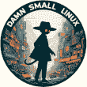

<!--yml

category: 未分类

date: 2024-05-27 14:30:48

-->

# DSL 2024 信息

> 来源：[https://www.damnsmalllinux.org/](https://www.damnsmalllinux.org/)

# Damn Small Linux 2024

****[成为我的英雄](/hero.html)****

新的 DSL 2024 已经重生为专为低端 x86 计算机量身定制的紧凑型 Linux 发行版。它将许多应用程序打包成一个小包。所有这些应用程序都因其功能性、小巧和低依赖性而被选中。DSL 2024 还具有许多基于文本的应用程序，使其在终端窗口或 TTY 中使用非常方便。

DSL 2024 目前仅配备了两个窗口管理器：Fluxbox 和 JWM。它们都非常轻量、相当直观且易于使用。

DSL 有四种基于 X 的 Web 浏览器：

+   **Firefox-esr**（扩展支持版本，完全兼容 HTML5）

+   **NetSurf GTK**（快速、内存占用少、良好的 HTML4 和 CSS 支持）

+   **Dillo**（超轻 GUI 浏览器）

+   **Links2**（文本和轻量 GUI 浏览器）

对于办公应用程序，DSL 提供以下内容：

+   **AbiWord** 文字处理器

+   **Gnumeric** 电子表格

+   **Sylpheed** 电子邮件客户端

+   **Zathura** PDF 阅读器

对于多媒体应用程序：

+   **MPV**（视频和音频）

+   **XMMS**（轻量级音频播放器）

其他应用程序：

+   **mtPaint**（图形编辑）

+   **gFTP**（FTP、SFTP 和 SCP）

+   **Leafpad**（快速编辑）

+   **zzzFM**（直接从 antiX 取出的文件管理器）

选取了三款基于 GUI 的游戏，因为它们既有趣又相对轻量。
