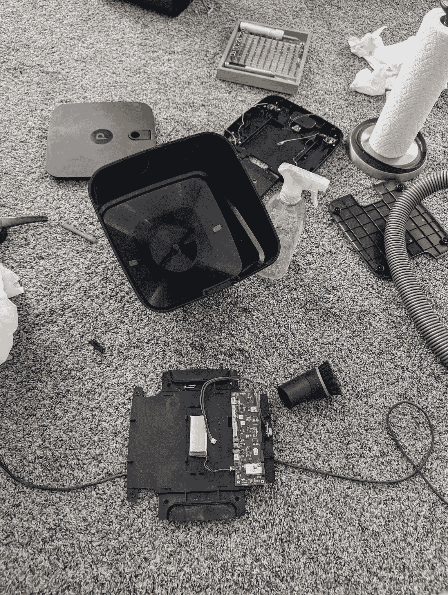
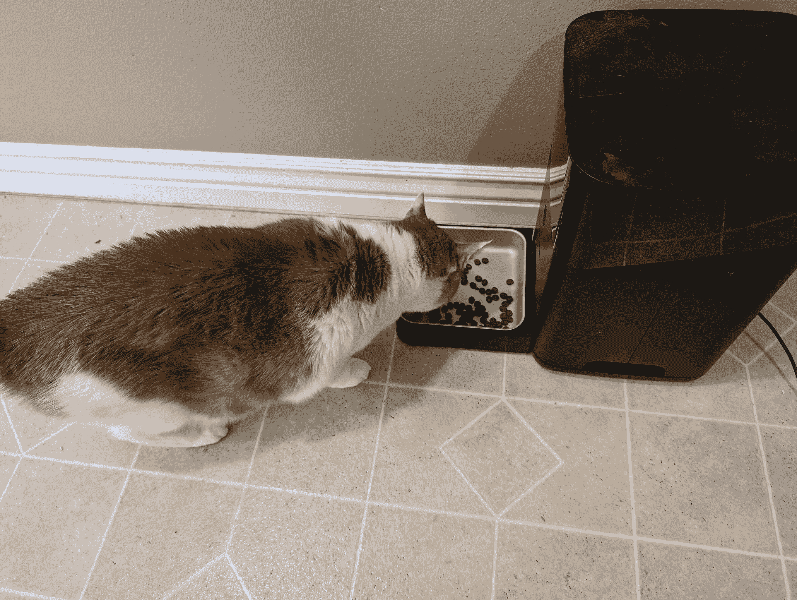

<!--yml

category: 未分类

date: 2024-05-27 14:28:36

-->

# 使用 ESP8266 修复坏掉的智能猫粮器 • pdx.su

> 来源：[https://pdx.su/blog/2024-01-19-fixing-a-broken-smart-cat-feeder-with-esp32/](https://pdx.su/blog/2024-01-19-fixing-a-broken-smart-cat-feeder-with-esp32/)

# 使用 ESP8266 修复坏掉的智能猫粮器

许多年前，我购买了一台 PetNet 智能猫粮器。这款产品评价很高，而且应用程序运行良好，没有令人讨厌的问题。它允许我设定定时器，并以相对较小的量分配食物，与竞品相比。几年来一切运作良好，但到了2020年中期，生产该产品的公司破产并关闭了他们的服务器。猫粮器继续工作一段时间，但无法配置任何设置。最终，完全停止工作。

打算“将来某个时候”修复它，我把它放在了车库里，几年来都忘了。最近，我开始调整我的 HomeAssistant 配置，建立了一个新的仪表板，并让我的妻子开始使用它，又开始惦记起这个坏掉的猫粮器。以为修复不会太难，我买了一个 ESP8266，打开了猫粮器。

猫粮器在结构上既简单又复杂。简单之处在于真正**需要**的只是在预定的时间间隔内启动电机，运行一小段时间。复杂之处在于他们在设备中添加了比实际需要的功能要多得多。这个东西上面布满了传感器；它有两个秤，据称用于测量料斗的重量和分配的食物的重量，一对红外线传感器用于检测料斗是否空，传感器监控电机的旋转和位置，可能还有其他我还没弄清楚用途的传感器。

由于传感器不是我真正需要担心的事情，我在这里所需做的就是按照固定时间间隔触发电机进行短暂运转。我还希望能够远程从手机或类似界面触发它。这在 ESPhome 中做起来相当容易。

连接设备的布线并不复杂。设备出厂时配备了一个不错的内置电源，通过 Micro-B 口上的 USB 2 运行。电机、传感器和其他所有部件通过小型 JST 连接器插入主板。我使用的 ESP8266 开发板可以通过 3.3V 或 5VDC 连接供电。为了控制电机，我使用了一个继电器，直接将其接入电源和电机。由于板载电源提供了 5V，电机额定电压也是 5V，我使用 5V 供电开发板，使用 3.3V 输出供电继电器板，并通过 GPIO 引脚触发继电器板。

ESPHome使软件方面的操作变得更加容易。将板子烧录并与我的HomeAssistant系统对话是如此轻而易举，以至于我感到惊讶。我只需将开发板插入电脑，访问ESPHome网站，通过WebSerial的力量将其烧录为ESPhome基础固件，并在我的WiFi上设置。从那时起，HomeAssistant就"看到"了这个设备并给我选择采用它的选项。整个过程只用了大约5分钟。这比一些专门的"智能家居"系统的设置和采用时间还要快！

实际上改变设备来做我需要的事情并不复杂。使用ESPHome基本元素，我设置了一个GPIO输出引脚和一个"按钮实体"来触发这个引脚一秒半钟。最后，我设置了一个定时器实体，在一天中的几个固定时间触发按钮。

当我把整个设备重新组装好后，我启动了它并向料斗里加了些猫粮。通过HomeAssistant触发按钮，我高兴地看着猫粮从分配器中倾泻而出。第二次按下按钮没有猫粮，只有电机发出嗡嗡声。经过一些试验，我最终换成了更小的猫粮颗粒，最后换了一个不同的USB电源供应。最初随猫粮机送来的那个名牌上写着5V 1A，但测试表明只有3.3V和勉强100mA。现在分配器可以快乐且稳定地触发，我们家的猫再也不会整天缠着我们要吃的了。

如果你感兴趣，你可以查看我为猫粮机编写的配置[这里](https://github.com/paradox460/HomeAssistantConfig/blob/226583d02f2ba59565dc635673aa5e8a91ca5958/esphome/esphome-web-659621.yaml)

## 更新

HackerNews的讨论促使我做了以下澄清：我使用的是ESP8266，而不是ESP32。

此外，这不是猫的主要食物来源；它每天有两碗湿食，因此干粮主要用于补充喂养和牙齿健康。

文章“使用ESP8266修复损坏的智能猫粮机”发布于<smart-time hover="" t="2024-01-19T18:28:48.118494-07:00"></smart-time>，并于<smart-time hover="" t="2024-02-03T01:19:00-07:00"></smart-time>进行了最后更新。
