<!--yml

category: 未分类

date: 2024-05-27 14:28:56

-->

# 数学如何建设现代世界 - Works in Progress

> 来源：[https://worksinprogress.co/issue/how-mathematics-built-the-modern-world/](https://worksinprogress.co/issue/how-mathematics-built-the-modern-world/)

在学校里，你可能听说过工业革命之前有科学革命，牛顿揭示了运动背后的机械法则，而伽利略了解了宇宙的真实形态。拥有这些新发现知识和科学方法的工业革命发明者创造了从手表到蒸汽机的机器，这改变了一切。

但科学真的是关键吗？工业革命中大部分重要发明并不依赖于深刻的科学理解，而其发明者也不是科学家。

标准年表忽略了过去500年中许多重要事件。广泛的贸易在整个欧洲扩展开来。艺术家开始使用透视画法，数学家学会使用导数。金融家成立了股份公司，船只航行于开放的海洋。财政强大的国家在全球范围内进行战争。

有一个贯穿所有这些进步的智力主题：测量和计算。几何计算导致了绘画、天文学、制图学、测量学和物理学的突破。数学的引入在会计、金融、财政事务、人口统计学和经济学方面带来了进步 - 一种社会数学。这一背后的‘计算范式’理念 - 即测量、计算和数学能够成功应用于几乎每一个领域 - 在欧洲通过教育的传播中蔓延开来，我们可以通过数学教科书和学校的增加来观察到。正是这种范式，而不仅仅是科学本身，推动了进步。正是这场数学革命创造了现代性。

### **几何学的创新**

几何学的进展始于重新发现欧几里德。中世纪拉丁语对欧几里德《几何原本》的最早已知翻译是由巴斯的阿德拉德在约1120年使用来自穆斯林西班牙的阿拉伯文完成的手稿。1482年出版了拉丁语印刷版。数学家塔尔塔利亚在1543年将欧几里德的作品翻译成意大利语后，很快又有其他本地语言的翻译：1558年德语，1564年法语，1570年英语，1576年西班牙语，1606年荷兰语。

在欧几里德之外，德国数学家[雷吉奥蒙塔努斯](https://en.wikipedia.org/wiki/Regiomontanus)于1464年撰写了第一本欧洲三角学教科书《各种三角形》(*De Triangulis Omnimodis*)。在16世纪，[弗朗索瓦·维埃特](https://en.wikipedia.org/wiki/Fran%C3%A7ois_Vi%C3%A8te)帮助用现代符号表示未知变量（如x、y和z）替代了代数的口头方法。勒内·笛卡尔和皮埃尔·德·费尔马进一步发展了维埃特的创新，发展出[解析几何学](https://en.wikipedia.org/wiki/Analytic_geometry)，其中曲线和曲面用代数方程描述。在17世纪末，艾萨克·牛顿和戈特弗里德·莱布尼茨将解析几何学的方法扩展到运动和变化的研究中，开发了微积分。

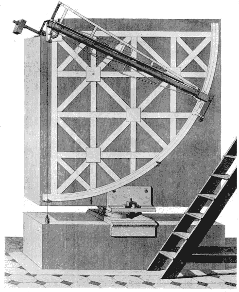

1775年由约翰·伯德设计并在曼海姆天文台使用的壁画象限仪。

除了对数学的理论改进外，将这些理论应用于世界的仪器也有了显著进步。一个显著的例子来自角度测量，随着天文学家开始使用新仪器（如上图中的壁画象限仪），测量精度大幅提高。角度测量通过将仪器对准物体并在测量刻度上读取它们的角度来工作。望远镜视具和精细调节机制提高了指向精度，而更好设计的测量刻度使天文学家能够区分相似的角度。下图显示了精度的趋势，从1550年的七弧分（0.11度）到1850年的0.06角秒（0.000017度），这是三个世纪几乎提高了近7000倍的惊人进步。

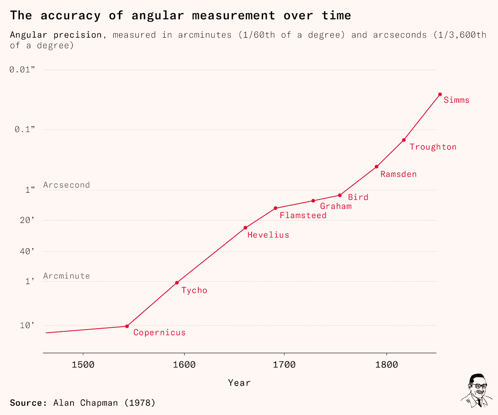

计算得益于印度阿拉伯数字的采用和[十进制记数法的普及](https://en.wikipedia.org/wiki/De_Thiende)。1614年，[约翰·纳皮尔引入对数](https://www.maa.org/press/periodicals/convergence/logarithms-the-early-history-of-a-familiar-function-john-napier-introduces-logarithms)，将乘法转化为加法，十年后发明了[滑尺](https://en.wikipedia.org/wiki/Slide_rule)，能高效地进行乘除运算（见下图）。这一时代还见证了印刷数学表的引入。这些表记录了标准数学函数的值，是在电子计算器出现之前进行计算的关键。构建这些表涉及使用已知关系如三角恒等式，从旧值计算新的函数值。虽然理论上简单，表的构建却需要大量计算。著名的1596年三角表*Opus Palatinum de Triangulis*是一项昂贵的工程，由哈布斯堡皇帝马克西米连二世资助：其[10万个三角比例 – 精确到十位小数](https://en.wikipedia.org/wiki/Georg_Joachim_Rheticus)，数学家[雷蒂库斯和他的人类计算机团队耗时12年计算](https://inria.hal.science/inria-00543932/document)，花费超过雷蒂库斯数学教授年薪的50倍。

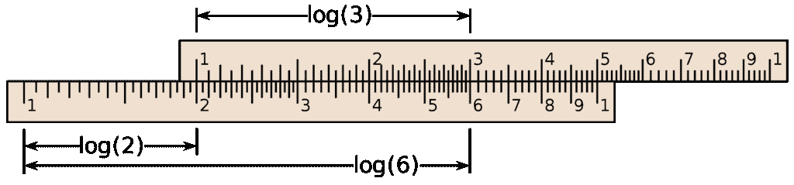

使用对数尺在滑尺上计算2 x 3，即 log(2 x 3) = log(2) + log(3)。

### **应用几何**

数学知识、仪器制造和计算的发展支持了基于数学的创新浪潮。

在15世纪，线性透视革命性地改变了绘画，使得能够在二维表面上表示三维空间成为可能。数学基础显现在莱昂·巴蒂斯塔·阿尔贝蒂1415年的开创性作品[*《绘画论》*](https://en.wikipedia.org/wiki/De_pictura)(*On Painting*)中。开篇段落宣称，该论文将“从数学家处借鉴与此主题相关的方面”。在阐述了点、线、平面和曲面的欧几里德概念后，阿尔贝蒂用几何语言解释了透视绘画的原理。

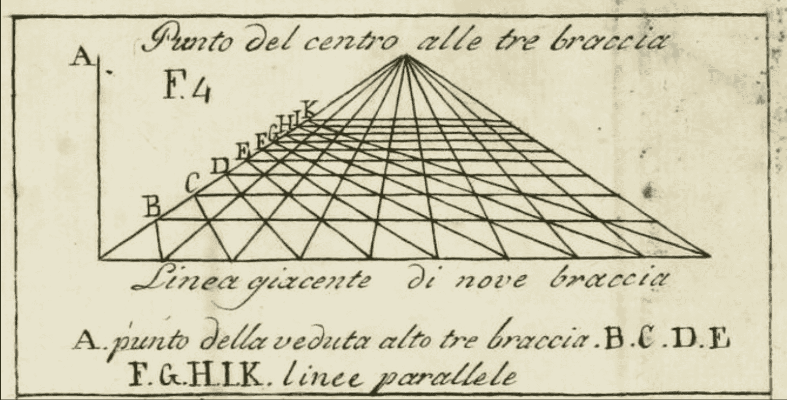

1805年版阿尔贝蒂的《绘画论》中消失点的插图。

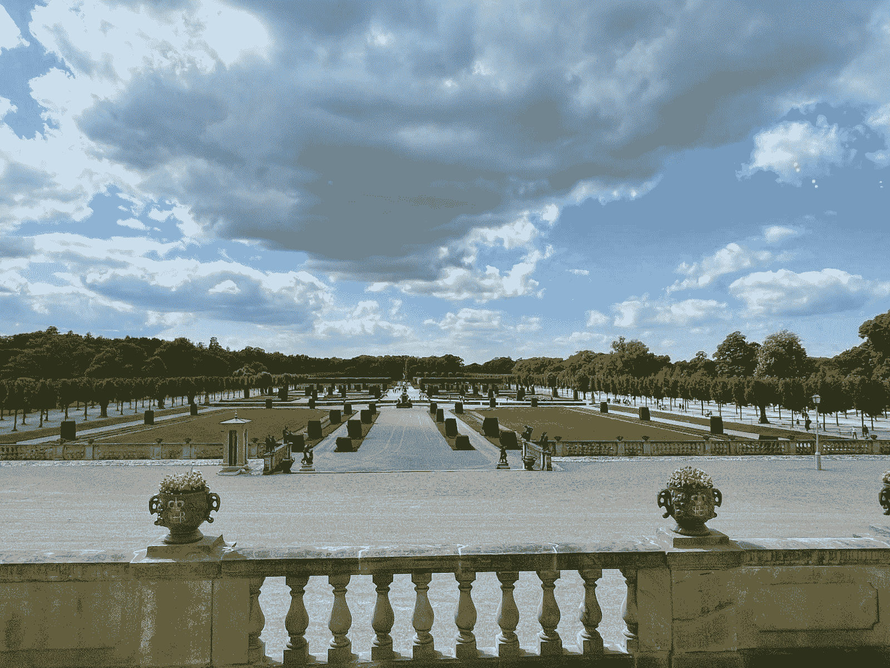

德罗廷霍尔姆城堡花园，a

[*法式花园*](https://en.wikipedia.org/wiki/French_formal_garden)

依靠透视原理来操控距离的感知

图像

作者的收藏。

测量学和制图也得到了进步。1450年，阿尔贝蒂（Alberti）编写了[*Descriptio Urbis Romae*](https://www.thefreelibrary.com/Delineation+of+the+City+of+Rome+(Descriptio+urbis+Romae.-a0255243690)（罗马城的描述），其中包括了罗马重要地点的坐标表，以及关于[土地测量](https://en.wikipedia.org/wiki/Surveying)的指导，即测量地理位置、距离和面积。

随后的几个世纪见证了进一步的改进。一个关键进展是三角测量的发展。下图说明了其基本思想：如果你有点A和点B，并测量到C点的角度ɑ和β，这将唯一确定C点的位置。此外，如果已知A和B之间的距离，该方法还可以提供从A和B到C点的距离。三角测量很吸引人，因为它用廉价的角度测量代替了昂贵的距离测量。1533年，数学家杰玛·弗里西乌斯（Gemma Frisius）解释了三角测量如何用于制图，该方法迅速在欧洲传播开来。1578年，天文学家第谷·布拉赫（Tycho Brahe）[利用三角测量绘制了其位于的赫文岛](https://ncgeo.nl/downloads/14Haasbroek.pdf)，并在本世纪末的许多教科书中描述了这种方法。

概念的力量可以通过使用三角测量网络进一步放大，其中三角化的点用于进一步的三角测量（见下图）。通过足够精确的角度测量，这种网络的精度和范围是没有限制的。1615年，荷兰数学家[威尔布罗德·斯内利](https://en.wikipedia.org/wiki/Willebrord_Snellius#Triangulation)利用教堂尖顶为基础建立了一个三角测量网络，用于确定14个荷兰城市之间的距离；到了18世纪中叶，[法国大地测量任务](https://www.nature.com/articles/476149a)（试图测量地球形状）利用三角测量网络和精密仪器，确认了地球在赤道处隆起，表明在北极圈，每纬度一度为111.9公里，而在赤道，为110.5公里。三角测量网络成为地图制作的基础，直到全球定位系统的出现。

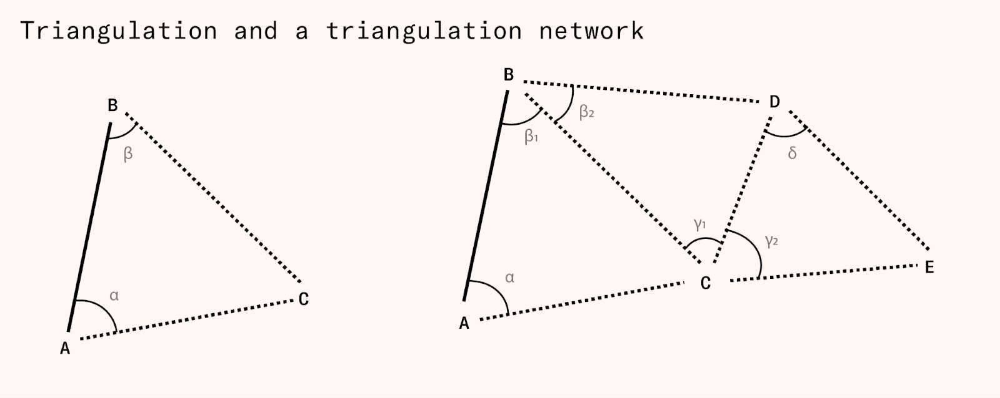

数学还塑造了文艺复兴时期的战争。为了对抗新炮兵的威力，防御工事的几何形态变得更加复杂，引入了星形堡垒，即所谓的*意大利式轨迹*。星形堡垒是复杂形状的低矮要塞，周围环绕着护墙和尖顶翻腾（外凸的三角形墙），阻止直接对墙壁进行火炮射击。它们的三角形堡垒可以偏转炮弹，并允许防御者对试图攀登城墙的攻击者进行横向射击。为了建造它们，[要塞建筑成为了应用数学的领域](https://www.jstor.org/stable/3101334)，因为准确的几何设计对于结合保护免受敌方火炮火力和为防御者提供良好视线至关重要。

与此同时，弹道学作为炮兵的数学研究出现了。1537年，欧几里得的翻译家塔尔塔利亚（Tartaglia）出版了第一部专著[*Nova Scientia*](https://www.maa.org/press/periodicals/convergence/mathematical-treasures-nicolo-tartaglias-nova-scientia)（*新科学*）。该书提出了一个初步的抛物线运动理论，阐述了为什么45度角可以使火炮的射程最大化的论据，并提供了关于炮手可以用来测量距离和校准火炮仰角的仪器的指导。封面展示了塔尔塔利亚在围墙花园中向七位缪斯展示轨迹新科学的场景，而欧几里得则守护着入口。

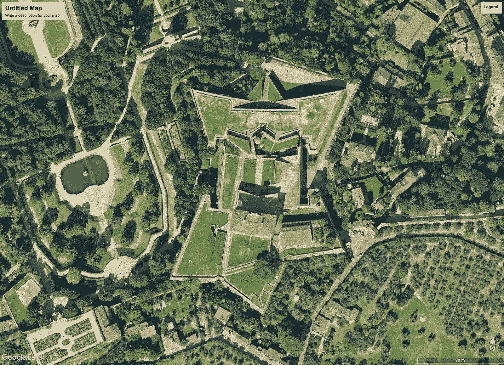

图片

来自谷歌地球的图片。

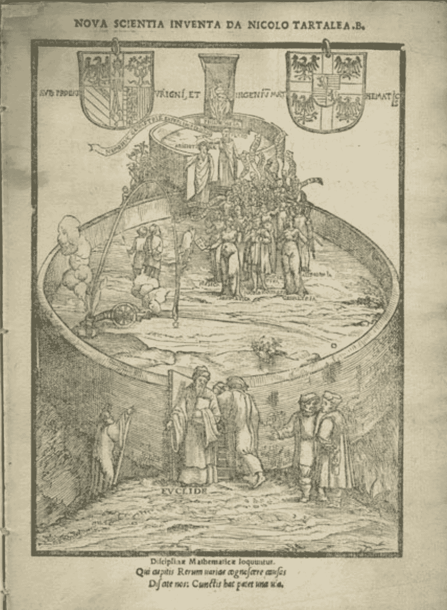

图片

塔尔塔利亚的 *Nova Scientia* 封面，欧几里得守卫着进入这门新科学的入口。

现代天文学也深深扎根于几何学之中。托勒密、哥白尼、布拉希和开普勒的竞争性天文模型对角度测量有着不同的影响，因此几何论证成为天文学辩论的关键。

数学家雷吉奥蒙塔努斯展示了如何利用基础几何学确定天体距离的方法。关键思想在于，无论你相信地球是否围绕其轴自转或天体是否围绕地球自转，旋转都是围绕地球的*中心*而不是其*表面*，观察者位于表面。由此得出的结论是，近处的物体在天空中的移动速度比远处的物体快。下图显示了观察者在旋转体边缘时如何感知近处和远处的物体：当观察者旋转时，近处的红点似乎比远处的黑点更快地移动。第谷·布拉赫就是以此推理来争论说，1572年的超新星和1577年的彗星必定位于月球之外，因为它们相对于遥远的恒星移动要少得多。这对天文学的辩论至关重要，挑战了亚里士多德学派的观点，即只有亚月球球体看到变化，而天空是不变的。

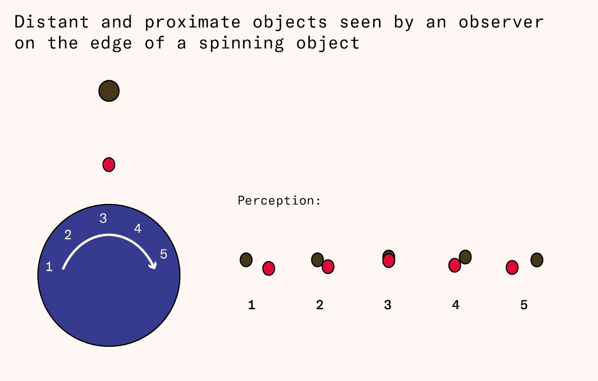

后来，托勒密的地心模型受到了伽利略·伽利莱的最后一击。[依靠他的数学知识和工程经验](https://biblio.ugent.be/publication/521984/file/1873759)，伽利略改进了最近发明的望远镜的放大倍数，并用它发现金星有像月亮一样的相位。根据托勒密模型，金星总是位于地球和太阳之间，因此“满金星”是不可能的，因为这只有在金星从地球的视角看来位于太阳之外时才可能发生。伽利略能够证明金星的影子与该行星围绕太阳而非地球运转是一致的。

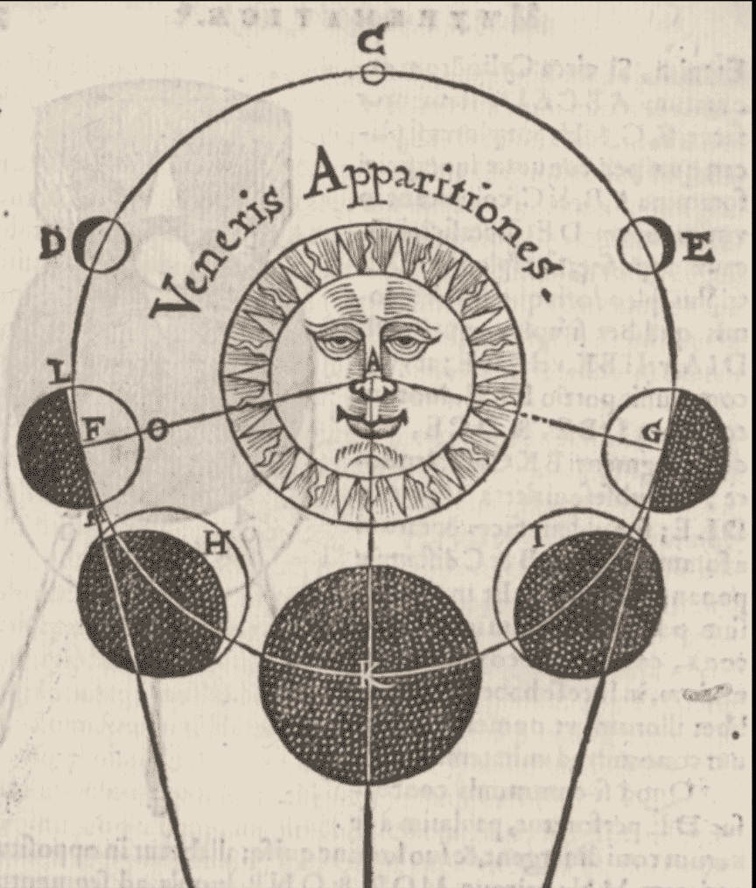

如何解释金星的相位是它围绕太阳运行的（*数学研究*，1614年）。

天文模型通过支持预测特定未来日期和时间的天体位置的年历，为导航做出了贡献。如果水手知道不同纬度和不同年份日期时天体在地平线上的高度，他们可以通过测量角度并在年历中查找相关日期来确定纬度。这促进了[开放海上导航](https://press.uchicago.edu/books/HOC/HOC_V3_Pt1/HOC_VOLUME3_Part1_chapter20.pdf)，因为知道目的地的纬度的水手可以向北或向南航行，直到太阳或其他天体在天空中的位置表明他们已到达所需的纬度，然后沿着它航行。这使他们不必沿着海岸航行。拥有正确的纬度的重要性在[1707年](https://en.wikipedia.org/wiki/Scilly_naval_disaster_of_1707)得到了充分证明，当时超过1,400名英国水手因四艘英国战舰在康沃尔郡斯西里群岛撞击时错判了24到36海里的纬度而淹死（这不仅仅是经度错误，正如通常所认为的那样）。

数学创新是当时最伟大成就的核心：现代科学。在他的[《科学的发明》](https://www.amazon.com/Invention-Science-History-Scientific-Revolution/dp/0061759538)中，历史学家大卫·伍顿展示了绘画、制图、测量、弹道学、天文学和导航的创新如何为十七世纪的科学革命铺平了道路。一个个体的社区通过开发世界的数学模型并将其与新仪器的越来越精确的测量结果对比，积累了经验。在天文学中，这一过程最终推翻了地心说模型。类似的过程在力学中展开，伽利略结合仪器制造、测量和数学，为我们现代对运动的理解奠定了基础。当伽利略声称宇宙是一本用数学语言编写的书时，他表达了现代物理科学的中心假设。用伍顿的话来说，“科学革命首先是数学家们的革命”。

### **社会生活的数学化**

社会数学的开端是随着阿拉伯代数引入欧洲而来的。一个重要的里程碑是[《算盘》](https://en.wikipedia.org/wiki/Liber_Abaci)，由比萨的莱昂纳多，即斐波那契在1202年出版。借助商业和日常生活的例子，《算盘》介绍了印度阿拉伯数字和基本代数，展示了如何使用这些工具进行标准算术计算并解决业务问题，如利润分配。斐波那契并非欧洲第一个使用阿拉伯数字的人，但他[具有影响力](https://www.amazon.com/Man-Numbers-Fibonaccis-Arithmetic-Revolution/dp/0802779085)。他还引入了[净现值](https://www.nber.org/papers/w10352)，通过按利率贴现未来收入，将时间段内的支付流转换为单一价值。

这些理论基础导致了社会数学的创新。早期的例子是复式记账，即将财务交易记录在单独的借方和贷方账户中。最早的已知例子[可追溯至1299年](https://en.wikipedia.org/wiki/History_of_accounting)，但在数学家卢卡·帕乔利（Luca Pacioli）印刷书籍[《算术、几何、比例与比例论》](https://en.wikipedia.org/wiki/Summa_de_arithmetica)（1494）出版后，它在整个欧洲得到广泛传播。通过两次记录所有交易，复式记账减少了错误的可能性，并允许公司追踪其财务状况的变化到基础流。

双向记账法在意大利的私人商人中传播开来，并且与利率数学的改进一起，支持了私人金融机构的兴起。像富格家族和美第奇家族的银行帝国[依赖于此](https://journals.sagepub.com/doi/pdf/10.1177/1032373219848146?casa_token=FQn0guJ-b8AAAAAA:LyzXWVd0czK0BOTBswOcJQ3apoTELCCCJ2VXSvT0ajESCTx-Di15Wviu9d5DV6Xi1PUN2F7wr2Yd)来管理其庞大的业务活动和资本结构，并且良好的会计支持了借贷机构，使其更容易[监督借款人](https://www.amazon.com/Reckoning-Financial-Accountability-Rise-Nations/dp/0465031528/ref=sr_1_2?crid=3UGP2T9SF6HAJ&keywords=jacob+soll&qid=1685638284&s=books&sprefix=jacob+soll%2Cstripbooks%2C151&sr=1-2)。

时代还见证了国家财政实践的改进。主要动机是战争的不断发展需求。在早现代时期，中世纪的效忠封臣被主要由专业雇佣军组成的军队所取代。现金成为战场的语言，良好的财务管理成为国家生存的必备条件。

在十五世纪末，哈布斯堡王朝发展了[宫廷金库（Hofkammer）](https://de.wikipedia.org/wiki/Hofkammer_(Habsburgermonarchie))，或称法院金库，国家财政模式，一个集中管理单位跟踪收入、支出和信用流动。Hofkammer方法在十六世纪传播到德国各地，并与[fiscal capacity（财政能力）](http://hdl.handle.net/10419/208072)的增加联系在一起——即国家通过税收或借贷能够筹集多少资金。宫廷金库的会计理念可以在1568年的[指导手册](https://epub.ub.uni-muenchen.de/17508/1/Hengerer_Hofbuchhaltung.pdf)中看到，其指出法院总账簿应“按不同的分类和段落设置有序账簿，并且必须保持这种秩序性”。

个体改革者的生活表明，公共会计的创新从私营部门扩散开来。[托马斯·克伦威尔](https://en.wikipedia.org/wiki/Thomas_Cromwell)在意大利的一家银行公司工作后返回英格兰，从个人化封建制度向现代国家官僚制度重构了皇家财政管理，即所谓的[Tudor政府革命](https://www.amazon.com/Tudor-Revolution-Government-Administrative-Changes/dp/0521092353)。在荷兰，博学多才的[西蒙·斯蒂文](https://en.wikipedia.org/wiki/Simon_Stevin)在一家商业公司工作，并出版了第一张利率计算表，在成为荷兰州长莫里斯·奥兰治的主要顾问之前。 （斯蒂文也是一位会计理论家，于1607年发表了政府会计的第一次分析。）在法国，[让-巴普蒂斯特·科尔伯](https://fr.wikipedia.org/wiki/Jean-Baptiste_Colbert)出生于显赫商人家庭，但后来进入政府，并负责在17世纪末改革法国的财政管理。

除了利率计算和私人及公共会计的创新外，早期现代时代还见证了金融市场的发展，尤其是政府债务市场。在这方面，意大利城邦是重要的创新者。在紧急情况下，通过强制富裕市民贷款来筹集资金。尽管是强制性的，这些贷款支付利息，因此成为债权人的资产。这些债务的二级市场发展起来，使得债权人即使本金没有被国家偿还也能将其资产变现。

据估计，在十五世纪的某一年，[意大利债务的百分之五被交易](https://www.amazon.com/Origins-Value-Financial-Innovations-Created/dp/0195175719)。私人金融家和他们的公共对应物的日益复杂化支持了金融创新：[瑞典](https://doi.org/10.1007/978-0-230-80255-1)通过抵押其铜矿收入融资，以提升其大国地位，并且为了增加债务的吸引力，英格兰创立了[英格兰银行](https://en.wikipedia.org/wiki/Bank_of_England#History)作为一个拥有特权如发行纸币的独立实体。

最后，早期现代时代见证了量化社会科学的诞生。在1650年代为克伦威尔军队调查爱尔兰后，英国人威廉·佩蒂（William Petty）倡导了一门名为“[政治算术](https://en.wikisource.org/wiki/Political_Arithmetick_(1899))”的新科学，旨在在涉及税收、支出、贸易和货币问题的事务中追求数量精确度。另一位英国人约翰·格朗特（John Graunt）由于其在《[关于死亡账单的自然与政治观察](https://wellcomecollection.org/works/jt43sbkc)》中对死亡率的分析而被视为人口统计学的创始人。随后，寿命表和新的概率理论被结合起来，支持新兴的人寿保险业中的定价，荷兰人约翰·德维特（Johan de Witt）的《[寿命年金与赎回债券的价值比较](https://www.york.ac.uk/depts/maths/histstat/dewitt.pdf)》（1671年）被认为是将概率理论应用于金融的最早例子之一。在这些进展的基础上，18至19世纪见证了现代学科如经济学、流行病学、人口统计学和精算学的演变。

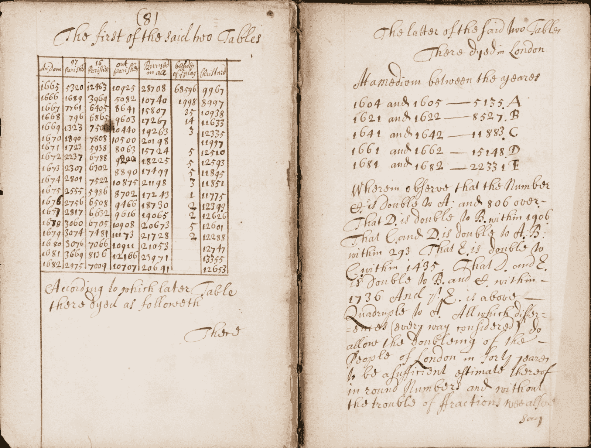

图像

根据威廉·佩蒂（William Petty）在1682年著作的《政治算术另一篇论文》（*Another Essay in Political Arithmetick Concerning the Growth of the City of London*）中的伦敦出生和死亡统计

### **计算范式**

我们叙述中的创新涵盖了广泛的领域，但它们有一个统一的特征：使用测量和数学计算来解决现实世界的问题。我们称之为“计算范式”。下图说明了该范式的核心。为了解决问题，首先必须将其转化为使用定量测量的数值表示。然后，这种表示经过建模和计算，得出的解决方案被应用到现实世界中。

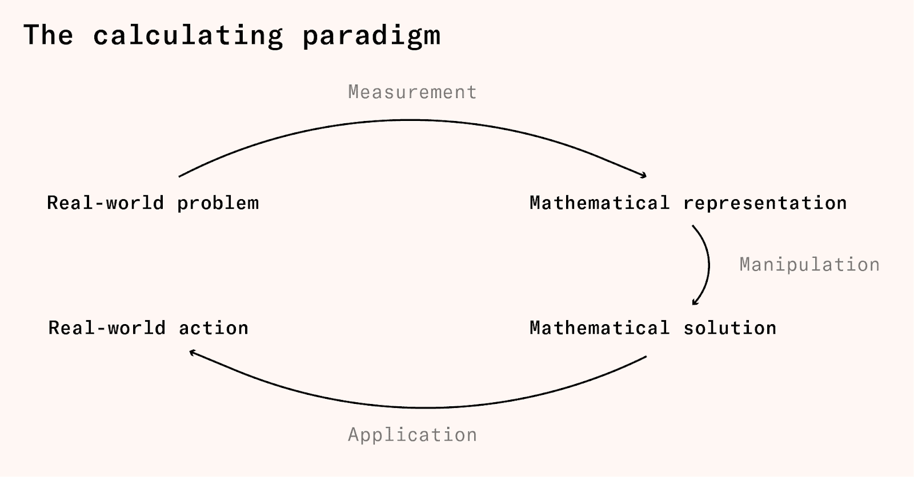

范式的第一步是测量 - 数值编码现实世界的情况。例如，当伽利略研究匀速加速时，他首先测量了球沿不同长度斜坡滚动所需的时间。同样，会计师将物理商品、资产和交易清单转换为以共同货币单位表示并分配给不同成本、收入、资产和负债账户的一组数量。在两种情况下，最终产品都是数学表达。

接下来是操作，涉及使用数学技术和模型处理表达。伽利略需要计算比例才能发现球沿斜坡滚动的时间随斜坡距离的平方根增长。会计师计算利润为总收入与成本之差，资产净值为总资产与总负债之差。在这两种情况下，最终产品是数学结果。

最后一步是应用数学结果来执行真实世界的行动。在物理学中，这可能是依赖运动定律设计时钟，或者科学决策拒绝特定的运动模型。在会计学中，这可能是基于盈利计算的投资决策，或者基于偿付能力计算的破产决策。

今天，不同类型的数学引导决策经常被视为根本不同的活动。利用数学解释自然界归属于科学；利用几何计算确定方向归属于导航；利用会计计算进行业务决策归属于财务分析。但这些做法都在如何结合定量测量和数学操作以指导行为方面共享一种基础逻辑。

### **计算范式的起源和传播**

计算范式传播的证据是什么？作为一种认知策略，计算范式接近于人类学家所称的文化特征，或文化传播的离散单位。人类学家通常通过伴随的工艺品和行为模式的传播推断文化特征的扩散，类似于我们在创新叙事中的做法。然而，原则上，文化特征的扩散也可以通过学习和模仿的过程直接观察到。虽然在实践中常常困难重重，但这种路径对于计算范式来说是可能的，因为数学几乎普遍通过学校和教科书材料来学习。

运用这一策略，欧洲计算范式的起源可以追溯到中世纪晚期阿拉伯数学的引入。其震中位于意大利北部。这里是比萨的莱昂纳多的《算盘书》在1202年出版的地方，从13世纪开始，该地区广泛采用印度阿拉伯数字及其相关的计算和问题解决方法。

计算范式的传播得到了一种新型教育机构的支持：算盘学校。这些学校为商人阶层服务，与传统的拉丁学校不同，使用当地语言授课，弃用古典研究，而推崇计算、测量和簿记等实用技能。以商业为重心，他们利用与货币兑换、劳动合同和利润分配相关的问题，教授儿童数学。

算盘学校成为了一个强大的教育力量。在文艺复兴时期的佛罗伦萨，多达三分之一的男孩参加了算盘学校 – 著名的学生包括会计学之父卢卡·帕乔利和年轻的莱昂纳多·达·芬奇。这些学校还为数学家们创造了一个市场，以教授实用数学为生，这些人被称为*maestri d’abaco*。尼科洛·塔尔塔利亚 – 早前我们认识他是欧几里德的翻译者和弹道学作家 – 就是一位算盘老师。

随着时间的推移，实用数学教育从意大利向北传播。在德国的十五世纪，所谓的[*Rechenmeisters*](https://de.wikipedia.org/wiki/Rechenmeister)在*Rechenschulen*建立了实用算术教育。到1615年，仅在人口不到[5万人的纽伦堡市](https://sedac.ciesin.columbia.edu/data/set/urbanspatial-hist-urban-pop-3700bc-ad2000)，就有48所这样的学校。这种传播得到了印刷术的支持，使数学家们通过流行的教科书触及广泛的观众。许多书籍成为经典：亚当·里斯于1522年出版的《线与羽毛的计算》经历了114版，罗伯特·里科德于1543年出版的《艺术的基础》经历了46版。

近期，历史学家拉斐尔·丹纳为研究新数学的传播编制了一个[数据库](https://brill.com/view/journals/nun/36/1/article-p5_2.xml)，其中包括了1280本使用印度-阿拉伯数字的实用算术手册。这个数据库包含了从1202年的《阿巴克斯书》出版开始到1600年的所有已知手抄本和印刷版算术手册。下图显示了这些手册在时间和空间上的累积数量，展示了新数学在十五和十六世纪初期首先集中在意大利北部，然后向外扩展的过程。

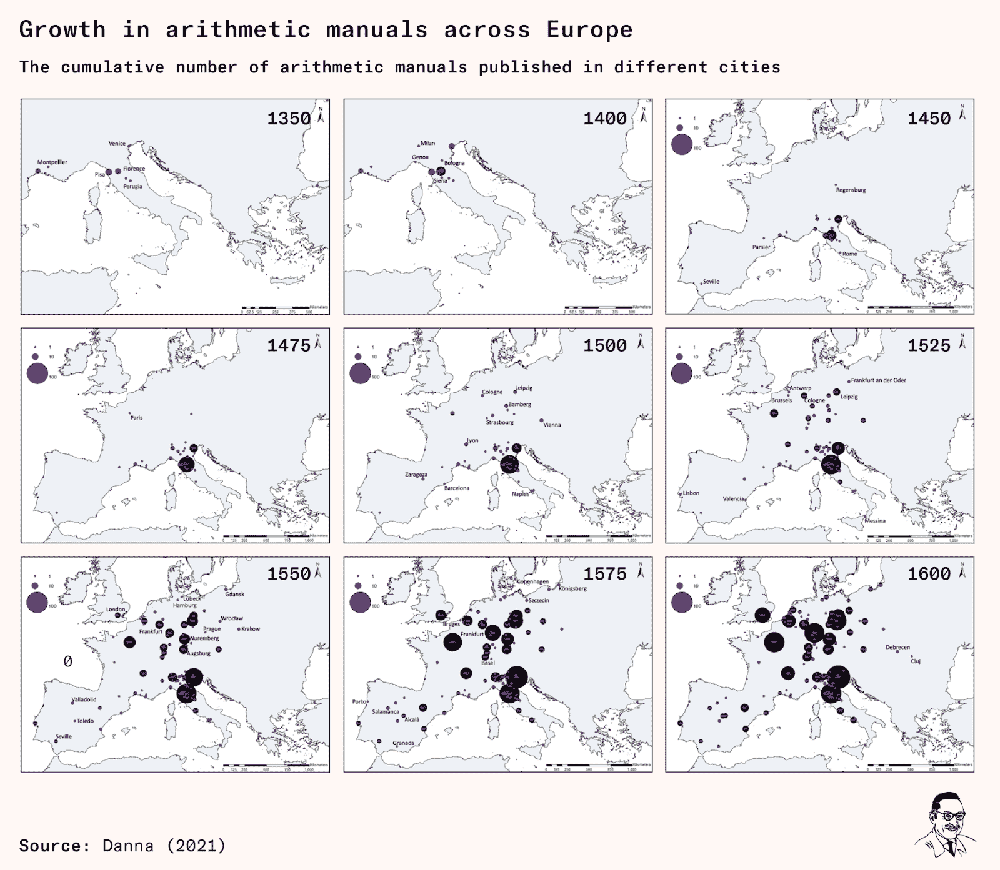

在十六世纪，新教主义也为数学技能的普及做出了贡献。[新教改革者](https://doi.org/10.1353/lut.2019.0048)强调教育的重要性，无论是在神学还是实际应用中，而由[菲利普·梅兰希顿](https://en.wikipedia.org/wiki/Johannes_St%C3%B6ffler)设计的新教教育计划中，数学被赋予了核心角色[数学在](https://www.jstor.org/stable/3653946)。法国人[彼得鲁斯·拉莫](https://en.wikipedia.org/wiki/Petrus_Ramus)于16世纪中期创立了一个旨在扩展和增强教育的计划。尽管拉莫不是数学家，但他坚信数学提供的实用技能的价值，并且这是他教育理念的核心。他的计划被称为[拉莫主义](https://en.wikipedia.org/wiki/Ramism)，在德国、荷兰、英格兰、苏格兰、瑞典和某种程度上的法国的学校中获得了短期但实质性的影响。尽管他的思想在17世纪逐渐减弱，但它们仍然在赢得英国内战的宗教异议者和殖民新英格兰中保持相关性。

在天主教欧洲，教育由耶稣会主导。该会成立于1540年，其主要目标之一是教育儿童和青年。他们的学校由捐款和来自已建立自己的城市的支付资助，他们可以通过要求他们[毕业生毕业后教授三到五年](https://doi.org/10.1163/22141332-00101002)来迅速扩展。最初，耶稣会用数学教学作为[对现有算盘学校的竞争工具和吸引地方赞助的方式](https://journals.sfu.ca/jjsc/index.php/journal/article/view/40)。但他们的主要焦点是神学和古典学习，数学的角色仍然存在争议。

当耶稣会在十六世纪末讨论他们的课程时，著名数学家克拉维乌斯，他本人也是耶稣会士，主张数学应起到核心作用，但他[面对那些希望优先考虑神学和哲学的人的反对](https://link.springer.com/article/10.1007/s11191-004-5607-8)。最终，他的计划被缩减，而在1599年的*学习计划*中，该计划将主导耶稣会教育两个世纪，数学仅在100页文件中的几段中提及，其研究被降低到七年计划的最后一年。耶稣会学校仍然培养出像勒内·笛卡尔这样的优秀数学家，但通过将数学置于漫长的古典课程的末尾，他们抑制了早期算盘学校和新教国家中拉莫计划青睐的实用算术技能的广泛传播。

传统大学对数学知识的传播产生了不同程度的影响。14和15世纪，巴黎和[维也纳](http://books.google.com/books?id=wyC9xFxpWCoC&hl=&source=gbs_api)大学在引入和发展阿拉伯数学方面做出了重要贡献，大学仍然是推动数学知识前沿的重要机构。梅兰希通教育计划为新教大学赋予了重要的数学角色，但数学仍然面临来自传统的学术课程的竞争，后者更侧重于语法、逻辑和修辞学。

在一些例外情况下，尤其是在拉米斯特计划有影响力的地区，如17世纪初的荷兰和瑞典，以及17世纪后期的苏格兰，也出现了。当数学被认定为国家战略利益时，高等教育中的数学扩展变得更加普遍。17世纪的法国工程学院就是一个早期的例子，这种做法在18世纪得到了推广，当时军事学校的兴起使数学成为课程中重要的一部分。

随着大学对计算范式的态度摇摆不定，实用数学的教学成为私人教育的肥沃土壤，因为商业、导航和仪器制造领域的职业机会促使人们愿意为数学技能付费。17世纪末，英格兰开始形成私立学院，提供如书信写作、复式记账和算术等实用技能的教学。到18世纪末，这类学院达到了200所。英格兰还有一套分离学院系统，为被排除在常规高等教育之外的非英国国教徒提供教育。分离学院通常提供比传统高等学府更注重实践的教育。

数学技能的普及可以从应用数学书籍的普及程度来定量评估。下图基于经济历史学家摩根·凯利和科尔马克·奥格拉达的研究，展示了英格兰出版的书籍数量，这些书籍涉及以下学科领域：算术、天文仪器、簿记、罗盘、几何、炮术、对数、数学、数学仪器、测量、导航、造船、测量、三角学。我们可以看到，这些学科在16世纪初的英格兰几乎不存在，但到了18世纪，每十年都有数百种出版物。

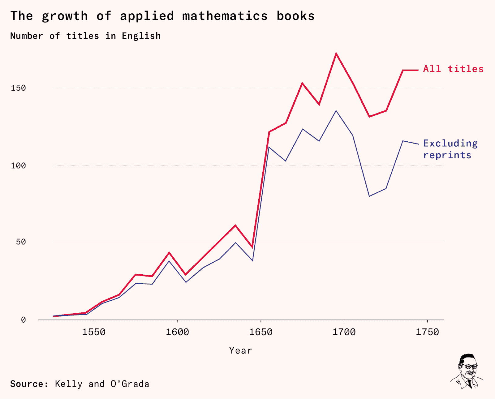

### **数学、机械艺术和工业革命**

到1750年，计算范式已经在整个欧洲传播开来。它支持了各个领域的创新，从而为现代世界铺平了道路。但经典的工业革命尚未开始，数学在机械化生产领域尚未取得广泛成功。

这种失败并非缺乏兴趣所致。自文艺复兴以来，数学家们一直梦想征服机械艺术。达·芬奇[研究了关于机械的数学论著](http://www.universalleonardo.org/work.php?id=489)，并绘制了他著名的飞行器。1588年，意大利工程师[拉梅利](https://en.wikipedia.org/wiki/Agostino_Ramelli)出版了他的机械图集，其中[八页的前言赞扬数学作为所有机械艺术的基础](https://www.science.org/doi/10.1126/science.197.4306.827)。

在工业革命之前，抱负往往超越了成就。许多达·芬奇的机器以其不可行而闻名，而拉梅利的机械书虽然流行，[从业者们仍然不以为然](https://www.jstor.org/stable/41827234?casa_token=A8u4B_6rZyoAAAAA%3AV-eCXF4JH1NvsGqlQOXRa00FYHRJSzCja2i0AvLtAasoe7vWw8WH8kvnSotrhxA78R4szERknVybL1UPlGOHR_yKm0jqZbztFaGfNaVhmzTKWOlaFipz)。工业革命之前，实践者们常将数学家视为轻佻之辈。

这种情况在1750年后发生了改变。在工业革命期间，工程师们在将生产视为数学计划的执行方面取得了显著成功。为什么18世纪的工程师们能成功而文艺复兴时期的数学家们却失败了呢？

一个重要原因是18世纪的工程师们能在生产中达到更高的精度。精度对机械化至关重要，因为它减少了摩擦并确保零件的一致行为 - 即使是小摩擦和性能变化也可能危及机器的精密工作。

更普遍地说，精度使得能够生产符合数学理想化的实际物体成为可能。工程师们可以超越在抽象中构想机器，开始生产可靠的原型。工业革命的先驱们推崇精度，随着革命的加速，对精度的要求变得越来越严格。在1770年代，詹姆斯·瓦特[自豪地宣称](https://www.amazon.com/Perfectionists-Precision-Engineers-Created-Modern/dp/0062652559)，他的蒸汽机汽缸的镗削精度达到了英寸的1/20。到了1850年代，约瑟夫·惠特沃斯的自动化机器的精度目标是英寸的1/10,000。

18世纪的英格兰以其充足的能够进行高精度工作的工匠而著称。根据Kelly和Ó Gráda收集的证据，从1700年到1800年，英格兰的钟表制造商和仪器制造商数量翻了一番。除了钟表，这些制造商还制造了用于测量、导航、簿记和天文学等数学学科的仪器。这些行业的工匠在数学和手工劳动之间架起了一座桥梁——理解产品需要数学理解，而制造它们则需要手工灵巧。工业革命开始后，这些仪器制造商被招募来制造推动革命的复杂蒸汽和织机。

工业革命的机器设计需要基本的算术和几何学：除非按照数学计划进行，否则无法追求精确度。然而，所需的数学并不复杂。一旦掌握了基本的数学并决心在实践中应用，主要挑战就是实施。

从这个角度来看，工业革命要求基本数学和量化的观点渗透到实际从事生产的人群中。这正是英国发生的情况。

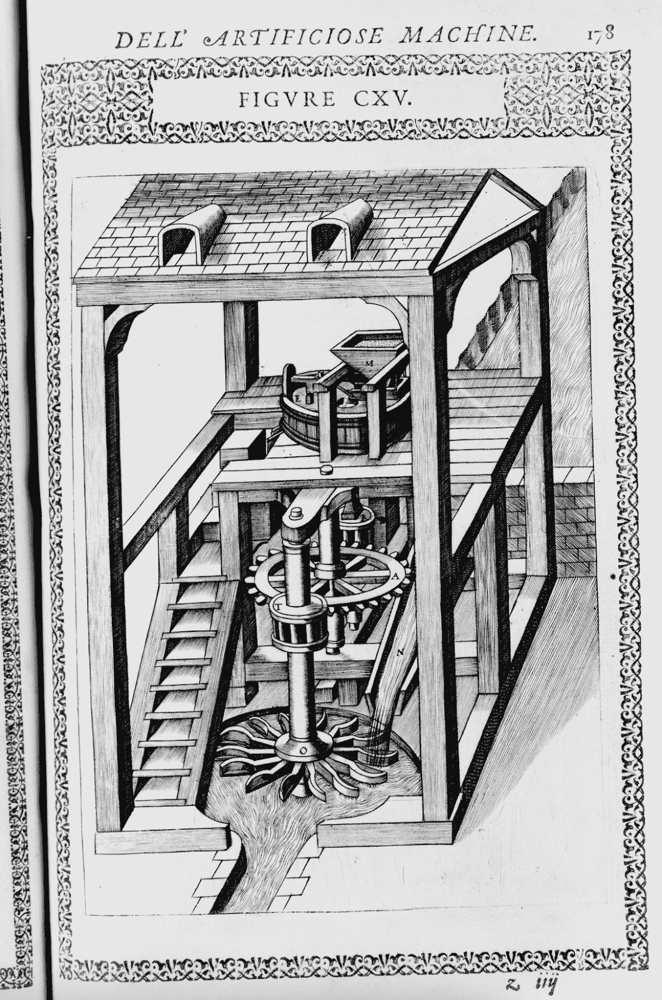

来自拉梅利的《Le Diverse et Artificiose Machine》（1588年）的水车轮。

虽然许多工业革命的先驱者只接受了一些基本的正式教育，但他们找到了获取基本数学技能的方法。有时，村庄学校短暂的教育也能提供数学训练。例如，纺纱机发明者[塞缪尔·克朗普顿](https://en.wikipedia.org/wiki/Samuel_Crompton)在很小的时候就失去了父亲，不得不从事纱线纺纱工作，但他曾在一所学校学习，那里的老师‘[以其在写作、算术、簿记、几何学、测量术和数学方面的教学而闻名](https://archive.org/details/lifeandtimessam01colegoog)’。晚间班级面向错过正规教育的人们。正是这样，‘铁路之父’[乔治·斯蒂芬森](https://en.wikipedia.org/wiki/George_Stephenson)在18岁前学会了写作和算术。著名钟表匠[约翰·哈里森](https://en.wikipedia.org/wiki/John_Harrison)也是通过蓬勃发展的教科书市场自学成才。

先驱们的生活进一步证明了数学观的存在。Joseph Bramah（1748–1814年）是一位为早期精密制造业做出贡献的锁匠。他在12岁时[辍学](https://www.heritagesilkstone.co.uk/joseph-bramah)，去父亲的农场工作，并后来在一个木匠身边做学徒。但从他的《*锁的构造初步论*》可以看出他的数学视角。该书解释了Bramah的锁如何通过现今数学家所称的[组合爆炸](https://en.wikipedia.org/wiki/Combinatorial_explosion#:~:text=In%20mathematics%2C%20a%20combinatorial%20explosion,the%20intractability%20of%20certain%20problems.)而变得几乎无法破解：即使一个锁只有12个活动部件和12个不同的位置，“它们的最终变化数量是479,001,600；如果再增加一个滑片，它们将能够接受的变化数量将变为6,227,020,800；以此类推，无限地增加其他部件。”

另一个例子是Bramah最著名的门徒[亨利·莫德斯雷](https://archive.org/details/in.ernet.dli.2015.525123/page/n13/mode/2up)，[机床生产的创始人](https://en.wikipedia.org/wiki/Henry_Maudslay)。莫德斯雷也是在12岁开始工作的，但他有着数学的视角：他以其对精确测量的不懈关注而闻名，发明了一种新型滑尺，并在个人生活中应用了一个从0到100的[度量尺度](https://archive.org/details/jamesnasengineer00nasmrich/page/x/mode/2up)。显然，量化的世界观并不需要大学水平的微积分。

### **今日计算**

我们的叙述展示了现代世界崛起与计算范式的传播如何息息相关。

自从13世纪阿拉伯语国家将这一范式引入欧洲后，它最初仅限于少数大学和意大利商业城镇。然而，这一范式在印刷术和新型教育机构的支持下逐渐在空间上扩散开来。它还跨越社会阶层，从商人和大学教授的起源逐渐扩展到行政人员、工匠、小企业主和航海者中。到18世纪末，这一范式甚至已经传到了英格兰北部Bolton的Samuel Crompton的小村庄学校。

在这一范式扩散的背景下，我们看到在早现代时期，绘画、制图学、天文学、导航、物理学、治国之术、金融学和会计学领域中出现了创新。但有一个关键的领域一直在抗拒：生产过程，长期以来数学家们未能弥合理论与实践之间的鸿沟。然而，在十八世纪英格兰，一批新型工程师和仪器制造商的出现打破了这一局面，他们将基本的数学技能与使数学理念可行化所需的工艺技能相结合。

我们的故事在1800年画上了句号，当时这一范式最终触及到了生产过程。在接下来的200年里，这一范式持续扩展，触及更多的人群和领域。自从普遍开展学校教育以来，我们已经期望所有的孩子都应该学会使用印度-阿拉伯数字进行计算。显然，我们将“基本算术”用来指代一种技能，而这种技能直到相对最近才开始在少数北意大利城镇之外广泛传授，之前只有专门的专家才能掌握。

在过去的200年里，数学的影响深入到几乎所有人类活动的领域，得到了大量数据和计算能力的大幅支持。现在我们用数学来建模核战争、为棒球队挑选球员、追踪文学变化和预测总统选举结果。有时候，似乎这一范式已经达到了极限；每一个可以从数学中受益的领域似乎都已经被引入到了数学中。但现在我们可能正在接近计算范式的最大成功之一：通过使用大型语言模型的数学来建模智能。从这个意义上说，计算范式可能正在达到其逻辑上的结论：将我们所有人都转变为数学的一部分。
