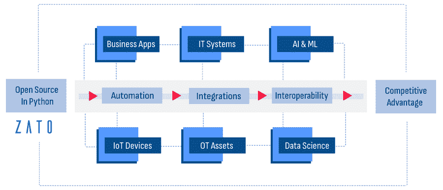
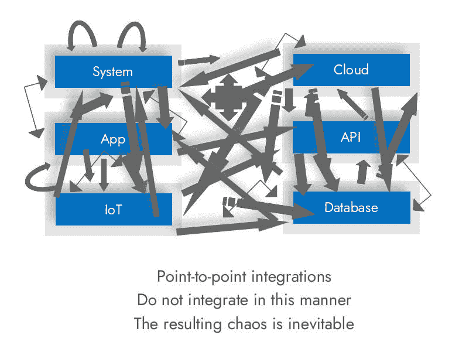
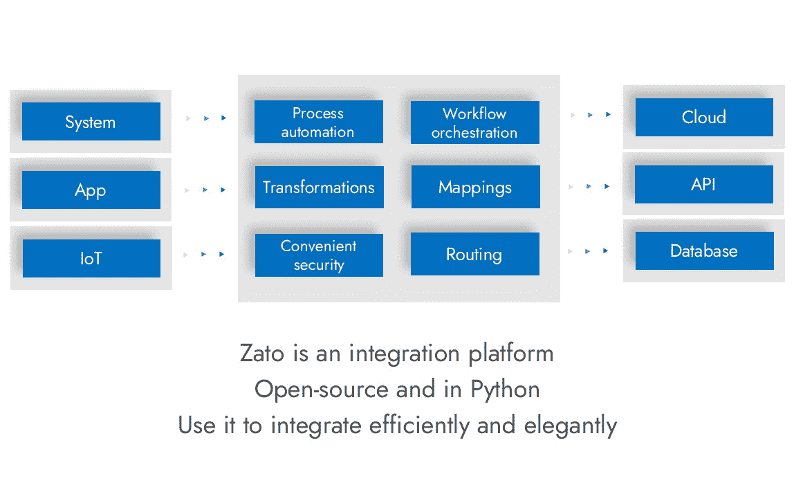
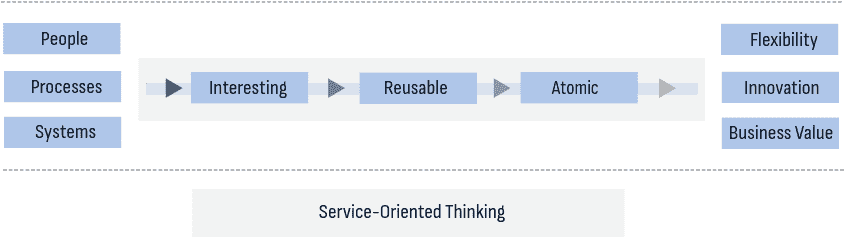

<!--yml

类别：未分类

日期：2024-05-27 14:30:52

-->

# 集成平台 | Python | Zato

> 来源：[https://zato.io/articles/integration-platform.html](https://zato.io/articles/integration-platform.html)

文章

# Python中的集成平台

**什么是集成平台**及**如何正确集成API**？为什么选择Python和开源？企业和B2B集成平台应该如何运作？**如何重新激发对工作的热情**？我们在这里讨论这些话题及其他几个话题。

作者：Dariusz Suchojad

* * *

## 什么是集成平台？

一个集成平台能够无缝地在**独立的应用程序和系统**之间进行统一且安全的**数据交换**和**流程自动化**，无论它们是**本地部署还是云上部署**，是纯虚拟的还是具有硬件组件，无论它们属于您的组织、合作伙伴还是客户。

**弥合系统之间的差距**，每个系统很可能由不同的供应商编写，**同时使您的工作愉快**，优化业务工作流程，专注于协同信息流，并帮助您高效利用组织资源，**这就是集成平台的目的**。

## 如何错误地集成API和系统？

让我们从与我们实际想要实现相反的情况开始：**如何错误地集成**？将系统直接、一对一地连接起来，是实现错误系统集成的最可靠方式。

它是否是单独的API端点或整个系统进行连接并不重要。只要是点对点的，必然的结果是：

**错误集成的显著特征。**

你是否认同其中一个或多个？

1.  您考虑连接两个或多个具体命名的系统。例如，您连接“我的一天”和“账单云”，而不考虑以更高层次的方式连接HR和账单业务功能，无论它们今天使用什么系统。

1.  您的系统直接调用彼此。如果一个系统有API，另一个系统在需要时将直接使用它，几乎没有协调、监督和治理。

1.  可能存在一层薄薄的API端点，每个端点连接两个或多个系统，但这些端点只是直接地将一个系统的数据映射到另一个系统，实质上仍然是点对点映射，只是在架构的不同位置，因此又回到了点对点集成。

1.  对业务流程逻辑的协调责任模糊不清，有时甚至未定义。在流程中交换消息时，很难追踪并知道消息根据流程的不同阶段应该如何处理。

1.  与其他系统整合的决策由特定产品的供应商决定，尽管不清楚他们是否具备整合技能，除了构建核心产品所需的技能外，以及是否掌握了你业务的整体图景。

1.  你的业务受到影响，因为系统供应商在与其他系统整合方面明显缺乏灵活性或能力，但你却无能为力，因为整合逻辑已深深嵌入到他们的产品中。

1.  你觉得由系统供应商构建新的整合最多应该花费几天时间，从构思到投入生产，但是你却等待数月甚至数年，这本来应该是一项简单工作。

1.  你尝试自动化各种业务流程，也许不止一次，但你总觉得需要更灵活的工具。

1.  你的业务人员已经学会忍受缺乏自动化。“它只是不可能的”。这种情况已经持续了多年，你希望改变它。

是的，感觉很自然地开始调用REST API。毕竟，这就是它们的用途。但如果你点对点地这样做，你正在为自己设置一个不必要复杂的路线。

点对点还有什么问题？让我们一步一步来讨论：

| 主要挑战 | 错误的点对点整合的负面影响 |
| --- | --- |
| 1\. API僵化 |

+   两个系统紧密联系，使得整合基本上是不可触及的，任何变更都必须始终进行微小协调，即使这些系统可能由不同供应商使用不同模型交付，例如一个是通用的云服务，另一个是定制的服务。

+   最终结果是最好永远不要更改API，因为这可能导致无法预见的不良连锁效应。

|

| 2\. 对人员的压力 |
| --- |

+   工作量增加 - 管理众多点对点的整合可能会使参与者不堪重负，同时使他们偏离真正重要的项目和计划。

+   压力和疲劳 - 太多整合接触点的复杂性和持续维护导致更高的压力和挫折感，降低团队士气，并导致更高的流失率。

+   培训需求 - 新团队成员需要更广泛的培训来理解点对点整合的脆弱性质。

+   缺乏职业发展机会 - 由于大量时间用于处理实际上是整合孤立的火灾，人们无法充分发挥自己的能力，这很快就开始限制他们的职业选择。

+   人才保留困难 - 最优秀的人才不会长时间留在限制创新并感到单调的地方。如果他们认为自己的技能没有得到有效利用，你会很快失去最好的人才。

|

| 3\. 可扩展性和可重复性缺乏 |
| --- |

+   紧密耦合的系统会导致复杂且难以管理的连接网络，排除了它们的可重用性，使得在架构中添加或替换元素变得不必要困难。

+   点对点集成的刚性负面影响你对市场变化或新业务需求的快速响应能力 - 如果连接系统的一部分发生更改，很难知道会有什么和为什么会出现问题。

+   如果在每个独立的点对点集成中处理相同数据的多个版本略有不同，将引入数据不一致性，使得跟踪、协调和执行企业范围的数据治理标准变得更加困难。

+   当升级集成系统的一部分导致看似远距离和不相关的依赖部分中出现不希望的后果时，维护挑战经常发生，而升级方式从未清晰表达。

|

好消息是，也有正确的方法可以做到这一切。如果你已经以点对点方式集成了许多系统，这可以被整顿。

如果你还没有开始你的集成工作，请继续阅读，了解如何避免这样混乱的结果。

现在让我们来看看如何正确地做这件事。

## 正确的集成架构

作为位于系统、应用程序和API之间的集成平台，Zato使用Python专注于业务逻辑，平台负责处理可伸缩性、可用性、通信协议、消息传递、安全性或路由，这让你只需关注系统集成的核心内容 - 确保**你的API服务有趣、可重用和原子化**。

由于平台具有以下功能，集成平台是正确架构的基本组成部分：

+   **最小化开发工作量的能力** - 你可以用更少的人员实现更多，这对于开始集成非常重要，并且在你积累了工作经验后仍然很重要。

+   **模块化、灵活性和一致性** - 像数据转换、映射、路由和安全性等常见功能只需表达一次，就可以在多个独立的业务流程中重复使用，互不影响，这样可以灵活应对新的和不断变化的业务机会和技术需求变得更加容易。

+   **可重用性导致业务的可扩展性** - 随着业务需求的增长，集成平台允许你适应新的应用程序或它们的迁移，并覆盖以前未预见或意外的业务工作流和流程。

+   **最佳实践的标准化** - 您能够创建一个高质量、可靠和高效的集成组件工具箱，可以在许多场景中统一应用，从而减少您的团队的认知负担，使**您的团队在做更少的事情时能够取得更大的成就**，而不是被例行任务所拖累，这反过来促进**创造力的文化**和持续改进，从而**吸引可能的最佳人才**。

## 集成平台用在哪里？

### 企业集成

保持记录系统及其卫星系统同步是集成平台的核心示例。例如：

+   CRM、ERP和计费系统

+   人力资源、培训和物理访问控制系统（PACS）

+   实时查看供应商库存的供应链管理

+   公共记录、政府门户和国家或地方紧急系统

+   营销和销售系统，包括合作伙伴和供应商的门户和应用程序

+   提供改进的响应时间和个性化客户互动的客户支持系统

### 云集成

基于云的系统可以比在场系统提供无与伦比的优势，随着它们的普及，集成平台的需求也随之增加，因为典型的云系统会提供一个REST API，通常带有自动生成的文档，但通常没有指导如何在架构的一部分中进一步使用它，如何使其成为整体架构的一部分。

云系统是一个你将与许多其他用户共享的系统。云供应商很少会为个别客户定制他们的API，这意味着您需要根据供应商的时间表更新集成，这可能并不总是符合您自己的升级计划，因此您需要能够以非常灵活的方式对此类变化做出反应，以便保持与集成景观的其他组件的兼容性。

### 混合集成

今天典型公司使用的是本地和云系统的混合。有些系统难以迁移到云上，有些则根本没有任何意义进行迁移，而其他系统则可以安静地工作，并且需要很少的维护，因此它们将继续使用您自己的基础设施多年。

拥有集成平台的关键好处在于它使您能够轻松地在两种模型之间切换。您可以以任一方式开始，以即插即用的方式运行您的IT基础设施，并继续使用传统和现代方法的平衡混合，具体取决于在特定情况下最实际和理想的方案。

### 物联网和硬件集成

提高运营效率，收集数据以获得有用的洞见，以及智能决策，都需要广泛的集成和自动化。

传感器、能源监控系统和库存应用程序收集实时数据，但信息需要以合理的方式分发 - 通常一个数据源将向多个目的地发送消息。

在物联网和硬件集成中的一个有趣挑战是，发送原始数据的源物理上很少有空间进行高级逻辑。它们通常是小设备，可用的计算能力很少，而集成平台则提供了如何智能路由、转换和分发消息给需要的应用程序的逻辑。

## 开源集成平台

使用开源平台的易于入门性是一个明显的好处。没有试用期，也没有与供应商的长时间讨论。只需访问[下载页面](/en/docs/3.2/admin/guide/install/index.html)，选择您喜欢的系统，即可立即开始使用平台。

开源的微妙优势只有在你深度投入产品后才变得显而易见。集成的现实是，系统可以以许多非明显的方式进行交互，而真正理解你的平台正在做什么，即能够检查其源代码，确认它是否按照你的想法工作，而不是等待几天或几周才能得到一个并不真正了解你的供应商的答复，这解锁了以前未开发的一系列可能性。

[高级企业支持](/en/services/index.html)自然是可用的，结合了开源和商业的最佳优势。

## Python API集成

Python是处理复杂集成工作的完美选择，因为它在几个关键领域下表现得非常出色：

+   它是一种非常高级的语言，其语法接近各种口语语言的语法，这使得将业务需求转化为实现变得容易。

+   它是一种稳固、主流、功能齐全的通用编程语言，而不是领域特定的语言，这意味着它在表达你的需求时提供了很大的灵活性和选择。

+   很难找到没有Python课程的大学。大多数进入职场的人都已经了解Python - 它已经成为一种新的职业语言。事实上，现在越来越难找到不愿意使用Python的新人才。

+   然而，并不需要成为开发人员或全职程序员来使用Python。大多数使用Python的人根本不是程序员，他们是其他领域的专家，也需要使用编程语言以有意义的方式自动化或集成他们的工作。

+   许多Python用户来自网络和网络安全工程的背景 - 这些领域自然需要大量使用方便且易于入门的真实语言进行自动化。

+   许多 Python 用户是具有人工智能、机器学习和数据科学背景的科学家，在其本质上要求他们从独立来源收集和整合数据的过程中应用领域特定的知识，这再次导致自动化和集成。

+   许多 Python 用户具有坚实的网络编程背景。这意味着向自动化和集成迈进需要付出少量努力。反过来，这意味着很容易找到优秀的 API 项目人才。

+   许多 Python 用户掌握多种编程语言 - 在集成项目的背景下，这非常有用，因为通常需要面对数十种技术、供应商或集成方法和技术。

+   由于语言独特的设计，Python 程序员倾向于编写易于阅读和理解的代码，从多年维护的角度来看，大多数时间人们阅读和分析代码，而不是编写代码，因此使用一种易于执行最常见任务的语言是有道理的。

+   简而言之，Python 可以被解释为可执行的伪代码，其许多用户已经具有现代自动化和集成的经验，因此从技术和战略的角度来看，Python 是简单和复杂、精密的自动化、集成和互操作性解决方案的自然选择。这也是为什么 Zato 特别设计考虑了 Python 用户。

记住，**变化是唯一不变的因素**。我们对工作的唯一假设是一切都将永久性地经历变化。

系统将被重写，人将离开，供应商将来去，而且并非所有供应商都始终友好对待你的组织，公司将合并和分裂，新的业务需求将随外部事件的反应不断出现，一切都在变动之中。

不再会出现长期停滞的情况。期待变化，做好**灵活适应**的准备，**吸引优秀人才**，不要让系统和集成僵化，当变化如期而至时，你将不会感到惊讶。

Dariusz Suchojad 是 Zato Source 的创始人。

**准备摆脱传统方法的局限？深入高效集成的世界吧。今天就申请您的定制演示。**
