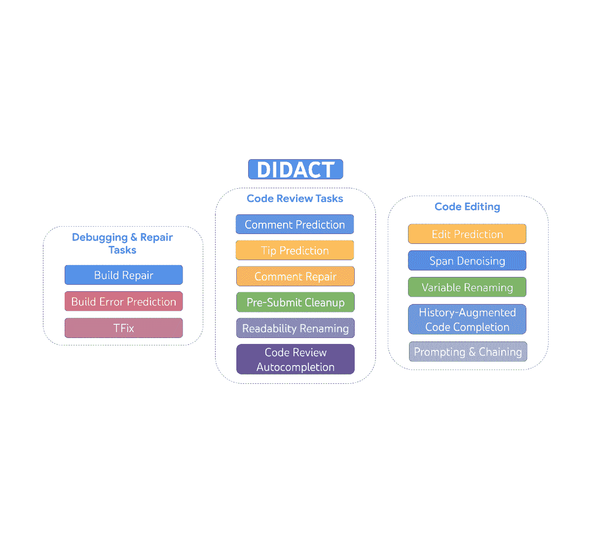
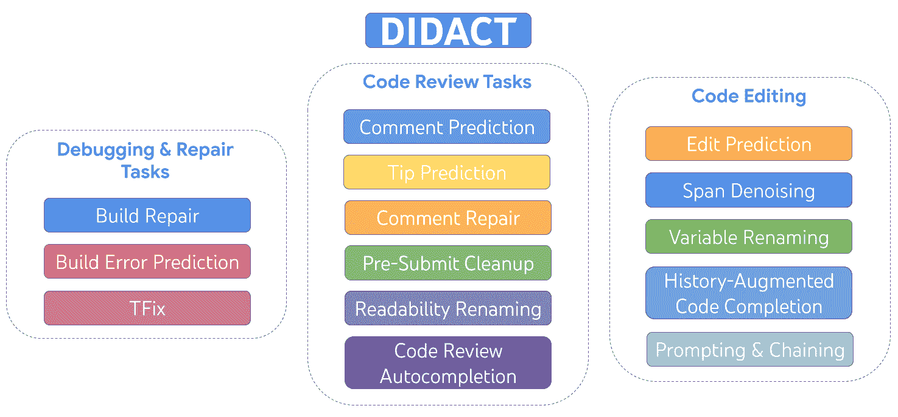
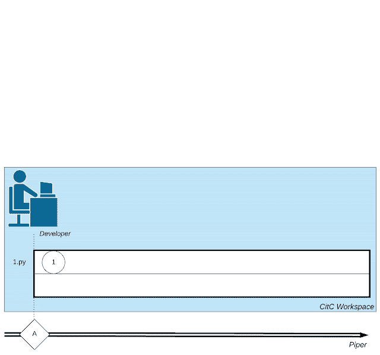
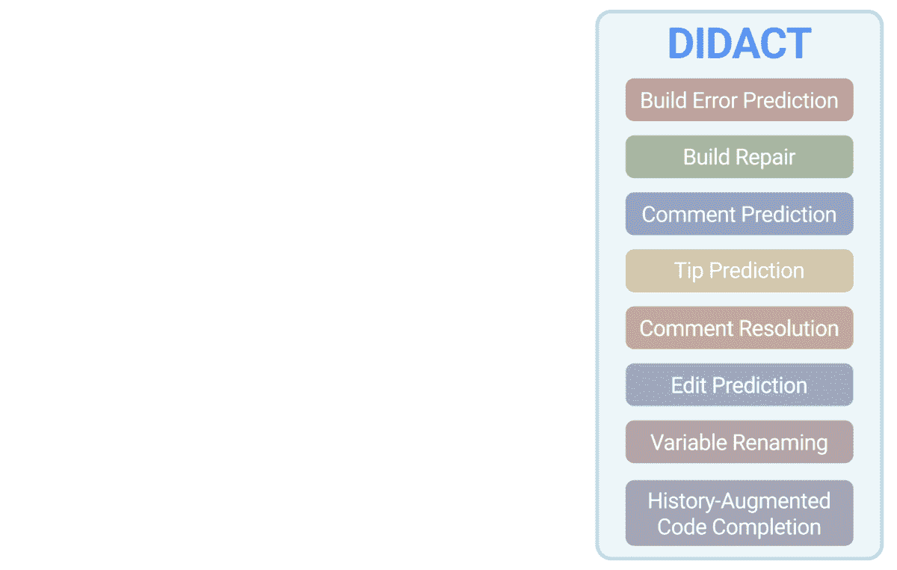
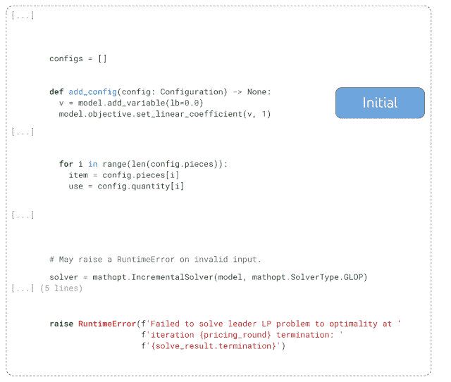
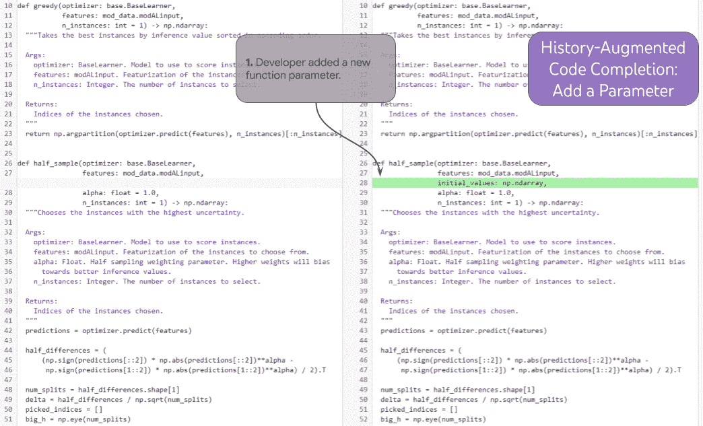
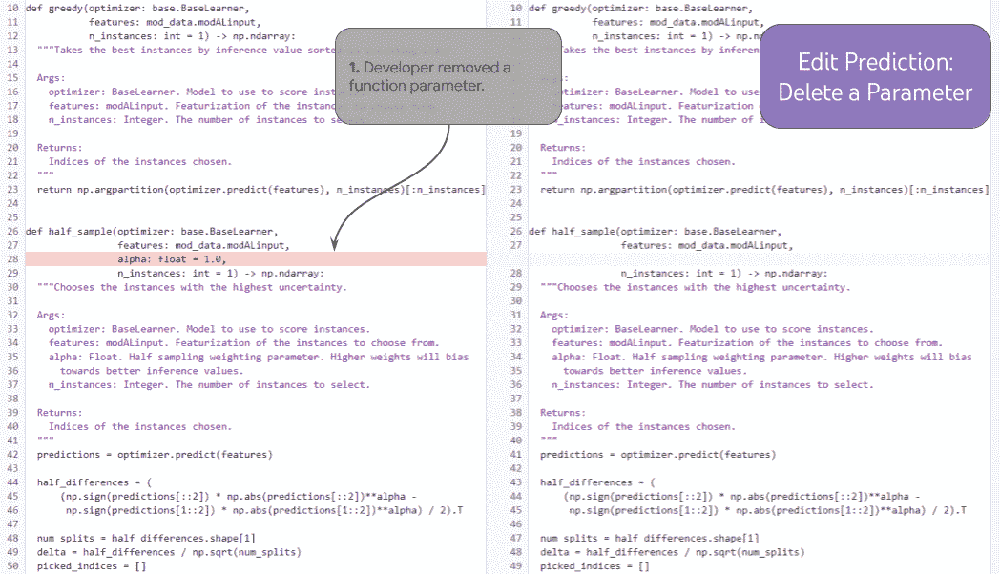

<!--yml

category: 未分类

date: 2024-05-27 14:29:04

-->

# 软件开发活动的大型序列模型

> 来源：[https://blog.research.google/2023/05/large-sequence-models-for-software.html](https://blog.research.google/2023/05/large-sequence-models-for-software.html)

由 Petros Maniatis 和 Daniel Tarlow，Google 研究科学家发布 

软件并非一蹴而就。它是逐步改进的，一点点地进行 — 编辑，运行单元测试，修复构建错误，处理代码审查，再编辑一些，安抚[linters](https://en.wikipedia.org/wiki/Lint_(software))，并修复更多错误 — 直到最终足够好以合并到代码库中。软件工程不是一个孤立的过程，而是人类开发者、代码审查者、Bug 报告者、软件架构师以及诸如编译器、单元测试、linters 和静态分析器等工具之间的对话。

今天我们描述 DIDACT（​​Dynamic Integrated Developer ACTivity），这是一个用于培训软件开发大型机器学习（ML）模型的方法。DIDACT 的新颖之处在于它使用 *软件开发的过程* 作为模型的训练数据源，而不仅仅是这个过程的 *精炼的最终状态* —— 完成的代码。通过向模型展示开发者在工作中看到的情境以及他们采取的响应行动，模型学习了软件开发的动态，并更符合开发者花费时间的方式。我们利用了 Google 软件开发的仪器化，扩展了开发活动数据的数量和多样性，超越了以往的工作。结果在两个方面非常有前景：对专业软件开发者的有用性，以及作为赋予 ML 模型一般软件开发技能基础的潜力。

|  |
| --- |
| DIDACT 是一个在开发活动上进行多任务训练的模型，包括编辑、调试、修复和代码审查。 |

我们内部构建并部署了三个 DIDACT 工具，[Comment Resolution](https://ai.googleblog.com/2023/05/resolving-code-review-comments-with-ml.html)（我们最近宣布的），Build Repair 和 Tip Prediction，每个工具集成在开发工作流程的不同阶段。这三个工具都收到了数千名内部开发者的热烈反馈。我们将此视为使用价值的最终测试：专业开发者是否利用这些工具来提高他们的生产力，这些开发者通常是代码库的专家，并且精心研发了工作流程。

或许更令人兴奋的是，我们展示了DIDACT如何成为通用开发者辅助代理的第一步。我们展示了训练模型如何通过提示开发者活动的前缀，通过链接多个预测来推出更长的活动轨迹。我们相信DIDACT为开发能够在整个软件开发过程中提供通用辅助的代理铺平了一条充满希望的道路。

## 关于软件工程过程的数据宝库

谷歌的软件工程工具链将与代码相关的每一个操作存储为工具和开发人员之间互动的日志，并且这么做已经有数十年历史。原则上，可以利用这些记录详细重现“谷歌代码库形成的软件工程视频”的关键片段，逐步进行 —— 一次代码编辑、编译、评论、变量重命名等等。

谷歌的代码存储在一个名为[单体库](https://zh.wikipedia.org/wiki/%E5%8D%95%E4%BD%93%E5%BA%93)的仓库中，这是一个包含所有工具和系统代码的单一存储库。软件开发人员通常会在由名为[云端客户端](https://cacm.acm.org/magazines/2016/7/204032-why-google-stores-billions-of-lines-of-code-in-a-single-repository/fulltext)（CitC）管理的本地[写时复制](https://zh.wikipedia.org/wiki/%E5%86%99%E6%97%B6%E5%A4%8D%E5%88%B6)工作区中尝试代码更改。当开发人员准备好将一组代码更改打包到一起以实现特定目的（例如修复错误）时，他们会在[评审](https://abseil.io/resources/swe-book/html/ch19.html)系统中创建一个变更列表（CL），谷歌的代码审查系统。与其他类型的代码审查系统一样，开发人员与同行评审者就功能和风格进行对话。随着对话的进行，开发人员编辑他们的CL以应对评审者的评论。最终，评审者宣布“LGTM！”（“看起来不错！”），CL被合并到代码仓库中。

当然，除了与代码审查者的对话外，开发人员还与其他大量软件工程工具保持着一种类似“对话”的状态，例如编译器、测试框架、静态分析器、模糊测试工具等等。

|  |
| --- |
| 展示了软件开发中涉及的复杂活动网络：开发人员的小动作、与代码审查者的互动以及诸如编译器等工具的调用。 |

## 软件工程的多任务模型

DIDACT 利用工程师和工具之间的交互来驱动机器学习模型，协助谷歌开发者建议或增强他们在追求软件工程任务时的上下文中采取的行动。为此，我们定义了一些关于个别开发者活动的任务：修复损坏的构建、预测代码审查评论、解决代码审查评论、重命名变量、编辑文件等。对于每个活动，我们使用一个通用的形式主义：它需要一些 *State*（代码文件）、一些 *Intent*（特定于活动的注释，例如代码审查评论或编译器错误），并生成一个 *Action*（执行的操作以解决任务）。这个动作类似于一个迷你编程语言，并且可以扩展到新添加的活动。它涵盖编辑、添加注释、重命名变量、标记带有错误的代码等。我们称这种语言为 *DevScript*。

|  |
| --- |
| DIDACT 模型根据任务、代码片段和相关注释进行触发，并生成开发动作，例如编辑或评论。 |

这种状态-意图-动作的形式主义使我们能够以一种通用的方式捕捉许多不同的任务。此外，DevScript 是表达复杂操作的简洁方式，无需输出整个状态（即操作后的原始代码）；这使得模型更高效、更易解释。例如，重命名可能涉及到文件中的数十个位置，但模型可以预测单个重命名动作。

## 一个机器学习的同行程序员

DIDACT 在个别辅助任务上表现出色。例如，在功能基本完成后，我们展示了 DIDACT 进行代码清理。它查看代码以及代码审查人员的一些最终评论（在动画中标有“human”），并预测编辑以解决这些评论（显示为 *diff*）。

|  |
| --- |
| 给定一个初始代码片段和代码审查员附加到该片段的评论，DIDACT 的 Pre-Submit Cleanup 任务会生成编辑（插入和删除文本），以解决这些评论。 |

DIDACT 的多模态性质也带来了一些令人惊讶的能力，让人联想到[随着规模扩展而出现的行为](https://ai.googleblog.com/2022/11/characterizing-emergent-phenomena-in.html)。其中之一是*历史增强*，可以通过提示启用。了解开发者最近做了什么可以使模型更好地猜测开发者接下来应该做什么。

|  |
| --- |
| 展示历史增强代码完成的示例。 |

展示这一能力的强大任务是*历史增强代码完成*。在下图中，开发者添加了一个新的函数参数（1），并将光标移动到文档中（2）。基于开发者编辑历史和光标位置，模型通过正确预测新参数的文档字符串条目（3）来完成这一行。

|  |
| --- |
| 在多个链式迭代中进行编辑预测的示例插图。 |

在更为强大的历史增强任务中，*编辑预测*，模型可以选择下一个编辑位置，这种方式在历史上是一致的**。** 如果开发者删除了一个函数参数（1），模型可以使用历史记录正确预测更新文档字符串（2），以去除已删除的参数（而无需开发者手动将光标放置在那里），并以语法（以及 —— 可能 —— 语义上）正确的方式更新函数语句（3）。有了历史记录，模型可以明确地决定如何正确地继续“编辑视频”。没有历史记录，模型无法确定缺失的函数参数是故意的（因为开发者正在长时间编辑过程中去除它）还是偶然的（在这种情况下，模型应该重新添加它以修复问题）。

该模型还可以进一步发展。例如，我们从一个空白文件开始，要求模型连续预测接下来的编辑，直到它写出完整的代码文件为止。令人惊讶的是，模型以一种对开发者来说自然的逐步方式开发代码：首先创建一个包含导入、标志和基本主函数的完全工作骨架。然后逐步添加新功能，如从文件中读取并写入结果，并添加根据用户提供的正则表达式过滤某些行的功能，这需要在整个文件中进行更改，如添加新标志。

## 结论

DIDACT将Google的软件开发过程转化为ML开发助手的训练演示，并利用这些演示来训练模型，以逐步交互地构建代码，与工具和代码审查人员互动。这些创新已经支持着Google开发人员每天使用的工具。DIDACT方法与Google及其他地方大型语言模型取得的重大进展相辅相成，朝着减少重复劳动、提高生产力和增强软件工程师工作质量的技术发展。

## 致谢

*这项工作是Google研究部门、Google核心系统与体验部门以及DeepMind多年合作的结果。我们要感谢我们的同事Jacob Austin、Pascal Lamblin、Pierre-Antoine Manzagol和Daniel Zheng，他们作为这个项目的主要推动者。没有Alphabet合作伙伴（Peter Choy、Henryk Michalewski、Subhodeep Moitra、Malgorzata Salawa、Vaibhav Tulsyan和Manushree Vijayvergiya）以及收集数据、识别任务、构建产品、制定战略、推广和帮助我们执行此议程的许多人（Ankur Agarwal、Paige Bailey、Marc Brockschmidt、Rodrigo Damazio Bovendorp、Satish Chandra、Savinee Dancs、**Denis Davydenko、**Matt Frazier、Alexander Frömmgen、Nimesh Ghelani、Chris Gorgolewski、Chenjie Gu、Vincent Hellendoorn、Franjo Ivančić、Marko Ivanković、Emily Johnston、Luka Kalinovcic、Lera Kharatyan、Jessica Ko、Markus Kusano、Kathy Nix、Christian Perez、Sara Qu、Marc Rasi、Marcus Revaj、Ballie Sandhu、Michael Sloan、Tom Small、Gabriela Surita、Maxim Tabachnyk、**Stephanie Tang、**David Tattersall、Sara Toth、Kevin Villela、Sara Wiltberger和Donald Duo Zhao）以及我们极具支持性的领导（Martín Abadi、Joelle Barral、Jeff Dean、Madhura Dudhgaonkar、Douglas Eck、Zoubin Ghahramani、Hugo Larochelle、Chandu Thekkath和Niranjan Tulpule）。谢谢你们！*
