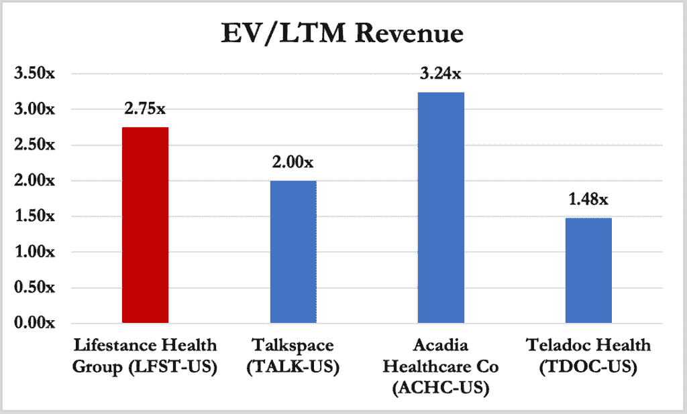
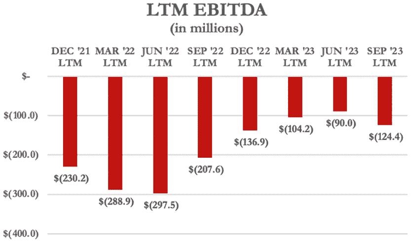
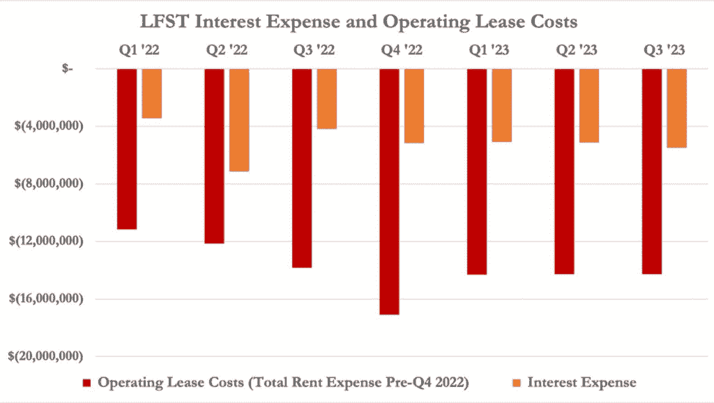
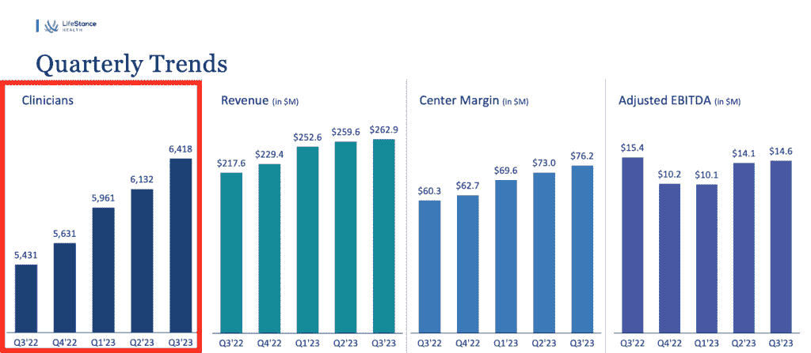
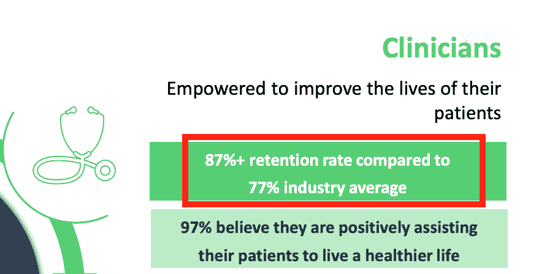
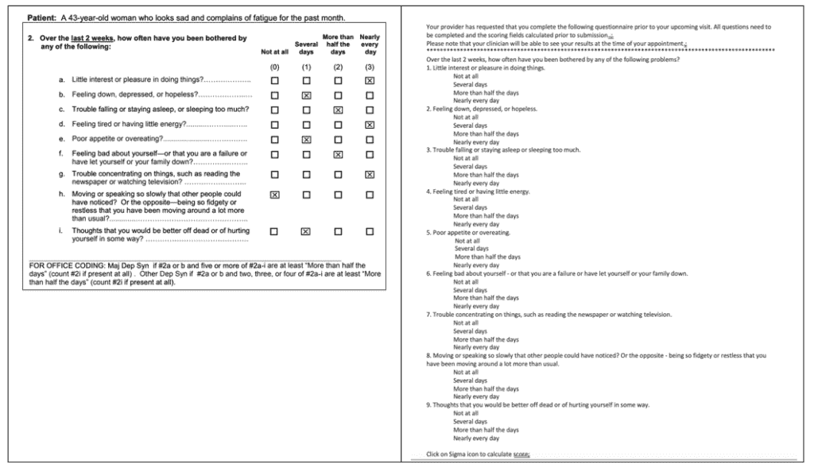
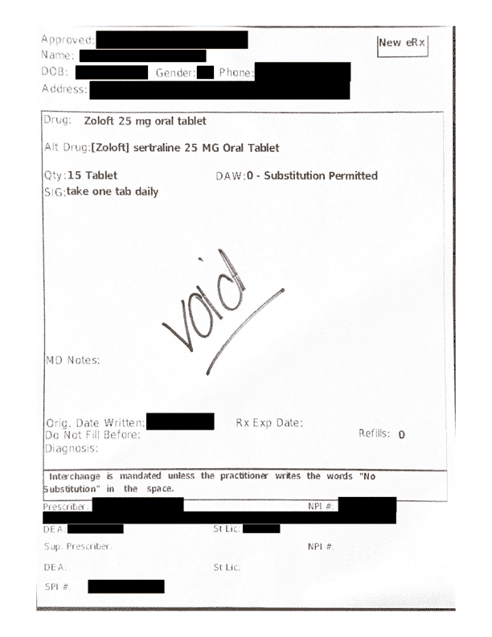

<!--yml

category: 未分类

date: 2024-05-27 14:30:38

-->

# LifeStance：私募股权支持的心理健康整合企业走向崩溃 – Hindenburg Research

> 来源：[https://hindenburgresearch.com/lifestance/](https://hindenburgresearch.com/lifestance/)

+   LifeStance（NASDAQ：LFST）是一家市值达到23亿美元的心理健康服务提供商，在美国33个州拥有6400名临床医生。该公司每年以18%的速度增长其临床医生群体，而行为健康市场预计将在2030年前以约5%的年增长率增长。

+   尽管在其最新的2023年第三季度财报中报告了以下数据：过去12个月的亏损达1.88亿美元，债务和租赁义务达4.82亿美元以及积累的7.16亿美元赤字，LifeStance在行为健康行业中以约23%的溢价交易。

+   我们评估认为，鉴于其最新的2023年第三季度财报显示其（i）仅剩4260万美元的现金余额（ii）每季度现金烧损3,370万美元和（iii）预计到2024年第一季度末将支付4200万美元以解决有关其误导IPO投资者的诉讼，LifeStance将需要立即筹集资金。

+   一位前LifeStance经理解释说，理解投资者需了解治疗和精神病学员工比例对于了解利润率和盈利潜力至关重要，但LifeStance并不定期分享这些指标。一位前员工和行业专家将治疗补偿率称为“令人羞辱地低”，并将其与“美甲或理发店工作人员的工资”进行了比较。

+   2021年，该公司披露其约66%的临床医生是治疗师，与高利润的精神病医生相比，利润率较低。2024年，我们从LifeStance网站抓取的数据显示，公司临床医生的比例恶化：约79%。

+   公司最广泛关注的公共指标之一是其雇员的保留率。在LifeStance的2021年6月IPO期间，公司声称保留了87%的临床医生（即13%的医生流失率）。

+   仅两个月后，在其首次公开财报中，LifeStance发布了几乎是分析师预期的两倍的净亏损，并报告了保留率的变化，达到了与“更广泛的医疗保健行业一致”的水平，之前这一水平被定义为77%的保留率（即23%的医生流失率）。其股价在当天下跌了46%。

+   LifeStance投资者对内部人士提起证券集体诉讼，声称其关于公司IPO临床医生保留披露的“虚假陈述”。2023年10月，LifeStance以5000万美元和解了此案。

+   在IPO惨败后，LifeStance在2022-2023年间报告或确认了7次不同的面向投资者的电话会议和会议，称其临床医生保留率已稳定在80%。

+   我们对LifeStance网站的抓取显示，在2023年8月15日至2024年1月15日期间的五个月内，公司目录中列出的供应商中大约有11.5%消失了，表明年度保留率接近72%（即28%的流失率），远低于行业平均水平，并再次低于管理层的宣称。

+   采访和诉讼指控证实了留任问题，前员工详细描述了(i) LifeStance在补偿上过度承诺 (ii) LifeStance实施了一种使临床医生负债于公司的制度 (iii) LifeStance有着毫无附加价值的破坏性企业文化以及 (iv) 在运营私人诊所中几乎没有障碍。

+   根据两起员工集体诉讼和一起雇佣诉讼，LifeStance在补偿上过度承诺。护士和治疗师声称欺骗性的就业提议和回扣导致他们在某些支付周期内的收入低于最低工资标准甚至没有收入。

+   LifeStance向预计最终能达到公司崇高补偿承诺的临床医生提供预付款。当预期未能达到时，这通常会导致沉重的债务。一位前LifeStance经理将这种情况描述为“一件糟糕的事情，欠雇主的钱”。

+   一位前被LifeStance收购的诊所所有者告诉我们，药物处方者更有可能负债，比治疗师更有可能牺牲护理质量，通过缩短预约时间来摆脱债务。

+   曾在被LifeStance收购的机构工作过的前员工描述了在公司工作是一种文化冲击，地点被管理得像是“快餐店”，“没有人真正关心这些是患者的生命”。

+   前LifeStance员工描述LifeStance在一个几乎没有准入门槛的行业中提供了零或*负*价值。根据一位前LifeStance经理的说法：“要开设自己的私人诊所，你只需要在Facebook上发布一条消息……就可以开始接待私人、仅限现金的患者。”

+   LifeStance经营受控物质和像Xanax和Adderall这样的药物，这些药物具有极大的滥用潜力，根据健康专业人士称，处方量的增长与阶段性鸦片处方相媲美。

+   尽管某些药物具有潜在成瘾性质，前LifeStance员工声称药物处方者被建议缩短咨询时间以最大化收入，一些前临床医生一天看“30位患者”。其他人将其描述为类似于“战时医学”。

+   LifeStance的首席财务官称，公司向“绩效最佳”的药物处方者提供股票授予。一位前诊所所有者告诉我们，这些授予与临床医生进行的会话次数挂钩，这种激励措施可能鼓励数量多于护理质量。

+   2023年12月，我们预约了一位 LifeStance 精神科医生，以更好地了解公司的患者入职流程。在我们的第一次会议13分钟后，我们填写了由辉瑞开发的问卷，并被问及是否愿意接受药物治疗。

+   尽管向精神科医生报告我们自圣诞节以来一直心情愉快，但在我们的第一次会议32分钟后，我们被建议使用辉瑞的 Zoloft 用于治疗抑郁和焦虑。在15分钟的后续会议结束时，我们被开了 Zoloft 的处方。

+   自从公司2021年上市以来，LifeStance 内部人员和私募股权支持者已抛售了2.43亿美元的股票，公司管理层自上市以来出售了1800万美元的股票。

+   LifeStance 在短短3年内经历了快速的高管更替，仅仅3年内就换了3位首席财务官，这是财务压力的一个红灯信号。

+   我们认为那些已经获得现金退出的高管和支持者可能已经理解我们的研究所显示的内容：LifeStance 是一家低利润、不可持续的企业，负债沉重，没有现金垫底，也没有真实的盈利希望。

+   总体而言，我们认为 LifeStance 是私募股权与“炙手可热”的医疗保健领域相结合的典型案例：巨额债务推动的磨碎、以指标为中心的企业文化，导致患者护理质量下降，临床医生工作环境恶化，并导致普通投资者长期亏损。

*初始披露：经过广泛研究，我们已对 LifeStance Health Group, Inc. (NASDAQ:LFST) 的股票采取了空头头寸。本报告代表我们的意见，我们鼓励每位读者进行自己的尽职调查。请查看我们报告底部的完整免责声明。*

## **背景：一家总部位于美国的价值23亿美元的心理健康服务提供商，拥有6400名临床医生。**

**LifeStance 是美国最大的行为健康护理提供商之一，雇佣了6400名精神科医生、护士长、心理学家和治疗师，遍布33个州。[[第3页](https://investor.lifestance.com/static-files/52307c74-9a9d-4c45-b60a-6f47bbad8a4a#page=3)]**

临床医生们通过混合模式提供护理，利用远程健康和面对面访问。在过去的一个季度中，73%的访问是虚拟进行的，其余则在 LifeStance 的 600 个中心进行面对面的访问。([链接](https://www.bamsec.com/transcripts/f5cf7699-be7a-4e1c-9c6c-da01fb431c42?hl_id=411g8xvsyl))

LifeStance [成立于 2015 年](https://www.globenewswire.com/en/news-release/2015/12/03/1120638/0/en/LifeStance-Health-Enters-the-Behavioral-Healthcare-Arena-in-Partnership-With-Summit-Partners-and-Silversmith-Capital-Partners.html)。同年，它与私募股权支持者 Summit Partners 和 Silversmith Capital 合作投资了 2.5 亿美元发展行为健康服务公司，[专注于](https://www.globenewswire.com/en/news-release/2015/12/03/1120638/0/en/LifeStance-Health-Enters-the-Behavioral-Healthcare-Arena-in-Partnership-With-Summit-Partners-and-Silversmith-Capital-Partners.html#:~:text=on%20people%20struggling%20with%20addiction%2C%20substance%20abuse%20and%20eating%20disorders%2C%22%20said%20LifeStance%20CEO%20Michael%20K.%20Lester.) “关注于患有成瘾、物质滥用和饮食失调问题的人群”。它于 2021 年 6 月 10 日 [上市](https://lifestance.com/media-center-release/mental-health-provider-lifestance-health-valued-at-more-than-7b-as-stock-jumps-following-ipo/#:~:text=The%20company%E2%80%99s%20shares%20jumped%20more%20than%2011%25%20in%20their%20Nasdaq%20debut%20June%2010%2C%20giving%20the%20therapy%20provider%20a%20market%20value%20of%20nearly%20%247.5%20billion%2C%C2%A0Yahoo%20Finance%20reported.)，筹集了净 [收益](https://lifestance.com/media-center-release/tpg-backed-lifestance-jumps-in-debut-after-720-million-ipo/) 5.58 亿美元。

在[过去的 6 年](https://www.bamsec.com/transcripts/f5cf7699-be7a-4e1c-9c6c-da01fb431c42?hl_id=nks3hzgijx)，LifeStance 的增长主要来源于近百次收购，主要是行为健康实践。根据 FactSet，私募股权所有者 TPG、Silversmith 和 Summit 仍然拥有公司约 64% 的股份。

## **看涨理由：LifeStance 每年以 18% 的速度扩展其临床医生群体，在到 2030 年前行业只增长约 5% 的行为健康市场**

LifeStance [受益于](https://www.nytimes.com/2023/08/25/health/mental-health-spending.html) COVID-19 后对 [心理](https://www.apa.org/news/press/releases/2022/11/mental-health-care-strains#:~:text=The%202022%20Covid%2D19%20Practitioner,substance%20use%20disorders%20has%20grown.) 健康服务需求的强劲结构性尾随。根据 Fortune Business Insights，2022 年美国行为健康市场价值约 800 亿美元，预计到 2030 年将扩展到约 1150 亿美元，年均复合增长率约为 5%。

在2023年7月，摩根士丹利敦促投资者保持超配LifeStance股票，写道“过早出售股票可能会冒失去参与行为健康大增长机会的风险。”

LifeStance旨在主导正在蓬勃发展的美国行为健康领域，其高度可扩展的模型允许快速增加临床人员数量。LifeStance将其模型描述为“一个颠覆性的、科技驱动的面对面和虚拟护理交付模型，旨在扩展医疗服务的获取性和可负担性，改善结果并降低总体医疗成本。”

## **基本面：尽管过去12个月累计亏损1.88亿美元，现金余额仅为4200万美元，债务和租赁义务为4.82亿美元，但股价仍以约23%的收入倍数溢价于同行。**

LifeStance的业务包括[73%的虚拟会诊](https://www.bamsec.com/transcripts/f5cf7699-be7a-4e1c-9c6c-da01fb431c42?hl_id=41da81mrkl)，其余的以面对面方式进行，然而公司的企业价值（EV）/收入倍数为2.75倍，远高于Teledoc和Talkspace等远程医疗同行。

Teladoc拥有最大的远程健康治疗服务提供商之一，[BetterHelp](https://www.betterhelp.com/)贡献了其全年收入的44%，其余来自涵盖多个领域的虚拟护理。[[第22页](https://www.bamsec.com/filing/147744923000066/1?cik=1477449&hl=66800:66808&hl_id=e14v2qehye)] 根据FactSet的数据，Teladoc的EV/收入仅为1.48倍，比LifeStance低约46%。

另一家纯粹的远程健康治疗服务提供商Talkspace，以2倍的EV/收入交易，相比LifeStance折扣约27%。根据FactSet的数据。

Acadia Healthcare自称是美国“第一纯粹的行为健康（BH）提供商”，在全国拥有250家设施。[[第3页](https://acadiahealthcare.gcs-web.com/static-files/55f1b3f8-d22c-497c-9c72-6e8b048bc3b3)] 与LifeStance及其亏损同行不同，Acadia在过去12个月中获得了6.163亿美元的EBITDA，根据FactSet的数据，Acadia的EV/收入倍数为3.24倍。

（来源：FactSet）

自创立以来，LifeStance一直遭受重大损失，累计赤字达7.16亿美元，过去12个月亏损1.88亿美元，根据FactSet的数据。[[第2页](https://www.bamsec.com/filing/95017023061118/1?cik=1845257&hl=13823:13835&hl_id=41lbbiluyg)] 同样，LifeStance在过去12个月中产生了负1.24亿美元的EBITDA。 [[2]](#_ftn2)

（来源：FactSet）

LifeStance在其最近报告的2023年9月季度，长期负债为2.484亿美元，租赁负债为2.351亿美元。[[第2页，第10页](https://www.bamsec.com/filing/95017023061118/1?cik=1845257&hl=53144:53151&hl_id=nk7gdjnuje)] 利息和运营租赁费用使LifeStance在同一季度损失1,970万美元，年化成本约为每年7,900万美元。

(来源：LifeStance季度报告)[[3]](#_ftn3)

LifeStance在其最近报告的季度末现金余额仅为4,200万美元，考虑到其大量负债和持续亏损，公司在同一时期的现金运营中烧毁了3,370万美元。此外，公司[预计](https://www.bamsec.com/transcripts/f5cf7699-be7a-4e1c-9c6c-da01fb431c42?hl_id=n1vyadidkl)到2024年第一季度结束前将支付4200万美元的法律费用，以应对有关其错误陈述临床人员保留指标的IPO相关指控。[[第6页](https://www.bamsec.com/filing/95017023061118/1?cik=1845257&hl=28510:28591&hl_id=vksftlitje)] [[第2页](https://www.bamsec.com/filing/95017023061118/1?cik=1845257&hl=10264:10270&hl_id=vki7wj3lyl)]

加上预期的亏损，诉讼解决费用将消耗掉LifeStance所有现金余额的大部分。[[第17页](https://www.bamsec.com/filing/95017023061118/1?cik=1845257&hl=96493:96597&hl_id=ek9voewbjl)]

公司在其2023年第三季度收益电话会议上指出，由于延迟提取期贷款和[循环负债设施](https://www.bamsec.com/transcripts/f5cf7699-be7a-4e1c-9c6c-da01fb431c42?hl_id=4jdhhn9uyl)，可获得9,100万美元，表明公司可能会增加债务以资助解决方案和日常运营，因为它接近其信贷限制。

尽管持续亏损，公司在同一电话会议上声称有足够的现金来支持自己朝着最终的[正自由现金流](https://www.bamsec.com/transcripts/f5cf7699-be7a-4e1c-9c6c-da01fb431c42?hl_id=41byk7cdyx)的目标。

## **基本面：LifeStance不定期分享其提供者组合，这是评估其潜在盈利能力的关键指标**

## **2021年，LifeStance声明[其66%的临床医师](https://www.bamsec.com/filing/95017023007018/1?cik=1845257&hl=23187:23303&hl_id=nkoq4uwt1x)是治疗师，与高边际的精神科临床医师相比，低边际**

2024年，LifeStance网站的爬虫显示其组合已经恶化：公司的临床医师基础中约[79%是治疗师](https://www.bamsec.com/filing/95017023007018/1?cik=1845257&hl=23187:23303&hl_id=nkoq4uwt1x)**

2022年底，LifeStance报告称[其收入的91%](https://www.bamsec.com/filing/95017023007018/1?cik=1845257&hl=23187:23303&hl_id=nkoq4uwt1x)来自与商业支付方合作的内部患者，使得保险赔偿成为其边际和盈利潜力的关键因素。

LifeStance 实现盈利的一个障碍是无法扩展治疗服务，因为每位从业者一次只能进行一次会话，通常保险付款的报酬率低。

我们采访过的一位前 LifeStance 精神科医生称治疗师的报酬“非常低”，并补充道：

> “我觉得治疗师可能一节课只拿 40 美元或 50 美元……你能想象吗，像是一名临床医生……和某人交谈 45 分钟，然后只拿到 40 美元？”

一位在 2022 年为 [Slate](https://slate.com/technology/2022/09/therapist-insurance-copay-reimbursement-affordable.html) 撰写的治疗师表示，她停止接受保险支付，因为保险公司支付的每节课费用比美甲或美发要便宜。

LifeStance 并不定期详细列出其业务中从低利润治疗到高利润精神病学的收入比例。然而，在其 2021 年第二季度的 [盈利电话会议](https://www.bamsec.com/transcripts/cdb1529a-d654-44a2-b2e8-efa0fd06b8ea?hl_id=nkfng4cfyg) 上，LifeStance 的首席增长官在回答分析师提问时表示，精神病学部门占约三分之一，治疗部门占约三分之二。

一位前 LifeStance 经理解释说，提供者组合是 LifeStance 并不定期提供的关键信息：

> “业务中有多少是精神病学？有多少是治疗？每个部门的盈利能力有多少？这些对于业务的平衡及其离成功有多远至关重要。”

为了验证管理层的比例分析，我们在一月份通过 XML [站点地图](https://lifestance.com/provider-sitemap.xml) 抓取了 LifeStance 网站。[[4]](#_ftn4)

我们提取了每位 LifeStance 临床医生的档案数据，并记录了他们在抓取时的职位，发现约 79% 的 LifeStance 从业者是治疗师 —— 这比 2021 年[披露的](https://www.bamsec.com/transcripts/cdb1529a-d654-44a2-b2e8-efa0fd06b8ea?hl_id=nkfng4cfyg)约 66% 高得多。

指标显示，LifeStance 可能正悄然陷入一种永远亏损的行业，并负债累累，同时希望用光鲜的收入“增长故事”掩盖这一现实。[[5]](#_ftn5)

## **警示信号：自 LifeStance 2021 年上市以来，内部人士和私募股权投资者已抛售了约 2.43 亿美元的股票**

内部人士似乎意识到这种利润薄弱、亏损的业务面临艰巨挑战。根据 FactSet 汇总的内部人士销售数据显示，自公司 2021 年上市以来，内部人士已抛售了约 2.43 亿美元的股票。

| **内部人士** | **角色/职位** | **售出股数** | **净收益** |
| --- | --- | --- | --- |
| LFST 管理层 [[6]](#_ftn6) |   | 2,563,752 | $18,318,024 |
| Silversmith Management | 私募股权 | 1,072,261 | $18,239,160 |
| Summit Partners | 私募股权 | 2,509,540 | $42,687,400 |
| TPG Group | 私募股权 | 9,618,190 | $163,605,400 |
| **总计** |  | **15,763,743** | **$242,849,984** |

（来源：FactSet [[1](https://www.sec.gov/Archives/edgar/data/1866164/000089924321026587/xslF345X03/doc4.xml),[2](https://www.sec.gov/Archives/edgar/data/1845257/000089924321024155/xslF345X03/doc4.xml),[3](https://www.sec.gov/Archives/edgar/data/1634426/000117911021007118/xslF345X03/edgar.xml),[4](https://www.sec.gov/Archives/edgar/data/1845257/000117911021006788/xslF345X03/edgar.xml),[5](https://www.sec.gov/Archives/edgar/data/1495741/000138713121006996/xslF345X03/lfst-form4_062921.xml),[6](https://www.sec.gov/Archives/edgar/data/1845257/000138713121006614/xslF345X03/form4.xml)）

相比之下，根据Bloomberg和FactSet数据，在同一期间，我们没有看到内部人士和高管进行任何公开市场购买。

根据FactSet，参与IPO的私募股权内部人士仍控制公司约64%的股份。

## **红旗：LifeStance在过去3年中已经更换了3位首席财务官，这是财务压力的一个关键迹象**

首席财务官的高流动性通常是即将出现的财务或会计压力的红旗。 LifeStance在这一关键职位上经历了异常高的流动率：

+   在2021年5月，[Warren Gouk](https://www.linkedin.com/in/warren-gouk-2502021/)在LifeStance上市前一个月辞去首席财务官职务，转任公司首席行政官。

+   在2022年11月，[J. Michael Bruff](https://www.linkedin.com/in/j-michael-bruff-82a042a/) [离开了首席财务官职位](https://www.prnewswire.com/news-releases/lifestance-health-appoints-j-michael-bruff-as-new-business-transformation-officer-david-bourdon-as-chief-financial-officer-301667532.html)，转任业务发展，并于2023年1月离开公司。

+   在2022年11月，[David Bourdon](https://www.linkedin.com/in/dave-bourdon-8aab4210/)成为公司的首席财务官。

## **第一部分：网络爬虫显示了一个备受关注的指标，临床医生的保留率，比LifeStance的披露还要糟糕**

随着债务和亏损的增加，LifeStance [面临着](https://investor.lifestance.com/news-releases/news-release-details/lifestance-reports-third-quarter-2023-results) 增加其6400名临床医生群体以维持其增长故事的任务。

LifeStance在其2022年10-K报告中的第三个[风险因素](https://www.bamsec.com/filing/95017023007018/1?cik=1845257&hl=90539:90676&hl_id=nkczuyymjl)警告称，如果公司无法“招聘和留住我们经验丰富和合格的临床医生群体，我们的支出可能会增加，而我们的收入可能会下降。”

尽管全国临床医生[短缺](https://www.psychologytoday.com/us/blog/best-practices-in-health/202309/solving-the-mental-health-provider-shortage#:~:text=Approximately%2047%20percent%20of%20the,areas%20and%20economically%20stressed%20cities.)问题，但在2023年11月，LifeStance报告称，其临床医生基数同比增长了18%，从约5,400人增至约6,400人。[[幻灯片5、1、2](https://www.bamsec.com/filing/95017023060505/3?cik=1845257)] 这进一步推动了季度收入同比增长21%，从2.176亿美元增至2.629亿美元。[[幻灯片5](https://www.bamsec.com/filing/95017023060505/3?cik=1845257)]

（来源：LifeStance投资者演示文稿 [幻灯片6](https://investor.lifestance.com/static-files/52307c74-9a9d-4c45-b60a-6f47bbad8a4a)）

LifeStance成功吸引了新的临床医生加入，但一个关键问题是，有多少招聘是为了取代离职的医生——离职率是衡量收入和利润持续性的指标。

## **背景：在其2021年6月的IPO期间，LifeStance声称其保留了87%的临床医生，高于行业平均水平**

## **在上市两个月后，LifeStance未达到收益预期，报告显示其保留率已回落到此前所说的“行业平均水平”，即约77%**

在2021年6月的[IPO推介会](https://investor.lifestance.com/static-files/9d4db0fe-6c82-44a2-ad94-36f421bf5c76)上，LifeStance表示其医生保留率为87%（或13%的离职率），比行业平均水平77%的保留率（或23%的离职率）要好。[[7]](#_ftn7)

（来源：LifeStance 2021年6月投资者演示文稿 [第10页](https://investor.lifestance.com/static-files/9d4db0fe-6c82-44a2-ad94-36f421bf5c76)）

当时COO Gwen Booth在2021年6月2日发布的[视频](https://youtu.be/fc560nr0qTw?si=jYT9O3Oguii_gILR&t=864)中描述了该保留率对公司使命的重要性，这是该公司上市前一周发布的。

> “我们的使命是为数百万人创造获取医疗服务的机会，这是一个非常宏大的使命和愿景。我们知道只有在我们创造了一种文化，让我们的临床医生觉得自己就是我们的顾客，他们真正感到被重视，处在最佳工作环境中，我们才能实现这一使命。因此，我最自豪的是我们的文化。” [[14分24秒](https://youtu.be/fc560nr0qTw)]

Booth重申：

> “LifeStance的临床医生保留率为87%，这实际上是由于我们为他们创造了最佳工作环境。” [[14分50秒](https://youtu.be/fc560nr0qTw?si=1VSXVCV9g-o6UHEc&t=889)]

As part of [the IPO](https://www.bamsec.com/filing/95017022004096/1?cik=1845257&hl=232275:232872&hl_id=4k14dwx8ye), private equity owners sold ~13.2 million LifeStance shares worth ~$224 million, per SEC filings. [[Pg. 38](https://www.bamsec.com/filing/95017023007018/1?cik=1845257&hl=231733:232327&hl_id=ej_gl4fqye)]  LifeStance began [trading](https://www.reuters.com/business/healthcare-pharmaceuticals/lifestance-health-valued-more-than-7-bln-us-ipo-2021-06-10/#:~:text=buyout%20firm%20TPG%2C-,opened%20at%20%2420,-%2C%20compared%20to%20the) on June 10, 2021 at $20, rising 39% to $27.86 by the end of the month, per FactSet.

On August 11, 2021, just 2 months after LifeStance’s IPO, the stock dropped ~46% the day after it [announced](https://investor.lifestance.com/news-releases/news-release-details/lifestance-health-reports-second-quarter-2021-results) that its second quarter retention rate had dropped to be “consistent with the broader healthcare industry for 2021”.[[8]](#_ftn8) The company also reported a loss of [$70 million](https://seekingalpha.com/pr/18432876-lifestance-health-reports-second-quarter-2021-results?hasComeFromMpArticle=false), ~74% worse than the street consensus, per Bloomberg.

In other words, in just 2 months, reported clinician churn had increased from a pre-IPO rate of 13% to 23%, fueling losses and raising doubts about its revenue and cost trajectories, and the validity of management’s claims.

On the day it released earnings, LifeStance’s Chief Growth Officer, Danish Qureshi, [told investors](https://www.bamsec.com/transcripts/cdb1529a-d654-44a2-b2e8-efa0fd06b8ea?hl_id=4yhesn3byl) it had stepped up recruitment to offset the worsening retention:

> “Regardless of these recent broader industry developments, we expect the benefit of our higher clinician growth to offset the lower retention rates this year.”

## **LifeStance Investors Filed A Securities Class Action Lawsuit Against Insiders, Alleging “Untrue Statements Of Material Facts” Regarding Its Clinician Retention Disclosures**

## **In October 2023, LifeStance Settled The Lawsuit For $50 Million**

In August, 2022, a securities class action lawsuit was [filed](https://www.slideshare.net/secret/xadQsY1X7RZffC) against LifeStance and its executives, alleging that the company’s IPO registration statement “contained untrue statements of material facts” with a focus on its overstatement of clinician retention metrics.

The lawsuit alleged that, at the time of the IPO, LifeStance was “incurring additional costs to recruit and retain new physicians due to a recent massive decline in physician retention” which had reduced the company’s profitability. [[9]](#_ftn9) [[Pg. 11](https://www.slideshare.net/secret/xadQsY1X7RZffC)]

这起诉讼在2023年10月达成了[和解](https://www.slideshare.net/secret/onquW0RAfwU82N)，涉及金额为[$50 million](https://www.bamsec.com/transcripts/f5cf7699-be7a-4e1c-9c6c-da01fb431c42?hl_id=nkjn62ih1l)。LifeStance已经支付了[$8 million](https://www.bamsec.com/transcripts/f5cf7699-be7a-4e1c-9c6c-da01fb431c42?hl_id=n1vyadidkl)的法律费用，预计到2024年第一季度将支付42 million美元。公司声称拥有“足够的资金能力”通过其现金和当前透支和循环信贷线支付这些款项。

## **LifeStance报告称，在2022年至2023年之间的7个不同场合上，保留率稳定在80%**

自从LifeStance的初始保留率修订以来，分析师们在各种收益电话和会议中多次询问了该指标。管理层反复向投资者保证该比率已经稳定：

+   在2022年3月，LifeStance的首席财务官 [表示](https://www.bamsec.com/transcripts/9e6a7e05-cfaa-48ea-84a3-f7eb7e1f46ca?hl_id=n1vblmtwyl) 保持80%的保留率是“2022年非常谨慎的规划假设”。

+   在2022年6月，CEO Michael Lester [表示](https://www.bamsec.com/transcripts/28809e23-99d0-4b25-b75f-0b7d90b96376?hl_id=41z_2-9zkg) 80%的保留率“过去三个季度一直保持稳定”。

+   在2022年8月，LifeStance首席运营官Danish Qureshi [表示](https://www.bamsec.com/transcripts/7f2749a5-02cd-4378-b2ea-ee98e810104d?hl_id=vkkyemy-jl) 公司继续“在本季度内保持我们之前的规划假设……80%的年化率”。

+   在2023年3月，Qureshi [说道](https://www.bamsec.com/transcripts/82df221d-a1eb-4416-8bc4-d6335fa3fa70?hl_id=ey9eibtkke) “就保留而言，我们在第四季度看到了改善”。

+   在2023年5月，Qureshi [说道](https://www.bamsec.com/transcripts/92e57be8-35c7-4bdb-bcc0-58be074ed1f8?hl_id=e1vtzphzyg) “就保留而言，我们的保留在第一季度保持稳定。从规划的角度来看，我们预计今年余下的表现将保持一致。” 公司未提供保留指标。

+   在2023年6月，LifeStance的首席财务官David Bourdon [表示](https://www.bamsec.com/transcripts/4c3c6c3d-0526-4976-a860-f8872304af06?hl_id=ejh3ywtt1e) “我们看到我们的离职率在去年下半年和今年第一季度已经稳定下来。你可以从我们在第一季度的临床医生增长数字中看到这一点。” 公司未提供保留指标。

+   在2023年11月，Qureshi [再次表态](https://www.bamsec.com/transcripts/f5cf7699-be7a-4e1c-9c6c-da01fb431c42?hl_id=41r3hovqkg) “我们的临床医生保留继续保持稳定”，但未提供具体指标。

## **从2023年8月15日到2024年1月15日之间，公司目录中列出的供应商中约有11.5%被删除，根据我们的分析，这意味着年化的留存率仅为约72%**

鉴于LifeStance日益模糊的关于临床医生留存率的披露，我们开始自行跟踪该指标。

LifeStance的网站有一个位置目录，列出了每个位置的每位临床医生。

根据网站抓取的数据，在2023年8月15日至2024年1月15日之间，公司净增加了约248名临床医生。然而，根据我们的分析，从2023年8月15日的6,648名LifeStance临床医生中，约有784名在2024年1月15日从LifeStance网站上删除。

这些数据表明，在这5个月的期间内，临床医生的流失率为11.55%，年化流失率为28.10%，年化临床医生留存率为71.90%。

| **日期** | **抓取之间的天数** | **临床医生** | **临床医生流失** | **流失率（%）** | **年化流失率（%）** | **年化留存率（%）** |
| --- | --- | --- | --- | --- | --- | --- |
| 8/15/23 | N/A | 6,648 | N/A | N/A | N/A | N/A |
| 10/15/23 | 60 | 6,742 | 336 | 4.98 | 30.32 | 69.68 |
| 12/15/23 | 60 | 6,873 | 305 | 4.44 | 27.00 | 73.00 |
| 1/15/24 | 30 | 6,896 | 143 | 2.07 | 25.23 | 74.77 |
| **总计** | **150** | **6,790**[**[10]**](#_ftn10) | **784** | **11.55** | **28.10** | **71.90** |

（来源：从LifeStance网站抓取的数据）**[**[11]**](#_ftn11)**

根据LifeStance声称的20%的流失率，我们估计的28.1%的流失率表明，在LifeStance向投资者模糊披露的情况下，这一关键指标再次在恶化。我们认为公司应当清楚地披露其每季度的留存指标。

## **“大多数人在几个月后就辞职了”，“他们受不了了”：与前员工的访谈和诉讼指控支持LifeStance的留存问题**

对14位前员工的交谈和诉讼记录支持了这一分析，显示LifeStance存在严重的人员流失问题。

一位曾在LifeStance在明尼苏达州收购的一家诊所的计费部门工作过的前员工告诉我们，在LifeStance接管后，诊所所有者相信这些变化对他们约150名治疗师将是积极的。最后，他们“数不清”有多少临床医生消失了：

> “我认为实际上他们有点天真。他们真的相信这会对所有员工和他们的治疗师产生很大的影响，也许他们确实如此，但大多数人在几个月后就辞职了。”
> 
> “我也最终辞职了，所以我也记不清了。”

另一位于2023年离开的心理学家前员工告诉我们，在LifeStance接管后，他们工作的办公室中的32名临床医生几乎全都离职了：

> “LifeStance接管不久，我们只剩下15名临床医生了，甚至可能不到这个数，因为大多数人只是…他们受不了了。他们无法忍受他们被对话的方式，他们被对待的方式，他们，你知道的，从上面向我们推送的文化…”

据一名不久前离开IPO后的生活方式的前帐单员工称，LifeStance在收购后，圣路易斯的一家特别受打击的实践**失去了80%的临床医生**。

2023年7月，密歇根州一位实践所有者对LifeStance提起诉讼，详细描述了88名临床医生的实践在5个月内失去了15名，年换手率达到了59%。[[12]](#_ftn12)

我们与之交谈的另一位前雇员曾负责LifeStance收购的一家实践的运营。他们在2022年初离开了公司，告诉我们保持人员的问题对公司构成了持续风险：

> “在心理健康领域，一致性至关重要。当你失去员工时，你不仅失去员工，还失去客户。”

一位在2023年上半年离开的前精神科医生告诉我们：

> “这是一个非常狭隘的‘流失与烧毁’的观点。好吧，所以我们要雇佣这么多提供者。其中一半会离开，但然后我们就会雇佣更多，更多，更多。”

## **第二部分：LifeStance的政策直接导致公司的临床医生流失**

LifeStance的CEO在2022年1月的摩根大通健康会议上，[告诉投资者](https://www.bamsec.com/transcripts/0cb2a8ff-792d-4f48-8254-429a8b334751?hl_id=nkp9o-q-je)，流失问题是由于几乎一切事情而不是公司的政策：

**> “我们认为我们在临床医生离职方面看到的这种递增增长，实际上是由个人动机、因疲劳导致的燃烧、一些退休、学校关闭等因素驱动的。因此，儿童看护需求显著增加。我们没有看到这种递增保留问题是由于人们去竞争对手。”

根据我们对诉讼的审查和与前雇员的访谈，我们发现LifeStance的临床医生大规模流失受到4个因素的驱动，其中*3个与LifeStance的政策直接相关*。

1.  LifeStance在临床医生的补偿方面过度承诺，交付不足。

1.  临床医生因试图获取不切实际的补偿而负债累累。

1.  LifeStance的劳碾式企业文化。

1.  临床医生可以迅速回到私人执业，这一点非常容易。

## **过度承诺：LifeStance根据刮取的职位发布数据至少将补偿提高了约33%高于全国平均水平**

2024年初，我们查看了LifeStance的网站，以更好地了解向临床医生提供的薪酬套餐。[[13]](#_ftn13) LifeStance在其网站上列出了美国各地约1800个工作岗位。

LifeStance通常为每个职位提供一个收入范围，例如，以下是一份精神科医生职位的列表，提供一个“慷慨的‘市场之上’”薪酬范围，从$225,000到$340,000。该列表还宣传“无上限的收入潜力”。

根据我们的抓取，LifeStance的广告薪酬范围显著高于美国劳工统计局2022年5月对类似职位的全国平均工资估算。

| **职位** | **LifeStance工作发布的平均薪酬[**[14]**](#_ftn14)** | **全国平均工资（2022年5月）** | **相对于全国平均工资的溢价百分比** |
| --- | --- | --- | --- |
| 治疗师 | $98,889 | [$71,860](https://www.bls.gov/oes/current/oes291129.htm) | 37.61% |
| 心理学家 | $132,766 | [$99,560](https://www.bls.gov/oes/current/oes193039.htm) | 33.35% |
| 护理学士 | $222,825 | [$124,680](https://www.bls.gov/oes/current/oes291171.htm) | 78.72% |
| 精神科医生 | $366,647 | [$247,350](https://www.bls.gov/oes/current/oes291223.htm) | 48.23%  |

（来源：LifeStance网站抓取，[美国劳工统计局](https://www.bls.gov/)）

鉴于其高额的广告薪酬，很明显LifeStance已能够稳定增加其员工数量。

**## **导致流失的关键问题：临床医生在薪酬上被过度承诺，根据2起雇佣法案和一项就业法案**

**## **某些临床医生被控低于最低工资待遇，有一项投诉**

一项审查诉讼和前雇员访谈显示，LifeStance一直以高薪酬的承诺吸引临床医生，但未能兑现。

LifeStance对其薪酬计划不满的临床医生是一名前LifeStance精神科医生提起的就业法案和其他LifeStance临床医生在2022年11月至2023年6月间提起的2起集体诉讼的主题。

2022年11月，一名前LifeStance精神科医生在佛罗里达州对公司的薪酬计划提起[诉讼](https://www.slideshare.net/secret/retVnreOSCnpVJ)。该精神科医生声称，他在招聘时被欺骗，承诺年薪最低为$200,000，根据他治疗的病人数量、他监督的其他临床医生和奖金等因素，还有机会赚更多。[[第5页](https://www.slideshare.net/secret/retVnreOSCnpVJ)]

2023年1月，一群护理学士和治疗师在佛罗里达州对LifeStance提起了[a class action lawsuit](https://www.slideshare.net/secret/bytCSGWwPjceti)，声称他们被招聘时的就业报酬欺骗，导致之前的支付被扣回，使得临床医生在某些支付周期内要么低于最低工资标准，要么根本无法收到任何报酬。  [[第8页，第16页](https://www.slideshare.net/secret/bytCSGWwPjceti)，[第17页](https://www.slideshare.net/secret/bytCSGWwPjceti)]

2023年6月，亚利桑那州提起了第三起[诉讼](https://www.slideshare.net/secret/CN997wLEAghRxe)，代表一群护士实习医生和其他临床医生，声称存在类似的问题，涉及“数千人”，根据2024年1月29日法庭文件。[[第3页](https://www.slideshare.net/secret/KQyrYj84nQRbFv)]

LifeStance是如何从提供无与伦比的赔偿转变为被指控支付最低工资并使其临床医生陷入债务之中的？

根据佛罗里达州精神科医生诉讼中提交的雇佣合同副本，LifeStance严格按每个适用付款方“验证的医疗必需的CPT代码的百分比”支付其临床医生。[[第5页](https://www.slideshare.net/secret/lBmVdC6wpIig1l)]

LifeStance的CFO在2023年6月14日的高盛会议上向投资者解释了赔偿[模型](https://www.bamsec.com/transcripts/4c3c6c3d-0526-4976-a860-f8872304af06?hl_id=4jm3zzw5jl)：

> “我们的模式与一些模式不同，比如全职工资模式之类的。这是**按服务收费**。因此，有些临床医生仅仅是想要赚更多，或者很享受照顾和治疗患者。因此，想要进行更多的访问。”

佛罗里达州护士和治疗师提起的诉讼声称，雇佣条件类似于“契约奴役”：

> “LifeStance自称把其临床医生视为员工，支付他们竞争力的薪酬套餐，更高的工资等，同时又利用一种更类似于独立承包商的支付方案，减去了阻止其成为契约奴役形式的方面。”[[第13页](https://www.slideshare.net/secret/CMZmG06b3eWGDt)]

## **推动流失的关键问题：LifeStance的赔偿结构常常使临床医生陷入债务**

## **LifeStance根据未来高收入的承诺向员工提供预付款，但是当这些不切实际的数字未达到时，要求收回支付**

## **LifeStance前经理：“欠雇主钱，真是一件糟糕的事情”**

LifeStance开始支付新临床医生的薪水，就好像他们的日程表已经排满，但如果提供者按服务收费的计费未能产生足够的收入来支持承诺的“工资”，则后续的薪水可能会收回，根据在佛罗里达州雇佣诉讼中公开的LifeStance合同：

预期是临床医生最初将得到比LifeStance向付款方支付的服务费更多的报酬，因为需要时间让临床医生获得多家保险公司的认证，并填满他们的预约日历，根据一位前LifeStance经理的说法。

Later, the manager explained, the process reverses with clinicians working more hours to pay back the company before their compensation eventually stabilizes. The company viewed it this way, according to the manager:

> “We’re going to plus it up to a normal kind of case load number until you reach that threshold. Once you surpass that threshold, then you start paying us back.”
> 
> “It’s usually about a 3-month ramp up and then a 3-month ramp down to where they paid you back all the advance that you gave them.”

But it doesn’t always work that smoothly, they added:

> “That’s the best-case scenario model, and, as we know, nothing happens best case.”

The result was widespread discontent, particularly when clinicians ended up in debt, the manager added:

> “Our clinicians are unhappy because they were told they’re going to make ‘X’. Well now they’re making ‘Y’ and no matter how you message it, an advance is a loan, and what a crappy thing to owe your employer money. So, you know, as much as you want to put lipstick all over that right and make that a very pretty picture, you are giving your employee a loan, and that feels crappy for them.”

In the November 2022 lawsuit, in which the Florida psychiatrist suing LifeStance was unable to meet billing targets, he ended up owing the company $116,001.02 in advances, according to a [letter](https://www.slideshare.net/secret/FEHDPrOQqJdfw5) from the company filed as part of the lawsuit.

## **Problems Driving Churn: LifeStance Shifts Financial Risk Of Administrative Issues To Clinicians**

## **Long Lead Times On Credentialing, No-Shows For Appointments And Inaccurate Billing Were All Deducted From Clinician Pay**

Compensation issues continued at LifeStance even after a clinician had become fully credentialed and filled their calendar, underscoring the tensions of operating in an industry with razor-thin margins.

Former LifeStance clinicians and employees said poorly handled billing and credentialling were an ongoing drag on expected clinician pay. One psychiatrist who left in 2023 told us:

> “They’re not able to collect, and then they don’t pay you because they would have paid you based on the appointment that you conducted. Right? But because they were not able to collect because they were so inefficient, you end up not getting paid.”

A former LifeStance billing specialist at a mid-western practice said that when they worked on payroll for therapists, they were shocked at how little therapists made:

> “Some of them were making $15.00 an hour or very small paychecks, $800, and I was just like, ‘Oh my gosh, how do you feed your kids?’”

The billing specialist attributed this to LifeStance not getting the billing right:

> “I think there’s so many holes in LifeStance, from beginning to end, from the initial phone call until the minute that client’s seen, there are so many holes.”

A Denver-based counselor who left in 2023 told us their pay fell far short of that pitched in the recruitment process:

> “他们所谓的承诺是，如果你每周做30个疗程，每年你会赚大约$72,000，如果你休假两周的话。所以两周你没有收入，每年你会赚大约$72,000。”
> 
> “我会说他们少了大约$20,000。相当明显。”

这位心理医生因频繁爽约导致报销额降低，并对LifeStance坚持要求从业者与患者解决爽约账单问题感到震惊：

> “所以现在我处于这样一种位置，我应该和我的客户建立一种融洽关系。我应该帮助我的客户，但同时我也应该说‘不，你知道的，去你的。我要我的钱。’这把我们置于一个非常尴尬的位置，我们不得不和我们本应帮助的客户协商。”

一位于2023年离开的前LifeStance精神科医生总结道：

> “从他们的角度来看，这是一个非常聪明的模式，因为他们不承担财务风险。你知道，总是临床医生承担。但老实说，我们并不像他们想的那么愚蠢。这就是为什么他们会失去那么多人的原因。”

## **主要驱动流失的关键问题：文化冲击**

## **“实际上就像是经营一个墨西哥卷饼店。我不知道，像是一个快餐店…没有人真的在意这些都是患者的生命”**

我们采访的前员工还将临床医生大规模流失归咎于从独立实践转变为私募股权支持的上市公司集团的文化转变。

一位于2023年离开的精神科医生发现在LifeStance接管后，公司文化的变化让人感到不适，告诉我们LifeStance的方法完全是关乎数字，而不关心临床医生或患者护理：

> “这实际上就像是经营一个墨西哥卷饼店。或者我不知道，像是一个快餐店，你知道的。没有人真的在意这些都是患者的生命。”

一位于2023年离开的前LifeStance心理学家描述了当他们工作的实践被LifeStance接管并且长期充当导师的从业者离开时的沮丧：

> “这是我们所有人都非常喜爱的…老实说，我本可以在那里工作一辈子。”
> 
> “不仅仅是我，就像是我们所有人。我们所有人都觉得就像是，感觉就像是一种缓慢的死亡。”

一位前账单员工在实践被LifeStance接管后留在那里，但在2022年离开时表示，这种文化对员工和临床医生的士气都是具有破坏性的：

> “这是文化冲击。我们从一种家庭的感觉过渡到了现在的状态。每个人都认识彼此。我们都一起工作。*没有这种支持员工像是他们的奴隶的感觉。*”

管理层意识到LifeStance在医疗业务上的企业化方法让许多行为健康专业人士望而却步。一位前经理表示，临床医生对情感支持寄予了很高期望，并补充说在他看来，临床医生是：

> “…过于脆弱，这导致业务平台实际上难以盈利。”

**## **主要问题推动流失：由于低进入门槛和低固定成本，临床医生通常有更好的选择，如私人执业**

## **前LifeStance经理：“要开设自己的私人执业，你只需要在Facebook上发布一条信息……你就可以开始接诊私人、仅限现金支付的患者”**

一位前LifeStance经理描述了建立新私人执业的便利性。与大多数其他医疗领域存在[高进入壁垒](https://www.elibrary.imf.org/view/journals/001/2021/180/article-A001-en.xml)不同，所有治疗师只需要Facebook广告：

> “…在行为健康领域，你不需要任何现金。你只需要一个Facebook广告。一旦你获得了执照和证书，你要做的就是在Facebook上发布一条信息，然后突然间，你就开始接诊仅限现金支付的私人患者，这样，为什么他们[临床医生]需要一个大平台呢？比如说，如果你是治疗师，你不想要官僚主义或者你不想要所谓的‘支持’，对吧？”

一位在2022年参与过诊所整合并离职的前LifeStance员工将私人执业描述为优于LifeStance的一个更好选择：

> “我认为现在很难，因为大多数临床医生现在都可以自己开展工作。他们不需要集团或组织来帮助他们。许多治疗师使用社交媒体。现在许多治疗师独立开展工作。这也是一件事情。成为心理健康业主比起20年前更容易。”

一位在2022年上半年离开的前LifeStance索赔分析师表示，在他们工作的德克萨斯州办公室里，两名临床医生因为厌倦等待LifeStance完成再认证并建立自己的执业而离开：

> “他们自己跑了出去。他们拿到了自己的合同。他们拿到了自己的Optum和Medicaid，以及健康合作伙伴和所有主要的支付者，并开设了自己的诊所。”

虽然LifeStance将其行政服务作为对临床医生的一个好处进行市场推广，一位前驻新英格兰的LifeStance心理学家告诉我们：

> “事实上情况正好相反。这使事情变得显著更难，这也是我离开的部分原因。”

该心理学家表示，他们不相信LifeStance声称他们成功吸引临床医生离开私人执业，因为LifeStance的行政效率低下以及围绕薪酬的不确定性：

> “没有人会为此离开私人执业。”

## **第三部分：LifeStance激励低质量护理**

LifeStance表示，支付者选择LifeStance是因为其能够在规模上提供“高质量”的门诊护理给其成员。[[第2页](https://www.bamsec.com/filing/95017023007018/1?cik=1845257&hl=20394:20438&hl_id=vypivsnhkl)]

与前员工的访谈和诉讼记录显示，该公司的“快餐式”方法挑战了这一说法，特别是在涉及到药物开具者时，这些开具者占据总诊疗人员的约21%，根据我们网站的抓取数据，但他们有可能极大地加速生产。

尽管治疗师的报酬受限于特定时间段的治疗会话（通常为45或60分钟），但药物开具者可以缩短预约时间而不降低报酬。

因此，LifeStance的运营模式存在风险，可能演变成“药丸工厂”模式，其中挣扎着偿还LifeStance预付款的诊疗人员会开具更多药物处方，每小时看诊高达6名患者。

## **LifeStance经营的管制药物，如哌醋仑和阿德拉尔，具有高滥用潜力，以及像Zoloft这样的药物，其副作用可能非常危险，根据DEA和FDA的说法**

LifeStance的网站[表示](https://lifestance.com/services/medication-management/#:~:text=LifeStance%20Health%20specializes%20in%20Medication%20Management)专注于药物管理，涉及评估药物需求和监控处方的有效性。

一些通过LifeStance开具的药物，包括[哌醋仑（Xanax）](https://www.dea.gov/sites/default/files/2020-06/Benzodiazepenes-2020_1.pdf)（用于焦虑）和[阿德拉尔（Adderall）](https://www.accessdata.fda.gov/drugsatfda_docs/label/2007/011522s040lbl.pdf)（用于ADHD），被[美国药品管制局（DEA）](https://www.dea.gov/drug-information/csa)列为管制药物，因其易成瘾性和滥用风险。

另一个通过LifeStance开具的药物，Zoloft（用于抑郁和焦虑），虽然不被视为管制药物，但因“[自杀思维和行为](https://www.accessdata.fda.gov/drugsatfda_docs/label/2016/019839s74s86s87_20990s35s44s45lbl.pdf)”等副作用而携带“黑框警告”。

## **过去十年抗焦虑和抗抑郁药物的处方量增长已经达到了阿片类药物高峰水平**

LifeStance经营的药品类别已经看到了爆炸性的处方增长。[[1](https://www.dea.gov/sites/default/files/2020-06/Benzodiazepenes-2020_1.pdf), [2](https://www.accessdata.fda.gov/drugsatfda_docs/label/2007/011522s040lbl.pdf)]

2019年，耶鲁医学院[指出](https://www.yalemedicine.org/news/benzodiazepine-epidemic)了用于焦虑的苯二氮䓬类药物处方迅速增长的问题，这与阿片类药物流行时期的处方量相似。

> “根据疾病控制和预防中心（CDC）的数据，到2017年，每100名美国人中就有近58张阿片类药物处方，年处方总数接近1.9亿张。”这个数字与目前每年开具的苯二氮䓬类药物处方数量相当。

2021年6月由佛罗里达大学的研究人员进行的[研究](https://www.tandfonline.com/doi/full/10.1080/07448481.2021.1942002)报告称，17%的大学生因心理健康问题而被开具了药物处方。

类似地，2023年公布的另一项调查[显示](https://www.statista.com/statistics/1126744/percentage-of-college-students-using-psychotropic-medications-us/)，在约76,000名接受调查的大学生中，五分之一报告正在服用抗抑郁药物，十分之一报告正在服用抗焦虑药物。

随着处方量的激增，这些药物的虚拟处方者据称已受到2022年WSJ文章提到的DOJ审查的影响。

## **前雇员表示，LifeStance的药物处方者被建议缩短咨询时间以最大化收入。**

## **前雇员：“我们有几个（医生）每天看30名患者”。**

## **2023年离职的前精神科医生报告称，每小时看5-6名患者，“就像战地医疗一样”。**

为了增加他们的薪酬并抵消与公司的债务，临床医生的一种方法是与患者进行更多且更短的会话。

一位曾在LifeStance接管的诊所的结算和行政部门工作的前雇员告诉我们：

> “对于典型的患者访问，你知道通常大约是10分钟左右…我们有医生，有几位每天看30名患者。”

去年较早离职的前精神科医生告诉我们，他每小时看5到6名患者：

> “所以，这真的像是战地医学…你必须拿到工资，但你没有基础工资，所以全部都是表现。”

尽管精神科医生面临缩短预约时间的压力，但据精神科医生称，缺乏行政支持和协调。有时患者无法联系到提供者进行关键请求，比如药物补充：

> “由于我无法控制实践运营，所以实际上增加了责任组成部分。但这是我的患者。这是我的药物。这是我的患者是否进入戒断或无法得到他们需要的任何东西。我只是，我真的无法再这样做了。”

## **药物处方者更有可能陷入债务比治疗师，这种情况需要缩短预约时间来自救，一位前业主表示。**

**而治疗师可能会很快填满时间表，处方者可能需要6个月才能填满他们的时间表，一位前业主说。他们补充说，LifeStance在此过程中要求偿还的做法可能会令人震惊：**

> “他们只是背负着这笔债务。突然之间，LifeStance说，你欠了这笔钱。他们得想办法凑出48000美元。”

脱离债务的方法是增加并缩短以相同费率计费的会诊。前诊所所有者描述了与精神科医生合作应对他们的债务问题：

> “他有一个家庭，家里有两个孩子，他说，我付不起账单，所以LifeStance给了他预支款。结果，他负债累累。他非常苦恼，因为不知道如何摆脱这种境地……”

解决办法是让开药处方者安排更多的预约：

> “我们让处方者自行安排是否要进行15分钟的随访，30分钟的随访。所以这是我与处方者合作的另一件事情。如果他们只进行30分钟的预约，他们的收入就不会像进行15分钟那样多。”

一位于2021年离开公司的前LifeStance账单专家告诉我们，在LifeStance接管他们工作的诊所后，这个地区的药物处方者被要求缩短预约时间：

> “保险公司支付最多30分钟，而LifeStance把时间减少到每次20分钟，这足以测量生命体征，询问进展情况，但是几乎不可能做出改变。”

这位前账单专家补充说，一些药物供应商因被要求缩短会诊时间而离开：

> “所以，我知道我们失去了几位药物供应商因为被迫要求。就在[我们的地区]一旦他们实施了，他们就会说‘我走了’。这对患者来说不好。就像这不是为了提供质量服务。”

**## **LifeStance用与会诊次数挂钩的股票授予奖励处方者，进一步激励数量超过护理质量**

另一种药物处方者获得补偿的方式是股票授予。在2023年6月的高盛会议上，LifeStance的首席财务官表示，它会通过股权奖励其“表现最优秀的临床医生”作为生产力的提升 [improvement](https://www.bamsec.com/transcripts/4c3c6c3d-0526-4976-a860-f8872304af06?hl_id=n1_sgm-f1g)。

一位前诊所所有者解释说，这些授予是基于医生进行的会诊次数：

> “这一切都与预约次数、完成会诊的次数有关。这是关注数量而非质量。”

一个前管理人员告诉我们，在被LifeStance接管的诊所工作时，他们办公室的一名精神科医生拒绝了与患者数量挂钩的股票相关的补偿。

> “她非常注重道德伦理，对来自任何人的任何东西都不接受。”

前办公室管理人员告诉我们，同样的精神科医生会拒绝允许制药公司为员工提供免费午餐，以便他们推销新药物。

> “她总是确保她的患者永远不会认为她是因为回扣而开处方，而不是因为他们需要。”

## **2023年12月，我们与LifeStance的精神科医生预约，以更好地了解该公司的患者入职流程。**

## **填写这份问卷是该公司入职流程的第一步，这份问卷由全球最大的药品制造商辉瑞公司开发。**

## **这份问卷被行业出版物称为“快速而简便”的工具，旨在推动Zoloft的销售。**

为了更了解LifeStance的接待流程，我们联系了公司网站上列出的一位LifeStance精神科医生，表明我们一直在经历间歇性焦虑。

作为接待流程的一部分，我们需要填写一份与用于检测抑郁症的患者健康问卷（[PHQ-9](https://www.phqscreeners.com/images/sites/g/files/g10060481/f/201412/PHQ-9_English.pdf)）完全相同的问卷，该问卷由辉瑞公司开发，根据Statista编制的[数据](https://www.statista.com/statistics/281306/major-global-pharmaceutical-companies-based-on-pharma-revenue/#:~:text=The%20top%20pharmaceutical%20companies%20when,%2C%20respectively%2C%20in%20that%20year.)，辉瑞公司在2022年以药品收入计算是全球最大的药品销售公司。

（图片：辉瑞公司的PHQ-9问卷与LifeStance的问卷比较 | 来源：[PHQScreeners.com](https://www.phqscreeners.com/images/sites/g/files/g10060481/f/201412/PHQ-9_English.pdf)，LifeStance入职流程）

PHQ-9问卷是由哥伦比亚大学教授在辉瑞赞助下开发的，辉瑞公司拥有该筛查工具的版权。根据[Pfizer的一篇报道](https://www.ncbi.nlm.nih.gov/pmc/articles/PMC1495268/#:~:text=The%20development%20of%20the%20PHQ%2D9%20was%20underwritten%20by%20an%20educational%20grant%20from%20Pfizer%20US%20Pharmaceuticals%2C%20New%20York%2C%20NY.)，PHQ-9问卷于2010年起免费供临床医生使用。

根据2023年2月的健康出版物Stat的[一篇报道](https://www.statnews.com/2023/02/21/depression-test-phq9-zoloft-pfizer-mental-health/)，PHQ-9筛查工具的最初构想是由一位市场顾问在1990年代初提出，旨在帮助医生更愿意处方Zoloft。这一策略获得了极大的成功。

> “PHQ-9问卷成为了亟需在短时间内看更多患者的初级保健医生发放处方的手段，而他们几乎没有进行过多的对话。”

在Medical Republic的[一篇文章摘要](https://www.medicalrepublic.com.au/strange-history-of-a-depression-screening-tool/16711#:~:text=Dr%20Brooke%20Levis%2C%20who%20co,medication%20they%20don't%20nee)中，PHQ-9被称为“快速而简便”的问卷，旨在推动Zoloft的销售。

McGill和约翰霍普金斯的研究人员在2017年的[社论](https://www.tandfonline.com/doi/epdf/10.1080/14737175.2017.1327356?needAccess=true)中建议不要使用这些简短的问卷，认为这样会导致过度诊断和治疗。

研究人员引用了一项[2013年的研究](https://pubmed.ncbi.nlm.nih.gov/23548817/)，发现通过这些问卷被临床医生诊断为抑郁症的人中，只有38%后来确实被诊断为抑郁症。

## **尽管报告称自圣诞节以来情绪良好，但在我们的第一次会话仅仅过了32分钟，我们就被提供了辉瑞的Zoloft，一种治疗抑郁和焦虑的药物**

在在线约会期间，我们的研究人员描述了从COVID封锁开始的间歇性焦虑体验。

在谈话进行了13分钟后，我们被问及是否考虑药物治疗：

**精神科医生 (13:35)**：那么，你是愿意开始服用任何用于焦虑的药物，还是只想首先通过治疗来解决这个问题？

**亨登堡 (13:41)**：我愿意尝试药物治疗。

在谈话的后来部分，我们告诉精神科医生，我们在圣诞节过得很愉快，感觉很好。

**精神科医生 (31:19)**：好的。你现在心情怎么样描述？

**亨登堡 (31:21)**：现在我挺好的，你知道，刚过了圣诞节，度过了愉快的时光。是的，所以，我感觉很好，实际上。

**精神科医生 (31:32)**：好的。

尽管这些乐观的评论，精神科医生告诉我们我们有“泛泛性焦虑”和“社交焦虑”，并表示是我们决定是否希望通过治疗或药物来治疗这些状况：

**精神科医生 (32:00)**：如果你想通过治疗来解决，那也可以。如果你想服用药物，也可以。现在有两个选择。你知道，对于泛泛性焦虑和社交焦虑，有不同的药物。你听说过这些药物的名字，比如SSRI，选择性血清素再摄取抑制剂吗？

**亨登堡 (32:26)**：哦，SSRI药物。不，我没有。

**精神科医生 (32:29)**：是的。所以，它们是非常好的药物，比如，它们对社交焦虑非常有效，它们有3种药物被批准了：Zoloft，Paxil和Venlafaxine。

## **在我们15分钟的后续会话结束时，我们被开具了Zoloft的处方**

在后续的约会中，我们被告知我们被诊断为广泛性焦虑障碍（“GAD”）并开具了Zoloft的处方：

> “所以基本上，我给你下了个泛泛性焦虑障碍的诊断。好的，FDA批准的治疗药物有Lexapro。我是说，我们也可以用Zoloft，这取决于你，没问题。两者都属于相同的药物类别。”

Zoloft 经常被[开方](https://adaa.org/learn-from-us/from-the-experts/blog-posts/consumer/ssris-and-benzodiazepines-general-anxiety)用于广泛的焦虑障碍的“离标签”用途，[表明](https://www.fda.gov/patients/learn-about-expanded-access-and-other-treatment-options/understanding-unapproved-use-approved-drugs-label) FDA 尚未“确定使用药物的好处…是否超过潜在风险”，根据 FDA 网站上关于“离标签”处方的信息。 [[第 1 页](https://www.accessdata.fda.gov/drugsatfda_docs/label/2016/019839s74s86s87_20990s35s44s45lbl.pdf)]

然而，我们被保证，例如 Zoloft 的 SSRIs 是治疗的“黄金标准”。

> “事实是这样的。所有这些 Zoloft，Lexapro。这些都是 SSRIs，如选择性血清素再摄取抑制剂，这些是解决焦虑和抑郁的‘黄金标准’”。

我们在会议期间还被告知 Zoloft 带有[黑匣子警告](https://www.accessdata.fda.gov/drugsatfda_docs/label/2016/019839s74s86s87_20990s35s44s45lbl.pdf)，但讨论仅限于：

> “有些人，最初可能会出现类似胃肠的副作用，但随着时间的推移会消失。有些人有性副作用，有些人——这是我给你的黑匣子…所以有些人可能会有…自杀念头，有些人可能会转入狂躁状态…但除此之外，Zoloft 是非常好的药物。”

尽管如此，在我们与精神科医生进行的 15 分钟的后续会话结束时，我们被开具了 25 毫克的 Zoloft 处方：

（来源：Hindenburg 研究员获得的 Zoloft 处方副本。请注意，上面写着“作废”，以避免与原始副本重复填写。）

总体而言，尽管焦虑、抑郁和 ADHD 的广泛处方在行业中变得司空见惯，但 LifeStance 的激励结构似乎加压了这一动态。

## **结论：私募股权遇到糟糕的终端市场遇到医疗保健**

私募股权在（i）向公司负债加重、（ii）专注于短期指标以营造成功的幻觉和（iii）迅速退出方面享有臭名昭著，使得投资者、员工和利益相关者不得不清理残局。

LifeStance 的命运似乎从一开始就注定——一个以不盈利的商业模式公开上市的公司，在 LifeStance 的第一个季度作为公开公司之前，内部人士已经开始撤离，揭示了其 IPO 前声明的虚幻性。

尽管在心理健康领域中游戏规则复杂，但对于 LifeStance 来说，患者的结果似乎是最后的考虑因素，而收入和临床医生的增长数字则至高无上，无论这种模式是否不可扩展，增长只会导致增量损失。（别担心，他们只会通过规模化弥补这一点。）

总体而言，我们认为LifeStance是私募股权遇上‘热门’医疗保健行业的典型案例：巨额债务推动了一个以数据为重心的企业文化，导致患者护理质量恶化，临床医生工作环境恶化，并使普通投资者长期亏损。

**## **披露：我们做空LifeStance Health Group, Inc. (NASDAQ: LFST)股票**

### **法律免责声明**

使用Hindenburg Research的研究需自行承担风险。在任何情况下，Hindenburg Research或任何关联方均不对本报告中任何信息导致的直接或间接交易损失承担责任。您进一步同意在进行任何有关交易证券的投资决策之前，自行进行研究和尽职调查，并咨询您自己的财务、法律和税务顾问。您应该假定在任何偏空报告或信函发布之日，Hindenburg Research（可能通过我们的成员、合作伙伴、关联方、员工和/或顾问）及我们的客户和/或投资者在此处所涵盖的所有股票（及/或该股票的期权）中持有做空头寸，因此在此处涵盖的任何股票价格下跌时，将有可能获得显著收益。在任何报告或信函发布后，我们打算继续交易本文所涵盖的证券，并且无论我们最初的推荐、结论或意见如何，我们随时可能是做多、做空或中性的。本文旨在提供对任何人出售证券的要约或征求对任何证券的购买要约，但在任何此类要约在该类证券法律下违法的任何司法管辖区内均不得向任何人出售或出售。Hindenburg Research未在美国注册为投资顾问或在任何其他司法管辖区具有类似注册。据我们所能力及相信的最佳知识和信仰，所有包含在此处的信息均准确可靠，并且已从我们认为准确可靠的公共来源获得，这些来源不是本文所涵盖的股票的内部人员或关联人员，或者可能向发行者承担任何受托责任或保密责任。但是，此类信息“按原样”呈现，不附有任何形式的保证 - 无论是明示还是暗示。Hindenburg Research对任何此类信息的准确性、及时性或完整性不作任何表示或保证，也不保证使用此类信息会得到何种结果。所有意见表达均可能随时变更而无需事先通知，并且Hindenburg Research不承诺更新或补充本报告或此处包含的任何信息。

* * *

[[1]](#_ftnref1) 根据2023年2月进行的[Gallup民意调查](https://news.gallup.com/poll/505745/depression-rates-reach-new-highs.aspx)，近18%的美国人报告感到沮丧并/或寻求治疗，这是自2015年以来Gallup开始测量抑郁情况以来的历史新高。

[[2]](#_ftnref2) 虽然每季度2100万美元的股票补偿显然是对股东的稀释成本，但LifeStance管理层选择在其调整后的EBITDA和利润率计算中排除[股票补偿](https://investor.lifestance.com/news-releases/news-release-details/lifestance-reports-third-quarter-2023-results#:~:text=LifeStance%20is%20raising%20the%20midpoints,of%20%2456%20to%20%2460%20million.)，使其业务看起来比实际上更少赚钱。

[[3]](#_ftnref3) 在2022年第四季度，LifeStance将其租金支出报告从“总租金支出”更改为“运营租赁成本”。 为了应对这一变化，我们从LifeStance 2022财年的“总租金支出”中减去了其为期9个月的“运营租赁成本”。 [Pg. [F-22](https://www.bamsec.com/filing/95017023007018/1?cik=1845257&hl=445732:445785&hl_id=nkzcsnx9jx)，Pg. [19](https://www.bamsec.com/filing/95017022023899/1?cik=1845257&hl=109607:109622&hl_id=eyzqv1z51g)]

[[4]](#_ftnref4) XML网站地图是一个用于列出/组织被搜索引擎索引的网站URL的网站文件。 LifeStance为临床医师档案准备了各种XML网站地图。 [[1](https://lifestance.com/provider-sitemap.xml),[2](https://lifestance.com/provider-sitemap2.xml),[3](https://lifestance.com/provider-sitemap3.xml),[4](https://lifestance.com/provider-sitemap4.xml),[5](https://lifestance.com/provider-sitemap5.xml),[6](https://lifestance.com/provider-sitemap6.xml),[7](https://lifestance.com/provider-sitemap7.xml)]

[[5]](#_ftnref5) 行为健康报销和账单专家TheraThink根据临床医师类型编制了[治疗平均报销率](https://therathink.com/insurance-reimbursement-rates-for-psychotherapy/)，确定每小时治疗会话的平均报销率为77美元至89美元，适用于顾问和社会工作者。

[[6]](#_ftnref6) 我们考虑了Kevin M. Mullins，一位前[Summit](https://www.linkedin.com/in/kevin-mullins-8536335/)员工，作为LFST管理层考虑到他目前担任LifeStance的[首席发展官](https://lifestance.com/our-leadership-team/#:~:text=Chief%20Development%20Officer-,Kevin%20M.%20Mullins,-Kevin%20has%20over)的角色。

[[7]](#_ftnref7) 我们找不到公司在计算其保留率时使用的期间的额外披露信息。

[[8]](#_ftnref8) 公司在IPO之前将行业平均保留率定义为77%。

[[9]](#_ftnref9) 公司在其2023财年第三季度盈利电话会议中[宣布](https://www.bamsec.com/transcripts/f5cf7699-be7a-4e1c-9c6c-da01fb431c42?hl_id=eybtufhqjg)，称其已解决诉讼，表示否认了这些指控，但为了避免进一步的法律费用而达成和解。

[[10]](#_ftnref10) 注意，爬取的数字比公司披露的临床医师数量高约6%。[1](https://www.bamsec.com/filing/95017023061118/1?cik=1845257&hl=103613:103618&hl_id=eyu_vjbc1x) 我们对这五个月的总临床医师数取平均，以最佳方式近似公司的临床医师保留率，尽管净增加了临床医师。

[[11]](#_ftnref11) 计算隐含的年度流失率时，我们将一年总天数除以两次爬取之间的天数。然后将此总数乘以临床医师离职率百分比。计算隐含的年度留存率时，我们重复此过程，并从1中减去结果。

[[12]](#_ftnref12)  有关[密歇根州诉讼](https://www.slideshare.net/secret/48LbvvQnp0UB6O)的详细信息，请参阅：[[第5-6页](https://www.slideshare.net/secret/48LbvvQnp0UB6O)], [[第7-8页](https://www.slideshare.net/secret/m5CGPlKj03tSn8)], [[第9页](https://www.slideshare.net/secret/MXJCr7oTMYg15w)], [[第2页](https://www.slideshare.net/secret/Apc1gAxDjxeduB)], 和 [[第8页](https://www.slideshare.net/secret/m5CGPlKj03tSn8)]

[[13]](#_ftnref13) 我们下载了每个LifeStance职位列表作为HTML网页，然后解析它们以获取以下属性：提供者类型、地点、工作模式、薪酬范围。

[[14]](#_ftnref14) 要获取这个数字，我们对从2024年1月的网页爬取中提取的每个职位的总最低工资和总最高工资求平均。然后我们取这些数值的中点来推导这些职位的平均薪酬。
