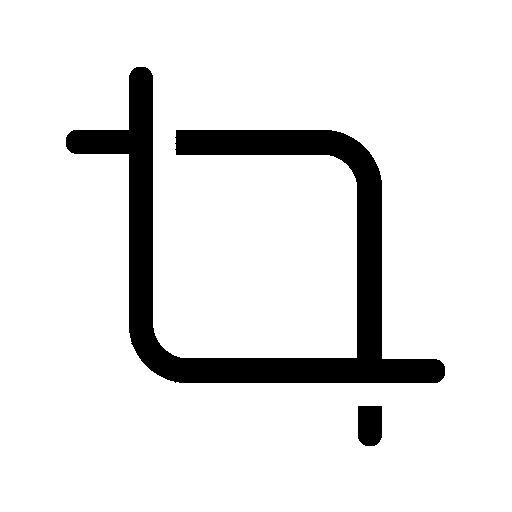
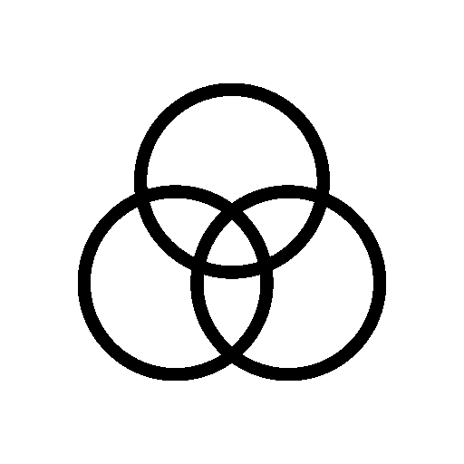

<!--yml

category: 未分类

date: 2024-05-27 14:30:16

-->

# ML Blocks | Home

> 来源：[https://www.mlblocks.com/](https://www.mlblocks.com/)

# 几分钟内构建视觉AI工作流程。

#### 无需编码即可构建基于人工智能驱动的图像处理工作流和自动化。

<https://dabble.so/s/mlblocks_concept_vid.mp4>

您的浏览器不支持视频标签。

## 1分钟演示

#### 拖放工作流程以生成、编辑或分析AI图像。

<https://dabble.so/s/mlblocksdemo3.mp4>

您的浏览器不支持视频标签。

#### 生成图像

使用稳定扩散等AI模型生成或修复图像。

#### 编辑图像

使用裁剪、调整大小、重新着色等编辑功能修改图像。

#### 分析图像

使用检测或分割模型从图像中提取数据。

## 图像处理的唯一无代码工具

#### 将AI模型（如**去除背景**）与图像编辑步骤（如**裁剪**和**调整大小**）结合，无需编写任何代码

## 简单透明的定价

#### 只为您使用的内容付费。我们没有订阅服务和每月配额。只需购买信用并随时使用。

$20

+   获取所有AI模块

+   基本图像编辑免费

+   信用用于运行AI模块

+   随时使用您的信用，没有过期时间

+   没有订阅，没有每月配额

## 开始使用

#### 今天开始构建视觉AI工作流程

加入社区 →
