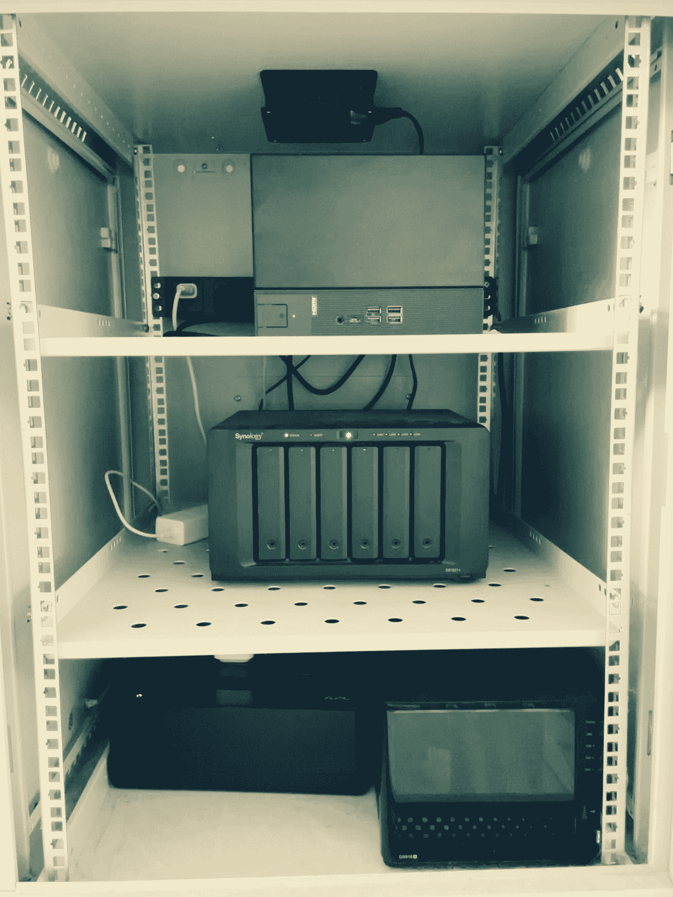
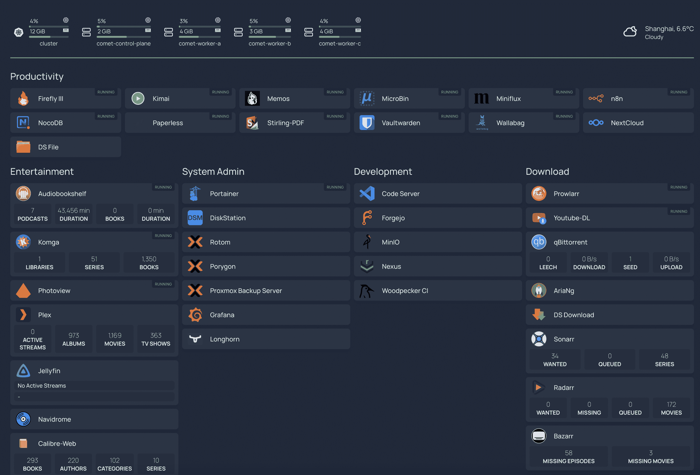

<!--yml

category: 未分类

date: 2024-05-27 14:31:10

-->

# 我的 2023 年家庭实验室设置 | Mudkip Mud Sport

> 来源：[https://mudkip.me/2024/01/31/My-2023-Homelab-Setup/#Gaming-and-AI-Experiments](https://mudkip.me/2024/01/31/My-2023-Homelab-Setup/#Gaming-and-AI-Experiments)

家庭实验室是一个可以存储家庭所有数据、自托管应用和服务、本地流媒体和尝试各种技术的地方。

一个家庭实验室可以从低功耗设备如 Raspberry Pi 开始，或者通过修改路由器安装开源固件并运行自定义应用程序。也可以选择易于使用的消费者 NAS 解决方案如 Synology。或者，您可能会发现自己被二手数据中心硬件所困扰。

在 2023 年，我一直在调整我的家庭网络和计算设置，这既有趣又有收获。

## 硬件

我家中有各种设备持续运行。去年一些被搁置，但还有一些值得一提的新来客。

我用于家中互联网的路由器“Rotom”是一台 [iKoolCore R1](https://www.ikoolcore.com/products/ikoolcore-r1-pro)。这款小巧设备由 Celeron N5105 处理器驱动，配备了 8GB RAM，128GB SSD，以及四个 2.5GbE 以太网口。它运行 [Proxmox VE](https://www.proxmox.com/en/proxmox-virtual-environment/overview)，托管一个 [OpenWRT](https://openwrt.org/) 虚拟机作为我的主要防火墙，以及一个 Debian 虚拟机用于几个网络应用程序。

这个夏天，我注意到由于过热，SSD 在几个场合变为只读状态。幸运的是，制造商提供了 R1 Pro 升级套件。这套件将外壳更换为直接接触 NVMe SSD 的散热片，有效缓解了过热问题。此外，它还包括一个 PWM 风扇，使得这台小型电脑在我衣柜里保持安静。

我的客厅角落里有一个 15U 网络机柜。底部放置着一台 [Santak](https://www.santak.com/) TG-BOX 850 UPS，保护机柜内的设备。中间位置是我在 2020 年购买的 NAS – [Synology DS1621+](https://www.synology.com/en-us/products/DS1621+)，配备了六块 8TB HGST 硬盘和 12GB ECC RAM。它配置为 RAID-6，提供总共 32TB 的存储容量。

网络机柜顶部是家庭实验室服务器“Porygon”，我在 2023 年组装。灵感来自[Tao of Mac](https://taoofmac.com/space/blog/2023/02/18/1845)，它基于 [ASRock DeskMeet B660](https://www.asrock.com/nettop/Intel/DeskMeet%20B660%20Series/) 主机。配置包括 Intel Core i7 12700 CPU，128GB DDR4 RAM，两块 NVMe SSD（WD SN770 2TB 和较老的 Samsung 970 Evo Plus 1TB），以及一块 Geforce RTX 3060 GPU。

DeskMeet B660还运行着Proxmox VE。集成的Iris Xe GPU专门用于[联想工作站](https://fedoraproject.org/workstation/)虚拟机，用于转码视频和提供远程桌面。RTX 3060在Windows虚拟机和用于游戏流的Debian虚拟机之间切换，我用它进行AI实验。

然而，我在网络机柜内的“Porygon”服务器上遇到了散热问题。CPU由[Noctua NH-L9i-17xx](https://noctua.at/en/nh-l9i-17xx)冷却，可在适度密集的任务中快速达到100°C。即使带有散热片，SSD通常也会升温至70°C。为了解决这个问题，我采取了两种方法。首先，我用[Noctua NF-A12](https://noctua.at/en/nf-a12x25-pwm)替换了电源风扇，这降低了CPU温度15°C，无论是在空闲状态还是负载下，但代价是[伤害了我双手](https://indieweb.social/@mudkip/111661590832909428)。其次，我安装了一个由小米智能插座控制的专用机柜风扇。当SSD温度达到70°C时，Home Assistant会启动风扇，在温度降至65°C以下时关闭风扇。最终，我对新的家庭实验室服务器感到非常满意。它通常是安静和节能的，但在需要时也可以非常强大。

## 应用程序和服务

在我的家庭实验室中，我运行着各种应用程序，满足不同的需求。这包括网络应用程序，确保我家中设备的连接，让我能够远程访问家庭网络。我还使用笔记应用、稍后阅读服务、家庭自动化系统、媒体管理服务、文件同步程序、RSS阅读器，以及由CI/CD管线支持的git服务器。此外，我还设置了仪表板，以便高效地导航和监控所有这些应用程序。可以说，我数字生活的重要部分依赖于这些完全受我控制的设备。

### 在我的路由器“Rotom”上

在这台体积紧凑但功能强大的机器上，我设置了两台虚拟机和一个LXC容器，用于管理各种服务和应用程序。

一个虚拟机作为我的主要路由器操作系统，运行OpenWRT。我已将其配置为三个网卡端口的透传。WAN端口连接到我ISP提供的调制解调器，而LAN端口与虚拟机网络端口一起建立了桥接式LAN网络。大部分OpenWRT的[配置](https://mudkip.me/2023/04/09/Project-Update-2023-Q1/#Home-Projects)围绕着DHCP设置和防火墙规则。

除了路由功能外，“Rotom”还托管了其他几个程序：

+   **[Jellyfin](https://github.com/jellyfin/jellyfin)**: 这是我的次级媒体中心。由于其完全开源且不依赖远程服务器，我正在考虑从Plex切换到Jellyfin。

+   **[frpc](https://github.com/fatedier/frp)**：这是用于公开某些服务的工具，比如SSH服务，使我能够连接回家庭网络。它非常有用，因为我处于CG-NAT IPv4网络中。如果在外部Wi-Fi网络中缺乏IPv6支持，我依赖frp访问我的家庭网络。

+   **[cloudflared](https://github.com/cloudflare/cloudflared)**：这作为通过Cloudflare隧道公开服务的另一种方法。

+   **[cloudflare-ddns](https://github.com/timothymiller/cloudflare-ddns)**：动态DNS服务，维护AAA记录，方便直接通过IPv6连接回到我的家。

+   **[traefik](https://github.com/traefik/traefik)**：这个反向代理管理了不在“Porygon”上运行的服务。我会单独详细介绍在Homelab PC上运行的服务。

Jellyfin在LXC容器中运行，使用Intel iGPU进行视频转码。其余服务运行在Debian虚拟机上的Docker容器中。Debian虚拟机还充当我Homelab PC和诸如Apple TV和Sonos One等设备的*侧路由*。

### 在我的Synology NAS“Uxie”上

作为我的存储中心，我需要我的NAS尽可能强大，所以我没有安装太多应用程序在上面。

除了标准的NAS服务，如SMB、NFS和File Station，我使用的应用还包括：

+   **[Synology Photos](https://www.synology.com/en-global/dsm/feature/photos)**：备份我家人的照片。我正在考虑切换到像Immich这样的开源解决方案，但上次我尝试时，Immich与iCloud照片库集成不佳。

+   **[qBittorrent](https://github.com/qbittorrent/qBittorrent)**和**[VueTorrent](https://github.com/VueTorrent/VueTorrent)**：主要用于下载*Linux ISOs*。

+   **[aria2](https://github.com/aria2/aria2)**：另一个用于下载*Linux ISOs*的工具。

+   **[Forgejo](https://codeberg.org/forgejo/forgejo)**：一个自托管的Git服务器；它轻量且是Gitea的社区分支。

+   **[Sonatype Nexus Repository](https://www.sonatype.com/products/sonatype-nexus-oss-download)**：我的私有Docker和npm包管理器，同时也是[docker.io](http://docker.io)和[ghcr.io](http://ghcr.io)的缓存代理，确保所有我的应用程序可以在没有互联网连接的情况下启动。

+   **[MinIO](https://github.com/minio/minio)**：我的其他应用程序的类似S3的对象存储服务。

+   **[Navidrome](https://github.com/navidrome/navidrome)**：与Subsonic API兼容的轻量级音乐管理器。

+   **[Sonarr](https://github.com/Sonarr/Sonarr)**：用于管理动漫和电视节目的自动媒体管理器。

+   **[Radarr](https://github.com/Radarr/Radarr)**：用于电影的自动媒体管理器。

+   **[Bazarr](https://github.com/morpheus65535/bazarr)**：Sonarr和Radarr内容的字幕下载器。

除了Synology的官方应用程序外，所有第三方程序都在Docker容器中运行。

### 家庭Kubernetes集群在“Porygon”上

我已经将[k3s](https://github.com/k3s-io/k3s)控制平面和工作节点从Frost Canyon NUC“Comet”迁移到我的新Homelab PC。大多数应用程序都在这个k3s集群中运行，因为它易于维护、升级和恢复。构建这个集群也是学习的一种绝佳方式。

这里列出了在该集群中运行的应用程序：

+   **[Memos](https://github.com/usememos/memos)**：我主要用它来记录我的想法和思路的笔记应用。我还开发了名为“[Moe Memos](https://memos.moe/)”的iOS和Android客户端。

+   **[Miniflux](https://github.com/miniflux/v2)**：我的RSS阅读器。支持Fever和Google Reader API，并可连接各种RSS客户端。

+   **[Vaultwarden](https://github.com/dani-garcia/vaultwarden)**：Bitwarden开源密码管理器的非官方服务器，用Rust编写。比官方服务器更轻量化。

+   **[Wallabag](https://github.com/wallabag/wallabag)**：我的链接管理和“稍后阅读”应用。

+   **[MicroBin](https://github.com/szabodanika/microbin)**：文本和文件分享应用，用于在没有通用剪贴板时传输文件。

+   **[NocoDB](https://github.com/nocodb/nocodb)**：类似AirTable的智能电子表格。我用它来进行个人项目管理和跟踪游戏和电影。

+   **[Komga](https://github.com/gotson/komga)**：我的漫画图书馆。支持像Panels和Mihon这样的OPDS客户端。

+   **[Paperless-ngx](https://github.com/paperless-ngx/paperless-ngx)**：用于管理扫描文档的文档管理系统。

+   **[Stirling PDF](https://github.com/Stirling-Tools/Stirling-PDF)**：一体化PDF工具包。

+   **[Audiobookshelf](https://github.com/advplyr/audiobookshelf)**：我将其用作自动播客下载工具。

+   **[Photoview](https://github.com/photoview/photoview)**：我用它来管理非库中收集的图片，如CD和蓝光书签。

+   **[Prowlarr](https://github.com/Prowlarr/Prowlarr)**，由 **[FlareSolverr](https://github.com/FlareSolverr/FlareSolverr)** 支持：用于Sonarr/Radarr的索引管理器。

+   **[YoutubeDL-Material](https://github.com/Tzahi12345/YoutubeDL-Material)**：通过[yt-dlp](https://github.com/yt-dlp/yt-dlp)下载YouTube视频的材料。

+   **[draw.io](https://github.com/jgraph/drawio)**：最强大的图表工具。

+   **[Kimai](https://github.com/kimai/kimai)**：自托管的时间追踪器。

+   **[Firefly III](https://github.com/firefly-iii/firefly-iii)**：自托管的财务管理器。我还没有多少使用经验。

+   **[Node-RED](https://github.com/node-red/node-red)** 和 **[n8n](https://github.com/n8n-io/n8n)**：强大的自动化工具，但我还没有多少使用经验。

+   **[Woodpecker CI](https://github.com/woodpecker-ci/woodpecker)**：Kubernetes原生的持续集成解决方案。

我的Kubernetes集群的清单由Git存储库管理，并通过名为[Flux CD](https://github.com/fluxcd/flux2)的GitOps工具自动部署。当我推送更改到存储库时，比如添加新的应用程序或升级Docker镜像时，部署会在几分钟内完成。

最近，我发现了一个强大的工具，名为[Renovate Bot](https://github.com/renovatebot/renovate)。它每隔几个小时扫描我的Kubernetes清单存储库，以确定哪些Helm发布或容器镜像标签需要升级，然后在Forgejo中创建拉取请求，类似于Dependabot在GitHub上的操作方式。

除了我正在运行的应用程序之外，我的设置还包括[Ingress NGINX Controller](https://github.com/kubernetes/ingress-nginx)、[MetalLB](https://github.com/metallb/metallb)和[cert-manager](https://github.com/cert-manager/cert-manager)以便促进服务访问和管理证书。这些应用程序的数据存储在[Longhorn](https://github.com/longhorn/longhorn)卷上，这些卷在所有三个工作VM和两个SSD上都有备份。我还集成了[Kube Prometheus Stack](https://github.com/prometheus-community/helm-charts/tree/main/charts/kube-prometheus-stack)和[Grafana Loki](https://github.com/grafana/loki)来监视集群并查看pod日志。

除了用于管理集群中资源的`kubectl`之外，我还使用了另一个工具[Portainer](https://github.com/portainer/portainer)。我还配置了Portainer环境来管理我的NAS、路由器和一些云服务器上的Docker Compose堆栈。为了方便浏览我Homelab中的所有应用程序，我使用了一个高度可定制的仪表板，名为[Homepage](https://github.com/gethomepage/homepage)。它能与Kubernetes无缝集成，并且能够基于Ingress注释发现服务。

所有的k3s节点都在Ubuntu 22.04下运行，我已经配置了[system-upgrade-controller](https://github.com/rancher/system-upgrade-controller)来自动更新k3s和apt。

### 远程开发和桌面

我的Kubernetes集群一样，Fedora工作站VM “comet-core”也是从Frost Canyon NUC迁移而来的。Intel Iris Xe iGPU被直通给它。我主要将其用作远程开发服务器，需要GUI应用程序时，我可以通过[xrdp](https://github.com/neutrinolabs/xrdp)和[xorgxrdp](https://github.com/neutrinolabs/xorgxrdp)以RDP方式访问[GNOME桌面](https://www.gnome.org/)。

这个VM中运行着一些值得注意的应用程序：

+   **[Plex](https://www.plex.tv/)**：我的主要媒体库。我拥有终身 Plex Pass，我仍然喜欢 Plex 的各种独特功能。但我对 Plex 的[未来](https://techcrunch.com/2023/01/05/streamer-plex-finally-ready-to-launch-a-tv-and-movie-rentals-marketplace/)和其[难以处理的隐私问题](https://www.techhive.com/article/2157803/plex-discover-together-privacy-concerns.html)有些担忧。也许某一天我会转向 Jellyfin。

+   **[code-server](https://github.com/coder/code-server)**：一个 web 开发环境。然而，我经常通过 Visual Studio Code 的[Remote Development](https://code.visualstudio.com/docs/remote/remote-overview)功能在这个 VM 上开发。

+   **[calibre](https://calibre-ebook.com)** 和 **[calibre-web](https://github.com/janeczku/calibre-web)**：我的书库。我还使用 calibre 来去 DRM 和转换我购买的数字书籍。

+   **[Handbrake](https://handbrake.fr/)**：我用它将我的蓝光收藏中的视频转码为 H.265 使用 Intel Quick Sync。

### 游戏和 AI 实验

拥有独立的 GPU 显著证明了升级家庭实验室 PC 的必要性。我设置了一个名为“Porygon-Z”的 Windows VM 和一个名为“Porygon2”的 Debian VM，两者都配置了 RTX 3060 GPU。然而，由于 GPU 透传仅限于单个 VM，因此一次只能启动一个 VM。

在 Debian VM 中，我正在尝试一些较小的 LLM 应用，如[Ollama](https://ollama.ai/)和[ChatGLM-6B](https://github.com/THUDM/ChatGLM-6B/blob/main/README_en.md)，以及使用[Stable Diffusion web UI](https://github.com/AUTOMATIC1111/stable-diffusion-webui)进行艺术创作。我还探索了诸如[Chroma](https://github.com/chroma-core/chroma)之类的向量数据库。

在 Windows 虚拟机上，我已经安装了[Sunshine](https://github.com/LizardByte/Sunshine)，主要是为了从 PC 游戏通行证流式传输游戏，以及那些在 Steam Deck 上不受支持或性能不佳的标题，到我手持控制台上的[Moonlight](https://moonlight-stream.org/)。在手持设备上以最高设置以 1080p 60fps 玩游戏，这是我以前从未想过可能的梦想，直到现在。

### 其他 VM 和 LXC 容器

最后但并非最不重要的是，我想强调更多应用。

[Nextcloud](https://nextcloud.com/) 作为我的文件同步服务器。以前它的性能表现不佳，特别是在同步大量小文件时。但是，随着 Nextcloud 版本和硬件的最新升级，其性能显著提升，提供了超快的文件传输速度。我在“Porygon”上的一个 LXC 容器中使用 [Nextcloud AIO](https://github.com/nextcloud/all-in-one) 配置了 Nextcloud。除了文件同步外，Nextcloud 还通过 CalDAV 管理我的日历和任务，并使用[Floccus](https://floccus.org/)同步浏览器书签。

[Home Assistant OS](https://www.home-assistant.io/)管理我所有的IoT设备，并将它们桥接到HomeKit。对于不支持HomeKit的设备，我可以通过[hass-xiaomi-miot](https://github.com/al-one/hass-xiaomi-miot)访问它们。Home Assistant还自动化了各种任务，例如控制我之前提到的网络柜风扇，并在晚上有人进入客厅时激活Aqara M1S夜灯。

## 备份

我对于保护数据采用了宽松的3-2-1备份策略。我的NAS作为主要备份目标，包括通过Time Machine备份家庭iMac和两台Proxmox VE设备，使用[Proxmox备份服务器](https://www.proxmox.com/en/proxmox-backup-server/overview)虚拟机。另外，我的旧Synology DS916+ NAS已经运行了8年，通过[rsync](https://kb.synology.com/en-us/DSM/help/DSM/AdminCenter/application_backupserv_sharedfoldersync?version=7)和[Hyper Backup](https://www.synology.com/en-global/dsm/feature/hyper_backup)保护主NAS的数据。

对于离线备份，我使用[Backblaze B2](https://www.backblaze.com/cloud-storage)和OneDrive。Backblaze B2存储了来自Hyper Backup、[restic](https://github.com/restic/restic)、Longhorn和[Arq](https://www.arqbackup.com/)的备份，而我的NAS中选择性的文件夹则通过[Cloud Sync](https://www.synology.com/en-global/dsm/feature/cloud_sync)单向同步到OneDrive。考虑到存储成本，我选择不对媒体库进行远程备份，因为大部分内容可以通过重新提取物理媒体或重新下载来重新获取。

## 2024年的家庭实验室

这就是我2023年的家庭实验室设置。我对目前的设置非常满意，但还有一些我想探索的领域。

目前，我只有千兆以太网，尽管我有几个2.5GbE设备。也许我应该添加一些2.5GbE交换机，以更快地访问我的数据。

我想充分利用我的设备。考虑将我的Frost Canyon NUC重新配置为备份设备，以防我的家庭实验室中的某些硬件出现故障。之前Noctua CPU风扇就出现过故障，导致我几天无法访问“Porygon”。此外，我还有一个备用的[Raspberry Pi 4](https://www.raspberrypi.com/products/raspberry-pi-4-model-b/)和一个[Zero 2 W](https://www.raspberrypi.com/products/raspberry-pi-zero-2-w/)，但我还没有找到有效利用它们的方法。

我还对开源NAS解决方案（如[mergerfs](https://github.com/trapexit/mergerfs)、[SnapRAID](https://github.com/amadvance/snapraid)和[openmediavault](https://github.com/openmediavault/openmediavault)）感兴趣，但我目前还没有动力去构建一个。我也在研究VLAN设置，尽管我认为我目前并不真正需要它。

总体而言，我享受了我的Homelab之旅，并期待更多的建设和学习。希望您喜欢阅读本篇文章，如果您有任何建议或想法，请在[Mastodon](https://indieweb.social/@mudkip)上联系我。
