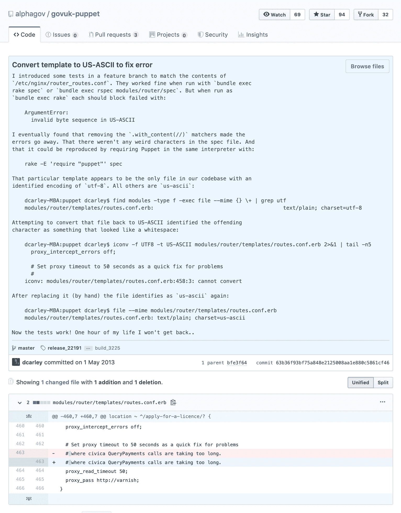

<!--yml

category: 未分类

date: 2024-05-27 14:30:27

-->

# 我最喜欢的Git提交 | dhwthompson.com

> 来源：[https://dhwthompson.com/2019/my-favourite-git-commit](https://dhwthompson.com/2019/my-favourite-git-commit)

我喜欢Git提交信息。如果使用得当，我认为它们是记录代码库整个生命周期中最强大的工具之一。我想通过展示我最喜欢的Git提交来说明这一点。

这个提交来自我在政府数字服务工作的时间，当时我在GOV.UK上工作。它来自一个名叫[丹·卡利（Dan Carley）](https://twitter.com/dancarley)的开发者，名为“[将模板转换为US-ASCII以修复错误](https://github.com/alphagov/govuk-puppet/commit/63b36f93bf75a848e2125008aa1e880c5861cf46)”。



一个快速的旁注：[在公开编码的好处](https://gds.blog.gov.uk/2017/09/04/the-benefits-of-coding-in-the-open/)之一，正如GDS所实践的，是可以分享像这样的例子到组织外部。我不确定是谁最早向GDS引入了这个想法 - 我加入时它已经得到很好的实践 - 但我永远感激他们。

## 我为什么喜欢这个提交

我已经失去了分享这种提交信息可以做到的次数。它很有趣，因为提交信息与代码变更的比例，但这并不是我认为值得分享的原因。

在另一个组织中，来自不同开发者的整个提交信息可能是`change whitespace`，或者`fix bug`，或者（根据团队文化）对非断行空格发明者的一些不那么令人满意的观点。但是，丹花时间为他周围的人精心制作了一个非常有用的提交信息。我想逐步介绍一些我认为这是一个很好的例子的方法。

### 它解释了变更的原因

我看过的最好的提交信息不仅仅解释了**改变了什么**：它们还解释了**为什么**。在这个例子中：

```
I introduced some tests in a feature branch to match the contents of
`/etc/nginx/router_routes.conf`. They worked fine when run with `bundle exec
rake spec` or `bundle exec rspec modules/router/spec`. But when run as
`bundle exec rake` each should block failed with:

    ArgumentError:
      invalid byte sequence in US-ASCII 
```

没有这么详细的信息，我们可能会猜测这个提交修复了某个工具中的某种解析错误。由于提交信息，我们确切知道是哪个工具。

这种信息可能对文档非常有价值，但很容易因为人们忘记他们工作背后的原始上下文，转移到其他团队，最终离开组织而丢失。

### 它是可搜索的

这个提交信息中的第一件事情之一是激发了变化的错误信息：

```
ArgumentError:
  invalid byte sequence in US-ASCII 
```

其他遇到这个错误的人可以通过运行`git log --grep "invalid byte sequence"`或者通过[使用GitHub的提交搜索](https://github.com/alphagov/govuk-puppet/search?q=%22invalid+byte+sequence%22&type=Commits)来搜索代码库。实际上，从搜索结果来看，有多人这样做，并且找到了在遇到问题时，谁先发现了这个问题，他们当时做了什么。

### 它讲述了一个故事

这个提交消息详细描述了问题的状况，调查过程的样子，以及解决过程的样子。例如：

```
I eventually found that removing the `.with_content(//)` matchers made the
errors go away. That there weren't any weird characters in the spec file. And
that it could be reproduced by requiring Puppet in the same interpreter 
```

这是提交消息可以真正发挥作用的一个领域，因为它们记录了变更本身，而不是特定文件、函数或代码行。这使得它们成为记录代码库旅程中这种额外信息的绝佳地点。

### 这使得每个人都变得更聪明

Dan 在这里做的一件我非常欣赏的事情是记录他在每个阶段运行的命令。这可以成为团队中传播知识的一个很好的轻量级方式。通过阅读这个提交消息，有人可以学到关于 Unix 工具集的一些非常有用的技巧：

+   他们可以传递 `-exec` 参数给 `find`，对找到的每个文件运行一个命令

+   在这个命令的末尾添加 `\+` 做了一些有趣的事情（它将许多文件名传递给单个 `file` 命令，而不是对每个文件运行一次命令）

+   `file --mime` 可以告诉它们文件的 MIME 类型

+   `iconv` 存在

审查此更改的人可以学到这些东西。任何稍后找到此提交的人都可以学到这些东西。随着时间和提交量的增加，这可以成为团队的一个非常强大的乘数。

### 它建立了同情心和信任

```
Now the tests work! One hour of my life I won't get back.. 
```

最后一段增加了额外的人文背景。阅读这些文字，很难不感受到 Dan 在追踪一个顽固 bug 上花了一个小时的一点挫折感，以及修复它时的满足感。

现在想象一条类似的消息附加在一段短期 hack 上，或者一段原型代码进入生产并扎根下来（正如原型代码喜欢做的那样）。像这样的提交消息使得记住每次变更背后都有一个人，这个人在给出当时拥有的信息的情况下做出了最佳决策，变得更加容易。

## 良好的提交消息很重要

我承认这是一个极端的例子，我不会期望所有提交（特别是这种规模的提交）具有这种详细程度。不过，我认为这是一个解释变更背景、帮助他人学习并为团队的代码库建立集体心智模型的优秀例子。

如果你有兴趣了解更多关于良好提交消息的好处，以及一些可以帮助你围绕它们的更改结构化的工具，我可以推荐：
