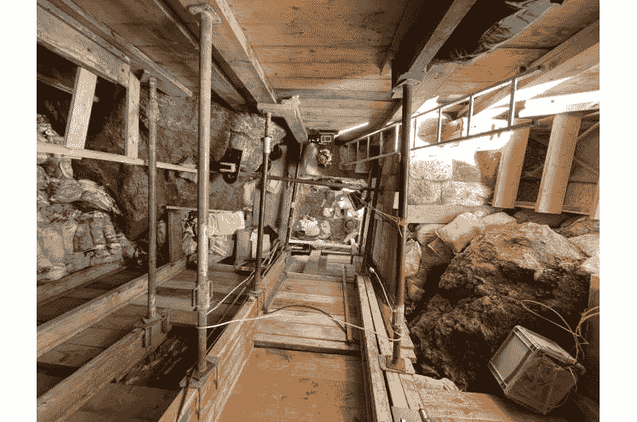
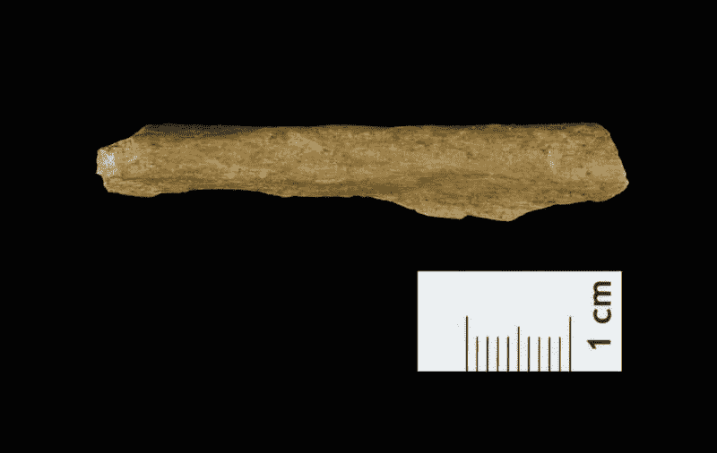
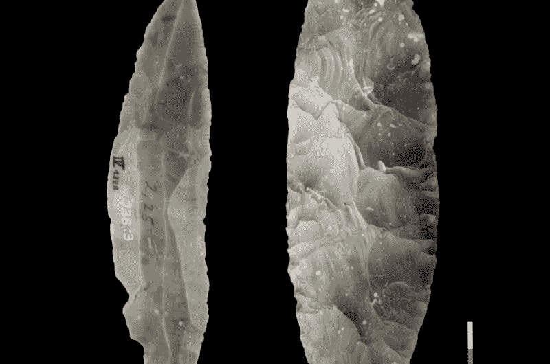
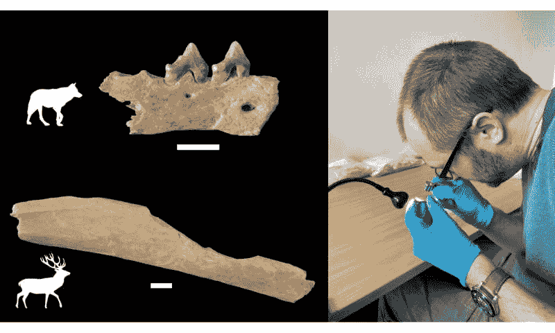

<!--yml

category: 未分类

date: 2024-05-27 14:30:43

-->

# 45000年前，基因分析发现，尼安德特人和人类曾在北欧并存。

> 来源：[https://phys.org/news/2024-01-neanderthals-humans-side-northern-europe.html](https://phys.org/news/2024-01-neanderthals-humans-side-northern-europe.html)

在Ranis深达8米的LRJ层进行挖掘是一项后勤挑战，需要精心设计的脚手架来支撑沟壑。摄影：Marcel Weiss，许可证：CC-BY-ND 4.0

在德国中部一个考古遗址出土的骨骼碎片的基因分析，明确显示现代人类——智人——已经在45000年前抵达了北欧，与尼安德特人共存了数千年，后者最终灭绝。

这些发现表明，位于德国Ranis附近的遗址，以其精细剥制的叶状石器片闻名，是欧洲中北部和西北部最古老的现代人石器文化确认遗址之一。

智人和尼安德特人共同生活的证据与基因组证据一致，表明这两个物种偶尔会杂交。这也引发了这样的怀疑：大约50000年前，现代人类进入欧洲和亚洲，导致已经在该地区生活了50万年的尼安德特人灭绝。

这项基因分析，连同Ranis遗址的考古和[同位素分析](https://phys.org/tags/isotopic+analysis/)以及放射性碳定年，详见发表在《自然》和《自然生态与进化》期刊上的三篇论文。

在Ranis的石刃，被称为叶状点，与摩拉维亚、波兰、德国和英国几个地点发现的[石器](https://phys.org/tags/stone+tools/)相似。这些工具被认为由同一文化制作，称为Lincombian–Ranisian–Jerzmanowician (LRJ)文化或技术复合体。由于先前的日期，Ranis遗址已知至少有40,000年历史，但由于没有可识别的骨骼来指示制作这些工具的人类，无法确定它们是尼安德特人还是智人的产品。

新发现表明，“智人制造了这种技术，并且智人在这个时期，即45000年前，就已经来到了这里，”加利福尼亚大学伯克利分校的米勒研究员Elena Zavala说道，她是《自然》论文的四位第一作者之一。“因此，这些是欧洲最早的智人之一。”

2018年，Zavala是马克斯·普朗克进化人类学研究所（MPI-EVA）的博士生，当时她首次开始参与这个项目，该项目由该研究所的前所长兼巴黎法国学院教授Jean-Jacque Hublin主导。

“Ranis洞穴遗址为智人首次在欧洲较高纬度地区的扩散提供了证据。 结果表明，曾被认为是尼安德特人制造的石器实际上是早期智人的工具包的一部分，”Hublin说。

“这基本改变了我们先前关于这个时期的知识：智人在尼安德特人在西南欧洲消失之前就已经到达西北欧。”

新挖掘的Ranis的人类骨片碎片。 信用：Tim Schüler TLDA，许可：CC-BY-ND

**母系亲属的骨骼？**

Zavala在2016年至2022年间以及上世纪30年代早期的Ranis新挖掘和更深层次挖掘的早期人类骨骼碎片进行了[遗传分析](https://phys.org/tags/genetic+analysis/)。 因为古代骨骼中的DNA高度碎裂，她采用特殊技术来分离和测序DNA，所有这些都是仅从母亲那里继承的线粒体DNA（mtDNA）。

“我们确认这些骨骼碎片属于智人。 有趣的是，几个碎片共享相同的线粒体DNA序列，甚至来自不同挖掘地点的碎片，”她说。

“这表明这些碎片属于同一人或其母系亲属，将这些新发现与几十年前的发现联系起来。”

通过对骨蛋白进行分析最初确定这些骨片为人类——一种称为古蛋白组学的领域——由另一位第一作者Dorothea Mylopotamitaki完成，她是法国学院博士生，曾在法国科学院和MPI-EVA工作。

通过将Ranis线粒体DNA序列与从欧洲其他旧石器时代遗址获取的mtDNA序列进行比较，Zavala能够构建整个欧洲早期智人的家谱。 除了13个Ranis碎片中的一个之外，其他所有碎片都非常相似，令人惊讶的是，它们与捷克共和国Zlatý kůň洞穴发现的一名43,000年前女性头骨的mtDNA非常相似。 这唯一的异常成员与来自意大利的一个个体分组在一起。

“这引发了一些问题：这是一个单一的人群吗？ 这里可能会有什么关系？” Zavala说。“但是通过线粒体DNA，这只是历史的一面。 这只是母系的一面。 我们需要核DNA才能开始研究这个问题。”

来自Ranis的LRJ石器工具。1）典型的LRJ部分双面刃刀尖；2）在Ranis，LRJ还包含精致制作的双面叶片点。来源：Josephine Schubert，博物馆布尔格Ranis，许可：CC-BY-ND 4.0

**中-上更新世之间的过渡地点**

Zavala专注于分析长期埋藏的骨头、骨工具和沉积物中发现的DNA。她通过Ranis挖掘的各个层次的沉积物中的DNA，找到了广泛的哺乳动物DNA，但没有发现人科动物的DNA。

通过对骨片的形态学、同位素和蛋白质组分析，结合环境及该洞穴在那个时期的食物研究，描绘了一个完整的画面。

驯鹿、洞穴熊、独角犀牛和马的骨骼存在，例如，表明了典型的草原冻原寒冷气候条件，类似于今天西伯利亚和北斯堪的纳维亚的情况，并且人类的饮食以大型陆生动物为基础。研究人员得出结论，洞穴主要由冬眠的洞穴熊和筑巢的鬣狗使用，只有定期有人类出现。

"这种低密度的考古特征与其他Lincombian–Ranisian–Jerzmanowician遗址相符，最好的解释是由小型、移动的早期智人的开拓团体短暂访问所导致的，" 一篇发表在《自然生态与进化》上的论文称。

"这表明，即使是这些早期的智人群体在横跨欧亚大陆时，已经具备了一定的适应如此恶劣气候条件的能力，" 西班牙拉古纳大学的博士后研究员萨拉·佩德尔扎尼说道，她领导了该遗址的古气候研究。

"直到最近，人们认为对抗寒冷气候条件的适应能力要等到几千年后才会出现，所以这是一个令人着迷和惊讶的结果。"

位于城堡底部的Ranis遗址，称为Ilsenhöhle，最初主要在1932年至1938年之间进行了挖掘。那里发现的叶片点最终被归类为中更新世末期——约30万至30,000年前——或上更新世的初期，上更新世始于大约50,000年前。

由于Ranis遗址对理解中欧LRJ技术复合体以及从尼安德特人相关的中更新世晚期到现代人类上更新世的过渡具有重要意义，Hublin及其团队决定使用现代考古学工具重新挖掘该遗址。

新的挖掘延伸到地基，深达地表以下约8米，并涉及移除一块岩石——可能是从洞穴天花板掉落的——这阻碍了先前的挖掘工作。在这里，胡布林的团队发现了燧石工具的碎片和一块石英岩片，符合LRJ技术复合体。

对数千个被挖掘的骨片进行的后续蛋白质组学分析确认了其中四个来自古人类。在1930年代的挖掘中发现的骨片中，九个来自古人类。

扎瓦拉的DNA分析证实，所有13个[骨片](https://phys.org/tags/bone+fragments/)来自智人。

+   

    来自拉尼斯的1000多块动物骨骼的分析显示，早期智人处理了鹿和狼等食肉动物的尸体。摄影：杰夫·M·史密斯

+   

    从考古骨骼碎片中提取的蛋白质在无菌环境中进行，以避免现代污染。摄影：多萝西亚·迈洛波塔米塔基

**北欧的修订定居史**

该团队还对该遗址不同层次的人类和动物骨骼进行了放射性碳定年，重点关注表面带有人类修改痕迹的骨骼，这将它们的日期与洞穴内人类存在联系起来。

"我们在智人骨骼和新挖掘的LRJ层次中修正动物骨骼的放射性碳约会结果中发现非常好的一致性，这为人类遗骸与LRJ之间建立了非常强的联系。证据表明，智人自至少47500年前就开始偶尔占据该遗址，"另一位第一作者海伦·菲沃斯说道，她曾是马克斯·普朗克研究所的研究员，现在是伦敦弗朗西斯·克里克研究所的欧洲分子生物学组织（EMBO）博士后研究员。

"拉尼斯的伊尔森霍尔洞的结果从根本上改变了我们对阿尔卑斯山以北欧洲的年代学和定居史的看法，"德国魏玛的图林根州历史遗迹和考古保护办公室的蒂姆·舒勒补充道。

在*自然*论文的其他合著者中，弗赖德里希·亚历山大-纽伦堡大学的联合第一作者马塞尔·魏斯和MPI-EVA的莎农·麦克费隆，与胡布林、舒勒和魏斯一同领导了拉尼斯的发掘。此外，扎瓦拉除了是*自然*论文的联合第一作者外，还与*自然生态与进化*的两篇论文合著。

**更多信息:** Jean-Jacques Hublin，人类在45,000年前抵达了欧洲的高纬度地区，*Nature* (2024)。 [DOI: 10.1038/s41586-023-06923-7](https://dx.doi.org/10.1038/s41586-023-06923-7). [www.nature.com/articles/s41586-023-06923-7](https://www.nature.com/articles/s41586-023-06923-7)

稳定同位素显示，人类在大约45,000年前进入了德国Ranis的Ilsenhöhle寒冷草原，*Nature* (2024)。 [DOI: 10.1038/s41559-023-02318-z](https://dx.doi.org/10.1038/s41559-023-02318-z) , [www.nature.com/articles/s41559-023-02318-z](https://www.nature.com/articles/s41559-023-02318-z)

在德国Ranis的Ilsenhöhle，大约45,000年前的人类的生态、生存和饮食情况，*Nature Ecology & Evolution* (2024)。 [DOI: 10.1038/s41559-023-02303-6](https://dx.doi.org/10.1038/s41559-023-02303-6) , [www.nature.com/articles/s41559-023-02303-6](https://www.nature.com/articles/s41559-023-02303-6)

William E. Banks, Stone tools in northern Europe made by Homo sapiens 45,000 years ago, *Nature* (2024). DOI: 10.1038/d41586-024-00072-1 , [doi.org/10.1038/d41586-024-00072-1](https://doi.org/10.1038/d41586-024-00072-1)

**引用**: 遗传分析发现，45,000年前，尼安德特人和人类在北欧共同生活。2024年1月31日检索于https://phys.org/news/2024-01-neanderthals-humans-side-northern-europe.html

本文受版权保护。除了为私人研究或研究目的进行的公平交易外，未经书面许可，不得复制任何部分。内容仅供信息目的。
