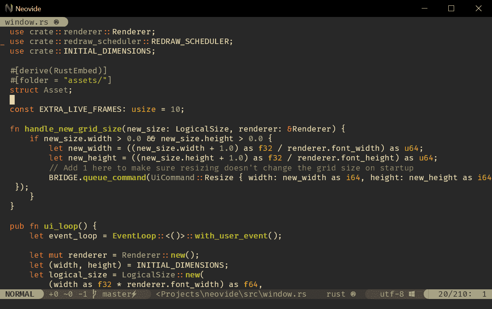

<!--yml

category: 未分类

date: 2024-05-27 14:30:54

-->

# Neovide - Neovide

> 来源：[https://neovide.dev](https://neovide.dev)

<main>

这是一个简单、不繁琐的跨平台图形用户界面，用于[Neovim](https://github.com/neovim/neovim)（一个经过大规模重构和更新的 Vim 编辑器）。在可能的情况下，进行了一些图形改进，但在功能上应该像终端用户界面一样运作。

如果你在寻找 Neovide 的源代码，可以在[这里](https://github.com/neovide/neovide)找到。要在文档中搜索，只需按下`s`键或点击左上角的放大镜图标以打开搜索栏。

通过包管理器安装还是从源代码构建？[没问题！](installation.html)

想要查看所有可用功能的列表？[请看这里！](features.html)

想要配置你的 neovide？[我们已经为你准备好了！](configuration.html)

*Neovide 在 Windows 上运行的截图*

</main>

**
