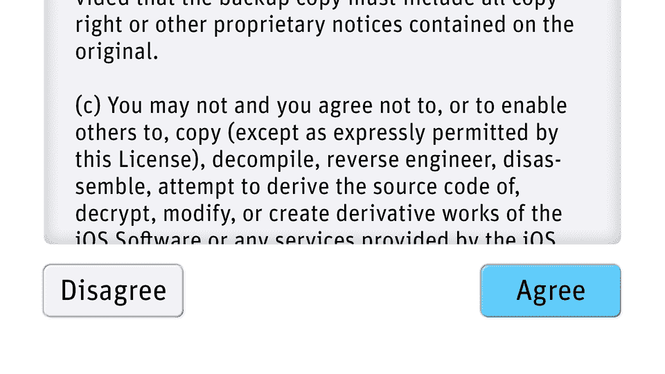

<!--yml

category: 未分类

日期：2024年5月27日 14:30:29

-->

# Nuberodesign > 博客 > 赞美按钮 - 第一部分

> 来源：[https://www.nubero.ch/blog/009/](https://www.nubero.ch/blog/009/)

赞美按钮 - 第一部分

在图形用户界面中，形式 *即* 功能

作者：尼科·基查基斯（Niko Kitsakis），2024年1月

在任何设计领域中，总有一些特定的趋势。其中之一似乎是按钮现在被认为不酷了。无论是物理对象上的按钮还是图形用户界面中的按钮，这都无关紧要。

按钮并不新鲜。正因为如此，它们不酷。就像锤子和回形针一样，它们存在已久并且很有效。事实上，它们之所以存在已久 *就是因为* 它们有效。

如果你是一个不诚实的设计师，这就成为了一个问题。毕竟，你如何告诉你的客户你刚刚重新发明了轮子？你不能在你全新亮眼的产品中使用乏味的老按钮。那么你会怎么做？你会重新设计按钮的外观或功能（或两者兼而有之），并将其销售为“设计界最新发展” - 完全忽视用户需求，并在此过程中损害你作为设计师的诚信。

屏幕上的按钮

在图形用户界面中，我们最近看到了一个增加的现象，即仅由文本或图标组成的按钮，而没有清晰可见的按钮形状。这种索然无味、毫无灵感的平庸风格，如谷歌的“Material Design”或更糟糕的IBM的“Carbon Design System”，由苹果的iOS 7及其同样令人沮丧的“Flat Design”美学所推广。这种懒惰的极简主义通常被认为是现代和简洁的代表，但我们必须问：它是否也用户友好？

答案显然是：不，它不是！

请考虑下面的图片：在第一行中，我们看到一系列被认为是按钮的图标。然而，唯一让你可能认出它们为按钮的方法是它们被应用在用户界面中。因此，实际上只有 *上下文* 能让你认出它们为按钮，而不是它们自身的 *外观*。

两排按钮。哪一排看起来更吸引人与之交互？

将上行中的图标与下行中的对应图标进行比较。在这里，相同的图标嵌入到了按钮形状中。这同时做了几件事。首先，按钮形状充当了 *标识符*。这意味着它们让用户知道可以在那里执行操作。而上行中的图标则没有做到这一点。它们不传达它们可以被按下或 *使用* 的能力。

如何标识符的重要性，这在你身边的物理对象上变得明显。例如，看看下面图片中的瑞士军刀。你可以看到主刀片上的小槽（以及几乎每个瑞士军刀的铰接工具中的小槽）称为“指甲槽”。这个指甲槽不仅允许你插入指甲并拉出工具，它看起来*确实是为了这个目的而设计的。* 还要注意它的确切形状。它反映了指甲略微弯曲的轮廓。而且不仅如此：槽内壁的角度设计得如此精确，以确保你的指甲可以深入到指甲槽中，从而确保牢固地拉出工具。

这是瑞士军刀主刀片上的指甲槽。它向用户提示，这里可以发生某种动作，而且这个动作很可能涉及指甲。

这应该清楚地说明了为什么我们的图形用户界面中的虚拟按钮确实应该看起来像按钮：它们应该传达它们可以使用。当它们只看起来像图标时，它们做不到这一点。

再次看看按钮的图像，这次试着找出属于一起的组。例如，加号和减号的图标以及左右箭头形成了两组，而放大镜则是分开的。在下行中，按钮具有统一的形状，更容易注意到它们之间的间距差异。

还有一件事要考虑。看看下一张图片。

上行中的按钮不仅*不清楚地传达*它们的功能，它们的*功能*也很糟糕。

粉色显示的是按钮实际可以点击或触摸的区域，也就是说，它显示了软件将注册输入的区域。在上行中，如果从像素平方的角度来看，这是一个相当小的区域。话虽如此，在鼠标界面中，上行的可点击区域有时可能与下行相同。然而，在触摸界面中，情况通常并非如此。在那里，实际的图形轮廓——比如减号——通常是唯一可以触摸的东西。所以，当你快速点击屏幕时，如果没有精确命中目标，你可能会完全错过按钮。

按钮中的文字

当按钮实际上只是文字而不是图标时，按钮形状的重要性变得更加明显。下面的例子展示了iOS更新的条款和条件。你可以看到，“同意”和“不同意”这两个词在已经充满大量文字的环境中并不突出。苹果向用户展示这两个词实际上是按钮，仅仅通过颜色来实现。默认的同意选项也没有足够与不同意选项区分开来。唯一的区别是字体略微加粗（但不是真正的粗体）。最后，说到字体，苹果选择的这款字体——特别设计的——也不是最适合用户界面的。

一切可能出错的事情都会出错：设计这一切的人盲目地遵循这样一个观念，即去除他们视为装饰的一切将导致简单性。

现在将上述苹果的例子与我下面的重新设计进行比较。看看按钮形状和更好的字体选择所带来的差异。所选的字体称为“FF Unit”，比苹果的“旧金山”字体具有更少歧义的字形。诚然，在长文本中，这不如在单个单词中重要，但由于我们希望按钮和法律文本使用相同的字体，选择像FF Unit这样的字体显然更为明智。最后，我使用了轻微的阴影来区分条款和条件的可滚动文本与周围界面。这也使得屏幕上的不同元素之间有更好的视觉区分。

仅仅因为用户界面使用了3D按钮和一些阴影，并不意味着它必须看起来俗气。事实上，如果你必须在俗气但可用与简约但难用之间做出选择，俗气是更好的选择。但你并不必做出这种选择：完全可以创造既好看又易于使用的东西。

直接操纵

我们进化所在的物理世界是一个每一个动作都会产生效果的世界。当你推动桌上的咖啡杯并且它远离你时，它会发出声音。你可能还能看到小波纹在你的咖啡中形成，因为杯子在桌上滑动时传递给液体的微小振动。我们的大脑期望通过不同的感官接收到所有这些反馈。

想想这意味着什么：您将通过指尖得到触觉反馈，了解重量、温度和质地。从陶瓷在桌子上滑动时会有声学反馈。您还会从看到您的手指和杯子移动，以及咖啡表面上的小波纹得到视觉反馈。由于我们的大脑建立了一个模型，并将现实与其进行比较，这些不同的反馈既是*预期的*又是*相互关联的*。例如，如果杯子在滑过桌子时完全没有发出任何声音，或者液体在杯子内不会移动，那将非常奇怪。

图形用户界面中没有按钮形状的按钮也不太可能给你任何反馈。虽然它实际上可能有一个替代状态，在您触摸它时会被激活（例如颜色的变化），但您可能会用手指遮挡这一变化。这是按钮看起来像按钮的另一个优点。因为它们通常从手指尖下突出出来，您可以清楚地看到按下动画。直接操纵的直接反馈。请查看下面的动画：

<https://nuberobucketone.s3.eu-central-1.amazonaws.com/blog009/hand.mp4>

用户不能确定他对上箭头的点击是否被设备注册（因此可能尝试多次），而3D按钮的“按下”状态向他表明他的操作是成功的。

为什么这一点很重要？首先，显而易见的是，我们大脑进化的一个特征，即反馈，不应该仅仅为了迎合流行的趋势而被移除。如上所述，我们期望从世界上几乎所有事物中获得某种形式的反馈。但还有另一点需要考虑：你刚按下的按钮可能会使某个网页加载或执行其他操作，这可能需要一秒钟或更长时间才能显现其效果。当你等待这个过程发生时，一个显示出被按下的按钮 - 给予你反馈的按钮 - 将让你确信你确实正确地点击了它。

当然，视觉反馈只是解决这个问题的一种方式。声学或触觉反馈也很有效。更好的是这些的结合。记住咖啡杯，你可以感受到它的重量和振动，同时你也看到它在移动，听到它在桌子上滑动。这种多感官反馈是你应该追求的 - 如果情况允许的话。

<https://nuberobucketone.s3.eu-central-1.amazonaws.com/blog009/iphone_album.mp4>

最后举个例子：在这个视频中，你可以看到照片应用程序在iOS 17中的外观，与我重新设计的外观交替显示。苹果在“选择”按钮和右边的省略号（…）上使用了懒惰的按钮形状。然而，在左边，用于进入相册的按钮只有“相册”一词和一个小箭头形状。为什么在同一屏幕上使用这两种不同的概念？在重新设计中，所有像按钮一样工作的元素看起来也像按钮。在我看来，这才是应该做的方式。

误导的感性主义？

对我的立场持批评态度的人可能会指出，他们认为我在某种程度上对旧用户界面有某种感性。事实上，我在这篇文章中指出的问题，许多旧用户界面中已经解决了。然而，这与感性无关。产品必须正常工作。如果按钮是正确的选择，就使用按钮。如果不是，则不要使用。但是，如果要实现一个*像*按钮一样*工作*的设计元素，它也应该*看起来*像一个按钮。

*每一个*虚拟按钮——图形用户界面中的每一个按钮——都必须看起来像一个可按下的物理3D按钮吗？当然不是。它们也不需要完全像我的重新设计那样。根据具体情况，完全做些其他事情可能会更好。

整个理念是为了减少认知负荷。由于大脑通过识别模式并将环境划分为不同区域来工作，因此最好通过使具有不同功能的元素显得明显不同来实现这种减少。换句话说，认为大脑在一切看起来“简化”（就像扁平设计主义所发生的方式）时更容易工作是一种谬误。情况恰恰相反。
