<!--yml

category: 未分类

date: 2024-05-27 14:30:04

-->

# 重部署第三部分

> 来源：[https://brr.fyi/posts/redeployment-part-three](https://brr.fyi/posts/redeployment-part-three)

*这是一个三部曲系列的第三部分。如果你还没看过[第一部分](/posts/redeployment-part-one)和[第二部分](/posts/redeployment-part-two)，赶紧看看吧！*

* * *

你好，欢迎回来！我们将继续上次的话题。在[重部署第二部分](/posts/redeployment-part-two)，我们进行了本季的首次飞行，并将责任交接给了夏季队。最后，我离开南极去往麦克默多。

# 回到麦克默多

经过三个多小时的飞行，我们的飞机降落在麦克默多的威廉姆斯场，并停放“过夜”：

[<picture>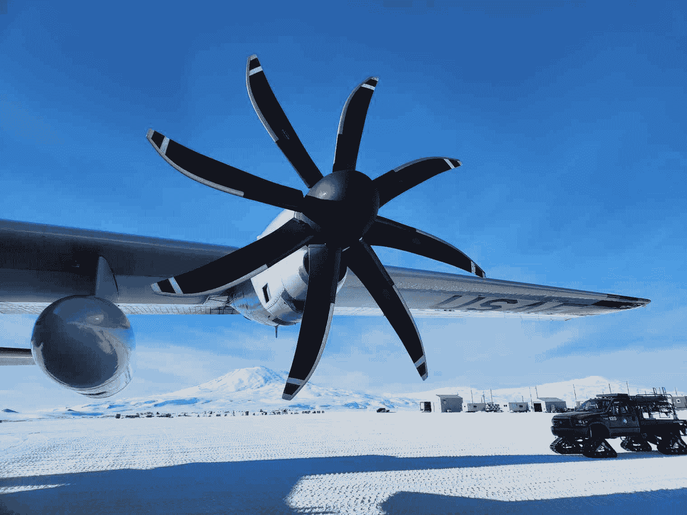</picture> *我们的LC-130停在麦克默多基地。*](/media/redeployment-part-three/lc130-mcmurdo-01.jpg)

从极点到基督城没有直达航班 —— 每个人都要经过麦克默多转机。

大多数时候，从南极极点出发的人必须在麦克默多待上几个小时，甚至几天。这取决于航班的安排和延误情况。试图安排“直通”航班，即在机场就转乘前往基督城的飞机，通常会因为天气或其他因素而受阻。有时候能成功，但大多数情况下都不行。

在我们的情况下，我们计划在第二天下午离开麦克默多，这意味着过夜留宿。

我们从威廉姆斯场到麦克默多的交通工具是“Delta”。这些是麦克默多目前仍在运行的最古老的客运车辆。从机场到城里的车程大约40分钟。

[<picture>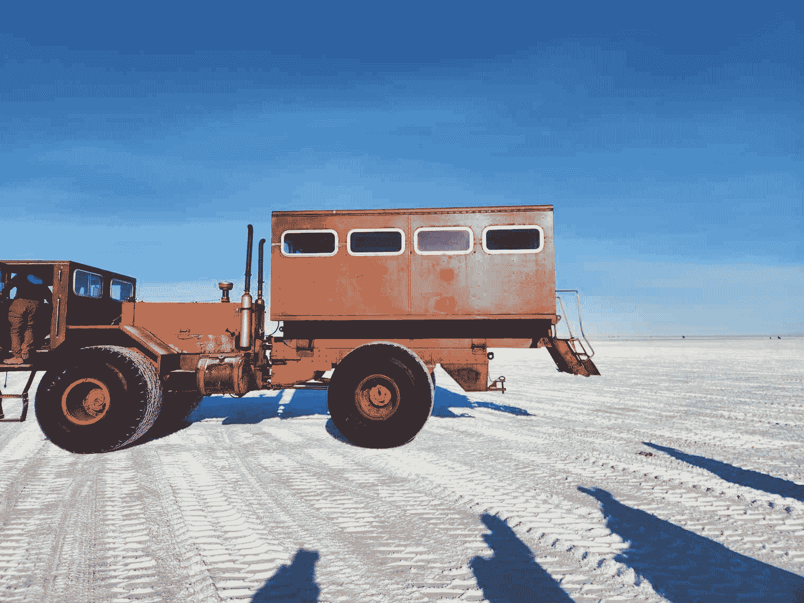</picture> *我们晚上进城的交通工具 -- 麦克默多最古老的人员运输车辆之一，“Delta”。*](/media/redeployment-part-three/delta-01.jpg)

当我们降落在麦克默多时，我们第一次呼吸到海平面的空气。在[海拔10,000英尺](/posts/pressure-altitude)生活了一年之后，突然到达海平面，你立刻能感觉到差异。最重要的是，你感觉自己像个超级英雄。空气又厚又富含氧气！这种感觉只能持续几天，但是这是一个很好的时机去麦克默多的任何远足。能够用这种新发现的、海平面的能量爬上观景山真是太有趣了。

[<picture>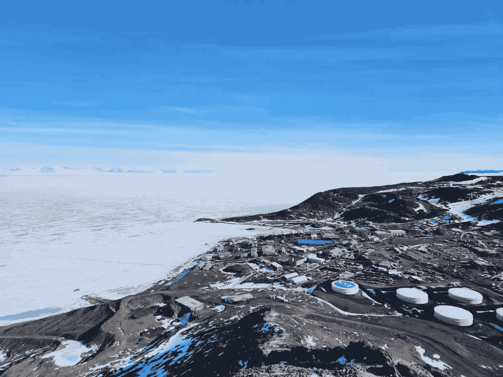</picture> *麦克默多的观景山，在我短暂的一天停留中。*](/media/redeployment-part-three/mcmurdo-observation-hill-01.jpg)

能够回到麦克默多真是太棒了，即使只有一天。我得以与上个夏季在麦克默多时期的朋友们见面。我们中的许多人从遥远的地方来到南极洲，不一定能在现实生活中再次见面。我尽量充分利用我在城里短暂停留的时间。

[<picture>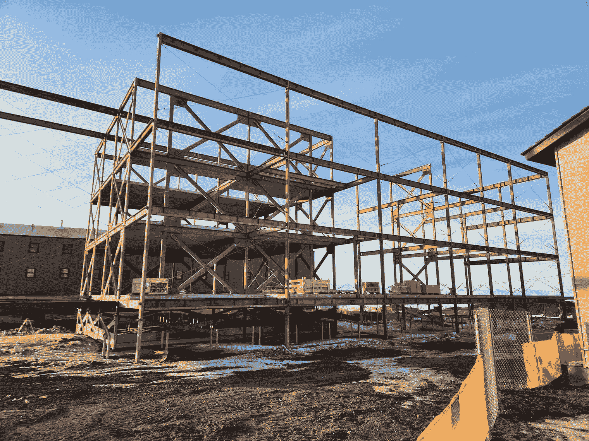</picture> *麦克默多的建设！在曾经的宿舍203处新建建筑的框架。当我去南极点时，这里还没有！*](/media/redeployment-part-three/mcmurdo-construction-01.jpg)

仍然身处南极洲，与朋友们再次见面，感觉非常超现实。我的大多数朋友已经离开，休假回来了，现在又*回来了*，进入了第二个季节。我甚至认识一些人，他们离开了，回来了，然后又*离开了*。与此同时，我仍然在大陆上。在经历了我第一个超长季节之后，我现在终于准备好离开了。

体验我所经历的方式在南极洲有其利与弊。我很幸运，能够在一个非常漫长的季节中尝试出该项目的大部分内容。我唯一没有看到的是主要的USAP南极站点，[Palmer Station](https://www.nsf.gov/geo/opp/support/palmerst.jsp)和[research vessels](https://www.nsf.gov/geo/opp/support/ships.jsp)，目前是R/V Laurence M. Gould和R/V Nathaniel B. Palmer。

我在[Winfly](/posts/mcmurdo-arrival)抵达南极洲，体验了麦克默多的冬季。冬季过渡到夏季，我有幸见证了麦克默多在温暖、阳光明媚和[muddy](/posts/mud-murdo)高峰季节的壮丽景色。我在夏季高峰期飞往了南极点，体验了站点为即将到来的冬季疯狂准备的繁忙混乱。当[最后一班飞机](/posts/last-flight-out)起飞时，站点为冬季放慢了节奏。在[sunset](/posts/sunset)之后，南极点进入了漫长的[极夜](/posts/polar-night)。我看到了南极点的[sunrise](/posts/redeployment-part-one)，也见证了站点为夏季重新开放的场景。现在，我终于回到了麦克默多，准备离开。

大多数人……不会一次做到所有这些。我很幸运，有机会让我这样做。我很幸运，我的生活环境恰好能够配合让我接受这一机会。14个月在冰上是很长的时间。离开朋友、家人和“现实生活”这么长时间，对一个奇特的地方做出承诺也是很长的时间。我不后悔抓住了这个机会。但是，对于考虑类似事情的人，请不要轻易做出这个决定。

# 凤凰空军基地

在2023年11月17日晚上，我离开了麦克默多。我前往凤凰空军基地，那里是我从南极乘飞机离开的地方。

我们去机场的路程完全不同 —— 我们乘坐了凯瑞斯号。凯瑞斯号是麦克默多最新的巨型运输车辆之一。它专为在远离的麦克默多地点之间移动几十人而设计。这些地点包括机场以及冰上的其他基础设施，如[长期气球项目（LDB）](https://www.nasa.gov/missions/scientific-balloons/nasa-scientific-balloons-ready-for-flights-over-antarctica/)站点。  

[<picture>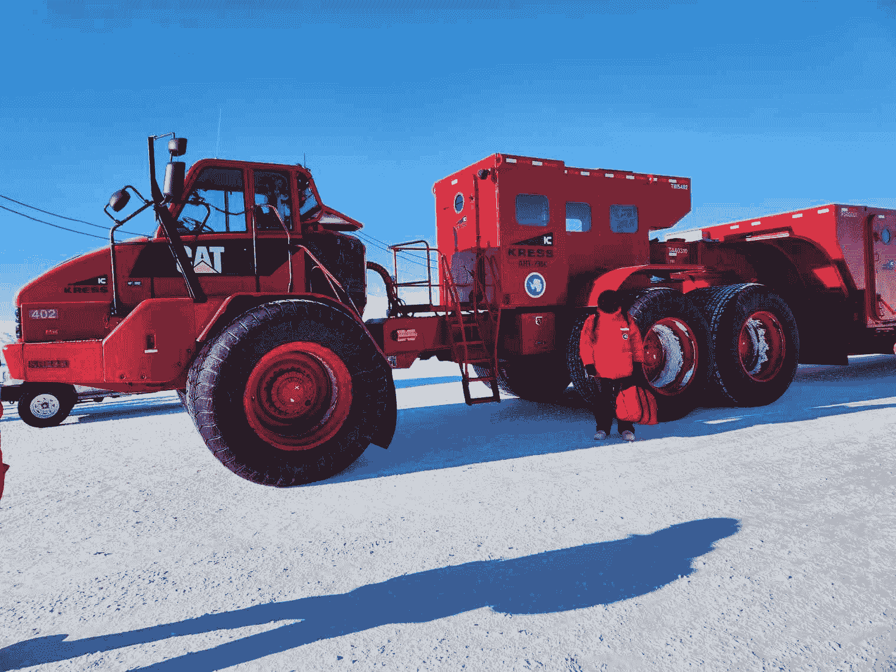</picture> *凯瑞斯号，我们前往凤凰机场的巨型运输车辆。作者身高6'2"，用于尺度比较。*](/media/redeployment-part-three/kress-01.jpg)  

[<picture>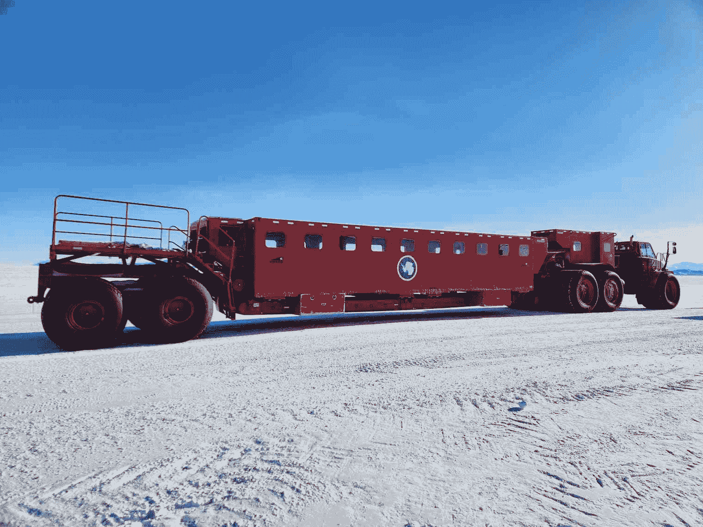</picture> *凯瑞斯号的另一视角，展示其巨大的客运舱。*](/media/redeployment-part-three/kress-02.jpg)  

这是我第一次在“白天”看到凤凰机场。回忆起2022年8月从基督城抵达麦克默多时，天色已经暗了。  

[<picture>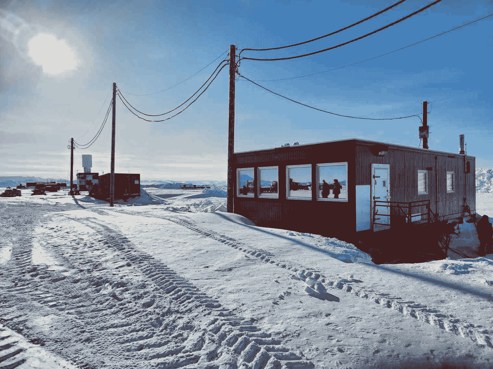</picture> *凤凰机场的旅客候机厅。*](/media/redeployment-part-three/phoenix-passenger-terminal-01.jpg)  

# 离开南极洲  

我们返回基督城的是意大利空军的C-130J。除了美国南极计划外，这个地区还有许多国家的南极计划。大多数计划将基督城作为他们的门户城市，凤凰机场则是他们的跨洲际南极跑道。共享基础设施在这里很常见。有时，美国南极计划会为其他国家的南极计划人员提供航班，反之亦然。  

[<picture>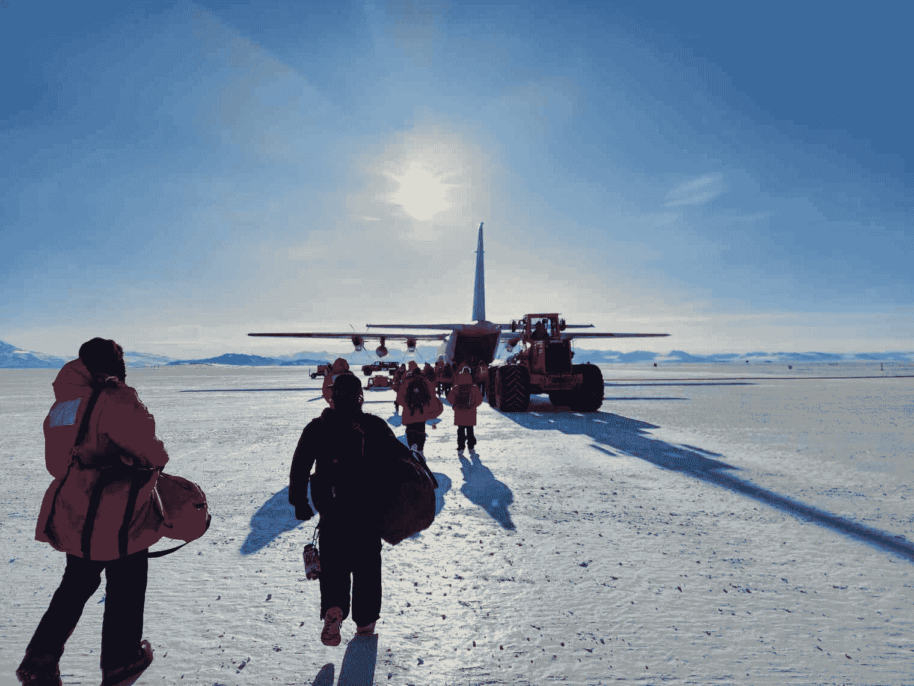</picture> *从麦克默多到基督城的意大利空军C-130J飞机上。*](/media/redeployment-part-three/italian-c130j-01.jpg)  

然后我们就出发了！我们于2023年11月17日晚上9点22分离开南极洲。这标志着自2022年8月28日抵达大陆以来的446天。  

多么一次奇妙的冒险！  

# 基督城  

2023年11月18日早上4点左右，我们的C-130J飞机抵达基督城国际机场。我们驶向卸货区域的行驶时间很短，但感觉像是一段漫长的时光。长途飞行使我们感到疲惫，但我们也因终于回到现实世界而兴奋不已。

那时天色已晚，但很温暖，最重要的是*湿润*。当我们走下飞机时，第一次超过一年，我们闻到了雨水、泥土和生物的气味。  

[<picture>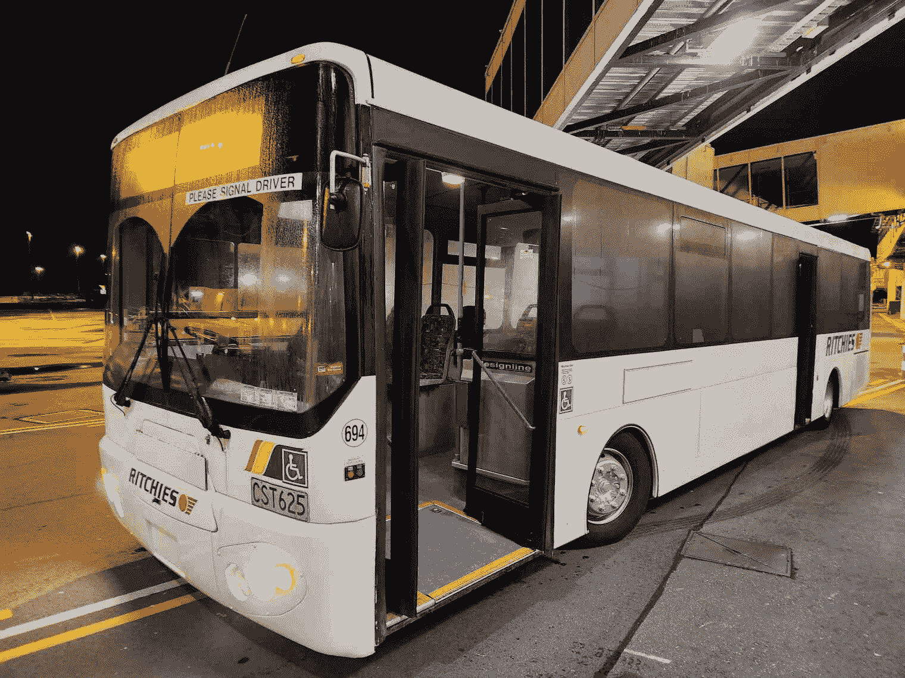</picture> *我们抵达基督城时看到的第一件事情 —— 一辆公共汽车，将我们带到机场。*](/media/redeployment-part-three/christchurch-bus-01.jpg)  

当你从南极抵达基督城时，你需要通关并完成入境手续。关于美国南极人员适用的新西兰移民法的具体细节远远超出了本文的范围。可以简单地说，首要任务是为我们所有人完成处理。

[<picture>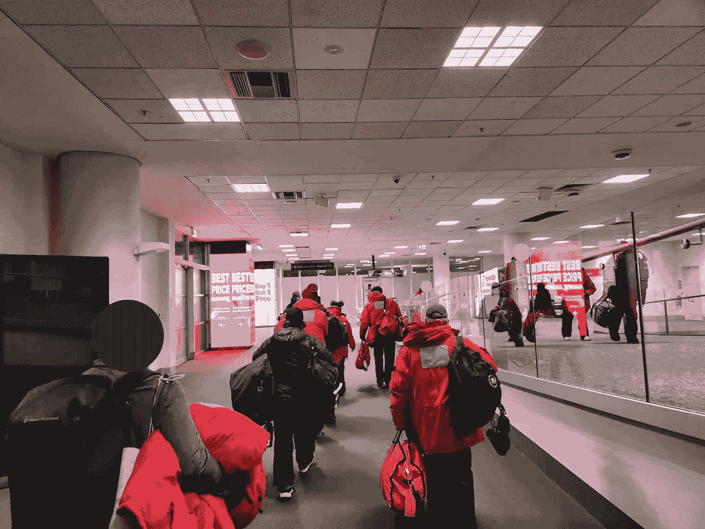</picture> *基督城机场，凌晨4:30，前往海关的路上。我们的第一个现实建筑。确实是一个超现实的重新进入现代社会。*](/media/redeployment-part-three/christchurch-customs-01.jpg)

表格上有一个部分询问*“您从哪个海外港口登上本次航班/船只？”* 在没有任何明确说明的情况下，我只写了“南极洲”。这是一个无关紧要的问题，因为我们有一位特别的海关代理为我们服务（海关通常在这个时间段不开放）。他们非常清楚我们都是从南极洲来的。

但是，当我想到这张表格存放在新西兰移民局的某个抽屉里时，我觉得有点好笑。确实，我们是从“海外”到达的。远远的海外，来自一个在我们的记忆中已经开始淡去的世界。*我们真的* ***刚刚*** *从* ***南极****来吗？*

[<picture>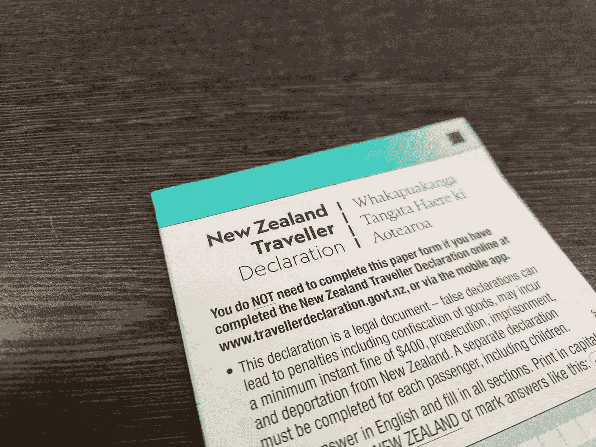</picture> *新西兰旅行者声明表。*](/media/redeployment-part-three/traveler-declaration-form-01.jpg)

海关过关后，我们前往美国南极项目的服装配发中心（CDC）。在我们出发去南极之前，我们都[领取了](/posts/flight-perhaps)极寒服装，并且现在我们已经完成任务，将其全部归还。这些服装是项目的财产，会进行清洗并重新分发给新的工作人员。

[<picture>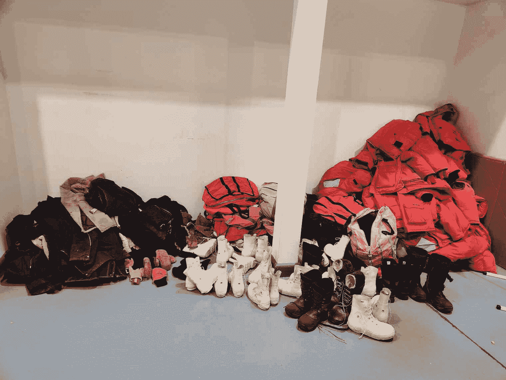</picture> *在基督城美国南极项目CDC归还我们发放的极寒服装（ECW）。*](/media/redeployment-part-three/clothing-pile-01.jpg)

最后，我们得到了我们的免费酒店预订信息。我们大多数人将在新西兰进行个人旅行。当然，这些旅行不是由项目支付的。项目为我们提供了一晚酒店住宿，让我们能够轻松适应并找到方向。这与那些直接回国的人享受的待遇相同，被称为“第一班机票”或“FAA”。

幸运的是，因为我们到达得太晚，我们得到了剩余的当晚（此时已经是早上5:30），以及随后的一晚。能够睡个懒觉真是太好了。

然后他们就放我们自由了。我们结束了。

[<picture>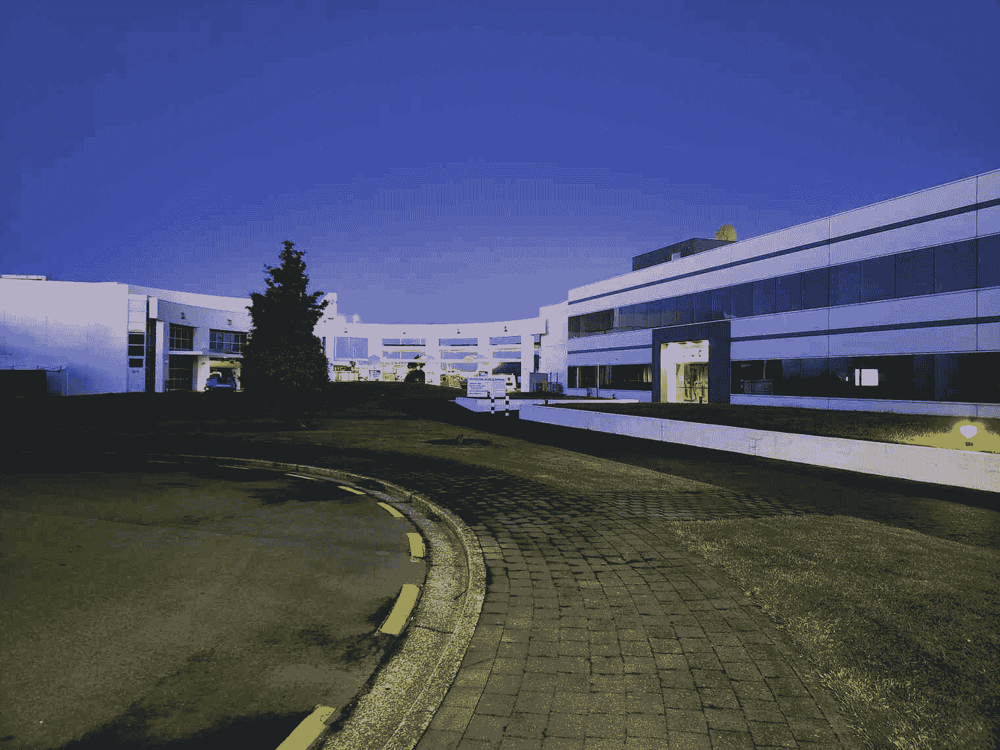</picture> *美国南极计划综合体在基督城。包括CDC以及其他支持和行政建筑。此照片摄于2023年11月18日清晨，我们刚刚归还了我们的ECW服装后。*](/media/redeployment-part-three/usap-complex-christchurch-01.jpg)

我们大家昏昏欲睡地排队在早上5:30在酒店登记入住。我们刚刚在一架军用飞机上度过了7个小时。我们离开了一个充满24小时阳光、穿着蓬松外套、到处都是美国南极计划标志的陌生地方。这已经是我们的现实超过一年了。

突然间，我们发现自己在机场酒店时尚的大堂里听着流行爵士乐，酒店接待员讲述着大陆式早餐、退房时间、酒店WiFi密码、公共交通以及城市周围的景点。

[<picture>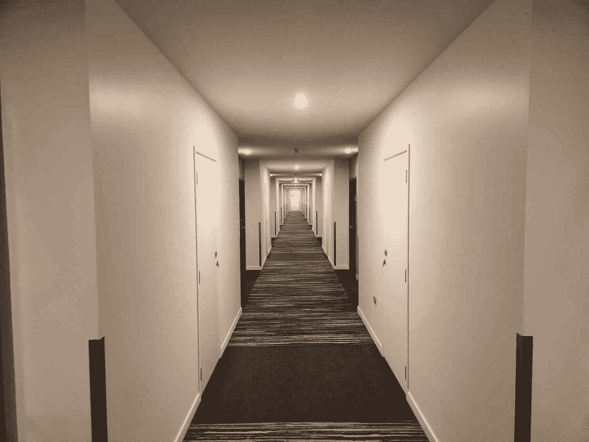</picture> *我住的酒店走廊。这是现实吗？我真的在南极度过了14个月吗？*](/media/redeployment-part-three/hotel-hallway-01.jpg)

我们回到了文明社会，回到了真实世界。对于南极支持人员来说，我们的合同在我们降落在基督城的那天结束。我们立即停止领取薪水。我们的健康保险费用一直支付到月底。我从在南极生活和工作，来到基督城的酒店，然后…… *就是这样*。我突然独自一人，在基督城度假。

[<picture>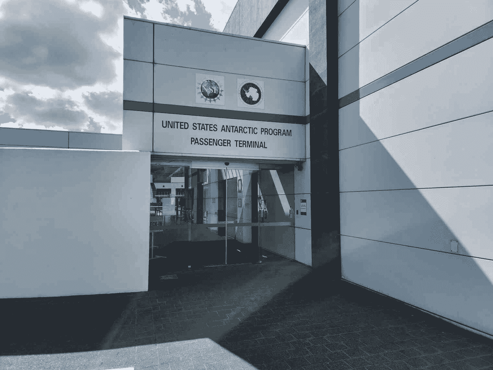</picture> *第二天回来，拍摄南极旅客终端的快照，白天时分。*](/media/redeployment-part-three/christchurch-passenger-terminal-01.jpg)

[<picture>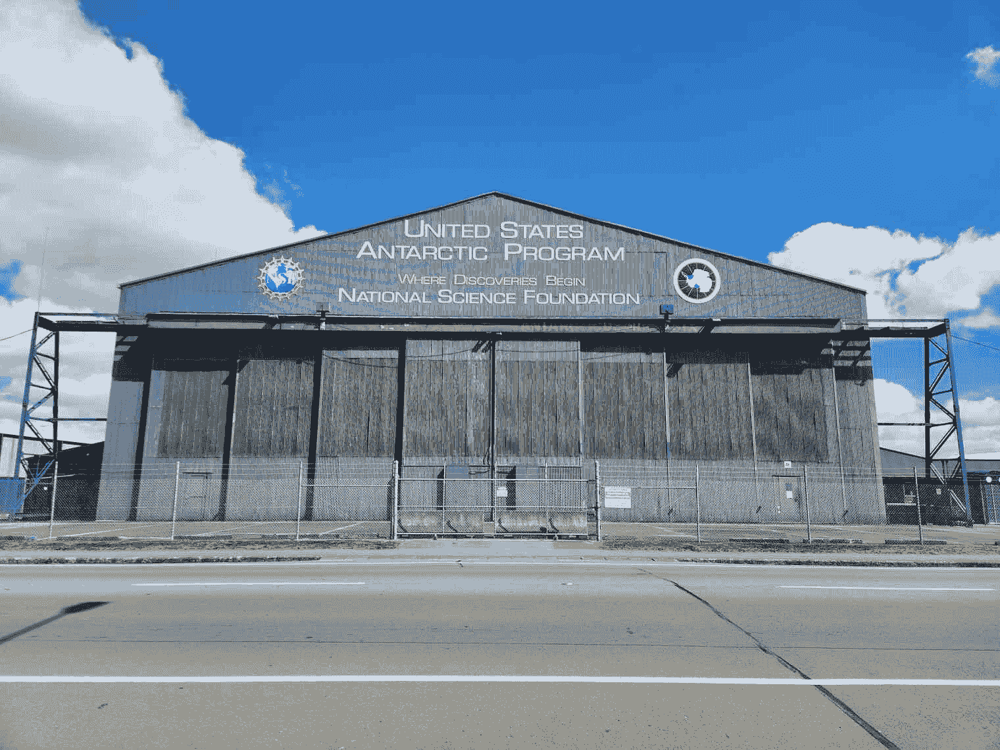</picture> *美国南极计划在基督城的仓库。*](/media/redeployment-part-three/christchurch-warehouse-01.jpg)

# 个人旅行

我在新西兰的闲暇时光里，不停地享用新鲜水果和蔬菜。我平均每天喝三杯由新鲜咖啡和真正牛奶制成的拿铁。

[<picture></picture> *真实生活，真正的咖啡。新鲜咖啡豆，新西兰新鲜牛奶。在经历了14个月的过期咖啡豆和奶粉后，纯粹的幸福感。*](/media/redeployment-part-three/new-zealand-latte-01.jpg)

[<picture>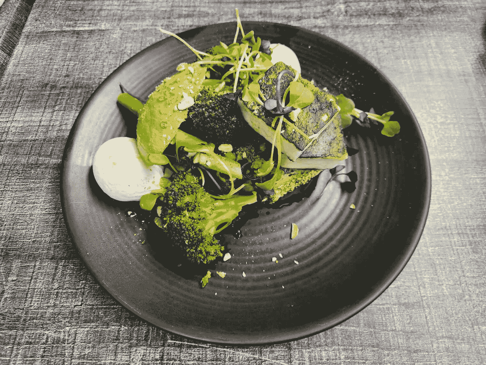</picture> *在基督城美味丰盛的新鲜食品，在南极长时间未见的食物后。*](/media/redeployment-part-three/christchurch-fresh-food-01.jpg)

我那透明的南极皮肤，整个季节在黑暗中度过，通常都穿着30磅的衣物，然而，第一次接触新西兰的阳光后并没有幸免于不适。我几乎立刻被晒伤了。

[<picture>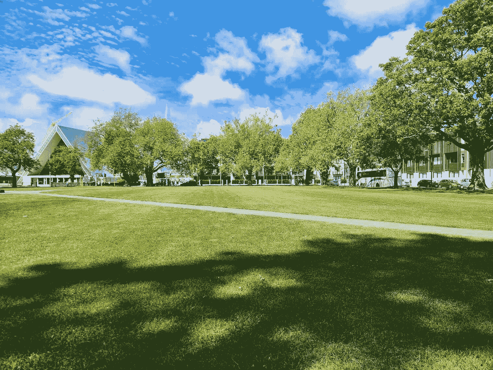</picture> *阳光、温暖、蓝天、树木和鸟儿。在克赖斯特彻奇随意漫步。*](/media/redeployment-part-three/christchurch-sun-01.jpg)

克赖斯特彻奇（Christchurch）和现实生活很快就变得*正常*，即使离开那么久也是如此。我们一群人聚餐。我们在一家餐馆吃饭，去了酒吧，叫了辆出租车，穿梭于日常城市生活中。我们坐火车。我们穿越山脉和森林徒步旅行。我们在海滩上放松。

[<picture>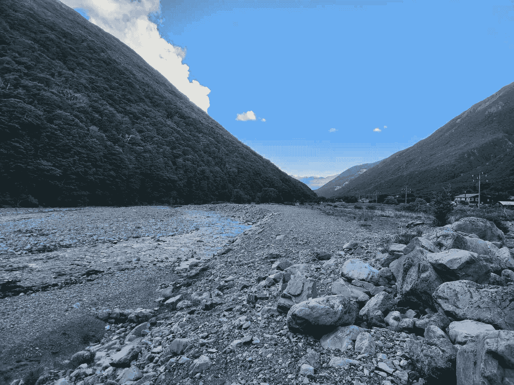</picture> *新西兰亚瑟通道的一条小溪。*](/media/redeployment-part-three/arthurs-pass-stream-01.jpg)

[<picture>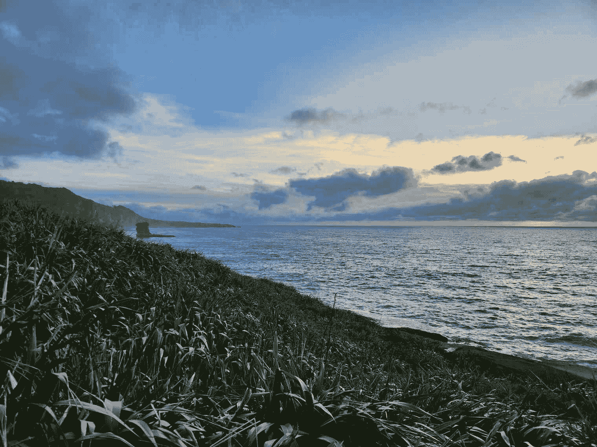</picture> *新西兰蒲纳凯基的日落。*](/media/redeployment-part-three/sunset-punakaiki-01.jpg)

[<picture>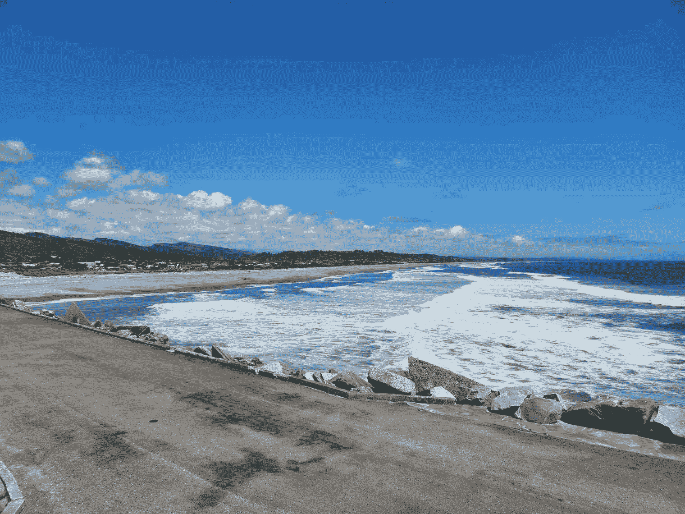</picture> *新西兰格雷茅斯的海景。*](/media/redeployment-part-three/greymouth-01.jpg)

# 旧金山

在新西兰经历了两周急需的休息和放松后，我乘飞机回到了旧金山。这次航班是由项目支付的，履行他们的最后义务，将我送回我的出发机场（AOD）。12月1日，我中午12点离开克赖斯特彻奇。多亏时区的魔力，我也在同一天12月1日早上7点抵达了旧金山。

[<picture>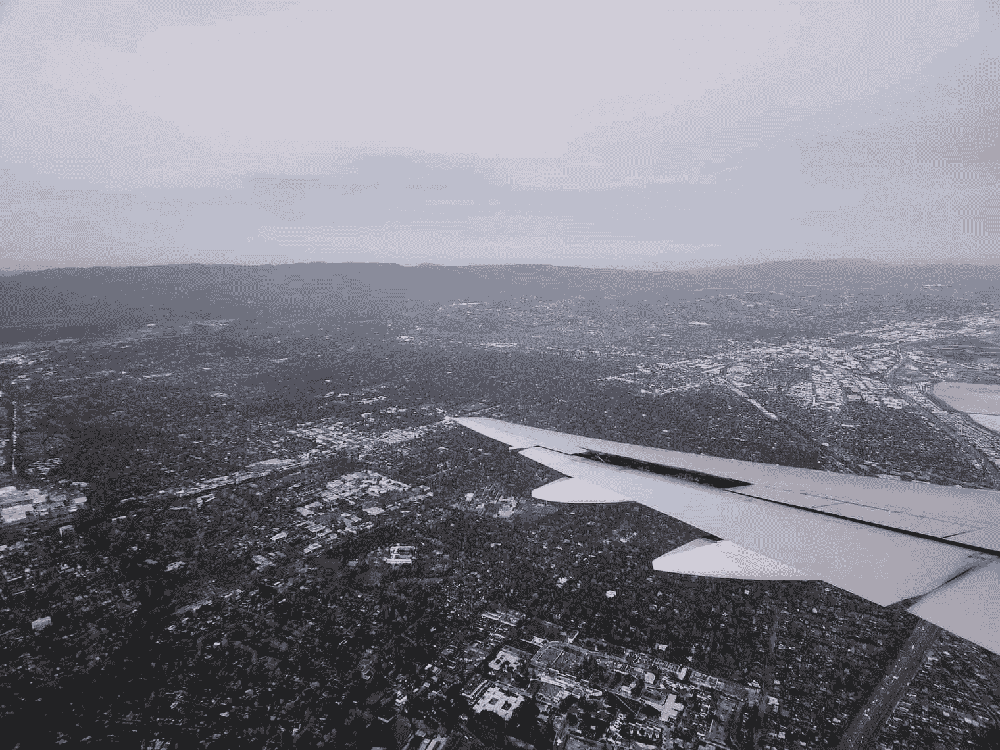</picture> *2023年12月1日早上6:48，降落到旧金山国际机场。*](/media/redeployment-part-three/san-francisco-01.jpg)

我着陆了，然后乘坐[BART](https://www.bart.gov/)回家到我的公寓。

[<picture>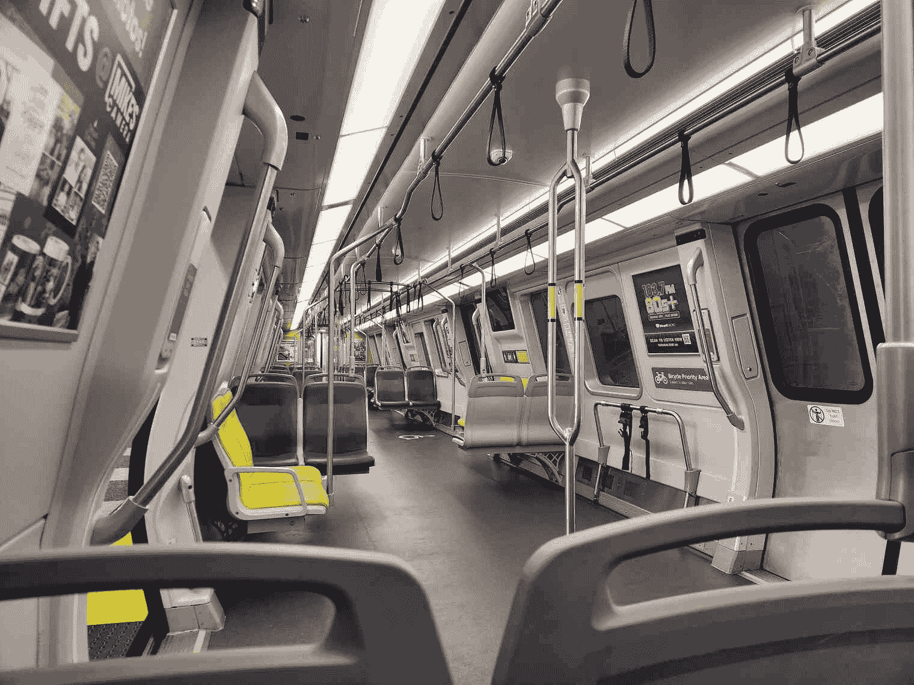</picture> *从机场乘坐BART回家的路上。*](/media/redeployment-part-three/bart-01.jpg)

我的公寓就像我离开之前一样，那是在我开始这段疯狂旅程之前，即2022年8月12日，当我[离开旧金山](/posts/travel-begins)前往克赖斯特彻奇、南极洲和我生活中最奇怪的16个月的时候。

令我惊讶的是…… 回到现实生活中感觉如此*正常*。我刚刚度过了在冰上的*14.5个月*。在*一年多*的时间里，我工作、吃饭、睡觉、洗澡、放松、笑和哭，所有这些都受联邦政府机构及其指定承包商的支配，几乎都在世界尽头的一个小而孤立的地方。我们确实有个人的自主权，但是在一个定义好的框架内。

有时我会意识到，自16个月前离开家以来，我第一次做某件事情。第一次加油。第一次按门铃。第一次去杂货店。第一次游泳。每一次都带来一种小小的新奇感，但并没有多少影响。我需要有意识地努力记住，我已经16个月没有加油了。感觉很正常。

我回到了我的现实生活，尽管在南极期间将其搁置了下来，但当我回来时，它等着我。南极是一个完全不同的世界，与我正常的现实生活截然不同。它如此不同，以至于我根本无法将这两个现实融合为一体。我有我的现实生活，也有我的南极生活。当我的南极生活结束时，我又回到了我的现实生活。

# 结论

希望大家喜欢跟随这段旅程。我肯定是享受写这段经历的。

说实话，当我开始写这个博客时，我的观众大约只有6个人，那些是我在家乡的朋友和家人。到了2022年11月的某个时候，这个博客突然受到了欢迎。我没有料到会这样，但写下这些给很多人带来了乐趣。

感谢一路上所有与我联系的人。有人从其他南极站写信给我。有人讲述了他们过去数年或数十年的南极历险。那些即将前往麦克默多和南极的人也联系我寻求建议。

因此，我要和大家分享我整个季节拍摄的最喜欢的照片。这张照片是2023年5月8日拍摄于A1舱室甲板的后面。它展示了我们的电站和所有的后院建筑。左边刚好超出镜头范围是地理南极点标志。当时气温是-70°F。唯一的光源来自月亮。如果你走出基地几百英尺，周围一片寂静。距离最近的下一个有人居住的站点有数百英里之遥。这确实是一个完全不同的世界，我很幸运能够体验到。

[<picture>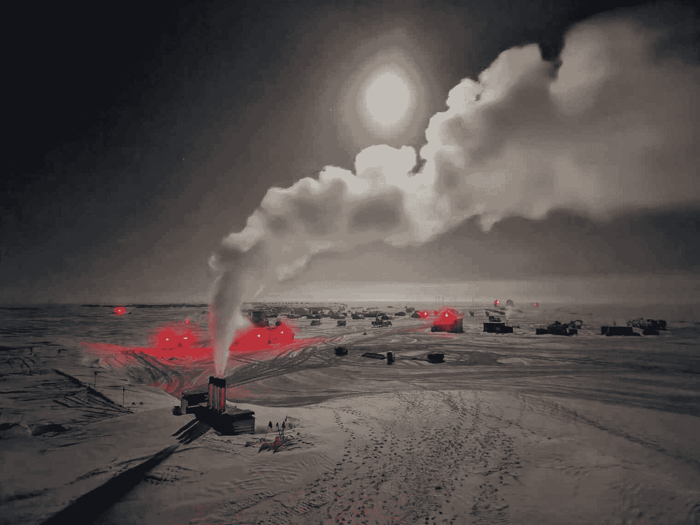</picture> *南极冬季2023年的后院。*](/media/redeployment-part-three/pole-winter-01.jpg)

*这是一个三部曲的第三部分，也是最后一部分。如果你还没有看过，可以查看[第一部分](/posts/redeployment-part-one)和[第二部分](/posts/redeployment-part-two)。*
