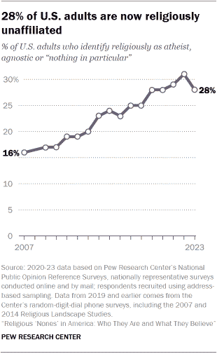
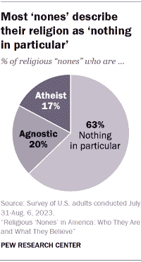
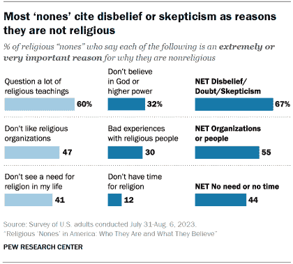
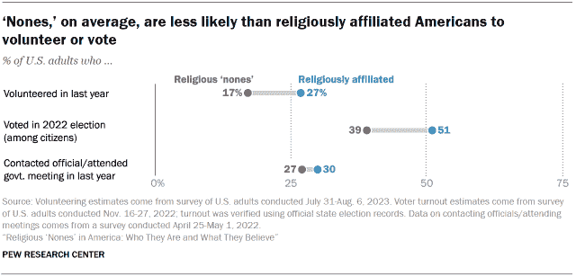
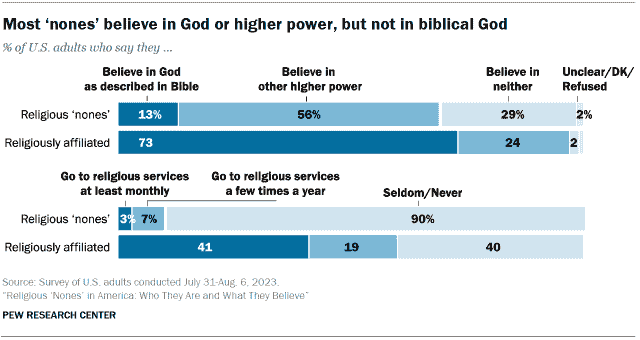
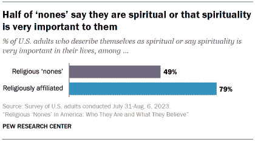
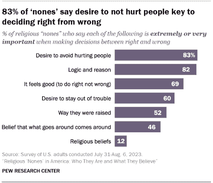

<!--yml
category: 未分类
date: 2024-05-27 14:30:13
-->

# Religious ‘Nones’ in America: Who They Are and What They Believe | Pew Research Center

> 来源：[https://www.pewresearch.org/religion/2024/01/24/religious-nones-in-america-who-they-are-and-what-they-believe/](https://www.pewresearch.org/religion/2024/01/24/religious-nones-in-america-who-they-are-and-what-they-believe/)

## A closer look at how atheists, agnostics and those who describe their religion as ‘nothing in particular’ see God, religion, morality, science and more

(Getty Images)

Pew Research Center conducted this analysis to provide a detailed portrait of religiously unaffiliated adults in the United States.

Much of this profile comes from a survey we conducted July 31-Aug. 6, 2023, among 11,201 respondents who are members of the Center’s American Trends Panel (ATP). The survey included interviews with a total of 3,317 religious “nones” – 658 atheists, 678 agnostics and 1,981 respondents who describe their religion as “nothing in particular.”

The ATP is an online survey panel that is recruited through national random sampling of residential addresses, which gives nearly all U.S. adults a chance of selection. The survey is weighted to be representative of the U.S. adult population by gender, race, ethnicity, political party, education, religious affiliation and other categories. For more, refer to the [ATP’s methodology](https://www.pewresearch.org/methods/u-s-survey-research/american-trends-panel/) and the [methodology for the report](https://www.pewresearch.org/religion/2024/01/24/religious-nones-methodology/).

In addition to the July 31-Aug. 6, 2023, survey, this analysis also draws on other ATP surveys conducted in recent years, as well as on the Center’s [National Public Opinion Reference Surveys (NPORS)](https://www.pewresearch.org/methods/fact-sheet/national-public-opinion-reference-survey-npors/).

Here are the [survey questions being published for the first time as part of this report](https://www.pewresearch.org/religion/wp-content/uploads/sites/7/2023/12/PR_2024.01.religious-nones_TOPLINE.pdf). Other questions discussed in this report were published previously.

Today, about [28% of U.S. adults are religiously unaffiliated](https://www.pewresearch.org/methods/fact-sheet/national-public-opinion-reference-survey-npors/), describing themselves as atheists, agnostics or “nothing in particular” when asked about their religion.

At Pew Research Center, we get lots of questions about this group, often called the “nones.” What do “nones” believe? Are they opposed to religion? What are their views about science? Is their growth good or bad for society, and why?

Our survey data shows:

*   Most “nones” believe in God or another higher power. But very few go to religious services regularly.
*   Most say religion does some harm, but many also think it does some good. They are not uniformly *anti*-religious.
*   Most “nones” reject the idea that science can explain everything. But they express more positive views of science than religiously affiliated Americans do.

[Surveys](https://www.pewresearch.org/religion/2022/10/27/45-of-americans-say-u-s-should-be-a-christian-nation/) have [consistently shown](https://www.pewresearch.org/religion/2012/07/26/section-2-religion-and-politics/#influence-on-american-life) that many Americans view religion’s declining influence in society as a bad thing. “Nones” tend to vote less often, do less volunteer work in their communities and follow public affairs at lower rates than religiously affiliated people do.

But the latest data shows that on a variety of measures, lower rates of civic engagement are concentrated among “nones” whose religion is “nothing in particular.” Atheists and agnostics tend to participate in civic life at rates matching or exceeding religiously affiliated people.

***Related: [Has the rise of religious ‘nones’ come to an end in the U.S.?](https://www.pewresearch.org/short-reads/2024/01/24/has-the-rise-of-religious-nones-come-to-an-end-in-the-us/)***

Here are eight of the questions we receive most often, along with brief responses. Click the links for more information, including discussion of differences *within* the population of “nones” (for example, how “nones” who are men compare with those who are women) and *between* “nones” and U.S. adults who identify with a religion.

### Q1: Who are the ‘nones’? How are they defined?

In public opinion surveys, people who answer a question about their religion by saying they are atheist, agnostic or “nothing in particular” are combined into a category called “religiously unaffiliated” – now widely known as the “nones.” Scholars of religion in the U.S. have been using the term “nones” since at least the 1960s, and its use has grown common in social scientific journals and the media.

In our latest data, 17% of “nones” identify as atheist, 20% say they are agnostic and 63% choose “nothing in particular.”

Atheists and agnostics, on average, have more education than religiously affiliated Americans. By contrast, people who describe their religion as “nothing in particular” tend to have *lower* levels of educational attainment than religiously affiliated U.S. adults.

*[Jump to more information on the demographics of “nones.”](https://www.pewresearch.org/religion/2024/01/24/who-are-the-nones-how-are-they-defined/)*

### Q2: Why are ‘nones’ nonreligious?

When asked directly why they are not religious, two-thirds of “nones” say they question a lot of religious teachings or don’t believe in God.

Many also bring up criticisms of religious institutions or people, including 47% who say that one extremely or very important reason why they are not religious is that they dislike religious organizations. And 30% say bad experiences they’ve had with religious people help explain why they are nonreligious.

*[Jump to more information on why “nones” say they are nonreligious.](https://www.pewresearch.org/religion/2024/01/24/why-are-nones-nonreligious/)*

### Q3: Are ‘nones’ less involved in civic life than people who identify with a religion?

By a variety of measures, religious “nones” are less civically engaged and socially connected than people who identify with a religion. On average, they are less likely to vote, less likely to have volunteered lately, less satisfied with their local communities and less satisfied with their social lives.

But on some related questions, the differences between “nones” and religiously affiliated people are modest. For example, 27% of “nones” and 30% of religiously affiliated Americans say they have contacted an elected official or attended a government meeting in the past year.

Moreover, lower levels of civic engagement tend to be found especially among “nones” who describe their religion as “nothing in particular” – not among atheists and agnostics. For example, atheists and agnostics turned out to vote in 2022 at rates rivaling those seen among religiously affiliated adults. Those who describe their religion as “nothing in particular” were the only subset of “nones” with lower voter turnout than religiously affiliated people.

And on some measures, attendance at religious services (not religious affiliation alone) is the key differentiator between people who are most civically involved and those who are not. For instance, religiously affiliated people who attend religious services at least once a month volunteer at much higher rates (41%) than *both* religiously affiliated people who don’t attend services regularly (17%) *and* “nones” (also 17%).

In other words, on some measures, it’s not whether a person identifies with a religion (or not) but whether they *actively take part* in a religious community that best predicts their level of civic engagement. In short, the link between religious disaffiliation and civic engagement is complicated.

[*Jump to read more about “nones” and their civic engagement.*](https://www.pewresearch.org/religion/2024/01/24/are-nones-less-involved-in-civic-life-than-people-who-identify-with-a-religion/)

### Q4: Are all ‘nones’ nonbelievers?

No, not all “nones” are nonbelievers. They are far less likely than religiously affiliated Americans to say they believe in God “as described in the Bible,” but most do believe in God or some other higher power. Just 29% reject the notion that there is *any* higher power or spiritual force in the universe.

Most “nones” say they were raised in a religion, usually Christianity. Yet today, they tend to be disconnected from religious institutions. Not only have they shaken off religious *labels*, they also have largely shaken off involvement in churches, synagogues, mosques and other religious organizations.

For example, fully 90% of religious “nones” say they seldom or never go to religious services.

[*Jump to more details about the religious beliefs and practices of “nones.”*](https://www.pewresearch.org/religion/2024/01/24/are-all-nones-nonbelievers/)

### Q5: Are ‘nones’ spiritual instead of religious?

[Some “nones” are indeed spiritual](https://www.pewresearch.org/religion/2023/12/07/measuring-spirituality/). About half say spirituality is very important in their lives or say they think of themselves as spiritual. Most “nones” believe animals other than humans can have spirits or spiritual energies – and many say this is true of parts of nature, such as mountains, rivers or trees.

But these spiritual identities and beliefs are not unique to “nones.” In fact, by many measures, people who identify with a religion tend to be just as spiritual, or even more spiritual, than “nones.”

[*Jump to more information about spirituality among “nones.”*](https://www.pewresearch.org/religion/2024/01/24/are-nones-spiritual-instead-of-religious/)

### Q6: Are ‘nones’ hostile toward religion?

Some “nones” have a very negative view of religion, but “nones” on the whole express mixed views rather than outright hostility.

Most say religion causes a variety of problems in society – like intolerance or superstition. But many “nones” also say that religion helps give people meaning and purpose, and that it can encourage people to treat each other well.

Overall, 43% of “nones” say religion does more harm than good in society, while 14% say it does more good than harm; 41% say religion does equal amounts of good and harm.

[*Jump ahead to read more on how “nones” view religion.*](https://www.pewresearch.org/religion/2024/01/24/are-nones-hostile-toward-religion/)

### Q7: How do ‘nones’ view science?

Most “nones” say science does more good than harm in American society, and on average “nones” are much more positive about science than are religiously affiliated people.

At the same time, most “nones” believe there are limits to what science can do. For example, 44% of “nones” say there is a scientific explanation for everything, while 56% say there are some things science can’t possibly explain.

*[Read more details about how “nones” view science.](https://www.pewresearch.org/religion/2024/01/24/how-do-nones-view-science/)*

### Q8: How do ‘nones’ think about morality?

The vast majority of “nones” say it is possible to be moral and have good values without believing in God. Most religiously affiliated people agree, though by a smaller margin.

When asked how they decide between right and wrong, 83% of “nones” say the desire to avoid hurting other people is a key factor. And 82% of “nones” say logic and reason are extremely or very important when they decide between right and wrong.

*[Read more on how “nones” think about morality.](https://www.pewresearch.org/religion/2024/01/24/how-do-nones-think-about-morality/)*

Much of the analysis in this report comes from a Pew Research Center survey conducted July 31-Aug. 6, 2023, among 11,201 respondents who are members of the Center’s American Trends Panel (ATP). The survey included interviews with 3,317 religious “nones” (658 atheists, 678 agnostics and 1,981 respondents who describe their religion as “nothing in particular”).

In addition to the July 31-Aug. 6, 2023, survey, this analysis also draws on a variety of other [ATP surveys](https://www.pewresearch.org/our-methods/u-s-surveys/the-american-trends-panel/) conducted in recent years, as well as on the Center’s [National Public Opinion Reference Surveys (NPORS)](https://www.pewresearch.org/methods/fact-sheet/national-public-opinion-reference-survey-npors/).

**Explore the questions above in more detail:**

*   Who are the ‘nones’? How are they defined? ([Chapter 1](https://www.pewresearch.org/religion/2024/01/24/who-are-the-nones-how-are-they-defined/))
*   Why are ‘nones’ nonreligious? ([Chapter 2](https://www.pewresearch.org/religion/2024/01/24/why-are-nones-nonreligious/)) 
*   Are ‘nones’ less involved in civic life than people who identify with a religion? ([Chapter 3](https://www.pewresearch.org/religion/2024/01/24/are-nones-less-involved-in-civic-life-than-people-who-identify-with-a-religion/)) 
*   Are all ‘nones’ nonbelievers? ([Chapter 4](https://www.pewresearch.org/religion/2024/01/24/are-all-nones-nonbelievers/)) 
*   Are ‘nones’ spiritual instead of religious? ([Chapter 5](https://www.pewresearch.org/religion/2024/01/24/are-nones-spiritual-instead-of-religious/)) 
*   Are ‘nones’ hostile toward religion? ([Chapter 6](https://www.pewresearch.org/religion/2024/01/24/are-nones-hostile-toward-religion/)) 
*   How do ‘nones’ view science? ([Chapter 7](https://www.pewresearch.org/religion/2024/01/24/how-do-nones-view-science/)) 
*   How do ‘nones’ think about morality? ([Chapter 8](https://www.pewresearch.org/religion/2024/01/24/how-do-nones-think-about-morality/))