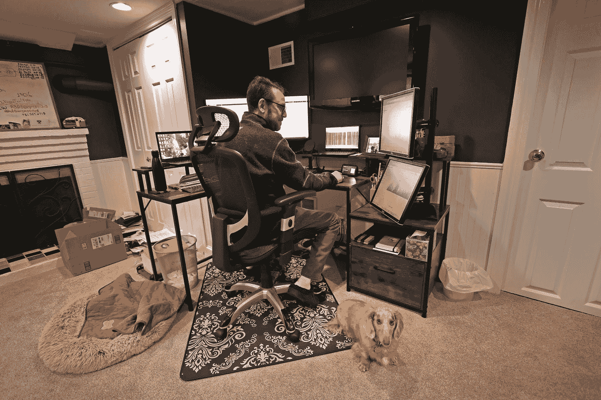

<!--yml

category: 未分类

date: 2024-05-27 14:31:10

-->

# 改造您的家庭以实现净零和不使用化石燃料

> 来源：[https://www.bostonglobe.com/2024/01/30/science/net-zero-home-renovation/](https://www.bostonglobe.com/2024/01/30/science/net-zero-home-renovation/)

他的第一步是在2019年安装太阳能电池板。

Upfront cost: $39,000

Savings: 来自联邦激励措施的30%，即$11,700，加上额外的$1,000州税收抵免。

Final cost: $26,300

Payback: 每年$4,500

预计系统回收成本：5.5年

Source: Mathew Tuttelman, Energy Star, Mass. Department of Revenue

下一步计划：在他的地下室安装家庭电池，以便在停电时为家庭提供电力。去年，由于这个系统，Tuttelman一家在36小时的停电期间过得非常舒适。

Upfront cost: $23,000

贷款：以七年零利率借款的形式借到了资金

预计系统回收成本：3.5年

Source: Mathew Tuttelman

然后他对家进行了隔热处理，形成密封，防止热量逸出。

Upfront cost: $3,300

Savings: Mass Save支付了75%的费用。

Final cost: $740.

Source: Mathew Tuttelman, Mass Save

最后一步是，放弃燃气炉，并用两台[地源热泵](https://www.energy.gov/energysaver/geothermal-heat-pumps)替换，这些热泵利用地下的温度，在冬季将热量传递到家中，温度在[45到75华氏度](https://www.energy.gov/eere/articles/5-things-you-should-know-about-geothermal-heat-pumps)之间取决于位置。然后在夏季，当地下地面比空气更凉时，系统反向运行。

Upfront cost: $50,000

Savings: 来自Mass Save的$15,000，然后华盛顿特区提供的30%税收抵免，再额外减少$10,500

Final cost: $24,500

预计系统回收成本：7-8年

Source: US Inflation Reduction Act, Mass Save

去年，[Dandelion Energy](https://dandelionenergy.com/)的团队在Tuttelman先生的院子里钻了两个直径5英寸、深350英尺的地源热系统钻孔。然后，该公司通过地下室将这些钻孔连接到他的房子。水和防冻液在管道中流动，进行热交换。

“这看起来像是一个毫无疑问的选择，” Tuttelman说道。“一种更好的技术，不使用化石燃料，更高效，而且有人会支付超过一半的费用。”

整个家庭项目的总价约为$75,000，包括折扣后。但是Tuttelman表示，通过节能成本的节省，它将在大约六年内收回投资。

其他好处包括无需猜测炉子是否快报废所带来的压力节省。根据美国能源部的说法，地源热泵的地下基础设施可以运行[25到50年](https://www.energy.gov/sites/prod/files/guide_to_geothermal_heat_pumps.pdf)。

Mathew Tuttelman和他的狗Oliver通过智能手机控制家里的温度，并在地下室办公室里设置监视器，跟踪家庭内热量和电力使用的起伏。David L. Ryan/Globe Staff

他采取的步骤累计起来，Tuttelman距离住在完全净零家庭的目标很近。他仍然希望安装[新窗户](https://www.masssave.com/-/media/Files/PDFs/Save/Residential/rebate-forms/Mass-Save-Windows-Rebate-Form.pdf)，以降低能源需求，并摆脱使用天然气的热水系统。为此，他需要安装[热泵热水器](https://www.eversource-ma.com/heat-pump-water-heater/?utm_source=google&utm_campaign=MA_HVAC_Electric-EGMA_23&utm_medium=cpc&utm_content=Heat%20Pump:%20Water%20Heater%20(Exact)&utm_term=heat%20pump%20water%20heater&gad_source=1&gclid=CjwKCAiAzc2tBhA6EiwArv-i6Q9gopx-drzn33Z5utl7pTf3RATE8aRHO48HoQTMMvfi5yAedNhw5xoCwQ4QAvD_BwE)。

John Sterman，麻省理工学院斯隆管理学院的教授，专注于可持续发展，八年前实现了净零目标。他位于列克星敦的1920年代老房子需要更新，但斯特曼决定不仅仅“升级和翻新”，而是“深入进行翻新”的增量成本是正确的选择。

[深度能源翻新](https://www.gsa.gov/climate-action-and-sustainability/greening-federal-buildings/deep-energy-retrofits)通过“整体系统方法”提升家庭的可持续性和环境足迹。

Sterman说，他问自己哪些行动会有最大回报，然后从那里开始。例如，他家里20世纪20年代的原始窗户状况不佳，所以他决定加固建筑外壳，结果是窗台更宽了，这样他还可以展示丰富的植物收藏品。

初始成本：根据质量、尺寸和设计的不同，差异很大。

预计节省：年度能源账单可降低7至15%。

联邦税收抵免：在一个课税年度内，升级窗户可获得高达600美元（或产品成本的30%）的抵免。

州政府回扣：根据Energy Star标准，Mass Save提供每个窗户75美元的回扣。

资料来源：Energy Star, Mass Save

他翻新的家现在包括空气源热泵和太阳能电池板，产生的能源比需要的多大约40%，全部不使用化石燃料。“我的房子现在是一个发电厂，”他喜欢说。

他估计，如果没有进行翻新，他的年度天然气和电费将约为3200美元。相反，他通过多余的太阳能电力生产获得约3375美元的收入，此外还可以免费给两辆车充电。

平均安装成本：根据Mass Save的数据，为3200美元。

预计节省：根据能源部的数据，中等规模的家庭每年可节省410美元。

联邦税收抵免：项目成本的 30%，最高可达 $2,000。

州政府回扣：Mass Save 提供每单位高达 $750 的回扣。

来源：Energy Star, Mass Save

Sterman 承认他有能力负担这些投资，但他表示自从安装以来，经济状况发生了巨大变化 — 补贴、[税收抵免](https://www.energystar.gov/about/federal_tax_credits)、租赁和贷款使得太阳能电池板和热泵的价格大大降低。虽然决定迈出这一步可能令人生畏，不论是前期成本还是时间投入，但他表示人们应该“考虑成本和收益，而不仅仅是成本本身”。

在他的家中：冬天不再有寒冷区域、冰坝或冻结管道的风险。通过移除暖气片，他获得了更多的空间。由于不再使用化石燃料做饭，他的家人不再暴露于可能引起呼吸问题的污染物。

“这比以前更安全、更舒适、更安静、更宽敞，” Sterman 说道。“所有这些好处都是深度能源翻新的一部分。”

* * *

欲联系 Alexa Coultoff，请发送电子邮件至 [alexa.coultoff@globe.com](mailto:alexa.coultoff@globe.com)。关注她的 Twitter [@alexacoultoff](https://www.twitter.com/alexacoultoff)。
