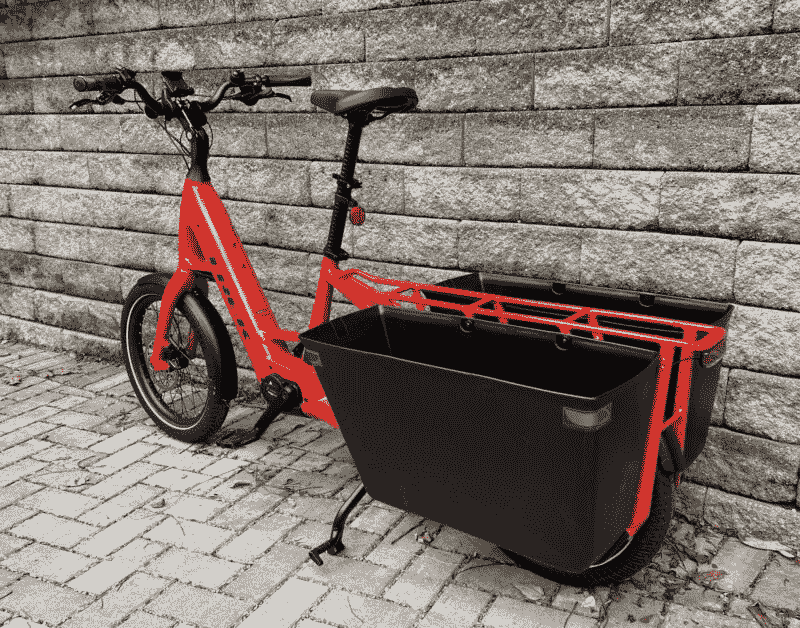
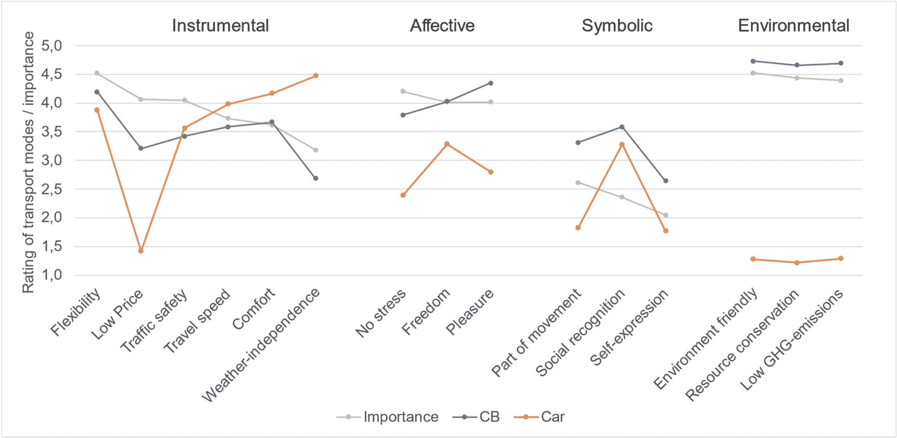

<!--yml
category: 未分类
date: 2024-05-29 12:51:58
-->

# Study finds that once people use cargo bikes, they like their cars much less | Ars Technica

> 来源：[https://arstechnica.com/cars/2024/01/study-finds-that-once-people-use-cargo-bikes-they-like-their-cars-much-less/](https://arstechnica.com/cars/2024/01/study-finds-that-once-people-use-cargo-bikes-they-like-their-cars-much-less/)

[Enlarge](https://cdn.arstechnica.net/wp-content/uploads/2024/01/trek_cargo_bike.jpeg) /

It's not likely to totally replace your car, nor will it probably be your only bike. But access to a cargo bike can reduce car trips, and even car ownership, a study from Germany suggests.

Cargo bikes started as something you'd see in images from Europe—*bakfiets* loaded up with groceries or sometimes kids. Now they're getting more popular, and seemingly for good reason. A new study out of Germany suggests that once you let people try them, they tend to have a real impact on car use, and even car ownership.

The study, from Transportation Research Part F: Traffic Psychology and Behaviour, surveyed people using a cargo bike share (CBS) system from 58 different programs and initiatives in Germany, controlling a collective 751 cargo bikes. Out of the 2,386 active CBS users surveyed, 45.8 percent had one car in their home, and 54.2 percent lived without a car. As you might notice, this mix of cargo bike shares and car ownership is not representative of the US, but using a cargo bike, even one they didn't technically own, still impacted ownership decisions in even one-car households.

A bit more than 18 percent of survey respondents said they either got rid of their car or decided against buying a car, and 80 percent of those people said they did so for environmental reasons. Nearly 49 percent said they ditched a car for financial reasons, 42 percent because they had "no interest in driving a car," and about 10 percent due to the safety risks of driving a car (with the survey allowing for multiple reasons).

The average age of the study's participants was 41.6 years old. Notably, 73.2 percent of those surveyed were in "metropolitan urban regions," 11.8 percent in "regiopolitan urban regions" (i.e., suburbs), and about 15 percent in rural regions either close to or outside a city.

Ratings of cargo bikes and cars across different "motives" for using them, on a 1–5 scale for importance, by the Germans surveyed for a study.

In perhaps more unsurprising news, people who actively signed up to use cargo bikes think they're pretty great. Those surveyed rated cargo bikes higher when considering motivations for different forms of transport, on a 1–5 scale. Cars significantly won out among those who considered themselves car-dependent in travel speed, comfort, and weather independence.

Interestingly, respondents gave cars a roughly 3.4–3.5 out of 5 in traffic safety, and those who considered themselves "car-reduced" rated cargo bike use just below that, around 3.3\. Those who considered themselves "car-dependent" rated cars' traffic safety higher, just above 4.0 on average, and similarly provided higher ratings for speed, comfort, and weather independence.

As Ars' John Timmer noted in

[a cargo bike review from the fall](https://arstechnica.com/cars/2023/09/haul-it-all-treks-latest-e-bike-offering-is-a-cargo-bike/)

, cargo bikes are somewhat specialized for what they do—but because of their build, they're definitely second bikes. Cargo bikes, however, can often replace even a weekend-scale grocery trip and give you exercise, fresh air, and lower environmental impact.

As suggested by the survey, and the experience of cargo bike enthusiasts I've met, they can't do everything a car can, but cargo bikes can work if you're willing to put in the effort. Folks in notably bike-oriented Germany have suggested they can use even fewer cars with the advent of electric-assist cargo bikes and often feel good about doing so.

Transportation Research F, 2024\. DOI: [10.1016/j.trf.2023.12.018](https://doi.org/10.1016/j.trf.2023.12.018)  ([About DOIs](http://arstechnica.com/science/news/2010/03/dois-and-their-discontents-1.ars)).