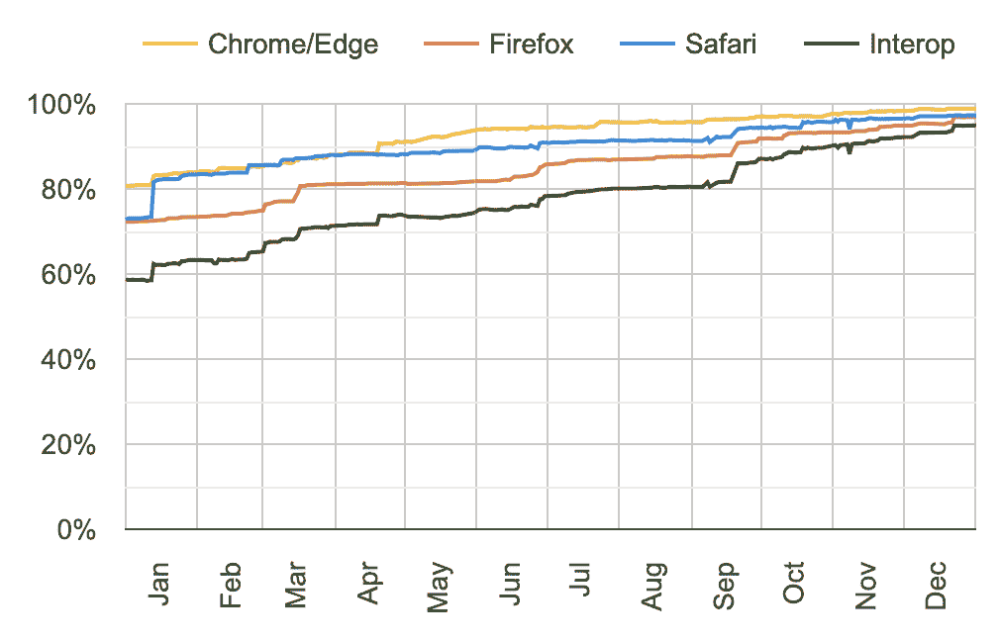
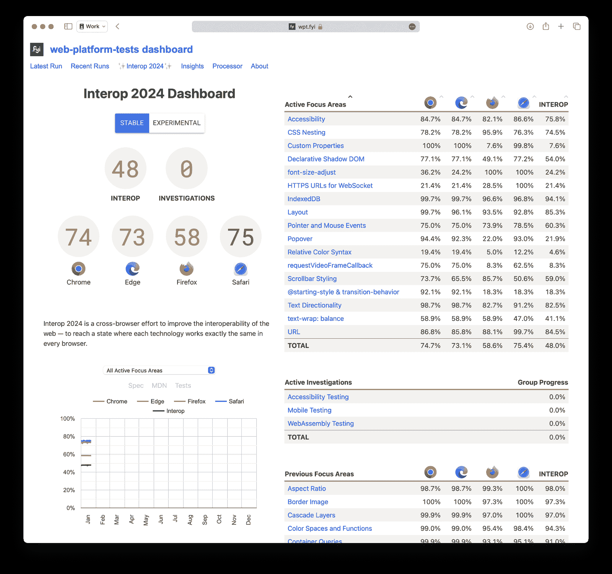
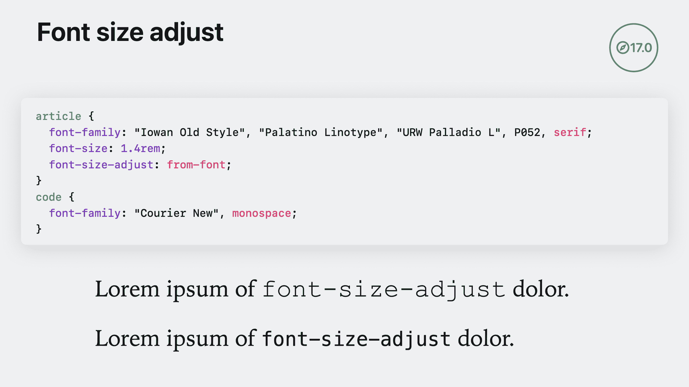
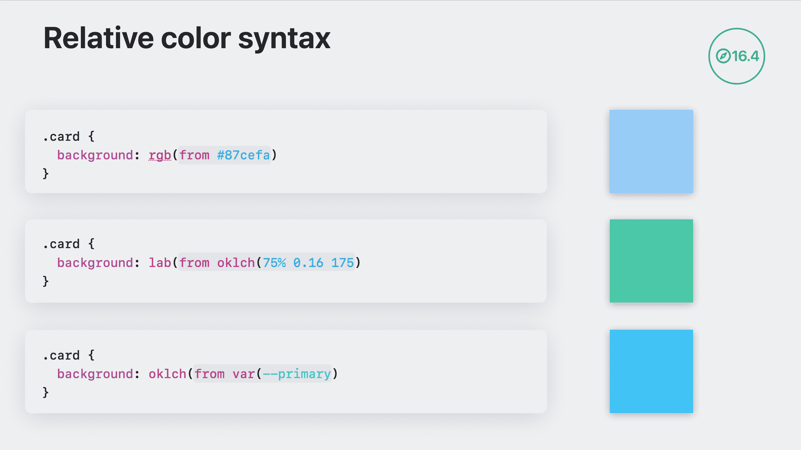

<!--yml

类别：未分类

日期：2024-05-27 14:29:34

-->

# Web 与 Interop 2024 变得更好 | WebKit

> 来源：[https://webkit.org/blog/14955/the-web-just-gets-better-with-interop/](https://webkit.org/blog/14955/the-web-just-gets-better-with-interop/)

Web 真是令人惊叹。它让数十亿人轻松进行合作、学习和连接，因为它专门设计用于在截然不同的设备上运行。

作为 Web 开发者，您的工作是确保您的项目在每个浏览器和每个用户中都能正常工作 —— 这可能很难。当浏览器对您使用的 Web 技术有相同的实现时，这个任务就变得容易得多。

通过 Web 标准流程实现了相同的实现，人们共同撰写了极为详细的技术文档，定义了每一个新的 Web 技术，直至网站 bug 的工作方式。

检查浏览器是否遵循 Web 标准的一种方法是通过自动化测试。有几个共享存储库包含这类测试，包括 [Web Platform Tests](https://web-platform-tests.org/)。WPT 包含超过 180 万个测试，其中超过 95% 在所有主流浏览器中通过。

## Interop 项目

Interop 项目旨在通过鼓励浏览器引擎团队深入研究特定的关注领域来提高互操作性。现在，苹果、[Bocoup](https://bocoup.com/blog/interop-2024)、[Google](https://web.dev/blog/interop-2024)、[Igalia](https://www.igalia.com/2024/interop-2024-launches.html)、[Microsoft](https://blogs.windows.com/msedgedev/2024/02/01/microsoft-edge-and-interop-2024/) 和 [Mozilla](https://hacks.mozilla.org/2024/02/announcing-interop-2024/) 在 2024 年度汇集了我们的集体专业知识，并为自动化测试选择了特定的子集。

一些选择的技术已经存在很长时间了，而其他领域则是全新的。通过选择一些开发者因为其 bug 而多年回避的最高优先级功能，我们可以将它们置于可以可靠使用的位置。通过选择激动人心的新技术，我们可以确保从一开始就实现互操作性。

要更好地了解未来互操作性的发展方向，首先让我们看一下 Interop 2023 的影响。

## Interop 2023

[Interop 2023](https://webkit.org/blog/13706/interop-2023/) 比 [Interop 2022](https://webkit.org/blog/12288/working-together-on-interop-2022/) 更加成功。在 2023 年 1 月，48% 的测试被选中，并在所有三大浏览器引擎中（Chrome 和 Firefox 适用于桌面 Linux，以及 macOS Monterey 上的 Safari）通过。一年后，通过率提升至 95%（在桌面 Linux 上的 Chrome Dev 和 Firefox Nightly，以及 macOS Ventura 上的 Safari Technology Preview）。



Interop 2023 的成功，可以在[“实验”仪表板](https://wpt.fyi/interop-2023)上看到。深绿色的“Interop”线显示了在Chrome Dev、Firefox Nightly和Safari Technology Preview中所有测试通过的百分比。

Interop 2023 达到了什么成就？

+   确保在其发布七年后，所有浏览器都充分支持P3颜色。

+   表单控件现在首次支持垂直书写模式，这在Web历史上是首次。

+   CSS `border-image` 现在按照最初的意图正常工作。

+   Subgrid、容器查询、`:has()`、Motion Path、CSS数学函数、`inert`和`@property`现在在所有现代浏览器中都得到了支持。

+   改进的Web API包括离屏画布、Web Workers中的模块、导入映射、导入断言和JavaScript模块。

+   整个媒体查询4规范现在在所有地方得到了支持，并且具有更易于使用的语法。

+   Web组件在`adoptedStyleSheets`、`ElementInternals`、Form-Associated自定义元素以及Shadow DOM和自定义元素的基本行为方面得到了提升。

+   现在可以依赖一些有用的CSS伪类，并且`:nth-child()`、`:nth-last-child()`、`:modal`、`:user-valid`和`:user-invalid`在所有现代浏览器中均有一致的跨浏览器支持。

+   特性查询现在新增支持以检测字体特性。

+   字体调色板为彩色字体提供了强大的支持。

+   在改善CSS遮罩、HTML表单、指针和鼠标事件、滚动、变换、URL、WebCodecs以及导致Web兼容性问题的一大堆错误方面取得了显著进展。

+   [更多信息](https://webkit.org/blog/13706/interop-2023/#focus-areas)。

我们希望这项工作能让您重新对使用这些技术充满信心。如果您以前发现其中某些技术难以使用，请再试一次。

Interop 2023 有26个关注领域，其中20个已成功退役。将继续在自定义属性、指针和鼠标事件、URL以及名为“布局”的新分组（包括Flexbox、Grid和Subgrid）上进行工作。

## Interop 2024

现在，我们为2024年做好了准备。共有96个关注领域提案提交进行考虑。最终，选择了16个。将一些新提议进行分组，并继续2023年的一些工作，使Interop 2024 总共有17个关注领域。



Interop 2024 仪表板，查看“稳定”浏览器（目前由普通用户使用）。巧合的是，整体的Interop得分再次从48%开始。

今年新加入的是，Microsoft Edge 现在在[Interop 仪表板](https://wpt.fyi/interop-2024?stable)上有自己的专栏。目前代表运行在Windows 10上的Edge和Edge Dev。

## 2024 年的关注领域

### 辅助功能

Interop 2023包括一个辅助功能调查项目。由苹果的辅助功能团队领导，该小组努力创建了新的WPT辅助功能测试基础设施，并编写了超过[1300个新的辅助功能测试](https://wpt.fyi/results/?label=master&label=experimental&aligned&q=label%3Aaccessibility)。这些测试现在已经作为Interop 2024的重点领域包含在内，鼓励浏览器增加对其支持。

大多数新的辅助功能测试涵盖了[WAI-ARIA](https://w3c.github.io/aria/)，特别是[角色模型](https://w3c.github.io/aria/#roles)和[可访问名称和描述计算](https://w3c.github.io/accname/)（AccName）。这两者共同提供了一种一致的机制，用于传达元素的目的或意图，以便辅助技术用户了解它的功能和用途。

其他新的辅助功能测试涵盖了这些技术如何被整合到宿主语言中。例如，[HTML辅助功能API映射规范（HTML-AAM）](https://w3c.github.io/html-aam/)定义了HTML元素的默认辅助功能语义，以及与浏览器如何处理`<label>`元素和图像`alt`文本等特性相关的规则。（请参见[html-aam/roles WPT测试](https://wpt.fyi/results/html-aam/roles.html?label=master&label=experimental&aligned&q=label%3Aaccessibility)作为示例。）

另一组新的测试涵盖了`display: contents`的可访问性。CSS中的这种显示模式提供了一个有用的机制，可以移除内容周围的框 —— 在想要调整用于Flexbox或Grid的父/子/孙关系的内容时特别有用。但是多年来，由于早期实现中的可访问性缺失，这种模式一直被禁用。将项目上的框完全移除会使该框中的所有内容从可访问性树中移除。视觉用户仍然可以看到子内容，但许多辅助技术用户则会完全看不到。大多数这些问题已在浏览器中得到解决，但并非全部，也不适用于所有情况。这些新的测试是迈向完全可访问性和互操作性的下一步。

通过在Interop 2024中包含这些新的辅助功能测试，希望能够修复所有浏览器中的每个问题。我们希望开发人员能更轻松地创建无障碍站点，并使网络对所有人，包括残障人士，变得更好。

### CSS嵌套

[CSS嵌套](https://developer.mozilla.org/zh-CN/docs/Web/CSS/CSS_nesting/Using_CSS_nesting)是Interop 2024的一个重点领域，以确保消除任何差异，并为您提供使用它的信心。CSS嵌套的能力在2023年已经在所有四个主要浏览器中推出 — 首先是在4月和5月份的Chrome、Edge和Safari中，然后在8月份的Firefox中。

网页标准在五月和八月之间略有变化，放宽了每个嵌套选择器必须以符号开头的原始要求。开发者现在可以简单地写`article`，而不必使用`& article`。

所有的实现都已经更新，但仍有一些细小的部分可能需要注意互操作性，特别是在CSS工作组最终确定嵌套工作原理的复杂细节方面。例如，大部分Safari的测试失败都与嵌套CSS如何通过[`:host`](https://developer.mozilla.org/en-US/docs/Web/CSS/:host)与Shadow DOM互动有关。

### 自定义属性

`@property`规则最近几年开始在浏览器中[发布](https://caniuse.com/mdn-css_at-rules_property)。作为2023互操作性的一部分，自定义属性的焦点区域从所有稳定浏览器中的4%通过测试上升到7.6% —— 在所有预览浏览器中，90.7%通过测试。Firefox是最后一个添加支持的浏览器，目前正在Firefox Nightly中进行中。由于这项工作尚未完成，焦点区域将继续在2024年进行。

利用[`@property`](https://developer.mozilla.org/en-US/docs/Web/CSS/@property)，开发者可以声明CSS自定义属性，类似于浏览器引擎定义CSS属性的方式 —— 指定其语法、继承行为和初始值。

```
@property --size {
  syntax: "<length>";
  inherits: false;
  initial-value: 0px;
} 
```

这使得你可以在CSS中做以前无法做到的事情，比如动画渐变或某些部分的变换。

### 声明性Shadow DOM

[声明性Shadow DOM](https://webkit.org/blog/13851/declarative-shadow-dom/)是一种声明性API，允许你仅使用HTML创建可重用的小部件和组件 —— 不需要JavaScript。自2023年3月起，Safari 16.4和Chrome 90开始[支持](https://caniuse.com/?search=Declarative%20Shadow%20DOM)。Firefox在Firefox Nightly中有一个实现。

声明性Shadow DOM是[HTML 2023现状](https://stateofhtml.com/en-US)调查中经常被要求的功能之一，因此被选定为2024互操作性的一部分，以确保它在所有浏览器中实现互操作性。

### 字体大小调整

`font-size-adjust`属性是关注旧技术实用性的一个很好的例子。Firefox在2008年首次[实现](https://caniuse.com/?search=font-size-adjust)了字体大小调整，但在网页设计师和开发者中很少被使用或讨论。早期规范随时间演变，通过两值语法添加了更多语言支持，并且通过`from-font`值变得更易于使用。

WebKit团队在Safari 16.4中实现了基本版本，并在2023年9月份的Safari 17.0中添加了更新。Mozilla也在同一时间更新了他们在Firefox 118中的实现。现在，Safari和Firefox都通过了所有测试的100%。Chrome在2015年开始了实验性实现，但至今尚未推出。现在随着Interop 2024的到来，很可能每个浏览器都将获得完整的支持。

[字体大小调整](https://developer.mozilla.org/en-US/docs/Web/CSS/font-size-adjust)提供了一种简单的方法，可以使文本字符串中使用的所有字体保持相同的视觉大小 —— 例如，`1.4rem`大小的文本中的每个字符都具有相同的x-height —— 或cap height、`ch` width、`ic` width或`ic` height。两个值的语法允许您选择要调整的测量。

当您将代码与常规文本混合使用或将多种语言混合在一起，并且同一句子中的不同字体具有不同的大小时，此属性尤其有用。使用字体大小调整，您可以避免出现奇怪地大字母。不再需要使用字体度量来找到使它们看起来大小相同的神奇数字。



CSS的`font-size-adjust: from font`使Courier字体调整其大小以匹配Iowan Old Style的x-height，而不是调整代码以视觉上更大。即使使用回退字体，大小的一致性也保持不变。

通过观看*[CSS有什么新东西](https://developer.apple.com/videos/play/wwdc2023/10121/?time=1338)*来了解更多关于`font-size-adjust`的内容。

### WebSocket的HTTPS URL

WebSocket API的一个古怪之处是，您需要使用非HTTP(S)方案：`ws:`（不安全）和`wss:`。由于URL在其他方面的功能与HTTP(S) URL完全相同，这使得API有点令人沮丧。基于Web开发者的反馈，WebKit团队去年决定通过使API支持HTTP(S) URL来解决这个问题。我们在Safari 17.0中提供了支持。

这意味着，您现在可以写成：

```
function webSocketHandle(path) {
  const url = new URL(path, location);
  url.protocol = location.protocol === "https:" ? "wss:" : "ws:";
  return new WebSocket(url);
}
// ...
const ws = webSocketHandle(path); 
```

您现在可以更加方便地编写：

```
const ws = new WebSocket(path); 
```

通过将此引入到Interop 2024中，我们希望其他浏览器也会采纳它，使其成为Web开发人员普遍可用的工具。

### IndexedDB

[IndexedDB](https://developer.mozilla.org/en-US/docs/Web/API/IndexedDB_API)是一个提供强大的客户端数据存储方式的API，是一个面向对象数据库。它从2011年开始在浏览器中使用，并且随着时间推移，Web标准一直在不断发展。所有主流浏览器都支持版本2和[版本3](https://www.w3.org/TR/IndexedDB/)。版本2完全可互操作，但版本3需要一些注意力来提高实现的质量。作为Interop 2024的一部分，将有助于确保实现完成并保持一致。

### 布局

CSS [网格](https://developer.mozilla.org/zh-CN/docs/Web/CSS/CSS_Grid_Layout/Basic_Concepts_of_Grid_Layout) 和 [Flexbox](https://developer.mozilla.org/zh-CN/docs/Web/CSS/CSS_flexible_box_layout/Basic_concepts_of_flexbox) 都包含在了原始的Interop项目中，于2021年。[子网格](https://developer.mozilla.org/zh-CN/docs/Web/CSS/CSS_grid_layout/Subgrid) 则在Interop 2023中新增。虽然这三种布局方法现在非常成熟，但仍不完美。现在这三个领域的测试正被合并为一个称为“布局”的重点领域。工作将继续确保复杂的边缘情况更具互操作性。同时，开发者应完全放心使用这三种技术，因为所有浏览器都对[Flexbox](https://caniuse.com/flexbox)、[Grid](https://caniuse.com/css-grid)和现在的[Subgrid](https://caniuse.com/css-subgrid)提供了坚实的支持。

### 指针和鼠标事件

[指针事件](https://developer.mozilla.org/zh-CN/docs/Web/API/Pointer_events)是为指向设备而触发的DOM事件。它们创建了一个单一的DOM事件模型来处理指向输入设备，如鼠标、笔/触控笔或带有一个或多个手指的触摸设备。这个API首次在2012年在浏览器中推出，并在2019年普及到了所有地方，但仍存在不良的互操作性。

2022年，Interop团队启动了一个调查项目，深入研究指针和鼠标事件的当前状态，以澄清共识并编写捕捉该共识状态的测试。到了Interop 2023，这些测试使得指针和鼠标事件成为了一个重点关注领域，测试通过率成为了Interop 2023仪表板和分数的一部分。在一年之内，指针和鼠标事件的测试通过率从34%上升到了81% —— 这是所有领域中最显著的进展。

尽管通过了81%的测试是一个显著的改进，但仍有更多工作要做，因此指针和鼠标事件将继续是2024年的一个重点领域。

### 弹出框

HTML中新的[`popover`](https://developer.mozilla.org/zh-CN/docs/Web/HTML/Global_attributes/popover)属性提供了一种内置浏览器的方式，使元素在页面的顶层弹出视图。如果您要在整个网页上创建一个遮罩层，则[`dialog`](https://developer.mozilla.org/zh-CN/docs/Web/HTML/Element/dialog)元素是最佳选择。但当您想要将任何其他元素转换为弹出消息、用户界面或其他类型的内容以显示和消失时，`popover`元素提供了一个框架来实现。

对`popover`的支持在2023年已经在Chrome 114和Safari 17.0中推出。Firefox目前在Firefox Nightly中正在进行支持。作为Interop 2024的一部分，这个备受期待的功能将有一个了不起的起步。

### 相对颜色语法

相对颜色语法是一种在 CSS 中定义颜色的新方式，允许您在参考其他颜色的同时进行定义。例如，您可以通过一定的量轻化或深化现有的颜色。您可以接收一个颜色变量，调整饱和度，并将新颜色分配给第二个变量。相对颜色语法在创建设计系统时特别强大。



通过观看 *[CSS 的新功能](https://developer.apple.com/videos/play/wwdc2023/10121/?time=623)*，了解更多关于相对颜色语法的信息，来自 WWDC23。

Safari 16.4 是第一个在 2023 年 3 月支持的浏览器。Chrome 119 和 Edge 119 则在 2023 年 10 月和 11 月推出了支持。目前，这些实现都不支持使用 `currentcolor` 与相对颜色语法。

相对颜色语法在 Interop 2024 的关注区域并不是测试相对颜色语法的整体支持情况。它着重于是否支持 `currentcolor`，并包括对超出色域行为的测试 — 检查在不支持 P3 色域的显示器上会发生什么。加入到 Interop 2024 将有助于完成这些最后的细节。

### requestVideoFrameCallback

`<video>` 元素为在网页上放置视频提供了强大的功能。但是，开发者通常希望并需要做更多。[`HTMLVideoElement`](https://developer.mozilla.org/en-US/docs/Web/API/HTMLVideoElement) 接口为在 JavaScript 中操作视频对象提供了特殊的属性和方法。其中一个方法是 `requestVideoFrameCallback()`。它允许您以高效的方式对视频进行每帧操作 — 例如视频处理或分析、绘制到画布以及与音频源同步。

[支持情况](https://caniuse.com/mdn-api_htmlvideoelement_requestvideoframecallback) 从 Chrome 83 和 Safari 15.4 开始，加入到 Interop 2024 将有助于浏览器完成和优化我们的实现。

### 滚动条样式

滚动条样式的关注区域包括两个用于样式化滚动条的 CSS 属性。[`scrollbar-width`](https://developer.mozilla.org/en-US/docs/Web/CSS/scrollbar-width) 属性提供三个值：`auto`、`thin` 和 `none`。`auto` 是默认宽度；`thin` 提供更细的滚动条；`none` 隐藏滚动条但仍允许内容滚动。Firefox 64 在 2018 年 12 月实现了支持，并且刚刚在 Chrome 121 和 Edge 121 中推出。

[`scrollbar-gutter`](https://developer.mozilla.org/en-US/docs/Web/CSS/scrollbar-gutter) 属性允许您保留滚动条的空间，因此无论是否存在滚动条，布局都保持一致。 `scrollbar-gutter: stable` 规则允许您告诉浏览器为滚动条保留空间，即使没有滚动条。这可以防止在需要或不需要滚动条的状态之间发生布局变化。它在2021-2022年Chrome 94、Edge 94和Firefox 97中推出。

Safari 需要完成此焦点区域的大部分工作。Chrome 和Firefox 已经通过了所有测试。具有讽刺意味的是，是[Safari首次提供了](https://webkit.org/blog/363/styling-scrollbars/)使用九个伪元素 `::-webkit-scrollbar-*` 来样式化滚动条，[早在2009年](https://caniuse.com/?search=%3A%3A-webkit-scrollbar)。然而，这种样式化滚动条的方法从未成为官方CSS Web标准。CSS工作组反而[选择了](https://drafts.csswg.org/css-scrollbars/#out-of-scope)一种更简单的方法。

### [@starting-style](https://developer.mozilla.org/en-US/docs/Web/CSS/@starting-style) 和 transition-behavior

这个焦点区域关注两个新功能，用于控制动画。[两者](https://caniuse.com/mdn-css_at-rules_starting-style) 在2023年9月Chrome 117和Edge 177中推出。

CSS中的 [`@starting-style`](https://developer.mozilla.org/en-US/docs/Web/CSS/@starting-style) 规则允许您为特定元素定义起始值。当元素即将进行过渡时，这是必需的。它还提供了在`display:none`中进行过渡的方法。

```
.alert {
  transition: background-color 2s;
  background-color: green;
  @starting-style {
    background-color: transparent;
  }
} 
```

在上面的示例中，当元素附加到文档时，`background-color` 将从透明过渡到绿色。

以前，只有动画可以对[可离散动画化](https://developer.mozilla.org/en-US/docs/Web/CSS/CSS_animated_properties#discrete) 属性进行动画处理。CSS中的 [`transition-behavior`](https://developer.mozilla.org/en-US/docs/Web/CSS/transition-behavior) 属性扩展了CSS过渡的能力，为显示或隐藏元素时过渡 `display` 属性铺平了道路。

### 文本方向性

文本流向是网络排版中至关重要的一环。一些语言是从左至右流的，而另一些是从 [右至左](https://www.w3.org/International/questions/qa-scripts)。其中许多支持文本流向的技术之一是`dir`属性[](https://developer.mozilla.org/en-US/docs/Web/HTML/Global_attributes/dir)。它允许你专门标记任何 HTML 元素的方向：`左`，`右`或 `自动` ——其中 `自动` 会让浏览器猜测第一个字母。方向性和阴影树之间的互动直到最近才得到明确解决。现在，经过标准化的解决后，将它添加到 INTEROP 2024 的工作将帮助我们确保实现也能得到调整。

### text-wrap: balance

网络设计师长期以来一直希望找到一种方法来防止非常短或只有一个单词的文本行——经常被称为“寡妇”或“独子”。随着响应式网络设计的出现和对列宽的缺乏控制，这一愿望变得更加困难。`text-wrap` 属性为在不同方法中自定义处理特定用例的文本失线提供了多种选项。

`text-wrap: balance` 规则是为标题提供了一个优秀的解决方案。它可以平衡几行文本，使每一行的文本长度大致相同。它在 Chrome 114 和 Firefox 121 中[发布](https://caniuse.com/css-text-wrap-balance)，并在 Safari 技术预览版中实现。

INTEROP 2024 包括了有关 `text-wrap-mode`，`text-wrap-style` 和`white-space-collapse` 行为的测试。CSS 工作组最近更改了这些较长属性之间的交互方式，因此浏览器之间的支持存在不均。INTEROP 2024 将帮助确保所有浏览器引擎更新到最新 web 标准。

### URL

URL 是网络中最基本的组成部分之一。没有它们，网络将不存在。但就像许多在互联网早期发明的东西一样，其支持还未完全实现互操作性。为了改进这一情况，WHATWG 写出了[URL 活动标准](https://url.spec.whatwg.org/)，详细介绍了 URL 应该如何运作。支持这一 web 标准的测试是INTEROP 2023 的关注重点，通过改进使通过率从 77% 提高到 85%。为了确保互操作性，这个领域的工作将在 2024 年继续进行。

Safari 非常自豪地领先，通过了 99.7% 的测试。其他浏览器的改进将帮助确保网站在任何地方都能正常工作。

## 2024 年的调查与项目

互操作性2024还包括三个调研领域。这些是互操作性团队需要开展的“家庭作业项目”。今年的所有三个项目都涉及编写并使其可能在更多测试中运行 —— 包括可访问性测试、移动测试和WebAssembly测试。移动测试调研项目旨在完成WPT所需的基础设施，以便能够在移动操作系统上测试浏览器，并有可能将这些分数包括在未来的互操作性项目仪表板上。

虽然三个调研项目中有两个是去年继续的项目，但它们在2024年都从零开始。每个涉及的团队将为今年设定新目标，并且仪表板将报告这些目标的进展情况。

## 跟踪进展

在整个2024年期间，随时了解互操作性2024的进展情况，请访问[互操作性2024仪表板](https://wpt.fyi/interop-2024)。

## 我们的承诺

我们继续相信互操作性是使网络取得如此成功的基本支柱之一。我们在2022年和2023年的互操作性工作展示了我们对网络的深切关注。我们很高兴能再次与同事们合作，抓住这个机会，帮助网络更好地服务每一个人。
