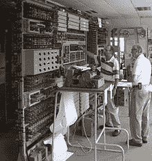
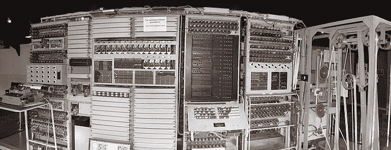

<!--yml

category: 未分类

date: 2024-05-27 14:29:14

-->

# Tommy Flowers - Wikipedia

> 来源：[https://en.wikipedia.org/wiki/Tommy_Flowers](https://en.wikipedia.org/wiki/Tommy_Flowers)

English engineer

**托马斯·哈罗德·弗拉沃斯** [MBE](/wiki/Order_of_the_British_Empire "大英帝国勋章")（1905年12月22日 – 1998年10月28日）是一位英国工程师，曾在英国总邮政局任职。在[第二次世界大战](/wiki/World_War_II "第二次世界大战")期间，弗拉沃斯设计并建造了[巨神冢](/wiki/Colossus_computer "巨神冢计算机")，这是世界上第一台可编程电子计算机，用于解密德国的加密消息。

## 早年生活[[编辑](/w/index.php?title=Tommy_Flowers&action=edit&section=1 "编辑：早年生活")]

弗拉沃斯出生在 [布罗姆利-比-鲍](/wiki/Bromley-by-Bow "布罗姆利-比-鲍") 的 [波普拉都会区](/wiki/Metropolitan_Borough_of_Poplar "波普拉都会区") 的 [艾伯特路](/wiki/Abbott_Road "艾伯特路") 160 号，出生日期是 1905 年 12 月 22 日，他的父亲是一名 [砖匠](/wiki/Bricklayer "砖匠").^([[1]](#cite_note-odnb-1)) 在 [伦敦大学](/wiki/University_of_London "伦敦大学") 攻读 [电气工程](/wiki/Electrical_engineering "电气工程") 学位期间，他在 [皇家军械库](/wiki/Royal_Arsenal "皇家军械库")（ [伍尔维奇](/wiki/Woolwich "伍尔维奇") ）进行机械工程学徒培训，并在晚间课上学习。^([[1]](#cite_note-odnb-1)) 1926年，他加入了 [总邮政局](/wiki/General_Post_Office "总邮政局") （GPO）的电信部门，并于1930年搬到位于 [米德尔塞克斯](/wiki/Middlesex "米德尔塞克斯") [多利斯希尔](/wiki/Dollis_Hill "多利斯希尔") 的 [邮政研究站](/wiki/Post_Office_Research_Station "邮政研究站")。

1935年，弗拉沃斯与 [艾琳·玛格丽特·格林](/wiki/Eileen_Margaret_Green "艾琳·玛格丽特·格林") 结婚。后来，他们夫妇育有两个孩子，约翰和肯尼斯。^([[1]](#cite_note-odnb-1))

从1934年开始，他研究了在电话交换中使用 [电子学](/wiki/Electronics "电子学") 的可能性。到1939年，他设计的设备在某些交换站上运行，使用了3000到4000个真空管，每1000条线路使用三到四个真空管。需要注意的是，这些设备用于交换站（中央办公室）之间的（放大的）远程或干线之间的信号传输，使用带内信号和由电磁开关或操作员进行的交换。弗拉沃斯在战争爆发时曾说，他“可能是英国唯一一个意识到真空管可以可靠地大规模用于高速计算的人。他确信全电子系统是可能的。他在电子开关技术上的背景为他的计算机设计提供了关键支持。

## World War II[[编辑](/w/index.php?title=Tommy_Flowers&action=edit&section=2 "编辑：第二次世界大战")]

Flowers 在二战密码破译工作的首次接触发生在 1941 年 2 月，当时他的主管 W. Gordon Radley 被 [艾伦·图灵](/wiki/Alan_Turing "Alan Turing") 请求帮助，图灵当时在 [布莱切利园](/wiki/Bletchley_Park "Bletchley Park") 工作，这是政府的密码破译机构，位于伦敦西北约 50 英里（80 公里）处的 [白金汉郡](/wiki/Buckinghamshire "Buckinghamshire").^([[3]](#cite_note-3)) 图灵希望 Flowers 建造一个用于中继的反制装置，这个中继式 [Bombe](/wiki/Bombe "Bombe") 机器，是图灵为帮助解密德国 [恩尼格玛](/wiki/Enigma_machine "Enigma machine") 密码而开发的。

"Counter" 项目被放弃了，但图灵对 Flowers 的工作印象深刻，在 1943 年 2 月将他介绍给了 [马克斯·纽曼](/wiki/Max_Newman "Max Newman")，后者正在领导对 [Lorenz 密码的密码分析工作](/wiki/Cryptanalysis_of_the_Lorenz_cipher "Cryptanalysis of the Lorenz cipher") 的自动化努力。这是由德国高级密码生成的一种电报打字机内置密码机，即 [Lorenz SZ40/42](/wiki/Lorenz_cipher "Lorenz cipher")，这是他们的 *Geheimschreiber*（秘密写作机）系统之一，被英国人称为 "Tunny"（金枪鱼）。这比 Enigma 更复杂；解码过程涉及尝试太多可能性，手工操作不切实际。Flowers 和 Frank Morrell（也在 Dollis Hill）设计了 [Heath Robinson](/wiki/Heath_Robinson_(codebreaking_machine) "Heath Robinson (codebreaking machine)")，试图自动化 Lorenz SZ-40/42 密码机的密码分析过程。^([[4]](#cite_note-autogenerated1-4))

### [Colossus 计算机](/w/index.php?title=Tommy_Flowers&action=edit&section=3 "编辑段落：Colossus 计算机")

Flowers 提出了一种更复杂的替代方案，使用电子系统，他的员工称之为 Colossus，可能使用了约 1800 个[热电子管](/wiki/Vacuum_tube "Vacuum tube")（真空管），而不是 150 个，并且只有一个纸带而不是两个（需要同步），通过电子方式生成轮子模式。因为之前最复杂的电子设备使用了大约 150 个管子，有些人怀疑这个系统是否可靠。Flowers 反驳说，英国电话系统使用了数千个管子，并且可靠，因为电子设备在稳定的环境中运行，电路一直开着。布莱切利管理层并不相信，只是鼓励 Flowers 自己继续前进。^([[5]](#cite_note-5)) 他在邮政研究实验室这样做，使用了一些自己的资金来建造它。^([[6]](#cite_note-6))^([[7]](#cite_note-7)) Flowers 在 1939 年首次遇见（并与）图灵相处融洽，但因为他提倡使用管子而不是继电器，被 Gordon Welchman 轻蔑对待。Welchman 更喜欢英国制表机械公司（BTM）的 Wynn-Williams 和 Keene 的观点，他们设计并制造了 [Bombe](/wiki/Bombe "Bombe") 并希望 Radley 和 "Dollis Hill 的 Flowers 先生" 被撤离 Colossus 工作，因为他们认为“浪费了好的管子”。^([[8]](#cite_note-8))

尽管 Colossus 取得了成功，但是 Heath Robinson 方法在解决某些问题上仍然有价值。^([[9]](#cite_note-Gannon-9)) 这一概念的最终发展是由 Tommy Flowers 设计的名为 Super Robinson 的机器。这台机器可以运行四个磁带，用于运行深度和“破译”或 [已知明文攻击](/wiki/Known-plaintext_attack "Known-plaintext attack")。^([[9]](#cite_note-Gannon-9)) 1943 年 6 月 2 日，Flowers 被任命为大英帝国勋章的成员。^([[10]](#cite_note-10))

Flowers得到了来自Dollis Hill的[邮政研究站](/wiki/Post_Office_Research_Station "Post Office Research Station")主任W. G. Radley的全力支持。在部件采购的最高优先级下，Flowers团队在Dollis Hill建造了第一台机器，仅用了11个月的时间。由于其巨大的体积，该机器立即被Bletchley Park的工作人员戏称为“Colossus”。Mark 1 Colossus的运算速度比之前的Heath Robinson系统快五倍，而且更加灵活，后者使用了电机械开关。第一台拥有1500个真空管的Mark 1在1943年11月在Dollis Hill运行；它于1944年1月交付给Bletchley Park，在那里进行组装，并于2月初开始运行。^([[11]](#cite_note-autogenerated2-11)) Colossus使用的算法是由数学家[W. T. Tutte](/wiki/W._T._Tutte "W. T. Tutte")及其团队开发的。^([[12]](#cite_note-12)) Colossus在对十二转子的[Lorenz密码机](/wiki/Lorenz_cipher "Lorenz cipher") SZ42表现出了高效和快速的能力。^([*[citation needed](/wiki/Wikipedia:Citation_needed "Wikipedia:Citation needed")*])

1994年，由[Tony Sale](/wiki/Anthony_Sale "Anthony Sale")（右）领导的团队在Bletchley Park开始重建[Colossus](/wiki/Colossus_computer "Colossus computer")。在这里，2006年，Sale监督使用完成的机器破解加密消息。

为了预期对额外计算机的需求，Flowers已经开始研发Colossus Mark 2，该机将使用2400个真空管。^([[4]](#cite_note-autogenerated1-4)) 第一台Mark 2于1944年6月1日投入Bletchley Park使用，并立即为即将到来的[诺曼底登陆](/wiki/D-Day "D-Day")提供了重要信息，计划于6月5日星期一进行（由于恶劣天气推迟了24小时）。后来，Flowers描述了1944年6月5日，Dwight D. Eisenhower与他的工作人员之间的关键会议，期间，一名信使进入并递交给Eisenhower一张总结Colossus解密内容的纸条。这证实了Adolf Hitler不希望将额外部队调往[诺曼底](/wiki/Normandy "Normandy")，因为他仍然坚信诺曼底登陆的准备工作只是一个幌子。交还解密文件后，Eisenhower对他的工作人员宣布：“我们明天出发”。^([[13]](#cite_note-13)) 较早时，Colossus解密了由Erwin Rommel元帅提供的有关西部防御的报告，揭示了其中一个被选为美国空降师降落地点的地点实际上是德国坦克师的基地，因此该地点被更改了。^([[14]](#cite_note-14))

十台 Colossi 在 [第二次世界大战](/wiki/Second_World_War "第二次世界大战") 期间用于英国的解码工作，战争结束时第十一台已经准备投入使用。除了两台外，其余全部在战后被拆除，“剩余的两台被移交给了位于 [格洛斯特郡切尔滕纳姆](/wiki/Cheltenham "Cheltenham") 的 [英国情报](/wiki/United_Kingdom_intelligence_community "英国情报") 部门 [GCHQ](/wiki/GCHQ "GCHQ")，可能在 [冷战](/wiki/Cold_War "冷战") 的密码破译行动中发挥了重要作用”。^([[15]](#cite_note-15)) 它们最终于 1959 年和 1960 年被停用。^([*[需要引用](/wiki/Wikipedia:Citation_needed "维基百科：需要引用")*])

## 战后工作和退休[[编辑](/w/index.php?title=Tommy_Flowers&action=edit&section=4 "编辑：战后工作和退休")]

战后，Flowers 并未因其对 [密码分析](/wiki/Cryptanalysis "密码分析") 的贡献而得到多少认可。^([[16]](#cite_note-16)) 战后，Flowers 在用自己的个人资金建造 Colossus 后负债累累。^([[17]](#cite_note-centre_for_computing_youtube-17)) 尽管政府向他拨发了 [£](/wiki/Pound_Sterling "英镑")1,000 的款项，但这并没有覆盖 Flowers 在设备上的个人投资；他将其中大部分钱款分给了帮助他建造和测试 Colossus 的员工。Flowers 申请向英格兰银行贷款建造另一台类似 Colossus 的机器，但由于银行认为这样的机器不可能运作，他的贷款申请遭到了拒绝。^([[18]](#cite_note-18)) 他无法争辩称他已经设计并建造了许多这样的机器，因为他在 Colossus 上的工作受到了 [官方保密法案](/wiki/Official_Secrets_Act "官方保密法案") 的限制。他留在了 [邮政研究站](/wiki/Post_Office_Research_Station "邮政研究站")，担任交换部门的负责人。他和他的团队开创了全电子 [电话交换机](/wiki/Telephone_exchange "电话交换机") 的工作，在大约 1950 年完成了基本设计，这导致了 [Highgate Wood 电话交换站](/wiki/Highgate_Wood_Telephone_Exchange "Highgate Wood 电话交换站") 的建立。他还参与了 [ERNIE](/wiki/ERNIE "ERNIE") 的开发。^([[19]](#cite_note-19)) 1964 年，他成为 [Standard Telephones and Cables Ltd.](/wiki/Standard_Telephones_and_Cables "Standard Telephones and Cables") 的高级开发部门负责人，^([[20]](#cite_note-20)) 继续开发电子电话交换，包括脉冲幅度调制交换，最终于 1969 年退休。^([[21]](#cite_note-21))

直到 1970 年代，Flowers 在计算机领域的工作才得到了充分的认可。他的家人只知道他做过一些“秘密而重要的”工作。^([[22]](#cite_note-22))

1976年，他出版了《Introduction to Exchange Systems》，一本关于电话交换工程原理的书籍。^([[23]](#cite_note-23))

花园于1998年去世，享年92岁，留下一位妻子和两个儿子。^([[1]](#cite_note-odnb-1))

### 荣誉[[编辑](/w/index.php?title=Tommy_Flowers&action=edit&section=5 "Edit section: Honours")]

+   1973年：成为[纽卡斯尔大学](/wiki/Newcastle_University "Newcastle University")的荣誉理学博士。^([[24]](#cite_note-24))

+   1983年：因其在计算机领域的成就，荣获首届马特尔瑟姆奖章。^([[25]](#cite_note-25))

+   1993年：在完成了个人计算机信息处理基础课程后，获得了[Hendon College](/wiki/Middlesex_University#London:_Hendon "Middlesex University")的证书。^([[26]](#cite_note-26))

[邮政研究站](/wiki/Post_Office_Research_Station "Post Office Research Station")现在是一个住宅开发区，主建筑已改建为公寓楼，而通往的道路称为花园路。他出生的地方——[伦敦哈姆雷特区](/wiki/London_Borough_of_Tower_Hamlets "London Borough of Tower Hamlets")——也对他予以了荣誉。一个面向年轻人的[信息与通信技术（ICT）](/wiki/Information_and_communications_technology "Information and communications technology")中心，汤米·花园中心，于2010年11月在此开放。^([[27]](#cite_note-27)) 这个中心已关闭，但建筑现在是汤米·花园中心，塔哈姆雷特区学生转介单元的一部分。^([*[citation needed](/wiki/Wikipedia:Citation_needed "Wikipedia:Citation needed")*]) 2023年，[英格兰遗产](/wiki/English_Heritage "English Heritage")在此为他设立了[蓝色标牌](/wiki/Blue_plaque "Blue plaque")以示尊敬。^([[28]](#cite_note-28))

2012年9月，他的战时日记被展出在[Bletchley Park](/wiki/Kesgrave "Kesgrave")。^([[29]](#cite_note-29))^([[30]](#cite_note-30)) 在位于BT研究实验室附近的Kesgrave的一条街道被命名为Tommy Flowers Drive。^([[31]](#cite_note-31))

2013年12月12日，在他创建Colossus 70年后，他的遗产受到了由[英国电信](/wiki/British_Telecom "British Telecom")（后来的英国邮政电话公司）委托的纪念活动的表彰。这座由詹姆斯·巴特勒设计的真人大小青铜半身像，由[Trevor Baylis](/wiki/Trevor_Baylis "Trevor Baylis")在位于[Ipswich](/wiki/Adastral_Park "Adastral Park")苏福克郡的BT研究与发展中心[Adastral Park](/wiki/Adastral_Park "Adastral Park")揭幕。英国电信还以他的名义开始了计算机科学奖学金和奖项。^([[32]](#cite_note-32))

2016年9月29日，BT在Adastral Park开设了Tommy Flowers Institute^([[33]](#cite_note-33))，致力于支持转入行业的研究生发展ICT培训。该研究所侧重于将ICT部门组织与学术研究人员联合起来，解决英国企业面临的一些挑战，探索如网络安全、大数据、自主网络和融合网络等领域。启动活动邀请了来自剑桥、牛津、东安格利亚、埃塞克斯、帝国理工、伦敦大学学院、南安普顿、萨里和兰开斯特的教授，以及来自[National Physical Laboratory](/wiki/National_Physical_Laboratory_(United_Kingdom) "National Physical Laboratory (United Kingdom)")、[华为](/wiki/Huawei "华为")、[爱立信](/wiki/Ericsson "爱立信")、[思科](/wiki/CISCO "思科")、[ARM](/wiki/Arm_Ltd. "Arm Ltd.")和[ADVA](/wiki/ADVA_Optical_Networking "ADVA Optical Networking")的代表。^([[34]](#cite_note-34))

2018年，伦敦新装修的[工程技术学会](/wiki/Institution_of_Engineering_and_Technology "工程技术学会")的一间房间被命名为Flowers Room。^([[35]](#cite_note-35))

### Colossus重建[[编辑](/w/index.php?title=Tommy_Flowers&action=edit&section=7 "编辑章节：Colossus重建")]

由[Tony Sale](/wiki/Tony_Sale "Tony Sale")领导的志愿者团队在1993年至2008年间重建了一个功能齐全的Colossus Mark II。它展出在Bletchley Park的[The National Museum of Computing](/wiki/The_National_Museum_of_Computing "The National Museum of Computing")。^([[11]](#cite_note-autogenerated2-11))^([[37]](#cite_note-37))

Flowers知道Sale正在重建MKII版本，描述了设计和建造，对其重建起到了重要作用。^([[38]](#cite_note-38)) ^([[17]](#cite_note-centre_for_computing_youtube-17))

重建后的Colossus正面视图显示，从右到左依次是（1）“床架”，其中包含连续循环的消息带，并加载了第二个。（2）J架，包含选择面板和插件面板。（3）K架，带有大型“Q”开关面板和倾斜的补丁面板。（4）双S架，包含控制面板和上方邮票图像，以及五个两行计数器显示。（5）电动打字机位于C架上的五组四个“设置总数”十年开关前。^([[39]](#cite_note-39))

## 另请参阅[[编辑](/w/index.php?title=Tommy_Flowers&action=edit&section=8 "编辑章节：另请参阅")]

## 参考资料[[编辑](/w/index.php?title=Tommy_Flowers&action=edit&section=9 "编辑章节：参考资料")]

1.  ^ [^(***a***)](#cite_ref-odnb_1-0) [^(***b***)](#cite_ref-odnb_1-1) [^(***c***)](#cite_ref-odnb_1-2) [^(***d***)](#cite_ref-odnb_1-3) Agar, Jon (2008). ["Thomas Flowers Biography"](http://www.oxforddnb.com/view/article/71253). *[《国家传记词典》](/wiki/Dictionary_of_National_Biography#Oxford_Dictionary_of_National_Biography "Dictionary of National Biography")* (online ed.). Oxford University Press. [doi](/wiki/Doi_(identifier) "Doi (identifier)"):[10.1093/ref:odnb/71253](https://doi.org/10.1093%2Fref%3Aodnb%2F71253). （需要订阅或[英国公共图书馆会员资格](https://www.oxforddnb.com/help/subscribe#public)）。

1.  **[^](#cite_ref-3)** [Randell 2006](#CITEREFRandell2006)，p. 144

1.  ^ [^(***a***)](#cite_ref-autogenerated1_4-0) [^(***b***)](#cite_ref-autogenerated1_4-1) [Tommy Flowers](http://cryptomuseum.com/people/tommy_flowers.htm)

1.  **[^](#cite_ref-5)** 参见 PBS Nova 2015年《解码纳粹的秘密》中对 Flowers 的采访。

1.  **[^](#cite_ref-6)** Boden, Margaret A. (2008年6月19日). [*《心灵作为机器：认知科学的历史》*](https://books.google.com/books?id=yRyETy43AdQC&q=TOMMY%2520FLOWERS%2520built%2520at%2520his%2520own%2520expense%2520colossus&pg=PA159). Clarendon Press. p. 159。[ISBN](/wiki/ISBN_(identifier) "ISBN (identifier)") [<bdi>9780199543168</bdi>](/wiki/Special:BookSources/9780199543168 "Special:BookSources/9780199543168")。

1.  **[^](#cite_ref-7)** Atkinson, Paul (2010年8月15日). [*计算机*](https://archive.org/details/computer0000atki). Reaktion Books. pp. [29](https://archive.org/details/computer0000atki/page/29). [ISBN](/wiki/ISBN_(identifier) "ISBN (identifier)") [<bdi>9781861897374</bdi>](/wiki/Special:BookSources/9781861897374 "Special:BookSources/9781861897374").

1.  **[^](#cite_ref-8)** McKay, Sinclair (2010). *[《布莱切利公园的秘密生活》](https://books.google.com/books?id=GhqzBwAAQBAJ&q=super%2520robinson%2520%2520&pg=PT207)*. 伦敦，英国：Aurum Press。pp. 266–268。[ISBN](/wiki/ISBN_(identifier) "ISBN (identifier)") [<bdi>978-1-84513-539-3</bdi>](/wiki/Special:BookSources/978-1-84513-539-3 "Special:BookSources/978-1-84513-539-3")。

1.  ^ [^(***a***)](#cite_ref-Gannon_9-0) [^(***b***)](#cite_ref-Gannon_9-1) Gannon, Paul (2007年1月1日). [*《巨兽：布莱切利公园的最大秘密》*](https://books.google.com/books?id=GhqzBwAAQBAJ&q=super%2520robinson%2520%2520&pg=PT207). Atlantic Books. p. 207。[ISBN](/wiki/ISBN_(identifier) "ISBN (identifier)") [<bdi>9781782394020</bdi>](/wiki/Special:BookSources/9781782394020 "Special:BookSources/9781782394020")。

1.  **[^](#cite_ref-10)** ["No. 36035"](https://www.thegazette.co.uk/London/issue/36035/supplement/2491). *[《伦敦公报》](/wiki/The_London_Gazette "The London Gazette")* (Supplement). 1943年6月4日。pp. 2491–2495.

1.  ^ [^(***a***)](#cite_ref-autogenerated2_11-0) [^(***b***)](#cite_ref-autogenerated2_11-1) [《巨兽画廊 | 国家计算博物馆》](http://www.tnmoc.org/explore/colossus-gallery)

1.  **[^](#cite_ref-12)** [图特教授传记 | 组合数学与优化 | 滑铁卢大学](https://uwaterloo.ca/combinatorics-and-optimization/about/professor-william-t-tutte/biography-professor-tutte#bletchley)

1.  **[^](#cite_ref-13)** [Flowers 2006](#CITEREFFlowers2006), 第81页

1.  **[^](#cite_ref-14)** ["X站（电视系列）"](https://web.archive.org/web/20140222083444/http://ftvdb.bfi.org.uk/sift/series/30779). [英国电影协会](/wiki/British_Film_Institute "British Film Institute"). 存档自[原始网址](http://ftvdb.bfi.org.uk/sift/series/30779)于2014年2月22日。

1.  **[^](#cite_ref-15)** ["解码纳粹机密（文字稿）"](https://www.pbs.org/wgbh/nova/transcripts/2615decoding.html). *[NOVA](/wiki/Nova_(American_TV_series) "Nova (American TV series)")*. [PBS](/wiki/PBS "PBS"). 1999年11月9日。检索于2017年3月4日。

1.  **[^](#cite_ref-16)** Black, Sue; Colgan, Stevyn (2016年3月10日). [*拯救布莱切利公园：#社交媒体拯救二战密码破译者的家园*](https://books.google.com/books?id=c7mcCwAAQBAJ&q=tommy%2520flowers%2520received%2520little%2520credit&pg=PA88). Unbound Publishing. 第88页。[ISBN](/wiki/ISBN_(identifier) "ISBN (identifier)") [<bdi>9781783521678</bdi>](/wiki/Special:BookSources/9781783521678 "Special:BookSources/9781783521678")。

1.  ^ [^(***a***)](#cite_ref-centre_for_computing_youtube_17-0) [^(***b***)](#cite_ref-centre_for_computing_youtube_17-1) ["巨型计算机 – 计算历史中最伟大的秘密"](https://www.youtube.com/watch?v=g2tMcMQqSbA). *[YouTube](/wiki/YouTube "YouTube")*. 2020年5月4日。[存档](https://ghostarchive.org/varchive/youtube/20211222/g2tMcMQqSbA)自2021年12月22日。

1.  **[^](#cite_ref-18)** Laird, Robbin (2018年12月16日). ["怀念汤米·弗拉尔斯：可编程计算机的发明者，对战争胜利的重要贡献"](https://sldinfo.com/2018/12/remembering-tommy-flowers-the-inventor-of-the-programmable-computer-and-making-a-key-contribution-to-a-war-winning-ap/). *第二防线*. 检索于2020年5月26日。

1.  **[^](#cite_ref-19)** ["内外：保险金债券"](https://www.bbc.co.uk/insideout/northwest/series6/premium_bonds.shtml). *BBC北西*. 2004年9月20日.

1.  **[^](#cite_ref-20)** Andrews, Jork (2012年秋季). ["汤米·弗拉尔斯的解职"](https://www.computerconservationsociety.org/resurrection/res59.htm#h). *复活：计算机保护协会通讯*. 第59卷。第29-34页。[ISSN](/wiki/ISSN_(identifier) "ISSN (identifier)") [0958-7403](https://www.worldcat.org/issn/0958-7403)。

1.  **[^](#cite_ref-21)** [兰德尔，布莱恩](/wiki/Brian_Randell "Brian Randell") (1980). ["20世纪计算史：巨型计算机"](http://www.cs.ncl.ac.uk/research/pubs/books/papers/133.pdf) (PDF). *[纽卡斯尔大学](/wiki/Newcastle_University "Newcastle University"), 英国*.

1.  **[^](#cite_ref-22)** ["汤米·花：技术创新者"](https://www.bbc.co.uk/dna/h2g2/A1010070). [BBC](/wiki/BBC "BBC"). 2003年4月8日。

1.  **[^](#cite_ref-23)** Flowers, T. H. (1976). *交换系统介绍*. [约翰·威利](/wiki/John_Wiley_%26_Sons "John Wiley & Sons"). [ISBN](/wiki/ISBN_(identifier) "ISBN (identifier)") [<bdi>0-471-01865-1</bdi>](/wiki/Special:BookSources/0-471-01865-1 "Special:BookSources/0-471-01865-1").

1.  **[^](#cite_ref-24)** ["纽卡斯尔大学计算机科学学院为托马斯·哈罗德·花的公共颁奖词"](https://web.archive.org/web/20160304043615/http://www.ncl.ac.uk/computing/research/hon/flowers/). *纽卡斯尔大学计算机科学学院*. 存档自[原文](http://www.ncl.ac.uk/computing/research/hon/flowers/)，检索于2016年3月4日。

1.  **[^](#cite_ref-25)** Bray, John (2002). *创新与通讯革命*. IEE出版社. p. 193\. [ISBN](/wiki/ISBN_(identifier) "ISBN (identifier)") [<bdi>0852962185</bdi>](/wiki/Special:BookSources/0852962185 "Special:BookSources/0852962185").

1.  **[^](#cite_ref-26)** ["破译者：布莱切利园的失落英雄"](https://www.bbc.co.uk/programmes/b016ltm0). [BBC Two](/wiki/BBC_Two "BBC Two"). 2011年10月29日。

1.  **[^](#cite_ref-27)** ["汤米·花城市学习中心正式启动"](http://webfronter.com/towerhamlets/thclc/menu2/Events/Welcome_4_3.html). *塔城汉姆莱茨CLC*. 检索于2011年10月25日。

1.  **[^](#cite_ref-28)** ["汤米·花 | 工程师 | 蓝色牌匾"](https://www.english-heritage.org.uk/visit/blue-plaques/tommy-flowers/). *英格兰遗产*. 检索于2023年9月14日。

1.  **[^](#cite_ref-29)** ["战时日记帮助讲述巨人机器的故事"](https://www.bbc.co.uk/news/technology-19517321). *[BBC新闻](/wiki/BBC_News "BBC News")*. 2012年9月7日。

1.  **[^](#cite_ref-30)** ["巨人机器与汤米·花的日记"](https://www.youtube.com/watch?v=crCHjaTz7XE). *[YouTube](/wiki/YouTube "YouTube")*. 2020年4月30日。存档自原始链接于2021年12月22日。

1.  **[^](#cite_ref-31)** Comber, Alan. ["道路命名"](https://web.archive.org/web/20170409152225/http://www.kesgravetowncouncil.org.uk/roadnames.html#sep09). *凯斯格雷夫市议会*. 存档自[原文](http://www.kesgravetowncouncil.org.uk/roadnames.html#sep09)，检索于2017年3月4日。

1.  **[^](#cite_ref-32)** ["BT纪念汤米·花的成就"](http://home.bt.com/news/btlife/bt-remembers-tommy-flowerss-achievements-11363857904783). *BT*. 2014年5月23日. 检索于2017年3月4日。

1.  **[^](#cite_ref-33)** ["汤米·花研究所"](https://web.archive.org/web/20161005102942/https://atadastral.co.uk/tommy-flowers-institute/). *阿达斯特尔公园*. 存档自[原文](https://atadastral.co.uk/tommy-flowers-institute/)，检索于2016年10月5日。

1.  **[^](#cite_ref-34)** ["Tommy Flowers ICT 研究所在 BT Adastral Park 启动"](http://home.bt.com/tech-gadgets/tech-news/tommy-flowers-institute-for-ict-launched-at-bts-adastral-park-11364101636384). *BT*. 2016 年 9 月 29 日。于 2017 年 3 月 4 日检索。

1.  **[^](#cite_ref-35)** ["IET Flowers Room Officially Opened by BT"](https://www.theiet.org/media/2494/iet-pn-summer-2018-lr.pdf) (PDF). *Partners News* (36). 工程技术学会: 31\. 2018 年夏季。于 2024 年 5 月 22 日检索。

1.  **[^](#cite_ref-36)** [coltalk_2](https://www.codesandciphers.org.uk/lorenz/pods/coltalk_2.html)

1.  **[^](#cite_ref-37)** [Colossus 计算机保护专家 Tony Sale 去世 - BBC News](https://www.bbc.com/news/av/technology-14726045/computer-conservationist-sale-dies)

1.  **[^](#cite_ref-38)** Howard, Campaigne (1983 年 6 月 3 日). ["Colossus 设计: Thomas H. Flowers"](http://www.ivorcatt.com/47c.htm). *计算机历史年鉴* **5** (3). [IEEE 计算机学会](/wiki/IEEE_Computer_Society "IEEE Computer Society"): 239\. [doi](/wiki/Doi_(identifier) "Doi (identifier)"):[10.1109/MAHC.1983.10079](https://doi.org/10.1109%2FMAHC.1983.10079). [S2CID](/wiki/S2CID_(identifier) "S2CID (identifier)") [39816473](https://api.semanticscholar.org/CorpusID:39816473). 于 2007 年 10 月 12 日检索。

1.  **[^](#cite_ref-39)** [Sale, Tony](/wiki/Anthony_Sale "Anthony Sale"), [*The Colossus its purpose and operation*](http://www.codesandciphers.org.uk/virtualbp/fish/colossus.htm)

## Bibliography[[edit](/w/index.php?title=Tommy_Flowers&action=edit&section=10 "Edit section: Bibliography")]

+   [Copeland, B. Jack](/wiki/Jack_Copeland "Jack Copeland"), 编辑 (2006). *Colossus: Bletchley Park's Codebreaking Computers*. Oxford: Oxford University Press. [ISBN](/wiki/ISBN_(identifier) "ISBN (identifier)") [<bdi>978-0-19-284055-4</bdi>](/wiki/Special:BookSources/978-0-19-284055-4 "Special:BookSources/978-0-19-284055-4").

+   Erskine, Ralph; [Smith, Michael](/wiki/Michael_Smith_(newspaper_reporter) "Michael Smith (newspaper reporter)"), 编辑 (2011), *Bletchley Park Codebreakers*, Biteback Publishing Ltd, [ISBN](/wiki/ISBN_(identifier) "ISBN (identifier)") [<bdi>978-1-84954-078-0</bdi>](/wiki/Special:BookSources/978-1-84954-078-0 "Special:BookSources/978-1-84954-078-0")。更新和扩展版 *Action This Day: From Breaking of the Enigma Code to the Birth of the Modern Computer* Bantam Press 2001

+   Gannon, Paul (2006). *Colossus: Bletchley Park's Greatest Secret*. London: Atlantic Books. [ISBN](/wiki/ISBN_(identifier) "ISBN (identifier)") [<bdi>1-84354-330-3</bdi>](/wiki/Special:BookSources/1-84354-330-3 "Special:BookSources/1-84354-330-3").

+   Flowers, Thomas H. (2006). "D-Day at Bletchley Park". 在 [Copeland 2006](#CITEREFCopeland2006) 中，第 78-83 页

+   价格，大卫·A.（2021）。*战时天才：布莱切利公园、巨人机和数字时代的黎明*。纽约：Knopf。[ISBN](/wiki/ISBN_(identifier) "ISBN（标识符）") [<bdi>978-0-525-52154-9</bdi>](/wiki/Special:BookSources/978-0-525-52154-9 "Special:BookSources/978-0-525-52154-9")。

+   [兰德尔，布莱恩](/wiki/Brian_Randell "布莱恩·兰德尔")（2006）。"人与机器"。在[Copeland 2006](#CITEREFCopeland2006)，第 141–149 页

+   [史密斯，迈克尔](/wiki/Michael_Smith_(newspaper_reporter) "迈克尔·史密斯（报纸记者）")（1999）[1998]，*站X：布莱切利公园的解码者*，Channel 4 Books，[ISBN](/wiki/ISBN_(identifier) "ISBN（标识符）") [<bdi>978-0-7522-2189-2</bdi>](/wiki/Special:BookSources/978-0-7522-2189-2 "Special:BookSources/978-0-7522-2189-2")

## 外部链接[[编辑](/w/index.php?title=Tommy_Flowers&action=edit&section=11 "编辑章节：外部链接")]
