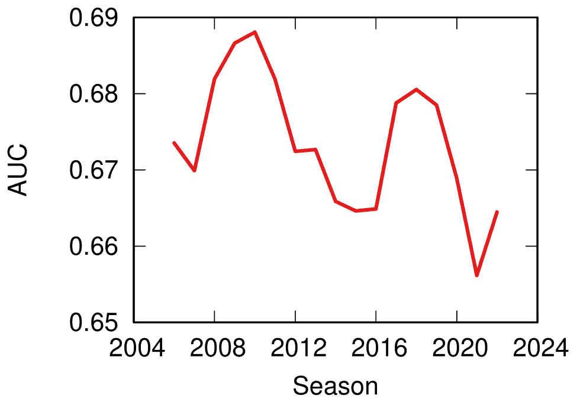
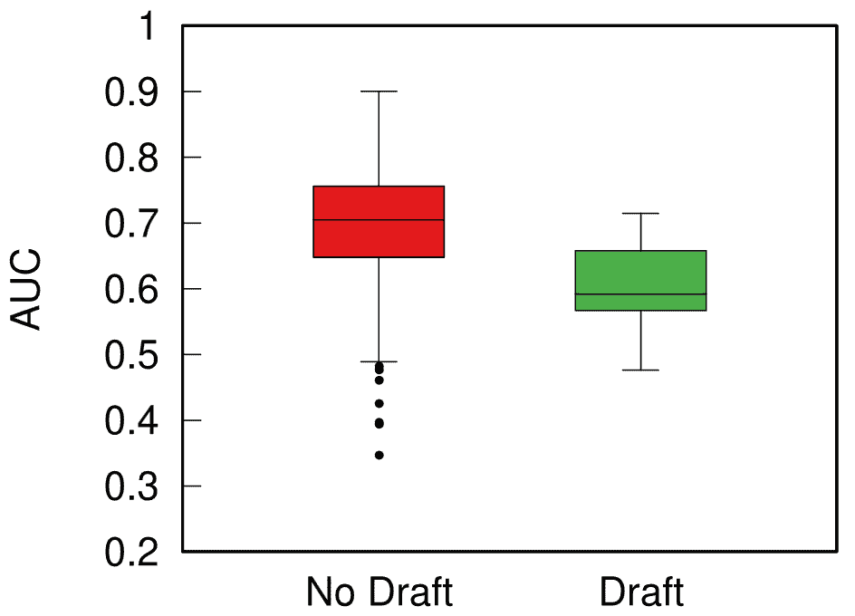

<!--yml
category: 未分类
date: 2024-05-27 14:29:28
-->

# | Predictability, Home Advantage, and Fairness in Team SportsMichele Coscia

> 来源：[https://www.michelecoscia.com/?p=2311](https://www.michelecoscia.com/?p=2311)

There was a [nice paper](https://royalsocietypublishing.org/doi/full/10.1098/rsos.210617) published a while ago by the excellent [Taha Yasseri](https://tahayasseri.com/) showing that soccer is becoming more predictable over time: from the early 90s to now, models trying to guess who would win a game had grown in accuracy. I got curious and asked myself: does this hold only for soccer, or is it a general phenomenon across different team sports? The result of this question was the paper: “[Which sport is becoming more predictable? A cross-discipline analysis of predictability in team sports](https://rdcu.be/dxgwD),” which just appeared on EPJ Data Science.

My idea was that, as there is more and more money and professionalism in sport, those who are richer will become stronger over time, and dominate for a season, which will make them more rich, and therefore more dominant, and more rich, until you get Juventus, which came in first or second in almost 50% of the 119 soccer league seasons played in Italy.

My first step was to get data about 300,000 matches played across 49 leagues in nine disciplines (baseball, basket, cricket, football, handball, hockey, rugby, soccer, and volleyball). My second step was to blatantly steal the entire methodology from Taha’s paper because, hey, why innovate when you can just copy the best? (Besides, this way I could reproduce and confirm their finding, at least that’s the story I tell myself to fall asleep at night)

Predictability (y axis, higher means more predictable) over time (x axis) across all disciplines. No clear trend here!

The first answer I got was that Taha was right, but mostly only about soccer. Along with volleyball (and maybe baseball) it is one of the few disciplines that is getting more predictable over time. The rest of the disciplines are a mixed bag of non-significant results and actual decreases in predictability.

One factor that could influence these results is home advantage. Normally, the team playing home has slighter higher odds of winning. And, sometimes, not so slight. In the elite rugby tournament in France, home advantage is something like 80%. To give an idea, 2014 French *champions* Toulon *only won 4 out of their 13 away games*, and two of them were against the bottom two teams of the league that got relegated that season.

It’s all in the [pilou pilou](https://www.youtube.com/watch?v=1bR7nPRBqQ0). Would you really go to Toulon and tell this guy you expect to win? Didn’t think so.

Well, this is something that actually changed almost universally across disciplines: home advantage has been shrinking across the board — from an average of 64% probability of home win in 2011 to 55% post-pandemic. The home advantage did shrink during Covid, but this trend started almost a decade before the pandemic. The little bugger did nothing to help — having matches played behind closed doors altered the dynamics of the games –, but it only sped up the trend, it didn’t create it.

What about my original hypothesis? Is it true that the rich-get-richer effect is behind predictability? This can be tested, because most American sports are managed under a socialist regime: players have unions, the worst performing teams in one season can pick the best rookies for the next, etc. In Europe, players don’t have unions and if you have enough money you can buy whomever you want.

Boxplot with the distributions of predictability for European sports (red) and American ones (green). The higher the box, the more predictable the results.

When I split leagues by the management system they follow, I can clearly see that indeed those under the European capitalistic system tend to be more predictable. So next time you’re talking with somebody preaching laissez-faire anarcho-capitalism tell them that, at least, under socialism you don’t get bored at the stadium by knowing in advance who’ll win.