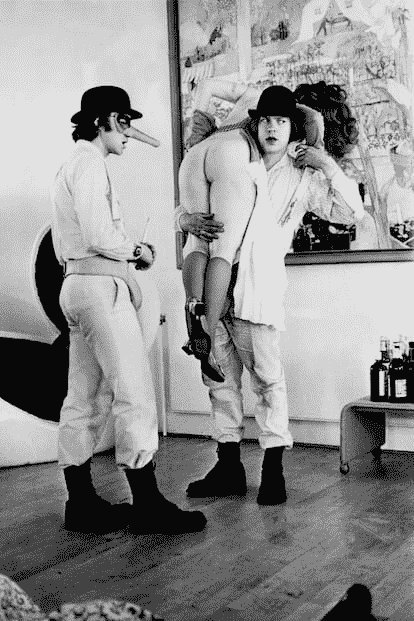
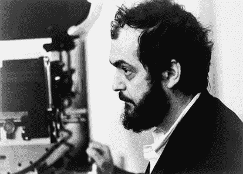
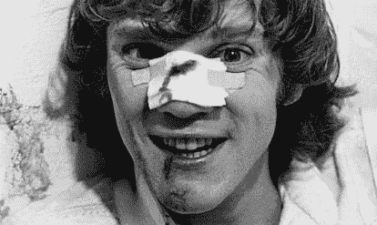

<!--yml
category: 未分类
date: 2024-05-27 14:30:48
-->

# ‘I should not have written ‘A Clockwork Orange’’: How Anthony Burgess came to disown his own novel | Culture | EL PAÍS English

> 来源：[https://english.elpais.com/culture/2024-01-29/i-should-not-have-written-a-clockwork-orange-how-anthony-burgess-came-to-disown-his-own-novel.html](https://english.elpais.com/culture/2024-01-29/i-should-not-have-written-a-clockwork-orange-how-anthony-burgess-came-to-disown-his-own-novel.html)

British author Anthony Burgess was inspired to write his best-known novel, *A Clockwork Orange* (1962), by the uncivil drift that he perceived among the youth of his time. That is why, a decade later, when headlines in the vein of “Police hunt the Clockwork Orange rapist gang” or “Child dies in Clockwork Orange war” started to appear in the press, he could not help but feel that something had gone tremendously wrong.

“The misunderstanding [of the novel] will pursue me until I die. I should not have written the book because of this danger of misinterpretation,” he wrote in 1985 in *Flame into Being*, a biography of D.H. Lawrence where he compared the scandal caused by *Lady Chatterley’s Lover* (1928) with the controversy surrounding his popular dystopia. “If a couple of nuns are raped in the Vatican, I get a call from a newspaper. They have turned me into some kind of expert [on violence](https://english.elpais.com/culture/2023-12-11/fargo-is-back-to-bring-us-a-post-trump-cannibalistic-america.html),” he lamented in a television interview. Burgess, however, was clear that his problems did not necessarily stem from the book, but from [Stanley Kubrick](https://english.elpais.com/culture/2022-11-17/shelley-duvall-disappearance-and-return-of-an-icon-that-cinema-pushed-to-the-limit.html)’s 1971 film adaptation.

The 2023 documentary *Orange mécanique, les rouages de la violence* (in English, A clockwork orange: the prophecy), produced by the French division of the cultural television channel Arte, delves into the conflictive relationship between the writer and the title with which he went down in the history of 20th century literature – whether he liked it or not. The medium-length film is based on *The Clockwork Condition*, a manuscript written immediately after the release of the film and found after Burgess’ death, in which the author explained the themes of his novel and defended himself against those who accused him of glorifying crime. “All works of art are dangerous. My little son tried to fly after seeing Disney’s *Peter Pan*. I grabbed his legs just as he was about to take off from a fourth story window,” he stated. His desire to explain, and even vindicate himself, contrasted with the resigned attitude that he would maintain in the following decade, the 1980s.

### *Singin’ in the Rain*

Both the film and the novel tell the story of Alex, a Beethoven-loving juvenile delinquent who, along with his three *droogs* (friends, according to the Nadsat language that they use to communicate), systematically beats and rapes until he is finally arrested. With the aim of getting out of prison as soon as possible, he volunteers for an experimental treatment known as the Ludovico technique, a behavioral conditioning therapy that erases all violent impulses from him. Deprived of moral choice, he becomes a person with no free will who is insulted and humiliated by everyone around him. The title, *A Clockwork Orange*, alludes, in the words of its author, to “the application of a mechanistic morality to a living organism oozing with juice and sweetness.”

One of the violent scenes in ‘A Clockwork Orange,’ in which the main characters attack a woman.ullstein bild Dtl. (ullstein bild via Getty Images)

Stanley Kubrick, the director who brought ‘A Clockwork Orange’ to the big screen and made it one of the most controversial films of all time.Bettmann (Bettmann Archive)

When the book’s harshest pages were depicted in Kubrick’s film, the images — particularly [a sexual assault](https://english.elpais.com/culture/2023-09-26/when-literature-and-documentaries-warn-about-incestuous-sexual-abuse.html) carried out to the rhythm of *Singin’ in the Rain* — made a sudden impact, with reactions ranging from heated debates about the social responsibility of art to violent episodes apparently based on the film. Kubrick himself, in response to a series of murder trials where the defendants explicitly mentioned his work, requested the withdrawal of *A Clockwork Orange* in the United Kingdom, where it could not be seen again until the director’s death in 1999.

Meanwhile, Burgess had unwittingly become its spokesman. The good relationship born from that collaboration, which seemed that would extend to a film about [Napoleon](https://english.elpais.com/culture/2023-11-24/napoleon-the-great-man-leaves-me-cold.html) that Kubrick wanted to make, began to deteriorate when the filmmaker left the author and the lead actor, Malcolm McDowell, alone in front of the media to talk about *A Clockwork Orange* and its controversies. Burgess even attended several ceremonies to collect awards in Kubrick’s name. A public fatigue and a marked association with the film from which he was never able to recover. In the script of the 1984 stage adaptation, just in case there were any doubts about the esteem in which he held his former friend, Burgess introduced a character “with a beard like Stanley Kubrick’s” who played *Singin’ in the Rain* with a trumpet — before being kicked off the stage.

His weariness with the phenomenon and his distancing from his own creation grew and grew. Straightforwardly, in the prologue to the 1986 American reissue of the book, he dismissed its artistic merits, crediting Kubrick’s film as the sole reason why it continued to arouse the public’s interest: “I first published the novella *A Clockwork Orange* in 1962, which ought to be far enough in the past for it to be erased form the world’s literary memory. [...] I should myself be glad to disown it for various reasons,” he wrote. However, “it seems likely to survive, while other works of mine that I value more bite the dust.” He continued: “To sit down in a dull room and compose the *Missa Solemis* or *The Anatomy of the Melancholy* does not make headlines or news flashes. Unfortunately my little squib of a book was found attractive to many because it was as odorous as a crateful of bad eggs with the miasma of original sin.”

### Chapter 21

Both that prologue and the recently released documentary place the point of conflict with the film not so much in its depiction of violence (“Kubrick turns violence into farce. He puts you in the position of wondering if you should laugh,” states writer Will Self, one of the interviewees) as in its omission of the final part, chapter 21, in which Alex actually reforms. The absence of that last piece was the result of an intervention by the American editor, who eliminated the chapter thinking that the outcome proposed in the previous pages was more suggestive. Kubrick thought so, too. In the film and in the American edition of the book, the effects of the Ludovico technique were reversed and Alex was able to go back to committing crimes at will. However, in Burgess’ complete text, Alex’s encounter with one of his former *droogs*, now married and with his own apartment, makes him reflect on his life and choose to abandon violence to start a family. A [reach of maturity](https://english.elpais.com/elpais/2012/01/08/inenglish/1326003642_850210.html) that, symbolically, coincides with the age of majority (21) at that time.

Anthony Burgess, author of ‘A Clockwork Orange,’ pictured in 1987.Michel SETBOUN (Gamma-Rapho via Getty Images)

“Anthony Burgess was an established man, conservative in many of his beliefs, his social, religious and political values. With that ending, he was putting the middle class as the savior against authoritarian states,” explains Eduardo Valls Oyarzun, teacher of English literature at the Complutense University of Madrid. “The problem with free will is the philosophical concept that the novel articulates and that he sees as the space where youth develops. When he starts to explore it, he notices the enormous burden of the influence of the state on that free will. His way of understanding good and evil in the novel is political, not metaphysical or moral in the classic religious sense. The authoritarian state penetrates the psyche of the individual, the self.”

The triggering incident for Burgess’ novel took place in 1942, when the writer’s first wife was brutally assaulted and beaten in London by three American deserters. She lost the baby she was expecting and, as a result of continuous internal bleeding, died a few years later. It is not difficult to find the reflection of this event in *A Clockwork Orange*: the husband of the woman who is raped by Alex and his *droogs* is an author who, in fact, is finishing a manuscript titled *A Clockwork Orange*. The documentary explains how, on his return to England after working in the British colony of Malaysia and the protectorate of Brunei, the writer found himself in a climate of alert due to the rise of juvenile delinquency. The rebellious subculture of the so-called teddy boys and the concerns raised by the importation of the [American lifestyle](https://english.elpais.com/usa/2023-05-16/how-the-american-dream-convinces-people-loneliness-is-normal.html) and values crystallized clearly in the book, which found its definitive ingredient in the studies of behaviorism published by the psychologist Burrhus Frederic Skinner.

### Kennedy, Nixon and Warhol

Before Kubrick, in 1965, Andy Warhol filmed his own adaptation of the novel and named it *Vinyl*. Composed of basically just one frame over the course of an hour, Warhol’s version drew from the same imaginary that Burgess relied on: the rise of a defiant adolescent aesthetic in line with the emerging figures of rock & roll, from Marlon Brando in *On the Waterfront* (1954) to James Dean in *Rebel Without a Cause* (1955). Warhol formulated a subversive discourse, different from Burgess’ and whose homoerotic motifs also made the Ludovico technique a reference to conversion therapies.

In both the novel and Kubrick’s film, the characters of the author and his helpers were caricatured in their role as opponents of the government, depicted as a group of intellectuals who are more concerned with using Alex as a tool than with helping him. A disbelief towards the political sides that, again, was nuanced in the final chapter. “My book was Kennedyan and accepted the notion of moral progress. What was really wanted [in the American version that got rid of chapter 21] was a Nixonian book with no shred of optimism in it. Let us have evil prancing on the page and, up to the very last line, sneering in the face of all the inherited beliefs [...] about people being able to make themselves better,” reproached Burgess in 1986.

Malcolm McDowell, star of ‘A Clockwork Orange.’ullstein bild Dtl. (ullstein bild via Getty Images)

“Kubrick used to say that the best adaptations came from bad or flawed novels. Maybe Anthony Burgess bought into that speech and began to see his novel as flawed,” believes teacher Eduardo Valls, regarding the writer’s disenchantment with the popularity of the book. “But for my taste, the distortion that the film makes is not significant. The problem with the adaptation is that it is much more essentialist, although it is not derivative, but rather stands on its own. I like to say that they are two different masterpieces.”

Related to *Brave New World* (1932) and [*1984* (1949)](https://english.elpais.com/culture/2022-11-26/1984-how-george-orwells-big-brother-was-born-during-the-spanish-civil-war.html) as an example of the British dystopia of the 20th century (not in vain Burgess was a big admirer of George Orwell), *A Clockwork Orange* was an experiment in its author’s canon, although, in Valls’ opinion, it is not necessarily an orphan novel. “It diverts from his line, which is marked by the contemplation of the colonial world or his experience during his stays in Southeast Asia, but the problems that have to do with the definition of good and evil are inherent to his own work.” It is also not something that can be easily rejected. “What surrounded the film did not sit well with him. I think it was a subjective reaction. It’s a novel that became a popular and cultural phenomenon that undoubtedly transcends the author. Ask around; see how many people can name another Anthony Burgess book.”

*Sign up for* [*our weekly newsletter*](https://plus.elpais.com/newsletters/lnp/1/333/?lang=en) *to get more English-language news coverage from EL PAÍS USA Edition*