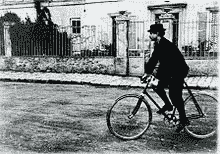
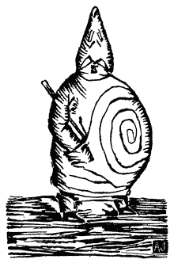

<!--yml
category: 未分类
date: 2024-05-29 12:52:15
-->

# 'Pataphysics - Wikipedia

> 来源：[https://en.wikipedia.org/wiki/%27Pataphysics](https://en.wikipedia.org/wiki/%27Pataphysics)

Philosophy or pseudophilosophy that concerns what lies beyond metaphysics

Jarry in [Corbeil](/wiki/Corbeil-Essonnes "Corbeil-Essonnes") in 1898^([[1]](#cite_note-1)).

**'Pataphysics** ([French](/wiki/French_language "French language"): *'pataphysique*) is a "[philosophy](/wiki/Philosophy "Philosophy")" of [science](/wiki/Science "Science") invented by French writer [Alfred Jarry](/wiki/Alfred_Jarry "Alfred Jarry") (1873–1907) intended to be a [parody](/wiki/Parody "Parody") of science.^([[3]](#cite_note-3)) Difficult to be simply defined or pinned down, it has been described as the "science of imaginary solutions".^([[4]](#cite_note-4))

## Introduction[[edit](/w/index.php?title=%27Pataphysics&action=edit&section=1 "Edit section: Introduction")]

'Pataphysics was a concept expressed by Jarry in a mock-scientific manner, with undertones of spoofing and [quackery](/wiki/Quackery "Quackery"), as expounded in his novel *[Exploits and Opinions of Dr. Faustroll, Pataphysician](/wiki/Exploits_and_Opinions_of_Dr._Faustroll,_Pataphysician "Exploits and Opinions of Dr. Faustroll, Pataphysician")*. Here, Jarry toyed with conventional concepts and interpretations of reality. Another attempt at a definition interprets 'pataphysics as an idea that "the virtual or imaginary nature of things as glimpsed by the heightened vision of poetry or science or love can be seized and lived as real". Jarry defines 'pataphysics in a number of statements and examples, including that it is "the science of imaginary solutions, which symbolically attributes the properties of objects, described by their virtuality, to their lineaments". A practitioner of 'pataphysics is a pataphysician or a pataphysicist.

## Definitions[[edit](/w/index.php?title=%27Pataphysics&action=edit&section=2 "Edit section: Definitions")]

One definition of 'pataphysics is that it is "a branch of philosophy or science that examines imaginary phenomena that exist in a world beyond [metaphysics](/wiki/Metaphysics "Metaphysics"); it is the science of imaginary solutions."^([[7]](#cite_note-7)) Jean Baudrillard defines 'pataphysics as "the imaginary science of our world, the imaginary science of excess, of excessive, parodic, paroxystic effects - particularly the excess of emptiness and insignificance".^([[8]](#cite_note-8))

There are over one hundred definitions of 'pataphysics. Some examples are shown below.

> 'Pataphysics is the science of that which is superinduced upon metaphysics, whether within or beyond the latter's limitations, extending as far beyond metaphysics as the latter extends beyond physics. ... 'Pataphysics will be, above all, the science of the particular, despite the common opinion that the only science is that of the general. 'Pataphysics will examine the laws governing exceptions, and will explain the universe supplementary to this one.

> 'Pataphysics is patient; 'Pataphysics is benign; 'Pataphysics envies nothing, is never distracted, never puffed up, it has neither aspirations nor seeks not its own, it is even-tempered, and thinks not evil; it mocks not iniquity: It is enraptured with scientific truth; it supports everything, believes everything, has faith in everything, and upholds everything that is.^([[10]](#cite_note-10))

> 'Pataphysics passes easily from one state of apparent definition to another. Thus it can present itself under the aspect of a gas, a liquid or a solid.^([[11]](#cite_note-11))

> 'Pataphysics "the science of the particular" does not, therefore, study the rules governing the general recurrence of a periodic incident (the expected case) so much as study the games governing the special occurrence of a sporadic accident (the excepted case). [...] Jarry performs humorously on behalf of literature what Nietzsche performs seriously on behalf of philosophy. Both thinkers in effect attempt to dream up a "gay science" whose joie de vivre thrives wherever the tyranny of truth has increased our esteem for the lie and wherever the tyranny of reason has increased our esteem for the mad.

## Etymology[[edit](/w/index.php?title=%27Pataphysics&action=edit&section=3 "Edit section: Etymology")]

The word '*pataphysics* is a contracted formation, derived from the Greek τὰ ἐπὶ τὰ μεταφυσικά (*tà epì tà metaphusiká*), a phrase or expression meaning "that which is above [metaphysics](/wiki/Metaphysics "Metaphysics")", and is itself a sly variation on the title of [Aristotle](/wiki/Aristotle "Aristotle")'s *[Metaphysics](/wiki/Metaphysics_(Aristotle) "Metaphysics (Aristotle)")*, which in Greek is "τὰ μετὰ τὰ φυσικά" (*tà metà tà phusiká*).

Jarry mandated the inclusion of the apostrophe in the orthography, 'pataphysique and 'pataphysics, "... to avoid a simple pun". The words *pataphysician* or *pataphysicist* and the adjective *pataphysical* should not include the apostrophe. Only when consciously referring to Jarry's science itself should the word *'pataphysics* carry the apostrophe. The term *pataphysics* is a [paronym](/wiki/Paronym "Paronym") (considered a kind of pun in French) of *metaphysics*. Since the apostrophe in no way affects the meaning or pronunciation of *pataphysics*, this spelling of the term is a sly notation, to the reader, suggesting a variety of puns that listeners may hear, or be aware of. These puns include *patte à physique* ("physics paw"), as interpreted by Jarry scholars [Keith Beaumont](/w/index.php?title=Keith_Beaumont&action=edit&redlink=1 "Keith Beaumont (page does not exist)") and [Roger Shattuck](/wiki/Roger_Shattuck "Roger Shattuck"), *pas ta physique* ("not your physics"), and *pâte à physique* ("physics paste").

## History[[edit](/w/index.php?title=%27Pataphysics&action=edit&section=4 "Edit section: History")]

The term first appeared in print in the text of Alfred Jarry's play *Guignol* in the 28 April 1893 issue of *[L'Écho de Paris littéraire illustré](/wiki/L%27%C3%89cho_de_Paris_litt%C3%A9raire_illustr%C3%A9 "L'Écho de Paris littéraire illustré")*, but it has been suggested that the word has its origins in the same school pranks at the *lycée* in [Rennes](/wiki/Rennes "Rennes") that led Jarry to write *[Ubu Roi](/wiki/Ubu_Roi "Ubu Roi")*. Jarry considered Ibicrates and Sophrotatos the Armenian as the fathers of this "science".

### The Collège de 'Pataphysique[[edit](/w/index.php?title=%27Pataphysics&action=edit&section=5 "Edit section: The Collège de 'Pataphysique")]

The *Collège de 'Pataphysique*, founded in 1948 in [Paris](/wiki/Paris "Paris"), France, is "a society committed to learned and inutilious research". (The word 'inutilious' is synonymous with 'useless'.) The motto of the college is [Latin](/wiki/Latin_language "Latin language"): *[Eadem mutata resurgo](/wiki/Eadem_mutata_resurgo "Eadem mutata resurgo")* ("I arise again the same though changed").

The permanent head of the college is the Inamovable Curator, Dr. Faustroll, assisted by Bosse-de-Nage (*Starosta*): both are fictional.

The Vice-Curator is the "first and most senior living entity" in the college's hierarchy. The Vice-Curatrice as of 2018^([[update]](https://en.wikipedia.org/w/index.php?title=%27Pataphysics&action=edit)) is Tanya Peixoto of the London Institute of 'Pataphysics and Bookartbookshop.^([[21]](#cite_note-21)) She was elected in 2014 to succeed Her Magnificence Lutembi – a crocodile – who succeeded Opach, the Baron Mollet, and Doctor Sandomir.

[Jean-Christophe Averty](/wiki/Jean-Christophe_Averty "Jean-Christophe Averty") was appointed [Satrap](/wiki/Satrap "Satrap") in 1990.

Publications of the college, generally called [Latin](/wiki/Latin_language "Latin language"): *Viridis Candela* ("green candle"), include the *Cahiers*, *Dossiers*, the *Subsidia Pataphysica* and since september 2021, the *Spéculations*.^([[29]](#cite_note-29))^([[31]](#cite_note-31))

Notable members have included [Marcel Duchamp](/wiki/Marcel_Duchamp "Marcel Duchamp"), [Joan Miró](/wiki/Joan_Mir%C3%B3 "Joan Miró"), [Eugène Ionesco](/wiki/Eug%C3%A8ne_Ionesco "Eugène Ionesco"),^([[32]](#cite_note-The_Guardian_2005-32)) [Noël Arnaud](/w/index.php?title=No%C3%ABl_Arnaud&action=edit&redlink=1 "Noël Arnaud (page does not exist)") [[fr](https://fr.wikipedia.org/wiki/No%C3%ABl_Arnaud "fr:Noël Arnaud")], [Jean-Christophe Averty](/wiki/Jean-Christophe_Averty "Jean-Christophe Averty"), [René Daumal](/wiki/Ren%C3%A9_Daumal "René Daumal"), [Luc Étienne](/wiki/Luc_%C3%89tienne "Luc Étienne"), [François Le Lionnais](/wiki/Fran%C3%A7ois_Le_Lionnais "François Le Lionnais"), [Jean Lescure](/wiki/Jean_Lescure "Jean Lescure"), [Raymond Queneau](/wiki/Raymond_Queneau "Raymond Queneau"), [Boris Vian](/wiki/Boris_Vian "Boris Vian"), [Jacques Carelman](/wiki/Jacques_Carelman "Jacques Carelman"), [Man Ray](/wiki/Man_Ray "Man Ray"), [Max Ernst](/wiki/Max_Ernst "Max Ernst"), [Julien Torma](/wiki/Julien_Torma "Julien Torma"), [Roger Shattuck](/wiki/Roger_Shattuck "Roger Shattuck"), [Groucho, Chico and Harpo Marx](/wiki/Marx_Brothers "Marx Brothers"), [Philippe de Chérisey](/wiki/Philippe_de_Ch%C3%A9risey "Philippe de Chérisey"), [Rolando Villazón](/wiki/Rolando_Villaz%C3%B3n "Rolando Villazón"), [Fernando Arrabal](/wiki/Fernando_Arrabal "Fernando Arrabal") and [Gavin Bryars](/wiki/Gavin_Bryars "Gavin Bryars"). The [Oulipo](/wiki/Oulipo "Oulipo") began as a subcommittee of the college.^([[34]](#cite_note-34))

### Offshoots of the Collège de 'Pataphysique[[edit](/w/index.php?title=%27Pataphysics&action=edit&section=6 "Edit section: Offshoots of the Collège de 'Pataphysique")]

Although France had been always the centre of the pataphysical globe, there are followers in different cities around the world. In 1966 Juan Esteban Fassio was commissioned to draw the map of the *Collège de 'Pataphysique* and its institutes abroad.

The college stopped its public activities between 1975 and 2000, referred to as its *occultation*. However through that time, Germany, Sweden, Switzerland, Canada, The Netherlands, and many other countries showed that the internationalization of 'pataphysics was irreversible.

In the 1950s, [Buenos Aires](/wiki/Buenos_Aires "Buenos Aires") in the Western Hemisphere and [Milan](/wiki/Milan "Milan") in Europe were the first cities to have 'pataphysical institutes. [London](/wiki/London "London"), [Edinburgh](/wiki/Edinburgh "Edinburgh"), [Budapest](/wiki/Budapest "Budapest"), and [Liège](/wiki/Li%C3%A8ge "Liège"), as well as many other European cities, caught up in the sixties.

#### Czechoslovakia[[edit](/w/index.php?title=%27Pataphysics&action=edit&section=7 "Edit section: Czechoslovakia")]

During the [communist era](/wiki/Communist_era "Communist era"), a small group of 'pataphysicists in [Czechoslovakia](/wiki/Czechoslovakia "Czechoslovakia") started a journal called *PAKO*, or *Pataphysical Collegium*. Jarry's plays had a lasting impression on the country's underground philosophical scene.

#### London Institute of 'Pataphysics[[edit](/w/index.php?title=%27Pataphysics&action=edit&section=8 "Edit section: London Institute of 'Pataphysics")]

The London Institute of 'Pataphysics was established in September 2000 to promote 'pataphysics in the English-speaking world. The institute has various publications, including a journal, and has six departments:^([[39]](#cite_note-39)) Bureau for the Investigation of Subliminal Images, Committee for Hirsutism and Pogonotrophy, Department of Dogma and Theory, Department of Potassons, Department of Reconstructive Archaeology, and The Office of Patentry.

The institute also contains a pataphysical museum and archive and organised the *[Anthony Hancock Paintings and Sculptures](/wiki/The_Rebel_(1961_film)#Other_information_of_note "The Rebel (1961 film)")* exhibition in 2002.^([[40]](#cite_note-40))

The official orchestra of the London Institute of 'Pataphysics is the [London Snorkelling Team](/w/index.php?title=London_Snorkelling_Team&action=edit&redlink=1 "London Snorkelling Team (page does not exist)").

Peter Blegvad has been the president of the London Institute of 'Pataphysics since 2011.^([[41]](#cite_note-41))

#### Musée Patamécanique[[edit](/w/index.php?title=%27Pataphysics&action=edit&section=9 "Edit section: Musée Patamécanique")]

[Musée Patamécanique](/wiki/Mus%C3%A9e_Patam%C3%A9canique "Musée Patamécanique") is a private museum located in [Bristol, Rhode Island](/wiki/Bristol,_Rhode_Island "Bristol, Rhode Island").^([[42]](#cite_note-42)) Founded in 2006, it is open by appointment only to friends, colleagues, and occasionally to outside observers. The museum is presented as a hybrid between an automaton theatre and a cabinet of curiosities and contains works representing the field of Patamechanics, an artistic practice and area of study chiefly inspired by 'pataphysics.

Examples of exhibits include a troupe of singing animatronic chipmunks, a time machine the museum says is the world's largest automated [phenakistoscope](/wiki/Phenakistoscope "Phenakistoscope"), an olfactory clock, a chandelier of singing animatronic nightingales, an Undigestulator (a device that purportedly reconstitutes digested foods), a peanuts enlarger, a syzygistic oracle, the earolin (a 24-inch tall holographic ear that plays the violin), and a machine for capturing the dreams of bumble bees.^([[43]](#cite_note-43))

#### 'Pataphysics Institute in Vilnius[[edit](/w/index.php?title=%27Pataphysics&action=edit&section=10 "Edit section: 'Pataphysics Institute in Vilnius")]

A 'Pataphysics Institute opened in [Vilnius](/wiki/Vilnius "Vilnius"), Lithuania in May 2013.^([[44]](#cite_note-44))

## Concepts[[edit](/w/index.php?title=%27Pataphysics&action=edit&section=11 "Edit section: Concepts")]

[Clinamen](/wiki/Clinamen "Clinamen")

A clinamen is the unpredictable swerve of atoms that poet [Christian Bök](/wiki/Christian_B%C3%B6k "Christian Bök") calls "... the smallest possible aberration that can make the greatest possible difference". An example is Jarry's *merdre*, a swerve of [French](/wiki/French_language "French language"): *merde* ("shit").

*The Grand Gidouille* on Ubu's belly is a symbol of 'pataphysics.

[Antinomy](/wiki/Antinomy "Antinomy")

An antinomy is the mutually incompatible. It represents the duality of things, the echo or symmetry, the good and the evil at the same time. [Hugill](/wiki/Andrew_Hugill "Andrew Hugill") mentions various examples including the plus-minus, the faust-troll, the haldern-ablou, the yes-but, the ha-ha and the [paradox](/wiki/Paradox "Paradox").

[Syzygy](/wiki/Syzygy_(astronomy) "Syzygy (astronomy)")

The syzygy originally comes from [astronomy](/wiki/Astronomy "Astronomy") and denotes the alignment of three celestial bodies in a straight line. In a pataphysical context it is the [pun](/wiki/Pun "Pun"). It usually describes a conjunction of things, something unexpected and surprising. [Serendipity](/wiki/Serendipity "Serendipity") is a simple chance encounter but the syzygy has a more scientific purpose. Bök mentions Jarry suggesting that the fall of a body towards a centre might not be preferable to the ascension of a vacuum towards a periphery.

[Absolute](/wiki/Absolute_(philosophy) "Absolute (philosophy)")

The absolute is the idea of a transcended reality.

[Anomaly](/wiki/Anomaly_(physics) "Anomaly (physics)")

An anomaly represents the exception. Jarry said that, "Pataphysics will examine the laws governing exceptions, and will explain the universe supplementary to this one." Bök calls it "... the repressed part of a rule which ensures that the rule does not work".

[Pataphor](#Pataphor)

A pataphor is an unusually extended [metaphor](/wiki/Metaphor "Metaphor") based on 'pataphysics. As Jarry claimed that 'pataphysics exists "... as far from metaphysics as metaphysics extends from regular reality", a pataphor attempts to create a figure of speech that exists as far from metaphor as metaphor exists from [non-figurative](/wiki/Non-figurative "Non-figurative") language.^([[53]](#cite_note-53))

## Pataphysical calendar[[edit](/w/index.php?title=%27Pataphysics&action=edit&section=12 "Edit section: Pataphysical calendar")]

The pataphysical calendar^([[54]](#cite_note-54)) is a variation of the [Gregorian calendar](/wiki/Gregorian_calendar "Gregorian calendar"). The *Collège de 'Pataphysique* created the calendar^([[55]](#cite_note-55)) in 1949\. The pataphysical era (E.P.) started on Jarry's birthday, 8 September 1873 vulg. When converting pataphysical dates to Gregorian dates, the appendage (vulg.) for *vulgate* ("common") is added.

The week starts on a Sunday. Every 1st, 8th, 15th, and 22nd is a Sunday and every 13th day of a month falls on a Friday (see [Friday the 13th](/wiki/Friday_the_13th "Friday the 13th")). Each day is assigned a specific name or [saint](/wiki/Saint "Saint"). For example, the 27 Haha (1 November vulg.) is called [French](/wiki/French_language "French language"): *Occultation d'Alfred Jarry* or the 14 Sable (14 December vulg.) is the day of [French](/wiki/French_language "French language"): *Don Quichote, champion du monde*.

The year has a total of 13 months each with 29 days. The 29th day of each month is imaginary with two exceptions:

*   the 29 Gidouille (13 July vulg.) is always non-imaginary
*   the 29 Gueules (23 February vulg.) is non-imaginary during [leap years](/wiki/Leap_year "Leap year")

The table below shows the names and order of months in a pataphysical year with their corresponding Gregorian dates and approximate translations or meanings by Hugill.

Pataphysical year

| Month | Starts | Ends | Translation |
| Absolu | 8 September | 5 October | *Absolute* |
| Haha | 6 October | 2 November | *Ha Ha* |
| As | 3 November | 30 November | *Skiff* |
| Sable | 1 December | 28 December | *Sand* or *heraldic black* |
| Décervelage | 29 December | 25 January | *Debraining* |
| Gueules | 26 January | 22 February | *Heraldic red* or *gob* |
| Pédale | 23/24 February | 22 March | *Bicycle pedal* |
| Clinamen | 23 March | 19 April | *Swerve* |
| Palotin | 20 April | 17 May | *Ubu's henchmen* |
| Merdre | 18 May | 14 June | *Pshit* |
| Gidouille | 15 June | 13 July | *Spiral* |
| Tatane | 14 July | 10 August | *Shoe* or *being worn out* |
| Phalle | 11 August | 7 September | *Phallus* |

For example:

*   8 September 1873 (vulg.) = 1 Absolu 1
*   1 January 2000 (vulg.) = 4 Décervelage 127
*   10 November 2012 (vulg.)(Saturday) = 8 As 140 (Sunday)

## Works influenced by 'Pataphysics[[edit](/w/index.php?title=%27Pataphysics&action=edit&section=13 "Edit section: Works influenced by 'Pataphysics")]

In the 1960s 'pataphysics was used as a [conceptual](/wiki/Conceptual_art "Conceptual art") principle within various [fine art](/wiki/Fine_art "Fine art") forms, especially [pop art](/wiki/Pop_art "Pop art") and [popular culture](/wiki/Popular_culture "Popular culture"). Works within the pataphysical tradition tend to focus on the processes of their creation, and elements of chance or arbitrary choices are frequently key in those processes. Select pieces from the artist [Marcel Duchamp](/wiki/Marcel_Duchamp "Marcel Duchamp") and the composer [John Cage](/wiki/John_Cage "John Cage") characterize this. At around this time, [Asger Jorn](/wiki/Asger_Jorn "Asger Jorn"), a pataphysician and member of the [Situationist International](/wiki/Situationist_International "Situationist International"), referred to 'pataphysics as a new religion.^([[60]](#cite_note-60))

### In literature[[edit](/w/index.php?title=%27Pataphysics&action=edit&section=14 "Edit section: In literature")]

In 1948 [Raymond Queneau](/wiki/Raymond_Queneau "Raymond Queneau"), [Jean Genet](/wiki/Jean_Genet "Jean Genet"), and [Eugène Ionesco](/wiki/Eug%C3%A8ne_Ionesco "Eugène Ionesco") founded Collège de pataphysique and published [OULIPO](/wiki/Oulipo "Oulipo"),^([[a]](#cite_note-62)) which influenced the following writers:

### In music[[edit](/w/index.php?title=%27Pataphysics&action=edit&section=15 "Edit section: In music")]

*   In the song "[Maxwell's Silver Hammer](/wiki/Maxwell%27s_Silver_Hammer "Maxwell's Silver Hammer")" on [the Beatles](/wiki/The_Beatles "The Beatles") album *[Abbey Road](/wiki/Abbey_Road "Abbey Road")*, "pataphysical science" is mentioned as a course of study for Joan, the first victim of Maxwell Edison.^([[70]](#cite_note-71))
*   The debut album by Ron 'Pate's Debonairs, featuring [Reverend Fred Lane](/wiki/Reverend_Fred_Lane "Reverend Fred Lane") (his first appearance on vinyl), is titled *Raudelunas 'Pataphysical Revue* (1977), a live theatrical performance. A review in *[The Wire](/wiki/The_Wire_(magazine) "The Wire (magazine)")* magazine said, "No other record has ever come as close to realising Alfred Jarry's desire 'to make the soul monstrous' – or even had the vision or invention to try."^([[71]](#cite_note-72)) 'Pate (note the pataphysical apostrophe) and Lane were central members in the Raudelunas art collective in [Tuscaloosa, Alabama](/wiki/Tuscaloosa,_Alabama "Tuscaloosa, Alabama").
*   Professor [Andrew Hugill](/wiki/Andrew_Hugill "Andrew Hugill"), of [de Montfort University](/wiki/De_Montfort_University "De Montfort University"), is a practitioner of pataphysical music. He curated *Pataphysics*, for the [Sonic Arts Network](/wiki/Sonic_Arts_Network "Sonic Arts Network")'s CD series,^([[72]](#cite_note-73)) and in 2007 some of his own music was issued by UHRecordings under the title *Pataphysical Piano; The sounds and silences of Andrew Hugill*.^([[73]](#cite_note-74))
*   British [progressive rock](/wiki/Progressive_rock "Progressive rock") band [Soft Machine](/wiki/Soft_Machine "Soft Machine") were self-described as "the Official Orchestra of the College of Pataphysics" and featured the two songs "Pataphysical Introduction" parts I and II on their 1969 album *[Volume Two](/wiki/Volume_Two_(The_Soft_Machine_album) "Volume Two (The Soft Machine album)")*.
*   Japanese [psychedelic rock](/wiki/Psychedelic_rock "Psychedelic rock") band [Acid Mothers Temple](/wiki/Acid_Mothers_Temple "Acid Mothers Temple") refer to the topic on their 1999 release *[Pataphisical Freak Out MU!!](/wiki/Pataphisical_Freak_Out_MU!! "Pataphisical Freak Out MU!!")*.
*   [Autolux](/wiki/Autolux "Autolux"), a Los Angeles–based [noise pop](/wiki/Noise_pop "Noise pop") band, have a song "Science of Imaginary Solutions" on their second album *[Transit Transit](/wiki/Transit_Transit "Transit Transit")*.
*   The composer Gavin Bryars has been a member of the Collège de 'Pataphysique since 1974; he was appointed Regent in 2001 and a Transcendent Satrap in 2015 at the pataphysical New Year's Eve Vigil E.P. 143 (7 September 2015 vulg.)
*   The [Pataphysical Broadcasting Foundation Inc.](/wiki/KLVM_(FM)#Pataphysical_Broadcasting_Foundation,_1972 "KLVM (FM)") (established 1972, dissolved 2015) founded radio station [KUSP](/wiki/KUSP "KUSP") in [Santa Cruz, California](/wiki/Santa_Cruz,_California "Santa Cruz, California"), for (then) non-conventional radio programming.

### In visual art[[edit](/w/index.php?title=%27Pataphysics&action=edit&section=16 "Edit section: In visual art")]

*   In 1962 American artist [James E. Brewton](/wiki/James_E._Brewton "James E. Brewton") developed a style of abstract expressionism he called Graffiti Pataphysic. A survey of Brewton's 'pataphysics-related work was shown in 2014 in Philadelphia.^([[74]](#cite_note-75))
*   American artist [Thomas Chimes](/wiki/Thomas_Chimes "Thomas Chimes") developed an interest in Jarry's 'pataphysics, which became a lifelong passion, inspiring much of the painter's creative work.
*   In 2000, *The Laboratory of Feminist Pataphysics* was founded by Canadian visual artist, writer and scholar, [Mireille Perron](/wiki/Mireille_Perron "Mireille Perron"). *The Laboratory of Feminist Pataphysics* has been shown at the Nickle Arts Museum,^([[75]](#cite_note-76)) [The New Gallery](/wiki/The_New_Gallery "The New Gallery")^([*[citation needed](/wiki/Wikipedia:Citation_needed "Wikipedia:Citation needed")*]) and Stride Gallery in [Calgary](/wiki/Calgary "Calgary"), Alberta.^([[76]](#cite_note-77))
*   In 2010 American artist Kevin Ferreira began a visual exploration into the imaginary solutions for the constructs of reality (pataphysics=pata art). The exhibit SpektrumMEK that resulted from this endeavor has been put into his book *SpektrumMEK: A pataphysical gestation to the birth of Lil' t*.
*   [The League of Imaginary Scientists](/wiki/The_League_of_Imaginary_Scientists "The League of Imaginary Scientists"), a Los Angeles-based art collective specializing in 'pataphysics-based interactive experiments. In 2011 they exhibited a series of projects at [Museum of Contemporary Art, Los Angeles](/wiki/Museum_of_Contemporary_Art,_Los_Angeles "Museum of Contemporary Art, Los Angeles").
*   [Brian Reffin Smith](/wiki/Brian_Reffin_Smith "Brian Reffin Smith"), a Berlin-based British artist and Regent of Catachemistry and Speculative Metallurgy in the Collège de 'Pataphysique, Paris, often shows art based upon or influenced by 'Pataphysics and conducts performances at Pataphysical events. He was part of a group of German and Czech artists who exhibited at Patadata, in Zlín, Czech Republic, 2017.

### In online fiction[[edit](/w/index.php?title=%27Pataphysics&action=edit&section=17 "Edit section: In online fiction")]

*   The [SCP Foundation](/wiki/SCP_Foundation "SCP Foundation") has multiple articles referencing pataphysical concepts, such as SCP-2747 ("As below, so above"), where the pataphysical reality is described as "layers of metafictional narrative" and the anomaly in question ascends the narratives to destroy them.^([[77]](#cite_note-78)) "Pataphysics" articles often deal with [the fictional nature of the Foundation](/wiki/Fourth_wall "Fourth wall"). For example, SCP-3309 ("Where We Go When We Fade, Fade Away") features Foundation scientists attempting to manipulate the real-life website's article deletion feature to destroy problematic SCP objects.^([[78]](#cite_note-79)) Or in SCP-5999, which is when the SCP Foundation finds out they are fictional, and attempts to use a memetic kill agent, that being SCP-5999, the SCP is seen as a sequel to SCP-001, "The Database," which ends off with Emergency Containment Protocol ZK-001-Alpha, which attempts to damage, or kill the Pataphysical entities which are the authors, and SCP-5999 is the memetic that is meant to do that.^([[79]](#cite_note-80))^([[80]](#cite_note-81))

### In architecture[[edit](/w/index.php?title=%27Pataphysics&action=edit&section=18 "Edit section: In architecture")]

## Pataphor[[edit](/w/index.php?title=%27Pataphysics&action=edit&section=19 "Edit section: Pataphor")]

The *pataphor* ([Spanish](/wiki/Spanish_language "Spanish language"): *patáfora*, [French](/wiki/French_language "French language"): *pataphore*), is a term coined by writer and musician [Pablo Lopez](/w/index.php?title=Pablo_Lopez_(writer)&action=edit&redlink=1 "Pablo Lopez (writer) (page does not exist)"), for an unusually extended metaphor based on Alfred Jarry's "science" of 'pataphysics'.^([[81]](#cite_note-82))^([[82]](#cite_note-Pataphor-83))

As Jarry claimed that 'pataphysics existed "as far from metaphysics as metaphysics extends from regular reality", a pataphor attempts to create a figure of speech that exists as far from [metaphor](/wiki/Metaphor "Metaphor") as metaphor exists from [non-figurative](/wiki/Non-figurative "Non-figurative") language. Whereas a metaphor compares a real object or event to a seemingly unrelated subject to emphasize their similarities, the pataphor uses the newly created metaphorical similarity as a reality on which to base itself. In going beyond mere ornamentation of the original idea, the pataphor seeks to describe a new and separate world, in which an idea or aspect has taken on a life of its own.^([[83]](#cite_note-84))^([[84]](#cite_note-85))

Like 'pataphysics itself, pataphors essentially describe two degrees of separation from reality (rather than merely one degree of separation, which is the world of metaphors and metaphysics). The pataphor may also be said to function as a critical tool, describing the world of "assumptions based on assumptions" – such as belief systems or rhetoric run amok. The following is an example:

> Non-figurative
> 
> Tom and Alice stood side by side in the lunch line.
> 
> Metaphor
> 
> Tom and Alice stood side by side in the lunch line, two pieces positioned on a chessboard.
> 
> Pataphor
> 
> Tom took a step closer to Alice and made a date for Friday night, checkmating. Rudy was furious at losing to Margaret so easily and dumped the board on the rose-colored quilt, stomping downstairs.^([[85]](#cite_note-pataphorcom-86))

Thus, the pataphor has created a world where the chessboard exists, including the characters who live in that world, entirely abandoning the original context.^([[85]](#cite_note-pataphorcom-86))

The pataphor has been subject to commercial interpretations,^([[86]](#cite_note-87)) usage in speculative computer applications,^([[87]](#cite_note-88)) applied to highly imaginative problem solving methods^([[88]](#cite_note-89)) and even politics on the international level.^([[89]](#cite_note-90)) [The Firesign Theatre](/wiki/The_Firesign_Theatre "The Firesign Theatre") is a comedy troupe whose jokes often rely on pataphors. There is a band called Pataphor^([[90]](#cite_note-91)) and an [interactive fiction](/wiki/Interactive_fiction "Interactive fiction") in the Interactive Fiction Database called "PataNoir", based on pataphors.^([[91]](#cite_note-92))^([[92]](#cite_note-93)) Pataphor is used by the Writer's Program at the [University of North Florida](/wiki/University_of_North_Florida "University of North Florida"),^([[82]](#cite_note-Pataphor-83)) and has appeared in works affiliated with the [Maria Curie-Skłodowska University](/wiki/Maria_Curie-Sk%C5%82odowska_University "Maria Curie-Skłodowska University").^([[93]](#cite_note-94))

Pataphors have been the subject of art exhibits, as in Tara Strickstein's 2010 "Pataphor" exhibit at Next Art Fair / [Art Chicago](/wiki/Art_Chicago "Art Chicago"),^([[94]](#cite_note-95)) other artworks,^([[95]](#cite_note-96)) and architectural works.^([[96]](#cite_note-97)) Pataphors have also been used in literary criticism,^([[97]](#cite_note-98)) and mentioned in *[Art in America](/wiki/Art_in_America "Art in America")*.^([[98]](#cite_note-99))

There is also a book of pataphorical art called *Pataphor* by Dutch artist Hidde van Schie.^([[99]](#cite_note-100))

In *The Disappearance of Literature: Blanchot, Agamben, and the Writers of the No*,^([[100]](#cite_note-101)) Aaron Hillyer writes:

> While metaphysics and metaphors attain one degree of separation from reality, pataphors and pataphysics move beyond by two degrees. This allows an idea to assume its own life, a sort of plasticity freed from the harness of rigid representation. In other words, metaphors operate on the level of the same. They juxtapose apparently unrelated material in order to draw out subtle identities. Pataphors unsettle this mechanism; they use the facade of metaphorical similarity as a basis for establishing an entirely new range of references and outlandish articulations: a new world in the midst of the old, the novel taking to the streets. Just as Kafka sought to forge a new form of life on the basis of absolute separation from historical progress, on cultural 'intransmissibility', and just as Blanchot pursued the 'pure novel' that exists in a relationship of absolute refusal of the established world, so the pataphysician seeks to initiate a new world on the grounds of a tenuous unreality.^([*[page needed](/wiki/Wikipedia:Citing_sources "Wikipedia:Citing sources")*])

## See also[[edit](/w/index.php?title=%27Pataphysics&action=edit&section=20 "Edit section: See also")]

1.  **[^](#cite_ref-62)** "In 1948 a group of writers, basically the core of the group that would later call themselves OULIPO (Raymond Queneau, Jean Genet, and Eugene Ionesco, among others), founded a Collège de 'pataphysique and produced a periodical devoted to absurdist writing."^([[61]](#cite_note-61))

## References[[edit](/w/index.php?title=%27Pataphysics&action=edit&section=22 "Edit section: References")]

1.  **[^](#cite_ref-1)** ["Alfred Jarry – Corbeil"](https://maisons-ecrivains.fr/2008/12/15/alfred-jarry-corbeil/). *Maisons d écrivains* (in French). 15 December 2008. Retrieved 16 February 2024.
2.  **[^](#cite_ref-3)** ["Pataphysics"](https://www.merriam-webster.com/dictionary/pataphysics). *merriam-webster.com*. Retrieved 26 September 2020.
3.  **[^](#cite_ref-4)** Hill, Phillip G. (1995). *Our Dramatic Heritage*. Vol. 6\. Fairleigh Dickenson. p. 31\. [ISBN](/wiki/ISBN_(identifier) "ISBN (identifier)") [<bdi>0-8386-3421-4</bdi>](/wiki/Special:BookSources/0-8386-3421-4 "Special:BookSources/0-8386-3421-4").
4.  **[^](#cite_ref-7)** ["Pataphysics"](https://web.archive.org/web/20150927080334/http://dictionary.reference.com/browse/pataphysics?r=66). *American Heritage Dictionary*. Archived from [the original](http://dictionary.reference.com/browse/pataphysics?r=66) on 27 September 2015 – via Dictionary.com.
5.  **[^](#cite_ref-8)** Baudrillard, Jean (2008). *The Perfect Crime*. Verso. p. 71\. [ISBN](/wiki/ISBN_(identifier) "ISBN (identifier)") [<bdi>978-1-84467-203-5</bdi>](/wiki/Special:BookSources/978-1-84467-203-5 "Special:BookSources/978-1-84467-203-5").
6.  **[^](#cite_ref-10)** Épanorthose sur le Clinamen moral (Report). Cahiers du Collège de 'Pataphysique. Vol. 21, 22 Sable 83\. 29 December 1955.
7.  **[^](#cite_ref-11)** Patafluens (Report). Viadana: Istituto Patafisico Vitellianese (published 2002). 2001.
8.  **[^](#cite_ref-21)** ["Fifth Magisterium of Her Magnificence Tanya Peixoto"](http://www.patakosmos.com/tanya-peixoto/). *patakosmos.com*. [Archived](https://web.archive.org/web/20170712130012/https://www.patakosmos.com/tanya-peixoto/) from the original on 12 July 2017. Retrieved 7 May 2018.
9.  **[^](#cite_ref-29)** ["List of publications"](https://web.archive.org/web/20120426110525/http://www.college-de-pataphysique.org/college/accueil_files/Patalogue_Avril_2010.pdf) (PDF). *Collège de 'Pataphysique*. Archived from [the original](http://www.college-de-pataphysique.org/college/accueil_files/Patalogue_Avril_2010.pdf) (PDF) on 26 April 2012.
10.  **[^](#cite_ref-31)** ["Journal - Collège de 'Pataphysique"](https://www.college-de-pataphysique.fr/revue/?lang=en). *www.college-de-pataphysique.fr*. Retrieved 28 April 2024.
11.  **[^](#cite_ref-The_Guardian_2005_32-0)** ["An introduction to 'Pataphysics"](https://www.theguardian.com/culture/2005/dec/09/8). *The Guardian*. 9 December 2005. Retrieved 8 October 2021.
12.  **[^](#cite_ref-34)** Motte, Warren (2007). *Oulipo: A Primer of Potential Literature*. Dalkey Archive Press. p. 1\. [ISBN](/wiki/ISBN_(identifier) "ISBN (identifier)") [<bdi>978-1-56478-187-1</bdi>](/wiki/Special:BookSources/978-1-56478-187-1 "Special:BookSources/978-1-56478-187-1").
13.  **[^](#cite_ref-39)** ["Institute of 'Pataphysics"](https://web.archive.org/web/20171224213659/https://www.atlaspress.co.uk/theLIP/) (main page). London, UK. Archived from [the original](https://www.atlaspress.co.uk/theLIP/) on 24 December 2017.
14.  **[^](#cite_ref-40)** ["Anthony Hancock paintings and sculptures"](https://web.archive.org/web/20171224213635/https://www.atlaspress.co.uk/theLIP/dora-hancock.html). *atlaspress.co.uk* (exhibition). Archived from [the original](https://www.atlaspress.co.uk/theLIP/dora-hancock.html) on 24 December 2017.
15.  **[^](#cite_ref-41)** Russell, Anna (20 November 2023). ["Milk, the Book!"](https://www.newyorker.com/magazine/2023/11/27/milk-the-book). *The New Yorker*. [ISSN](/wiki/ISSN_(identifier) "ISSN (identifier)") [0028-792X](https://www.worldcat.org/issn/0028-792X). Retrieved 11 February 2024.
16.  **[^](#cite_ref-42)** ["Musée Patamécanique"](https://web.archive.org/web/20141005190744/http://www.museepata.org/welcome.html) (main page). Archived from [the original](http://www.museepata.org/welcome.html) on 5 October 2014.
17.  **[^](#cite_ref-43)** ["Exhibition"](https://web.archive.org/web/20141005184524/http://www.museepata.org/EXHIBITION.html). *Musée Patamécanique*. Archived from [the original](http://www.museepata.org/EXHIBITION.html) on 5 October 2014.
18.  **[^](#cite_ref-44)** ["The opening of the Vilnius Pataphysics Institute"](http://rupert.lt/lt/the-opening-of-vilnius-institute-of-pataphysics/). *rupert.lt* (in Lithuanian). [Archived](https://web.archive.org/web/20171016070035/http://rupert.lt/lt/the-opening-of-vilnius-institute-of-pataphysics/) from the original on 16 October 2017. Retrieved 12 June 2017 – via Rupert.
19.  **[^](#cite_ref-53)** ["Paul Avion's pataphor"](https://web.archive.org/web/20070621012704/http://www.paulavion.com/pata.html). *paulavion.com*. Archived from [the original](http://www.paulavion.com/pata.html) on 21 June 2007.
20.  **[^](#cite_ref-54)** ["The pataphysical calendar"](https://web.archive.org/web/20130301023115/http://www.college-de-pataphysique.org/college/accueil_files/calenpat.pdf) (PDF) (in French) (Electronic ed.). Archived from [the original](http://www.college-de-pataphysique.org/college/accueil_files/calenpat.pdf) (PDF) on 1 March 2013..
21.  **[^](#cite_ref-55)** ["Patalogue Avril 2010"](https://web.archive.org/web/20120426110525/http://www.college-de-pataphysique.org/college/accueil_files/Patalogue_Avril_2010.pdf) (PDF). Catalogue (Report). Collège de 'Pataphysique. 1954\. Reference number 1230\. Archived from [the original](http://www.college-de-pataphysique.org/college/accueil_files/Patalogue_Avril_2010.pdf) (PDF) on 26 April 2012.
22.  **[^](#cite_ref-60)** ["Asger Jorn's "Pataphysics: A religion in the making""](http://www.cddc.vt.edu/sionline/si/pataphysics.html). [Archived](https://web.archive.org/web/20130605180559/http://www.cddc.vt.edu/sionline/si/pataphysics.html) from the original on 5 June 2013.
23.  **[^](#cite_ref-61)** ["'pataphysics"](https://www.oxfordreference.com/view/10.1093/oi/authority.20110803100309872). *Oxford Reference*.
24.  **[^](#cite_ref-63)** Sethi, Robbie Clipper (Summer 1993). "Boris Vian: 'Blues for a Black Cat'". *Studies in Short Fiction* (book review). **30** (3): 406\. [ProQuest](/wiki/ProQuest_(identifier) "ProQuest (identifier)") [1297935463](https://search.proquest.com/docview/1297935463). <q>His critics call his method in these stories 'pataphysical.'</q>
25.  **[^](#cite_ref-64)** Intern (8 August 2014). ["Review: Oulipo Compendium"](http://bostonreview.net/books-ideas/james-sallis-review-oulipo-compendium). *Boston Review*. Retrieved 9 November 2020.
26.  **[^](#cite_ref-65)** [Vian, B.](/wiki/Boris_Vian "Boris Vian") (2014). Rolls, Alistair; West-Sooby, John; Fornasiero, Jean (eds.). *If I Say if: The poems and short stories of Boris Vian*. p. 9\. [doi](/wiki/Doi_(identifier) "Doi (identifier)"):[10.20851/vian-if](https://doi.org/10.20851%2Fvian-if). [hdl](/wiki/Hdl_(identifier) "Hdl (identifier)"):[2440/83660](https://hdl.handle.net/2440%2F83660). [ISBN](/wiki/ISBN_(identifier) "ISBN (identifier)") [<bdi>978-1-922064-62-2</bdi>](/wiki/Special:BookSources/978-1-922064-62-2 "Special:BookSources/978-1-922064-62-2").
27.  **[^](#cite_ref-66)** Gac, Roberto (3 February 2016). ["René Daumal et l'enseignement de Gurdjieff : René Daumal, le perpétuel incandescent, Ouvrage collectif aux édition Le bois d'Orion (2008)"](https://doi.org/10.7202%2F1043376ar). *Sens Public*. [doi](/wiki/Doi_(identifier) "Doi (identifier)"):[10.7202/1043376ar](https://doi.org/10.7202%2F1043376ar).
28.  **[^](#cite_ref-67)** Youker, Timothy (2017). "Handspring Puppet Company". *Documentary Vanguards in Modern Theatre*. pp. 163–179\. [doi](/wiki/Doi_(identifier) "Doi (identifier)"):[10.4324/9781315113081-9](https://doi.org/10.4324%2F9781315113081-9). [ISBN](/wiki/ISBN_(identifier) "ISBN (identifier)") [<bdi>978-1-315-11308-1</bdi>](/wiki/Special:BookSources/978-1-315-11308-1 "Special:BookSources/978-1-315-11308-1").
29.  **[^](#cite_ref-68)** Clapp, Jeffrey (8 August 2021). "Jeff van der Meer, or the novel trapped in the open world". *Critique: Studies in Contemporary Fiction*. **62** (4): 414–427\. [doi](/wiki/Doi_(identifier) "Doi (identifier)"):[10.1080/00111619.2020.1816890](https://doi.org/10.1080%2F00111619.2020.1816890). [S2CID](/wiki/S2CID_(identifier) "S2CID (identifier)") [224913909](https://api.semanticscholar.org/CorpusID:224913909).
30.  **[^](#cite_ref-69)** Redhead, Steve (2008). *The Jean Baudrillard Reader*. Columbia University Press. pp. 6–7\. [ISBN](/wiki/ISBN_(identifier) "ISBN (identifier)") [<bdi>978-0-231-14613-5</bdi>](/wiki/Special:BookSources/978-0-231-14613-5 "Special:BookSources/978-0-231-14613-5").
31.  **[^](#cite_ref-70)** Han, Ji-Ae (28 October 2016). ["The notion and forms of pataphor in science educational contents design"](https://doi.org/10.14400%2Fjdc.2016.14.10.399). *Journal of Digital Convergence*. **14** (10): 399–406\. [doi](/wiki/Doi_(identifier) "Doi (identifier)"):[10.14400/jdc.2016.14.10.399](https://doi.org/10.14400%2Fjdc.2016.14.10.399).
32.  **[^](#cite_ref-71)** ["That Ubu that you do"](https://www.theguardian.com/music/2008/apr/25/popandrock1). Pop and rock. *The Guardian*. 25 April 2008. Retrieved 8 March 2022.
33.  **[^](#cite_ref-72)** Baxter, Ed (September 1998). "100 Records that set the world on fire ... while no one was listening". *The Wire*. pp. 35–36.
34.  **[^](#cite_ref-73)** ["Music"](https://web.archive.org/web/20130726201022/http://andrewhugill.com/music.html). *Andrew Hugill*. Archived from [the original](http://andrewhugill.com/music.html) on 26 July 2013. Retrieved 16 January 2014.
35.  **[^](#cite_ref-74)** ["Pataphysical Piano – The sounds and silences of Andrew Hugill by various artists"](https://web.archive.org/web/20150610224204/http://uhrecordings.co.uk/_shop/albums/UHR/pataphysical-piano.aspx). *UHRecordings.co.uk*. Archived from [the original](http://uhrecordings.co.uk/_shop/albums/UHR/pataphysical-piano.aspx) on 10 June 2015. Retrieved 16 January 2014.
36.  **[^](#cite_ref-75)** ["James E. Brewton (1930–1967) – Programs – Slought"](https://slought.org/resources/james_brewton). *slought.org*. 7 May 2018\. [Archived](https://web.archive.org/web/20180507100834/https://slought.org/resources/james_brewton) from the original on 7 May 2018.
37.  **[^](#cite_ref-76)** ["Nickle Galleries"](https://nickle.ucalgary.ca/). *nickle.ucalgary.ca*. [University of Calgary](/wiki/University_of_Calgary "University of Calgary"). [Archived](https://web.archive.org/web/20171026193442/http://nickle.ucalgary.ca/) from the original on 26 October 2017. Retrieved 10 March 2018.
38.  **[^](#cite_ref-77)** ["Laboratory of Feminist Pataphysics Presents: Ateliert of the Near Future – Mireille Perron"](http://www.stride.ab.ca/laboratory-of-feminist-pataphysics-presents-ateliers-of-the-near-future-mireille-perron/). *Stride Gallery (stride.ab.ca)*. 19 February 2018\. [Archived](https://web.archive.org/web/20180311140906/http://www.stride.ab.ca/laboratory-of-feminist-pataphysics-presents-ateliers-of-the-near-future-mireille-perron/) from the original on 11 March 2018. Retrieved 10 March 2018.
39.  **[^](#cite_ref-78)** ["SCP-2747 - SCP Foundation"](https://scp-wiki.wikidot.com/scp-2747). *The SCP Foundation*. Retrieved 26 January 2024.
40.  **[^](#cite_ref-79)** ["Where We Go When We Fade, Fade Away"](https://scp-wiki.wikidot.com/scp-3309). *[SCP Foundation](/wiki/SCP_Foundation "SCP Foundation")*. 13 April 2018\. SCP-3309. Retrieved 4 October 2020.
41.  **[^](#cite_ref-80)** ["SCP-5999 - SCP Foundation"](https://scp-wiki.wikidot.com/scp-5999). *The SCP Foundation*. Retrieved 27 January 2024.
42.  **[^](#cite_ref-81)** ["S Andrew Swann's Proposal - SCP Foundation"](https://scp-wiki.wikidot.com/sandrewswann-s-proposal). *The SCP Foundation*. Retrieved 27 January 2024.
43.  **[^](#cite_ref-82)** ["10 Supremely nerdy language tidbits"](http://listverse.com/2013/03/21/10-supremely-nerdy-language-tidbits/). *Listverse*. 21 March 2013\. [Archived](https://web.archive.org/web/20150506212851/http://listverse.com/2013/03/21/10-supremely-nerdy-language-tidbits/) from the original on 6 May 2015. Retrieved 18 April 2015.
44.  ^ [^(***a***)](#cite_ref-Pataphor_83-0) [^(***b***)](#cite_ref-Pataphor_83-1) ["Pataphor"](http://www.unf.edu/groups/riverhouse/Parlor/Pataphor.html). *unf.edu*. [Archived](https://web.archive.org/web/20161017024714/http://www.unf.edu/groups/riverhouse/Parlor/Pataphor.html) from the original on 17 October 2016. Retrieved 3 May 2016.
45.  **[^](#cite_ref-84)** ["El Clarín"](https://www.elclarin.cl/). *El Clarin de Chile* (in Spanish). Retrieved 9 July 2022.
46.  **[^](#cite_ref-85)** Les Cahiers du Collège de 'Pataphysique (Report). Collège de 'Pataphysique. 22 December 2005.
47.  ^ [^(***a***)](#cite_ref-pataphorcom_86-0) [^(***b***)](#cite_ref-pataphorcom_86-1) ["Pataphor / Pataphors: Official Site : closet 'pataphysics"](http://pataphor.com/cpat.html). *Pataphor.com*. [Archived](https://web.archive.org/web/20131206101215/http://pataphor.com/cpat.html) from the original on 6 December 2013. Retrieved 16 January 2014.
48.  **[^](#cite_ref-87)** [""Coke ... it's the Real Thing" not a real thing"](https://web.archive.org/web/20140108111530/http://www.notarealthing.com/2010/04/coke-its-the-real-thing/). *Notarealthing.com*. 31 January 2012\. Archived from [the original](http://www.notarealthing.com/2010/04/coke-its-the-real-thing/) on 8 January 2014. Retrieved 16 January 2014.
49.  **[^](#cite_ref-88)** ["Ill-Posed Philosophy"](http://www.illposed.com/philosophy/pataprogramming.html). *Illposed.com*. 23 February 2006\. [Archived](https://web.archive.org/web/20131207183707/http://www.illposed.com/philosophy/pataprogramming.html) from the original on 7 December 2013. Retrieved 16 January 2014.
50.  **[^](#cite_ref-89)** Findlay, John (3 July 2010). ["Wingwams: Playing with pataphors"](http://wingwams.blogspot.com/2010/07/playing-with-pataphors.html). *Wingwams.blogspot.com*. [Archived](https://web.archive.org/web/20140221141452/http://wingwams.blogspot.com/2010/07/playing-with-pataphors.html) from the original on 21 February 2014. Retrieved 16 January 2014.
51.  **[^](#cite_ref-90)** ["Patafísica y patáforas"](https://web.archive.org/web/20131126142044/http://www.elclarin.cl/index.php?option=com_content&task=view&id=5947&Itemid=1189). *Elclarin.cl*. El Clarín de Chile. Archived from [the original](http://www.elclarin.cl/index.php?option=com_content&task=view&id=5947&Itemid=1189) on 26 November 2013. Retrieved 16 January 2014.
52.  **[^](#cite_ref-91)** ["Pataphor"](http://pataphor.bandcamp.com/). *Pataphor.bandcamp.com*. [Archived](https://web.archive.org/web/20131127151959/http://pataphor.bandcamp.com/) from the original on 27 November 2013. Retrieved 16 January 2014.
53.  **[^](#cite_ref-92)** ["PataNoir – Details"](http://ifdb.tads.org/viewgame?id=si9s1jktywxj5vdk). *Ifdb.tads.org*. [Archived](https://web.archive.org/web/20131127134907/http://ifdb.tads.org/viewgame?id=si9s1jktywxj5vdk) from the original on 27 November 2013. Retrieved 16 January 2014.
54.  **[^](#cite_ref-93)** ["Parchment"](http://iplayif.com/?story=http%3A%2F%2Fifarchive.org%2Fif-archive%2Fgames%2Fglulx%2FPataNoir.gblorb). *Iplayif.com*. [Archived](https://web.archive.org/web/20120725085738/http://iplayif.com/?story=http%3A%2F%2Fifarchive.org%2Fif-archive%2Fgames%2Fglulx%2FPataNoir.gblorb) from the original on 25 July 2012. Retrieved 16 January 2014.
55.  **[^](#cite_ref-94)** Kowalewski, Hubert (2014). [""The Life of Insects" as a pataphor"](https://web.archive.org/web/20160602184130/http://serwisy.umcs.lublin.pl/hubert.kowalewski/en/articles/life-of-insects-as-a-pataphor.html). *serwisy.umcs.lublin.pl*. Workshop of Pataphysical Semiotics. Archived from [the original](http://serwisy.umcs.lublin.pl/hubert.kowalewski/en/articles/life-of-insects-as-a-pataphor.html) on 2 June 2016. Retrieved 3 May 2016.
56.  **[^](#cite_ref-95)** ["Tara Strickstein's "Pataphor" at Next Art Fair / Art Chicago 2010"](http://www.chicagonow.com/art-talk-chicago/2010/05/tara-stricksteins-pataphor-at-next-art-fairart-chicago-2010/). Art Talk Chicago. *ChicagoNow.com*. [Archived](https://web.archive.org/web/20140109154250/http://www.chicagonow.com/art-talk-chicago/2010/05/tara-stricksteins-pataphor-at-next-art-fairart-chicago-2010/) from the original on 9 January 2014. Retrieved 16 January 2014.
57.  **[^](#cite_ref-96)** Crest, Russ (3 April 2014). ["Website builder made with color presents: The installations of Linville and McKenzie"](http://beautifuldecay.com/2014/04/03/website-builder-made-color-presents-installations-linville-mckenzie/). *Beautiful / Decay*. [Archived](https://web.archive.org/web/20160603003005/http://beautifuldecay.com/2014/04/03/website-builder-made-color-presents-installations-linville-mckenzie/) from the original on 3 June 2016. Retrieved 3 May 2016.
58.  **[^](#cite_ref-97)** ["Swipes and changeups with Mike Nesbit"](http://archinect.com/features/article/141826948/art-architecture-swipes-and-changeups-with-mike-nesbit). Art + Architecture. *archinect.com*. Features – Archinect. [Archived](https://web.archive.org/web/20160407113310/http://archinect.com/features/article/141826948/art-architecture-swipes-and-changeups-with-mike-nesbit) from the original on 7 April 2016. Retrieved 3 May 2016.
59.  **[^](#cite_ref-98)** ["A collaborative review of Amy Catanzano's *Starlight in Two Million*"](http://queenmobs.com/2015/05/a-collaborative-review-of-amy-catanzanos-starlight-in-two-million/). *Queen Mob's Tea House*. 22 May 2015\. [Archived](https://web.archive.org/web/20170720225646/http://queenmobs.com/2015/05/a-collaborative-review-of-amy-catanzanos-starlight-in-two-million/) from the original on 20 July 2017. Retrieved 3 May 2016.
60.  **[^](#cite_ref-99)** ["NEXT Art Fair"](https://web.archive.org/web/20160603160444/http://www.artinamericamagazine.com/news-features/events/next-art-fair/). Events – Art in America. *artinamericamagazine.com*. Archived from [the original](http://www.artinamericamagazine.com/news-features/events/next-art-fair/) on 3 June 2016. Retrieved 3 May 2016.
61.  **[^](#cite_ref-100)** ["Pataphor – Hidde van Schie"](http://www.tentrotterdam.nl/en/event/pataphor_hidde_van_schie-2/). *TENT Rotterdam*. [Archived](https://web.archive.org/web/20160602195858/http://www.tentrotterdam.nl/en/event/pataphor_hidde_van_schie-2/) from the original on 2 June 2016. Retrieved 3 May 2016.
62.  **[^](#cite_ref-101)** *The Disappearance of Literature: Blanchot, Agamben, and the Writers of the No* (reprint ed.). Bloomsbury Academic. 2015\. [ISBN](/wiki/ISBN_(identifier) "ISBN (identifier)") [<bdi>978-1-5013-0680-8</bdi>](/wiki/Special:BookSources/978-1-5013-0680-8 "Special:BookSources/978-1-5013-0680-8").

### Bibliography[[edit](/w/index.php?title=%27Pataphysics&action=edit&section=23 "Edit section: Bibliography")]

*   *The Disappearance of Literature: Blanchot, Agamben, and the Writers of the No* (reprint ed.). Bloomsbury Academic. 2015\. [ISBN](/wiki/ISBN_(identifier) "ISBN (identifier)") [<bdi>978-1-5013-0680-8</bdi>](/wiki/Special:BookSources/978-1-5013-0680-8 "Special:BookSources/978-1-5013-0680-8").
*   Beaumont, Keith (1984). *Alfred Jarry: A Critical and Biographical Study*. St. Martin's Press. [ISBN](/wiki/ISBN_(identifier) "ISBN (identifier)") [<bdi>0-312-01712-X</bdi>](/wiki/Special:BookSources/0-312-01712-X "Special:BookSources/0-312-01712-X").
*   Bök, Christian (2002). *'Pataphysics: The Poetics of an Imaginary Science*. Northwestern University Press. [ISBN](/wiki/ISBN_(identifier) "ISBN (identifier)") [<bdi>978-0-8101-1877-5</bdi>](/wiki/Special:BookSources/978-0-8101-1877-5 "Special:BookSources/978-0-8101-1877-5").
*   Brotchie, Alistair, ed. (1995). *A True History of the College of 'Pataphysics*. Atlas Press. [ISBN](/wiki/ISBN_(identifier) "ISBN (identifier)") [<bdi>0-947757-78-3</bdi>](/wiki/Special:BookSources/0-947757-78-3 "Special:BookSources/0-947757-78-3").
*   Brotchie, Alistair; Chapman, Stanley; Foulc, Thieri; Jackson, Kevin, eds. (2003). *'Pataphysics: definitions and citations*. London, UK: Atlas Press. [ISBN](/wiki/ISBN_(identifier) "ISBN (identifier)") [<bdi>1-900565-08-0</bdi>](/wiki/Special:BookSources/1-900565-08-0 "Special:BookSources/1-900565-08-0").
*   Brotchie, Alistair (2011). *Alfred Jarry: A Pataphysical Life*. MIT Press. [ISBN](/wiki/ISBN_(identifier) "ISBN (identifier)") [<bdi>978-0-262-01619-3</bdi>](/wiki/Special:BookSources/978-0-262-01619-3 "Special:BookSources/978-0-262-01619-3").
*   Clements, Cal (2002). *Pataphysica*. iUnivers, Inc. [ISBN](/wiki/ISBN_(identifier) "ISBN (identifier)") [<bdi>0-595-23604-9</bdi>](/wiki/Special:BookSources/0-595-23604-9 "Special:BookSources/0-595-23604-9").
*   Hiebert, Ted (2018). *101 Words of Pataphysics*. Noxious Sector Press. [ISBN](/wiki/ISBN_(identifier) "ISBN (identifier)") [<bdi>978-0-9936058-5-7</bdi>](/wiki/Special:BookSources/978-0-9936058-5-7 "Special:BookSources/978-0-9936058-5-7").
*   Hillyer, Aaron. *The Disappearance of Literature: Blanchot, Agamben, and the Writers of the No*.
*   Hugill, Andrew (2012). *'Pataphysics: A useless guide*. MIT Press. [ISBN](/wiki/ISBN_(identifier) "ISBN (identifier)") [<bdi>978-0-262-01779-4</bdi>](/wiki/Special:BookSources/978-0-262-01779-4 "Special:BookSources/978-0-262-01779-4").
*   Jarry, Alfred (1996). [*Exploits & Opinions of Doctor Faustroll, Pataphysician: A Neo-scientific Novel*](/wiki/Exploits_and_Opinions_of_Dr._Faustroll,_Pataphysician "Exploits and Opinions of Dr. Faustroll, Pataphysician"). Exact Change. [ISBN](/wiki/ISBN_(identifier) "ISBN (identifier)") [<bdi>978-1-878972-07-1</bdi>](/wiki/Special:BookSources/978-1-878972-07-1 "Special:BookSources/978-1-878972-07-1").
*   Jones, Andrew, 1995\. *Plunderphonics, Pataphysics & Pop Mechanics: An Introduction to Musique Actuelle*. SAF Publishing Ltd.
*   Jarry, Alfred (1980). *Gestes et opinions du Docteur Faustroll, pataphysicien* (in French). France: Gallimard. [ISBN](/wiki/ISBN_(identifier) "ISBN (identifier)") [<bdi>2-07-032198-3</bdi>](/wiki/Special:BookSources/2-07-032198-3 "Special:BookSources/2-07-032198-3").
*   Jarry, Alfred (2006). *Collected works II – Three early novels*. London: Atlas Press. [ISBN](/wiki/ISBN_(identifier) "ISBN (identifier)") [<bdi>1-900565-36-6</bdi>](/wiki/Special:BookSources/1-900565-36-6 "Special:BookSources/1-900565-36-6").
*   Shattuck, Roger (1980). *Roger Shattuck's Selected Works of Alfred Jarry*. Grove Press. [ISBN](/wiki/ISBN_(identifier) "ISBN (identifier)") [<bdi>0-8021-5167-1</bdi>](/wiki/Special:BookSources/0-8021-5167-1 "Special:BookSources/0-8021-5167-1").
*   Taylor, Michael R. (2007). *Thomas Chimes Adventures in 'Pataphysics*. Philadelphia Museum of Art. [ISBN](/wiki/ISBN_(identifier) "ISBN (identifier)") [<bdi>978-0-87633-253-5</bdi>](/wiki/Special:BookSources/978-0-87633-253-5 "Special:BookSources/978-0-87633-253-5").
*   Vian, Boris (2006). Stanley Chapman (ed.). *'Pataphysics? What's That?*. London: Atlas Press. [ISBN](/wiki/ISBN_(identifier) "ISBN (identifier)") [<bdi>1-900565-32-3</bdi>](/wiki/Special:BookSources/1-900565-32-3 "Special:BookSources/1-900565-32-3").
*   Morton, Donald. (2001) "Pataphysics of the Closet." *Transformation: Marxist Boundary Work in Theory, Economics, *Politics and Culture*: 1–69.
*   Powrie, Phil. (1989) "René Daumal and the 'pataphysics of liberation." *Neophilologus* 73.4: 532–540.
*   H. Bouché, [François Lachenal](/wiki/Fran%C3%A7ois_Lachenal "François Lachenal") (1959): *Was ist 'Pataphysik? Elementare Prolegomena zu einer Einführung in die 'Pataphysik*. Offenbach.
*   Cal Clements: *Pataphysica*. iUniverse 2002 [ISBN](/wiki/ISBN_(identifier) "ISBN (identifier)") [0-595-23604-9](/wiki/Special:BookSources/0-595-23604-9 "Special:BookSources/0-595-23604-9")
*   Lennon, Nigey. (1984) "Alfred Jarry: The Man with the Axe." Airstreambooks.net [ISBN](/wiki/ISBN_(identifier) "ISBN (identifier)") [0-86719-382-4](/wiki/Special:BookSources/0-86719-382-4 "Special:BookSources/0-86719-382-4")

## External links[[edit](/w/index.php?title=%27Pataphysics&action=edit&section=24 "Edit section: External links")]