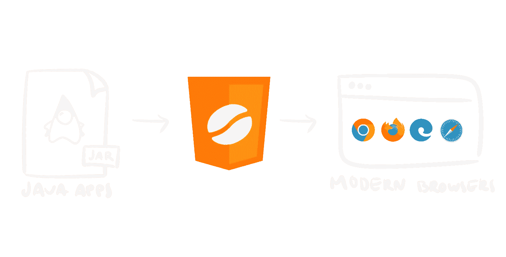
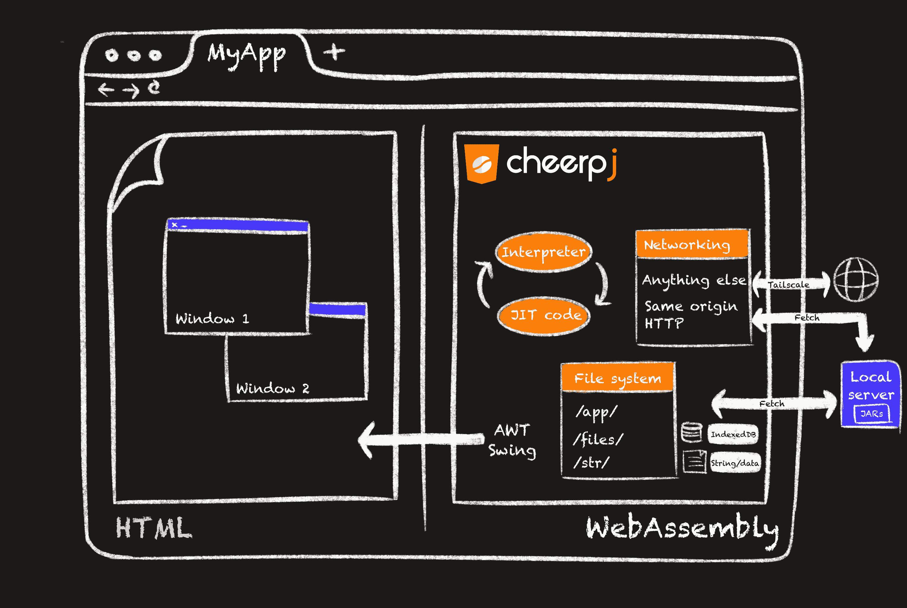

<!--yml
category: 未分类
date: 2024-05-27 14:30:26
-->

# CheerpJ 3.0 now available: A WebAssembly JVM to run real-world applications in the browser

> 来源：[https://labs.leaningtech.com/blog/cheerpj-3.0](https://labs.leaningtech.com/blog/cheerpj-3.0)

CheerpJ 3.0, **a state-of-the-art WebAssembly JVM that runs in the browser**, is now available! In this post, we’ll give an overview of what CheerpJ is, what this new major release brings, and share an exciting demo we’ve been working on.

CheerpJ 3.0 replaces CheerpJ 2.3 as our long-term supported version. Existing users can upgrade by following [the migration guide](/cheerpj3/migrating-from-cheerpj2).

* * *

CheerpJ 3.0 is a **full re-write** of CheerpJ that draws from the lessons learned from 7 years of enterprise and community use of the tool, as well as from several of our other WebAssembly-based projects, particularly [CheerpX](/cheerpx), an x86-to-WebAssembly virtualization solution.

We believe that this release brings a new era for deploying large scale Java applications on the Web, and for integrating Java libraries into Web apps. This is a moment of great pride for us at Leaning Technologies, and is the culmination of two years of extremely focused work on the new CheerpJ 3.0 architecture.

## What is CheerpJ?[](#what-is-cheerpj)

CheerpJ is a full WebAssembly-based JVM replacement for the browser, and comes with a complete OpenJDK runtime. Thanks to multiple architectural innovations CheerpJ is now an extremely powerful tool, designed to work at the scale of real-world Enterprise applications.



### Features[](#features)

CheerpJ’s main capabilities are:

*   **Running large-scale unmodified Java applications on modern browsers without plugins or a Java installation**. Legacy Java Applets and Java Web Start applications are supported as well. CheerpJ is a modern HTML5 solution based on secure and standard Web technologies available in all browsers.
*   **No server side component** is required. All the code is run on the client via WebAssembly and JavaScript.
*   **Works from unmodified JAR files (no need for source code)**, no need for any compilation or preprocessing step. Works with obfuscated bytecode, independently of the obfuscator being used.
*   **Supports *very large* applications**, our stress test is IntelliJ IDEA 2019 which ships ~400MBs of JARs. [Check it out.](https://twitter.com/alexpignotti/status/1729915428258926713)
*   **Supports graphical applications**, both AWT- and Swing-based ones are supported, including third-party Look&Feels. Multiple applications, each with multiple windows, can run at the same time.
*   **Full support for reflection and classloaders**, including custom ones designed to support plugins or encrypted JARs.
*   **Powerful interoperability with JavaScript**
    *   [Library mode](/cheerpj3/guides/library-mode): A new solution to integrate Java libraries into Web applications using a clean `async`/`await` interface
    *   [JavaScript natives](/cheerpj3/guides/Implementing-Java-native-methods-in-JavaScript), where you can implement Java `native` methods (JNI) directly in JavaScript with a convenient interface. This feature can also be used to interact with JavaScript and DOM APIs from Java.

In short, CheerpJ 3.0 can run most Java applications and libraries in the browser without any additional work or changes to the code.

### What’s the catch?[](#whats-the-catch)

CheerpJ 3.0 only supports Java 8\. However, a major motivation for the new architecture was to support multiple Java versions, and multiple runtime environments. We plan to introduce support for more modern Java LTS versions later this year, starting from Java 11\. In the long term, we aim to reach parity with the most recent Java LTS version.

CheerpJ is a commercial product and professionally supported, but it’s also free for personal use. View [licensing](/cheerpj3/licensing) for more details.

## How it works[](#how-it-works)



CheerpJ 3.0 is a WebAssembly Java Virtual Machine for the browser, which JIT-compiles Java bytecode into JavaScript.

It is a sophisticated tool with many moving parts, the main ones being:

*   A WebAssembly **JVM and Just-In-Time compiler** for Java bytecode. The code contained in class files is dynamically compiled and optimized. The JIT compiler supports advanced optimizations such as inlining and dynamic devirtualization.
*   A complete and unmodified build of **OpenJDK.**
*   **A Virtualized system layer, including:**
    *   [Virtualized file systems](/cheerpj3/guides/File-System-support), providing access to assets over HTTP, local persistent R/W storage via IndexedDB and interaction with JavaScript data via `/str/`.
    *   [Virtualized networking](/cheerpj3/guides/Networking) support via Tailscale. Both server and client applications are supported.

Readers familiar with the previous CheerpJ 2.3 architecture will notice the lack of AOT compilation, which has been removed in CheerpJ 3.0\. The performance impact of this change has been vastly positive in all real-world applications tested, with a particular benefit in the reduction of startup time.

For more details, we recently published [a blog post diving deep into CheerpJ 3.0’s architecture](/blog/cheerpj-3-deep-dive). You can also read the [architecture page](/cheerpj3/explanation/architecture) in the CheerpJ documentation.

## Demo: Minecraft[](#demo-minecraft)

 </blog/cheerpj-3.0-browsercraft.mp4> 

To showcase the capabilities of CheerpJ 3.0, we have released [a fully browser-based demo of Minecraft](https://browsercraft.cheerpj.com), probably one of the most well-known Java applications in the world. This experiment demonstrates how the capabilities of CheerpJ can be used to run real world applications as Web apps.

We call this project “**Browsercraft**.”

Browsercraft and CheerpJ are not official Minecraft products. They are not approved by or associated with Mojang or Microsoft.

*   **Unmodified JAR file**: CheerpJ can run the JAR file exactly as provided by Mojang. No decompilation or modification is required. As a matter of fact the JAR is downloaded from Mojang servers by the end-user’s browser (via `fetch`) and then stored locally in the `/files/` filesystem. We don’t host or redistribute the JAR in any way.
*   **Persistent data**: Minecraft will generate a “World” which is saved on the persistent local filesystem. If you reload the tab you will be able to continue playing from the same world.
*   **JavaScript natives**: The main difficulties in running Minecraft do not come from its Java bytecode, but from the native code shipped as part of the Open Source LWJGL library. For this demo we have implemented a subset of the LWJGL functionalities on top of WebGL using the [JavaScript natives](/cheerpj3/guides/Implementing-Java-native-methods-in-JavaScript) feature.
*   **Networking**: Although not shown in the current demo, thanks to Tailscale networking it will be possible for multiple users to join the same minecraft world from their browser tab.

CheerpJ can run Minecraft code without any issues, but further work will be required to fully support LWJGL and achieve correct rendering. The implementation is sufficient to get in-game, but it’s not complete and a keen eye will notice that the rendering is not currently accurate. We welcome user contributions to improve the LWJGL implementation to run Minecraft in the browser in all its glory. [The source code is available on GitHub](https://github.com/leaningtech/browsercraft).

Other objectives for this project include multiplayer support and running a more modern version of Minecraft; for the sake of this demo we are using version 1.2.5\. CheerpJ currently only supports Java 8, so we could at best reach version 1.16.5\. More recent versions will need to wait for Java 11+ support, coming later in the year.

If you’re interested in contributing, or just curious, visit the [repository](https://github.com/leaningtech/browsercraft) and join [the #browsercraft channel in our Discord server](https://discord.leaningtech.com).

## Get started[](#get-started)

CheerpJ is [free to use for personal projects and technical evaluation](/cheerpj3/licensing). Integrating it in a page can be done in two steps.

### 1\. Add the loader[](#1-add-the-loader)

```
 <script  src="https://cjrtnc.leaningtech.com/3.0/cj3loader.js"></script> 
```

### 2\. Initialize the virtual machine[](#2-initialize-the-virtual-machine)

CheerpJ is [extensively documented](/cheerpj3), ranging from basic tutorials to the detailed API reference.

[Get started](/cheerpj3/getting-started) [Migration guide](/cheerpj3/migrating-from-cheerpj2)

For questions, discussion, and support, [join our Discord](https://discord.leaningtech.com). It’s an active community where both Leaning Technologies developers and experienced users can provide help.

* * *

CheerpJ is a product built with passion and a lot of coffee by Leaning Technologies, an international team of WebAssembly hackers based in Amsterdam (NL) and Leeds (UK). We hope you’ll find it as exciting as we do.

[Star CheerpJ on GitHub](https://github.com/leaningtech/cheerpj-meta)