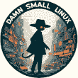

<!--yml
category: 未分类
date: 2024-05-27 14:30:48
-->

# DSL 2024 Information

> 来源：[https://www.damnsmalllinux.org/](https://www.damnsmalllinux.org/)

# Damn Small Linux 2024

****[Be My Hero](/hero.html)****

The New DSL 2024 has been reborn as a compact Linux distribution tailored for low-spec x86 computers. It packs a lot of applications into a small package. All the applications are chosen for their functionality, small size, and low dependencies. DSL 2024 also has many text-based applications that make it handy to use in a term window or TTY.

DSL 2024 currently only ships with two window managers: Fluxbox and JWM. Both are lightweight, fairly intuitive, and easy to use.

DSL has four X-based web browsers:

*   **Firefox-esr** (Extended Support Release, fully HTML5 compatible)
*   **NetSurf GTK** (quick, easy on RAM, good HTML4 and CSS support)
*   **Dillo** (super-light GUI browser)
*   **Links2** (text and light GUI browser)

For office applications, DSL has:

*   **AbiWord** word processor
*   **Gnumeric** spreadsheets
*   **Sylpheed** email client
*   **Zathura** PDF viewer

For multimedia applications:

*   **MPV** (video and audio)
*   **XMMS** (a lightweight audio player)

Other applications:

*   **mtPaint** (graphics editing)
*   **gFTP** (FTP, SFTP, and SCP)
*   **Leafpad** (quick editing)
*   **zzzFM** (file manager lifted straight out of antiX)

There are three GUI-based games picked because they are fun and relatively light.