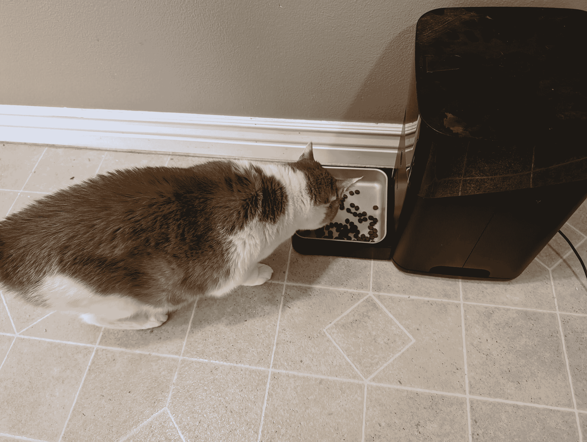

<!--yml
category: 未分类
date: 2024-05-27 14:28:36
-->

# Fixing a broken smart cat feeder with ESP8266 • pdx.su

> 来源：[https://pdx.su/blog/2024-01-19-fixing-a-broken-smart-cat-feeder-with-esp32/](https://pdx.su/blog/2024-01-19-fixing-a-broken-smart-cat-feeder-with-esp32/)

# Fixing a broken smart cat feeder with ESP8266

Many years ago, I purchased a PetNet smart cat feeder. This one was well reviewed, and the app worked well enough not to be annoying. It let me set schedules, and dispense food in rather small increments, compared to its competition. Things worked fairly well for a few years, but in mid 2020, the company behind the product went out of business, and shut down their servers. The feeder would continue to work for a period, but you couldn't configure any settings. Eventually, it stopped working all-together.

Meaning to fix it "sometime in the future," I put it in my garage, and forgot about it for a few years. Recently, I started mucking about with my HomeAssistant configuration, building up a new dashboard and getting my wife to use it, and started feeling the itch about the broken cat food feeder. Thinking it wouldn't be too hard, I went out and purchased an ESP8266, and popped open the feeder.

The feeder was a mix of simple and complex. Simple, in that all that really *needs* to happen is the motor turns on at scheduled intervals, for a short period of time. Complex in that they built *so much more* functionality into the device than was really needed. This thing is *covered* in sensors; it's got two scales, ostensibly for measuring the weight of the hopper and the weight of food dispensed, a pair of infrared sensors to detect when the hopper is empty, sensors that monitor the motor's rotations and position, and probably others that I haven't figured out the purpose of.

Since the sensors are things I didn't really need to worry about, all I had to do here was trigger the motor for a burst of time, at a fixed interval of times. I also wanted to be able to trigger it remotely from my phone or a similar interface. This is pretty easy to do with ESPhome.

Wiring up the device wasn't too complex. The device came from the factory with a decent built-in power supply, running over USB 2 on a Micro-B port. The motor, sensors, and everything else plugged into the main board via little JST connectors. The ESP8266 devboard I used can be powered by either a 3.3 or a 5 VDC connection. To control the motor, I used a relay, wiring it directly to the incoming power supply and motor. Since the onboard power supply provides 5v, and the motor is 5v rated, I powered the devboard using 5v, using the 3.3v output to power the relay board, and triggering the board via a GPIO pin.

ESPHome makes the software side even easier. Getting the board flashed and talking to my HomeAssistant system was so trivial I was astonished. I just plugged the devboard into my computer, went to the ESPHome website, and, via the powers of WebSerial, flashed it with the ESPhome base firmware and got it set up on my wifi. From there, HomeAssistant "saw" the device and gave me the option to adopt it. This whole process took about 5 minutes. That's faster than the setup and adoption of some purpose-made "smart home" systems!

Changing the device to actually do what I needed wasn't much more complicated. Using ESPHome primitives, I set up a GPIO output pin, and a "Button entity" to trigger this pin for a second and a half. Finally, I set up a timer entity that triggers the button at a few fixed times throughout the day.

Once I'd put the whole device back together, I powered it up and added some catfood to the hopper. Triggering the button from HomeAssistant, I watched happily as catfood came pouring out of the dispenser. Pressing the button a second time resulted in no catfood, and a buzzing sound from the motor. After some trial and error, I eventually swapped to a smaller size of catfood pellet, and then ultimately to a different USB power supply. The original one that came with the feeder said 5v 1A on its nameplate, but after testing with a meter, I was only getting 3.3v and barely 100mA. Now the dispenser is triggering happily and consistently, and our cat no longer pesters us throughout the day for more food.

If you are interested, you can see the configuration I wrote for the cat feeder [here](https://github.com/paradox460/HomeAssistantConfig/blob/226583d02f2ba59565dc635673aa5e8a91ca5958/esphome/esphome-web-659621.yaml)

## Updates

HackerNews discussion prompted me to make the following clarifications: I used an ESP8266, not an ESP32.

Additionally, this is not the cat's primary food source; he gets two bowls of wet food a day, so the dry food is mostly for supplemental feeding and dental health.

The article “Fixing a broken smart cat feeder with ESP8266” was written on<smart-time hover="" t="2024-01-19T18:28:48.118494-07:00"></smart-time>and last updated on<smart-time hover="" t="2024-02-03T01:19:00-07:00"></smart-time>