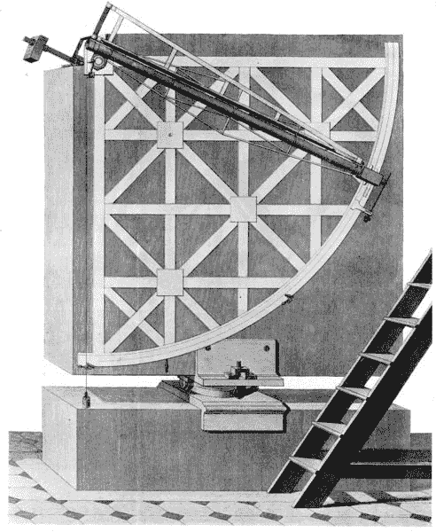
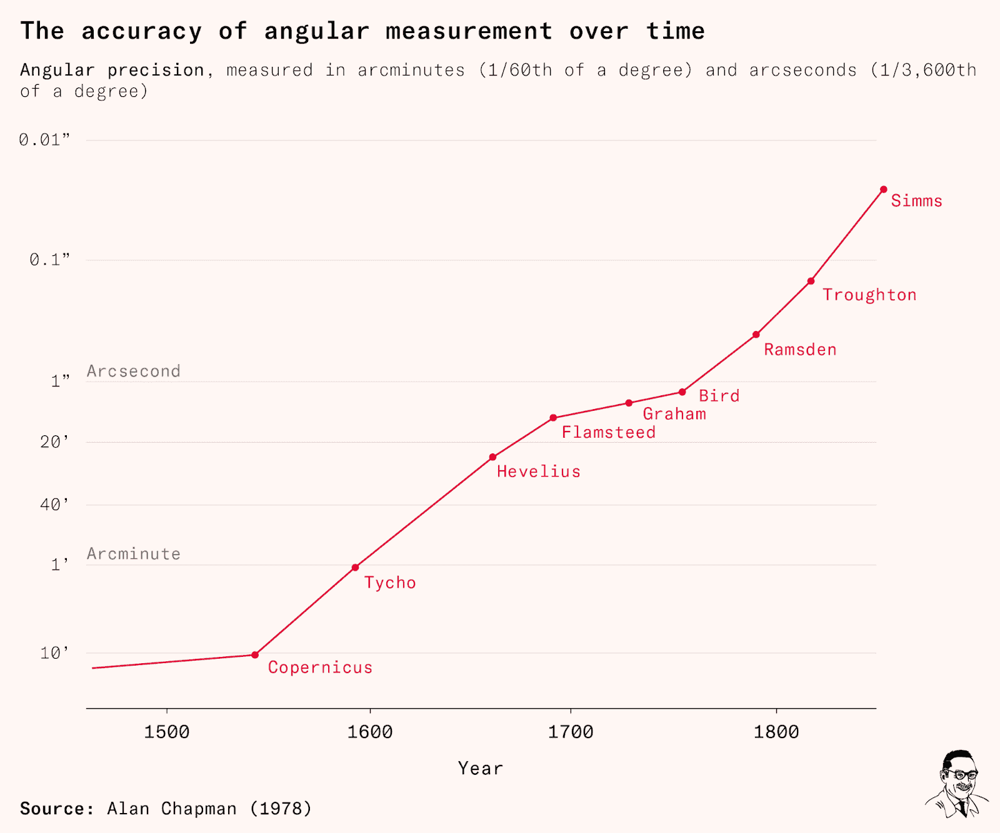
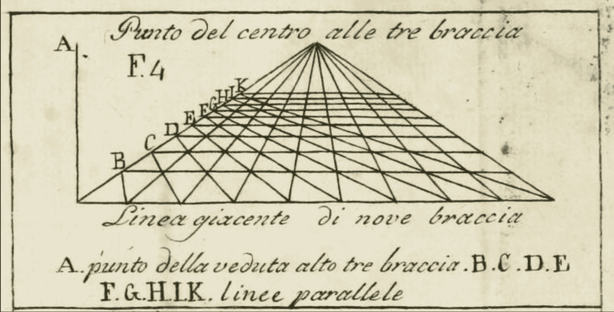
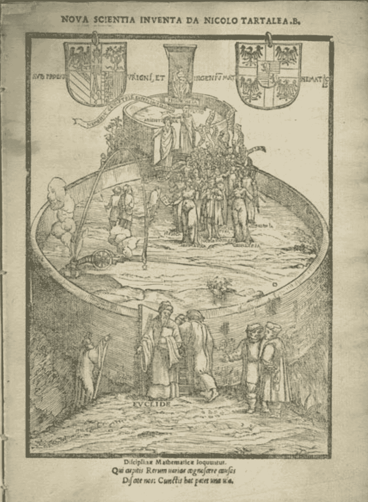
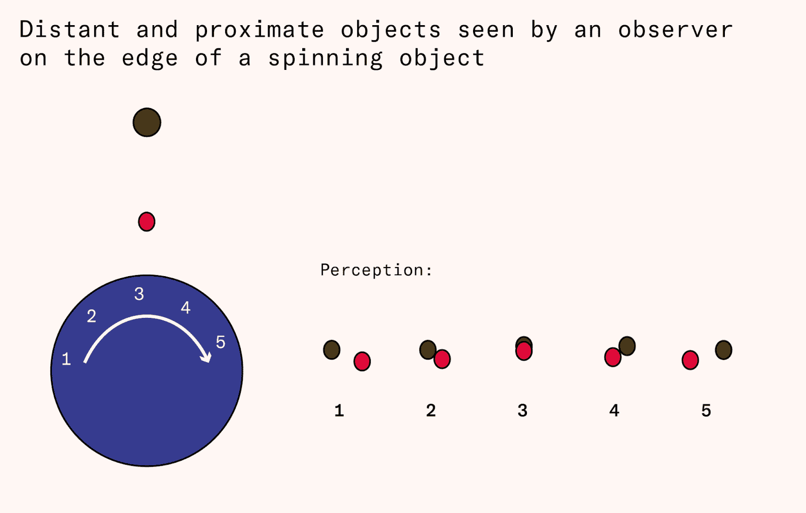
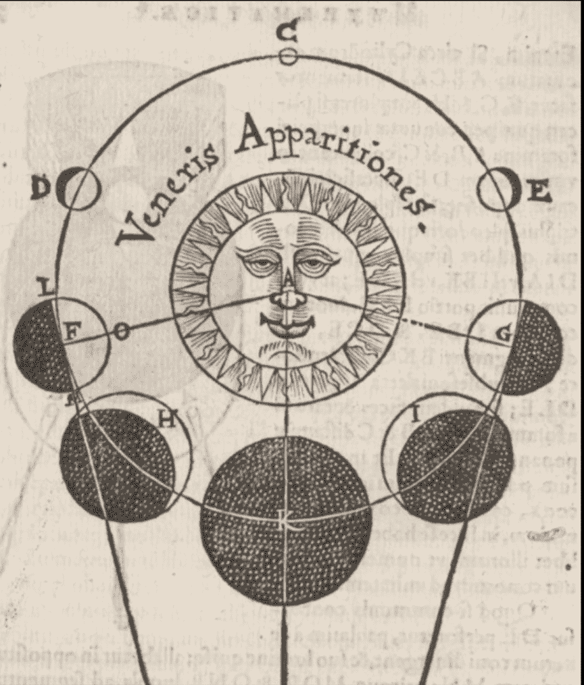

<!--yml
category: 未分类
date: 2024-05-27 14:28:56
-->

# How mathematics built the modern world - Works in Progress

> 来源：[https://worksinprogress.co/issue/how-mathematics-built-the-modern-world/](https://worksinprogress.co/issue/how-mathematics-built-the-modern-world/)

In school, you might have heard that the Industrial Revolution was preceded by the Scientific Revolution, when Newton uncovered the mechanical laws underlying motion and Galileo learned the true shape of the cosmos. Armed with this newfound knowledge and the scientific method, the inventors of the Industrial Revolution created machines – from watches to steam engines – that would change everything.

But was science really the key? Most of the significant inventions of the Industrial Revolution were not undergirded by a deep scientific understanding, and their inventors were not scientists.

The standard chronology ignores many of the important events of the previous 500 years. Widespread trade expanded throughout Europe. Artists began using linear perspective and mathematicians learned to use derivatives. Financiers started joint stock corporations and ships navigated the open seas. Fiscally powerful states were conducting warfare on a global scale.

There is an intellectual thread that runs through all of these advances: measurement and calculation. Geometric calculations led to breakthroughs in painting, astronomy, cartography, surveying, and physics. The introduction of mathematics in human affairs led to advancements in accounting, finance, fiscal affairs, demography, and economics – a kind of social mathematics. All reflect an underlying ‘calculating paradigm’ – the idea that measurement, calculation, and mathematics can be successfully applied to virtually every domain. This paradigm spread across Europe through education, which we can observe by the proliferation of mathematics textbooks and schools. It was this paradigm, more than science itself, that drove progress. It was this mathematical revolution that created modernity.

### **The geometric innovations**

Advances in geometry began with the rediscovery of Euclid. The earliest known Medieval Latin [translation of Euclid’s *Elements*](https://en.wikipedia.org/wiki/Euclid%27s_Elements) was completed in manuscript by Adelard of Bath around 1120 using an Arabic source from Muslim Spain. A Latin printed version was published in 1482\. After the mathematician Tartaglia translated Euclid’s work into Italian in 1543, translations into other vernacular languages quickly followed: German in 1558, French in 1564, English in 1570, Spanish in 1576, and Dutch in 1606. 

Beyond Euclid, the German mathematician [Regiomontanus](https://en.wikipedia.org/wiki/Regiomontanus) penned the first European trigonometry textbook, *De Triangulis Omnimodis* (*On Triangles of All Kinds*), in 1464\. In the sixteenth century, [François Viète](https://en.wikipedia.org/wiki/Fran%C3%A7ois_Vi%C3%A8te) helped replace the verbal method of doing algebra with the modern symbolism in which unknown variables are denoted by symbols like x, y, and z. René Descartes and Pierre de Fermat built on Viète’s innovations to develop [analytic geometry](https://en.wikipedia.org/wiki/Analytic_geometry), where curves and surfaces are described by algebraic equations. In the late seventeenth century, Isaac Newton and Gottfried Leibniz extended the methods of analytic geometry to the study of motion and change through the development of calculus.

Mural quadrant from 1775 designed by John Bird and used at the Mannheim Observatory.

On top of theoretical improvements to mathematics, the instruments used to apply these theories to the world also advanced dramatically. One striking example comes from angular measurement, which saw large increases in precision as astronomers began to use new instruments, like the mural quadrant in the picture above. Angular measurement works by pointing instruments toward objects and reading off their angles on a measurement scale. The precision of pointing was improved by telescopic sights and finely tunable mechanisms, while better-designed measurement scales allowed astronomers to discriminate between similar angles. The graph below shows the trend of precision, going from seven arcminutes, or 0.11 degrees, in 1550, to 0.06 arc*seconds*, or 0.000017 degrees, in 1850 – an astounding improvement of almost 7,000 times over three centuries.

Computation was aided by the adoption of Hindu-Arabic numerals and the [popularization of decimal notation](https://en.wikipedia.org/wiki/De_Thiende). In 1614, [John Napier’s introduction of the logarithm](https://www.maa.org/press/periodicals/convergence/logarithms-the-early-history-of-a-familiar-function-john-napier-introduces-logarithms) transformed multiplication into addition, and it was followed a decade later by the invention of the [slide rule](https://en.wikipedia.org/wiki/Slide_rule) that could efficiently perform multiplication and division (see image below). The era also saw the introduction of printed mathematical tables. These tables document the values of standard mathematical functions and were crucial for computation before the advent of electronic calculators. Constructing them involved using known relationships such as trigonometric identities to compute new function values from old ones. While straightforward in theory, table construction was computationally demanding. The famous 1596 trigonometric table *Opus Palatinum de Triangulis* was an expensive endeavor financed by the Habsburg emperor Maximilian II: its [100,000 trigonometric ratios – accurate to up to ten decimal pIaces](https://en.wikipedia.org/wiki/Georg_Joachim_Rheticus) – took the mathematician [Rheticus and his team of human computers 12 years to calculate](https://inria.hal.science/inria-00543932/document), at a cost of more than 50 times Rheticus’s annual salary as a mathematics professor. 

Calculating 2 x 3 on a slide rule using that log(2 x 3) = log(2) + log(3).

### **Applied geometry**

The developments in mathematical knowledge, instrument making, and computation supported a wave of mathematically based innovations. 

In the fifteenth century, linear perspective revolutionized painting by making it possible to represent three-dimensional space on a two-dimensional surface. The mathematical underpinnings are evident in Leon Battista Alberti’s seminal 1415 work, [*De Pictura*](https://en.wikipedia.org/wiki/De_pictura)(*On Painting*). The opening paragraph announces that the treatise will ‘borrow from mathematicians those aspects relevant to the subject’. After laying out the Euclidean concepts of points, lines, planes, and surfaces, Alberti employs this geometric language to explain the principles of perspective painting. 

Illustration of the vanishing point from the 1805 edition of Alberti’s *De Pictura.*

Drottningholm’s castle garden, a

[*jardin à la française*](https://en.wikipedia.org/wiki/French_formal_garden)

relying on the principles of perspective to manipulate the perception of distance 

Image

Author’s collection.

Surveying and cartography also advanced. In 1450, Alberti wrote [*Descriptio Urbis Romae*](https://www.thefreelibrary.com/Delineation+of+the+City+of+Rome+(Descriptio+urbis+Romae.-a0255243690) (*Description of the City of Rome*), which featured a table of coordinates for important places in Rome together with instructions for [land surveying](https://en.wikipedia.org/wiki/Surveying), the measurement of geographic positions, distances, and areas.

The ensuing centuries saw further improvements. A key advance was the growth of triangulation. The diagram below illustrates the basic idea: if you have the points A and B and measure the angles ɑ and β to C, this uniquely pins down the position of C. Further, if the length between A and B is known, the method also delivers the distances from A and B to C. Triangulation was attractive because it replaced expensive measurement of distances with cheap measurement of angles. After the mathematician Gemma Frisius explained how triangulation could be used for mapmaking in 1533, the method spread rapidly across Europe. In 1578, the astronomer Tycho Brahe [used triangulation to map the island of Hven](https://ncgeo.nl/downloads/14Haasbroek.pdf) where his observatory was located, and the method is described in many textbooks published before the end of the century.

The power of the concept can be further amplified by the use of triangulation networks, where triangulated points are used for further triangulation (see diagram below). With sufficiently exact angular measurements, there is no limit to the precision and range of such networks. In 1615, the Dutch mathematician [Willebrod Snellius used a triangulation network based on church spires to determine the distances](https://en.wikipedia.org/wiki/Willebrord_Snellius#Triangulation) between 14 Dutch cities, and by the mid-eighteenth century, the [French geodesic missions](https://www.nature.com/articles/476149a) (attempts to measure the shape of the Earth) used triangulation networks and precise instruments to establish that the Earth bulges at the equator by showing that one degree of latitude is 111.9 kilometers at the Arctic circle, but only 110.5 kilometers at the equator. Triangulation networks formed the basis of mapmaking until the advent of GPS.

Mathematics also shaped Renaissance warfare. To counter the power of new artillery, the geometry of fortification grew more complex through the introduction of the star fort, the so-called *trace italienne*. Star forts were intricately shaped low-lying fortresses surrounded by a protective belt of glacis (sloping banks) and ravelins (outward-poking triangles of wall) that prevented direct cannon fire onto the walls. Their triangular bastions deflected cannon shots while allowing defenders to enfilade (fire along a line end to end) attackers seeking to scale the walls. To construct them, [fortress building emerged as an area of applied mathematics](https://www.jstor.org/stable/3101334), since getting the geometry right was crucial to combine protection from enemy cannon fire with a good line of sight for defenders.

At the same time, ballistics emerged as the mathematical study of artillery. The first treatise, [*Nova Scientia*](https://www.maa.org/press/periodicals/convergence/mathematical-treasures-nicolo-tartaglias-nova-scientia) (*A New Science*), was published in 1537 by the Euclid translator Tartaglia. The book presents a rudimentary theory of projectile motion, provides an argument for why the 45-degree angle maximizes a cannon’s range, and offers guidance on instruments that gunners could use to measure distances and calibrate cannon elevations. The title page depicts Tartaglia demonstrating the new science of trajectories to the seven muses in a walled garden, with Euclid guarding the entrance. 

Image

Image from Google Earth.

Image

Title page of Tartaglia’s *Nova Scientia*,with Euclid guarding the entry to the new science.

Modern astronomy was also grounded in geometry. The competing celestial models of Ptolemy, Copernicus, Brahe, and Kepler had different implications for angular measurements, so geometric arguments became key to astronomical debates.

The mathematician Regiomontanus showed how basic geometry could be used to determine the distance to celestial bodies. The key idea was that whether you believe the Earth spins around its axis or the heavens around the Earth, the spinning is around the Earth’s *center*, not its *surface*, where observers are located. Given this, it turns out that proximate objects appear to move faster across the heavens than distant objects. The diagram below shows how an observer on the edge of a spinning body perceives proximate and distant objects: as the observer spins, the proximate red point appears to move past the distant black point. Tycho Brahe famously used this reasoning to argue that the 1572 supernova and the 1577 comet must be located far beyond the moon because they appeared to move much less than the moon relative to distant stars. This was important for astronomical debates,challenging the Aristotelian view that only the sublunary sphere saw change while the heavens were unchanging. 

Later, the Ptolemaic geocentric model of the heavens was dealt a final blow by Galileo Galilei. [Drawing on his mathematical knowledge and engineering experience](https://biblio.ugent.be/publication/521984/file/1873759), Galileo improved the magnification of the recently invented telescope and used it to discover that Venus had phases just like the moon. According to the Ptolemaic model, Venus is always located between the Earth and the Sun, and there could never be a ‘full Venus’, since this could only occur if Venus was located beyond the Sun from the perspective of the Earth. Galileo was able to demonstrate that the shadows of Venus were consistent with the planet orbiting the Sun rather than the Earth.

How Venus’s phases can be explained by it orbiting the Sun (*Disquisitiones Mathematicae*, 1614).

Astronomical models contributed to navigation by supporting the creation of almanacs that predicted the positions of celestial objects at specific future dates and times. If sailors knew how high different celestial objects were above the horizon at different latitudes and different dates of the year, they could find the latitude by measuring their angles and consulting the relevant date in the almanac. This facilitated [open sea navigation](https://press.uchicago.edu/books/HOC/HOC_V3_Pt1/HOC_VOLUME3_Part1_chapter20.pdf), as sailors with knowledge of the latitude of their destination could sail north or south until the position in the sky of the Sun or some other celestial object indicated that they had reached the desired latitude, and then sail along it. This released them from having to follow the coast. The importance of having the right latitude was amply demonstrated in [1707](https://en.wikipedia.org/wiki/Scilly_naval_disaster_of_1707) when more than 1,400 British sailors drowned after four British warships crashed into the Isles of Scilly off the coast of Cornwall, due to a 24–36-nautical-mile misestimation of their latitude (not just a mistake in longitude, as common belief would have it).

Mathematical innovations were central to the period’s crowning achievement: modern science. In his [*Invention of Science*](https://www.amazon.com/Invention-Science-History-Scientific-Revolution/dp/0061759538)*,* the historian David Wootton shows how innovations in painting, cartography, surveying, ballistics, astronomy, and navigation paved the way for the Scientific Revolution of the seventeenth century. A community of individuals gained experience in developing mathematical models of the world and confronting them with increasingly precise measurements from the new instruments. In astronomy, this process ultimately overturned the geocentric model. A similar process unfolded in mechanics, as Galileo combined instrument making, measurement, and mathematics to lay the foundation for our modern understanding of motion. When Galileo claimed that the universe is a book ‘[written in the language of mathematics](https://web.stanford.edu/~jsabol/certainty/readings/Galileo-Assayer.pdf)’, he expressed a central assumption underlying modern physical science. In the words of Wootton, ‘the Scientific Revolution was, first and foremost, a revolution by the mathematicians’.

### **The mathematization of social life**

The beginnings of social mathematics came with the introduction of Arabic algebra into Europe. A significant milestone was the publication in 1202 of[*Liber Abaci*](https://en.wikipedia.org/wiki/Liber_Abaci)by Leonardo of Pisa, better known as Fibonacci. Drawing on examples from business and everyday life, *Liber Abaci* introduced Hindu-Arabic numerals and basic algebra, showcasing how these tools could be used to perform standard arithmetic calculations and solve business problems such as the splitting of profits. Fibonacci was not the first to use Arabic numerals in Europe, but he was [influential](https://www.amazon.com/Man-Numbers-Fibonaccis-Arithmetic-Revolution/dp/0802779085). He also introduced [net present values](https://www.nber.org/papers/w10352), which turn flows of payments over time into a single value by discounting future incomes based on the interest rate.

These theoretical underpinnings led to innovations in social mathematics. An early example was double-entry bookkeeping, in which financial transactions are recorded in separate debit and credit accounts. The earliest known example [dates to 1299](https://en.wikipedia.org/wiki/History_of_accounting), but widespread dissemination across Europe followed the publication of the mathematician Luca Pacioli’s printed book [*Summa de Arithmetica, Geometria, Proportioni et Proportionalita*](https://en.wikipedia.org/wiki/Summa_de_arithmetica) (1494). By recording all transactions twice, double-entry bookkeeping reduced the likelihood of error and allowed firms to trace their changing financial positions to the underlying flows. 

Double-entry bookkeeping spread among private merchants in Italy and, together with improvements in interest rate mathematics, supported the rise of private financial institutions. Banking empires like the Fuggers and Medicis [relied on it](https://journals.sagepub.com/doi/pdf/10.1177/1032373219848146?casa_token=FQn0guJ-b8AAAAAA:LyzXWVd0czK0BOTBswOcJQ3apoTELCCCJ2VXSvT0ajESCTx-Di15Wviu9d5DV6Xi1PUN2F7wr2Yd) to manage their sprawling activities and capital structures, and good accounting supported lending institutions by making it easier to [supervise borrowers](https://www.amazon.com/Reckoning-Financial-Accountability-Rise-Nations/dp/0465031528/ref=sr_1_2?crid=3UGP2T9SF6HAJ&keywords=jacob+soll&qid=1685638284&s=books&sprefix=jacob+soll%2Cstripbooks%2C151&sr=1-2).

The era also saw improvements in the financial practices of states. The overarching motivation was the evolving needs of warfare. During the early modern era, the fealty-bound vassals of the Middle Ages were replaced by armies of predominantly professional mercenaries. Hard cash became the language of the battlefield, and good financial management became a survival imperative for the state.

In the late fifteenth century, the Habsburg monarchy developed the [Hofkammer](https://de.wikipedia.org/wiki/Hofkammer_(Habsburgermonarchie))*,* or court chamber, model of state finances in which a centralized unit kept track of revenue, expenses, and credit flows. The Hofkammer approach spread across Germany during the sixteenth century, and has been linked to increases in [fiscal capacity](http://hdl.handle.net/10419/208072) – that is, how much money a state can raise through taxes or borrowing. The accounting ideals of the Hofkammer can be seen in a 1568 [instruction](https://epub.ub.uni-muenchen.de/17508/1/Hengerer_Hofbuchhaltung.pdf) manual which states that the court bookkeeper should ‘set up orderly books with different rubrics and paragraphs and essentially maintain them’.

The lives of individual reformers suggest that innovations in public accounting diffused from the private sector. [Thomas Cromwell](https://en.wikipedia.org/wiki/Thomas_Cromwell) worked in an Italian banking firm before returning to England to restructure the royal financial administration from a personalized feudal system toward a modern state bureaucracy, the so-called [Tudor Revolution in Government](https://www.amazon.com/Tudor-Revolution-Government-Administrative-Changes/dp/0521092353). In the Netherlands, the polymath [Simon Stevin](https://en.wikipedia.org/wiki/Simon_Stevin) worked at a merchant firm and published the first table of interest rate calculations before becoming the principal advisor to the stadtholder of the Netherlands, Maurice of Orange. (Stevin was also an accounting theorist who published the first analysis of government accounting in 1607.) In France, [Jean-Baptiste Colbert](https://fr.wikipedia.org/wiki/Jean-Baptiste_Colbert) was born into a family of prominent merchants, but entered government and was responsible for reforming the financial administration of France in the late seventeenth century.

Besides innovations in interest rate calculations and private and public accounting, the early modern era also saw developments in financial markets, especially in markets for government debt. Here, Italian city states were important innovators. In times of emergency, funds were raised by the imposition of forced loans on wealthy citizens. Although obligatory, these loans paid an interest and thus became assets for the creditors. A secondary market for these debts developed, making it possible for the creditors to turn their assets into cash even when the principal was not redeemed by the state. 

It has been estimated that [five percent of Italian debt was traded in a given year during the fifteenth century](https://www.amazon.com/Origins-Value-Financial-Innovations-Created/dp/0195175719). The increased sophistication of private financiers and their public counterparts supported financial innovation: [Sweden](https://doi.org/10.1007/978-0-230-80255-1) financed its rise to great power status by mortgaging its copper income, and in order to make its debt more attractive, England created the [Bank of England](https://en.wikipedia.org/wiki/Bank_of_England#History) as a separate entity with privileges such as note issuance.

Finally, the early modern era witnessed the birth of quantitative social science. After surveying Ireland for Cromwell’s army in the 1650s, the Englishman William Petty championed a new science called ‘[political arithmetic](https://en.wikisource.org/wiki/Political_Arithmetick_(1899))’, which sought quantitative precision in matters relating to taxes, expenditure, trade, and monetary issues. Another Englishman, John Graunt, is often regarded as the founder of demography due to his analysis of mortality rates in his work, [*Natural and Political Observations Made upon the Bills of Mortality*](https://wellcomecollection.org/works/jt43sbkc). Subsequently, life tables and the new theory of probability were combined to support pricing in the emerging life insurance industry, with the Dutchman Johan de Witt’s [*The Worth of Life Annuities Compared to Redemption Bonds*](https://www.york.ac.uk/depts/maths/histstat/dewitt.pdf) (1671) considered one of the earliest applications of probability theory to finance. Building on these advances, the eighteenth and nineteenth centuries saw the evolution of modern disciplines such as economics, epidemiology, demography, and actuarial science. 

Image

Statistics of births and deaths in London from *Another Essay in Political Arithmetick Concerning the Growth of the City of London*, William Petty, 1682

### **The calculating paradigm **

The innovations in our narrative encompass a broad range of domains, but they have one unifying characteristic: the use of measurement and mathematical calculations to tackle real-world problems. We call this ‘the calculating paradigm’. The diagram below illustrates the core of the paradigm. To solve a problem, one must first translate it into a numeric representation using quantitative measurement. The representation is then subjected to modeling and calculation to arrive at a solution that is applied to the real world. 

The first step in the paradigm is measurement – the numerical encoding of the real-world situation. For example, when Galileo studied uniform acceleration, he first measured the time taken for a ball to roll down inclines of different lengths. Similarly, an accountant converts an inventory of physical goods, assets, and transactions into a set of quantities that are expressed in a common monetary unit and allocated to different cost, revenue, asset, and liability accounts. In both cases, the end product is a mathematical representation. 

Next is manipulation, which involves the use of mathematical techniques and models to process the representation. Galileo needed to compute ratios to discover that the time for a ball to roll down an incline grows as the square root of the distance of the incline. Accountants calculate profits as the difference between total revenues and costs, and equity as the difference between total assets and total liabilities. In both cases, the end product is a mathematical result. 

The final step is to apply the mathematical result to perform a real-world action. In physics, it could be the design of a clock that depends on laws of motion, or a scientific decision to reject a particular model of motion. In accounting, it could be an investment decision based on a profitability calculation, or a bankruptcy decision based on a solvency calculation.

Today, different types of mathematically guided decision-making are often viewed as fundamentally distinct activities. The use of mathematics to explain the natural world belongs to science; the use of geometric calculations to determine directions belongs to navigation; the use of accounting calculations for business decisions belongs to financial analysis. But these practices all share an underlying logic in how they combine quantitative measurement and mathematical manipulation to guide behavior. 

### **The origin and spread of the calculating paradigm**

What is the evidence for the spread of the calculating paradigm? As a cognitive strategy, the calculating paradigm is close to what anthropologists call a cultural trait*,* or a discrete unit of cultural transmission. Anthropologists generally infer the diffusion of cultural traits from the spread of attendant artifacts and behavioral patterns, similar to our procedure in the innovation narrative. However, in principle, the diffusion of cultural traits can also be observed directly through the process of learning and imitation. While often difficult in practice, this route is possible for the calculation paradigm, since mathematics is almost universally learned through schools and textbook materials.

Using this strategy, the origin of the calculating paradigm in Europe can be traced to the introduction of Arab mathematics during the late Middle Ages. The epicenter was northern Italy. This was where Leonardo of Pisa’s *Liber Abaci* was publishedin 1202*,* and from the thirteenth century onward the region saw widespread adoption of Hindu-Arabic numerals and attendant methods for calculation and problem solving.

The diffusion of the calculating paradigm was supported by a new form of educational institution: the Abacus schools. These schools catered to the merchant class and differed from traditional Latin schools by teaching in the local language, and by eschewing classical studies in favor of practical skills in calculation, measurement, and bookkeeping. With a commercial focus, they taught mathematics to young children using problems related to currency exchange, labor contracts, and profit distribution. 

Abacus schools became a powerful educational force. In Renaissance Florence, up to one in three of all boys attended Abacus schools  – famous students included Luca Pacioli, ‘the father of accounting’, and a young Leonardo da Vinci. The schools also created a market for mathematicians to support themselves as teachers of practical mathematics, so-called *maestri d’abaco*. Nicolo Tartaglia – whom we encountered earlier as a Euclid translator and a writer on ballistics – was an Abacus teacher.

Over time, practical mathematics education spread northward from Italy. During the fifteenth century in Germany, so-called [*Rechenmeisters*](https://de.wikipedia.org/wiki/Rechenmeister)established *Rechenschulen*, which provided practical arithmetic education. By 1615, Nuremberg had no less than 48 such schools in a city of [fewer than 50,000 people](https://sedac.ciesin.columbia.edu/data/set/urbanspatial-hist-urban-pop-3700bc-ad2000). The spread was supported by the printing press, which let mathematicians reach broad audiences through popular textbooks. Many became classics: Adam Ries’s 1522 *Rechnung auff der Linihen und Federn* went through 114 editions and Robert Recorde’s 1543 *The Ground of Artes* went through 46.

In a recent effort to study the diffusion of the new mathematics, the historian Raffaelle Danna compiled a [database](https://brill.com/view/journals/nun/36/1/article-p5_2.xml) of 1,280 practical arithmetic texts with Hindu-Arabic numerals. The database contains all known arithmetic manuals in manuscript and printed format written from the publication of *Liber Abaci* in 1202 up to 1600\. The map below displays their cumulative numbers over space and time, illustrating how the new mathematics was initially concentrated around northern Italy before spreading outward during the fifteenth and sixteenth century.

During the sixteenth century, Protestantism also contributed to the proliferation of mathematical skills. [Protestant reformers](https://doi.org/10.1353/lut.2019.0048) placed a strong emphasis on education both for theological and practical purposes, and in the Protestant educational program designed by Philip Melanchthon –himself a student of the mathematician and astronomer [Johannes Stöffler](https://en.wikipedia.org/wiki/Johannes_St%C3%B6ffler) – [mathematics was given a central role](https://www.jstor.org/stable/3653946). The Frenchman [Petrus Ramus](https://en.wikipedia.org/wiki/Petrus_Ramus) created a program in the mid-sixteenth century aimed at expanding and enhancing education. Although Ramus was not a mathematician, he believed strongly in the value of the practical skills provided by mathematics and it was central to his educational ideas. His program, known as [Ramism](https://en.wikipedia.org/wiki/Ramism), gained short-term but substantial influence in schools in Germany, the Netherlands, England, Scotland, Sweden, and, to a certain extent, France. Although the impact of his ideas diminished in the seventeenth century, they remained relevant among the religious dissenters who won the English Civil War and colonized New England.

In Catholic Europe, education became dominated by the Jesuit order. Established in 1540, a key aim of the order was to educate children and youth. Their schools were financed by donations and payments from cities where they had established themselves, and they could expand rapidly by requiring that their [graduates taught for three to five years](https://doi.org/10.1163/22141332-00101002) after graduation. Initially, Jesuits used the teaching of mathematics as a [competitive tool against existing Abacus schools and as a way to attract local patronage](https://journals.sfu.ca/jjsc/index.php/journal/article/view/40). But their main focus was on theology and classical learning, and the role of mathematics remained contentious. 

When the Jesuits debated their curriculum in the late sixteenth century, the prominent mathematician Clavius, himself a Jesuit,  argued for a central role for mathematics, but he [faced opposition from those who wanted to prioritize theology and philosophy](https://link.springer.com/article/10.1007/s11191-004-5607-8). In the end, his program was scaled back, and in the 1599 *Ratio Studiorum,* which was to govern Jesuit education for the next two centuries, mathematics is only mentioned in a few paragraphs across a 100-page document, and its study was relegated to the last year of a seven-year program. Jesuit schools still produced elite mathematicians like René Descartes, but by placing mathematics at the end of a long classical curriculum, they discouraged the widespread dissemination of the practical arithmetic skills favored by the earlier Abacus schools and by the Ramist program found in Protestant countries.

Traditional universities had a mixed impact on the spread of mathematical knowledge. In the fourteenth and fifteenth centuries, the universities of Paris and [Vienna](http://books.google.com/books?id=wyC9xFxpWCoC&hl=&source=gbs_api) contributed significantly to the introduction and development of Arabic mathematics, and universities remained important for pushing the frontier of mathematical knowledge. Melanchthon’s educational program for Protestant universities granted mathematics an important role, but mathematics still faced competition from the traditional scholastic curriculum, which focused more on grammar, logic, and rhetoric.

There were exceptions, particularly in areas where the Ramist program was influential, such as in the Netherlands and Sweden in the early seventeenth century, and in Scotland later in the seventeenth century. The expansion of mathematics in higher education became more widespread when it was recognized as a strategic interest of the state. An early example was the seventeenth century French engineering colleges, and this practice spread in the eighteenth century, which saw a [proliferation of military schools](https://link.springer.com/book/10.1007/978-1-4614-9155-2) of higher education with mathematics as an important part of the curriculum.

As universities vacillated in their attitude toward the calculating paradigm, the teaching of practical mathematics proved a fertile ground for private education, as occupational opportunities in business, navigation, and instrument making created a willingness to pay for mathematical skills. [Private academies started to be formed](https://doi.org/10.1016/0160-9327(86)90136-5) in England during the seventeenth century to provide teaching in practical skills such as letter writing, double-entry bookkeeping, and arithmetic. At the end of the eighteenth century, there were 200 such academies. England also had a system of Dissenting Academies, which provided education for non-Anglicans who were excluded from regular higher education. The Dissenting Academies typically provided a more practically oriented education than the traditional institutions of higher learning. 

The spread of mathematical skills can be gauged quantitatively in the spread of books in applied mathematics. The graph below, based on research by the economic historians Morgan Kelly and Cormac Ó Gráda, shows the number of books published in England with headings in the following subject groups: arithmetic, astronomical instruments, bookkeeping, compasses, geometry, gunnery, logarithms, mathematics, mathematical instruments, measuring, navigation, shipbuilding, surveying, and trigonometry. We see that these subjects virtually did not exist in England in the early sixteenth century, but by the 1700s each had hundreds of publications per decade. 

### **Mathematics, the mechanical arts, and the Industrial Revolution**

By 1750, the calculating paradigm had spread across Europe. It had supported innovations across a wide range of areas, and in doing so, it had paved the way for the modern world. But the classic Industrial Revolution had not yet started, and mathematics did not yet have widespread success in the area of mechanized production.

The failure was not for lack of interest. Since the Renaissance, mathematicians had dreamed of conquering the mechanical arts. Leonardo da Vinci [studied mathematical treatises on mechanics](http://www.universalleonardo.org/work.php?id=489) and drew his famous flying machine. In 1588, the Italian engineer [Ramelli](https://en.wikipedia.org/wiki/Agostino_Ramelli) introduced his collection of machine drawings with an [eight-page preface celebrating mathematics as the basis for all mechanical arts](https://www.science.org/doi/10.1126/science.197.4306.827). 

Before the Industrial Revolution, however, aspiration often outran achievement. Many of Leonardo’s machines were famously unworkable, and while Ramelli’s machinery book was popular, [practitioners remained unimpressed](https://www.jstor.org/stable/41827234?casa_token=A8u4B_6rZyoAAAAA%3AV-eCXF4JH1NvsGqlQOXRa00FYHRJSzCja2i0AvLtAasoe7vWw8WH8kvnSotrhxA78R4szERknVybL1UPlGOHR_yKm0jqZbztFaGfNaVhmzTKWOlaFipz). Before the Industrial Revolution, men of practice often saw mathematicians as frivolous.

This would change after 1750\. During the Industrial Revolution, engineers achieved remarkable success in treating production as the execution of a mathematical plan. Why did eighteenth-century engineers succeed where Renaissance mathematicians had failed?

One important reason was that eighteenth-century engineers could achieve a higher degree of precision in production. Precision is crucial for mechanization, since it decreases friction and ensures that parts behave in a uniform way – even small frictions and performance variations can endanger the fine-tuned workings of a machine. 

More generally, precision makes it possible to produce real-world objects that conform to mathematical idealizations. Engineers can then move beyond envisioning machines in the abstract and start producing reliable prototypes. The pioneers of the Industrial Revolution valorized precision, and as the revolution gathered speed, requirements for precision grew ever more stringent. In the 1770s, James Watt [proudly declared](https://www.amazon.com/Perfectionists-Precision-Engineers-Created-Modern/dp/0062652559) that the cylinders of his steam engine were bored to the precision of 1/20 of an inch. By the 1850s, the self-acting machines of Joseph Whitworth aimed for a precision of 1/10,000 of an inch. 

Eighteenth-century England stood out in its ample supply of craftsmen able to do high-precision work. From 1700–1800, England saw a doubling in the number of clockmakers and instrument makers, [according to evidence](https://www.cambridge.org/core/journals/journal-of-economic-history/article/abs/connecting-the-scientific-and-industrial-revolutions-the-role-of-practical-mathematics/ACC9F9FB643DC83CDE904D987A05058B) collected by Kelly and Ó Gráda. Besides clocks, these producers made instruments for mathematical disciplines such as surveying, navigation, bookkeeping, and astronomy. Craftsmen in these industries provided a bridge between mathematics and manual labor – understanding the products required mathematical understanding, while constructing them required manual dexterity. When the Industrial Revolution got underway, these instrument makers were recruited to construct the complex steam and weaving machines that drove the revolution.

Designing the machines of the Industrial Revolution required basic arithmetic and geometry: you cannot obsess over precision unless you follow a mathematical plan. However, the mathematics required was not advanced. Once you knew basic mathematics and were committed to using it in practice, the main challenge was implementation. 

From this perspective, the Industrial Revolution required that basic mathematics and a quantitative outlook reached the class of people actually engaged in production. This is what happened in England.

Water wheel from Ramelli’s *Le Diverse et Artificiose Machine* (1588).

While many of the pioneers of the Industrial Revolution only had a modest formal education, they found ways to acquire basic mathematical skills. Sometimes, the brief education at the village school gave a mathematical training. The spinning mule inventor [Samuel Crompton](https://en.wikipedia.org/wiki/Samuel_Crompton) lost his father and had to work as a yarn spinner from an early age, but he went to a school where the teacher ‘[had considerable reputation as a teacher, particularly of writing, arithmetic, book-keeping, geometry, mensuration and mathematics](https://archive.org/details/lifeandtimessam01colegoog)’. Evening classes catered to people who had missed out on a formal education. This was how [George Stephenson](https://en.wikipedia.org/wiki/George_Stephenson), ‘the father of railways’, learned writing and arithmetic by the age of 18\. A burgeoning textbook market also made self-education possible – this was the route of the famous clockmaker [John Harrison](https://en.wikipedia.org/wiki/John_Harrison). 

The lives of the pioneers provide further evidence of a mathematical outlook. Joseph Bramah (1748–1814) was a locksmith who contributed to early precision manufacturing. He [left school at the age of 12](https://www.heritagesilkstone.co.uk/joseph-bramah) to work on his father’s farm and was later apprenticed as a carpenter. But this mathematical outlook is clear from the [*Rudimentary Treatise on the Construction of Locks*](https://www.gutenberg.org/cache/epub/63128/pg63128-images.html#Page82). The book explains how Bramah’s locks became essentially unbreakable through what mathematicians nowadays call [combinatorial explosion](https://en.wikipedia.org/wiki/Combinatorial_explosion#:~:text=In%20mathematics%2C%20a%20combinatorial%20explosion,the%20intractability%20of%20certain%20problems.): the fact that even a small number of objects can be ordered in an extraordinary number of ways. Bramah notes that even if a lock only has 12 moving parts with 12 distinct positions, ‘the ultimate number of changes that may be made in their place or situation is 479,001,600; and by adding one more to that number of slides, they would then be capable of receiving a number of changes equal to 6,227,020,800; and so on progressively, by the addition of others in like manner to infinity’.

Another example is Bramah’s most famous disciple [Henry Maudslay](https://archive.org/details/in.ernet.dli.2015.525123/page/n13/mode/2up), [the founding father of machine tools production](https://en.wikipedia.org/wiki/Henry_Maudslay). Maudslay also started working at the age of 12, but had a mathematical outlook: he was famous for his relentless focus on precise measurement, invented a new type of slide rule, and in his personal life applied a system where he ranked individuals on a [degree scale ranging from 0 to 100](https://archive.org/details/jamesnasengineer00nasmrich/page/x/mode/2up). Evidently, a quantitative worldview did not require college-level calculus.

### **Calculating today**

Our narrative shows how the rise of the modern world is linked to the spread of the calculating paradigm. 

After the paradigm’s introduction to Europe from the Arab-speaking countries in the thirteenth century, it was initially limited to a few universities and Italian merchant towns. However, the paradigm found fertile ground and gradually diffused across space, supported by the printing press and by new forms of educational institutions. It also diffused across social classes, moving from its origin among merchants and university professors to encompass administrators, craftspeople, small business owners, and seafarers. By the late eighteenth century, the paradigm had even reached Samuel Crompton’s modest village school in Bolton, in the north of England.

In the wake of the paradigm’s diffusion, we see innovations in painting, cartography, astronomy, navigation, physics, statecraft, finance, and accounting throughout the early modern era. But there was one key holdout: the process of production, which long eluded mathematicians as they failed to bridge the gap between theory and practice. Here, the breakthrough came in eighteenth-century England as a new class of engineers and instrument makers combined basic mathematical skills with the craftsmanship needed to make mathematical ideas workable.

Our story concludes in 1800, when the paradigm finally reached the process of production. Over the next 200 years, that paradigm has continued to spread, reaching more people and touching more domains. Since the advent of universal schooling, we have come to expect that all children should know how to calculate with Hindu-Arabic numerals. Tellingly, we use the term ‘basic arithmetic’ for a skill that until relatively recently was confined to specialized experts, and was not widely taught outside of a few northern Italian towns. 

The last 200 years have seen the influence of mathematics deepen across almost all domains of human activity, amply supported by torrents of data and dramatic increases in computing power. Now we use math to model nuclear wars, pick players for baseball teams, track changes in literature, and forecast presidential elections. Sometimes, it seems the paradigm has reached its limits; that every field that can benefit from math has been introduced to it. But we may now be nearing the computational paradigm’s greatest success of all: modeling intelligence through math using large language models. In that sense, the computational paradigm may be reaching its logical conclusion: turning us all into math.