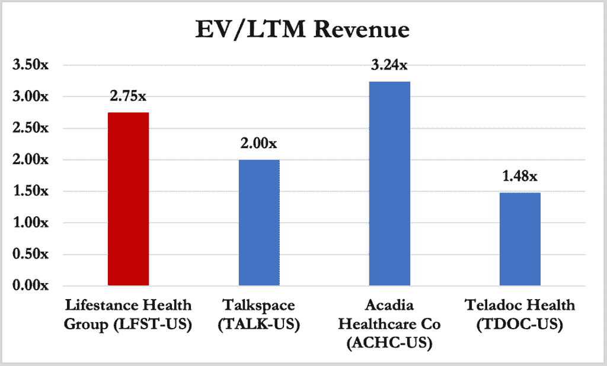
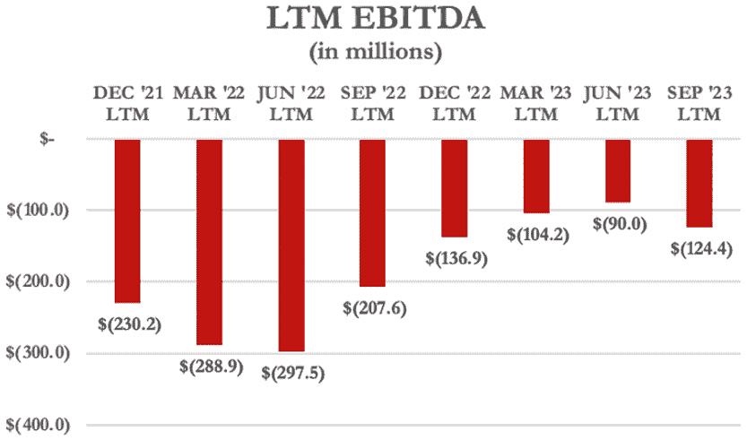
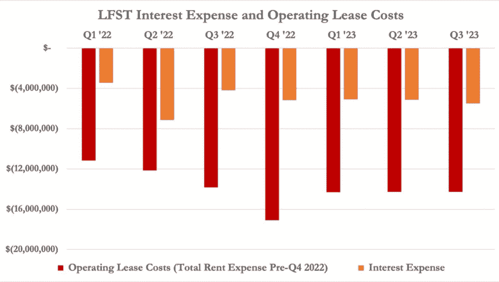
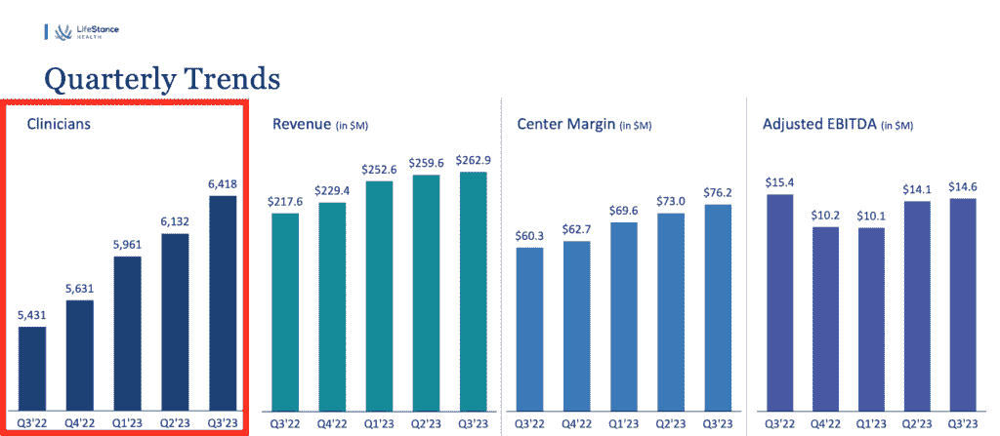
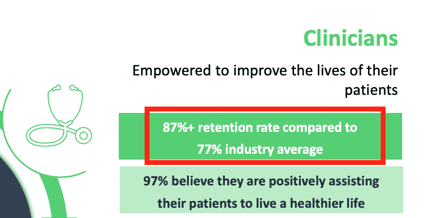
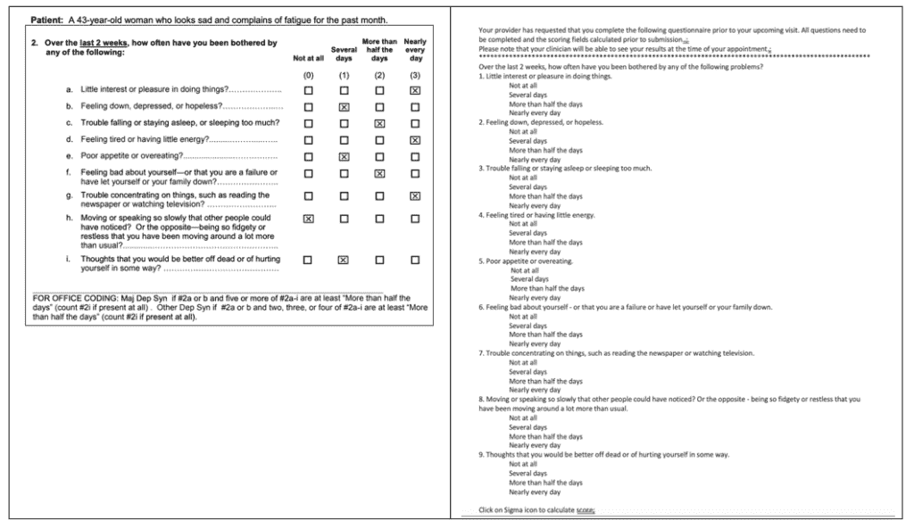
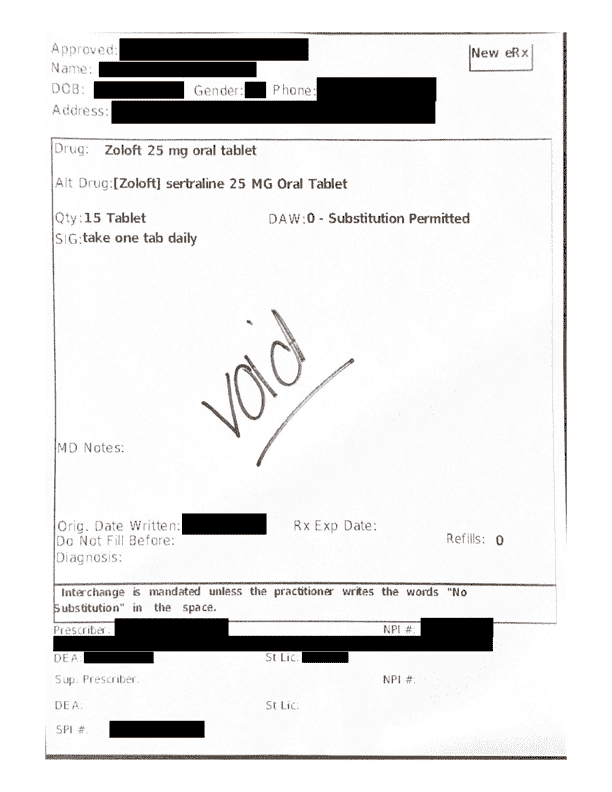

<!--yml
category: 未分类
date: 2024-05-27 14:30:38
-->

# LifeStance: A Private Equity-Backed Mental Health Rollup Headed For A Breakdown – Hindenburg Research

> 来源：[https://hindenburgresearch.com/lifestance/](https://hindenburgresearch.com/lifestance/)

*   LifeStance (NASDAQ:LFST) is a $2.3 billion market cap mental health provider with 6,400 clinicians located across 33 U.S. states. The company has grown its clinician base at 18% per year in a behavioral health market forecasted to grow at ~5% per year until 2030.
*   LifeStance trades at a ~23% premium to its peers in the behavioral health industry, despite reporting in its most recent Q3 ’23 report: $188 million in losses over the last twelve months, $482 million in debt and lease obligations and a $716 million accumulated deficit.
*   We assess that LifeStance will need to raise cash imminently given its latest Q3 ’23 results showing its (i) razor-thin cash balance of $42.6 million (ii) quarterly cash burn of $33.7 million and (iii) $42 million in expected cash payments by the end of Q1 ’24 to settle litigation alleging that LifeStance misled IPO investors.
*   A former LifeStance manager explained that the employee mix between therapy and psychiatry is critical information for investors to understand margin and profitability potential, but LifeStance doesn’t regularly share those metrics. A former employee and industry experts referred to therapy reimbursement rates as “humiliatingly low” and compared it to wages earned by “mani-pedi or salon haircut” workers.
*   In 2021 the company last disclosed ~66% of its clinician base were therapists, which are lower-margin vs. higher-margin psychiatrists. In 2024, our scrape of the LifeStance website shows the mix has deteriorated: ~79% of the company’s clinician base are therapists.
*   One of the company’s most widely followed public metrics is the retention rate of the clinicians it employs. During LifeStance’s June 2021 IPO, the company claimed it retained 87% of its clinicians (i.e. 13% clinician churn).
*   Just two months later, during its first public earnings report, LifeStance posted almost twice the net loss analysts expected and reported a change in retention rates to levels “consistent with the broader healthcare industry”, which it had previously defined as 77% retention (i.e. 23% churn). Its stock dropped 46% on the day.
*   LifeStance investors filed a securities class action lawsuit against insiders, alleging “untrue statements of material facts” regarding the company’s IPO clinician retention disclosures. In October 2023, LifeStance settled the lawsuit for $50 million.
*   Following the IPO debacle, LifeStance reported or confirmed on 7 different investor-facing calls and in conferences between 2022-2023 that its clinician retention rate had stabilized at 80%.
*   Our scrape of the LifeStance website showed that in the five months between August 15, 2023 to January 15, 2024, ~11.5% of providers listed in the company’s directory had disappeared, indicating an annualized retention rate closer to ~72% (i.e. a 28% churn rate), well below the industry average and once again below management’s claims.
*   Interviews and lawsuit allegations corroborate the retention issues, with former employees detailing how (i) LifeStance overpromises on compensation (ii) LifeStance institutes a system whereby clinicians end up indebted to the company (iii) LifeStance has a crippling corporate culture with no value-added and (iv) there are almost zero barriers to entry in operating a private practice.
*   According to two employee class action lawsuits and an employment lawsuit, LifeStance overpromises on compensation. Nurse practitioners and therapists claimed deceptive employment offers and claw backs of previous payments left them earning less than minimum wage or receiving nothing at all during some pay periods.  
*   LifeStance provides advances to clinicians who expect to eventually reach the company’s lofty compensation promises. This often results in burdensome debt when expectations fall short. One former LifeStance manager described the situation as “a crappy thing, to owe your employer money.”
*   The owner of a former practice acquired by LifeStance told us that medication prescribers are more likely to go into debt than therapists, making them more likely to sacrifice quality of care by shortening appointments to dig their way out of debt.
*   Former employees at practices acquired by LifeStance described working at the company as a culture shock, with locations being run “like a fast-food restaurant” with “no one really caring that these are patients’ lives.”
*   Former employees describing how LifeStance provided no or *negative* value in an industry with virtually no barriers to entry. Per one former LifeStance manager: “all you need to do to open up your own private practice is post a thing on Facebook… and you can start seeing private, cash-only patients.”
*   LifeStance deals in controlled substances and medications like Xanax and Adderall that have huge potential for abuse, with prescription volume growth rivaling opiate prescriptions at their peak, according to health professionals.
*   Despite the potentially addictive nature of some of these medications, former LifeStance employees claim that medication prescribers have been advised to cut consultation times to maximize revenue, with some former clinicians having seen “30 patients a day”. Others described it as akin to “war medicine.”
*   LifeStance also rewarded its “highest-performing” medication prescribers with stock grants, according to the company’s CFO. A former practice owner told us the grants were tied to number of sessions a clinician conducts, an incentive that can encourage quantity over quality of care.
*   In December 2023, we signed up for an appointment with a LifeStance psychiatrist to better understand the company’s patient onboarding process. We were given a questionnaire developed by Pfizer and were asked if we were open to medication 13 minutes into our first session.
*   Despite reporting to the psychiatrist that we had been in a good mood since Christmas, 32 minutes into our first session we were offered Pfizer’s Zoloft for treating depression and anxiety. By the end of a 15-minute follow up session we were prescribed Zoloft.
*   LifeStance insiders and private equity backers have dumped $243 million in stock since the company’s 2021 IPO, with company management having sold $18 million since IPO.
*   LifeStance has experienced rapid executive turnover, shuffling through 3 CFOs over the course of just 3 years, a red flag of financial stress.
*   We think executives and backers who have cashed out likely understand what our research has shown: LifeStance is a low margin, unsustainable business operating under a crippling debt load with no cash cushion and no realistic hope of profitability.
*   Overall, we think LifeStance is a classic example of what happens when private equity meets a ‘hot’ healthcare sector: Massive debt fueling a grinding, metric-focused corporate culture resulting in worse quality of care for patients, a worse environment for clinicians and long-term losses for the average investor.

*Initial Disclosure: After extensive research, we have taken a short position in shares of LifeStance Health Group, Inc. (NASDAQ:LFST). This report represents our opinion, and we encourage every reader to do their own due diligence. Please see our full disclaimer at the bottom of the report.*

## **Background: A $2.3 Billion Mental Health Provider With 6,400 Clinicians Across The U.S.**

 **LifeStance is one of the largest providers of behavioral healthcare in the U.S., [employing](https://www.bamsec.com/filing/95017023060505/2?cik=1845257&hl=5845:5981&hl_id=vjmqg4jr1l) 6,400 psychiatrists, nurse practitioners, psychologists and therapists across 33 states. [[Pg. 3](https://investor.lifestance.com/static-files/52307c74-9a9d-4c45-b60a-6f47bbad8a4a#page=3)]

Clinicians [offer](https://www.bamsec.com/filing/95017023007018/1?cik=1845257&hl=14691:15448&hl_id=4khsw6vj1g) care through a hybrid model utilizing telehealth and in-person visits. Over the last quarter, 73% of [visits](https://www.bamsec.com/transcripts/f5cf7699-be7a-4e1c-9c6c-da01fb431c42?hl_id=411g8xvsyl) were done virtually, with the rest conducted in-person at LifeStance’s [600 centers](https://investor.lifestance.com/news-releases/news-release-details/lifestance-reports-third-quarter-2023-results). 

LifeStance was [formed in 2015](https://www.globenewswire.com/en/news-release/2015/12/03/1120638/0/en/LifeStance-Health-Enters-the-Behavioral-Healthcare-Arena-in-Partnership-With-Summit-Partners-and-Silversmith-Capital-Partners.html). That same year, it partnered with private equity backers Summit Partners and Silversmith Capital to invest $250 million into growing a behavioral health services company [focused](https://www.globenewswire.com/en/news-release/2015/12/03/1120638/0/en/LifeStance-Health-Enters-the-Behavioral-Healthcare-Arena-in-Partnership-With-Summit-Partners-and-Silversmith-Capital-Partners.html#:~:text=on%20people%20struggling%20with%20addiction%2C%20substance%20abuse%20and%20eating%20disorders%2C%22%20said%20LifeStance%20CEO%20Michael%20K.%20Lester.) “on people struggling with addiction, substance abuse and eating disorders.” It went [public](https://lifestance.com/media-center-release/mental-health-provider-lifestance-health-valued-at-more-than-7b-as-stock-jumps-following-ipo/#:~:text=The%20company%E2%80%99s%20shares%20jumped%20more%20than%2011%25%20in%20their%20Nasdaq%20debut%20June%2010%2C%20giving%20the%20therapy%20provider%20a%20market%20value%20of%20nearly%20%247.5%20billion%2C%C2%A0Yahoo%20Finance%20reported.) on June 10, 2021, [raising](https://lifestance.com/media-center-release/tpg-backed-lifestance-jumps-in-debut-after-720-million-ipo/) net [proceeds](https://www.bamsec.com/filing/95017023007018/1?cik=1845257&hl=231733:232327&hl_id=n1ql8al9jl) of $558 million.

Over the [last 6 years](https://www.bamsec.com/transcripts/f5cf7699-be7a-4e1c-9c6c-da01fb431c42?hl_id=nks3hzgijx), LifeStance’s growth has been driven by its nearly 100 acquisitions, consisting mainly of behavioral health practices. Private equity owners TPG, Silversmith and Summit still own ~64% of the company, per FactSet.

## **Bull Case: LifeStance Is Growing Its Clinician Base At 18% A Year In A Behavioral Health Market Set To Grow At Just ~5% Per Year Until 2030**

LifeStance is [riding strong](https://www.nytimes.com/2023/08/25/health/mental-health-spending.html) secular tailwinds from rising demand for [mental](https://www.apa.org/news/press/releases/2022/11/mental-health-care-strains#:~:text=The%202022%20Covid%2D19%20Practitioner,substance%20use%20disorders%20has%20grown.) health services in the wake of COVID-19.[[1]](#_ftn1) The US behavioral health market was [valued](https://www.globenewswire.com/en/news-release/2023/10/25/2766401/0/en/US-Behavioral-Health-Market-Size-to-Surpass-USD-115-21-Billion-by-2030-at-a-CAGR-of-4-7.html) at ~$80 billion in 2022 and is expected to [expand](https://www.globenewswire.com/en/news-release/2023/10/25/2766401/0/en/US-Behavioral-Health-Market-Size-to-Surpass-USD-115-21-Billion-by-2030-at-a-CAGR-of-4-7.html) to ~$115 billion by 2030, representing a compound annual growth rate of ~5%, per Fortune Business Insights.

In July 2023, Morgan Stanley implored investors to remain overweight LifeStance shares, writing that “selling the stock too soon could risk failing to participate in the large growth opportunity in behavioral health.”

LifeStance aims to dominate the burgeoning US behavioral health space with what it says is a [highly scalable](https://www.bamsec.com/filing/95017023007018/1?cik=1845257&hl=32788:33184&hl_id=41mtrswxyx) model that allows it to rapidly grow its clinician count. LifeStance [describes](https://www.bamsec.com/filing/95017023007018/1?cik=1845257&hl=13995:14159&hl_id=nkk1v2rwye) its model as “a disruptive, tech-enabled in-person and virtual care delivery model built to expand access and affordability, improve outcomes and lower overall health care costs.”

## **Fundamentals: Trading At A ~23% Revenue Multiple Premium To Peers Despite $188 Million In Losses Over The Last Twelve Months, A Razor Thin Cash Balance Of $42 Million, And $482 Million In Debt & Lease Obligations**

LifeStance’s business consists of [73% virtual visits,](https://www.bamsec.com/transcripts/f5cf7699-be7a-4e1c-9c6c-da01fb431c42?hl_id=41da81mrkl) with the rest conducted in-person, yet the company trades at an enterprise value (EV)/revenue multiple of 2.75x, far higher than telehealth peers like Teledoc and Talkspace.

Teladoc owns one of the largest telehealth therapy providers, [BetterHelp](https://www.betterhelp.com/), which comprised 44% of its year-to date-revenue, the rest coming from virtual care covering a wide array of segments. [[Pg. 22](https://www.bamsec.com/filing/147744923000066/1?cik=1477449&hl=66800:66808&hl_id=e14v2qehye)] Teladoc trades at an EV/revenue of just 1.48x, a ~46% discount to LifeStance, per FactSet.

Talkspace, another pureplay telehealth therapy [provider](https://www.talkspace.com/), trades at 2x EV to revenue, representing a ~27% discount to LifeStance, per FactSet.

Acadia Healthcare describes itself as the “#1 pure-play behavioral health (BH) provider in the US” with 250 facilities across the country. [[Pg. 3](https://acadiahealthcare.gcs-web.com/static-files/55f1b3f8-d22c-497c-9c72-6e8b048bc3b3)] Unlike LifeStance and its loss-generating peers, however, Acadia generated $616.3 million in EBITDA over the last twelve months, per FactSet. Acadia trades at 3.24x EV to revenue, per FactSet.

(Source: FactSet)

LifeStance has sustained major losses since inception with an accumulated deficit of $716 million, having lost $188 million over the last 12 months, per FactSet. [[Pg. 2](https://www.bamsec.com/filing/95017023061118/1?cik=1845257&hl=13823:13835&hl_id=41lbbiluyg)] Likewise, LifeStance generated negative $124 million in EBITDA over the last twelve months.[[2]](#_ftn2)

(Source: FactSet)

LifeStance had $248.4 million in long-term debt and $235.1 million in lease liabilities as of its most recently reported September quarter. [[Pgs. 2, 10](https://www.bamsec.com/filing/95017023061118/1?cik=1845257&hl=53144:53151&hl_id=nk7gdjnuje)] Interest and operating lease expenses cost LifeStance $19.7 million in the same quarter, for an annualized cost of ~$79 million a year. [[Pgs. 3](https://www.bamsec.com/filing/95017023061118/1?cik=1845257&hl=16239:16251&hl_id=v1xcaejbye), [9](https://www.bamsec.com/filing/95017023061118/1?cik=1845257&hl=50625:50631&hl_id=vympx73bkg)]

(Source: LifeStance quarterly filings)[[3]](#_ftn3)

With a substantial debt load and continued losses, LifeStance had a razor thin $42 million cash balance as of its most recently reported quarter. It burned $33.7 million in cash from operations in the same period. Further, the company [expects](https://www.bamsec.com/transcripts/f5cf7699-be7a-4e1c-9c6c-da01fb431c42?hl_id=n1vyadidkl) to pay out $42 million in legal expenses by the end of Q1 2024 over IPO-related allegations that it misstated clinician retention metrics. [[Pg. 6](https://www.bamsec.com/filing/95017023061118/1?cik=1845257&hl=28510:28591&hl_id=vksftlitje)] [[Pg. 2](https://www.bamsec.com/filing/95017023061118/1?cik=1845257&hl=10264:10270&hl_id=vki7wj3lyl)]

Coupled with expected losses, the lawsuit settlement expenses would consume more than all of LifeStance’s cash balance. [[Pg. 17](https://www.bamsec.com/filing/95017023061118/1?cik=1845257&hl=96493:96597&hl_id=ek9voewbjl)]

The company noted on its Q3 2023 earnings call that it had $91 million available from a delayed draw term loan and a [revolving debt facility](https://www.bamsec.com/transcripts/f5cf7699-be7a-4e1c-9c6c-da01fb431c42?hl_id=4jdhhn9uyl), indicating that it will likely take on more debt to fund the settlement and ongoing operations as it approaches its credit limits.

Despite the sustained losses, the company claimed on the same call that it had enough cash to fund itself toward eventual [positive free cash flow](https://www.bamsec.com/transcripts/f5cf7699-be7a-4e1c-9c6c-da01fb431c42?hl_id=41byk7cdyx).

## **Fundamentals: LifeStance Doesn’t Regularly Share Its Provider Mix, A Metric Key To Assessing Its Potential Profitability**

## **In 2021, LifeStance Stated That ~66% Of Its Clinician Base Were Therapists, Which Are Lower-Margin Vs. Higher Margin Psychiatric Clinicians

In 2024, A Scrape Of LifeStance’s Website Shows The Mix Has Deteriorated: ~79% Of The Company’s Clinician Base Are Therapists**

At the end of 2022, LifeStance reported that [91% of its revenue](https://www.bamsec.com/filing/95017023007018/1?cik=1845257&hl=23187:23303&hl_id=nkoq4uwt1x) was from in-network patients with commercial payors, making insurance reimbursement a crucial factor in its margin and profitability potential.

One hurdle in the way of LifeStance’s goal of profitability is the inherent inability to scale therapy, given that one practitioner can only do one session at a time, often with low reimbursement rates from insurance payors.

One former LifeStance psychiatrist we interviewed called therapist reimbursement “humiliatingly low”, adding:

> “I think the therapists were getting maybe $40 for a session or $50 … I mean, can you imagine, like, being a clinician … speaking to someone for 45 minutes and then you get paid 40 bucks?”

A therapist writing for [Slate](https://slate.com/technology/2022/09/therapist-insurance-copay-reimbursement-affordable.html) in 2022 said she stopped taking insurance because insurers were paying her “less per session than the price of a mani-pedi or salon haircut.”

LifeStance does not regularly breakdown how much of its business is generated from lower margin therapy versus higher margin psychiatry. However, on its 2021 Q2 [earnings call](https://www.bamsec.com/transcripts/cdb1529a-d654-44a2-b2e8-efa0fd06b8ea?hl_id=nkfng4cfyg), in response to an analyst question, LifeStance’s Chief Growth Officer said the mix was “about 1/3 on the psychiatric side, about 2/3 on the therapy side”.

A former LifeStance manager explained that the provider mix is critical information that LifeStance doesn’t regularly provide:

> “How much of the business is psychiatry? How much of it is therapy? And, how much profitability is coming from each arm? That to me would speak to the balance of the business and then like how far away they are from success”.

To test management’s breakdown, we scraped the LifeStance website in January via an XML [sitemap](https://lifestance.com/provider-sitemap.xml).[[4]](#_ftn4)

We extracted profile data for each LifeStance clinician and noted what position they occupied at the time of the scrape, finding that ~79% of LifeStance practitioners were therapists – a far higher percentage than the ~66% [disclosed](https://www.bamsec.com/transcripts/cdb1529a-d654-44a2-b2e8-efa0fd06b8ea?hl_id=nkfng4cfyg) in 2021.

The metric underscores how LifeStance may be quietly stuck in a perpetually unprofitable sector and loaded with debt while hoping to paper over this reality with a glossy revenue ‘growth story’. [[5]](#_ftn5)

## **Red Flag: Insiders And Private Equity Backers Have Dumped ~$243 Million In Stock Since LifeStance’s 2021 IPO**

Insiders seem to recognize that the thin-margin, loss-generating business faces an uphill battle. According to insider sales data aggregated by FactSet, insiders have dumped ~$243 million since the company’s 2021 IPO.

| **Insider** | **Role/Position** | **Shares Sold** | **Net Proceeds** |
| LFST Management [[6]](#_ftn6) |   | 2,563,752 | $18,318,024 |
| Silversmith Management | Private Equity | 1,072,261 | $18,239,160 |
| Summit Partners | Private Equity | 2,509,540 | $42,687,400 |
| TPG Group | Private Equity | 9,618,190 | $163,605,400 |
| **Total** |  | **15,763,743** | **$242,849,984** |

(Source: FactSet [[1](https://www.sec.gov/Archives/edgar/data/1866164/000089924321026587/xslF345X03/doc4.xml),[2](https://www.sec.gov/Archives/edgar/data/1845257/000089924321024155/xslF345X03/doc4.xml),[3](https://www.sec.gov/Archives/edgar/data/1634426/000117911021007118/xslF345X03/edgar.xml),[4](https://www.sec.gov/Archives/edgar/data/1845257/000117911021006788/xslF345X03/edgar.xml),[5](https://www.sec.gov/Archives/edgar/data/1495741/000138713121006996/xslF345X03/lfst-form4_062921.xml),[6](https://www.sec.gov/Archives/edgar/data/1845257/000138713121006614/xslF345X03/form4.xml)])

By comparison, we saw zero open market purchases by insiders and executives during the same period, per Bloomberg and FactSet data.

The private equity insiders that had sold ~$224 million of stock in connection to the IPO still control ~64% of the company, per FactSet.

## **Red Flag: LifeStance Has** **Had 3 CFOs Over The Last 3 Years, A Key Sign Of Financial Stress**

CFO turnover can often be a red flag of looming financial or accounting stress. LifeStance has experienced unusually high levels of turnover in this key position:

*   In May 2021, [Warren Gouk](https://www.linkedin.com/in/warren-gouk-2502021/) left the CFO post just one month prior to LifeStance’s IPO, to become the company’s chief administrative officer.
*   In November 2022, [J. Michael Bruff](https://www.linkedin.com/in/j-michael-bruff-82a042a/) [left the CFO post](https://www.prnewswire.com/news-releases/lifestance-health-appoints-j-michael-bruff-as-new-business-transformation-officer-david-bourdon-as-chief-financial-officer-301667532.html) to transition to business development and then left the company in January 2023.
*   In November 2022, [David Bourdon](https://www.linkedin.com/in/dave-bourdon-8aab4210/) became the company’s CFO.

## **Part I: Web Scrapes Show A Closely Watched Metric, Clinician Retention, Is Worse Than LifeStance’s Disclosures**

As debt and losses mount, LifeStance [faces](https://investor.lifestance.com/news-releases/news-release-details/lifestance-reports-third-quarter-2023-results) the task of showing it can increase its 6,400 clinician base in order to maintain its growth story.

LifeStance’s third [risk factor](https://www.bamsec.com/filing/95017023007018/1?cik=1845257&hl=90539:90676&hl_id=nkczuyymjl) in its 2022 10-K warns that if the company can’t “recruit and retain our base of experienced and qualified clinicians, our expenses may increase and our revenues may decline.”

Despite a national clinician [shortage](https://www.psychologytoday.com/us/blog/best-practices-in-health/202309/solving-the-mental-health-provider-shortage#:~:text=Approximately%2047%20percent%20of%20the,areas%20and%20economically%20stressed%20cities.), in November 2023, LifeStance reported it had grown its clinician base by 18% year over year from ~5,400 to ~6,400\. [[Slides 5, 1, 2](https://www.bamsec.com/filing/95017023060505/3?cik=1845257)] This, in turn, drove quarterly revenue growth up 21% year over year, from $217.6 million to $262.9 million. [[Slide 5](https://www.bamsec.com/filing/95017023060505/3?cik=1845257)]

(Source: LifeStance Investor Presentation [Slide 6](https://investor.lifestance.com/static-files/52307c74-9a9d-4c45-b60a-6f47bbad8a4a))

While LifeStance has been successful at bringing on new clinicians, a key question has been how much of that recruiting is needed just to replace clinicians who are leaving – with churn being an indication of the sustainability of revenue and profit margins.

## **Background: During Its June 2021 IPO, LifeStance Claimed It Retained 87% Of Its Clinicians, Above The Industry Average**

## **2 Months After Its IPO, LifeStance Missed Earnings Estimates By ~74% And Reported Its Retention Had Fallen Back To The “industry Average”, Which It Had Previously Said Was ~77%**

During a June 2021 [presentation](https://investor.lifestance.com/static-files/9d4db0fe-6c82-44a2-ad94-36f421bf5c76) to promote its IPO, LifeStance said it had an 87% clinician retention rate (or a 13% churn rate) – better than what it said was the industry average of 77% retention (or a 23% churn rate).[[7]](#_ftn7)

(Source: LifeStance June 2021 Investor Presentation [[Pg. 10](https://investor.lifestance.com/static-files/9d4db0fe-6c82-44a2-ad94-36f421bf5c76)])

The importance of this retention rate to the company’s mission was described by then-COO Gwen Booth in a [video](https://youtu.be/fc560nr0qTw?si=jYT9O3Oguii_gILR&t=864) released on June 2, 2021, a week before the company’s IPO.

> “A mission of creating access for millions of people is a pretty big mission and vision. And we knew we could only do that if we created a culture where our clinicians felt like they were our customer, where they truly felt valued, they were in the optimal work environment. And so really what I’m really most proud of is that culture.” [[14 min, 24 sec](https://youtu.be/fc560nr0qTw)]

Booth reiterated:

> “LifeStance has an 87% retention rate of their clinicians and that’s really a result of creating the optimal work environment for them.” [[14 min, 50 sec](https://youtu.be/fc560nr0qTw?si=1VSXVCV9g-o6UHEc&t=889)]

As part of [the IPO](https://www.bamsec.com/filing/95017022004096/1?cik=1845257&hl=232275:232872&hl_id=4k14dwx8ye), private equity owners sold ~13.2 million LifeStance shares worth ~$224 million, per SEC filings. [[Pg. 38](https://www.bamsec.com/filing/95017023007018/1?cik=1845257&hl=231733:232327&hl_id=ej_gl4fqye)]  LifeStance began [trading](https://www.reuters.com/business/healthcare-pharmaceuticals/lifestance-health-valued-more-than-7-bln-us-ipo-2021-06-10/#:~:text=buyout%20firm%20TPG%2C-,opened%20at%20%2420,-%2C%20compared%20to%20the) on June 10, 2021 at $20, rising 39% to $27.86 by the end of the month, per FactSet.

On August 11, 2021, just 2 months after LifeStance’s IPO, the stock dropped ~46% the day after it [announced](https://investor.lifestance.com/news-releases/news-release-details/lifestance-health-reports-second-quarter-2021-results) that its second quarter retention rate had dropped to be “consistent with the broader healthcare industry for 2021”.[[8]](#_ftn8) The company also reported a loss of [$70 million](https://seekingalpha.com/pr/18432876-lifestance-health-reports-second-quarter-2021-results?hasComeFromMpArticle=false), ~74% worse than the street consensus, per Bloomberg.

In other words, in just 2 months, reported clinician churn had increased from a pre-IPO rate of 13% to 23%, fueling losses and raising doubts about its revenue and cost trajectories, and the validity of management’s claims.

On the day it released earnings, LifeStance’s Chief Growth Officer, Danish Qureshi, [told investors](https://www.bamsec.com/transcripts/cdb1529a-d654-44a2-b2e8-efa0fd06b8ea?hl_id=4yhesn3byl) it had stepped up recruitment to offset the worsening retention:

> “Regardless of these recent broader industry developments, we expect the benefit of our higher clinician growth to offset the lower retention rates this year.”

## **LifeStance Investors Filed A Securities Class Action Lawsuit Against Insiders, Alleging “Untrue Statements Of Material Facts” Regarding Its Clinician Retention Disclosures**

## **In October 2023, LifeStance Settled The Lawsuit For $50 Million**

In August, 2022, a securities class action lawsuit was [filed](https://www.slideshare.net/secret/xadQsY1X7RZffC) against LifeStance and its executives, alleging that the company’s IPO registration statement “contained untrue statements of material facts” with a focus on its overstatement of clinician retention metrics. 

The lawsuit alleged that, at the time of the IPO, LifeStance was “incurring additional costs to recruit and retain new physicians due to a recent massive decline in physician retention” which had reduced the company’s profitability. [[9]](#_ftn9) [[Pg. 11](https://www.slideshare.net/secret/xadQsY1X7RZffC)]

This lawsuit was [settled](https://www.slideshare.net/secret/onquW0RAfwU82N) for [$50 million](https://www.bamsec.com/transcripts/f5cf7699-be7a-4e1c-9c6c-da01fb431c42?hl_id=nkjn62ih1l) in October 2023\. Having already [paid](https://www.bamsec.com/transcripts/f5cf7699-be7a-4e1c-9c6c-da01fb431c42?hl_id=n1vyadidkl) $8 million in legal fees, LifeStance is [expected](https://www.bamsec.com/transcripts/f5cf7699-be7a-4e1c-9c6c-da01fb431c42?hl_id=n1vyadidkl) to pay $42 million by Q1 2024\. The company [claims](https://www.bamsec.com/transcripts/f5cf7699-be7a-4e1c-9c6c-da01fb431c42?hl_id=n1vyadidkl) it has “sufficient capacity” to fund these payments with its cash and current draw and revolving credit lines.

## **LifeStance Reported That Retention Had Stabilized At 80% On 7 Different Occasions Between 2022-2023**

Since LifeStance’s initial retention rate revision, analysts have repeatedly asked about the metric on various earnings calls and in conferences between 2022-2023\. Management repeatedly reassured investors that the rate had stabilized:

*   In March 2022, LifeStance’s CFO [said](https://www.bamsec.com/transcripts/9e6a7e05-cfaa-48ea-84a3-f7eb7e1f46ca?hl_id=n1vblmtwyl) maintaining the 80% retention rate was “a very prudent planning assumption for 2022.”

*   In June 2022, CEO Michael Lester [said](https://www.bamsec.com/transcripts/28809e23-99d0-4b25-b75f-0b7d90b96376?hl_id=41z_2-9zkg) the 80% retention rate had “been consistent for the last 3 quarters.”

*   In August 2022, LifeStance COO Danish Qureshi [said](https://www.bamsec.com/transcripts/7f2749a5-02cd-4378-b2ea-ee98e810104d?hl_id=vkkyemy-jl) the company continued “to maintain our prior planning assumptions…80% annualized within the quarter.”

*   In March 2023, Qureshi [said](https://www.bamsec.com/transcripts/82df221d-a1eb-4416-8bc4-d6335fa3fa70?hl_id=ey9eibtkke) “as far as retention goes, we did see an improvement in the fourth quarter.”

*   In May 2023, Qureshi [said](https://www.bamsec.com/transcripts/92e57be8-35c7-4bdb-bcc0-58be074ed1f8?hl_id=e1vtzphzyg) that “as far as retention goes, our retention remained stable in Q1\. And from a planning perspective, we continue to expect consistent performance throughout the remainder of the year.” The company did not provide a retention metric.

*   In June 2023, LifeStance CFO David Bourdon [said](https://www.bamsec.com/transcripts/4c3c6c3d-0526-4976-a860-f8872304af06?hl_id=ejh3ywtt1e) “We’ve seen our turnover stabilize in the back half of last year, and in through the first quarter. And you saw that with the clinician, the clinician growth numbers that we put up in the first quarter.” The company did not provide a retention metric.

*   In November 2023, Qureshi [stated](https://www.bamsec.com/transcripts/f5cf7699-be7a-4e1c-9c6c-da01fb431c42?hl_id=41r3hovqkg) again that “our clinician retention continues to remain stable” without providing a metric.

## **Between August 15, 2023 To January 15, 2024, ~11.5% Of Providers Who Were Listed In The Company’s Directory Were Removed, Implying An Annualized Retention Rate Of Just ~72%, According To Our Analysis**

Given LifeStance’s increasingly vague disclosures around clinician retention rates, we began tracking the metric ourselves.

LifeStance’s website has a location directory that lists each clinician at each location.

According to scraped website data, between August 15, 2023 and January 15, 2024, the company added approximately 248 total clinicians on a net basis. However, of the 6,648 LifeStance clinicians present in the August 15, 2023 scrape, approximately 784 of them had been removed from the LifeStance website by January 15, 2024, according to our analysis.

This data suggests a clinician turnover rate of 11.55% over this 5-month period, implying an annualized churn rate of 28.10% and an annualized clinician retention rate of 71.90%.

| **Date** | **Days Between Scrape** | **Clinicians** | **Clinician Turnover** | **Turnover (%)** | **Implied Annual Churn (%)** | **Implied Annual Retention (%)** |
| 8/15/23 | N/A | 6,648 | N/A | N/A | N/A | N/A |
| 10/15/23 | 60 | 6,742 | 336 | 4.98 | 30.32 | 69.68 |
| 12/15/23 | 60 | 6,873 | 305 | 4.44 | 27.00 | 73.00 |
| 1/15/24 | 30 | 6,896 | 143 | 2.07 | 25.23 | 74.77 |
| **Overall** | **150** | **6,790**[**[10]**](#_ftn10) | **784** | **11.55** | **28.10** | **71.90** |

(Source: Scrape Data From LifeStance Website) **[**[11]**](#_ftn11)**

Compared to LifeStance’s claimed 20% churn rate, our 28.1% churn rate estimate indicates that the key metric is once again worsening amidst LifeStance’s vague disclosure to investors. We think the company should clearly disclose its retention metric on a quarterly basis going forward.

## **“Most Of Them Quit After A Few Months”, “They Couldn’t Take It Anymore”: Interviews With Former Employees And Lawsuit Allegations Corroborate LifeStance’s Retention Problem**

Conversations with 14 former employees and litigation records corroborated the analysis, showing there is a major churn problem at LifeStance.

One former employee who worked in the billing department of a practice acquired by LifeStance in Minnesota told us that when LifeStance took over, the practice owners believed the changes would be positive for their approximately 150 therapists. In the end, they “lost count” of how many clinicians disappeared:

> “I think actually they were a little naive. They really believed that this was going to make a big difference for all of their employees and their therapists might be able to make a little more money, which maybe they did but most of them quit after a few months.”

> “I lost count because I quit too eventually.”

Another former employee, a psychologist who left in 2023, told us that the office they worked in, with 32 clinicians, was decimated after LifeStance took over:

> “Two months into LifeStance taking over, we were down to like 15 clinicians, if even that, because most of them had just … they couldn’t take it anymore. They couldn’t handle the way they were being talked to, the way they were being treated, the way they, you know, just the culture that was being shoved down from above us…”

One particularly hard hit LifeStance practice in St. Louis **lost 80% of its clinicians after LifeStance acquired it**, according to a former billing employee who left shortly after the IPO.

A lawsuit filed by a practice owner in Michigan against LifeStance in July 2023 detailed how one therapy practice with 88 clinicians lost 15 over a 5-month period, representing an annualized churn rate of 59%.[[12]](#_ftn12)

Another former employee we spoke with oversaw operations at a practice acquired by LifeStance. They left the company in early 2022, telling us that retention posed an ongoing risk to the company:

> “In the world of mental health, consistency is key. And when you lose staff, you not only lose staff, you lose clients.”

A former psychiatrist who left in the first half of 2023 told us:

> “It’s a very narrow, very narrow sided view of ‘churn and burn’. Like, OK, so we’re going to hire this many providers. Half of them are going to leave, but then we’ll just hire more and more and more.”

## **Part II: LifeStance Policies Are Directly Responsible For The Company’s Clinician Churn**

LifeStance’s CEO addressed retention issues at a JPMorgan healthcare conference in January 2022, [telling investors](https://www.bamsec.com/transcripts/0cb2a8ff-792d-4f48-8254-429a8b334751?hl_id=nkp9o-q-je) that falling retention was due to just about everything *but* the company’s policies:

 **> “We believe that this incremental increase that we saw in clinician departures has been really driven by personal motivations, burnout driven by pandemic fatigue, some retirement, schools closing, so child care needs have increased significantly. We haven’t seen this incremental retention issue be a result of people going to competitors.”

We found the clinician exodus from LifeStance is being driven by 4 factors, *3 of which are directly tied to LifeStance policies*, according to our review of litigation and interviews with former employees:

1.  LifeStance over-promises and under-delivers on clinician compensation.
2.  Clinicians end up in debt to LifeStance as they try to obtain unrealistic compensation.
3.  LifeStance’s grinding corporate culture.
4.  The ease with which clinicians can quickly return to private practice.

## **Overpromising: LifeStance Advertises Compensation At Least ~33% Higher Than The National Average, According to Scraped Job Posting Data**

In early January 2024, we scraped the LifeStance website to better understand compensation packages offered to clinicians. [[13]](#_ftn13) LifeStance’s lists ~1,800 jobs across the United States on its website.

LifeStance typically provides an earnings range for each position, for instance, below is a listing for a psychiatrist job offering a “generous ‘above market’” compensation range of $225,000 to $340,000\. The listing also advertises “uncapped earning potential.”

According to our scrape, LifeStance’s advertised compensation range represents a significant premium to the national average salary for similar positions, based on May 2022 national estimates by the Bureau of Labor Statistics.

| **Position** | **LifeStance Job Posting Average Compensation [**[14]**](#_ftn14)** | **National Average Salary (May, 2022)** | **% Premium To National Salary Average** |
| Therapist | $98,889 | [$71,860](https://www.bls.gov/oes/current/oes291129.htm) | 37.61% |
| Psychologist | $132,766 | [$99,560](https://www.bls.gov/oes/current/oes193039.htm) | 33.35% |
| Nurse Practitioner | $222,825 | [$124,680](https://www.bls.gov/oes/current/oes291171.htm) | 78.72% |
| Psychiatrist | $366,647 | [$247,350](https://www.bls.gov/oes/current/oes291223.htm) | 48.23%  |

(Source: LifeStance Website Scrape, [U.S. Bureau of Labor Statistics](https://www.bls.gov/))

Given its high advertised compensation, it’s clear how LifeStance has been able to steadily increase its staff.

 **## **Key Problem Driving Churn: Clinicians Are Overpromised On Compensation,** **According To 2 Employee Class Action Lawsuits And An Employment Lawsuit**

 **## **Some Clinicians Are Being Paid Less Than Minimum Wage, Per One Complaint**

A review of litigation and former employee interviews show that LifeStance has been luring clinicians in with promises of high compensation but failing to deliver.

Clinician dissatisfaction over LifeStance’s compensation plan is the subject of an employment lawsuit by a former LifeStance psychiatrist and 2 class action lawsuits by other LifeStance clinicians filed between November 2022 and June 2023.

In November 2022, a former LifeStance psychiatrist [sued LifeStance](https://www.slideshare.net/secret/retVnreOSCnpVJ) in Florida over the company’s compensation plan. The psychiatrist claimed he was deceptively recruited with the promise of a minimum annual salary of $200,000, with the opportunity to earn even more based on the number of patients he treated, other clinicians he supervised, and bonuses. [[Pg. 5](https://www.slideshare.net/secret/retVnreOSCnpVJ)]

In January 2023, a group of nurse practitioners and therapists filed [a class action lawsuit](https://www.slideshare.net/secret/bytCSGWwPjceti) against LifeStance in Florida claiming they had been deceived by employment offers that resulted in claw backs of previous payments, leaving clinicians earning less than minimum wage or receiving nothing at all during certain pay periods.  [[Pg. 8, 16](https://www.slideshare.net/secret/bytCSGWwPjceti), [17](https://www.slideshare.net/secret/bytCSGWwPjceti)]

In June 2023, a third [lawsuit](https://www.slideshare.net/secret/CN997wLEAghRxe) was filed in Arizona on behalf of a group of nurse practitioners and other clinicians, alleging similar issues with claw backs. That lawsuit along with the Florida lawsuit by nurses and therapists could affect “several thousand people,” according to a court filing on January 29, 2024\. [[Pg. 3](https://www.slideshare.net/secret/KQyrYj84nQRbFv)]

How did LifeStance go from offering unrivaled compensation to being accused of paying minimum wage and putting its clinicians in debt?

LifeStance pays its clinicians strictly on a percentage of every “verified medically necessary CPT code rendered as a covered benefit by each applicable Payer”, according to a copy of an employment contract filed as part of the Florida psychiatrist’s lawsuit. [[Pg. 5](https://www.slideshare.net/secret/lBmVdC6wpIig1l)]

LifeStance’s CFO explained the compensation [model](https://www.bamsec.com/transcripts/4c3c6c3d-0526-4976-a860-f8872304af06?hl_id=4jm3zzw5jl) to investors during a June 14, 2023, Goldman Sachs conference:

> “Our model is different than some in that, like a full-time salaried model or something. This is **fee-for-service**. So there are clinicians who simply want to earn more or like doing just really enjoy care and the treatment of patients. And so, want to do more visits.”

The Florida lawsuit by nurses and therapists argued that employment conditions were akin to “indentured slavery”:

> “LifeStance boasts of treating its Clinicians as employees, paying them competitive compensation packages, higher salaries, and the like, while at the same time taking advantage of a payment scheme that is more similar to an independent contractor minus the aspects of such a relationship that would prevent it from becoming a form of indentured slavery.” [[Pg. 13](https://www.slideshare.net/secret/CMZmG06b3eWGDt)]

## **Key Problem Driving Churn: LifeStance’s Compensation Structure Often Puts Clinicians In Debt**

## **LifeStance Offers Employees Advances Based On Promises Of High Future Earnings, But Then Demands Claw Back Payments When Those Unrealistic Numbers Aren’t Met**

## **LifeStance Former Manager: “What A Crappy Thing, To Owe Your Employer Money”**

LifeStance begins paying new clinicians as if their schedules are fully booked, but these paychecks are subject to later clawbacks if a provider’s fee-for-service billing fails to generate enough revenue to support the promised ‘salary’, according to the LifeStance contract made public in the Florida employment lawsuit:

The expectation is that clinicians will initially be paid more than LifeStance bills payors for their services as it takes time to get clinicians credentialed with numerous insurance companies and to fill their calendars with appointments, according to a former LifeStance manager.

Later, the manager explained, the process reverses with clinicians working more hours to pay back the company before their compensation eventually stabilizes. The company viewed it this way, according to the manager:

> “We’re going to plus it up to a normal kind of case load number until you reach that threshold. Once you surpass that threshold, then you start paying us back.”

> “It’s usually about a 3-month ramp up and then a 3-month ramp down to where they paid you back all the advance that you gave them.”

But it doesn’t always work that smoothly, they added:

> “That’s the best-case scenario model, and, as we know, nothing happens best case.”

The result was widespread discontent, particularly when clinicians ended up in debt, the manager added:

> “Our clinicians are unhappy because they were told they’re going to make ‘X’. Well now they’re making ‘Y’ and no matter how you message it, an advance is a loan, and what a crappy thing to owe your employer money. So, you know, as much as you want to put lipstick all over that right and make that a very pretty picture, you are giving your employee a loan, and that feels crappy for them.”

In the November 2022 lawsuit, in which the Florida psychiatrist suing LifeStance was unable to meet billing targets, he ended up owing the company $116,001.02 in advances, according to a [letter](https://www.slideshare.net/secret/FEHDPrOQqJdfw5) from the company filed as part of the lawsuit. 

## **Problems Driving Churn: LifeStance Shifts Financial Risk Of Administrative Issues To Clinicians**

## **Long Lead Times On Credentialing, No-Shows For Appointments And Inaccurate Billing Were All Deducted From Clinician Pay**

Compensation issues continued at LifeStance even after a clinician had become fully credentialed and filled their calendar, underscoring the tensions of operating in an industry with razor-thin margins.

Former LifeStance clinicians and employees said poorly handled billing and credentialling were an ongoing drag on expected clinician pay. One psychiatrist who left in 2023 told us:

> “They’re not able to collect, and then they don’t pay you because they would have paid you based on the appointment that you conducted. Right? But because they were not able to collect because they were so inefficient, you end up not getting paid.”

A former LifeStance billing specialist at a mid-western practice said that when they worked on payroll for therapists, they were shocked at how little therapists made:

> “Some of them were making $15.00 an hour or very small paychecks, $800, and I was just like, ‘Oh my gosh, how do you feed your kids?’”

The billing specialist attributed this to LifeStance not getting the billing right:

> “I think there’s so many holes in LifeStance, from beginning to end, from the initial phone call until the minute that client’s seen, there are so many holes.”

A Denver-based counselor who left in 2023 told us their pay fell far short of that pitched in the recruitment process:

> “Their quote unquote promise was that you’ll make about $72,000 a year if you’re doing 30 sessions a week and if you take like 2 weeks of vacation. So two weeks where you’re not making any money, you would make about $72,000 a year.”

> “I would say they are about $20,000 off. Pretty dramatic.”

The counselor blamed frequent no-shows for lowering their reimbursement and was shocked when LifeStance, which claimed it would provide administrative functions, insisted that practitioners address no-show billing issues with patients:

> “So now I’m in this position where I’m supposed to have a rapport with my client. I’m supposed to be helping my client and I’m supposed to also at the same time, say ‘No, you know, screw you. I want my money.’ It puts us in this very awkward position where we’re having to then negotiate with a client that we’re supposed to be helping.”

A former LifeStance psychiatrist who left in 2023 summed it up:

> “It’s a very clever model from their perspective because they’re not taking the financial risk. It’s always the clinician, you know. But honestly, we are not as stupid as they think. So that’s why they lose so many people.”

## **Key Problem Driving Churn: Culture Shock**

## **“It Was Just Literally Run As A Burrito Place. I Don’t Know, Like A Fast-Food Restaurant…No One Really Caring That These Are Patients’ Lives”**

Former employees we interviewed also blamed the clinician exodus on the cultural shift from being an independent practice to a cog in a private equity-backed public company roll-up.

A psychiatrist who left in 2023 found the change in corporate culture jarring after LifeStance took over, telling us that LifeStance’s approach was all about the numbers without regard for clinician or patient care:

> “It was just literally run as a burrito place. Or I don’t know, like a fast-food restaurant, you know. No one really caring that these are patients’ lives.”

A former LifeStance psychologist who left in 2023 described being devastated when the practice where they worked was taken over by LifeStance and long-time practitioners who had acted as mentors left:

> “It was something that we all really loved… I would have worked there for the rest of my life, honestly.”

> “It wasn’t just me, like it was all of us. All of us felt it was like, it felt like a slow death.”

One former billing employee who remained at a practice after it was taken over by LifeStance but left in 2022 said the culture was destructive to both employee and clinician morale:

> “It was culture shock. We went from kind of this family feeling. Everybody knew each other. We all worked together. *There wasn’t this feeling of the support staff are their, kind of, slaves, basically.*”

Management was aware that LifeStance’s corporate approach to medicine was a turn-off for many behavioral health professionals. A former manager said clinicians came with high expectations for emotional support and added the clinicians in his view were:

> “… overly fragile and it’s causing significant pressure on the business platforms to actually run a profit.”

 **## **Key Problem Driving Churn: With Low Barriers To Entry And Low Overhead Costs, Clinicians Often Have Better Alternatives Such As Private Practice**

## **Former LifeStance Manager: “All You Need To Do To Open Up Your Own Private Practice Is Post A Thing On Facebook… And You Can Start Seeing Private, Cash-Only Patients”**

A former LifeStance manager described the ease in setting up a new private practice. Unlike most other areas in the medical field with [high barriers to entry](https://www.elibrary.imf.org/view/journals/001/2021/180/article-A001-en.xml), all therapists need are Facebook ads:

> “… in behavioral health you need zero cash. All you need is a Facebook Ad. Once you get your license and your credentials, all you need to do to open up your own private practice is post a thing on Facebook and then boom, there you go. And you can start seeing private, cash-only patients that pay by cash, so why do they [clinicians] need a big platform? Like, what’s the point of having a LifeStance… if you’re a therapist and don’t want the bureaucracy or you don’t want that quote unquote ‘support’, right?”

One former LifeStance employee who worked on clinic integrations and left in 2022 described private practice as being a better alternative to LifeStance:

> “I think it’s hard right now because most clinicians now—they can start their own groups. They don’t need a group or an organization to help them with that. A lot of therapists use social media. A lot of therapists do things independently now. That’s also one thing too. It’s like it’s a lot easier to be a mental health business owner versus like 20 years ago.”

A former LifeStance claims analyst who left in the first half of 2022 said that two clinicians in the Texas-based office where they worked got fed up waiting for LifeStance to complete their re-credentialing and set up their own practice:

> “They ran for the door. They got their own contracts. They got their own, you know, Optum and Medicaid, and health partners and all of the major payors and they opened their own clinic.”

While LifeStance markets its administrative services as a benefit to clinicians, a former New England-based LifeStance psychologist told us:

> “It was actually the opposite. It was—made things significantly harder, which is part of why I left.”

The psychologist said they did not believe LifeStance’s claims that they were successfully luring clinicians away from private practice given the inefficiency of LifeStance’s administration and the constant uncertainty around compensation:

> “No one would leave a private practice for that.”

## **Part III: LifeStance Incentivizes Poor Quality Of Care**

LifeStance says that payors choose LifeStance because of its ability to deliver “high-quality” outpatient care to its members at scale. [[Pg. 2](https://www.bamsec.com/filing/95017023007018/1?cik=1845257&hl=20394:20438&hl_id=vypivsnhkl)]

Interviews with former employees and litigation records show the company’s “fast food” approach challenges that claim, particularly when it comes to medication prescribers, who make up around 21% of total clinicians, according to our website scrape, but have the potential to dramatically speed up production.

While therapists are limited to being reimbursed for therapy sessions of defined time periods (typically 45 or 60 minutes), medication prescribers can speed up appointment times without reducing reimbursement.

As a result, LifeStance’s operating model risks veering into a “pill mill” approach, where clinicians struggling to repay their LifeStance advances prescribe more medications, seeing as many as 6 patients per hour.

## **LifeStance Deals In Controlled Substances Like Xanax And Adderall That Have A High Potential For Abuse, As Well As Medications Such As Zoloft That Have Potentially Dangerous Side Effects, According To The DEA And FDA**

LifeStance’s website [says](https://lifestance.com/services/medication-management/#:~:text=LifeStance%20Health%20specializes%20in%20Medication%20Management) it specializes in medication management, which involves evaluating the need for medication and monitoring the effectiveness of prescriptions.

Some medications prescribed through LifeStance – including [Xanax](https://www.dea.gov/sites/default/files/2020-06/Benzodiazepenes-2020_1.pdf) (for anxiety) and [Adderall](https://www.accessdata.fda.gov/drugsatfda_docs/label/2007/011522s040lbl.pdf) (for ADHD)—are considered [controlled substances by](https://www.dea.gov/drug-information/csa) the DEA, as they’re potentially addictive and prone to abuse.

Another medication prescribed through LifeStance, Zoloft (for depression and anxiety) is not considered a controlled substance but carries a “Black Box Warning” for side effects such as “[suicidal thoughts and behaviors](https://www.accessdata.fda.gov/drugsatfda_docs/label/2016/019839s74s86s87_20990s35s44s45lbl.pdf).”

## **Prescription Volume Growth For Anti-Anxiety And Anti-Depression Medications Over The Last Decade Rival Peak Opiate Levels**

LifeStance deals in category listed drugs that have seen explosive prescription growth. [[1](https://www.dea.gov/sites/default/files/2020-06/Benzodiazepenes-2020_1.pdf),[2](https://www.accessdata.fda.gov/drugsatfda_docs/label/2007/011522s040lbl.pdf)]

In 2019, Yale Medicine [called](https://www.yalemedicine.org/news/benzodiazepine-epidemic) to attention the rapid rise of benzodiazepine prescriptions for anxiety, mirroring the prescription volume of the opioid epidemic at its height.

> “By 2017, there were almost 58 opioid prescriptions written for every 100 Americans, according to the Centers for Disease Control and Prevention (CDC), which adds up to almost 190 million prescriptions per year. This parallels the number of benzodiazepine prescriptions currently being written each year.”

A June 2021 [study](https://www.tandfonline.com/doi/full/10.1080/07448481.2021.1942002) conducted by researchers at the University of Florida reported that 17% of college students were prescribed medication for mental health issues.

Similarly, another survey [published in](https://www.statista.com/statistics/1126744/percentage-of-college-students-using-psychotropic-medications-us/) 2023 found that out of ~76,000 college students surveyed, 1 in 5 reported being on antidepressants and 1 in 10 reported being on anti-anxiety medication.

As prescription volume has exploded, virtual prescribers of these medications have [reportedly](https://www.theverge.com/2022/5/9/23063356/cerebral-telehealth-prescriptions-investigation-adhd-adderall-doj-dea) come under DOJ scrutiny, according to a 2022 WSJ [article](https://www.wsj.com/articles/dea-investigating-adhd-telehealth-provider-done-11663239601).

## **Former Employees Said That LifeStance Medication Prescribers Have Been Advised To Cut Consultation Times In Order To Maximize Revenue**

## **Former Employee: “We Had A Couple (Doctors) That Would See Like 30 Patients A Day”**

## **Former Psychiatrist Who Left In 2023 Reported Seeing 5-6 Patients An Hour “Like War Medicine”**

One way for clinicians to ramp up their compensation – and offset their debt with the company – is to do more and shorter sessions with patients.

One former LifeStance employee who worked in billing and administration for a practice taken over by LifeStance told us:

> “For a typical patient visit, you know that’s usually like 10 minutes or so… We would have doctors that would see, we had a couple that would see like 30 patients a day.”

A former psychiatrist who left earlier last year told us about seeing 5 to 6 patients an hour:

> “So, it was literally like war medicine…you had to make a paycheck and you didn’t get any base, so it was all performance.”

Even as psychiatrists were under pressure to shorten appointments, administrative support and coordination was lacking, according to the psychiatrist. Sometimes patients couldn’t reach providers for critical requests like refills:

> “There was literally like an added liability component there just by working for them. You know, because I don’t have control over practice operations. But it’s my patient. It’s my medication. It’s my patient getting into withdrawal or not getting whatever they need. And I just, I just couldn’t do it anymore.”

## **Medication Prescribers Are More Likely To Go Into Debt Than Therapists, A Situation Necessitating Shortened Appointments To Dig Themselves Out, Says A Former Practice Owner**

 **Whereas therapists may fill up schedules quickly, prescribers can take 6 months to fill their schedule, a former practice owner said. They added that LifeStance’s demand for repayment during this process can be jarring:

> “They’re just carrying this debt. And then all of a sudden, LifeStance says, you owe this money back. And they got to come up with $48,000.”

The way out of debt was through more and shorter appointments billed at the same rate. The former practice owner described working with a psychiatrist to deal with their debt:

> “He had a family and he had two kids at home and he was like, I can’t pay my bills and so LifeStance gave him an advance. Well, he just wound up in so much debt. He was so upset because he couldn’t figure out how to get out from underneath it … “

The solution was to have the medication prescriber pack their schedule with appointments:

> “We left it up to the prescribers to schedule whether they want to do 15-minute follow-ups, 30- minute follow-ups. And so that was another thing I would work with prescribers on. If they were only doing 30-minute appointments, they were not going to be making as much income as if they did 15-minute.”

A former LifeStance billing specialist who left the company in 2021 told us that shorter appointments became a requirement for medication prescribers in their region after LifeStance took over the practice where they worked:

> “Insurance will pay for up to 30 minutes and LifeStance knocks them down to 20 minutes each, which gives you enough time to get vitals, and, you know, ask how things are going, much less make changes.

The former billing specialist added that some medication providers left over the requirement to shorten sessions:

> “So, I know we lost a couple of med[ication] providers because of that forced requirement. Just in [our region] as soon as they implemented that, they were like ‘I’m gone’. That’s not good for the patient. Like that’s not for the quality service.”

 **## **LifeStance Rewarded Prescribers With Stock Grants Tied To The Number Of Sessions, Further Incentivizing Volume Over Quality Of Care**

Another way medication prescribers are compensated are stock grants. At a June 2023 Goldman Sachs conference, LifeStance’s CFO said that it rewarded its “highest performing clinicians” with equity as a productivity [improvement](https://www.bamsec.com/transcripts/4c3c6c3d-0526-4976-a860-f8872304af06?hl_id=n1_sgm-f1g).

A former practice owner explained that these grants are based on number of sessions a clinician conducts:

> “It’s all about number of appointments, number of completed sessions. It’s focused on quantity not quality.”

One former office manager at a practice taken over by LifeStance told us that a psychiatrist in their office refused stock-related compensation tethered to patient volume.

> “She was very big on ethics and wouldn’t accept anything from anyone.”

The same psychiatrist would refuse to allow pharmaceutical companies to bring in free lunches for staff so they could pitch new medications, the former office manager told us.

> “She always just wanted to make sure that her patients wouldn’t ever think that she was prescribing something because of the kickback instead of because they needed it.”

## **In December 2023, We Signed Up For An Appointment With A LifeStance Psychiatrist To Better Understand The Company’s Patient Onboarding Process**

## **The Process Started With Filling Out A Questionnaire Developed By Pfizer, The World’s Largest Drug Manufacturer**

## **The Questionnaire Has Been Called A “Quick And Dirty” Tool Developed To Sell More Zoloft By Industry Publications**

To learn more about LifeStance’s intake process, we contacted a LifeStance psychiatrist listed on the company’s website, indicating that we had been experiencing intermittent anxiety.

As part of the intake process, we were required to fill out a questionnaire that is identical to the Patient Health Questionnaire for identifying depression ([PHQ-9](https://www.phqscreeners.com/images/sites/g/files/g10060481/f/201412/PHQ-9_English.pdf)), developed by Pfizer, the world’s largest drug seller by revenue in 2022, according to [data](https://www.statista.com/statistics/281306/major-global-pharmaceutical-companies-based-on-pharma-revenue/#:~:text=The%20top%20pharmaceutical%20companies%20when,%2C%20respectively%2C%20in%20that%20year.) compiled by Statista.

(Pictured: Comparison of Pfizer’s PHQ-9 Questionnaire to LifeStance’s Questionnaire | Source: [PHQScreeners.com](https://www.phqscreeners.com/images/sites/g/files/g10060481/f/201412/PHQ-9_English.pdf), LifeStance onboarding)

The PHQ-9 was [developed](https://www.ncbi.nlm.nih.gov/pmc/articles/PMC1495268/#:~:text=The%20development%20of%20the%20PHQ%2D9%20was%20underwritten%20by%20an%20educational%20grant%20from%20Pfizer%20US%20Pharmaceuticals%2C%20New%20York%2C%20NY.) by Columbia University professors working under a grant from Pfizer, which owned the rights to the screening. Pfizer made its [questionnaire](https://journals.sagepub.com/doi/full/10.1177/1049732320924625) free for use by clinicians beginning in 2010, according to a Pfizer [press release](https://www.pfizer.com/news/press-release/press-release-detail/pfizer_to_offer_free_public_access_to_mental_health_assessment_tools_to_improve_diagnosis_and_patient_care).

The original idea for the screening was brought to Pfizer in the early 1990s by a marketing consultant looking for ways to get doctors more comfortable with prescribing Zoloft, according to [a report](https://www.statnews.com/2023/02/21/depression-test-phq9-zoloft-pfizer-mental-health/) by healthcare publication Stat in February 2023\. It was wildly successful, according to the report:

> “The PHQ-9 became a means for time-crunched primary care doctors, under pressure to see more and more patients in shorter appointments, to dole out prescriptions with barely a conversation.”

A summary of the [article](https://www.medicalrepublic.com.au/strange-history-of-a-depression-screening-tool/16711#:~:text=Dr%20Brooke%20Levis%2C%20who%20co,medication%20they%20don't%20nee) in Medical Republic called the PHQ-9 a “quick and dirty” questionnaire developed to sell more Zoloft.

Researchers at McGill and Johns Hopkins advised in a 2017 [editorial](https://www.tandfonline.com/doi/epdf/10.1080/14737175.2017.1327356?needAccess=true) against the use of these short-form questionnaires, concluding that it resulted in overdiagnosis and treatment.

The researchers cited a [2013 study](https://pubmed.ncbi.nlm.nih.gov/23548817/) which found that only 38% of those identified by clinicians as being depressed through these questionnaires were later determined to have an actual diagnosis of depression.

## **Despite Reporting Being In A Good Mood Since Christmas, Just 32 Minutes Into Our First Session We Were Offered Pfizer’s Zoloft, A Treatment For Depression And Anxiety**

During the online appointment, our researcher described experiencing intermittent anxiety beginning around the time of COVID lockdowns.

After 13 minutes of conversation, we were asked about medication:

**Psychiatrist (13:35)**: So, are you like willing to start any medication for anxiety or just want to address this for therapy first? 

**Hindenburg (13:41):** I would be open to medication. 

Later in the conversation, we told the psychiatrist that we had “a great time” at Christmas and were “feeling good”.

**Psychiatrist (31:19)**: Alright. How would you describe your mood now? 

**Hindenburg (31:21)**: Right now, I’m OK, you know, just had Christmas and had a great time. Yeah. So, I’m feeling good, actually.

**Psychiatrist (31:32)**: OK. 

Despite these upbeat comments, the psychiatrist told us we had “generalized anxiety” and “social anxiety” and said it was up to us whether we wanted therapy or medication to treat these conditions:

**Psychiatrist (32:00)**: If you want to address with therapy, that’s fine. If you want to take the medication, that’s fine as well. Now, here’s the two things. If you know if, like, for the generalized anxiety and for the social anxiety, there are like different medications. Have you heard of the name of the medications, like SSRI’s, selective serotonin reuptake inhibitors? 

**Hindenburg (32:26)**: Oh, SSRIs. No, I haven’t. 

**Psychiatrist (32:29)**: Yeah. So, they are the class of medications which are **very good**, like which are like for the social anxiety, they are like 3 medications which are approved: Zoloft, Paxil and Venlafaxine. 

## **By The End Of Our 15 Minute Follow-Up Session, We Were Prescribed Zoloft**

In a follow-up appointment, we were told that we had received a diagnosis of Generalized Anxiety Disorder (“GAD”) and were prescribed Zoloft:

> “So basically, I diagnosed you, I gave the diagnosis of generalized anxiety disorder. OK, and the FDA-approved medication for that is Lexapro. I mean, we can do Zoloft as well, it’s your preference, not a problem. Both are like from the same class of medications.”

Zoloft is [frequently prescribed](https://adaa.org/learn-from-us/from-the-experts/blog-posts/consumer/ssris-and-benzodiazepines-general-anxiety) for GAD for “off-label” uses, [indicating](https://www.fda.gov/patients/learn-about-expanded-access-and-other-treatment-options/understanding-unapproved-use-approved-drugs-label) that the FDA has not “determined the benefits of using the drug … outweigh the potential risks”, according to information about “off-label” prescribing on the FDA’s website. [[Pg. 1](https://www.accessdata.fda.gov/drugsatfda_docs/label/2016/019839s74s86s87_20990s35s44s45lbl.pdf)]

We were assured, however, that SSRIs, such as Zoloft, are “the Gold Standard” for treatment.

> “Here’s the thing. All these Zoloft, Lexapro. These are the SSRI[s], like the selective serotonin reuptake inhibitor, that like those are the “gold standard” to address the anxiety and depression”.

We were also told during the session that Zoloft carries a [Black Box warning](https://www.accessdata.fda.gov/drugsatfda_docs/label/2016/019839s74s86s87_20990s35s44s45lbl.pdf), but the discussion was limited to:

> “Some people, initially they have like a GI [gastrointestinal] type of side effects, but those wears off with the time. Some people have sexual side effects, some people – this is the you know, I’m just giving you the black box… so some people can have… suicidal ideation, some people can flip into mania… but otherwise, it’s a very good medication, Zoloft.”

Nevertheless, by the end of our 15 minute follow up session with our psychiatrist, we were prescribed 25 milligrams of Zoloft:

(Source: Copy of Zoloft prescription obtained by Hindenburg Researcher. Note that it says “void” so as not to be double-filled with the original)

Overall, while widescale prescription for anxiety, depression, and ADHD have become commonplace in the industry, LifeStance’s incentive structure seems to pressurize this dynamic.

## **Conclusion: Private Equity Meets Bad End Market Meets Healthcare**

Private equity has a well-earned lousy reputation for (i) loading up companies with debt (ii) focusing on short-term metrics to conjure an illusion of success and (iii) exiting quickly, leaving investors, employees, and stakeholders to clean up the wreckage.

LifeStance’s fate seemed sealed from inception—a company going public with an unprofitable business model with insiders already hitting the exit before the overstated reality of LifeStance’s first quarter as a public company made clear how its pre-IPO claims were fantasy.

Despite playing in the delicate world of mental health, patient outcomes for LifeStance seem to be an afterthought to the almighty revenue & clinician growth numbers, regardless of whether the model is so unscalable that incremental growth merely results in incremental losses. (Don’t worry, they’ll just make it up in volume.)

Overall, we think LifeStance is a classic example of what happens when private equity meets a ‘hot’ healthcare sector: massive debt that fuels a grinding, metric-focused corporate culture resulting in worse quality of care for patients, a worse environment for clinicians and long-term losses for the average investor.

 **## **Disclosure: We Are Short Shares of LifeStance Health Group, Inc. (NASDAQ: LFST)**

### **Legal Disclaimer**

Use of Hindenburg Research’s research is at your own risk. In no event should Hindenburg Research or any affiliated party be liable for any direct or indirect trading losses caused by any information in this report. You further agree to do your own research and due diligence, consult your own financial, legal, and tax advisors before making any investment decision with respect to transacting in any securities covered herein. You should assume that as of the publication date of any short-biased report or letter, Hindenburg Research (possibly along with or through our members, partners, affiliates, employees, and/or consultants) along with our clients and/or investors has a short position in all stocks (and/or options of the stock) covered herein, and therefore stands to realize significant gains in the event that the price of any stock covered herein declines. Following publication of any report or letter, we intend to continue transacting in the securities covered herein, and we may be long, short, or neutral at any time hereafter regardless of our initial recommendation, conclusions, or opinions. This is not an offer to sell or a solicitation of an offer to buy any security, nor shall any security be offered or sold to any person, in any jurisdiction in which such offer would be unlawful under the securities laws of such jurisdiction. Hindenburg Research is not registered as an investment advisor in the United States or have similar registration in any other jurisdiction. To the best of our ability and belief, all information contained herein is accurate and reliable, and has been obtained from public sources we believe to be accurate and reliable, and who are not insiders or connected persons of the stock covered herein or who may otherwise owe any fiduciary duty or duty of confidentiality to the issuer. However, such information is presented “as is,” without warranty of any kind – whether express or implied. Hindenburg Research makes no representation, express or implied, as to the accuracy, timeliness, or completeness of any such information or with regard to the results to be obtained from its use. All expressions of opinion are subject to change without notice, and Hindenburg Research does not undertake to update or supplement this report or any of the information contained herein.

* * *

[[1]](#_ftnref1) According to a [Gallup poll](https://news.gallup.com/poll/505745/depression-rates-reach-new-highs.aspx) conducted in February 2023, nearly 18% of Americans reported being depressed and/or seeking treatment for depression, an all-time high since Gallup began measuring depression in 2015.

[[2]](#_ftnref2) While $21 million in quarterly stock based compensation is obviously a dilutive cost to shareholders, LifeStance management chooses to exclude [share based compensation](https://investor.lifestance.com/news-releases/news-release-details/lifestance-reports-third-quarter-2023-results#:~:text=LifeStance%20is%20raising%20the%20midpoints,of%20%2456%20to%20%2460%20million.) in its adjusted EBITDA and margin calculations, making its business appear less unprofitable than it is.

[[3]](#_ftnref3) In Q4 2022, LifeStance changed its rental expense reporting from “Total Rent Expense” to “Operating Lease Costs.” To account for this change, we subtracted LifeStance’s 9 months ended “Total Rent Expense” from its FY 2022 “Operating Lease Costs.” [Pg. [F-22](https://www.bamsec.com/filing/95017023007018/1?cik=1845257&hl=445732:445785&hl_id=nkzcsnx9jx), Pg. [19](https://www.bamsec.com/filing/95017022023899/1?cik=1845257&hl=109607:109622&hl_id=eyzqv1z51g)]

[[4]](#_ftnref4) An XML Sitemap is a website file used to list/organize website URL’s that are indexed by search engines. LifeStance has various XML Sitemaps for clinician profiles. [[1](https://lifestance.com/provider-sitemap.xml),[2](https://lifestance.com/provider-sitemap2.xml),[3](https://lifestance.com/provider-sitemap3.xml),[4](https://lifestance.com/provider-sitemap4.xml),[5](https://lifestance.com/provider-sitemap5.xml),[6](https://lifestance.com/provider-sitemap6.xml),[7](https://lifestance.com/provider-sitemap7.xml)]

[[5]](#_ftnref5) Behavioral Health reimbursement and billing specialist TheraThink [compiled average reimbursement rates](https://therathink.com/insurance-reimbursement-rates-for-psychotherapy/) for therapy sessions based on type of clinician, determining the average 1-hour therapy session was reimbursed at $77 to $89 for counselors and social workers.

[[6]](#_ftnref6) We accounted for Kevin M. Mullins, a former [Summit](https://www.linkedin.com/in/kevin-mullins-8536335/) employee, as LFST management considering his current role as LifeStance’s [Chief Development Officer](https://lifestance.com/our-leadership-team/#:~:text=Chief%20Development%20Officer-,Kevin%20M.%20Mullins,-Kevin%20has%20over).

[[7]](#_ftnref7) We could not find additional disclosure around the periods the company uses to calculate its retention rate.

[[8]](#_ftnref8) The company defined the industry average retention rate at 77% prior to the IPO.

[[9]](#_ftnref9) The company [announced](https://www.bamsec.com/transcripts/f5cf7699-be7a-4e1c-9c6c-da01fb431c42?hl_id=eybtufhqjg) that it had settled the lawsuit during its Q3 2023 earnings call in November 2023, stating that it denied the claims but settled to avoid further legal costs.

[[10]](#_ftnref10) Note that the scrape numbers are ~6% higher than the company’s disclosed clinician count. [[1](https://www.bamsec.com/filing/95017023061118/1?cik=1845257&hl=103613:103618&hl_id=eyu_vjbc1x)] We averaged out the number of total clinicians across these five months, to best approximate the company’s clinician retention rate despite increasing net clinician adds.

[[11]](#_ftnref11) To calculate the implied annual churn rate, we divided total days in a year by the days between the scrapes. We then multiplied this total by the clinician turnover percentage. To calculate the implied annual retention rate, we repeated this process and subtracted from 1.

[[12]](#_ftnref12)  For details of the [Michigan lawsuit](https://www.slideshare.net/secret/48LbvvQnp0UB6O) see: [[Pg. 5-6](https://www.slideshare.net/secret/48LbvvQnp0UB6O)], [[Pg. 7-8](https://www.slideshare.net/secret/m5CGPlKj03tSn8)], [[Pg 9](https://www.slideshare.net/secret/MXJCr7oTMYg15w)], [[Pg. 2](https://www.slideshare.net/secret/Apc1gAxDjxeduB)], and [[Pg. 8](https://www.slideshare.net/secret/m5CGPlKj03tSn8)]  

[[13]](#_ftnref13) We downloaded each LifeStance job listing as an HTML webpage, then parsed each of them for the following attributes: provider type, location, mode of work, compensation range.

[[14]](#_ftnref14) To get this number, we averaged the total minimum salary and total maximum salary of each position pulled from our January 2024 web scrape. We then took the midpoint of these numbers to derive average compensation offered for these positions.****************