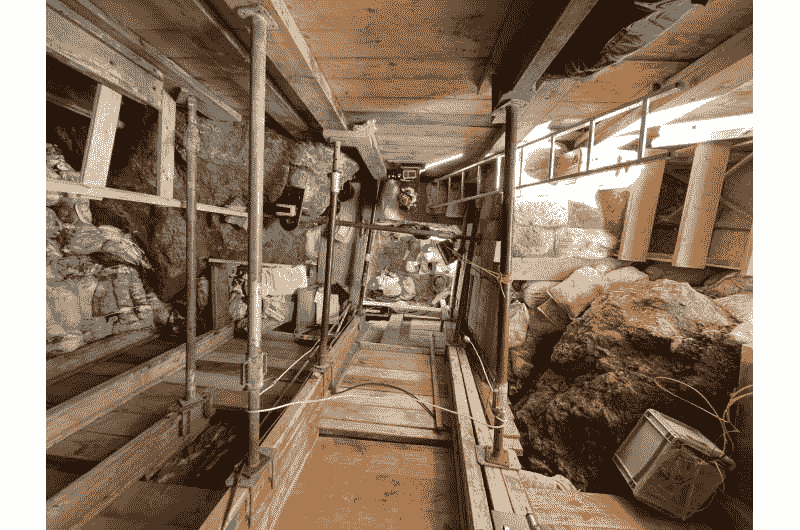
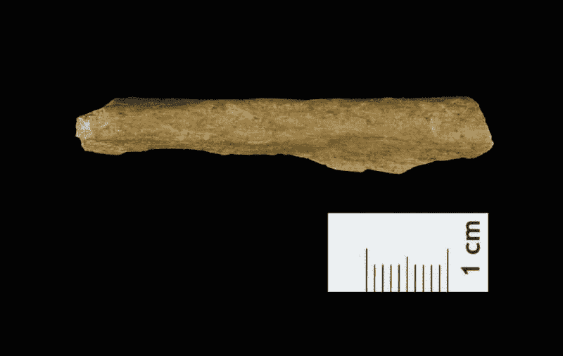
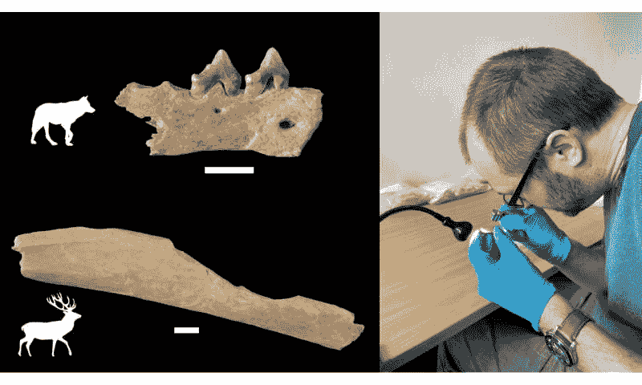

<!--yml
category: 未分类
date: 2024-05-27 14:30:43
-->

# Neanderthals and humans lived side by side in Northern Europe 45,000 years ago, genetic analysis finds

> 来源：[https://phys.org/news/2024-01-neanderthals-humans-side-northern-europe.html](https://phys.org/news/2024-01-neanderthals-humans-side-northern-europe.html)

Excavating the LRJ layers 8 meters deep at Ranis was a logistical challenge and required elaborate scaffolding to support the trench. Credit: Marcel Weiss, License: CC-BY-ND 4.0

A genetic analysis of bone fragments unearthed at an archaeological site in central Germany shows conclusively that modern humans—Homo sapiens—had already reached Northern Europe 45,000 years ago, overlapping with Neanderthals for several thousand years before the latter went extinct.

The findings establish that the site near Ranis, Germany, which is known for its finely flaked, leaf-shaped stone tool blades, is among the oldest confirmed sites of modern human Stone Age culture in north central and northwestern Europe.

The evidence that Homo sapiens and Homo neanderthalensis lived side by side is consistent with genomic evidence that the two species occasionally interbred. It also feeds the suspicion that the invasion of Europe and Asia by modern humans some 50,000 years ago helped drive Neanderthals, which had occupied the area for more than 500,000 years, to extinction.

The genetic analysis, along with an archaeological and [isotopic analysis](https://phys.org/tags/isotopic+analysis/) and radiocarbon dating of the Ranis site, are detailed in a trio of papers appearing in the journals *Nature* and *Nature Ecology and Evolution*.

The stone blades at Ranis, referred to as leaf points, are similar to [stone tools](https://phys.org/tags/stone+tools/) found at several sites in Moravia, Poland, Germany and the United Kingdom. These tools that are thought to have been produced by the same culture, referred to as the Lincombian–Ranisian–Jerzmanowician (LRJ) culture or technocomplex. Because of previous dating, the Ranis site was known to be 40,000 years old or older, but without recognizable bones to indicate who made the tools, it was unclear whether they were the product of Neanderthals or Homo sapiens.

The new findings demonstrate that "Homo sapiens made this technology, and that Homo sapiens were this far north at this time period, which is 45,000 years ago," said Elena Zavala, one of four first authors of the *Nature* paper and a Miller Research Fellow at the University of California, Berkeley. "So these are among the earliest Homo sapiens in Europe."

Zavala was a Ph.D. student at the Max Planck Institute for Evolutionary Anthropology (MPI-EVA) in Leipzig in 2018 when she first began working on the project, which was a major effort spearheaded by Jean-Jacque Hublin, former director of the institute and a professor at the Collège de France in Paris.

"The Ranis cave site provides evidence for the first dispersal of Homo sapiens across the higher latitudes of Europe. It turns out that stone artifacts that were thought to be produced by Neanderthals were, in fact, part of the early Homo sapiens toolkit," Hublin said.

"This fundamentally changes our previous knowledge about the period: Homo sapiens reached northwestern Europe long before Neanderthal disappearance in southwestern Europe."

Human bone fragment from the new excavations at Ranis. Credit: Tim Schüler TLDA, License: CC-BY-ND

**Bones from maternal relatives?**

Zavala conducted the [genetic analysis](https://phys.org/tags/genetic+analysis/) of hominid bone fragments from the new and deeper excavations at Ranis between 2016 and 2022 and from earlier excavations in the 1930s. Because the DNA in ancient bones is highly fragmented, she employed special techniques to isolate and sequence the DNA, all of it mitochondrial DNA (mtDNA) that is inherited solely from the mother.

"We confirmed that the skeletal fragments belonged to Homo sapiens. Interestingly, several fragments shared the same mitochondrial DNA sequences—even fragments from different excavations," she said.

"This indicates that the fragments belonged to the same individual or their maternal relatives, linking these new finds with the ones from decades ago."

The bone fragments were initially identified as human through analysis of bone proteins—a field called paleoproteomics—by another first author, Dorothea Mylopotamitaki, a doctoral student at the Collège de France and formerly of MPI-EVA.

By comparing the Ranis mitochondrial DNA sequences with mtDNA sequences obtained from human remains at other paleolithic sites in Europe, Zavala was able to construct a family tree of early Homo sapiens across Europe. All but one of the 13 Ranis fragments were quite similar to one another and, surprisingly, resembled mtDNA from the 43,000-year-old skull of a woman discovered in a cave at Zlatý kůň in the Czech Republic. The lone standout grouped with an individual from Italy.

"That raises some questions: Was this a single population? What could be the relationship here?" Zavala said. "But with mitochondrial DNA, that's only one side of the history. It's only the maternal side. We would need to have nuclear DNA to be able to start looking into this."

 partial bifacial blade point characteristic of the LRJ; 2) at Ranis the LRJ also contains finely made bifacial leaf points. Credit: Josephine Schubert, Museum Burg Ranis, License: CC-BY-ND 4.0")

Stone tools from the LRJ at Ranis. 1) partial bifacial blade point characteristic of the LRJ; 2) at Ranis the LRJ also contains finely made bifacial leaf points. Credit: Josephine Schubert, Museum Burg Ranis, License: CC-BY-ND 4.0

**A transitional site between Middle and Upper Paleolithic**

Zavala specializes in the analysis of DNA found in long-buried bones, on bone tools and in sediment. Her search through sediment from various levels of the Ranis excavation turned up DNA from a broad array of mammals, but none from hominids.

The analysis, combined with morphological, isotopic and proteomic analysis of bone fragments, paints a picture of the environment at that time and of the diet of both humans and animals that occupied the cave over the millennia.

The presence of reindeer, cave bear, wooly rhinoceros and horse bones, for example, indicated cold climatic conditions typical of steppe tundra and similar to conditions in Siberia and northern Scandinavia today, and a human diet based on large terrestrial animals. The researchers concluded that the cave was used primarily by hibernating cave bears and denning hyenas, with only periodic human presence.

"This lower-density archaeological signature matches other Lincombian–Ranisian–Jerzmanowician sites and is best explained by expedient visits of short duration by small, mobile groups of pioneer H. sapiens," according to one of the papers published in *Nature Ecology and Evolution*.

"This shows that even these earlier groups of Homo sapiens dispersing across Eurasia already had some capacity to adapt to such harsh climatic conditions," said Sarah Pederzani, a postdoctoral fellow at the University of La Laguna in Spain, who led the paleoclimate study of the site.

"Until recently, it was thought that resilience to cold-climate conditions did not appear until several thousand years later, so this is a fascinating and surprising result."

The Ranis site, called Ilsenhöhle and located at the base of a castle, was initially excavated mainly between 1932 and 1938\. The leaf points found there were eventually assigned to the final years of the Middle Paleolithic period—between about 300,000 and 30,000 years ago—or the beginning of the Upper Paleolithic, which began around 50,000 years ago.

Because of the importance of the Ranis site for understanding the LRJ technocomplex and the transition from the Neanderthal-associated late Middle Paleolithic to the modern human Upper Paleolithic in central Europe, Hublin and his team decided to re-excavate the site using modern tools of archaeology.

The new excavations extended to bedrock, about 8 meters below the surface, and involved removing a rock—likely fallen from the cave ceiling—that had halted the previous excavation. Here, Hublin's team uncovered chips from flint tools and a quartzite flake consistent with the LRJ technocomplex.

Subsequent proteomic analysis of thousands of recovered bone chips confirmed that four were from hominids. Of bone chips uncovered during the 1930s excavations, nine were from hominids.

Zavala's DNA analysis confirmed that all 13 [bone fragments](https://phys.org/tags/bone+fragments/) came from Homo sapiens.

*   

    Analysis of over 1000 animal bones from Ranis showed that early Homo sapiens processed the carcasses of deer but also of carnivores, including wolf. Credit: Geoff M. Smith

*   

    Proteomic extraction from archaeological bone fragments is performed in a sterilized environment to avoid modern contamination. Credit: Dorothea Mylopotamitaki

**A revised settlement history of Northern Europe**

The team also carried out radiocarbon dating of human and animal bones from different layers of the site to reconstruct the site's chronology, focusing on bones with traces of human modifications on their surfaces, which links their dates to human presence in the cave.

"We found very good agreement between the radiocarbon dates from the Homo sapiens bones from both excavation collections and with modified animal bones from the LRJ layers of the new excavation, making a very strong link between the human remains and LRJ. The evidence suggests that Homo sapiens were sporadically occupying the site from as early as 47,500 years ago," said another first author, Helen Fewlass, a former Max Planck researcher who is now a European Molecular Biology Organization (EMBO) Postdoctoral Fellow at the Francis Crick Institute in London.

"The results from the Ilsenhöhle in Ranis fundamentally changed our ideas about the chronology and settlement history of Europe north of the Alps," added Tim Schüler of the Thuringian State Office for the Preservation of Historical Monuments and Archaeology in Weimar, Germany.

Among other co-authors of the *Nature* paper are co-first author Marcel Weiss of the Friedrich-Alexander-Universität Erlangen-Nürnberg and Shannon McPherron of MPI-EVA, who co-led the Ranis excavation with Hublin, Schüler and Weiss. Zavala, in addition to being co-first author of the *Nature* paper, co-authored the two papers in *Nature Ecology and Evolution*.

**More information:** Jean-Jacques Hublin, Homo sapiens reached the higher latitudes of Europe by 45,000 years ago, *Nature* (2024). [DOI: 10.1038/s41586-023-06923-7](https://dx.doi.org/10.1038/s41586-023-06923-7). [www.nature.com/articles/s41586-023-06923-7](https://www.nature.com/articles/s41586-023-06923-7)

Stable isotopes show Homo sapiens dispersed into cold steppes ~45,000 years ago at Ilsenhöhle in Ranis, Germany, *Nature* (2024). [DOI: 10.1038/s41559-023-02318-z](https://dx.doi.org/10.1038/s41559-023-02318-z) , [www.nature.com/articles/s41559-023-02318-z](https://www.nature.com/articles/s41559-023-02318-z)

The ecology, subsistence and diet of ~45,000-year-old Homo sapiens at Ilsenhöhle in Ranis, Germany, *Nature Ecology & Evolution* (2024). [DOI: 10.1038/s41559-023-02303-6](https://dx.doi.org/10.1038/s41559-023-02303-6) , [www.nature.com/articles/s41559-023-02303-6](https://www.nature.com/articles/s41559-023-02303-6)

William E. Banks, Stone tools in northern Europe made by Homo sapiens 45,000 years ago, *Nature* (2024). DOI: 10.1038/d41586-024-00072-1 , [doi.org/10.1038/d41586-024-00072-1](https://doi.org/10.1038/d41586-024-00072-1)

**Citation**: Neanderthals and humans lived side by side in Northern Europe 45,000 years ago, genetic analysis finds (2024, January 31) retrieved 27 May 2024 from https://phys.org/news/2024-01-neanderthals-humans-side-northern-europe.html

This document is subject to copyright. Apart from any fair dealing for the purpose of private study or research, no part may be reproduced without the written permission. The content is provided for information purposes only.