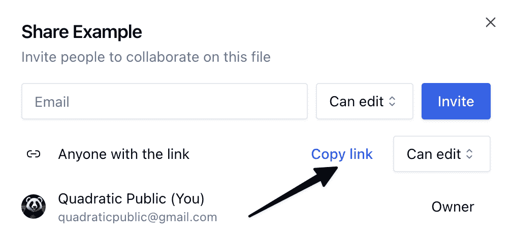

<!--yml
category: 未分类
date: 2024-05-27 14:30:25
-->

# Quadratic is now multiplayer | Blog | Quadratic - Technical spreadsheet with Python, SQL, and AI.

> 来源：[https://www.quadratichq.com/blog/2024-01-28-the-multiplayer-spreadsheet](https://www.quadratichq.com/blog/2024-01-28-the-multiplayer-spreadsheet)

Quadratic has officially become a *multiplayer application*! Feel free to [try for yourself](https://app.quadratichq.com/files/create) in your sheets.

Quadratic is one of the first data science applications that’s a true multiplayer experience, allowing you to collaborate on data problems with colleagues in real-time.

## Multiplayer presence

See who is in the sheet, which cells they occupy, and what actions they are performing. (Note: collaborative code editing will be added in the near future. For now you’ll have status indicators on occupied cells. Once a user exits a cell, you can edit where they left off.)

 <https://media.quadratichq.com/website/blog/multiplayer-1.mp4> 

## Collaborative editing and user following

User edits update in real-time for all users in the sheet. Click any teammate’s avatar to highlight and follow them through the spreadsheet.

 <https://media.quadratichq.com/website/blog/multiplayer-2.mp4> 

## Manage file permissions

Share a file with your team by creating a sheet and clicking the “Share” button in the top right on the interface.

Use the dialog to invite users to your file by their email. Once invited, they will receive an email with a link to get started. This is the most secure form of file sharing, as it keeps the file accessible only to **invited email addresses**.

Alternatively, you can share a public link to a file. The public link can be configured so anyone with the link can either **view** or **edit** the file.

Add and remove users as you see fit. With no upper bound to invites and user presence in a sheet, you can grow your sheets right alongside the growth of your team.

Quadratic Multiplayer is officially live. [Start building](https://app.quadratichq.com/files/create) your collaborative spreadsheets in Quadratic!