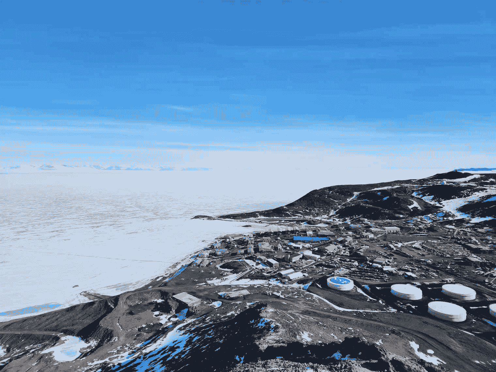
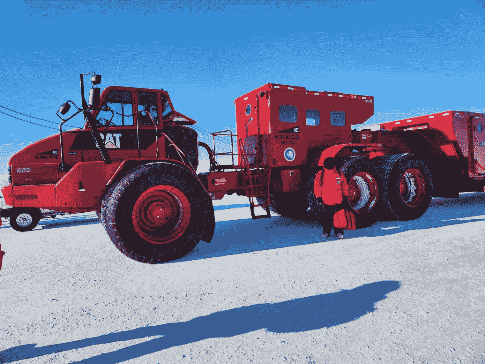
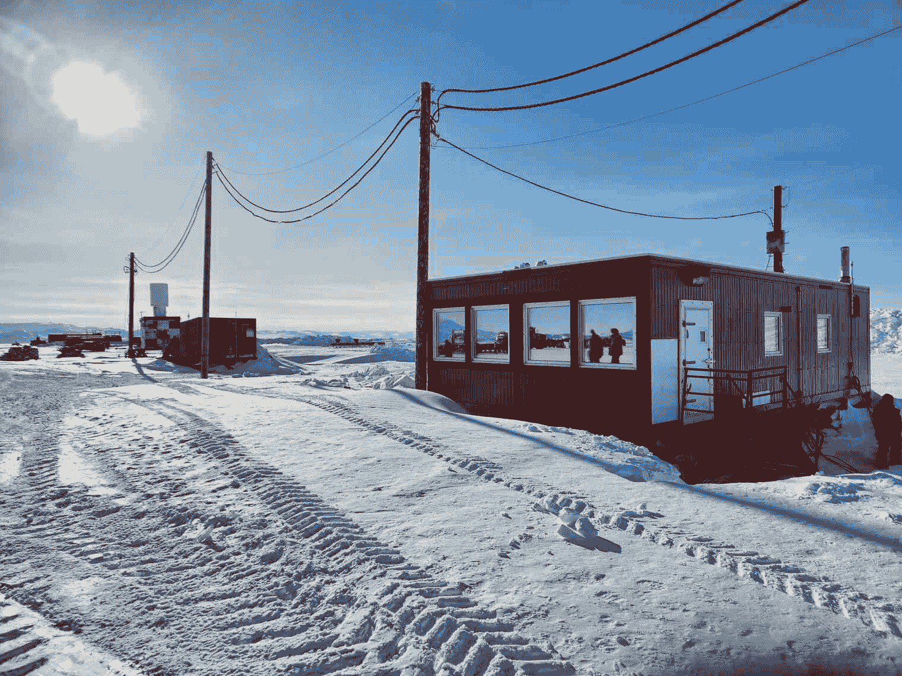
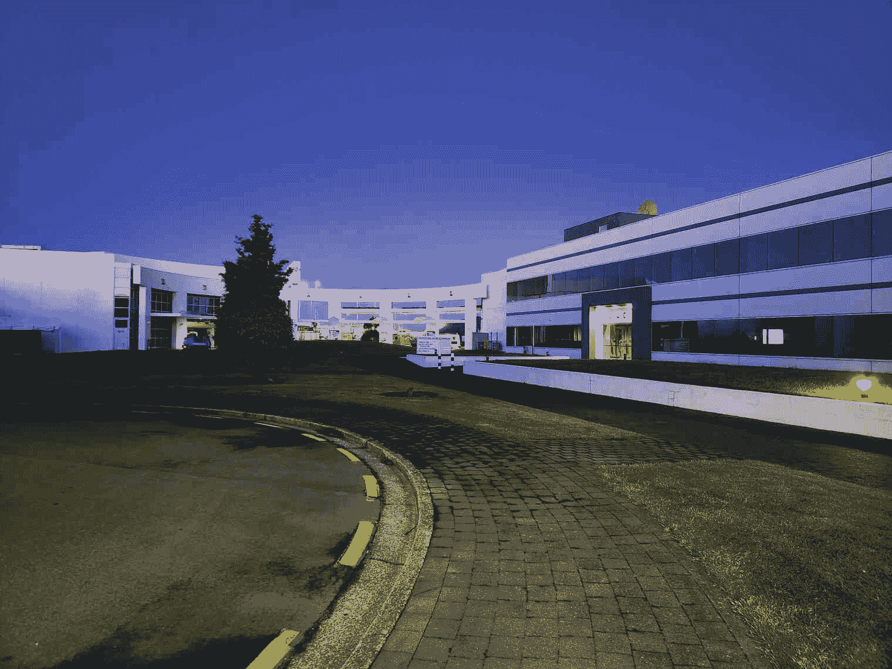
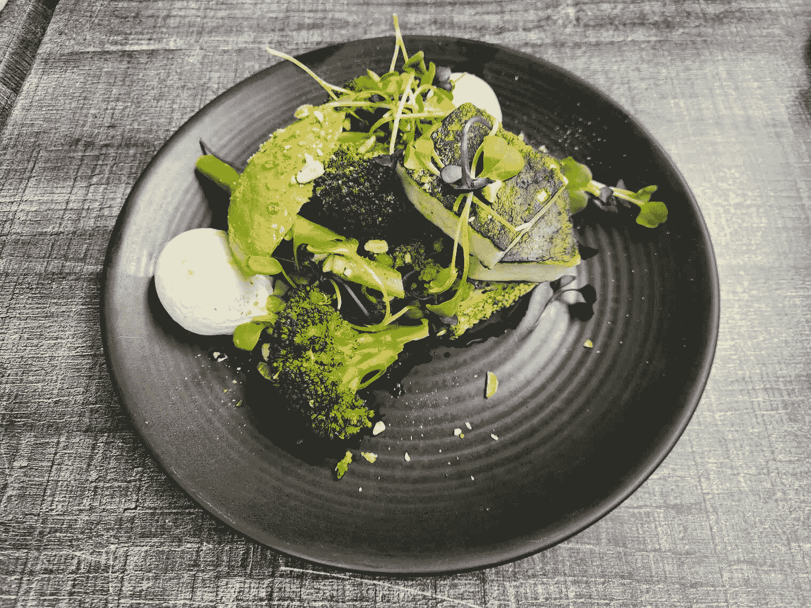
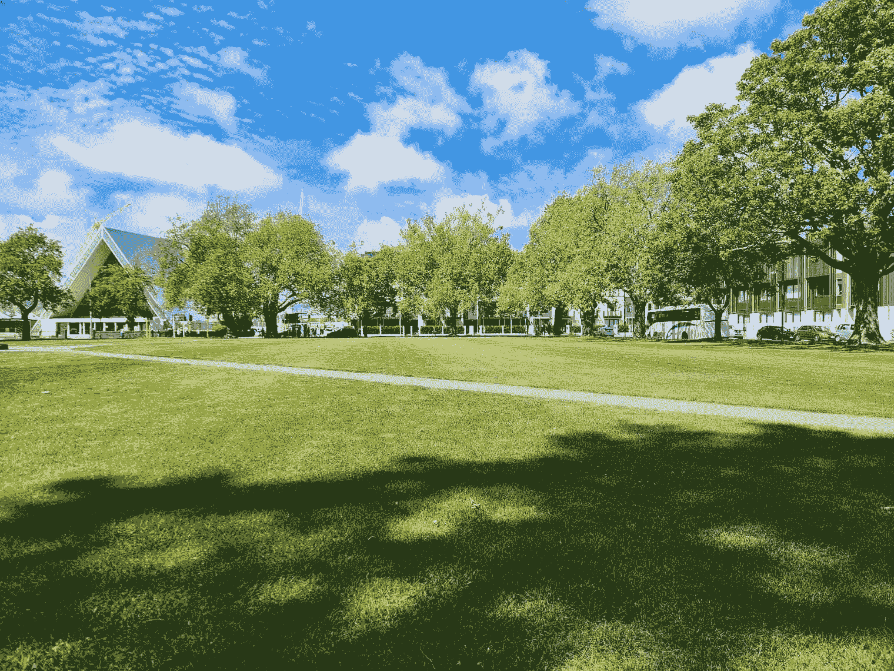
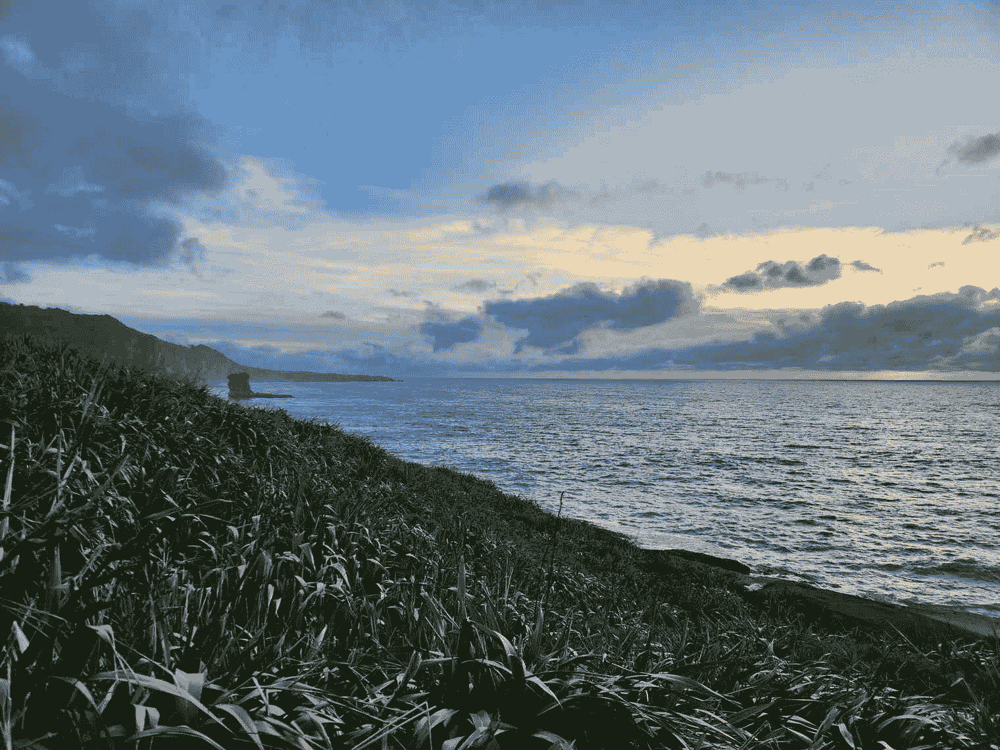
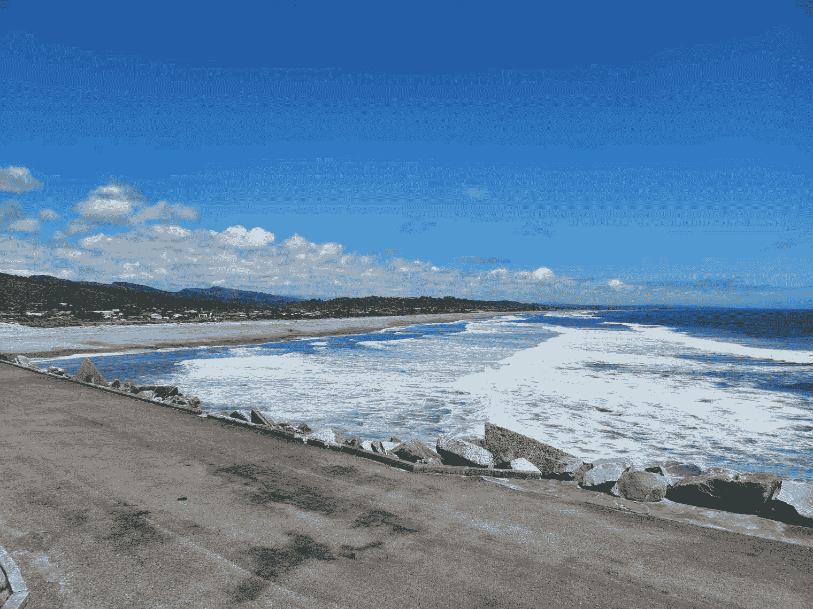
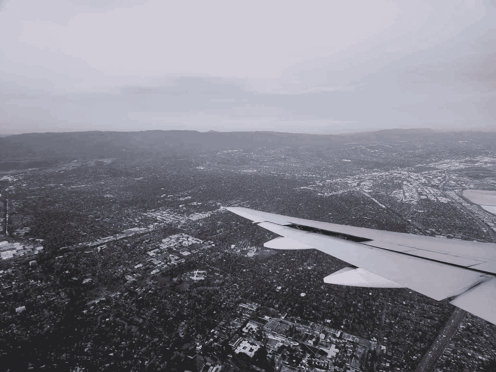
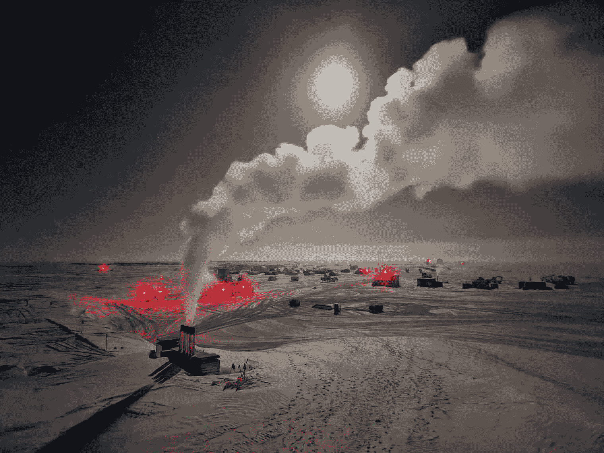

<!--yml
category: 未分类
date: 2024-05-27 14:30:04
-->

# Redeployment Part Three

> 来源：[https://brr.fyi/posts/redeployment-part-three](https://brr.fyi/posts/redeployment-part-three)

*This is the third and final part of a three-part series. Check out [part one](/posts/redeployment-part-one) and [part two](/posts/redeployment-part-two) if you haven’t already!*

* * *

Hello and welcome back! We’re going to pick up right where we left off. In [Redeployment Part Two](/posts/redeployment-part-two), we got our first flight of the season and handed over responsibilities to the summer crew. Then, finally, I departed South Pole for McMurdo.

# Back in McMurdo

After just over 3 hours in the air, our plane landed at Williams Field in McMurdo and parked for the “night”:

 [<picture></picture> *Our LC-130 parked at McMurdo.*](/media/redeployment-part-three/lc130-mcmurdo-01.jpg) 

There are no direct flights from Pole to Christchurch – everyone connects through McMurdo.

Most of the time, people departing Pole have to spend a few hours or even a few days in McMurdo. This is based on flight schedules and delays. Efforts to schedule “straight through” flights, where you transfer to a Christchurch-bound plane right on the airfield, are usually thwarted by weather or other factors. Sometimes it works out, but most of the time it does not.

In our case, we were scheduled to depart McMurdo the following afternoon, which meant spending the night.

Our ride from Williams Field into McMurdo was a “Delta”. These are McMurdo’s oldest still-operating passenger vehicles. The ride into town was about 40 minutes.

 [<picture></picture> *Our ride into town for the night -- one of McMurdo's oldest personnel transport vehicles, known as a "Delta".*](/media/redeployment-part-three/delta-01.jpg) 

When we landed in McMurdo, we started breathing sea-level air for the first time in a very long time. After living at [10,000 feet](/posts/pressure-altitude) for a year, and then suddenly arriving at sea level, you immediately notice differences. Most importantly – you feel like a superhero. The air is so thick and full of oxygen! The effect only lasts a few days, but it’s a good time to tackle any hikes in McMurdo. It was fun to scramble up Observation Hill with this newfound, sea-level energy.

 [<picture></picture> *McMurdo's Observation Hill, on my brief one-day layover.*](/media/redeployment-part-three/mcmurdo-observation-hill-01.jpg) 

It was great being back in McMurdo, if only for a day. I got to catch up with friends from my time in McMurdo last summer. Many of us descend on Antarctica from far-flung places, and it’s not always guaranteed we’ll see each other again in Real Life. I tried to make the most of my brief stop in town.

 [<picture></picture> *Construction in McMurdo! Framing for a new building on the site of the former Dorm 203. This wasn't here last summer when I left for Pole!*](/media/redeployment-part-three/mcmurdo-construction-01.jpg) 

It was surreal **still** being in Antarctica, and meeting up with folks again. Most of my friends had left, had time off, and were now *back for more*, here for a second season. I even knew people who had left, come back, and then had already *left again*. Meanwhile, I was still on-continent. I was just now, finally, getting ready to leave after my first mega-season.

There are pros and cons to experiencing Antarctica the way I did. I was fortunate that I got to try out much of what the program has to offer, all in one single, very long season. The only primary USAP Antarctic sites I haven’t seen yet are [Palmer Station](https://www.nsf.gov/geo/opp/support/palmerst.jsp) and the [research vessels](https://www.nsf.gov/geo/opp/support/ships.jsp), currently the R/V Laurence M. Gould and the R/V Nathaniel B. Palmer.

I arrived in Antarctica at [Winfly](/posts/mcmurdo-arrival), and I got to experience McMurdo winter. Winter transitioned into summer, and I got to witness the majestic splendor of the warm, sunny, and [muddy](/posts/mud-murdo) peak season at McMurdo. I [flew to the South Pole](/posts/south-pole-arrival) at the peak of summer, and I experienced the bustling chaos as the station frantically prepared for the upcoming winter. When the [last flight](/posts/last-flight-out) departed, the station slowed down for winter. After [sunset](/posts/sunset), Pole entered a long [polar night](/posts/polar-night). I saw [sunrise](/posts/redeployment-part-one) at Pole and I saw the station [reopen](/posts/redeployment-part-two) for summer. Now I was back in McMurdo, finally ready to depart.

Most people… do not do all of this at once. I was fortunate that the opportunity arose for me to do this. I was fortunate that my life circumstances happened to line up in a way that I was able to accept. 14 months on ice is a long time. It’s a long time to be away from friends, family, and “real life”. It’s a long time to commit to a single, strange place. I do not regret taking the opportunity. But, for anyone considering something similar, please do not make this decision lightly.

# Phoenix Airfield

On the evening of November 17, 2023, I departed McMurdo. I was headed out to Phoenix Airfield, where I would catch my flight out of Antarctica.

Our ride to the airport was something much different – we rode out in the Kress. The Kress is a gigantic transport vehicle, one of McMurdo’s newest. It’s designed for moving dozens of people between far-flung McMurdo sites. These sites include airfields, as well as other infrastructure out on the ice such as the [Long Duration Balloon (LDB)](https://www.nasa.gov/missions/scientific-balloons/nasa-scientific-balloons-ready-for-flights-over-antarctica/) site.

 [<picture></picture> *The Kress, our gigantic transport vehicle to Phoenix Airfield. 6'2" brr.fyi author for scale.*](/media/redeployment-part-three/kress-01.jpg) 

 [<picture></picture> *Another view of the Kress, showing its gigantic passenger transport compartment.*](/media/redeployment-part-three/kress-02.jpg) 

This was my first time seeing Phoenix Airfield in the “daytime”. Recall that when I [arrived](/posts/mcmurdo-arrival) in McMurdo from Christchurch in August 2022, it was dark out.

 [<picture></picture> *The passenger terminal at Phoenix Airfield.*](/media/redeployment-part-three/phoenix-passenger-terminal-01.jpg) 

# Departing Antarctica

Our ride back to Christchurch was an Italian Air Force C-130J. There are a number of national Antarctic programs in this region, besides just the United States Antarctic Program. Most of them use Christchurch as their gateway city and Phoenix Airfield as their intercontinental Antarctic runway. It’s common for programs to share infrastructure. Sometimes USAP will fly personnel for other national Antarctic programs on our flights, and sometimes other programs will fly USAP personnel.

 [<picture></picture> *Boarding our aircraft from McMurdo to Christchurch -- an Italian Air Force C-130J.*](/media/redeployment-part-three/italian-c130j-01.jpg) 

And with that, we were off! We departed Antarctica at 9:22pm on November 17, 2023\. This marked 446 days since I arrived on-continent on August 28, 2022.

What an adventure!

# Christchurch

At just after 4:00am, on the morning of November 18, 2023, our C-130J arrived at Christchurch International Airport. Taxiing to an unloading area was short, but it felt like an eternity. We were tired from a long flight, but we were also giddy with excitement about finally being back in the Real World.

It was dark, but it was warm. And most importantly it was *humid*. When we stepped off the plane, we could smell rain, dirt, and living things, for the first time in over a year.

 [<picture></picture> *First thing we saw upon arrival in Christchurch -- a bus, to take us to the airport.*](/media/redeployment-part-three/christchurch-bus-01.jpg) 

When you arrive in Christchurch from Antarctica, you are required to clear customs and immigration. The exact nuance of New Zealand immigration law, as it applies to US Antarctic personnel, is ***far*** outside the scope of this post. Suffice to say, the first order of business was to get us all processed.

 [<picture></picture> *Christchurch airport, heading toward customs at 4:30am. Our first Real-Life Building. Truly a surreal re-introduction into modern society.*](/media/redeployment-part-three/christchurch-customs-01.jpg) 

There was a section on the traveler form that asked *“Overseas Port where you boarded THIS aircraft/ship”*. In the absence of any clarifying instruction, I just wrote “Antarctica”. It’s a moot point, because we had a special customs agent show up just for us (customs isn’t normally open at this time). They were well aware that we had all come from Antarctica.

Still, it’s amusing when I think about this form being filed in a drawer somewhere at NZ Immigration. We did, indeed, arrive from “overseas”. Far, far overseas, from a world that, already, had started fading from our minds. *Did we* ***really*** *just come from* ***Antarctica****?*

 [<picture></picture> *New Zealand Traveler Declaration form.*](/media/redeployment-part-three/traveler-declaration-form-01.jpg) 

Once we were through customs, we proceeded to the United States Antarctic Program’s Clothing Distribution Center (CDC). We were all [issued](/posts/flight-perhaps) Extreme Cold Weather gear before we departed for Antarctica, and we returned it all now that we were done. This clothing is property of the program, and it gets cleaned and re-issued to new staff.

 [<picture></picture> *Returning our issued Extreme Cold Weather (ECW) gear at the USAP CDC in Christchurch.*](/media/redeployment-part-three/clothing-pile-01.jpg) 

Finally, we were issued our complimentary hotel reservation information. Most of us were taking personal travel in New Zealand. This travel, of course, isn’t paid for by the program. The program covers one night in a hotel, for us to have a soft landing and get our bearings. This is the same thing that they offer to people who are flying straight home, known as “First Available Air”, or “FAA”.

Luckily for us, because we arrived so late, we got the rest of our current night (by this time it was 5:30am), and the following night. It was good to be able to sleep in.

And with that? They turned us loose. We were done.

 [<picture></picture> *The United States Antarctic Program complex in Christchurch. Home of the CDC as well as other support and administrative buildings. Pictured here, early morning on November 18, 2023, after we had all just completed returning our ECW clothing.*](/media/redeployment-part-three/usap-complex-christchurch-01.jpg) 

We all groggily stood in line to check into our hotel at 5:30am. We had just spent 7 hours on a military plane. We had departed a strange land, full of 24x7 sunlight, people in puffy coats, and US Antarctic Program logos everywhere. This had been our reality for over a year.

Suddenly, we found ourselves listening to smooth jazz, in the sleek lobby of an airport hotel, as the hotel receptionist talked about continental breakfast, check-out times, the hotel wifi password, public transit, and points of interest around town.

 [<picture></picture> *Hallway at my hotel. Is this real life? Did I really just spend 14 months in Antarctica?*](/media/redeployment-part-three/hotel-hallway-01.jpg) 

We were back in civilization, back in the real world. For ASC support staff, our contracts ended the day we landed in Christchurch after departing the ice. We immediately stopped receiving a salary. Our health insurance was paid through the end of the month. I went from living and working in Antarctica, into my Christchurch hotel, and then… *that was it*. I was suddenly on my own, on vacation, in Christchurch.

 [<picture></picture> *Back the next day, for some quick photos of the Antarctic Passenger Terminal during the daylight.*](/media/redeployment-part-three/christchurch-passenger-terminal-01.jpg) 

 [<picture></picture> *The USAP warehouse in Christchurch.*](/media/redeployment-part-three/christchurch-warehouse-01.jpg) 

# Personal Travel

I spent my leisure time in New Zealand eating fresh fruit and vegetables nonstop. I averaged about three flat whites per day, made from fresh coffee and real milk.

 [<picture></picture> *Real life, real coffee. Fresh beans, fresh New Zealand milk. Pure bliss, after 14 months of expired beans and powdered milk.*](/media/redeployment-part-three/new-zealand-latte-01.jpg) 

 [<picture></picture> *Delicious and abundant fresh food in Christchurch, after a long period without in Antarctica.*](/media/redeployment-part-three/christchurch-fresh-food-01.jpg) 

My translucent Antarctican skin, fresh off an entire season of darkness, and normally covered by 30 lbs of clothing regardless, did not survive first contact with the New Zealand sun. I almost immediately got a sunburn.

 [<picture></picture> *Sun, warmth, blue sky, trees, and birds. Strolling casually around Christchurch.*](/media/redeployment-part-three/christchurch-sun-01.jpg) 

Christchurch, and Real Life, very quickly began to feel *normal*, even after being away for so long. A group of us met up for dinner. We ate in a restaurant, went to a bar, called a taxi, and navigated through day-to-day city life. We rode trains. We hiked through mountains and forests. We relaxed on beaches.

 [<picture></picture> *A stream, at Arthur's Pass, New Zealand.*](/media/redeployment-part-three/arthurs-pass-stream-01.jpg) 

 [<picture></picture> *Sunset in Punakaiki, New Zealand.*](/media/redeployment-part-three/sunset-punakaiki-01.jpg) 

 [<picture></picture> *Ocean view in Greymouth, New Zealand.*](/media/redeployment-part-three/greymouth-01.jpg) 

# San Francisco

After two weeks of much-needed rest and relaxation in New Zealand, I flew back home to San Francisco. This flight was paid for by the program, fulfilling their final obligation to return me to my Airport of Departure (AOD). On December 1, I departed Christchurch at 12:00 noon. Thanks to the magic of time zones, I arrived in San Francisco, also on December 1, at 7:00am.

 [<picture></picture> *Descending toward San Francisco International Airport, at 6:48am on December 1, 2023.*](/media/redeployment-part-three/san-francisco-01.jpg) 

I landed, and I took [BART](https://www.bart.gov/) home to my apartment.

 [<picture></picture> *Riding BART home from the airport to my apartment.*](/media/redeployment-part-three/bart-01.jpg) 

My apartment was just how I left it, back before I started this wild journey, on August 12, 2022, when I [departed San Francisco](/posts/travel-begins) for Christchurch, Antarctica, and the strangest 16 months of my life.

It was surprising to me how… *normal* it felt to get back to real life. I had just completed *14.5 months* on the ice. For *more than a year*, I worked, ate, slept, showered, relaxed, laughed, and cried, all at the whim of a federal government agency and its designated contractors, almost all under one roof, at the bottom of the world. We certainly had personal autonomy, but it was within a defined framework. It was at a small, isolated location.

Sometimes I’d have a realization that I was doing something for the first time since I had left home, 16 months earlier. First time pumping gas. First time ringing a doorbell. First time going to a grocery store. First time swimming. Each of these instances brought with it a small feeling of novelty, but it didn’t amount to much. It took conscious effort to remember that I was pumping gas for the first time in 16 months. It felt normal.

I was back in my real life, and although I put it on hold for Antarctica, it was waiting for me when I got back. Antarctica was a a different world, a radical departure from my normal reality. It was so different, in fact, that I simply could not merge the two realities into one. I had my real life, and I had my Antarctica life. When my Antarctica life finished, I resumed my real life.

# Conclusion

I hope everyone enjoyed following along on this journey. I certainly enjoyed writing about the experience.

Truth be told, when I started this blog, I was writing for an audience of about 6 people, friends and family back home. At some point in November 2022, this blog took off in popularity. I wasn’t expecting this, but it has been a lot of fun writing something that has brought joy to so many people.

I appreciate everyone who reached out along the way. People wrote to me from other Antarctic stations. People recounted their own Antarctic adventures from years or decades in the past. Folks with upcoming McMurdo and Pole contracts reached out to ask for advice.

So, with that, I’ll leave you with my favorite photo I took all season. This is from May 8, 2023, taken off the back deck of the A1 berthing pod. It shows our power plant and all the backyard outbuildings. Just out of frame to the left is the geographic South Pole marker. It was -70°F. The only light was from the moon. If you walked out just a few hundred feet from station, it was pindrop quiet. The closest next inhabited station was hundreds of miles away. Truly a different world, and one that I’m lucky to have experienced.

 [<picture></picture> *Backyard during Winter 2023 at the South Pole.*](/media/redeployment-part-three/pole-winter-01.jpg) 

*This is the third and final part of a three-part series. Check out [part one](/posts/redeployment-part-one) and [part two](/posts/redeployment-part-two) if you haven’t already.*