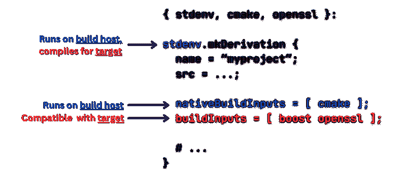

<!--yml
category: 未分类
date: 2024-05-27 14:28:33
-->

# Separation of Concerns in Cross-Compilation

> 来源：[https://nixcademy.com/2024/01/30/cross-compilation-with-nix/](https://nixcademy.com/2024/01/30/cross-compilation-with-nix/)

# Separation of Concerns in Cross-Compilation


📆

January 30, 2024 by Jacek Galowicz

Managing complex C++ projects across multiple platforms often ends up being a frustrating and time-consuming task. However, this common challenge faced also by the most experienced software developers doesn’t have to be an inevitable struggle. Imagine a world where cross-compilation is not just feasible, but also efficient and less cumbersome. I have noticed in several past friendly discussions with other engineers that many are not at all familiar with the type of Separation of Concerns that Nix didn’t invent but also uses.

The earlier article [*C++ with Nix in 2023, Part 2: Package Generation and Cross-Compilation*](../../../../2023/11/16/cpp-with-nix-in-2023-part-2-package/) concentrated more on the creation of a new package from scratch and explaining `mkDerivation` etc., while in this article, we’re going to look from a little bit higher level at how cross-compilation is handled so elegantly in Nix, that it can improve overall project health and development pace and at the same time reduce costs.

## What makes Cross-Compilation Hard?

Cross-compilation should in general not be hard: We just need a compiler whose backend generates code for the target architecture and let it link the compiled code against libraries that are also compiled for that target architecture.

So why does it turn out to be hard whenever it’s being done for huge real-life projects?

It typically goes downhill in steps that have less to do with cross-compilation itself but more with managing dependencies:

*   **Product**: We assume a project that is already huge and has a complicated build system
*   **Cross-compiler**: We need one
*   **External libraries**: We need cross-compiled variants of them
*   **Distribution**: If we use shared libraries, we will need to provide a way to package those along with the app. Alternatively, we use static linking to get one big binary that’s easier to distribute.

The steps are then:

1.  The cross-compiler is now obtained in one of two ways:
    1.  Someone creates a compiler bootstrap script that aims to be Linux-distro independent. This script will go into a [Dockerfile](https://docs.docker.com/engine/reference/builder/) or right into the build system.
    2.  A cross-compiler package is used. As this ties the project to a certain package distribution, we are now forced to this distro or use Docker.
2.  The package manager doesn’t let us install native and foreign-target libraries on the same system. And developers also use different package managers. So we typically end up building external libraries for the target platform ourselves:
    1.  These go into the same Docker image.
    2.  Or the project build system also builds them for us.
3.  As we do not have package distribution infrastructure, we typically go the static building route and end up also fiddling static linkage into our project build system.

The result is then one of these two:

1.  A huge, complicated, monolithic build system that manages not only the build of our actual project, but also the build of the compiler and all the libraries.
    *   It’s painful to set up and the code takes forever to compile.
    *   Only senior developers are allowed to touch the fragile parts.
    *   Complicated upgrading.
2.  A Docker image that nicely abstracts the parts away that are different from normal non-cross-compilation.

Variant *B* seems to be the cleanest, but a clean execution of it seems to be rare in the industry. At least in my experience, development teams end up creating a huge pile of complexity in the form of Variant *A*.

Especially in combination with static linking, developers often decide that the build system should only build static binaries, because maintaining both dynamic and static linking at the same time makes the build system too complex.

[CMake](https://cmake.org/) and [meson](https://mesonbuild.com/) can generally both be used correctly to keep the project description agnostic of the linking method and then simply select the method with command line parameters. However, I have not seen many big commercial real-life projects where this was still possible without much hassle.

I often asked myself “Why do these build systems do everything completely differently than suggested in the official documentation and tutorials of the build systems?” With my experience of today, I think the answer is simple:

## Separation of Concerns.

**Build systems are not designed to manage dependencies.** Not knowing it better, developers try to do it anyway. The result is hard to change, extend, maintain, and upgrade.

As promised in the introduction, we will have a look at how Nix makes it easy to change this for the better.

## The Example App

Let’s build an example app that depends on [OpenSSL](https://www.openssl.org/) and [Boost](https://www.boost.org/) at run-time. It simply reads a character stream from standard input and uses OpenSSL to calculate the [SHA256](https://en.wikipedia.org/wiki/SHA-2) hash. We use the boost dependency to stop the time - the [C++ STL](https://en.cppreference.com/w/cpp/chrono) could have done that for us, too, but then we wouldn’t have another nice dependency on a huge external lib.

The program is roughly 60 LOC short/long. I uploaded the code to this GitHub repository: [https://github.com/tfc/cpp-cross-compilation-example](https://github.com/tfc/cpp-cross-compilation-example)

Let’s call this app `minisha256sum` and write a [`CMakeLists.txt`](https://cmake.org/) file for it:

```
cmake_minimum_required(VERSION 3.27)
project(minisha256sum)

find_package(OpenSSL REQUIRED)
find_package(Boost REQUIRED COMPONENTS chrono)

add_executable(minisha256sum src/main.cpp)
target_link_libraries(minisha256sum Boost::chrono OpenSSL::SSL)
set_property(TARGET minisha256sum PROPERTY CXX_STANDARD 20)

install(TARGETS minisha256sum DESTINATION bin)
```

CMake provides good [standard facilities for finding external libraries](https://cmake.org/cmake/help/latest/command/find_package.html). This way, the build system may remain simple (it still looks relatively noisy compared to other language ecosystems because that’s how C++ build systems look like).

This project can now be built via the typical CMake dance:

```
$ mkdir build
$ cd build
$ cmake ..
$ cmake --build .
```

Let’s check if it works:

```
$ ./minisha256sum < src/main.cpp
cb8829956b86a05cd4bf374e95f4ae3928644f4b79cef82ef89529c2ef65f004 0 milliseconds
$ sha256sum < src/main.cpp
cb8829956b86a05cd4bf374e95f4ae3928644f4b79cef82ef89529c2ef65f004  -
```

It provides the same hash as the [`sha256sum` app from GNU `coreutils`](https://www.gnu.org/software/coreutils/), which should be good enough. The app is not really optimized but that will not be a matter for the rest of this article.

### Packaging it with Nix

To get a nice `nix build` and `nix run` workflow, we need to provide a few nix expressions. Let’s start with a `package.nix` that already reflects our dependency structure:

```
# file: package.nix
{ stdenv, lib, cmake, boost, openssl }:

stdenv.mkDerivation {
 name = "minisha256sum";

 src = lib.fileset.toSource {
 root = ./.;
 fileset = lib.fileset.unions [
 ./src
 ./CMakeLists.txt
 ];
 };

 nativeBuildInputs = [ cmake ];
 buildInputs = [ boost openssl ];
}
```

When cross-compiling this application, we need:

*   A compiler that runs on the build host but compiles for the target
*   CMake which runs on the host
*   Boost and OpenSSL, but built for the target

`nativeBuildInputs` means *“compile-time dependency on the building host”* and `buildInputs` means *“run-time dependency on the target”*. The [`nixpkgs` documentation describes this in more detail](https://nixos.org/manual/nixpkgs/stable/#ssec-stdenv-dependencies).

To create a buildable, installable, and runnable package from this expression, we need to apply the `callPackage` function which is a [well-known pattern in the Nix sphere](https://nixos.org/guides/nix-pills/callpackage-design-pattern): It automatically fills out all the function parameters from what’s available in `pkgs` that we can see in the first line of `package.nix`, which happen to be our dependencies.

```
minisha256sum = pkgs.callPackage ./package.nix { }
```

In the project’s `flake.nix` file, we [make this call in this line](https://github.com/tfc/cpp-cross-compilation-example/blob/main/flake.nix#L14). With this in place, we can now run it without handling the build commands manually (I’m not hiding code here: `mkDerivation` generally knows how to build CMake projects when CMake was mentioned as a dependency). After pushing it to a repository, we can even do this from a different computer without cloning the repo first:

```
$ nix build github:tfc/cpp-cross-compilation-example
$ file result/bin/minisha256sum
result/bin/minisha256sum:
ELF 64-bit LSB executable, x86-64, version 1 (GNU/Linux), dynamically linked,
interpreter /nix/store/7jiqcrg061xi5clniy7z5pvkc4jiaqav-glibc-2.38-27/lib/ld-linux-x86-64.so.2,
for GNU/Linux 3.10.0, not stripped

# Run directly over via `nix run` without building it first:

$ result/bin/minisha256sym < ~/some-file.zip
f7cb5ade7906f364a0d4d11478a4b9f25c86d0b3381a5b3907e2c49b31a00fee 3 milliseconds

$ nix run github:tfc/cpp-cross-compilation-example < ~/some-file.zip
f7cb5ade7906f364a0d4d11478a4b9f25c86d0b3381a5b3907e2c49b31a00fee 3 milliseconds
```

## Cross-Compilation

This is a quick one:

Assuming, we’re on a 64bit Intel PC, we can create multiple static/dynamic cross-compiled packages like this:

```
static = pkgs.pkgsStatic.callPackage ./package.nix { };
aarch64 = pkgs.pkgsCross.aarch64-multiplatform.callPackage ./package.nix { };
aarch64-static = pkgs.pkgsCross.aarch64-multiplatform.pkgsStatic.callPackage ./package.nix { };
```

The attributes `pkgs.pkgsStatic` and `pkgs.pkgsCross.aarch64-multiplatform` contain their own version of `callPackage`, but they come with the whole `pkgs` package list adapted for the selected target platform.

There’s also `pkgs.pkgsCross.mingwW64`, which compiles binaries for [Microsoft Windows](https://en.wikipedia.org/wiki/Microsoft_Windows) using the [minimalist GNU environment for Windows `mingw`](https://www.mingw-w64.org/).

Whenever we use one of those specialized `callPackage` implementations to call our `package.nix` function, this happens:



`pkgs.callPackage` can dissect the different kinds of dependencies

Because we structurally split the dependencies between compile-time dependencies and run-time dependencies, the cross-`callPackage` function can now fill the package dependencies with the right versions of each.

This way, the build system does not need to be educated a lot about what happens: Nix creates the correct build environment for the given package variant (similar to the approach with the clean Docker image, but only with exactly the needed dependencies and with less overhead for defining it), the build system simply uses the given compiler and locates the given dependencies via CMake/meson-specific environment variables (that have been set by Nix), and builds the project. (It also works with build system combinations like [GNU Automake/Autoconf](https://www.gnu.org/software/automake/) and [GNUMake](https://www.gnu.org/software/make/) and others)

I tested this example with the following combinations:

| `x86_64-linux` | ✅ | ✅ | ❌ | ❌ | ✅ |
| `aarch64-linux` | ✅ | ✅ | ❌ | ❌ | ✅ |
| `x86_64-darwin` | ✅ | ✅ | ✅ | ❌ | ✅ |
| `aarch64-darwin` | ✅ | ✅ | ✅ | ✅ | ✅ |

Interestingly, if we “cross-compile” from the same architecture to the same architecture on Linux, we get exactly the same package like for the native `pkgs.callPackage` version, so Nix doesn’t even bother to rebuild it.

The symbol ✅ includes static/dynamic linkage in all cases but not for Windows.

The entries with the ❌ symbol in the table are not implemented in the Nixpkgs repository. This could be done if needed. Typically, companies either implement functionality and upstream it or provide funding to make it happen.

## Summary

The demonstrated trick shows that we effectively separated the **Dependency Management** from the **Build System**. Many developers I talked to about this have never thought about this separation. The reason might be simple: Because it’s not easy to implement without a good technology for dependency management. I feel like Docker has more of a place in deployment than in development.

The advantages of this separation are huge:

*   A simpler build system that is easy to extend even for non-seniors
*   Free choice between dynamic and static linking per build system parameter
*   Wide support for compiling from/to different host architectures and operating systems
*   Not managing compiler, deps, and project in one build system makes everything *modular*:
    *   Less work with updates
    *   Faster setup time per developer
    *   Cacheable dependencies
    *   Easier reuse of individual modules in other projects

We only built binaries this time, no [container images](../../../../2023/09/04/nixos-multi-php-version-container/), [`systemd-nspawn` images](../../../../2023/08/29/nixos-nspawn/), VMs, or disk images. This is however simple to add on top.

If you want to evaluate Nix or even use it in your real projects, don’t hesitate to [give us a call](../../../../meet.html)! We have a lot of experience, especially with low-level C++ projects. Contact us and see how the complexity of your projects can be simplified.