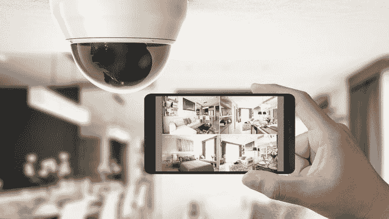

<!--yml

category: 未分类

date: 2024-05-27 14:29:09

-->

# 细胞信号和Wi-Fi干扰器是如何帮助他们抢劫家园的

> 来源：[https://www.usatoday.com/story/tech/columnist/komando/2024/02/29/thieves-using-wifi-jammer/72758559007/](https://www.usatoday.com/story/tech/columnist/komando/2024/02/29/thieves-using-wifi-jammer/72758559007/)

2月16日的晚上开始像每个普通的星期五晚上一样。我丈夫和我决定留在家里，烤鸡做沙拉吃晚餐。大约下午6:45，我们听到头顶上传来一些巨大的隆隆声。

我们走到后院，有两架警用直升机盘旋在头顶——在我们的房产上空洒下了灯光，广播里响着：“警察，你被逮捕了。站在那儿，我不会开枪。”

当我趴在院子的围栏上望去时，一群凤凰城特警队成员带着几只狗在我们的房产周围盘旋。其中一个家伙说：“是的，这里就是干扰器。”他拿起了它。我俯身在阳台上问道：“发生了什么事？”

**警察告诉我进屋去**

一名SWAT成员说：“夫人，有一个南美帮派在目标家庭实施盗窃。干扰器显示你可能是下一个目标。我们可以进入您的财产吗？”我说：“可以！”然后他问了类似这样的问题：“如果我们找到任何人，你是否愿意提起诉讼以便我们逮捕他们？”我回答：“当然愿意！”

我打开了通往我们财产和客房的车道大门，而Barry则扔了警用钥匙打开了安全门。事实证明，当帮派发现我们在家时，他们很可能把注意力转移到隔壁的房子上。我们四门之隔的一所房子就没有那么幸运了。

业主下午5点出门吃饭，5:05分收到通知说他的安全摄像头离线了。他以为是网络断了。窃贼闯入并拿走了价值25,000美元的现金和价值100,000美元的贵重物品。他们进来又出去不到10分钟。

**他们是如何逃脱的？**

这帮人在目标家庭周围放置细胞信号和Wi-Fi干扰器。这样一来，安全摄像头和手机都变得无用。凤凰城的一名警官告诉我，这帮人可能注意到我们家里没有任何问题。

我们家的安全摄像头和互联网都是有线连接的。即使窃贼试图干扰Wi-Fi信号，安全摄像头的红灯显示它们正在录制一切。我们还保留了一部座机。

但是这有多可怕？你的手机不工作。你的摄像头没有录像。好的一面是，这帮人没有带枪。如果他们被抓住，他们将在被引渡到智利前在监狱中度过大约六个月。

如果你想观看我安全摄像头拍摄到的行动，请看[Kim Komando今日视频直播](https://www.youtube.com/watch?v=k9Y-IPY9BvY&t=101s)。我非常感谢我们的警察力量。

**没有什么是随机的**

团伙事先彻底审视家庭。他们在社区内驾车，查看房地产网站上的房屋，了解主卧的位置。他们也看看有没有狗。

在凤凰城不仅仅是个问题。这种情况在全国各地都在发生。一个朋友在加州一个有门卫的社区被类似团伙抢劫了。凤凰城警察局很棒 - 他们逮捕了那晚在我社区的团伙的三名成员。

**投资科技**

我们建造了我们的家，所以为互联网安装电缆和几乎所有连接到它的设备提供了最快的连接，也不容易受到信号干扰。当然，建设后再硬布线也是可以的，但这样很昂贵且通常不现实。以下是一些选择：

◾ 无线摄像头无信号就不工作。备用尝试使用[**有线摄像头**](https://amzn.to/3OUektd)。

◾ [**带有SD卡存储的摄像头**](https://amzn.to/3wwkWb2)也很好，因为即使没有Wi-Fi，它仍然会录像。

◾ 安装[**运动感应灯**](https://a.co/d/bsbrFhc)。这样做可以让任何人更难悄悄靠近。

◾ 一个微基站（可以看作是迷你手机塔）足以在盗贼在外放置信号干扰器时保持你的连接 - [**T-Mobile**](https://amzn.to/49Lfbo3)或者[**Verizon**](https://www.verizon.com/products/verizon-lte-network-extender/)。

◾ 有亚马逊Echo吗？[**离家模式**](https://www.amazon.com/gp/help/customer/display.html?nodeId=TNirBu9nqQw3pMuwmi)可以让你控制灯光，让房子看起来有人居住。

◾ [**一款创新的电视模拟器**](https://amzn.to/3SVhgXH)会让人觉得你不在家时，有人在家看电视。

◾ 在你的财产上放置安全标志。

[**这里有两个售价为$7.99。**](https://amzn.to/3uS6jOv)

**将你的房子下线**

检查Zillow、Realtor.com和Redfin上关于你房子的照片。盗贼了解房屋布局越多，对他们越有利。这里是如何删除这些照片的方法：

**Zillow**

◾ 前往[zillow.com/sellerlanding/claimyourhome](https://www.zillow.com/sellerlanding/claimyourhome/)，输入你的地址。通过从下拉列表中选择你的名字来验证你是合法所有者。

◾ 点击**个人资料图标**，从菜单选项中选择**你的家**。点击你家的瓷砖，然后从物业页面的**业主视图**中选择**编辑事实**。

◾ 点击照片的角落上的**X**或点击单个照片然后点击**删除照片**。要删除所有图片，请点击**删除所有照片**。点击**保存更改**。

**房地产经纪人**

◾ 前往[**realtor.com/myhome**](https://www.realtor.com/myhome)，输入你的地址，然后在你房子的资料页面点击**认领你的房屋**。

◾ 登录你的个人资料，转到你的业主仪表板，在**我的家**选项卡下。点击**删除照片**按钮。

**Redfin**

◾ 创建账户并认领你的住宅后，你可以从业主仪表板进行更改。

◾ 登录[**Redfin**](https://www.redfin.com/)，并使用页面右上角下拉菜单中的您的名字进入**业主仪表板**。

◾ 点击**您的家**和**编辑照片**，然后**隐藏列表照片**。弹出时点击**是，隐藏照片**。

这还不算完。在您这样做时，最好[**在谷歌地图和苹果地图上模糊您的房屋**](https://www.komando.com/security-privacy/blur-your-home-in-google-and-apple-maps/824116/)。

**播客推荐：**[**预算Ozempic，避免退货费用和在线盗版加剧**](https://www.komando.com/episode/budget-ozempic-avoid-amazon-fees-online-piracy-amps-up/900044/)

此外，我们还有一些专业人士警告说，TikTok提示可能是你的植物的噩梦。Andrew有一个关于在交友应用上被骗的惊心动魄的故事。外面很冷，所以这里有一些保持科技暖和的顶级技巧。还有，像往常一样，听众来信。你绝对不会相信一个家伙怎么称呼我。

在[Apple, Google Podcasts, Spotify](https://podfollow.com/kim-komando-today)或您喜欢的播客播放器上查看我的播客“Kim Komando Today”。

[在这里收听播客](https://podfollow.com/kim-komando-today)或者您获取播客的任何地方。只需搜索我的姓氏“Komando”。

*在[Kim Komando Show](https://www.komando.com/)上了解所有最新的技术，这是全国最大的周末无线电谈话节目。Kim接听电话并提供关于今天数字化生活方式的建议，从智能手机和平板电脑到在线隐私和数据入侵。想要她的每日技巧、免费通讯等信息，请访问她的网站。*
